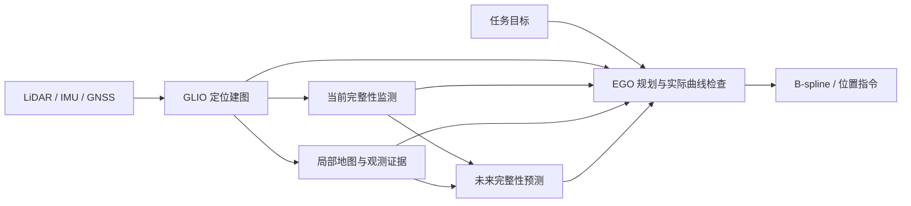

# IAP

IAP 是基于 GLIM/GTSAM 的无人机 LiDAR–IMU–GNSS 定位建图与完整性感知规划系统。它融合传感器观测，评估当前定位结果的可信程度，并预测未来位置的完整性，让规划器选择更安全、更可观测的飞行路径。

系统采用因子图估计和优化规划。目标闭环将输出通过检查的可执行轨迹，或明确的失败原因；当前阶段能力见下文。

本 README 是当前编译、运行、日志和分析的主要参考。规划器已接入同一 GridMap 的 advisory 绕行、统一有限恢复、完整实际曲线检查及最新走廊发布闸门；PL 补算显示已迁到独立进程，当前修订尚未取得四分叉闭环证据；`iap_flight` 暂不可用。流程与开发顺序见 [EGO 规划流程](docs/spec/ego_based_planning_flow.md)。

日常运行使用四个正式 launch：`glio.launch.py`、`glio_integrity.launch.py`、`iap_sim.launch.py`、`iap_flight.launch.py`。旧 Demo1–11 和阶段实验入口保留在 `launch/bp/`，用途见[历史入口说明](launch/bp/README.md)。

## 目录

- [1. 系统架构与模块](#1-系统架构与模块)
- [2. 环境与依赖](#2-环境与依赖)
- [3. 编译](#3-编译)
- [4. 快速开始](#4-快速开始)
- [5. Launch 使用指南](#5-launch-使用指南)
- [6. 配置与传感器接入](#6-配置与传感器接入)
- [7. 日志系统与运行产物](#7-日志系统与运行产物)
- [8. 结果分析](#8-结果分析)
- [9. 运行检查与常见问题](#9-运行检查与常见问题)
- [10. 目录与专题文档](#10-目录与专题文档)

## 1. 系统架构与模块

| 模块 | 职责 | 主要输出 |
|---|---|---|
| GLIO | GNSS 伪距/多普勒、IMU 与 LiDAR 的滑窗/因子图融合估计 | 位姿、地图及估计诊断 |
| Current Integrity Monitor | 基于 GNSS/LiDAR 证据监测当前位姿完整性 | 当前 PL、AL、IM、来源与有效性状态 |
| Advisory Integrity Evaluator | 预测未来位置的 GNSS/LiDAR 完整性与风险 | 同一 GridMap 中的空间 HPL/VPL、查询状态与版本 |
| Safety-aware planner | 原 EGO 后端、物理与 advisory 引导、实际曲线及发布检查 | EGO B-spline、位置指令及 PL 查询状态 |



四个模块是逻辑划分。当前完整性监测以 `iap_rosnode` 的扩展运行；未来完整性由现有 PredictorModule 点查询写入 EGO GridMap 的 PL 缓存，完整系统由规划节点、轨迹服务和估计器共同组成。模块数量不等于 ROS 进程数量。

### 完整性指标

| 指标 | 含义 |
|---|---|
| PL（Protection Level） | 在所用完整性模型下的位置误差保护界 |
| AL（Alert Limit） | 任务允许的误差告警限 |
| HPL / VPL | 水平 / 垂直保护界，单位 m |
| HAL / VAL | 水平 / 垂直告警限，单位 m |
| IM（Integrity Margin） | 当前监测中的 `min(HAL - HPL, VAL - VPL)` |

正裕度需要结合报告有效性、来源和新鲜度解释。当前有效预测用于路径偏好；物理环境、当前运动质量与整条实际轨迹检查共同决定执行，缺失 advisory 不单独禁入。完整消息定义见 [IntegrityReport.msg](msg/IntegrityReport.msg)。

## 2. 环境与依赖

本文命令使用 Bash，以 `/home/dev/ws_iap` 为工作区、`src/iap` 为本仓库。其他位置请替换工作区路径。当前日常环境使用 ROS 2 Jazzy 和 C++17。

| 类别 | 依赖 |
|---|---|
| ROS | ROS 2 Jazzy、colcon、ament、ROS 消息生成工具及各包声明的 ROS 依赖 |
| 核心估计 | GTSAM 4.2+、gtsam_points 1.2.0+、Eigen3、Boost、OpenMP、fmt、spdlog、glog |
| GPU | NVIDIA 驱动、CUDA，以及启用 CUDA 的 gtsam_points；默认里程计 profile 使用 GPU |
| 查看器 | Iridescence（`BUILD_WITH_VIEWER=ON` 时） |
| 规划与仿真 | PCL、OpenCV、cv_bridge、Armadillo、yaml-cpp；LiDAR 渲染还需要 VTK、FLANN、Qhull、libusb |
| 分析工具 | Python 3；绘图需要 matplotlib，运行诊断脚本需要 psutil |

完整依赖及构建条件以 [CMakeLists.txt](CMakeLists.txt)、[package.xml](package.xml) 和各子包的构建文件为准。colcon 编译命令假定上述系统依赖已经可用；它不会安装 GTSAM、gtsam_points 或 CUDA。

每个新终端都要加载环境：

```bash
cd /home/dev/ws_iap
source /opt/ros/jazzy/setup.bash
# 首次构建完成后，再加载工作区 overlay
source install/setup.bash
```

## 3. 编译

### 3.1 首次完整构建

完整系统需要 IAP、GNSS 通信、规划器和仿真包。使用显式 `--paths`：IAP 包内还有嵌套 ROS 包，工作区中也可能存在同名的其他源码副本。

在同一个终端执行下面的路径声明、包检查和构建：

```bash
cd /home/dev/ws_iap
source /opt/ros/jazzy/setup.bash

iap_source_paths=(
  src/gnss_comm
  src/iap
  src/iap/src/iap/planner/traj_utils
  src/iap/src/iap/planner/plan_env
  src/iap/src/iap/planner/path_searching
  src/iap/src/iap/planner/bspline_opt
  src/iap/src/iap/planner/plan_manage
  src/iap/src/uav_simulator/Utils/cmake_utils
  src/iap/src/uav_simulator/Utils/quadrotor_msgs
  src/iap/src/uav_simulator/Utils/pose_utils
  src/iap/src/uav_simulator/Utils/uav_utils
  src/iap/src/uav_simulator/Utils/odom_visualization
  src/iap/src/uav_simulator/map_generator
  src/iap/src/uav_simulator/local_sensing
  src/iap/src/uav_simulator/so3_quadrotor_simulator
  src/iap/src/uav_simulator/so3_control
  src/iap/src/uav_simulator/fake_drone
  src/iap/src/uav_simulator/gnss_sim
)

colcon list --paths "${iap_source_paths[@]}"

colcon --log-base log build \
  --paths "${iap_source_paths[@]}" \
  --packages-up-to \
    ego_planner map_generator local_sensing \
    so3_quadrotor_simulator so3_control \
    poscmd_2_odom odom_visualization gnss_sim \
  --build-base build \
  --install-base install \
  --symlink-install \
  --cmake-args -DCMAKE_BUILD_TYPE=RelWithDebInfo -DBUILD_TESTING=ON

source install/setup.bash
```

`traj_utils/Bspline` 新增 `start_mode`（`IMMEDIATE=0`、`AT_TIME=1`、`CANCEL_PENDING=2`）；更新后必须连同 `iap`、`plan_env`、`path_searching`、`bspline_opt`、`ego_planner` 重编译，避免旧消息类型混用。连续接续默认选择 1.6 s 后生效，并保留至少 0.1 s 发布余量，服务端在指定时刻前持续旧命令，拒绝迟到消息；立即恢复取消待生效曲线。物理／接续授权撤销先发送空载荷CANCEL_PENDING及精确队列ID，server继续当前命令；已接受ID单调保留，撤销后的迟到副本拒绝。撤销不代替检查制动，已激活曲线仍需原恢复检查。检查制动失败时不发布新曲线、保留原执行；拒绝日志不表示已取得安全停止保证。未检查的定点悬停生成入口已删除。撤销后若检查制动失败，预定生效时刻之后的旧ID命令可确认server保持原轨迹，释放本地待执行身份；不借此取得新运动授权。server队列切换、求值与命令时间戳共用一次时钟采样，避免跨生效时刻的旧ID被误认作撤销确认。

`--packages-up-to` 会把选定源码中的依赖包一起纳入构建。`plan_manage` 的包名是 `ego_planner`，`fake_drone` 的包名是 `poscmd_2_odom`。`local_sensing` 依赖 IAP 的消息和类型支持库，应由 colcon 按依赖顺序构建。

### 3.2 只重建 IAP

依赖已在 `install/` 中可用时：

```bash
cd /home/dev/ws_iap
source /opt/ros/jazzy/setup.bash
source install/setup.bash

colcon --log-base log build \
  --paths src/iap \
  --packages-select iap \
  --build-base build \
  --install-base install \
  --symlink-install \
  --cmake-args -DCMAKE_BUILD_TYPE=RelWithDebInfo -DBUILD_TESTING=ON

source install/setup.bash
```

IAP 的公共头文件、消息或链接接口发生变化时，需要同时重建相应依赖包。日常 IAP + 规划器联合构建可使用已有脚本：

```bash
cd /home/dev/ws_iap
src/iap/scripts/dev_planner/build_iap_dev.sh
source install/setup.bash
```

该脚本使用固定工作区 `/home/dev/ws_iap`，重建 `iap`、`plan_env`、`traj_utils`、`path_searching`、`bspline_opt`、`ego_planner`；它依赖已有 overlay，不是首次完整构建脚本，也不重建仿真包。

### 3.3 常用构建选项

| CMake 选项 | 默认 / 本文设置 | 用途 |
|---|---|---|
| `CMAKE_BUILD_TYPE` | `RelWithDebInfo` | IAP 的日常调试构建；部分子包在自己的 CMake 中固定为 Release |
| `BUILD_TESTING` | 本文设为 `ON` | 编译相关测试 |
| `BUILD_WITH_CUDA` | `ON` | IAP GPU 支持；需要 gtsam_points 的 CUDA 支持 |
| `BUILD_WITH_VIEWER` | `ON` | IAP 查看器；关闭时可不依赖 Iridescence |
| `BUILD_WITH_OPENCV` | `ON` | IAP 的 OpenCV 支持 |
| `IAP_ENABLE_DETAILED_TIMING` | `ON` | advisory 栅格构建的细粒度计时 |

CPU 构建还需选择 CPU 里程计、子图和全局建图配置。仅设置 `BUILD_WITH_CUDA=OFF` 不会自动切换运行 profile。`start_rviz:=false` 只关闭 RViz，不改变 GPU 后端。

## 4. 快速开始

### 4.1 GPU 检查

使用 GPU 后端的运行，在每次启动 launch 前执行：

```bash
cd /home/dev/ws_iap
python3 src/iap/scripts/dev_planner/run_gate0_qualification.py \
  --output-root src/iap/results/preflight/gpu \
  --gpu-preflight-only
```

只有输出 `GPU_READY` 且返回码为 0 才继续。检查包括 `nvidia-smi`、CUDA Driver API `cuInit(0)` 和设备数量。`GPU_NOT_READY` 时先修复驱动/容器 GPU 访问。检查摘要保存到显式指定的 preflight 目录；此命令不启动 ROS，也不执行正式实验。

### 4.2 启动完整仿真

完成第 3 节构建，在已加载 ROS 与 overlay 的终端执行：

```bash
python3 src/iap/scripts/dev_planner/run_gate0_qualification.py \
  --output-root src/iap/results/preflight/gpu \
  --gpu-preflight-only && \
ros2 launch iap iap_sim.launch.py
```

远程或无桌面环境加 `start_rviz:=false`。按 Ctrl+C 结束运行，随后分析日志：

```bash
python3 src/iap/tools/ana_log.py
```

默认报告在 `src/iap/log/latest/export/analysis/report.md`。使用自定义日志根目录时，分析方法见第 8 节。

## 5. Launch 使用指南

| 入口 | 适用场景 | 启动范围 | 外部输入 |
|---|---|---|---|
| `glio.launch.py` | 定位建图 | GLIO | 传感器或单独播放的 bag |
| `glio_integrity.launch.py` | 定位 + 当前完整性 | GLIO + Current Integrity Monitor | 传感器及完整性证据 |
| `iap_sim.launch.py` | 完整闭环仿真 | 四模块 + 仿真环境 | scenario 生成的输入 |
| `iap_flight.launch.py` | 重建期间不可用 | 等待阶段 4/5 检查与接续 | 完成后重新验证车辆接口与校准 |

完整启动契约见 [launch/README.md](launch/README.md)。先完成环境加载和适用的 GPU 检查。查看参数不启动运行：

```bash
ros2 launch iap glio.launch.py --show-args
ros2 launch iap glio_integrity.launch.py --show-args
ros2 launch iap iap_sim.launch.py --show-args
ros2 launch iap iap_flight.launch.py --show-args
```

### 5.1 GLIO 定位建图

```bash
ros2 launch iap glio.launch.py

# 接入不同名称的 IMU 和 LiDAR topic
ros2 launch iap glio.launch.py \
  imu_topic:=/vehicle/imu \
  points_topic:=/vehicle/lidar

# 远程或无桌面环境
ros2 launch iap glio.launch.py start_rviz:=false
```

默认 profile 为 `config/profiles/glio`，加载 GNSS 扩展，不加载当前完整性监测、规划器或仿真环境。

| 参数 | 默认值 | 作用 |
|---|---|---|
| `config_path` | 安装目录中的 `config/profiles/glio` | 配置目录 |
| `imu_topic` | `/livox/imu` | IMU 输入 |
| `points_topic` | `/livox/lidar` | 点云输入 |
| `use_sim_time` | `false` | 是否使用 `/clock` |
| `start_rviz` | `true` | 启动 GLIO RViz 可视化 |

默认 GLIO profile 加载 `librviz_viewer.so`，发布 `/glio/odom`、`/glio/map`、`/glio/aligned_points` 和 TF；launch 使用 `config/profiles/glio/glio.rviz` 打开这些显示。自定义 profile 仍需自行加载可视化发布扩展并保持 topic 契约。

### 5.2 GLIO + 当前完整性监测

```bash
ros2 launch iap glio_integrity.launch.py

ros2 launch iap glio_integrity.launch.py \
  imu_topic:=/vehicle/imu \
  points_topic:=/vehicle/lidar \
  integrity_profile:=fused

# 远程或无桌面环境
ros2 launch iap glio_integrity.launch.py start_rviz:=false
```

默认 profile 为 `config/profiles/glio_integrity`。IMU、点云、时间和配置参数与 GLIO 入口一致；`integrity_profile` 默认 `fused`，还接受 `gnss_only`、`lidar_only`、`fallback_only`。`start_rviz` 默认为 `true`。

该 profile 加载 `librviz_viewer.so`，发布 `/glio_integrity/odom`、`/glio_integrity/map`、`/glio_integrity/aligned_points` 和 TF。完整性报告发布到 `/iap/integrity`；可视化包络发布到 `/iap/araim_envelopes`。RViz 使用 `config/profiles/glio_integrity/glio_integrity.rviz`，默认显示地图、配准点云、里程计、TF，以及 GNSS、LiDAR 和融合保护级包络。包络需要有效的完整性结果，传感器尚未初始化或结果无效时可能暂时为空。

该入口不启动未来完整性预测或规划器。报告是否能作为下游证据，需要检查有效性、新鲜度、来源和告警限。

### 5.3 完整系统仿真

```bash
ros2 launch iap iap_sim.launch.py

# 有限时长、无 RViz 的 LiDAR 退化走廊场景
ros2 launch iap iap_sim.launch.py \
  scenario:=lidar_corridor_degenerate \
  start_rviz:=false \
  run_duration_s:=60.0
```

| 参数 | 默认值 | 作用 |
|---|---|---|
| `scenario` | `icra_dense_forest_four_fork_v2` | 统一的四分叉测试场景；仍可显式选择目录中的其他场景 |
| `start_rviz` | `true` | 启动 RViz |
| `start_grid_map_visualizer` | `true` | 独立 PL 显示进程；设 false 做显示关闭对照，规划规则不变 |
| `planner_start_delay_s` | `10.0` | 规划器启动延迟；不代表数据已经就绪 |
| `capture_failure_map` | `false` | 四分叉故障诊断时按端点、穷尽、超时、曲线拒绝、持续无可执行局部目标、跟踪误差、剩余轨迹失败、最终停止、实际曲线首个未观测点和地图变化各保存首份 GridMap 快照，最多十份 |
| `run_duration_s` | `0.0` | 正数用于定时结束；0 表示持续运行 |

本轮统一使用 `icra_dense_forest_four_fork_v2` 检查完整仿真；其他场景保留为定向诊断。规划器和 SO3 控制器均使用 `/drone_0_visual_slam/odom` 的 GLIO 估计；真值仍用于传感器仿真和对照。默认 RViz 配置 `config/sim_ego/grid_map_stage1.rviz` 显示同一 GridMap 的深灰物理障碍、飞行高度 PL 真样本与半透明插值面、青色 EGO 实际 B-spline 曲线及白色 GLIO 连续轨迹。淡色风险历史最多保留 60 秒，障碍显示留存 20 秒；这只是画面历史，旧预测不被当成当前有效 PL。切片约 1 Hz、至多 100 个真实查询点；当前 EGO 已把有效 advisory 预警用于局部绕行偏好，真实执行仍以物理环境、当前融合运动质量与最终曲线检查为准。

诊断规划停滞时显式打开一次性地图取证：

```bash
ros2 launch iap iap_sim.launch.py \
  scenario:=icra_dense_forest_four_fork_v2 \
  capture_failure_map:=true \
  run_duration_s:=180

# 运行结束后，在已 source ROS 与工作区的终端：
run_dir=$(readlink -f src/iap/log/latest)
python3 src/iap/scripts/dev_planner/analyze_failure_map.py \
  "$run_dir/export/planner/failure_map/timeout"
ros2 run rviz2 rviz2 -d src/iap/config/sim_ego/grid_map_failure_replay.rviz
# 在另一个终端启动离线地图发布器：
python3 src/iap/scripts/dev_planner/replay_failure_map.py \
  "$run_dir/export/planner/failure_map/timeout"
```

快照位于同一运行目录的 `export/planner/failure_map/{endpoint,exhausted,timeout,map_changed,candidate,curve_unobserved,stall,tracking_error,remaining_failure,remaining_stop}`；只保存实际发生的失败种类。分析脚本可改用实际存在的 `endpoint` 或 `exhausted` 目录。`cells.bin` 是当时 GridMap 的原始占据、膨胀和已观测标志；`queried_risk.csv` 只包含当时真正查询过的 PL 格子。`stall/state.json` 保存目标执行原因和搜索池空间证据指纹；跟踪或剩余轨迹失败的 `state.json` 保存同一测量时间的期望位置、GLIO 位置、误差、轨迹 ID、末次位置命令时间与数据年龄。v2/v3 搜索快照还保存运动净空参数、搜索池和修补段控制点，以及占据、净空、PL 查询耗时；离线工具使用同一 C++ 净空查询与 A* 搜索，默认最多运行 120 秒。离线报告写入 `export/analysis/`；预算耗尽、证据过期或缺少合法端点时输出无法判定。“无路”仅适用于所存地图的已观测搜索池，不代表真实世界或未观测区域无路。旧 v1 快照和没有快照的运行不能用同规则工具追认结论。

v3 曲线快照独立保存 `first_unobserved_time_s`、`first_unobserved_position_m`、`first_unobserved_voxel_index` 和实际 B-spline 的控制点/完整 knot 向量、检查区间与采样间隔；短尾段也检查实际终点。即使先遇到净空或起点跟踪失败，后面的未知点也有单独的 `curve_unobserved` 首份产物；剩余轨迹快照保存失败曲线位置，飞机实际位置仍在 `state.json`。注册 LiDAR 模式还保存同代当前帧的原始点云/完整 beam CSV、`observation_sources.bin` 的当前帧与活动窗口 hit/free 贡献和最近一次观测移除来源。使用同一 C++ 射线遍历关闭端点去重得到诊断 mask，在地图锁外计算；此 mask 不回写在线地图。

注册帧发布后晚到的完整 beam 现在会补发仍为最新的同一扫描；活动帧按原 remove+add 事务补齐，不能借邻帧或提升 incomplete 窗口。v3 `current_frame` 与观测报告还记录 `beam_binding_reason`、接收/拒绝/淘汰计数、历史起止时间和同起点候选结束时间，用于区分未收到合法证据和扫描时间不匹配；旧快照缺失字段时保持未知。这些诊断不授权自由空间。

```bash
python3 src/iap/scripts/dev_planner/analyze_curve_observation.py \
  "$run_dir/export/planner/failure_map/curve_unobserved"
```

报告写入 `export/analysis/curve_observation_curve_unobserved.json`，先核对实际曲线、点坐标、体素索引与真实观测 mask，再区分当前射线覆盖缺口、端点去重缺口、当前帧替换/活动窗口移除和 mask 不一致。观测移除来源没有时间戳，不能据此推断证据年龄；只有完整 beam 输入才能讨论无回波覆盖。地图或当前帧证据过期、非注册输入或旧快照缺少曲线/帧来源时明确无法判定，不能用稀疏障碍反推自由空间。A* 的 `search_failure=TIME_BUDGET` 不再被地图推进覆盖；`search_map_changed`、搜索代数和结束时在线代数独立保存。一次失败同时超时且地图变化时，`timeout` 与 `map_changed` 都可保留首份同轮冻结地图。

运行时切换色彩依据：

```bash
ros2 param set /grid_map_visualizer risk_viz/metric vpl
ros2 param set /grid_map_visualizer risk_viz/metric hpl
```

点云仍发布到 `/grid_map/occupancy`、`/grid_map/occupancy_inflate`、`/grid_map/risk_slice`；原障碍显示只读 GridMap。独立 `grid_map_visualizer` 每秒从 `grid_map/prediction_input` 获取完整只读物理和对齐预测输入，复用相同 Predictor，单线程、至多一个任务加一份最新待处理输入；不改 planner PL 缓存。自有预算为准备 p95 加 100 次单点 p95，限制在 20–200 ms，最多 100 点；不可中断调用超额单独记录。首版没有 CPU 限额或绑核，机器资源仍共享。

`/grid_map/risk_surface` 保留最多 60 秒历史；参考时间、年龄和 historical/current 在状态/年龄文字中区分。普通地图代数变化或失效不清历史，HPL/VPL 切换只重着色、不补算、不续期。插值仅覆盖同输入有效四角及真实已观测、无物理障碍的内部区域。图例、状态、GLIO 历史仍为 `/grid_map/risk_legend`、`/grid_map/risk_status`、`/grid_map/glio_path`；实际曲线为 `/planning/trajectory_curve`。所有 `risk_viz/*` 参数仅归新进程；固定高度及色标在 `visualizer_parameters()` 配置，planner 不保留参数兼容层。显式清除使用 `ros2 service call /grid_map/clear_risk_history std_srvs/srv/Trigger '{}'`；几何变化、时间回退和显式清除同时清空点云、路径及不适用面。物理发布周期仍为 1 秒。

`risk_status` 同时显示 Current Integrity Monitor 的状态与 HPL/VPL。Advisory 空间 PL 只是冻结时刻的预测：当前监测报告 `UNSAFE` 时，即使切片有有效颜色，也不能据此认定当前定位或轨迹安全。状态中的 `cost` 是整轮耗时，`bind` 是冻结输入和预测器准备耗时；逐点采样另受 20 ms 预算限制。

四分叉场景的定时演示：

```bash
ros2 launch iap iap_sim.launch.py \
  scenario:=icra_dense_forest_four_fork_v2 \
  start_rviz:=true \
  run_duration_s:=180
```

本轮该场景使用与其他场景相同的 EGO 基线主线和系统时钟，不启动旧 P0/P4/P5 或旧 validator。历史 continuous-flight runner 的 PASS/FAIL 规则不适用于新主线。所有传感器、地图和预测都通过当前注册输入接入。

常用场景：

| 场景 | 输入与用途 | 任务模式 |
|---|---|---|
| `fused_nominal` | GNSS 开阔天空 + LiDAR 丰富特征，融合完整性 | `strict_global` |
| `gnss_open_sky` | GNSS 开阔天空，GNSS-only 完整性 | `strict_global` |
| `lidar_feature_rich` | GNSS 禁用，LiDAR 丰富特征 | `mission_best_effort` |
| `lidar_corridor_degenerate` | GNSS 禁用，LiDAR 走廊退化 | `mission_best_effort` |
| `gnss_degraded_lidar_good` | GNSS 降级 + LiDAR 丰富特征 | `mission_best_effort` |
| `fallback_only` | fallback 完整性诊断场景 | `mission_best_effort` |

全部名称和参数见 [config/scenarios/catalog.json](config/scenarios/catalog.json)。其中论文、开发和 fixture 场景有各自用途；场景存在不代表已获得正式实验结论。

表中任务模式仍为场景元数据；有效 advisory 可独立触发绕行，执行授权依据最新物理证据、当前运动质量和完整实际曲线。

### 5.4 真实飞行

`iap_flight.launch.py` 在重建期间明确拒绝启动。旧 P4/P5 执行链已移除，阶段 4/5 完成实际轨迹检查、接续与停止后，再恢复车辆校准和控制接口验收。GLIO 与当前完整性模块仍可独立使用。

### 5.5 rosbag 回放

GLIO 与当前完整性入口使用和实时传感器相同的 topic 契约。先查看 bag 的消息类型和 topic：

```bash
ros2 bag info /absolute/path/to/rosbag
```

两个终端分别加载 ROS 和 overlay。终端 A 在 GPU 检查通过后启动：

```bash
ros2 launch iap glio_integrity.launch.py \
  use_sim_time:=true \
  imu_topic:=/recorded/imu \
  points_topic:=/recorded/lidar
```

终端 B 播放 bag 并发布时钟：

```bash
ros2 bag play /absolute/path/to/rosbag --clock --rate 1.0
```

仅定位时把入口换成 `glio.launch.py`。GNSS 原始观测、星历和初始化信息也需匹配当前接口；必要时在 bag 播放端 remap topic。完整性回放还要包含相应证据。模块 launch 不接收旧 `mode`、`bag_path`、`bag_rate` 参数，也不自动启动 bag 播放器。

#### 使用仓库内置 `data/realsense_ros2` 测试 GLIO、完整性监测与 RViz

仓库内的 `data/realsense_ros2` 是约 231 秒、5.3 GiB 的 ROS 2 bag，包含 `/livox/imu`、`/livox/lidar`、GNSS 观测、星历和接收机位置。它也包含旧运行产生的 `/glim_ros/odom`、`/glim_ros/points`、相机及 MAVROS topic；测试当前 GLIO 时只播放下面列出的输入，避免把历史输出误认为当前结果。

启动前完成第 3 节构建和第 4.1 节 GPU 检查。先确认数据可读：

```bash
cd /home/dev/ws_iap
source /opt/ros/jazzy/setup.bash
source install/setup.bash

export GLIO_BAG=/home/dev/ws_iap/src/iap/data/realsense_ros2
ros2 bag info "$GLIO_BAG"
```

终端 A 先启动算法。bag 播放时必须启用仿真时间；RViz 默认同时启动。只测试 GLIO 时运行：

```bash
cd /home/dev/ws_iap
source /opt/ros/jazzy/setup.bash
source install/setup.bash

ros2 launch iap glio.launch.py \
  use_sim_time:=true \
  imu_topic:=/livox/imu \
  points_topic:=/livox/lidar
```

测试 GLIO + 当前完整性监测时改用：

```bash
cd /home/dev/ws_iap
source /opt/ros/jazzy/setup.bash
source install/setup.bash

ros2 launch iap glio_integrity.launch.py \
  use_sim_time:=true \
  imu_topic:=/livox/imu \
  points_topic:=/livox/lidar \
  integrity_profile:=fused
```

终端 B 再播放输入。下面的命令从头播放 60 秒，适合第一次检查：

```bash
cd /home/dev/ws_iap
source /opt/ros/jazzy/setup.bash
source install/setup.bash

export GLIO_BAG=/home/dev/ws_iap/src/iap/data/realsense_ros2

ros2 bag play "$GLIO_BAG" \
  --clock 100 \
  --rate 1.0 \
  --playback-duration 60 \
  --topics \
    /livox/imu \
    /livox/lidar \
    /ublox_driver/range_meas \
    /ublox_driver/ephem \
    /ublox_driver/glo_ephem \
    /ublox_driver/receiver_lla
```

删除 `--playback-duration 60` 即可播放完整数据集。不要在同一个测试中播放 bag 内已有的 `/glim_ros/odom` 和 `/glim_ros/points`；当前运行的可视化输出位于 `/glio/*` 或 `/glio_integrity/*`。

该 bag 的 `/ublox_driver/iono_params` 类型是旧的 `gnss_comm/msg/StampedFloat64Array`，当前 GLIO 订阅 `gnss_comm/msg/GnssIonosphereParameter`，因此上面的首次测试有意不播放这个 topic。GLIO 仍可运行，但日志会说明没有启用 Klobuchar 电离层修正，伪距误差可能增大。这套命令适合验证数据接入、估计和可视化，不作为完整 GNSS 精度或正式实验验收；做后者前需要先把旧消息转换为当前 schema。

终端 C 检查输入、当前估计输出和 RViz 所用 topic。运行 GLIO 时使用：

```bash
cd /home/dev/ws_iap
source /opt/ros/jazzy/setup.bash
source install/setup.bash

ros2 node info /glio
ros2 topic hz /livox/imu
ros2 topic hz /livox/lidar
ros2 topic hz /glio/odom
ros2 topic hz /glio/aligned_points
ros2 topic echo /glio/odom --once
```

运行 GLIO + 当前完整性监测时使用：

```bash
ros2 node info /glio_integrity
ros2 topic hz /livox/imu
ros2 topic hz /livox/lidar
ros2 topic hz /glio_integrity/odom
ros2 topic hz /glio_integrity/aligned_points
ros2 topic echo /iap/integrity --once
ros2 topic echo /iap/araim_envelopes --once
```

每个 `ros2 topic hz` 检查到稳定频率后按 Ctrl+C，再执行下一条。RViz 的 Fixed Frame 为 `map`；地图需要处理若干帧后才会出现。完整性包络只有在监测器产生有效保护级后才会发布。如果输入有频率而当前入口的 odom topic 始终没有数据，查看 launch 终端中的初始化错误和本次运行日志。

播放开始后记录本次 run 的具体路径，避免后续 `latest` 被其他 launch 更新：

```bash
export GLIO_RUN_DIR="$(
  readlink -f /home/dev/ws_iap/src/iap/log/latest
)"

echo "$GLIO_RUN_DIR"

rg -n \
  'first imu|first points|first preprocessed|input status|ECEF origin|injection|error|critical' \
  "$GLIO_RUN_DIR/runtime"
```

正常运行应收到 IMU、点云和预处理帧，且日志中的 `accepted_frames` 持续增加。完整 GNSS 因子是否建立可结合 `ECEF origin`、`injection` 日志及 `export/glio/iap_gnss_factor_debug.csv` 判断。

结束时先在终端 B 停止 bag，再在终端 A 停止 launch，让 run manifest 正常收尾。随后分析该次运行：

```bash
cd /home/dev/ws_iap

python3 src/iap/tools/ana_log.py \
  --run "$GLIO_RUN_DIR"

less "$GLIO_RUN_DIR/export/analysis/report.md"
```

## 6. 配置与传感器接入

### 6.1 配置选择

| 文件 / 目录 | 用途 |
|---|---|
| `config/profiles/glio/` | GLIO 模块配置 |
| `config/profiles/glio_integrity/` | GLIO + 当前完整性配置 |
| `config/profiles/full_stack_flight/` | 完整系统部署配置 |
| `config/scenarios/catalog.json` | 仿真场景选择与任务模式 |
| `config/sim_demo11/` | 完整仿真运行时使用的基础配置 |
| profile 的 `config.json` | 子配置引用、日志与 timing 开关 |
| profile 的 `config_ros.json` | topic、QoS、坐标系、建图和扩展列表 |
| 引用的 `config_sensors.json` | 点云字段、传感器外参及参数 |
| 引用的 `config_odometry_*.json` | 估计器后端与诊断 |
| profile 的 `config_gnss.json` | GNSS、ARAIM、告警限及诊断导出 |

模块/飞行入口可用 `config_path:=/absolute/path/to/profile` 选择自定义配置。保留该目录中 `config.json` 引用的完整文件关系；部分 profile 使用相对路径引用共享配置。仿真通过 `scenario` 选择既定参数。

launch 会在本次 run 中生成运行时配置和快照。修改源配置后重新启动，检查 `metadata/config/` 中的实际配置。新增文件或使用非 symlink 安装时，还需重新构建安装。

### 6.2 关键输入输出

| 接口 | 消息类型 / 含义 |
|---|---|
| `imu_topic` | `sensor_msgs/msg/Imu` |
| `points_topic` | `sensor_msgs/msg/PointCloud2` |
| `/ublox_driver/range_meas` | `gnss_comm/msg/GnssMeasMsg`，伪距/多普勒 |
| `/ublox_driver/ephem` | `gnss_comm/msg/GnssEphemMsg`，GPS/Galileo/BeiDou 星历 |
| `/ublox_driver/glo_ephem` | `gnss_comm/msg/GnssGloEphemMsg`，GLONASS 星历 |
| `/ublox_driver/iono_params` | `gnss_comm/msg/GnssIonosphereParameter`，电离层参数 |
| `/ublox_driver/receiver_lla` | `sensor_msgs/msg/NavSatFix`，GNSS 原点初始化 |
| `/iap/integrity` | `iap/msg/IntegrityReport`，当前完整性 |
| `odometry_topic`（飞行） | `nav_msgs/msg/Odometry`，规划使用的车辆状态 |
| `beam_evidence_topic`（飞行） | `iap/msg/LidarBeamEvidence`，硬件射线/回波证据 |
| `/drone_0_planning/pos_cmd` | `quadrotor_msgs/msg/PositionCommand`，执行指令及轨迹 ID 反馈 |

GNSS 扩展使用上表的固定订阅名称；IMU/LiDAR 的 launch 参数不会同时重命名 GNSS 接口。具体证据字段见 [msg/](msg/)。

完整扫描证据使用 Reliable / KeepLast(8)；硬件证据发布端需提供兼容 QoS，并保留与注册帧精确一致的扫描时间和内容 hash。仿真 renderer 使用相同策略。canonical 完整 launch 将 planner 的 `/position_cmd` 与 traj_server 的命令输出统一重映射到 `/drone_0_planning/pos_cmd`，通过既有轨迹 ID 确认未来接续。

接入传感器时核对时间戳、点云时间/强度/ring 字段、`T_lidar_imu`、GNSS lever arm、frame/TF 和 QoS。距离使用 m，角速度使用 rad/s；IMU 加速度单位与 `acc_scale` 必须匹配，SI 输入按配置明确使用 `1.0`。bag 回放或仿真使用时钟时，参与处理的节点应采用一致时间源。

仿真常用 topic 包括 `/sim/drone_0/imu_iap`、`/sim/drone_0/lidar_body`、`/sim/drone_0/truth_odom`、`/map_generator/global_cloud`。truth 用于仿真诊断；真实飞行不能依赖 truth 或 simulator adapter。

## 7. 日志系统与运行产物

### 7.1 日志位置与设置

区分两类 `log/`：

| 位置 | 内容 |
|---|---|
| 工作区 `/home/dev/ws_iap/log/` | colcon 构建 / 测试日志，由 `--log-base` 指定 |
| 仓库 `/home/dev/ws_iap/src/iap/log/` | IAP 运行日志和产物，源码 / symlink-install 环境默认使用 |

四个正式 launch 每次自动创建一个独立 run，所有模块共享该目录。部署环境可在启动前设置绝对根路径：

```bash
export IAP_RUN_ROOT=/data/iap_runs
```

恢复源码工作区默认位置：

```bash
unset IAP_RUN_ROOT
```

复制安装的包默认使用 `${XDG_STATE_HOME:-~/.local/state}/iap/log`。每个 run ID 使用 UTC，格式为 `YYYYMMDDTHHMMSSZ_mmm`，发生碰撞时追加序号。入口名、场景和模块信息记录在 manifest 中。

`output_dir` 已从四个正式入口移除。`IAP_RUN_DIR` 和 launch 的 `run_dir` 用于内部共享本次 run，用户设置持久位置使用 `IAP_RUN_ROOT`。

### 7.2 目录结构

```text
<IAP_RUN_ROOT>/
├── latest -> <run_id>/
└── <run_id>/
    ├── runtime/                  # 模块文本日志
    │   ├── iap_*.log
    │   └── ros/                  # ROS / launch 日志
    ├── profiling/                # timing CSV
    ├── export/
    │   ├── glio/                 # GNSS/ICP/轨迹/建图 dump
    │   ├── current_integrity/    # 当前完整性诊断
    │   ├── advisory/             # 未来完整性与风险证据
    │   ├── planner/              # 轨迹认证、执行与 HOLD 证据
    │   ├── simulation/           # 真值与仿真指标
    │   ├── capture/              # 显式记录的 bag 等
    │   └── analysis/             # 离线报告与图表
    └── metadata/
        ├── run_manifest.json     # run 身份、版本、生命周期
        ├── config/               # 源配置 / 运行时配置快照
        ├── processes/            # 进程记录
        └── manifests/            # 模块 / 场景清单
```

子目录及文件是否产生取决于启用的模块和导出开关。`ROS_LOG_DIR` 由 launch 指向 `<run>/runtime/ros`。具体路径和保留规则以 [run artifact contract](docs/spec/run_artifact_contract.md) 为准。

### 7.3 查找和查看日志

从工作区根目录执行：

```bash
# 把 latest 解析成具体 run，后续命令保持指向同一次运行
run_root="${IAP_RUN_ROOT:-$PWD/src/iap/log}"
run_dir="$(readlink -f "$run_root/latest")"

python3 -m json.tool "$run_dir/metadata/run_manifest.json"
rg --files "$run_dir/runtime" "$run_dir/profiling" "$run_dir/export"

# 实时查看 GLIO 主日志
# 文件需在估计器日志初始化后存在
tail -F "$run_dir/runtime/iap_main.log"

# 搜索模块和 ROS 日志中的错误及 HOLD 原因
rg -n -i 'error|critical|fatal|hold' "$run_dir/runtime"
```

`latest` 指向最近分配的 run，可能仍在运行；多个 launch 并行时应使用启动输出中的具体路径。离线分析优先选择已结束的 run。

manifest 记录入口、场景、模块、源码 commit/工作区状态、配置、开始/结束时间和生命周期。`active`、`completed`、`failed`、`interrupted` 描述运行状态；`executable`、`hold`、`not_applicable`、`unknown` 描述安全结果。HOLD 是一种安全结果，不能单凭它判断进程失败。

### 7.4 日志与诊断开关

模块文件日志读取所用 profile 的根 `config.json` 中的 `logging` 字段：

```json
{
  "logging": {
    "save_logs": true,
    "rotate_logs": true,
    "max_file_size_kb": 8192,
    "max_files": 10
  }
}
```

这是局部配置示例，合并到现有文件，保留其他字段。`save_logs` 控制模块文件日志，关闭后仍有终端输出；`rotate_logs` 控制单个日志文件轮转，大小和数量由后两项设置。ROS 日志有独立的写入机制。

| 开关 | 配置位置 | 作用 |
|---|---|---|
| `global.enable_timing_csv` | profile 的 `config.json` | 模块 timing CSV |
| `gnss.enable_debug_csv` | profile 的 `config_gnss.json` | GNSS factor 诊断 |
| `integrity.enable_araim_csv` | profile 的 `config_gnss.json` | ARAIM / 当前完整性诊断 |
| `integrity.enable_traj_csv` | profile 的 `config_gnss.json` | 完整性轨迹导出 |
| `odometry_estimation.enable_icp_csv` | 所引用的里程计配置 | ICP 诊断 |

各 profile 默认值不同，完整仿真还会按场景生成配置；以 run 的有效配置快照为准。改变旧 `log_dir` 或 `*_csv_path` 的目录部分不能改变统一 run 的位置。

当前正式 launch 未提供统一的 `log_level` 参数。模块文本日志、ROS 日志和 CSV 导出是不同通道；调整 ROS 日志级别不能直接控制模块文件或 CSV。日常诊断优先使用已有导出开关。

### 7.5 保留策略

源码工作区默认日志根目录自动启用 retention：保留最近 3 次已结束运行，以及最近 7 天内结束的全部运行。只有同时早于 7 天且不在最近 3 次中的普通开发 run 才可能清理。

自定义外部根目录默认不自动清理。确认该根目录用于普通开发运行后，显式启用：

```bash
export IAP_RETENTION_ENABLED=1
```

禁用自动清理：

```bash
export IAP_RETENTION_ENABLED=0
```

运行中、被锁定、正式证据、受保护、manifest 无效和 symlink 目录会跳过。日志文件轮转与整次 run 的 retention 是两套机制。正式证据应按实验协议保留并标记。

## 8. 结果分析

`tools/ana_log.py` 汇总文本日志、产物覆盖、模块耗时、GNSS/ICP、当前完整性和仿真真值等信息。常用命令：

```bash
cd /home/dev/ws_iap

# 默认仓库日志根目录的最新 run
python3 src/iap/tools/ana_log.py

# 指定一次运行：替换为实际 run ID
python3 src/iap/tools/ana_log.py \
  --run "src/iap/log/<run_id>"

# 使用自定义根目录时，必须显式指定 --run
python3 src/iap/tools/ana_log.py --run "$IAP_RUN_ROOT/latest"

# 快速检查，不生成图，也不调用外部绘图工具
python3 src/iap/tools/ana_log.py \
  --run src/iap/log/latest --no-plots --skip-external-tools
```

把 `<run_id>` 替换为真实目录名后再执行。分析器的默认路径固定为仓库 `log/latest`，不会自动随 `IAP_RUN_ROOT` 改变。默认输出位于所分析 run 的 `export/analysis/`：

| 输出 | 内容 |
|---|---|
| `report.md` | 人可读综合报告 |
| `report.json` | 结构化分析结果 |
| `figs/` | 已启用且输入可用时生成的图表 |
| `sim_integrity_validation.csv` / `sim_integrity_summary.json` | 有匹配仿真数据时的完整性真值分析 |

先查看报告中的产物覆盖、runtime 错误、timing 和完整性结果。缺失文件会按配置标记为缺失、禁用或预期缺失；并非每个 launch 都应产生全部文件。

`--strict` 在存在 runtime error/critical 或应启用的当前产物缺失时返回非零；它是日志检查，不能替代完整运行或飞行验收。显式 `--out /absolute/path/to/report` 可导出到其他目录，外部导出会登记到 run manifest。所有参数见 `python3 src/iap/tools/ana_log.py --help`。

### Advisory PL 冻结验证

先构建 `ego_planner` 并 source ROS 与工作区 install。下面运行真实 PredictorModule 的**合成机制对照**，由 artifact resolver 自动分配一份 run；它不能替代森林实测：

```bash
cd /home/dev/ws_iap
source /opt/ros/jazzy/setup.bash
source install/setup.bash
unset IAP_RUN_DIR
python3 src/iap/scripts/dev_predictor/advisory_validation.py fixture \
  --binary build/ego_planner/advisory_validation --label committed
```

报告位于打印的 `export/analysis/advisory_validation/committed/report.md`，完整输入、CSV 和矩阵在同 run 的 `export/advisory/validation/committed/`。拒绝覆盖已有同名证据。

真实录制必须采用 `iap_sim.launch.py` 分配的 `IAP_RUN_DIR`，通过只读 `grid_map/prediction_input` 保存 payload；`record --label start --count 1`、`replay --payload <完整 input.bin> --label start --binary <advisory_validation>` 是录制/重放入口，本轮现场仍待测。源码/提交、checksum 或几何身份不匹配会失败，旧时间不会改成当前时间。`preflight` 保存干净工作树和 CUDA 预检，拒绝现场的原因由其 JSON 记录；该命令本身不启动现场。

语义、来源拆分、固定误差对齐及产物格式见 [工具契约](docs/spec/advisory_validation_contract.md)，本轮验证状态见 [实验方案与结果](docs/dev_predictor/advisory_spatial_validation_plan.md)。

## 9. 运行检查与常见问题

### 如何判断系统已运行正常？

按入口检查输入、估计初始化、当前完整性、注册地图和 EGO 轨迹/命令输出。检查当前运动质量、物理证据新鲜度、统一预算及完整曲线/走廊拒绝原因。顶层 launch 返回 0 或 RViz 有画面不能单独证明闭环成功。

```bash
ros2 node list
ros2 topic list -t
ros2 topic hz /livox/imu
ros2 topic hz /livox/lidar
ros2 topic echo /iap/integrity --once
```

按所选入口替换输入 topic；GLIO-only 不要求 `/iap/integrity`。使用 `ros2 node info <节点名>` 核对实际订阅和发布接口。

### 找不到 package 或 launch

先加载本工作区 `install/setup.bash`，再检查：

```bash
ros2 pkg prefix iap
ros2 pkg prefix ego_planner
```

确认解析到预期 overlay，并按第 3 节的显式路径构建。旧源码目录、旧构建脚本和 Demo 编号不作为当前启动方式。

### 缺少依赖或编译失败

查看工作区 `log/latest_build/` 和对应包的构建输出。按 CMake 报错检查 GTSAM/gtsam_points、CUDA、Iridescence 或仿真依赖。只构建 `iap` 时，其依赖必须已经安装；首次使用应执行完整构建。

### GPU 检查失败

运行第 4.1 节检查，阅读其摘要和 `GPU_NOT_READY` 原因。确认宿主驱动、容器 GPU 访问和 CUDA Driver API 正常。关闭 RViz 不会绕过 GPU 后端要求。

### 传感器有 topic，估计器却没有有效结果

检查消息是否持续更新、QoS 是否匹配、时间戳与 `/clock` 是否一致、外参和点云字段是否正确。用 `ros2 topic info <topic> -v` 检查发布/订阅端；定位输入初始化问题时同时查看 `runtime/` 日志。

### RViz 没有点云或轨迹

检查 Fixed Frame、TF、实际发布 topic、QoS 和扩展列表。模块默认 profile 不加载 RViz 发布扩展；完整仿真会配置所需可视化。无桌面环境使用 `iap_sim.launch.py start_rviz:=false`。

### 规划器未生成轨迹

检查 FSM 是否收到有效里程计与目标、GridMap 是否收到注册点云，以及 EGO 优化是否失败。PL 缺失保持有限 advisory 代价；真实 unknown、过期环境或运动质量不可用仍阻止执行。

### Advisory 后验先验开关与 A/B 验证

四分叉仿真默认关闭 FGO 后验误差代理在 Advisory 中的再次参与。输出暂为“基于观测条件的融合 Advisory”，尚未取得实际误差尺度校准或未来误差保证。Current Monitor 与 GLIO/FGO 的内部融合保持原语义。

```bash
source /opt/ros/jazzy/setup.bash
source install/setup.bash
# 默认关闭；等价于 advisory_posterior_prior:=false
ros2 launch iap iap_sim.launch.py scenario:=icra_dense_forest_four_fork_v2
# 仅复现旧行为 / A/B
ros2 launch iap iap_sim.launch.py scenario:=icra_dense_forest_four_fork_v2 advisory_posterior_prior:=true
# 离线机制实验，由 artifact resolver 分配新 run
python3 src/iap/scripts/dev_predictor/advisory_prior_ab_validation.py fixture \
  --binary build/ego_planner/advisory_validation --label committed_ab
ctest --test-dir build/ego_planner \
  -R '^(test_advisory_prior_ab|test_advisory_validation|test_ego_baseline|test_ego_pipeline)$' --output-on-failure
```

节点参数 `risk/use_posterior_prior` 默认 false，启动时读取且只读，修改需重启；独立可视化只消费共享导出的 `PredictionInput`，没有另一开关。OFF 输入 `has_lambda_base=false`，当前质量/误差代理仍保留。身份包含先验参与标志及矩阵；planner 每次绑定新版本。完整真实输入录制沿用 `advisory_validation.py record`，校验后可用新工具 `replay --payload ... --binary ... --label start_ab` 做同输入对照。所有变体均离线，不回写执行授权。实验契约与状态见 [验证方案](docs/dev_predictor/advisory_spatial_validation_plan.md)。现场须先提交任务代码、检查工作树和 GPU；未提交用户修改仍阻止现场，离线结果不替代森林验收。

## 10. 目录与专题文档

```text
src/iap/
├── apps/                     # ROS 节点与可执行程序
├── include/iap/              # 模块头文件与接口
├── src/iap/                  # 估计、完整性、预测、建图等实现
│   └── planner/              # 规划组件及嵌套 ROS 包
├── src/uav_simulator/        # 动力学、控制、LiDAR/GNSS 仿真
├── config/                   # profiles、场景与共享配置
├── launch/                   # 四个正式入口及内部组合代码
├── msg/                      # IAP ROS 消息
├── test/                     # 单元与回归测试
├── scripts/                  # 构建、诊断与实验工具
├── tools/                    # 日志分析与绘图
├── docs/                     # 规范、设计和专题资料
└── log/                      # 默认运行产物（Git 忽略）
```

| 文档 | 用途 |
|---|---|
| [Launch 使用契约](launch/README.md) | 四入口的组合、输入、就绪条件及飞行校准清单 |
| [Run artifact contract](docs/spec/run_artifact_contract.md) | 日志、产物、manifest 和保留策略的权威规范 |
| [系统约定](docs/spec/conventions.md) | 当前接口与规划/完整性语义 |
| [GNSS 仿真接口](docs/GNSS_SIM_NODE_INTERFACE.md) | GNSS 仿真输入输出与场景配置 |
| [局部表面误差校准研究](docs/research/LOCAL_SURFACE_ERROR_CALIBRATION.md) | 校准背景与证据要求 |
| [算法与方法文档](docs/methodology/overview.md) | 算法说明 |
| [Agent 开发约束](AGENTS.md) | 源码修改、日志写入和构建运行约束 |
| [历史 launch](launch/bp/README.md) | 旧入口的兼容边界 |

`docs/icra27/`、`docs/dev_planner/`、`docs/dev_predictor/`、`docs/dev_ARAIM/` 和旧审计目录保留专题设计、测试报告及实验记录。记录中的阶段状态和历史命令应按对应版本解释；日常编译与启动以本 README 和当前 launch 契约为准。

本仓库包含从 GLIM 及 EGO Planner 体系借鉴或迁移的实现，具体来源见源码注释。本仓库许可证见 [LICENSE](LICENSE)，子包及第三方代码另见其各自声明。

### Advisory 分阶段验证与经验校准

后验代理默认关闭。当前 Advisory 是基于观测条件的实验性路线风险指标；
尚无真实误差 95% 经验覆盖证据或未来误差保证。共享准入、联合数值状态与
采样密度机制检查见 [预测契约](docs/spec/advisory_prediction_contract.md)。

```bash
source /opt/ros/jazzy/setup.bash
source install/setup.bash
ros2 launch iap iap_sim.launch.py scenario:=icra_dense_forest_four_fork_v2 advisory_posterior_prior:=false
# 仅复现旧后验代理：advisory_posterior_prior:=true
# 已分配并共享 IAP_RUN_DIR 的离线工具：
python3 src/iap/scripts/dev_predictor/advisory_calibration.py protocol --label staged
python3 src/iap/scripts/dev_predictor/test_advisory_calibration.py
```

真实校准前需要生产物理检查通过的固定 waypoint／速度路线与 hash、静态坐标与
外参时间证明、来源测量残差、九次校准及九次独立验证。三步工具分别为
`noise --dataset <calibration manifest>`、`conversion --dataset <noise replay manifest>
--parameters <noise.json>`、`validate --dataset <heldout manifest> --parameters <conversion.json>`。
数据 manifest 的每个 trial 指向 `error_requests.csv` 及 hash，并指定 phase、condition、seed、run_id；
noise 阶段另需 GNSS/LiDAR 测量 residual_m 与 nominal_sigma_m 字段。
冻结 JSON 用 `advisory_calibration:=<绝对路径>` 显式启动，空值保留原默认。
独立验证与完整任务对照均通过后才可推广默认；本轮受工作区规则阻止，未推广。

规划引导对照使用下列入口；关闭引导仍计算、录制和显示 Advisory：

```bash
ros2 launch iap iap_sim.launch.py scenario:=icra_dense_forest_four_fork_v2 advisory_posterior_prior:=false advisory_guidance:=false
# 开启组：advisory_guidance:=true（显式实验；当前默认OFF）
```

正式固定路线试验增加 `advisory_trial:=<绝对 trial.json>`，并在校准/独立验证时
保持 `advisory_guidance:=false`。trial schema、预声明 seed、路线／坐标证据及
恒定单源退化参数见 [预测契约](docs/spec/advisory_prediction_contract.md)。
观测 seed 注入已有 launch 合同回归；实际路线和坐标证明未取得，现场仍待测。
运行必须先提交任务代码、检查干净工作树并通过 GPU 预检，不能用该参数绕过规则。

录制请求清单包含服务拒绝和未重放的请求；误差对照不会删去这些请求。
分阶段报告由 `advisory_staged_report.py --campaign <A/B label> --label <new report label>`
生成，保存原始链接、矩阵、来源审计、数值与采样检查，以及绑定源码/二进制的
测试证据。受阻项目明确为 INCONCLUSIVE，不自动推广默认校准参数。

### Advisory 坐标与现场证据

后验代理默认关闭。真实输入 v5 保存优化后的坐标链，缺少 GNSS 坐标证明时
仍允许合法 LiDAR 诊断；当前运动质量与实际曲线发布条件独立生效。
在已提交、干净工作树及 GPU 预检通过后启动：

```bash
ros2 launch iap iap_sim.launch.py scenario:=icra_dense_forest_four_fork_v2 \
  start_rviz:=false advisory_posterior_prior:=false capture_failure_map:=true
```

录制器采用该启动分配的 `IAP_RUN_DIR`，不能自行新建现场运行。
使用 `advisory_validation.py record` 保存完整输入，`replay` 查询原时刻；
`advisory_coordinate_evidence.py --input <重放的input.json> --record <原始record.json> --label <名称>`
核验实际转换，输出位于该 run 的 `export/analysis/advisory_validation/coordinates/`。

监测消息同时运输实际参与该次监测的完整 GNSS epoch 和后验测距残差；planner
不再独立重建测距／星历缓存。被监测器拒绝的 GNSS 观测仍保留作诊断，不能
因此参与融合。参考—位姿差超过 0.05 s 的输入可以重放空间诊断，但不能用于
本轮同参考时刻误差校准；录制／重放不会修改其时间戳。

三次探索运行的汇总命令（保留原始版本与失败请求，不进行参数拟合）：

```bash
export IAP_RUN_DIR=/home/dev/ws_iap/src/iap/log/20261007T032125Z_369
python3 scripts/dev_predictor/advisory_forest_report.py \
  --trial /home/dev/ws_iap/src/iap/log/20261007T033528Z_495 \
  --trial /home/dev/ws_iap/src/iap/log/20261007T035010Z_435 \
  --trial /home/dev/ws_iap/src/iap/log/20261007T040151Z_586 --label final
```

该命令已执行，报告位于 run 的 `export/analysis/advisory_validation/final/`。
同名产物不可覆盖；再次汇总使用新的安全标签。报告只统计不同 run，校验历史
重放 manifest 中的输入、点 CSV 和矩阵 hash，缺失值不会变成有效零风险。


末次森林失败取证使用统一入口与 opt-in 参数：

```bash
# 在工作区根目录；先使用同一 resolver 预分配 canonical owner，包含 launch 启动日志。
export IAP_RUN_DIR="$(python3 - <<'PYRUN'
import sys
sys.path.insert(0, 'src/iap/launch/_includes')
from run_directory import resolve_run_directory
print(resolve_run_directory(entrypoint='iap_sim', scenario='icra_dense_forest_four_fork_v2'))
PYRUN
)"
export ROS_LOG_DIR="$IAP_RUN_DIR/runtime/ros"
export RMW_IMPLEMENTATION=rmw_fastrtps_cpp
export FASTRTPS_DEFAULT_PROFILES_FILE="$PWD/install/iap/share/iap/config/sim_ego/fastdds_udp_only.xml"
ros2 launch iap iap_sim.launch.py run_dir:="$IAP_RUN_DIR" scenario:=icra_dense_forest_four_fork_v2 start_rviz:=false start_grid_map_visualizer:=true advisory_posterior_prior:=false advisory_guidance:=false capture_failure_map:=true run_duration_s:=180
```

以启动打印的 `IAP_RUN_DIR` 为准。`export/planner/failure_map/<reason>` 保留首次，
`terminal_1..3` 与 `terminal_final` 保留停止/退出触发的最近冻结失败；后台有界导出，
队列丢失会记录原因。按 `planning_attempt_id`、generation、原时间及 run manifest
核对身份，不能用首次图解释后来停车。`terminal_final` 需要正常进程退出。
当前四阶段实测状态见 [实施进度](docs/dev_planner/forest_four_stage_progress.md)。

`run_dir` 只接受同一场景、entrypoint=`iap_sim`、lifecycle=`active` 的 resolver
主运行；完成的旧运行拒绝复用。guide OFF 搜索跳过未使用的偏好刷新，独立预测
和曲线诊断仍保留。失败证据随完整物理 epoch 在同一锁内捕获，不能事后重捕
地图。离线 reachability 默认模式仅重放基础物理净空；`--attribution` 模式重放
guide 拟合余量和完整保存目标集，两个模式的报告 scope 分别说明。

GNSS 已有 debug CSV 开启时，`export/glio/advisory_coordinate_dynamics.csv` 记录
同次优化 pose 原时间、接收 UTC、世界→ECEF/ENU、机体旋转、R(0) tangent
边缘协方差、速度和 IMU bias。无协方差时标记 invalid 并留空，记录不能替代
旋转传播、合格时间配对或 PL 授权；性能单列 `1.3_coordinate_evidence`。

规划性能CSV追加 `planning_attempt_id`，以该身份匹配最终 `attempt_failure`。
活动尝试中最终可修复的candidate不替换terminal失败。`final_check`保留最终
检查代数/原时间；发布地图与规划地图不同则独立保存 `final_check_cells.bin`；
无法捕获epoch明确写 `map_available=false`。候选未获ID时为null。

`plan_failure=0` 只说明已调用rebound的最终成功；旧CSV可能在尚未选择目标
时使用None，报告须结合真实发布/命令ID。新版本未选到目标记Target/Budget，
同代final证据保留。guide OFF下实际未知/越界采样点可复用单guide平面目标
修正，Unknown执行拒绝及原修正配额不变。

本次四阶段实际结果见
[图文报告](log/20261007T050106Z_396/export/analysis/forest_four_stage_final/report.md)。
第四轮300s观察窗口（单次在线预算不变）前进16.422m仍未到终点；literal
末次attempt265/gen2398在原已观测池内离线穷尽无路。固定路线/时间与旋转
资格/双源尚未通过，9+9和6均未启动，默认不推广。报告含全部四轮失败、
原始命令/配置hash、同输入对照、地图/曲线及未合格误差诊断图。

同图断路归因使用 v3 `terminal_final` 的完整目标集和 guide 余量，输出必须放在新分配 run 的 `export/analysis` 空目录内：

```bash
cd /home/dev/ws_iap
export IAP_RUN_DIR="$(python3 - <<'PY'
import sys
sys.path.insert(0,'src/iap/launch/_includes')
from run_directory import resolve_run_directory
print(resolve_run_directory(entrypoint='failure_attribution', scenario='icra_dense_forest_four_fork_v2'))
PY
)"
python3 src/iap/scripts/dev_planner/analyze_failure_map.py \
  src/iap/log/20261007T060542Z_204/export/planner/failure_map/terminal_final \
  --attribution --budget-s 120 --plots \
  --output "$IAP_RUN_DIR/export/analysis/attempt265_gen2398"
```

`--budget-s` 在归因模式下是每个离线分量的搜索时限；扩大冻结地图范围和目标分量各有独立结果。只有 `exhausted=true` 的范围才可作无路结论。`observed_cut.csv` 登记真实可达分量指向分量外的拒绝边；节点文件保存父节点，可重放前方通路。`report.json`、`unknown_boundary_evidence.json`、两个 PNG 和 `replay_input.txt` 绑定原始 SHA-256。目标分量 `-2` 表示原终点连接不合法，`-1` 表示未判定，不能混作另一个已证实分量。仅保留已记录障碍的几何图，以及仅补未稀疏支持的反事实图，均明确不授予执行权限；历史 observation-loss producer 不证明当前射线覆盖。

A* 接口修改后须按依赖顺序重建 `path_searching`、`bspline_opt`、`ego_planner`，避免静态后端仍使用旧头文件布局。生产 FSM 将原有 1.0/0.65/0.35 前进距离放入同一组最多 16 个目标，随后执行同一次搜索；保留各目标的前进、合法性、终端速度及所有曲线/发布检查，在线预算不变。

最终归因与干净提交38bc9dfe的GPU森林复跑见
[同图归因图文报告](log/20261007T065143Z_342/export/analysis/forest_followup/report.md)。
原目标在冻结地图内仍不可达；已记录障碍不足以单独解释、未知授权
屏障参与断路，当前支持丢失不足以单独解释。原池另有前方连接见证，
不替代完整FSM目标资格。生产目标修复实跑前进4.441m仍未到终点，末次
attempt480/gen2762搜索成功、Curve失败且候选未保存；固定路线和预测
资格仍未通过，9+9与6均未启动。证据run已登记hash清单并protected。

### Curve候选阶段取证与参考现场

新候选阶段字段与未生成／未检查语义见[EGO流程](docs/spec/ego_based_planning_flow.md)。
在已完成构建、提交且IAP工作树干净的工作区执行：

```bash
source /opt/ros/jazzy/setup.bash
source install/setup.bash
python3 src/iap/scripts/dev_planner/run_curve_channel_live.py --duration 300 --label curve_capture
```

工具只使用`iap_sim.launch.py`与四分叉，prior/guidance OFF；运行目录由共享resolver
分配并打印。GPU预检、完整输入、失败请求、实际执行事件与进程健康均归入该run。
`curve_stages`保存最多24份当次候选；实际分量峰值与授权门禁的控制点包络分列。
没有最终检查时保持null，不代表检查通过。正式历史多星座及配对任务仍待后续阶段。

The forest capture driver owns finalization after all capture jobs stop. Startup
failures remain failed runs with registered diagnostics; direct canonical launch
retains ordinary shutdown ownership. Curve evidence is bound to its candidate
revision; execution supervision does not borrow backend stages.

Replay a Curve failure with explicit historical ROS parameters (all new artifacts
receive a resolver run; the frozen input is read only):

```bash
python3 src/iap/scripts/dev_planner/replay_curve_backend.py /absolute/snapshot.json \
  --parameters /absolute/frozen_parameters.yaml \
  --binary /home/dev/ws_iap/build/ego_planner/curve_backend_replay --mode refine
```

`retime` retains the old diagnostic behavior, `refine` tests the captured optimized
candidate and `backend` repeats guide initialization/rebound. Inspect both dynamics
and physical verdicts; no replay result authorizes a server switch or task PASS.

Replay preserves the captured remaining time/repair allowance. Use
`--isolated-budget` only for a separately labelled mechanism experiment. New
stages own their guide; mismatched historical stage/guide pairs are rejected.
Budget-interrupted checks report `incomplete` with checked extent. Pre-guide
initialization, prior-server connection and missed commit windows require live
evidence. The earlier attempt12 forest replay still fails; phase A remains unqualified.

Use `--mode audit` to run the production geometric guide-retention check on
every captured Curve stage. It retains original times and candidate/guide
identity, runs no optimizer and spends no online allowance. Its exit code is
zero only when every stage is checked and preserves the route. Missing frozen
PL remains `NOT_AVAILABLE`; this diagnostic grants no physical, risk or execution
qualification. The original attempt45/gen209 first loses the route at `guide_fit`,
then deviates further after boundary binding and optimization.

`--mode initialize` starts from the captured `guide_fit` and calls the same
production fitting interface. Position samples and terminal tangent now use
one arc sampling; endpoint P/V/A is exact in the fit, so subsequent binding is
idempotent. Braking, dynamics, physical, route and release checks remain mandatory.
The replay requires a stage-owned guide and captured stop policy; an older
nonzero terminal velocity proves continuation, while ambiguous historical zero
velocity is rejected. It saves original and refitted controls and both terminal
velocities, with final geometric retention separate from unavailable PL.
Attempt45/gen209 now passes its original frozen physical, dynamic and route checks
without another repair (`20261007T144136Z_739`); new field/server connection evidence
is still required. `parameterizeToBspline` requires five finite samples, four finite
boundary derivatives and a finite positive interval; invalid inputs throw.

Local goals now span forward/left/right within the original pool (at most 16),
with an eligible final task endpoint first. Every local round performs the same
guide search with guidance OFF/ON. The guide determines endpoint/tangent and
initialization; original physics, braking, dynamics and release checks still apply.
Below-warning costs use `1+0.5r`; unknown uses 1.5. A* now reports metre-based
length/risk/remaining-distance costs, includes both connectors and distinguishes
proven optimum from an incumbent returned when the original budget expires.
Actual-curve continuous risk retention and forest qualification remain in progress.


实际曲线在优化及重定时后独立审计同一 guide 的三维偏离、米制连续风险成本、
有效覆盖率及版本；OFF/ON 都记录 raw 诊断，ON 才施加连续风险偏好门。
未知/失效/哨兵数据不授予 PL 米数资格；原 CurveCorrection 额度内修正仍须通过
全部物理、动力学和发布检查。当前实施与现场结果见
[四阶段进度](docs/dev_planner/curve_advisory_channel_progress.md)；真实预测和正式
9＋9／六次配对尚未取得资格，默认参数不推广。


历史 GPS＋北斗星历输入修复：仿真器与 GNSS 前端共用轨道／速度模型，
修正 C59/C60 GEO、北斗 TTR 与 AODE/AODC；所请求星座缺数据时严格选择失败。
8 项生产接口回归：`ctest --test-dir ../../build/gnss_sim -R test_broadcast_ephemeris --output-on-failure`。
字段、失效条件及 GAL/GLO 资格限制见 [GNSS 接口](docs/GNSS_SIM_NODE_INTERFACE.md)。
历史统一时钟已实施；真实联合 Advisory 仍无资格，正式9＋9保持阻塞。


历史 GPS＋北斗统一时钟机制入口（真实 Advisory 尚未取得资格）：

```bash
ros2 launch iap iap_sim.launch.py rinex_nav_file:=<绝对历史混合NAV路径> advisory_guidance:=false advisory_posterior_prior:=false
```

路径非空时固定起点2022-07-06T12:00:00Z，NAV复制/hash登记在本次run，
严格GPS＋北斗，无synthetic回退。动力学仿真器独占`/clock`；其余节点、
组件、录制及显示使用`use_sim_time=true`，生产者使用steady节拍且不消费自身clock。
`/sim/pause`（std_msgs/Bool）暂停／恢复时钟、物理状态与传感器生产；
历史GNSS/LiDAR定时器跟随ROS时间，暂停不重复生成随机观测。
时钟源竞争或任一必要历史输入进程意外退出会停止全图并保存输入故障，
最终归属把运行记为failed，即使顶层launch返回0。run ID、生命周期及计算预算保持实际／steady时间。
唯一入口guidance目前默认OFF，ON须显式选择实验配置；尚未推广真实参数。
生产CPU时钟/传感器进程回归：`ctest --test-dir ../../build/so3_quadrotor_simulator -R test_historical_clock --output-on-failure`。
该测试使用小型合成传感器夹具，不替代GPU森林或正式9＋9。

前端现在按实际使用星座分别维护偏差／漂移：GPS保留原状态，北斗由GNSS扩展
拥有独立状态；GAL/GLO保留配置支持，本轮不授予数值资格。
分星座残差见`export/glio/iap_gnss_factor_debug.csv`，可选星座间差值及含交叉相关的
联合协方差见`export/glio/constellation_clock.csv`；采样诊断不授予Advisory准入。
生产回归：`ctest --test-dir ../../build/iap -R '^test_araim$' --output-on-failure`。
Monitor／FIM活动列、冻结模型与真实标定仍待完成。现场驱动在启动前比较安装产物
与当前工作区构建的内容，包括非符号链接的`libiap.so`；仅允许CMake删除构建
RPATH的可解释字节变化，分别登记两份hash，其余不一致先构建并安装。

优化器的按符号重线性化表现在由同一钟差键映射注册 GPS／北斗／GAL／GLO，
全部沿用原 GPS 偏差／漂移阈值。`test_gnss_clock_injection` 使用生产类型阈值表
验证实际扩展链；不再用标量默认阈值掩盖缺键。该修复尚不授予联合预测资格。

Current Monitor现在按实际观测星座建立活动钟差列，每个单星／整星座故障
子集重新确定活动列，仅比较位置子块；旧混合共钟差输入拒绝。接口与退化
语义见[GNSS完整性契约](docs/spec/gnss_integrity_contract.md)。Advisory raw／FIM
迁移、冻结时间与实际残差资格仍待完成，不能据此启动正式9＋9。

Advisory raw几何和查询FIM现在按活动星座分别消元钟差，缓存包含星座身份，
raw分离方差改为subset−full；epsilon不作钟差先验。新冻结输入为v6并绑定
clock_model，v1–v5只保留历史诊断读取；禁止借重编码升级来源资格。raw整星座
与联合故障处理、冻结优化协方差时间和实际残差资格仍缺，正式9＋9／六次对照不启动。


本轮最新参考现场：`941fe41`、`20261007T160125Z_356`，300秒OFF，撤销确认及
检查制动拒绝接口已有真实证据，任务未完成（距固定终点6.778m）。图文与独立
命令核对见`log/20261007T091820Z_056/export/analysis/checked_recovery_live`。
历史v6同输入物理／PL／来源图见同run的`analysis/clock_v6_original_diag`；
仅诊断资格，正式9＋9和六次对照仍阻塞。分阶段结论见
[实施进度](docs/dev_planner/curve_advisory_channel_progress.md)。


物理证据快照构造测量与完整字节一致性报告在同分析run的
`export/analysis/registered_window_latency`。本次优化只减少原构造中的重复数组和
文本格式化，不改变观测／来源／hash，也不提高地图有效期或搜索预算；单帧约11ms
仍未满足原10ms callback指标，完整时延需现场核对。


物理快照优化的`61f6425`森林参考运行`20261007T161537Z_154`已保存于
`analysis/physical_snapshot_live`：前进30.464m、距目标5.559m，原规则未完成。
完整回调仍超原10ms指标，未知覆盖／净空与额度拒绝保留；不授予正式预测或任务资格。


失败图现在从本次冻结查询缓存导出原始风险样本；检查
`snapshot.json` 的 `risk_samples_authority=FROZEN_PLANNING_QUERY_CACHE`
及匹配的 physical generation/risk version。`GLOBAL_GRIDMAP_CACHE_HISTORY`
表示旧全局缓存旁证，不能当成本次查询。CSV追加来源 flags 和 GNSS raw geometry
状态；raw geometry 有效不代表双源或米数验证通过。接口见
[Advisory 契约](docs/spec/advisory_prediction_contract.md#frozen-planning-risk-evidence)。


49de7c4的300秒森林参考run163937Z_338已核对冻结原始样本导出：819次查询、
106唯一格点，版本／物理上下文匹配。三维图文、server撤销与独立命令核对在
`log/20261007T091820Z_056/export/analysis/frozen_risk_export_live`。本轮LiDAR贡献，
任务未完成（距目标7.002m）；不授予双源／米数或正式任务收益资格。


路线纠正现在区分几何走廊偏离和风险偏好丢失；走廊内的几何偏离不被要求回到
guide中心线。物理未知、实际曲线及发布检查仍独立拒绝。接口回归不代表真实
12/gen55的完整修复或正式任务通过；冻结红例与阶段记录见实施进度。
