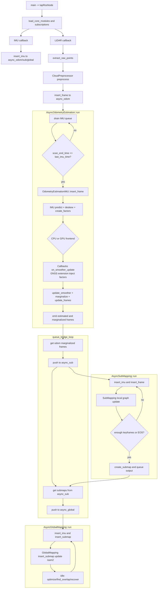
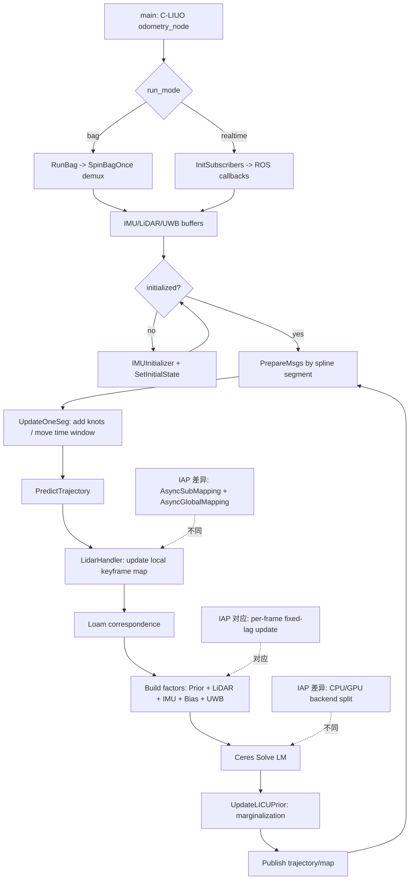

# 离散主链审计文档（文本版）

基于 ctiap 分支离散时间 baseline 的只读审阅结论：

1. 当前稳定主链是 `iap_rosnode` + `config_odometry_gpu/cpu` 的离散 IMU+LiDAR fixed-lag 流程，不是 CT 主线。
2. CT 文件可作为对照语义，但不应作为当前 authority。
3. 最稳迁移路径是先统一时间语义与 CT 查询面（deskew/prior/query），后置状态重构（B-spline control points）。
4. 发布/物化不在 odometry 主类内直接完成，而是通过回调槽进入扩展模块（尤其 RViz 扩展）完成。
5. 审计路径整体正确，但真实源码主链目录是 [src/iap/src/iap/odometry](src/iap/src/iap/odometry)，不是 [src/iap/odometry](src/iap/odometry)。

说明：本审计未改代码、未切换 CT 配置、未做 full rewrite。

---

## 1) 离散时间主链调用图

### 1.1 Launch 与运行时配置
- [launch/iap_rosnode.launch.py](src/iap/launch/iap_rosnode.launch.py#L66) 的 `_prepare_runtime_config` 复制 config 到 `/tmp` 并按 `compute_mode` 改写 odometry 配置指向。
- 改写点在 [launch/iap_rosnode.launch.py](src/iap/launch/iap_rosnode.launch.py#L97) 与 [launch/iap_rosnode.launch.py](src/iap/launch/iap_rosnode.launch.py#L101)。
- 默认 config 仍指向 GPU： [config/config.json](src/iap/config/config.json#L10)。

### 1.2 Node 启动与全局配置
- 入口 `main` 在 [apps/iap_rosnode.cpp](src/iap/apps/iap_rosnode.cpp#L464)。
- 构造函数在 [apps/iap_rosnode.cpp](src/iap/apps/iap_rosnode.cpp#L39)。
- `GlobalConfig` 初始化在 [apps/iap_rosnode.cpp](src/iap/apps/iap_rosnode.cpp#L44)。

### 1.3 Odometry 实例创建入口
- 核心模块加载在 [apps/iap_rosnode.cpp](src/iap/apps/iap_rosnode.cpp#L195)。
- 读取 odometry `so_name` 后调用工厂加载： [apps/iap_rosnode.cpp](src/iap/apps/iap_rosnode.cpp#L199) -> [odometry_estimation_base.cpp](src/iap/src/iap/odometry/odometry_estimation_base.cpp#L28)。
- 工厂符号是 `create_odometry_estimation_module`，对应创建文件：
  - [odometry_estimation_gpu_create.cpp](src/iap/src/iap/odometry/odometry_estimation_gpu_create.cpp#L3)
  - [odometry_estimation_cpu_create.cpp](src/iap/src/iap/odometry/odometry_estimation_cpu_create.cpp#L3)
  - CT 对照 [odometry_estimation_ct_create.cpp](src/iap/src/iap/odometry/odometry_estimation_ct_create.cpp#L3)

### 1.4 异步主循环入口
- Async 封装创建在 [apps/iap_rosnode.cpp](src/iap/apps/iap_rosnode.cpp#L205)。
- 异步线程 `run` 在 [async_odometry_estimation.cpp](src/iap/src/iap/odometry/async_odometry_estimation.cpp#L55)。
- `frame` 入队在 [apps/iap_rosnode.cpp](src/iap/apps/iap_rosnode.cpp#L313)，`imu` 入队在 [apps/iap_rosnode.cpp](src/iap/apps/iap_rosnode.cpp#L277)。
- 异步线程触发 odometry `insert_frame` 在 [async_odometry_estimation.cpp](src/iap/src/iap/odometry/async_odometry_estimation.cpp#L128)。

### 1.5 Odometry 每帧更新主循环（离散 authority）
- 核心主循环在 [odometry_estimation_imu.cpp](src/iap/src/iap/odometry/odometry_estimation_imu.cpp#L168)。
- 关键链路：
  - inter-scan IMU integration: [odometry_estimation_imu.cpp](src/iap/src/iap/odometry/odometry_estimation_imu.cpp#L303)
  - intra-scan trajectory for deskew: [odometry_estimation_imu.cpp](src/iap/src/iap/odometry/odometry_estimation_imu.cpp#L378)
  - deskew: [odometry_estimation_imu.cpp](src/iap/src/iap/odometry/odometry_estimation_imu.cpp#L403)
  - frontend 因子创建入口: [odometry_estimation_imu.cpp](src/iap/src/iap/odometry/odometry_estimation_imu.cpp#L425)
  - smoother update: [odometry_estimation_imu.cpp](src/iap/src/iap/odometry/odometry_estimation_imu.cpp#L429)
  - marginalization: [odometry_estimation_imu.cpp](src/iap/src/iap/odometry/odometry_estimation_imu.cpp#L433)
  - state 回写: [odometry_estimation_imu.cpp](src/iap/src/iap/odometry/odometry_estimation_imu.cpp#L491)

### 1.6 Frontend / local registration
- CPU 前端入口： [odometry_estimation_cpu.cpp](src/iap/src/iap/odometry/odometry_estimation_cpu.cpp#L103)
  - scan-to-multi-scan 分支默认开启（`use_scan_to_map=false`）见 [odometry_estimation_cpu.cpp](src/iap/src/iap/odometry/odometry_estimation_cpu.cpp#L66)。
  - binary/unary VGICP 因子构建在 [odometry_estimation_cpu.cpp](src/iap/src/iap/odometry/odometry_estimation_cpu.cpp#L147) 与 [odometry_estimation_cpu.cpp](src/iap/src/iap/odometry/odometry_estimation_cpu.cpp#L156)。
- GPU 前端入口： [odometry_estimation_gpu.cpp](src/iap/src/iap/odometry/odometry_estimation_gpu.cpp#L267)
  - `create_frame` 的 GPU voxelization 在 [odometry_estimation_gpu.cpp](src/iap/src/iap/odometry/odometry_estimation_gpu.cpp#L100)。

### 1.7 Backend / solver
- 固定窗 smoother 在 IMU 基类中创建与更新：
  - 构造初始化在 [odometry_estimation_imu.cpp](src/iap/src/iap/odometry/odometry_estimation_imu.cpp#L86)
  - `update` 调用在 [odometry_estimation_imu.cpp](src/iap/src/iap/odometry/odometry_estimation_imu.cpp#L601)

### 1.8 Publish / materialization
- odometry 自身输出是回调槽，不是直接 ROS publish： [callbacks.cpp](src/iap/src/iap/odometry/callbacks.cpp#L16)。
- 真实 ROS 物化在 RViz 扩展：
  - 回调绑定 [rviz_viewer.cpp](src/iap/src/iap/util/rviz_viewer.cpp#L97)
  - `odometry_new_frame` 物化函数 [rviz_viewer.cpp](src/iap/src/iap/util/rviz_viewer.cpp#L104)
  - TF 发布 [rviz_viewer.cpp](src/iap/src/iap/util/rviz_viewer.cpp#L172)
  - odom/pose/points 发布 [rviz_viewer.cpp](src/iap/src/iap/util/rviz_viewer.cpp#L247)

---

## 2) 模块拆解表

| module_name | main_files | entry_function | authoritative_state | input | output | invariant | how_to_test_in_isolation | likely_failure_symptom |
|---|---|---|---|---|---|---|---|---|
| RuntimeConfigBootstrap | [launch/iap_rosnode.launch.py](src/iap/launch/iap_rosnode.launch.py#L66), [config/config.json](src/iap/config/config.json#L10), [apps/iap_rosnode.cpp](src/iap/apps/iap_rosnode.cpp#L44) | `_prepare_runtime_config`, `IapRosNode` ctor | `GlobalConfig.global.config_path` + `config_odometry` 指向 | launch args, compute_mode, config_path | 运行时 `/tmp` 配置目录 | `config_path` 与 `so_name` 一致，CPU/GPU 替换正确 | 用不同 compute_mode 启动并检查加载到的 `so_name` 日志 | 启动即加载错误 so 或配置不一致 |
| AsyncIngressScheduler | [async_odometry_estimation.cpp](src/iap/src/iap/odometry/async_odometry_estimation.cpp#L55), [apps/iap_rosnode.cpp](src/iap/apps/iap_rosnode.cpp#L254) | `AsyncOdometryEstimation::run` | 输入队列与输出队列 | IMU 序列、PreprocessedFrame | EstimationFrame 结果与 marginalized 列表 | frame 处理前需满足 `last_imu_time` 覆盖 `scan_end_time` | 人工喂入乱序 IMU/点云，检查等待逻辑与队列泄压 | 卡在 waiting for IMU、延迟持续增大 |
| InitialStateEstimator | [initial_state_estimation.cpp](src/iap/src/iap/odometry/initial_state_estimation.cpp#L55), [loose_initial_state_estimation.cpp](src/iap/src/iap/odometry/loose_initial_state_estimation.cpp#L90) | `initial_pose` | init_estimation 内部窗口 + init pose/bias | 初始 IMU+点云窗口 | 首帧 EstimationFrame 初始状态 | 未 ready 前不输出；输出后 `T_world_imu` 与 `T_world_lidar` 自洽 | 固定静止数据回放，检查重力对齐与 ready 时刻 | 首帧长期不出、姿态翻转、初始化漂移 |
| MotionPredictionAndDeskew | [odometry_estimation_imu.cpp](src/iap/src/iap/odometry/odometry_estimation_imu.cpp#L303), [preprocessed_frame.hpp](src/iap/include/iap/preprocess/preprocessed_frame.hpp#L21) | `OdometryEstimationIMU::insert_frame` | 当前帧 predicted pose/vel/bias + imu_rate_trajectory | last state, IMU 积分, point times | deskew 后 frame 与 predicted state | point time 相对 scan start，一致用于 deskew 查询 | 用匀速/转动仿真轨迹检查 deskew 前后几何一致性 | 点云拖影、配准发散、scan_end 与 frame 时间异常告警 |
| LocalRegistrationFrontend | [odometry_estimation_cpu.cpp](src/iap/src/iap/odometry/odometry_estimation_cpu.cpp#L103), [odometry_estimation_gpu.cpp](src/iap/src/iap/odometry/odometry_estimation_gpu.cpp#L267) | `create_factors` | keyframes + voxelmaps + ICP quality | 当前帧点云、目标 keyframe/窗口状态 | LiDAR matching factors + icp_quality | 因子必须覆盖当前帧；keyframe 管理不破窗 | 固定两帧/多帧数据，检查因子数量、keyframe 增删、icp csv | 因子过少/过密、keyframe 抖动、cond_number 爆炸 |
| FixedLagBackendSolver | [odometry_estimation_imu.cpp](src/iap/src/iap/odometry/odometry_estimation_imu.cpp#L601), [odometry_estimation_imu.cpp](src/iap/src/iap/odometry/odometry_estimation_imu.cpp#L429) | `update_smoother` | smoother 内 X/V/B/C 图状态 | new_factors/new_values/new_stamps | 优化后 values、marginals | key timestamp 连续，符号所有权一致 | 构造最小图单测，验证 update 后关键键可读 | `calculateEstimate` 异常、missing key、fallback 告警 |
| StateCommitAndWindow | [odometry_estimation_imu.cpp](src/iap/src/iap/odometry/odometry_estimation_imu.cpp#L491), [estimation_frame.hpp](src/iap/include/iap/odometry/estimation_frame.hpp#L79) | `update_frames` + marginalization loop | EstimationFrame 字段为外部真值载体 | smoother values | 更新后的 active frames + marginalized list | `T_world_imu`/`T_world_lidar` 一致；X/V/B/C 缺失时降级策略明确 | 检查每帧回写完整性与 `sigma_p` 提取 | 位姿跳变、clock 缺失噪声、窗口对象悬空 |
| PublishMaterialization | [callbacks.cpp](src/iap/src/iap/odometry/callbacks.cpp#L16), [rviz_viewer.cpp](src/iap/src/iap/util/rviz_viewer.cpp#L97) | `on_new_frame` / `on_update_new_frame` consumers | trajectory + tf/odom/pose publishers | EstimationFrame（预测态、校正态） | TF、Odometry、Pose、PointCloud | corrected 与 uncorrected 通道语义分离 | 仅开 RViz extension，订阅各 topic 验证时戳/frame_id | TF 抖动、scanend pose 不合理、frame_id 误配 |

---

## 3) 离散变量 -> CT/B-spline 替换映射表

| 对象 | current discrete semantics | recommended CT semantics | replacement category | recommended phase | reasoning |
|---|---|---|---|---|---|
| pose state | 每帧单一 `X(k)`（IMU 基类）[odometry_estimation_imu.cpp](src/iap/src/iap/odometry/odometry_estimation_imu.cpp#L491) | local spline control points 作为 authoritative local trajectory state（先非全局 full-CT）；query input 包含 point/frame/publish time；query support 为查询时刻周围局部支撑集；materialized pose 为 source/frontend/publish 三类查询结果 | REPLACE_WITH_LOCAL_BSPLINE | Phase 3-4 | 先替换查询语义与支撑集，再考虑全局 full spline state，可避免一次性改动 backend 变量拓扑 |
| velocity state | 显式 `V(k)` 状态 [odometry_estimation_imu.cpp](src/iap/src/iap/odometry/odometry_estimation_imu.cpp#L491) | early phase 后端 authoritative velocity 仍离散；CT 先提供 derivative/helper view；publish velocity 与 motion-prior velocity 可来自不同语义层 | WRAP_WITH_CT_HELPER | Phase 2 | `V(k)` 与 IMU/GNSS 因子耦合深，先包 helper 风险低，且避免把查询导数误当后端真值 |
| bias state | 显式 `B(k)` + between prior [odometry_estimation_imu.cpp](src/iap/src/iap/odometry/odometry_estimation_imu.cpp#L367) | 继续离散关键帧 bias | KEEP_DISCRETE | Phase 0-4 | KEEP_DISCRETE 是工程优先级判断，不是理论上永远不连续化；早改收益小、耦合大、调参成本高 |
| frame timestamp / representative time | `frame.stamp + scan_end_time`，约定分散在 preprocessing 与发布链 [preprocessed_frame.hpp](src/iap/include/iap/preprocess/preprocessed_frame.hpp#L21) | 统一 frame 代表时刻策略（scan begin / mid / end）并建立统一查询接口 | WRAP_WITH_CT_HELPER | Phase 1 | 这是所有 CT 查询的一致性根，先统一最划算 |
| point timestamp / deskew time | point times 相对 scan start，deskew 在 `insert_frame` 内完成 [odometry_estimation_imu.cpp](src/iap/src/iap/odometry/odometry_estimation_imu.cpp#L403) | 以连续轨迹查询每点位姿（同一 query surface） | WRAP_WITH_CT_HELPER | Phase 1 | 对精度收益最大且对后端侵入最小 |
| motion prior / seed pose | 由离散 IMU 预积分给 `X(k)` 初值 [odometry_estimation_imu.cpp](src/iap/src/iap/odometry/odometry_estimation_imu.cpp#L312) | 从 CT 轨迹局部外推给当前帧 prior（并保留原离散回退） | WRAP_WITH_CT_HELPER | Phase 2 | 可显著改善激烈运动初值，同时可随时回退 |
| source cloud pose query | source 通常按单姿态或两姿态近似建模（CPU/GPU 因子）[odometry_estimation_cpu.cpp](src/iap/src/iap/odometry/odometry_estimation_cpu.cpp#L147) | 残差内部使用连续时间源点位姿查询 | REPLACE_WITH_LOCAL_BSPLINE | Phase 3 | front-end 残差质量提升点，且不必先改全局状态容器 |
| target map query pose | target 主要是 keyframe pose + voxelmap（binary/unary）[odometry_estimation_cpu.cpp](src/iap/src/iap/odometry/odometry_estimation_cpu.cpp#L171) | 继续离散 keyframe target（先不连续化） | KEEP_DISCRETE | Phase 0-4 | early hybrid 接受“CT source vs discrete target” tradeoff；这是刻意工程权衡，不是最终理想架构 |
| sliding window membership | 以 frame_id + smoother_lag 管理 [odometry_estimation_imu.cpp](src/iap/src/iap/odometry/odometry_estimation_imu.cpp#L433) | 仍按离散帧窗口管理，CT 仅作为查询层 | KEEP_DISCRETE | Phase 0-4 | 窗口规则是稳定骨架，过早改会放大边界条件复杂度 |
| marginalization summary / carry state | 当前依赖 fixed-lag 对键值和回写流程 [odometry_estimation_imu.cpp](src/iap/src/iap/odometry/odometry_estimation_imu.cpp#L601) | 保持离散 summary/carry，不先引入 spline carry prior | KEEP_DISCRETE | Phase 0-4 | 这是系统稳定性核心，不应早改 |
| publish pose materialization | `on_new_frame` 与 `on_update_new_frame` 双通道物化 [rviz_viewer.cpp](src/iap/src/iap/util/rviz_viewer.cpp#L99) | 增加 CT 统一查询得到 begin/end/representative 发布姿态 | WRAP_WITH_CT_HELPER | Phase 2 | 对外语义先统一，有助于验证 CT hybrid 而不碰后端主状态 |
| clock state `C(k)`（补充，直接影响 odometry） | odometry/gnss owner 模式切换，`C(k)` 可能由 GNSS 注入 [odometry_estimation_imu.cpp](src/iap/src/iap/odometry/odometry_estimation_imu.cpp#L109), [gnss_extension.cpp](src/iap/src/iap/gnss/gnss_extension.cpp#L595) | 继续离散 `C(k)`，先不 spline 化 | KEEP_DISCRETE | Phase 0-4 | KEEP_DISCRETE 是工程优先级判断，不是理论上永远不连续化；时钟链路已复杂，先稳住 ownership 与可用性 |

---

## Future CT/B-spline State Semantics Patch

### Why this patch is needed

当前文档已经正确指出：
- 当前 `ctiap` 分支的 authority 是离散时间 odometry 主链
- 最稳迁移路径是先做 CT 时间语义 / deskew / motion prior，再后置 full state 重构

但是“未来 CT/B-spline 状态”目前仍表达得过于粗粒度。
尤其是 `pose state` 当前只被概括成：
- current discrete semantics
- recommended CT semantics
- replacement category

这还不够，因为真正进入 CT/B-spline 后，至少必须明确区分：

1. authoritative state
2. query input
3. query support
4. materialized output

若不做这个区分，后续很容易重演：
- query surface
- support layout
- publish pose
- carry / materialization
混在一起的问题。

### Patch principle

本补丁遵循下面三条原则：

1. 当前离散时间 baseline 仍然是 authority
   - 本表不是重写当前实现
   - 本表只定义未来 CT/B-spline 迁移时需要新增的语义层

2. 先定义“查询语义”，再定义“全局 CT 主状态”
   - 优先把 source pose query / deskew / motion prior / publish pose query 的语义定义清楚
   - full spline control-point global state 仍然放在后置 phase

3. helper / query / state / materialization 必须拆开
   - 防止未来实现时把“helper 结果”误当“authoritative state”
   - 防止把“materialized pose”误当“backend state”

## Future CT/B-spline State Semantics Table

| object | current discrete authority | future CT authoritative_state | future CT query_input | future CT query_support | future CT materialized_output | migration role | recommended phase | notes |
|---|---|---|---|---|---|---|---|---|
| pose trajectory | discrete frame pose `X(k)` in fixed-lag smoother | local spline control points / local CT trajectory state (not global full-CT at first) | point time / frame representative time / publish time | local spline support set around the queried time | source pose / frontend pose / publish pose | REPLACE_WITH_LOCAL_BSPLINE | Phase 3-4 | 先替换查询语义，再考虑 full global spline state |
| velocity | discrete `V(k)` backend state | still discrete in early phases; optional local derivative view from CT trajectory | frame time / seed target time | derivative support of local CT trajectory | motion-prior velocity / optional publish velocity | WRAP_WITH_CT_HELPER | Phase 2-4 | early phase 不建议先把 velocity 变成 full spline state |
| bias | discrete `B(k)` backend state | still lagged discrete bias | current frame / local segment | nearest or owned lagged bias state | IMU correction input only | KEEP_DISCRETE | Phase 0-4 | 不是说 bias 永远不连续化，而是早期不值得先动 |
| clock state `C(k)` | discrete clock state with current owner semantics | still discrete clock state | current frame / GNSS epoch | owned clock state at that frame | published timing companion / GNSS alignment | KEEP_DISCRETE | Phase 0-4 | 先别和 CT pose state 一起重构 |
| frame representative time | partially distributed in current pipeline | explicit frame query-time policy | scan_start / scan_mid / scan_end / chosen representative time | none (pure time semantic) | unified frame query timestamp | WRAP_WITH_CT_HELPER | Phase 1 | 这是所有 CT query 的公共前置条件 |
| point timestamp | relative time inside scan | per-point CT query input | point relative time / absolute point time | local pose support around each point time | per-point deskewed pose | WRAP_WITH_CT_HELPER | Phase 1 | point-time query 是最先落地的 CT 能力 |
| deskew source pose | currently produced from discrete IMU-based intra-scan approximation | queried CT pose at point time | per-point time | local point-time support | deskewed source cloud | WRAP_WITH_CT_HELPER | Phase 1-2 | 不改变 backend state，仅改变 source cloud 几何 |
| motion prior / seed | discrete last-pose / IMU predicted seed | CT-aware queried seed pose from local trajectory helper | frontend target time | local support around frontend target time | frontend seed pose | WRAP_WITH_CT_HELPER | Phase 2 | seed 是查询结果，不应被误认为 backend authoritative state |
| source residual pose query | currently implicit/approx discrete source pose in frontend residual | CT source pose query used inside residual build | point/bucket/query time | local support used by frontend residual | local residual evaluation pose | REPLACE_WITH_LOCAL_BSPLINE | Phase 3 | 这是 frontend 真正 CT 化的核心一步 |
| target map/query pose | discrete keyframe / discrete map anchor | still discrete in early hybrid phases | target keyframe time / target anchor time | discrete target support | target lookup pose | KEEP_DISCRETE (early) | Phase 0-4 | early hybrid 接受“CT source vs discrete target” tradeoff |
| sliding-window membership | discrete frame-based lag membership | still discrete frame window in early and mid phases | frame index / frame timestamp | none | active frame set | KEEP_DISCRETE | Phase 0-4 | window membership 不应过早改成 spline-control membership |
| marginalization summary / carry | discrete fixed-lag summary over frame-keyed state | still discrete summary in hybrid phases | active frame set / lag boundary | discrete retained state set | carry prior / summary state | KEEP_DISCRETE | Phase 0-4 | 这是最晚才考虑 CT 化的链 |
| publish pose materialization | callback/view layer reads discrete frame state | CT query result selected from unified query policy | publish time / representative time / optional begin/end time | local support around publish time | published pose(s) and TF companion | WRAP_WITH_CT_HELPER | Phase 2 | publish pose 是 materialized output，不是 backend state |
| local CT support window | none as first-class concept | local-only support window for deskew/frontend/publish query | frame-local time range | nearby support nodes / local trajectory patch | query-time support set | NEW_CT_ONLY_CONCEPT | Phase 2-4 | 必须单独定义，且不等于全局 fixed-lag window |
| global full spline state | none | full control-point trajectory replacing discrete global backend state | global query times | global spline support / marginal carry | all downstream pose queries | REPLACE_WITH_FULL_BSPLINE_STATE | Phase 5 only | 只在前面 hybrid phases 稳定后才评估 |

## Clarifying Rules For Future Implementation

### Rule 1: Authoritative state and materialized pose must never be conflated
- backend authoritative state
- query result
- publish/materialized pose
必须是三层不同概念

### Rule 2: Query support is not itself the state
- support set 只是“为了某个查询时刻读取哪几个控制变量”
- support layout 不能被误写成新的 truth container

### Rule 3: Early CT hybrid should favor helper/query replacement over state replacement
- 先替换 point-time query / deskew / motion prior / frontend source pose query
- 后替换 backend global state

### Rule 4: Local CT support window is distinct from global sliding window
- local CT support window 只服务查询
- global sliding window 仍服务 backend state lifecycle
- 两者不能一开始就绑死成同一个概念

### Rule 5: Target side may remain discrete in early hybrid phases
- 早期允许 source side 先 CT 化，target side 仍离散
- 这是一种工程权衡，不是最终理想形态
- 文档中需要明确写出这是 tradeoff

### What this patch changes conceptually

1. 现有文档之前主要解决了“当前离散主链是什么”。
2. 本补丁新增解决了“未来 CT/B-spline 迁移时，状态 / 查询 / support / 物化如何区分”。
3. 这样做的直接收益是：
   - 避免后续把 helper 误当 state
   - 避免把 query result 误当 backend truth
   - 避免过早把 sliding window / carry / materialization 都 CT 化

---

## 当前系统流程步骤（离散实现，含 CPU/GPU 分流）

本节目标：给出“从主函数到后端地图”的按顺序流程导读，便于按函数定位代码、按线程理解生命周期。

### A) 端到端流程（按执行顺序）

| Step | 触发与频率 | 主函数/模块（代码定位） | 做什么 | 状态/因子结果 |
|---|---|---|---|---|
| 0. 启动与模块装配 | 程序启动一次 | `main` + `IapRosNode` 构造：[apps/iap_rosnode.cpp](src/iap/apps/iap_rosnode.cpp#L464), [apps/iap_rosnode.cpp](src/iap/apps/iap_rosnode.cpp#L39) | 初始化 `GlobalConfig`、加载 odom/sub/global 动态库、创建订阅和桥接线程 | 建立 3 条异步链：odometry、sub-mapping、global-mapping |
| 1. IMU callback ingress | 每条 IMU 消息 | [apps/iap_rosnode.cpp](src/iap/apps/iap_rosnode.cpp#L254) | 时间偏移与加计缩放后，IMU 同步写入 `async_odom`、`async_sub`、`async_global` | 作为 odom/sub/global 三条链的连续时间驱动输入 |
| 2. LiDAR callback ingress + 预处理 | 每帧点云 | [apps/iap_rosnode.cpp](src/iap/apps/iap_rosnode.cpp#L286), [cloud_preprocessor.cpp](src/iap/src/iap/preprocess/cloud_preprocessor.cpp#L80) | `extract_raw_points` -> `time_keeper` -> `preprocess`（下采样、距离/裁剪/离群、KNN） | 形成 `PreprocessedFrame`，入 `async_odom` |
| 3. Async odom 取数与就绪门控 | 异步循环（1ms 轮询） | [async_odometry_estimation.cpp](src/iap/src/iap/odometry/async_odometry_estimation.cpp#L55) | 先消费 IMU，再处理 frame；若 `scan_end_time > last_imu_time` 则等待 | 保证每帧进入后端时 IMU 覆盖完整 scan 区间 |
| 4. Odom 首帧初始化 | 第 1 帧仅一次 | [odometry_estimation_imu.cpp](src/iap/src/iap/odometry/odometry_estimation_imu.cpp#L168) | 初始姿态估计、构建首帧 `X/V/B(/C)` 与先验，创建首帧点云 | fixed-lag 图建立锚定键，窗口开始 |
| 5. Odom 常规每帧更新 | 每帧 LiDAR | [odometry_estimation_imu.cpp](src/iap/src/iap/odometry/odometry_estimation_imu.cpp#L288) | inter-scan IMU 预积分预测 `X/V/B(/C)`，intra-scan 轨迹用于 deskew，构建当前 `EstimationFrame` | 形成当前帧预测态，准备 frontend 因子 |
| 6. Frontend 因子构建（CPU/GPU分流） | 每帧 LiDAR（current>0） | CPU: [odometry_estimation_cpu.cpp](src/iap/src/iap/odometry/odometry_estimation_cpu.cpp#L103)；GPU: [odometry_estimation_gpu.cpp](src/iap/src/iap/odometry/odometry_estimation_gpu.cpp#L267) | 按窗口+keyframe 建立 LiDAR 匹配因子（binary/unary），并维护 keyframe 集 | 产生 LiDAR 残差因子图增量 |
| 7. GNSS 因子注入（扩展回调） | 每次 smoother update 前；有匹配 epoch 才注入 | [gnss_extension.cpp](src/iap/src/iap/gnss/gnss_extension.cpp#L535), [gnss_handler.cpp](src/iap/src/iap/gnss/gnss_handler.cpp#L48) | `on_smoother_update_` 内按 `frame_stamp` 抽取 epoch，注入 PR/Doppler；首次注入 `E(0)/R(0)`；必要时补 `C(k)` 与 `ClockBetween` | GNSS 因子并入同一 fixed-lag 更新批次 |
| 8. Smoother 更新与滑窗边缘化 | 每帧 LiDAR | [odometry_estimation_imu.cpp](src/iap/src/iap/odometry/odometry_estimation_imu.cpp#L426), [odometry_estimation_imu.cpp](src/iap/src/iap/odometry/odometry_estimation_imu.cpp#L433) | `update_smoother` 后按 `smoother_lag` 识别 marginalized frame | active window 滚动前移，过窗帧输出到 marginalized 队列 |
| 9. 状态回写（窗口内全量） | 每帧 smoother 后 | [odometry_estimation_imu.cpp](src/iap/src/iap/odometry/odometry_estimation_imu.cpp#L491) | 从 smoother 回写 `X/V/B(/C)`、`sigma_p` 到 `frames`；触发 update 回调 | 当前系统对外可见状态与诊断量更新 |
| 10. Odom->SubMap 桥接 | 5ms 桥接循环 | [apps/iap_rosnode.cpp](src/iap/apps/iap_rosnode.cpp#L388) | 将 marginalized odom frame 推给 `async_sub`；将 submap 推给 `async_global` | 主线被拆成两级异步映射流水 |
| 11. Local map 子图构建 | 异步循环（10ms） | [async_sub_mapping.cpp](src/iap/src/iap/mapping/async_sub_mapping.cpp#L42), [sub_mapping.cpp](src/iap/src/iap/mapping/sub_mapping.cpp#L97) | 逐帧进 sub-mapping；按 keyframe 策略建局部因子图；达到阈值/序列结束时 `create_submap` | 输出 submap，随后清空局部缓存（odom_frames/keyframes/graph/values） |
| 12. Global map 图增量与周期优化 | 异步循环（空闲 100ms；定时默认 5s） | [async_global_mapping.cpp](src/iap/src/iap/mapping/async_global_mapping.cpp#L73), [global_mapping.cpp](src/iap/src/iap/mapping/global_mapping.cpp#L131) | 插入 submap 后立即加因子并 `isam2 update`；空闲期执行 optimize/find_overlap/recover 请求 | 全局 submap 位姿持续更新；支持重叠检索与图恢复 |
| 13. 结束与落盘 | 退出时一次 | [apps/iap_rosnode.cpp](src/iap/apps/iap_rosnode.cpp#L100), [apps/iap_rosnode.cpp](src/iap/apps/iap_rosnode.cpp#L464) | join 三条异步线程，global save，config dump | 完整轨迹/图/子图持久化 |

### B) CPU 与 GPU 流程差异（前端主链）

| 维度 | CPU 路径 | GPU 路径 |
|---|---|---|
| 前端入口 | [odometry_estimation_cpu.cpp](src/iap/src/iap/odometry/odometry_estimation_cpu.cpp#L103) | [odometry_estimation_gpu.cpp](src/iap/src/iap/odometry/odometry_estimation_gpu.cpp#L267) |
| 当前帧建模 | 主要是 CPU `PointCloudCPU` + per-frame voxelmaps（VGICP） | `create_frame` 中将点云转 `PointCloudGPU` 并构建多层 `GaussianVoxelMapGPU` |
| 匹配因子类型 | `IntegratedVGICPFactor`（binary/unary），另有 legacy scan-to-map 分支（GICP/VGICP） | `IntegratedVGICPFactorGPU`（binary/unary），并启用 GPU 线性化 |
| keyframe 策略 | OVERLAP / DISPLACEMENT | OVERLAP / DISPLACEMENT / ENTROPY |
| ICP 质量评估时机 | 在 `create_factors` 内，对预测位姿评估 cond/inlier/rmse 并可写 CSV | 在 `update_frames` 后，对优化位姿执行 GPU+CPU 混合评估并可写 CSV |
| 计算资源侧重点 | 多线程 CPU 线性化与求解 | GPU 因子线性化 + CPU 端 Hessian/诊断读取 |

### C) 后端 factor 类型 + 添加时机/频率

| Factor 类型 | 添加位置 | 触发时机 | 典型频率 |
|---|---|---|---|
| `LinearDampingFactor(X0)` + 初始 `Prior(V0/B0[/C0])` | [odometry_estimation_imu.cpp](src/iap/src/iap/odometry/odometry_estimation_imu.cpp#L258) | odom 首帧初始化 | 一次 |
| `ImuFactor(X,V,B)` | [odometry_estimation_imu.cpp](src/iap/src/iap/odometry/odometry_estimation_imu.cpp#L365) | 每帧；若帧间 IMU 样本足够 | 每个 LiDAR 帧间一次 |
| `BetweenFactor(B_last,B_curr)` | [odometry_estimation_imu.cpp](src/iap/src/iap/odometry/odometry_estimation_imu.cpp#L359) | 每帧常速偏置模型 | 每帧一次 |
| LiDAR 匹配因子（CPU/GPU VGICP） | [odometry_estimation_cpu.cpp](src/iap/src/iap/odometry/odometry_estimation_cpu.cpp#L147), [odometry_estimation_gpu.cpp](src/iap/src/iap/odometry/odometry_estimation_gpu.cpp#L276) | 每帧，连接最近窗口与历史 keyframe | 每帧多条（取决于窗口/关键帧数） |
| GNSS `PseudorangeFactor` / `DopplerFactor` | [gnss_handler.cpp](src/iap/src/iap/gnss/gnss_handler.cpp#L78) | smoother update 前，按 `time_tolerance` 匹配到 epoch 时 | 事件触发（通常接近 GNSS 频率） |
| GNSS `Prior(E0)`/`Prior(R0)` | [gnss_extension.cpp](src/iap/src/iap/gnss/gnss_extension.cpp#L561) | 首次 GNSS 成功注入 | 一次 |
| GNSS `ClockBetweenFactor(C_prev,C_curr)` | [gnss_extension.cpp](src/iap/src/iap/gnss/gnss_extension.cpp#L640) | 连续 GNSS 注入帧且前一时钟键可用 | 条件触发 |
| SubMap 局部 between/IMU/registration 因子 | [sub_mapping.cpp](src/iap/src/iap/mapping/sub_mapping.cpp#L208), [sub_mapping.cpp](src/iap/src/iap/mapping/sub_mapping.cpp#L244), [sub_mapping.cpp](src/iap/src/iap/mapping/sub_mapping.cpp#L312) | local map 组图阶段（随 odom marginalized frame 输入） | 子图内高频累计 |
| Global map between/matching/IMU 因子 | [global_mapping.cpp](src/iap/src/iap/mapping/global_mapping.cpp#L176), [global_mapping.cpp](src/iap/src/iap/mapping/global_mapping.cpp#L451), [global_mapping.cpp](src/iap/src/iap/mapping/global_mapping.cpp#L213) | 每次 `insert_submap` 时 | 每个 submap 一次批量增量 |

### D) Local / Global map 生命周期（构建-更新-调用）

1. Local map（SubMapping）生命周期
    - 输入来源：odometry 滑窗边缘化帧，经 [apps/iap_rosnode.cpp](src/iap/apps/iap_rosnode.cpp#L388) 桥接到 [async_sub_mapping.cpp](src/iap/src/iap/mapping/async_sub_mapping.cpp#L42)。
    - 构建过程：`SubMapping::insert_frame` 维护局部 `values/graph/keyframes`，可包含 IMU 平滑轨迹重 deskew、局部 between 因子、局部 registration 因子。
    - 出图条件：`keyframes.size() >= max_num_keyframes` 或 EOS 时 `create_submap(true)`。[sub_mapping.cpp](src/iap/src/iap/mapping/sub_mapping.cpp#L417), [sub_mapping.cpp](src/iap/src/iap/mapping/sub_mapping.cpp#L510)
    - 生命周期收尾：新 submap 入队后，局部容器清空并开始下一子图。[sub_mapping.cpp](src/iap/src/iap/mapping/sub_mapping.cpp#L340)

2. Global map（GlobalMapping）生命周期
    - 输入来源：submap 队列，经桥接线程送入 `async_global`。[apps/iap_rosnode.cpp](src/iap/apps/iap_rosnode.cpp#L401)
    - 增量更新：`insert_submap` 中估计初值、创建 between/matching/IMU 因子、执行 `isam2 update`、再 `update_submaps`。[global_mapping.cpp](src/iap/src/iap/mapping/global_mapping.cpp#L131)
    - 空闲维护：线程空闲时支持三类后台操作：周期 optimize、按请求找重叠子图、recover graph。[async_global_mapping.cpp](src/iap/src/iap/mapping/async_global_mapping.cpp#L89)
    - 结束阶段：join 后 save，导出图与轨迹并持久化配置。[async_global_mapping.cpp](src/iap/src/iap/mapping/async_global_mapping.cpp#L58), [global_mapping.cpp](src/iap/src/iap/mapping/global_mapping.cpp#L565)

### E) 流程图（主线程 + 三条异步线程）

### F) 阅读建议（按定位效率）

1. 先看入口与队列桥接： [apps/iap_rosnode.cpp](src/iap/apps/iap_rosnode.cpp#L39), [apps/iap_rosnode.cpp](src/iap/apps/iap_rosnode.cpp#L388)
2. 再看 odometry authority： [async_odometry_estimation.cpp](src/iap/src/iap/odometry/async_odometry_estimation.cpp#L55), [odometry_estimation_imu.cpp](src/iap/src/iap/odometry/odometry_estimation_imu.cpp#L168)
3. 然后看 CPU/GPU 前端差异： [odometry_estimation_cpu.cpp](src/iap/src/iap/odometry/odometry_estimation_cpu.cpp#L103), [odometry_estimation_gpu.cpp](src/iap/src/iap/odometry/odometry_estimation_gpu.cpp#L267)
4. 最后看 GNSS 与 mapping 生命周期： [gnss_extension.cpp](src/iap/src/iap/gnss/gnss_extension.cpp#L535), [sub_mapping.cpp](src/iap/src/iap/mapping/sub_mapping.cpp#L97), [global_mapping.cpp](src/iap/src/iap/mapping/global_mapping.cpp#L131)

---

## C-LIUO 连续时间 SLAM 流程对比（相对 IAP）

本节覆盖 [src/C-LIUO](src/C-LIUO) 的连续时间主链（LIUO: LiDAR/IMU/UWB），并逐步标注：
- 与 IAP 流程的对应关系
- 与 IAP 的关键差异
- 代码定位入口（可按顺序阅读）

### A) 先看总入口与运行模式

| 项 | C-LIUO 代码定位 | IAP 对应 | 结论 |
|---|---|---|---|
| 主函数入口 | [odometry_node.cpp](src/C-LIUO/src/odometry_node.cpp#L31) | [iap_rosnode.cpp](src/iap/apps/iap_rosnode.cpp#L464) | 对应：都在主函数中构建管理器/节点；不同：C-LIUO 显式支持 `bag` 和 `realtime` 两种运行模式 |
| 配置加载 | [odometry_node.cpp](src/C-LIUO/src/odometry_node.cpp#L37), [odometry_manager.cpp](src/C-LIUO/src/odom/odometry_manager.cpp#L43) | [iap_rosnode.cpp](src/iap/apps/iap_rosnode.cpp#L44) | 对应：都从配置装配模块；不同：C-LIUO 直接 YAML 路径解析，IAP 用 `GlobalConfig` + SO 插件链 |
| 运行分支 | [odometry_node.cpp](src/C-LIUO/src/odometry_node.cpp#L77), [odometry_manager.cpp](src/C-LIUO/src/odom/odometry_manager.cpp#L339), [odometry_manager.cpp](src/C-LIUO/src/odom/odometry_manager.cpp#L471) | IAP 常驻 ROS2 订阅线程模型 | 关键差异：C-LIUO 有离线 bag 驱动主循环；IAP 主链是实时 callback + 异步线程流水 |

### B) 端到端流程步骤（含 IAP 对照）

| Step | C-LIUO 流程与主要函数 | 频率/时机 | IAP 对应 | 对应/差异标记 |
|---|---|---|---|---|
| 1 | 数据入口：`RunBag` 中 `SpinBagOnce` 分发，或 `RunInSubscribeMode` 中 `InitSubscribers` + ROS callback ([odometry_manager.cpp](src/C-LIUO/src/odom/odometry_manager.cpp#L339), [msg_manager.cpp](src/C-LIUO/src/odom/msg_manager.cpp#L224), [msg_manager.cpp](src/C-LIUO/src/odom/msg_manager.cpp#L898)) | 每条传感器消息 | IAP 的 IMU/LiDAR callback 入口 ([iap_rosnode.cpp](src/iap/apps/iap_rosnode.cpp#L254), [iap_rosnode.cpp](src/iap/apps/iap_rosnode.cpp#L286)) | 对应；C-LIUO 多了 bag 驱动分发层 |
| 2 | IMU callback + 预处理：`IMUMsgToIMUData` 做单位/归一化与结构化，`IMUMsgHandle` 入 `imu_buf_` ([msg_manager.h](src/C-LIUO/src/odom/msg_manager.h#L256), [msg_manager.cpp](src/C-LIUO/src/odom/msg_manager.cpp#L544)) | 每条 IMU | IAP `insert_imu` 到 odom/sub/global ([iap_rosnode.cpp](src/iap/apps/iap_rosnode.cpp#L277)) | 对应；差异：C-LIUO 先入统一消息缓冲，再按时间窗切段 |
| 3 | LiDAR callback + 预处理：`VelodyneMsgHandle`/`LivoxMsgHandle` 做点云解析与特征提取，入 `lidar_buf_` ([msg_manager.cpp](src/C-LIUO/src/odom/msg_manager.cpp#L560), [msg_manager.cpp](src/C-LIUO/src/odom/msg_manager.cpp#L630)) | 每帧 LiDAR | IAP `CloudPreprocessor::preprocess` ([cloud_preprocessor.cpp](src/iap/src/iap/preprocess/cloud_preprocessor.cpp#L80)) | 对应；差异：C-LIUO 在 callback 阶段就完成 feature extraction，IAP 先通用预处理后在前端建关联 |
| 4 | UWB callback + 预处理：`UwbMsgHandle` 解析 anchor 距离、RSSI/FP 过滤、anchor 位姿映射，入 `uwb_buf_` ([msg_manager.cpp](src/C-LIUO/src/odom/msg_manager.cpp#L844), [msg_manager.cpp](src/C-LIUO/src/odom/msg_manager.cpp#L876)) | 每条 UWB | IAP 对应 GNSS callback + epoch 管理 ([gnss_extension.cpp](src/iap/src/iap/gnss/gnss_extension.cpp#L535)) | 对应；差异：C-LIUO 用 UWB + NLOS，IAP 用 GNSS PR/Doppler |
| 5 | 初始化：`IMUInitializer::StaticInitialIMUState`，`SetInitialState` 写入系统初值与首段 knot/bias ([imu_initializer.cpp](src/C-LIUO/src/imu/imu_initializer.cpp#L84), [odometry_manager.cpp](src/C-LIUO/src/odom/odometry_manager.cpp#L1222), [trajectory_manager.cpp](src/C-LIUO/src/odom/trajectory_manager.cpp#L221)) | 启动一次 | IAP 首帧初始化 ([odometry_estimation_imu.cpp](src/iap/src/iap/odometry/odometry_estimation_imu.cpp#L168)) | 对应；差异：C-LIUO state 是 NURBS 控制点轨迹，不是离散 `X/V/B/C` |
| 6 | 时间窗组帧：`PrepareMsgs` 按 `traj_max` 切片 LiDAR/UWB/IMU 到当前段 ([odometry_manager.cpp](src/C-LIUO/src/odom/odometry_manager.cpp#L1112), [msg_manager.cpp](src/C-LIUO/src/odom/msg_manager.cpp#L467)) | 每个时间段 | IAP `scan_end_time <= last_imu_time` 门控 ([async_odometry_estimation.cpp](src/iap/src/iap/odometry/async_odometry_estimation.cpp#L112)) | 对应；差异：C-LIUO 显式按 spline 段时间切消息 |
| 7 | 状态变量构建与窗口推进：`UpdateOneSeg` 决定新增控制点数，`PredictTrajectory` 扩展 knot + 设优化时间域 ([odometry_manager.cpp](src/C-LIUO/src/odom/odometry_manager.cpp#L1167), [trajectory_manager.cpp](src/C-LIUO/src/odom/trajectory_manager.cpp#L351)) | 每段一次 | IAP `new_values/new_stamps` + fixed-lag 窗口 | 差异：C-LIUO 是“控制点段扩展窗口”；IAP 是“离散帧 fixed-lag 窗口” |
| 8 | LiDAR 局部地图更新：`FeatureCloudHandler` -> `UpdateLidarSubMap` -> `ExtractSurroundFeatures` -> `FindCorrespondence` ([lidar_handler.cpp](src/C-LIUO/src/lidar/lidar_handler.cpp#L129), [lidar_handler.cpp](src/C-LIUO/src/lidar/lidar_handler.cpp#L155), [lidar_handler.cpp](src/C-LIUO/src/lidar/lidar_handler.cpp#L405), [lidar_handler.cpp](src/C-LIUO/src/lidar/lidar_handler.cpp#L487)) | 每段每次迭代前 | IAP CPU/GPU `create_factors` 前端匹配链 | 对应；差异：C-LIUO local map 直接由 keyframe 容器维护，无独立 async sub/global 模块 |
| 9 | 因子图构建（LIUO）：`UpdateTrajectoryWithLICU` 内添加 Prior + LiDAR + IMU + Bias + UWB 因子，再 `Solve` ([trajectory_manager.cpp](src/C-LIUO/src/odom/trajectory_manager.cpp#L613), [trajectory_estimator.cpp](src/C-LIUO/src/odom/trajectory_estimator.cpp#L144), [trajectory_estimator.cpp](src/C-LIUO/src/odom/trajectory_estimator.cpp#L206), [trajectory_estimator.cpp](src/C-LIUO/src/odom/trajectory_estimator.cpp#L159), [trajectory_estimator.cpp](src/C-LIUO/src/odom/trajectory_estimator.cpp#L521), [trajectory_estimator.cpp](src/C-LIUO/src/odom/trajectory_estimator.cpp#L242), [trajectory_estimator.cpp](src/C-LIUO/src/odom/trajectory_estimator.cpp#L672)) | 每段多次迭代 | IAP 每帧 `create_factors` + `update_smoother` ([odometry_estimation_imu.cpp](src/iap/src/iap/odometry/odometry_estimation_imu.cpp#L425), [odometry_estimation_imu.cpp](src/iap/src/iap/odometry/odometry_estimation_imu.cpp#L426)) | 对应；差异：C-LIUO 后端是 Ceres NURBS 参数块，不是 GTSAM key graph |
| 10 | UWB NLOS 与动态加权：`AddUWBMeasurementAnalyticNURBS` 内调用 NLOS detector 计算动态权重与筛除强 NLOS ([trajectory_estimator.cpp](src/C-LIUO/src/odom/trajectory_estimator.cpp#L242), [uwb_nlos_detector.cpp](src/C-LIUO/src/uwb/uwb_nlos_detector.cpp#L103)) | 每条 UWB 因子添加时 | IAP GNSS 权重与因子注入 | 差异：C-LIUO 有显式几何遮挡 NLOS 检测链 |
| 11 | 滑动窗口边缘化与状态更新：`UpdateLICPrior`/`UpdateLICUPrior` 构造边缘化信息并 `preMarginalize/marginalize`，替换 `lidar_marg_info` ([trajectory_manager.cpp](src/C-LIUO/src/odom/trajectory_manager.cpp#L957), [trajectory_manager.cpp](src/C-LIUO/src/odom/trajectory_manager.cpp#L1132), [trajectory_manager.cpp](src/C-LIUO/src/odom/trajectory_manager.cpp#L1123), [trajectory_manager.cpp](src/C-LIUO/src/odom/trajectory_manager.cpp#L1124)) | 每段优化后一次 | IAP fixed-lag 过窗 + frame 回写 ([odometry_estimation_imu.cpp](src/iap/src/iap/odometry/odometry_estimation_imu.cpp#L433), [odometry_estimation_imu.cpp](src/iap/src/iap/odometry/odometry_estimation_imu.cpp#L491)) | 对应；差异：C-LIUO 更新的是控制点与 bias 参数块先验，不是 frame 状态容器 |
| 12 | 发布与落盘：实时发布 spline 轨迹/点云；结束时 `SaveOdometry` + `SavePointCloudMap` ([odometry_manager.cpp](src/C-LIUO/src/odom/odometry_manager.cpp#L1243), [odometry_manager.cpp](src/C-LIUO/src/odom/odometry_manager.cpp#L1289), [odometry_manager.cpp](src/C-LIUO/src/odom/odometry_manager.cpp#L1415)) | 每段发布，结束保存 | IAP 通过回调/异步 global save | 对应；差异：C-LIUO 在线无独立 global optimizer 线程 |

### C) C-LIUO 的状态变量构建与更新（重点）

1. 状态表达
   - C-LIUO 主状态是 NURBS 轨迹控制点（SO3 knot + position knot）和 bias 参数，而不是离散 `X/V/B/C`。
   - 构建入口在 [trajectory_manager.cpp](src/C-LIUO/src/odom/trajectory_manager.cpp#L351)（`PredictTrajectory`）与 [trajectory_manager.cpp](src/C-LIUO/src/odom/trajectory_manager.cpp#L221)（初始状态）。

2. 初始化
   - 先 IMU 静态初始化估计 `q/g/bias`，再进入轨迹控制点初始化。见 [imu_initializer.cpp](src/C-LIUO/src/imu/imu_initializer.cpp#L84) 和 [odometry_manager.cpp](src/C-LIUO/src/odom/odometry_manager.cpp#L1222)。

3. 滑窗推进
   - 每段根据 IMU 激励决定 knot 密度（可非均匀），`UpdateOneSeg` 追加控制点，形成新优化区间。见 [odometry_manager.cpp](src/C-LIUO/src/odom/odometry_manager.cpp#L1167)。

4. 状态随窗口更新
   - Ceres 求解后控制点和 bias 原地更新；随后通过 `UpdateLICPrior/UpdateLICUPrior` 做边缘化，刷新下一轮 prior。见 [trajectory_manager.cpp](src/C-LIUO/src/odom/trajectory_manager.cpp#L957), [trajectory_manager.cpp](src/C-LIUO/src/odom/trajectory_manager.cpp#L1132)。

### D) local map / global map 生命周期（C-LIUO vs IAP）

1. C-LIUO local map 生命周期
   - 构建：keyframe 进入 `local_feature_container_`，并维护 `local_feature_container_all_ds_`。见 [lidar_handler.h](src/C-LIUO/src/lidar/lidar_handler.h#L106), [lidar_handler.cpp](src/C-LIUO/src/lidar/lidar_handler.cpp#L191)。
   - 更新：`UpdateLidarSubMap` 触发邻域 keyframe 选择与目标图提取。见 [lidar_handler.cpp](src/C-LIUO/src/lidar/lidar_handler.cpp#L155), [lidar_handler.cpp](src/C-LIUO/src/lidar/lidar_handler.cpp#L405)。
   - 调用：每段优化前 `GetLoamFeatureAssociation` 读取 local map 并建对应。见 [lidar_handler.cpp](src/C-LIUO/src/lidar/lidar_handler.cpp#L166)。
   - 回收：按 `cloud_reserved_time` 清理老 keyframe。见 [lidar_handler.cpp](src/C-LIUO/src/lidar/lidar_handler.cpp#L283)。

2. C-LIUO global map 生命周期
   - 在线阶段没有 IAP 那种独立 async global map 因子图模块。
   - “全局地图”主要在结束阶段通过 `SavePointCloudMap` 或 `MapSaver` 由 keyframe 聚合导出。见 [odometry_manager.cpp](src/C-LIUO/src/odom/odometry_manager.cpp#L1415), [map_saver.cpp](src/C-LIUO/src/odom/map_saver.cpp#L13)。
   - NLOS 还会构建“最近若干 keyframe”局部全局片段供遮挡判断，不是全局图优化线程。见 [trajectory_manager.cpp](src/C-LIUO/src/odom/trajectory_manager.cpp#L1898)。

3. 与 IAP 的关键不同
   - IAP 有明确的 `AsyncSubMapping` + `AsyncGlobalMapping` 双异步生命周期与周期全局优化。
   - C-LIUO 主链是“单管理器串行段优化 + 局部 keyframe map + 结束时全局导出”。

### E) 后端因子类型、添加时机与频率（C-LIUO）

| 因子类型 | 添加函数 | 触发时机 | 典型频率 |
|---|---|---|---|
| Prior / Marginalization factor | [trajectory_estimator.cpp](src/C-LIUO/src/odom/trajectory_estimator.cpp#L144), [trajectory_manager.cpp](src/C-LIUO/src/odom/trajectory_manager.cpp#L957) | 每段优化前先加上一轮边缘化先验 | 每段至少一次 |
| LiDAR LOAM factor | [trajectory_estimator.cpp](src/C-LIUO/src/odom/trajectory_estimator.cpp#L206) | 每段每次迭代，按 correspondence 添加 | 高频（随点对应数量） |
| IMU factor | [trajectory_estimator.cpp](src/C-LIUO/src/odom/trajectory_estimator.cpp#L159) | 每段在优化时间域内按 IMU 样本添加 | 高频（近 IMU 频率） |
| Bias random-walk factor | [trajectory_estimator.cpp](src/C-LIUO/src/odom/trajectory_estimator.cpp#L521) | 每段优化时连接前后 bias | 每段一次 |
| UWB range factor | [trajectory_estimator.cpp](src/C-LIUO/src/odom/trajectory_estimator.cpp#L242) | LIUO/LICUO 模式下，按时间域内 UWB 测量添加 | 事件触发（随 UWB 频率） |
| UWB anchor optimization factor | [trajectory_estimator.cpp](src/C-LIUO/src/odom/trajectory_estimator.cpp#L347) | 开启 anchor 优化时，对可见 anchor 加参数块与约束 | 条件触发 |
| NLOS 动态加权 | [uwb_nlos_detector.cpp](src/C-LIUO/src/uwb/uwb_nlos_detector.cpp#L103) | 每条 UWB 因子评估前后动态更新权重 | 与 UWB 因子同频 |

### F) CPU/GPU 流程差异标记

1. C-LIUO 当前实现
   - 主后端是 CPU：Ceres + PCL + OpenMP 线程并行。
   - 没有独立 GPU 因子后端分支（无 `odometry_cpu`/`odometry_gpu` 双实现）。
   - 证据：构建依赖见 [CMakeLists.txt](src/C-LIUO/CMakeLists.txt#L13), [CMakeLists.txt](src/C-LIUO/CMakeLists.txt#L35), [trajectory_estimator.cpp](src/C-LIUO/src/odom/trajectory_estimator.cpp#L672)。

2. 与 IAP 对照
   - IAP 在 odometry/mapping 上有明确 CPU/GPU 双分支和差异化因子实现。
   - C-LIUO 的“分支差异”主要体现在 LiDAR 传感器类型（Velodyne/Livox）与运行模式（bag/realtime），而非 GPU 后端差异。

### G) 你未点名但关键的流程（已补充）

1. 双运行模式（bag/realtime）对时序与 callback 路径影响很大，是阅读入口第一优先级。见 [odometry_node.cpp](src/C-LIUO/src/odometry_node.cpp#L77)。
2. 非均匀 knot 密度由 IMU 激励驱动（`GetKnotDensity`），直接决定窗口参数维度与优化负载。见 [odometry_manager.h](src/C-LIUO/src/odom/odometry_manager.h#L84), [odometry_manager.cpp](src/C-LIUO/src/odom/odometry_manager.cpp#L1167)。
3. NLOS 检测与动态权重是 UWB 因子有效性的关键闭环，不只是“多一个因子”。见 [trajectory_estimator.cpp](src/C-LIUO/src/odom/trajectory_estimator.cpp#L242), [uwb_nlos_detector.cpp](src/C-LIUO/src/uwb/uwb_nlos_detector.cpp#L103)。
4. Anchor 自标定（可见锚点参数化 + 先验）是 C-LIUO 相比 IAP/GNSS 链路的核心增量。见 [trajectory_manager.cpp](src/C-LIUO/src/odom/trajectory_manager.cpp#L613), [trajectory_estimator.cpp](src/C-LIUO/src/odom/trajectory_estimator.cpp#L347)。

### H) C-LIUO 流程图（含 IAP 对照标记）

### I) 建议阅读顺序（最快定位）

1. 入口和模式： [odometry_node.cpp](src/C-LIUO/src/odometry_node.cpp#L31), [odometry_manager.cpp](src/C-LIUO/src/odom/odometry_manager.cpp#L339), [odometry_manager.cpp](src/C-LIUO/src/odom/odometry_manager.cpp#L471)
2. 三类 callback 与预处理： [msg_manager.cpp](src/C-LIUO/src/odom/msg_manager.cpp#L544), [msg_manager.cpp](src/C-LIUO/src/odom/msg_manager.cpp#L560), [msg_manager.cpp](src/C-LIUO/src/odom/msg_manager.cpp#L844)
3. 每段状态推进与优化入口： [odometry_manager.cpp](src/C-LIUO/src/odom/odometry_manager.cpp#L1112), [odometry_manager.cpp](src/C-LIUO/src/odom/odometry_manager.cpp#L1167), [trajectory_manager.cpp](src/C-LIUO/src/odom/trajectory_manager.cpp#L613)
4. 因子实现细节： [trajectory_estimator.cpp](src/C-LIUO/src/odom/trajectory_estimator.cpp#L159), [trajectory_estimator.cpp](src/C-LIUO/src/odom/trajectory_estimator.cpp#L206), [trajectory_estimator.cpp](src/C-LIUO/src/odom/trajectory_estimator.cpp#L242), [trajectory_estimator.cpp](src/C-LIUO/src/odom/trajectory_estimator.cpp#L521)
5. 滑窗与边缘化： [trajectory_manager.cpp](src/C-LIUO/src/odom/trajectory_manager.cpp#L957), [trajectory_manager.cpp](src/C-LIUO/src/odom/trajectory_manager.cpp#L1132)
6. local/global map 生命周期： [lidar_handler.cpp](src/C-LIUO/src/lidar/lidar_handler.cpp#L155), [lidar_handler.cpp](src/C-LIUO/src/lidar/lidar_handler.cpp#L405), [odometry_manager.cpp](src/C-LIUO/src/odom/odometry_manager.cpp#L1415)

---

## 4) 最小风险分阶段迁移路线

### Phase 0: 冻结离散 baseline
- 替换什么：不替换主状态，只做观测与接口冻结（时间语义、回调语义、日志指标）。
- 不替换什么：X/V/B/C、窗口、边缘化、keyframe 策略。
- 为什么这样排顺序：先有可比较 baseline，后续每阶段可定量验收。
- 验收标准：GPU/CPU 主链稳定跑通，关键日志无新增 missing key。
- 回退方式：无代码路径变化，直接保持现状。

### Phase 1: CT 时间语义层（point time / frame time / IMU window）
- 替换什么：新增统一时间查询 helper，统一 frame representative time，接管 point-time 查询接口。
- 不替换什么：factor 图变量与 solver 拓扑。
- 为什么这样排顺序：这是 deskew、prior、publish 的共同前置依赖。
- 验收标准：deskew 前后一致性指标提升，且 create_factors 数量/收敛不退化。
- 回退方式：保留原 deskew 调用路径并可开关切回 [odometry_estimation_imu.cpp](src/iap/src/iap/odometry/odometry_estimation_imu.cpp#L403)。

### Phase 2: CT deskew + CT motion prior + publish 查询统一
- 替换什么：deskew 与 seed prior 改为 CT helper 结果；发布姿态从同一查询面生成。
- 不替换什么：X/V/B/C 状态定义、keyframe 管理。
- 为什么这样排顺序：高收益、低侵入，先做出稳定 CT hybrid 价值。
- 验收标准：高速运动场景下拖影降低，初值失败率下降，发布轨迹更平滑。
- 回退方式：按配置回退到离散 IMU integration seed 与原发布路径。

### Phase 3: CT-aware frontend residual / source pose query
- 替换什么：source residual 的 pose query 升级为局部连续查询（local spline support）。
- 不替换什么：target map/keyframe 仍离散。
- 为什么这样排顺序：先改 source 最直接、最可控；target 连续化收益低。
- 验收标准：同数据集下 RMSE 与退化帧比例改善，计算开销可控。
- 回退方式：保留 CPU/GPU 现有 create_factors 分支作为 fallback [odometry_estimation_cpu.cpp](src/iap/src/iap/odometry/odometry_estimation_cpu.cpp#L103), [odometry_estimation_gpu.cpp](src/iap/src/iap/odometry/odometry_estimation_gpu.cpp#L267)。

### Phase 4: 局部 B-spline state（仅在 Phase 1-3 稳定后）
- 替换什么：局部窗口内引入 spline 控制表示用于查询/局部优化。
- 不替换什么：全图 full spline control-point 主状态、全链 carry summary。
- 为什么这样排顺序：先局部化试点，控制支持域与边缘化复杂度。
- 验收标准：对比离散 baseline，收敛稳定且无窗口管理回归。
- 回退方式：关闭局部 spline 分支，回退离散窗口状态。

### Phase 5: full CT backend（仅评估，不预设执行）
- 替换什么：若前述都稳定，再评估 full CT 状态与后端。
- 不替换什么：无（这是最终重构层）。
- 为什么这样排顺序：这是最高复杂度动作，必须后置。
- 验收标准：功能等价、精度收益明确、维护成本可接受。
- 回退方式：保留 Phase 3/4 的 hybrid 作为长期可运行主线。

---

## 5) 最小替换优先级 Top 10

1. 最该先改：point timestamp 与 deskew 查询统一（Phase 1）。
   证据：[odometry_estimation_imu.cpp](src/iap/src/iap/odometry/odometry_estimation_imu.cpp#L403), [preprocessed_frame.hpp](src/iap/include/iap/preprocess/preprocessed_frame.hpp#L21)
2. 最该先改：frame representative time 统一策略（Phase 1）。
   证据：[preprocessed_frame.hpp](src/iap/include/iap/preprocess/preprocessed_frame.hpp#L21), [rviz_viewer.cpp](src/iap/src/iap/util/rviz_viewer.cpp#L172)
3. 最该先改：motion prior 的 CT helper 外推（Phase 2）。
   证据：[odometry_estimation_imu.cpp](src/iap/src/iap/odometry/odometry_estimation_imu.cpp#L312)
4. 最该先改：publish pose materialization 统一查询面（Phase 2）。
   证据：[rviz_viewer.cpp](src/iap/src/iap/util/rviz_viewer.cpp#L99), [rviz_viewer.cpp](src/iap/src/iap/util/rviz_viewer.cpp#L247)
5. 建议中期改：source pose query 的 CT-aware residual（Phase 3）。
   证据：[odometry_estimation_cpu.cpp](src/iap/src/iap/odometry/odometry_estimation_cpu.cpp#L147), [odometry_estimation_gpu.cpp](src/iap/src/iap/odometry/odometry_estimation_gpu.cpp#L283)
6. 建议中期改：局部窗口 B-spline 支持域（Phase 4）。
   证据：离散窗口入口 [odometry_estimation_imu.cpp](src/iap/src/iap/odometry/odometry_estimation_imu.cpp#L433)
7. 不该先动：bias state 全连续化。
   证据：[odometry_estimation_imu.cpp](src/iap/src/iap/odometry/odometry_estimation_imu.cpp#L367)
8. 不该先动：sliding window membership 机制。
   证据：[odometry_estimation_imu.cpp](src/iap/src/iap/odometry/odometry_estimation_imu.cpp#L433)
9. 不该先动：marginalization summary / carry 主流程。
   证据：[odometry_estimation_imu.cpp](src/iap/src/iap/odometry/odometry_estimation_imu.cpp#L601)
10. 最不该过早做：直接 full spline control-point 主状态替换。
    原因：会同时冲击 `create_factors`、`update_frames`、keyframe 生命周期、发布语义与 GNSS clock ownership。
    证据：[odometry_estimation_cpu.cpp](src/iap/src/iap/odometry/odometry_estimation_cpu.cpp#L103), [odometry_estimation_imu.cpp](src/iap/src/iap/odometry/odometry_estimation_imu.cpp#L491), [gnss_extension.cpp](src/iap/src/iap/gnss/gnss_extension.cpp#L595)

---

## 6) 架构风险说明

### 6.1 如果直接把 pose 主状态换成 full spline control points，会引入哪些新的复杂度
- 支持域与查询面复杂化：每个 residual 不再只依赖单帧 `X(k)`，而依赖控制点局部支持集，影响 CPU/GPU 两套因子实现入口 [odometry_estimation_cpu.cpp](src/iap/src/iap/odometry/odometry_estimation_cpu.cpp#L103), [odometry_estimation_gpu.cpp](src/iap/src/iap/odometry/odometry_estimation_gpu.cpp#L267)。
- 边缘化语义复杂化：当前按 `frame_id + lag` 管理 [odometry_estimation_imu.cpp](src/iap/src/iap/odometry/odometry_estimation_imu.cpp#L433)，改 spline 后需要控制点生命周期与帧生命周期双轨一致。
- 状态回写复杂化：现有 `update_frames` 直接从 X/V/B/C 回写 EstimationFrame [odometry_estimation_imu.cpp](src/iap/src/iap/odometry/odometry_estimation_imu.cpp#L491)；full spline 需新增 materialization 层。
- 外部模块耦合风险：GNSS clock ownership 与 `C(k)` 注入链已复杂 [gnss_extension.cpp](src/iap/src/iap/gnss/gnss_extension.cpp#L595)，同时改 pose 主状态会放大排错难度。

### 6.2 如果先只做 CT deskew / motion prior，会规避哪些风险
- 不改变 solver 主变量拓扑，避免一次性重写 backend。
- 对外行为可对齐原回调与发布接口，仅替换内部查询策略。
- 可保留离散 fallback 路径，出现问题能快速回退到稳定 baseline。
- 能先验证 CT 能力的核心收益点（高速运动、scan 扭曲、初值质量）。

### 6.3 当前离散主链里哪些地方最容易被 CT query surface / support layout / carried prior 搞复杂
- `create_factors` 的 binary/unary 混合逻辑与 keyframe 复用 [odometry_estimation_cpu.cpp](src/iap/src/iap/odometry/odometry_estimation_cpu.cpp#L171), [odometry_estimation_gpu.cpp](src/iap/src/iap/odometry/odometry_estimation_gpu.cpp#L322)
- fixed-lag 边缘化窗口与 frames 容器 [odometry_estimation_imu.cpp](src/iap/src/iap/odometry/odometry_estimation_imu.cpp#L433)
- 回写与发布双通道（预测态/校正态） [odometry_estimation_imu.cpp](src/iap/src/iap/odometry/odometry_estimation_imu.cpp#L461), [rviz_viewer.cpp](src/iap/src/iap/util/rviz_viewer.cpp#L99)
- `clock owner=gnss` 时的 `C(k)` 就绪门控 [odometry_estimation_imu.cpp](src/iap/src/iap/odometry/odometry_estimation_imu.cpp#L544), [gnss_extension.cpp](src/iap/src/iap/gnss/gnss_extension.cpp#L638)

---

## 7) C-LIUO 借鉴与 IAP 连续时间迁移适配清单

本节回答四个工程问题：
1. 哪些能力可以从 C-LIUO 直接借鉴。
2. 哪些能力可以借鉴但必须改造成 IAP/ISAM2 版本。
3. 哪些在 C-LIUO 合理，但在 IAP 不适合直接照搬。
4. IAP 连续时间重构里仍欠缺、且 C-LIUO 不能直接提供的能力。

### A) 可优先借鉴（高复用）

| 借鉴项 | C-LIUO 参考实现 | 在 IAP 的建议落点 | 借鉴方式 |
|---|---|---|---|
| B-spline 数学骨架（基函数、累积 blending、导数） | [ceres_spline_helper_jet.h](src/C-LIUO/src/spline/ceres_spline_helper_jet.h#L48), [ceres_spline_helper_jet.h](src/C-LIUO/src/spline/ceres_spline_helper_jet.h#L107) | `odometry` 中新增 CT query/helper 层（先服务 deskew/prior） | 复用“时间归一化 + blending + 导数”公式，不绑定 Ceres 参数块接口 |
| 轨迹容器与 knot 管理思路 | [trajectory.h](src/C-LIUO/src/spline/trajectory.h), [trajectory_manager.cpp](src/C-LIUO/src/odom/trajectory_manager.cpp#L351) | IAP 局部 CT 支撑窗口（Phase 2~4） | 借鉴控制点扩展、有效时间域管理，不直接替换 IAP frame 窗口 |
| 非均匀 knot 密度策略 | [odometry_manager.h](src/C-LIUO/src/odom/odometry_manager.h#L42), [odometry_manager.h](src/C-LIUO/src/odom/odometry_manager.h#L84), [odometry_manager.cpp](src/C-LIUO/src/odom/odometry_manager.cpp#L1043) | IAP 的 CT helper 采样密度策略 | 复用“IMU 激励驱动密度”的思想，阈值需按 IAP 频率和场景重标定 |
| 段式推进（Prepare -> Predict -> Optimize -> Prior） | [odometry_manager.cpp](src/C-LIUO/src/odom/odometry_manager.cpp#L1112), [trajectory_manager.cpp](src/C-LIUO/src/odom/trajectory_manager.cpp#L351), [trajectory_manager.cpp](src/C-LIUO/src/odom/trajectory_manager.cpp#L957) | IAP `insert_frame` 每帧流程拆分 | 将离散单帧流程显式切成“查询/建图/更新/摘要”四段，便于 CT 插入 |
| 边缘化 drop-set 组织方法（参数选择逻辑） | [trajectory_manager.cpp](src/C-LIUO/src/odom/trajectory_manager.cpp#L972), [trajectory_manager.cpp](src/C-LIUO/src/odom/trajectory_manager.cpp#L982) | IAP 滑窗淘汰策略设计 | 借鉴“先定义丢弃集合，再构建先验”的流程模板 |

### B) 可借鉴但必须改造（Ceres -> ISAM2 / UWB -> GNSS）

| 项目 | C-LIUO 当前做法 | IAP 迁移必须改动 | 备注 |
|---|---|---|---|
| spline helper 接口 | `Jet + CostFunction` 风格，面向 `double*` 参数块 [ceres_spline_helper_jet.h](src/C-LIUO/src/spline/ceres_spline_helper_jet.h#L107) | 改成 ISAM2/GTSAM 可调用的 CT 查询与 Jacobian 接口（按 `X(k)/V(k)/B(k)/C(k)` 和未来局部控制点键管理） | 这是你提到的 [ceres_spline_helper_jet.h](src/C-LIUO/src/spline/ceres_spline_helper_jet.h) 的核心适配点 |
| 边缘化实现 | C-LIUO 通过 `MarginalizationInfo + drop_param` 手工构建先验 [trajectory_manager.cpp](src/C-LIUO/src/odom/trajectory_manager.cpp#L957) | IAP 侧保持 fixed-lag + ISAM2 的窗口与键生命周期，不建议直接搬 Ceres Schur 结构 | 迁移目标应是“同语义先验”，不是“同实现细节” |
| 状态变量中的外部定位因子 | C-LIUO 为 UWB/NLOS 链 [trajectory_estimator.cpp](src/C-LIUO/src/odom/trajectory_estimator.cpp#L242), [uwb_nlos_detector.cpp](src/C-LIUO/src/uwb/uwb_nlos_detector.cpp#L103) | IAP 应替换为 GNSS PR/Doppler + clock chain [gnss_handler.cpp](src/iap/src/iap/gnss/gnss_handler.cpp#L46), [gnss_extension.cpp](src/iap/src/iap/gnss/gnss_extension.cpp#L535) | 你提出的“UWB -> GNSS”应按 IAP 的 clock ownership 一并设计 |
| 时钟状态处理 | C-LIUO 无 IAP 等价的 GNSS clock-owner 模式 | 必须适配 IAP 的 `C(k)` 所有权与注入时机 [odometry_estimation_imu.cpp](src/iap/src/iap/odometry/odometry_estimation_imu.cpp#L109), [gnss_extension.cpp](src/iap/src/iap/gnss/gnss_extension.cpp#L640) | 否则会破坏 GNSS 因子可用性 |
| 运行时结构 | C-LIUO 单管理器串行段优化 | IAP 要兼容 ROS2 callback + async odom/sub/global 三线程 [apps/iap_rosnode.cpp](src/iap/apps/iap_rosnode.cpp#L388), [async_global_mapping.cpp](src/iap/src/iap/mapping/async_global_mapping.cpp#L73) | CT 设计需跨线程定义时间语义 |

### C) C-LIUO 合适但 IAP 不适合直接照搬

| 项目 | C-LIUO 为什么成立 | IAP 不宜照搬的原因 | IAP 建议 |
|---|---|---|---|
| LiDAR LOAM 特征因子主导 | C-LIUO 已围绕边/面特征 + correspondence 构建残差 [lidar_handler.cpp](src/C-LIUO/src/lidar/lidar_handler.cpp#L487), [trajectory_estimator.cpp](src/C-LIUO/src/odom/trajectory_estimator.cpp#L206) | IAP 主链是 CPU/GPU VGICP binary/unary 因子与 voxel map 管线 [odometry_estimation_cpu.cpp](src/iap/src/iap/odometry/odometry_estimation_cpu.cpp#L147), [odometry_estimation_gpu.cpp](src/iap/src/iap/odometry/odometry_estimation_gpu.cpp#L276) | 保留 IAP VGICP 因子，仅把 source pose query 连续时间化 |
| 单线程段优化主架构 | C-LIUO 在线阶段无独立 global optimizer 线程 | IAP 已有 sub/global 异步映射生命周期，且依赖桥接队列 | 不改线程拓扑，先在 odom 查询层引入 CT |
| UWB NLOS 几何筛选闭环 | C-LIUO 的 UWB 场景驱动设计 | IAP 感知链路是 GNSS，观测模型、噪声与时钟约束完全不同 | GNSS 侧做可见性/遮挡与权重建模，不移植 UWB 规则 |
| 统一 Ceres 后端求解 | C-LIUO 因子都在 Ceres 参数块体系 | IAP 当前核心是 ISAM2 fixed-lag + 增量更新 | 保持 ISAM2 主干，CT 先做 helper/query 层 |

### D) IAP CT 重构仍欠缺、且 C-LIUO 不能直接给答案的部分

1. Odom/SubMap/GlobalMap 的跨线程 CT 语义一致性。
   - C-LIUO 没有 IAP 这种 `AsyncSubMapping + AsyncGlobalMapping` 双异步链；IAP 需要定义“CT 代表时刻”如何穿过桥接队列。[apps/iap_rosnode.cpp](src/iap/apps/iap_rosnode.cpp#L388), [async_sub_mapping.cpp](src/iap/src/iap/mapping/async_sub_mapping.cpp#L42), [async_global_mapping.cpp](src/iap/src/iap/mapping/async_global_mapping.cpp#L73)

2. Global optimizer 线程的连续时间范式。
   - C-LIUO 不提供“连续时间 global mapping 线程”参考；IAP 若要 CT 化全链，需定义 submap 位姿因子的 CT 查询接口与时间锚定策略。[global_mapping.cpp](src/iap/src/iap/mapping/global_mapping.cpp#L131)

3. CPU/GPU 双后端下的 CT 一致性。
   - C-LIUO 没有对应分叉；IAP 需要保证 CPU/GPU `create_factors` 在 CT query 后语义一致且结果可比。[odometry_estimation_cpu.cpp](src/iap/src/iap/odometry/odometry_estimation_cpu.cpp#L103), [odometry_estimation_gpu.cpp](src/iap/src/iap/odometry/odometry_estimation_gpu.cpp#L267)

4. GNSS clock chain 与 CT query 的协同。
   - C-LIUO 无同构参考；IAP 需要定义 `C(k)` 在 CT hybrid 下的读写边界与缺键降级策略。[odometry_estimation_imu.cpp](src/iap/src/iap/odometry/odometry_estimation_imu.cpp#L531), [gnss_extension.cpp](src/iap/src/iap/gnss/gnss_extension.cpp#L596)

5. 发布/物化层的 CT 查询统一。
   - C-LIUO 不能直接覆盖 IAP 的 callback-slot + RViz extension 物化链；IAP 需定义 begin/end/representative 的统一输出语义。[callbacks.cpp](src/iap/src/iap/odometry/callbacks.cpp#L16), [rviz_viewer.cpp](src/iap/src/iap/util/rviz_viewer.cpp#L99)

### E) 建议的迁移执行顺序（对应本节）

1. 先迁移 spline 数学与查询接口，不迁移 Ceres 参数块接口。
2. 再落地 odometry 单线程内 CT deskew/prior/source-query。
3. 然后适配 GNSS/Clock（替代 UWB 语义）。
4. 最后再推进 sub/global 线程的 CT 语义一致性与 global optimizer 的 CT 化。

一句话总结：C-LIUO 最值得借鉴的是“连续时间轨迹建模方法与段式流程”，而不是“Ceres/UWB/LOAM 的具体实现形态”；IAP 的主约束是 ISAM2 + GNSS + 多异步线程，需要做架构级适配。

---

## 待确认项（明确标注，不硬猜）

1. 回退恢复路径是否有效：CPU 的 `fallback_smoother` 当前为空实现 [odometry_estimation_cpu.cpp](src/iap/src/iap/odometry/odometry_estimation_cpu.cpp#L468)，GPU 未给出独立恢复策略。
2. CT 对照实现中 `on_new_frame` 在 `current>0` 路径出现两次调用迹象（一次在 LM 后，一次在 push 前）[odometry_estimation_ct.cpp](src/iap/src/iap/odometry/odometry_estimation_ct.cpp#L199), [odometry_estimation_ct.cpp](src/iap/src/iap/odometry/odometry_estimation_ct.cpp#L220)。该点不影响本次离散主线结论，但建议后续核查。
3. 若运行时禁用 RViz 扩展，则 publish/materialization 落点会变化；本审计基于默认扩展配置 [config_ros.json](src/iap/config/config_ros.json#L47)。

---

## 最终 5 问直接回答

### 1. 当前离散时间 IAP 主链最核心的 5 个模块是什么？
- RuntimeConfigBootstrap
- AsyncIngressScheduler
- MotionPredictionAndDeskew
- LocalRegistrationFrontend
- FixedLagBackendSolver + StateCommitAndWindow（这两者在实现上紧耦合）

### 2. 哪 3 个模块最适合先接入连续时间能力，而不破坏系统稳定性？
- MotionPredictionAndDeskew（先统一 point-time 查询）
- Motion prior 生成（作为 helper，不改状态拓扑）
- PublishMaterialization（先统一 begin/end/representative 查询语义）

### 3. 哪 3 个模块绝对不应该一开始就替换成 full B-spline 状态？
- FixedLagBackendSolver 主状态拓扑
- Sliding window 与 marginalization 机制
- Bias/clock 相关状态链路（尤其含 GNSS owner 模式）

### 4. 如果目标是“先做能稳定运行的 CT hybrid”，第一刀最应该落在哪里？
- 先落在 deskew 查询层：把 point timestamp 查询统一成 continuous-time helper，但保持 X/V/B/C 和现有 solver 不动。

### 5. 如果目标是“最终做 full CT”，当前离散时间主链里哪些语义必须先理顺？
- frame representative time 定义
- point timestamp 参考系与单位
- source/target pose query 语义边界
- 窗口与边缘化 carry 语义
- publish 通道中的预测态/校正态语义一致性

### CT State-Semantics Patch Summary
- 当前离散 baseline authority 保持不变，仍是主审计结论与当前实现基础。
- 新增了未来 CT/B-spline 中 authoritative state / query input / query support / materialized output 的语义拆分。
- 后续实现优先替换 query/helper（point-time、deskew、motion prior、source query）。
- 不建议直接上 full backend state rewrite，global full spline state 仍后置到 Phase 5 评估。
