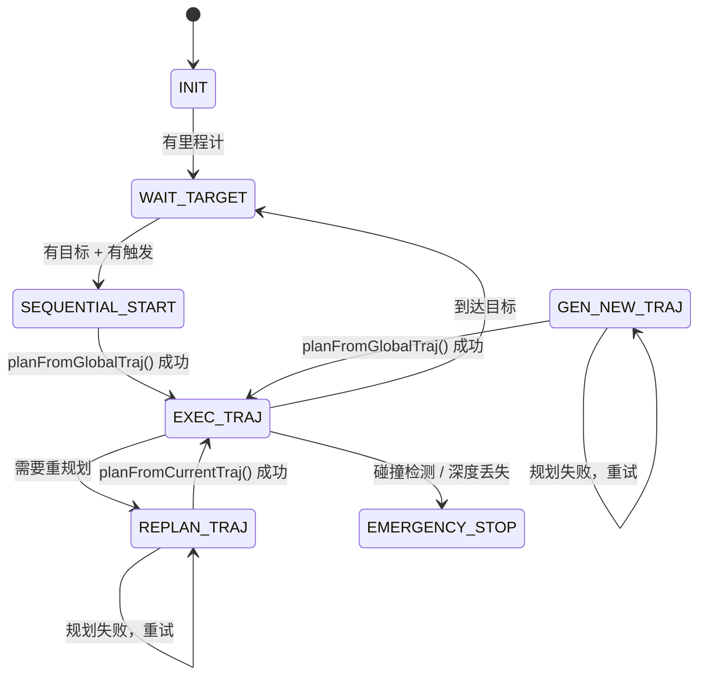

# EGO Planner 架构审阅与 Predictor 集成分析

> 审阅日期: 2026-06-16
> 审阅范围: `src/iap/sim/ego_planner_swarm_ws` (EGO Planner) + `src/iap/` (新版 IAP 模块)

---

## 一、代码库整体结构

```
src/iap/
├── include/iap/
│   ├── predictor/          ← ★ 新版 Predictor（独立 advisory 模块，刚更新）
│   ├── planner/            ← 新版完整性规划器（integrity_planner 等）
│   ├── map/                ← LocalOccupancyGrid（轻量 voxel-hash 占据栅格）
│   └── mapping/            ← 全局/子图建图
├── src/iap/
│   ├── predictor/          ← PredictorModule 实现
│   ├── planner/            ← 规划器实现
│   └── map/                ← LocalOccupancyGrid 实现
└── sim/ego_planner_swarm_ws/
    └── src/planner/
        ├── plan_manage/    ← EGO Planner 主节点（FSM + PlannerManager）
        ├── plan_env/       ← 旧版 GridMap + ObjPredictor（动态障碍物预测）
        ├── path_searching/ ← A* 路径搜索
        ├── bspline_opt/    ← B 样条轨迹优化
        └── traj_utils/     ← 轨迹消息/可视化
```

**关键区别**：
- `src/iap/` 下是 **新版 IAP 模块**（predictor, planner, map）—— 独立、可测试、解耦
- `src/iap/sim/ego_planner_swarm_ws/` 下是 **旧版 EGO Planner**（Phase 1 基线）—— 自包含、紧耦合

---

## 二、核心问题回答：Grid Map Builder 应该作为独立模块还是 Planner 子功能？

### 当前现状

代码库中存在**两套** Grid Map：

| | 旧版 GridMap | 新版 LocalOccupancyGrid |
|---|---|---|
| **位置** | `sim/.../plan_env/grid_map.h/cpp` | `include/iap/map/local_occupancy.hpp` |
| **类型** | 稠密 3D 体素占据栅格 | 轻量 voxel-hash 占据栅格 |
| **依赖** | ROS 2、PCL、cv_bridge、深度图 | 仅 Eigen + STL（零 ROS 依赖） |
| **耦合度** | 紧耦合于 EGOPlannerManager | 完全独立，被 PredictorModule 使用 |
| **功能** | 深度图融合 + 射线投射 + 占据概率 | 射线遮挡查询 + 占据率查询 |
| **风险叠加** | 支持 integrity cost overlay | 无（纯几何占据） |

### 建议：Grid Map Builder 应作为**独立模块**

理由：
1. **PredictorModule 已经示范了正确模式** —— `LocalOccupancyGrid` 是独立模块，通过 `set_local_occupancy()` 注入给 PredictorModule，不依赖任何特定规划器
2. **可测试性** —— 独立模块可单独编写单元测试，不需要启动完整规划器
3. **可替换性** —— 如果未来换用其他建图算法（如 TSDF、ESDF），不影响规划器
4. **与新版 IAP 架构一致** —— `src/iap/map/` 和 `src/iap/mapping/` 已经是独立目录

**但需注意**：旧版 `GridMap` 已经深度耦合在 `EGOPlannerManager` 中（`initPlanModules` 直接 `new GridMap`）。如果要统一，需要：
- 要么将新版 Grid Map Builder 注入到 `EGOPlannerManager` 替换旧版 GridMap
- 要么在旧版 GridMap 之上封装适配层（adapter pattern）

---

## 三、`iap_phase1_tools` 是否在主流程中被启用？

**答案：否，未启用。**

`src/iap/sim/ego_planner_swarm_ws/src/iap_phase1_tools/` 包含两个 Python 工具：

| 文件 | 用途 |
|------|------|
| `phase1_closed_loop_logger.py` | 离线记录飞行遥测数据的日志工具 |
| `phase2_planner_integrity_evaluator.py` | 事后分析轨迹完整性指标的评估工具 |

**验证结果**：
- 在 `ego_planner_swarm_ws` 的所有 `.cpp`/`.h`/`.py` launch 文件中，**没有任何地方** import 或引用 `iap_phase1_tools`
- 它是独立的 ROS 2 Python 包，需手动单独启动（`ros2 run iap_phase1_tools phase1_closed_loop_logger`）
- 仅在 `demo10` 的 launch 文件中通过 `log_phase1` 参数控制是否记录，但工具本身不是被 launch 文件自动启动的

---

## 四、Planner 的输入是什么？

EGO Planner 通过以下 ROS 2 订阅获取输入：

| Topic | 消息类型 | 用途 | 订阅位置 |
|-------|---------|------|---------|
| `odom_world` | `nav_msgs/Odometry` | 无人机位姿（位置、速度、姿态） | `ego_replan_fsm.cpp:init()` → `odometryCallback()` |
| `/drone_{id-1}_planning/swarm_trajs` | `traj_utils/MultiBsplines` | 前序无人机轨迹（集群避碰） | `ego_replan_fsm.cpp:init()` → `swarmTrajsCallback()` |
| `/move_base_simple/goal` | `geometry_msgs/PoseStamped` | 手动目标点（MANUAL_TARGET 模式） | `ego_replan_fsm.cpp:init()` → `waypointCallback()` |
| `/traj_start_trigger` | `geometry_msgs/PoseStamped` | 触发信号（PRESET_TARGET 模式） | `ego_replan_fsm.cpp:init()` → `triggerCallback()` |
| `/planning/broadcast_bspline_to_planner` | `traj_utils/Bspline` | 广播轨迹消息 | 内部通信 |
| `/dynamic/obj` | `visualization_msgs/Marker` | 动态障碍物（ObjPredictor 启用时） | `obj_predictor.cpp:init()` → `markerCallback()` |

此外，**GridMap 内部订阅**（通过 `message_filters` 同步）：
- 深度图 + 点云 + 里程计，用于实时占据栅格更新

---

## 五、Grid Map 在哪里被创建？

**创建位置**：`EGOPlannerManager::initPlanModules()`  
**文件**：`src/iap/sim/ego_planner_swarm_ws/src/planner/plan_manage/src/planner_manager.cpp` 第 48-50 行

```cpp
grid_map_.reset(new GridMap);       // 分配内存
grid_map_->initMap(node);           // 初始化：加载参数、初始化占据栅格、设置相机内参
```

**初始化入口**：`GridMap::initMap()`  
**文件**：`src/iap/sim/ego_planner_swarm_ws/src/planner/plan_env/src/grid_map.cpp` 第 177 行

`initMap()` 做了以下事情：
1. 加载 grid_map 参数（分辨率、地图尺寸、局部更新范围、膨胀半径）
2. 加载深度相机内参（fx, fy, cx, cy）
3. 配置占据概率参数（p_hit, p_miss, p_min, p_max, p_occ）
4. 配置射线投射参数（min/max ray length）
5. 配置风险叠加层（risk_overlay）参数（如启用）
6. 初始化 voxel hash 地图数据结构

**调用链**：
```
main()                                                 [ego_planner_node.cpp]
  → EGOReplanFSM::init()                               [ego_replan_fsm.cpp]
    → EGOPlannerManager::initPlanModules()             [planner_manager.cpp:48-50]
      → grid_map_.reset(new GridMap)
      → grid_map_->initMap(node)                       [grid_map.cpp:177]
```

---

## 六、Planner 完整流程梳理

### 6.1 总览：FSM 状态机

EGO Planner 采用**有限状态机 (FSM)** 架构，以 100Hz 定时器驱动：



### 6.2 关键函数与调用链

#### 入口
```
main()                                                 [ego_planner_node.cpp:12]
  └─ EGOReplanFSM::init(node)                         [ego_replan_fsm.cpp:10]
       ├─ 声明/加载 FSM 参数
       ├─ planner_manager_->initPlanModules()          ← GridMap 在此创建
       ├─ 创建定时器: exec_timer_(100Hz), safety_timer_(50Hz)
       └─ 创建订阅: odom, swarm_trajs, goal, trigger
```

#### 100Hz 主循环 — `execFSMCallback()`
**文件**: `ego_replan_fsm.cpp:465`

FSM 状态枚举: `INIT → WAIT_TARGET → SEQUENTIAL_START → GEN_NEW_TRAJ → REPLAN_TRAJ → EXEC_TRAJ → EMERGENCY_STOP`

各状态行为：
- **INIT**: 等待里程计就绪 → 转 WAIT_TARGET
- **WAIT_TARGET**: 等待目标和触发信号 → 转 SEQUENTIAL_START
- **SEQUENTIAL_START**: 集群同步等待前序无人机 → `planFromGlobalTraj(10)` → 转 EXEC_TRAJ  
  函数: `planFromGlobalTraj()` [ego_replan_fsm.cpp:642]
- **GEN_NEW_TRAJ**: 重新执行 `planFromGlobalTraj(10)` → 转 EXEC_TRAJ  
  函数: `planFromGlobalTraj()` [ego_replan_fsm.cpp:642]
- **REPLAN_TRAJ**: 执行 `planFromCurrentTraj(1)` → 转 EXEC_TRAJ  
  函数: `planFromCurrentTraj()` [ego_replan_fsm.cpp:665]
- **EXEC_TRAJ**: 检测是否需要重规划
  - 到达中间航点 → 切换下一航点
  - 接近全局目标 → 转 WAIT_TARGET
  - 偏离轨迹超过阈值 → 转 REPLAN_TRAJ
- **EMERGENCY_STOP**: 仅 fail_safe 启用时可恢复

#### 两种规划模式

**A. 全局规划** — `planFromGlobalTraj()` [ego_replan_fsm.cpp:642]
```
planFromGlobalTraj(trial_times)
  ├─ start_pt_ = odom_pos_（当前位置）
  ├─ start_vel_ = odom_vel_
  ├─ for trial_times:
  │    └─ callReboundReplan(flag_poly_init, flag_random_poly)
  │         ├─ getLocalTarget()                         ← 确定局部目标点
  │         └─ planner_manager_->reboundReplan()        ← 核心规划
  └─ return success
```

**B. 局部重规划** — `planFromCurrentTraj()` [ego_replan_fsm.cpp:665]
```
planFromCurrentTraj(trial_times)
  ├─ 从当前轨迹上插值获取 start_pt_, start_vel_, start_acc_
  ├─ callReboundReplan(false, false)                    ← 先尝试基于当前轨迹优化
  ├─ 失败 → callReboundReplan(true, false)              ← 回退到多项式初始化
  └─ 失败 → callReboundReplan(true, true)               ← 回退到随机初始化
```

#### 核心规划引擎 — `reboundReplan()`
**文件**: `planner_manager.cpp:64`

```
EGOPlannerManager::reboundReplan(start_pt, start_vel, start_acc,
                                  local_target_pt, local_target_vel,
                                  flag_polyInit, flag_randomPolyTraj)

  STEP 1: 计算时间步长 ts
    - 基于起点到目标点距离与最大速度计算
    - 距离 > 0.1: ts = ctrl_pt_dist / max_vel * 1.5
    - 否则:     ts = ctrl_pt_dist / max_vel * 5

  STEP 2: 生成初始轨迹
    - 首次/多项式模式: min-snap 多项式轨迹
    - 随机模式: 随机多项式轨迹

  STEP 3: B 样条轨迹优化
    bspline_optimizer_->reboundOptimize()
      优化目标（多目标加权）:
        ├─ 平滑度代价 (smoothness)
        ├─ 避障代价 (obstacle distance)
        ├─ 可行性代价 (velocity/acceleration limits)
        ├─ 集群代价 (swarm collision avoidance)
        ├─ 终端代价 (reach goal)
        └─ 完整性代价 (integrity cost, 如启用)

  STEP 4: 轨迹精调（可选）
    refineTrajAlgo() → 重新参数化 B 样条

  STEP 5: 发布轨迹
    - 发布 B 样条到 /planning/bspline
    - 更新集群轨迹缓冲区
```

#### 安全检测（50Hz — 独立定时器）
**文件**: `ego_replan_fsm.cpp:700`
```
checkCollisionCallback()
  ├─ 检查深度图是否超时 → EMERGENCY_STOP
  └─ 沿轨迹采样点，检查是否碰撞 → EMERGENCY_STOP
```

### 6.3 Predictor 现状

**新版 `iap::PredictorModule`**（`src/iap/src/iap/predictor/predictor_module.cpp`）：
- ✅ 已实现完整的 GNSS/LiDAR/Fusion advisory 预测
- ✅ 使用 `LocalOccupancyGrid` 做可见性查询
- ✅ 输出 `PredictorQueryResult`（含 HPL/VPL、FIM、可观测性）
- ❌ **尚未被任何规划器调用** —— 未集成到 EGO Planner 或 integrity_planner

**旧版 `fast_planner::ObjPredictor`**（`sim/.../plan_env/obj_predictor.cpp`）：
- 功能：动态障碍物轨迹预测（匀速/多项式）
- ❌ **从未被初始化** —— 在 `planner_manager.cpp:55` 中 `obj_predictor_` 始终为 `nullptr`
- 被传入 `bspline_optimizer_->setEnvironment(grid_map_, obj_predictor_)` 但从未使用

**关键结论**：当前规划器中**没有任何 predictor 功能在运行**，无论是新版的 integrity predictor 还是旧版的动态障碍物 predictor。

---

## 七、Predictor 集成到 Grid Map Builder 的架构建议

基于以上审阅，关于"在 grid map builder 中调用 predictor"的路线：

### 推荐方案：独立注入模式

```
                    ┌──────────────────┐
                    │ PredictorModule  │  ← 独立模块（已在 src/iap/predictor/）
                    │  - query()       │
                    │  - set_local_    │
                    │    occupancy()   │
                    └────────┬─────────┘
                             │ 注入
                    ┌────────▼─────────┐
                    │ LocalOccupancy-  │  ← 独立模块（已在 src/iap/map/）
                    │ Grid             │
                    └────────┬─────────┘
                             │ 注入
        ┌────────────────────┼────────────────────┐
        │                    │                    │
┌───────▼──────┐   ┌────────▼────────┐   ┌───────▼──────┐
│ Grid Map     │   │ Integrity       │   │ EGO Planner  │
│ Builder      │   │ Planner         │   │ (legacy)     │
│ (新模块)     │   │ (src/iap/       │   │ (sim/ego_    │
│              │   │  planner/)      │   │  planner_)   │
└──────────────┘   └─────────────────┘   └──────────────┘
```

**理由**：
1. Grid Map Builder 专注建图（输入 sensor data → 输出占据栅格）
2. PredictorModule 专注预测（输入栅格 + 状态 → 输出 PL/FIM）
3. 两者通过 `LocalOccupancyGrid` 接口解耦
4. 规划器从两个独立模块分别获取栅格和预测结果

**不推荐**把 predictor 作为 Grid Map Builder 的子功能，因为这会导致：
- Grid Map Builder 职责不清（既要建图又要预测）
- Predictor 无法脱离特定建图算法独立测试
- 与现有 `src/iap/` 的模块化架构方向不一致

---

## 八、总结

| 问题 | 答案 |
|------|------|
| Grid Map Builder 独立还是子功能？ | **建议独立模块**，通过 LocalOccupancyGrid 接口与 predictor/planner 解耦 |
| iap_phase1_tools 是否启用？ | **否**，是独立的离线分析工具，不在主流程中 |
| Planner 的输入？ | odom_world（里程计）、swarm_trajs（集群轨迹）、goal/trigger（目标）、深度图（内部） |
| Grid Map 创建位置？ | `EGOPlannerManager::initPlanModules()` → `grid_map_->initMap(node)` |
| Predictor 是否在 Planner 中使用？ | **否**，新版 `PredictorModule` 未集成，旧版 `ObjPredictor` 未初始化 |

---

## 附录：相关文件清单

| 文件 | 说明 |
|------|------|
| `sim/ego_planner_swarm_ws/src/planner/plan_manage/src/ego_planner_node.cpp` | 主入口 `main()` |
| `sim/ego_planner_swarm_ws/src/planner/plan_manage/src/ego_replan_fsm.cpp` | FSM 状态机流程 |
| `sim/ego_planner_swarm_ws/src/planner/plan_manage/src/planner_manager.cpp` | 规划核心 + GridMap 创建（第 48-50 行） |
| `sim/ego_planner_swarm_ws/src/planner/plan_env/src/grid_map.cpp` | GridMap 实现 + `initMap()`（第 177 行） |
| `sim/ego_planner_swarm_ws/src/planner/plan_env/src/obj_predictor.cpp` | 旧版动态障碍物预测器（**未启用**） |
| `sim/ego_planner_swarm_ws/src/planner/bspline_opt/src/bspline_optimizer.cpp` | B 样条优化引擎 |
| `sim/ego_planner_swarm_ws/src/planner/path_searching/src/dyn_a_star.cpp` | A* 路径搜索 |
| `src/iap/include/iap/predictor/predictor_module.hpp` | 新版 PredictorModule 接口 |
| `src/iap/include/iap/predictor/predictor_types.hpp` | Predictor 数据类型定义 |
| `src/iap/src/iap/predictor/predictor_module.cpp` | 新版 PredictorModule 实现 |
| `src/iap/include/iap/map/local_occupancy.hpp` | 新版 LocalOccupancyGrid 接口 |
| `sim/ego_planner_swarm_ws/src/iap_phase1_tools/` | 离线日志/评估工具（**未集成**） |
| `launch/demo9_ego_planner_closed_loop.launch.py` | Phase 1 闭环仿真 launch |
| `launch/demo10_ego_planner_pi_lite_eval.launch.py` | Phase 2 PI-lite 评估 launch |
