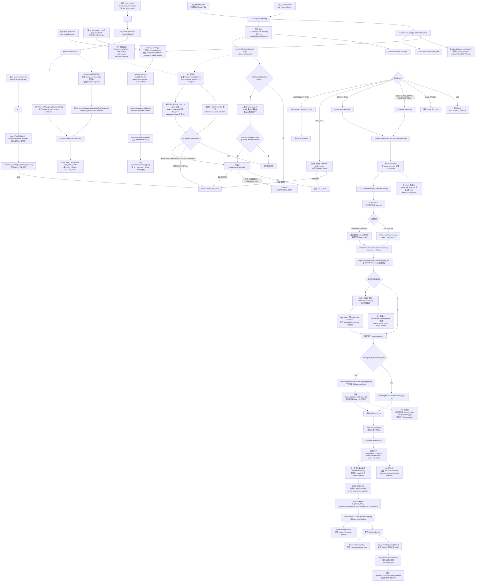
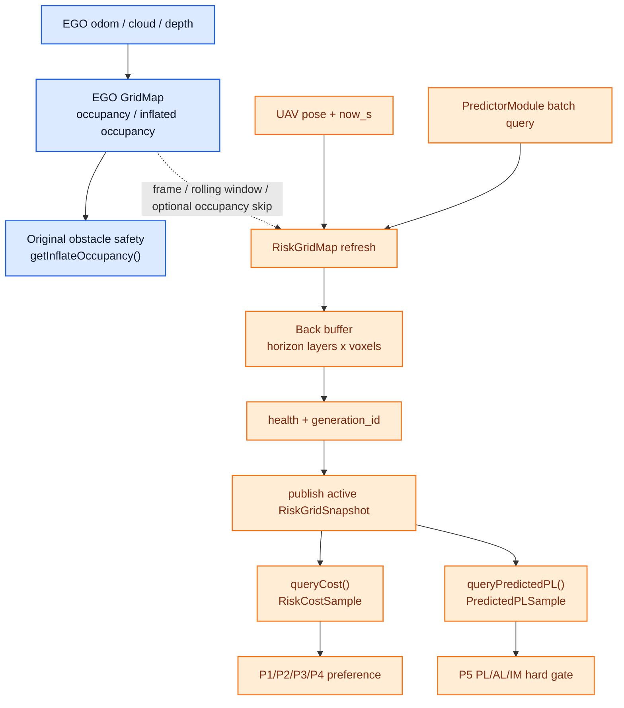
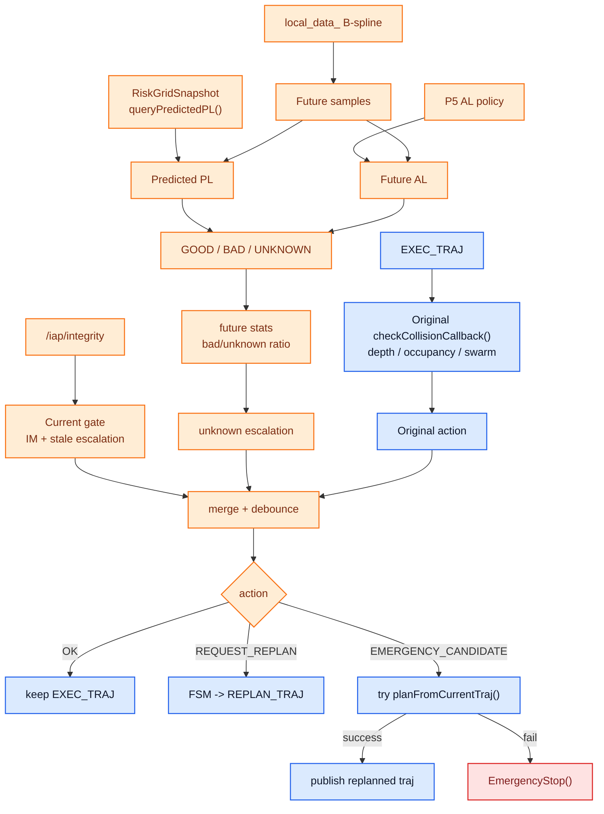
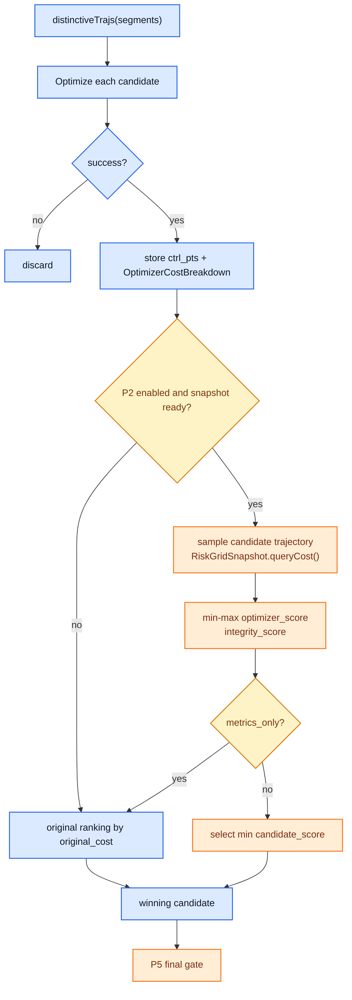
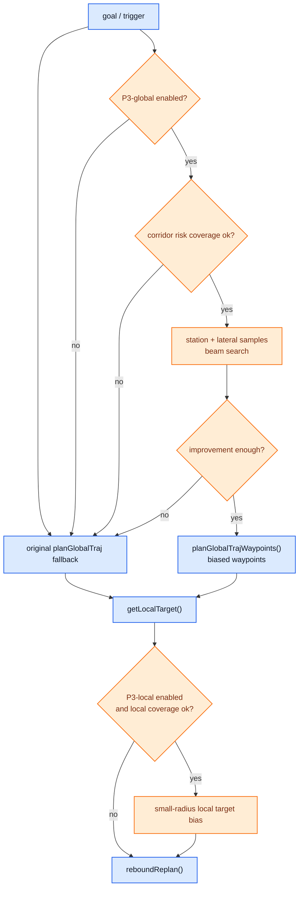
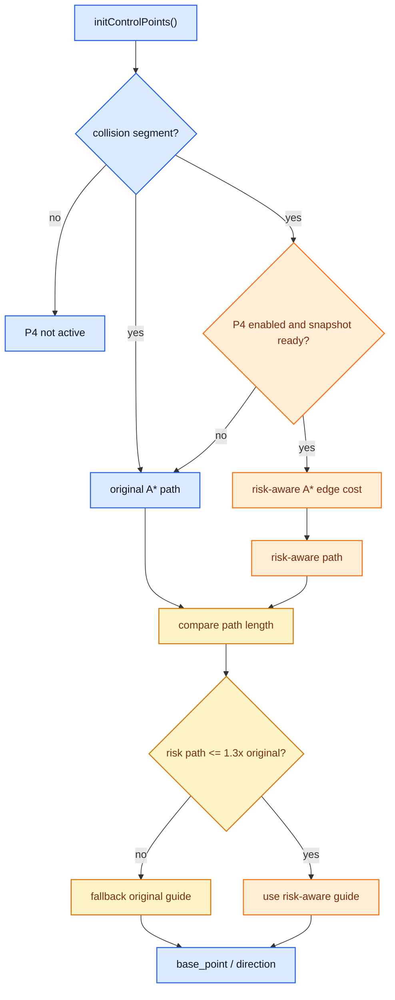

# 当前 IAP 仓库 Original EGO Planner 流程 Audit

本文以当前仓库代码为准，梳理 IAP 中移植版 EGO planner 的原始运行流程，并标记后续 Safety Planner 需要插入或修改的位置。当前 planner 主路径是:

```text
src/iap/src/iap/planner/...
```

旧路径 `src/iap/sim/ego_planner_swarm_ws/...` 可作为来源参考，但不应作为当前开发落点。

## 1. Audit 结论

当前 EGO planner 本质是一个基于局部 occupancy map 的 rebound B-spline planner。它用 `GridMap` 维护障碍物栅格，用 FSM 管理目标、重规划和急停，用 `EGOPlannerManager::reboundReplan()` 生成局部轨迹，并用 `BsplineOptimizer` 在碰撞、平滑性、动力学可行性、swarm clearance 和终端误差之间优化 B-spline 控制点。

原始流程没有真正使用 IAP 的 integrity risk。当前 `BsplineOptimizer::combineCostRebound()` 只组合:

```text
smoothness + collision distance + feasibility + swarm + terminal
```

`AStar::AstarSearch()` 也只跳过 occupied voxel，不使用 risk cost。FSM 的 50 ms safety callback 只检查 depth timeout、未来轨迹碰撞和 swarm 距离，不检查 `PL_pred < AL`。

因此 Safety Planner 的合理改造方式不是重写整个 planner，而是在现有链路上分层插入:

```text
P0: multi-horizon PlannerIntegrityField / RiskGridMap snapshot
P5: runtime integrity supervisor
P1: backend soft integrity cost
P2: distinctive trajectory candidate ranking
P3: coverage-gated reference bias
P4: collision-segment-only risk-aware A* fallback
```

默认开关关闭时，应保持 demo9 / original planner 行为不变。

## 2. 当前代码入口与模块边界

| 模块 | 当前代码节点 | 原始职责 | 当前是否使用 integrity risk |
|---|---|---|---|
| planner node | `ego_planner_node.cpp` | 创建 `EGOReplanFSM` 并 `spin()` | 否 |
| FSM | `EGOReplanFSM` | 目标触发、状态机、重规划、发布轨迹、原始 safety check | 否 |
| planner manager | `EGOPlannerManager` | 初始化地图/优化器/A*，执行 global/local planning | 否 |
| map | `GridMap` | 订阅 odom/cloud/depth，维护 occupancy 与 inflated occupancy | 否 |
| A* | `AStar::AstarSearch()` | 在碰撞段起终点之间找无碰撞 rebound guide | 否 |
| optimizer | `BsplineOptimizer` | B-spline 控制点初始化、候选生成、L-BFGS 优化 | 否 |
| traj server | `traj_server.cpp` | 订阅 `planning/bspline`，采样 B-spline，输出 position command | 否 |

关键 ROS topic / remap 来自 `advanced_param.launch.py`:

```text
odom_world        <- odometry_topic
grid_map/odom    <- odometry_topic
grid_map/cloud   <- cloud_topic
grid_map/depth   <- depth_topic
planning/bspline -> drone_<id>_planning/bspline
```

## 3. Original Planner Mermaid 流程图

下面流程图按程序运行顺序组织。蓝色链路是 original EGO planner 主流程；带 `[P* 修改点]` 的节点是 Safety Planner 建议插入位置。



## 4. 原始流程逐步解释

### 4.1 输入与地图更新

`GridMap::initMap()` 在 planner node 内部初始化，并订阅 `grid_map/odom`、`grid_map/cloud`、`grid_map/depth` 等输入。点云或深度图经过 raycast 和 log-odds 更新后写入 `occupancy_buffer_`，再通过 `clearAndInflateLocalMap()` 生成 `occupancy_buffer_inflate_`。

后续 A*、B-spline optimizer 和 safety callback 都主要通过:

```cpp
grid_map_->getInflateOccupancy(pos)
```

查询障碍物。这个接口当前只表达 obstacle occupancy，不表达 GNSS/LiDAR integrity risk。

### 4.2 FSM 主循环

`EGOReplanFSM::init()` 创建两个主要 timer:

```text
10 ms: execFSMCallback()
50 ms: checkCollisionCallback()
```

`execFSMCallback()` 管理状态机:

```text
INIT -> WAIT_TARGET -> SEQUENTIAL_START / GEN_NEW_TRAJ -> EXEC_TRAJ
EXEC_TRAJ -> REPLAN_TRAJ
任意 safety unsafe -> EMERGENCY_STOP
```

manual target 来自 `/move_base_simple/goal`，preset target 由 launch 参数中的 waypoints 和 `/traj_start_trigger` 驱动。

当前 FSM 状态有哪些？
当前代码里的 FSM 状态是这些：
状态	含义	后续操作
INIT	初始化状态，等待 odom	有 odom 后进入 WAIT_TARGET
WAIT_TARGET	等待目标点和 trigger	有 target/trigger 后进入 SEQUENTIAL_START
SEQUENTIAL_START	swarm 顺序启动状态	满足 swarm 前序条件后调用 planFromGlobalTraj()
GEN_NEW_TRAJ	从 global reference 生成新轨迹	成功后进入 EXEC_TRAJ，失败则继续尝试
REPLAN_TRAJ	从当前执行轨迹继续重规划	成功后进入 EXEC_TRAJ，失败则保持重规划
EXEC_TRAJ	正在执行当前 B-spline	到达目标、超时或安全触发时切状态
EMERGENCY_STOP	发布 stop trajectory	停住；若 fail-safe 且速度很低，可回 GEN_NEW_TRAJ

### 4.3 Global Reference 与 Local Target

收到目标后，`planNextWaypoint()` 调用:

```cpp
EGOPlannerManager::planGlobalTraj(...)
```

该函数用 min-snap polynomial 生成 global reference，并保存到 `global_data_`。真正每次局部规划前，FSM 会在 `callReboundReplan()` 中调用 `getLocalTarget()`，从 global reference 上截取当前 planning horizon 内的 local target。

这不是全局 obstacle-aware search。global reference 主要是任务方向参考，不会绕障，也不会考虑 integrity risk。

### 4.4 Local Replan 主链路

`planFromGlobalTraj()` 和 `planFromCurrentTraj()` 最终都会进入:

```cpp
EGOReplanFSM::callReboundReplan()
  -> EGOPlannerManager::reboundReplan()
```

`reboundReplan()` 分三步:

1. INIT: 生成初始点集，再 parameterize 成 B-spline control points。
2. OPTIMIZE: 用 rebound optimizer 优化控制点。
3. REFINE: 必要时重分配时间，满足速度/加速度约束。

初始点集来源有两类:

```text
first / force poly init:
  start -> local target 的 polynomial trajectory

replan from current traj:
  当前执行 B-spline 剩余段 + local target 拼接段
```

### 4.5 A* 在原始流程中的真实作用

`BsplineOptimizer::initControlPoints()` 会沿初始控制点检查 inflated occupancy，并将进入/离开障碍物的区间切成 collision segments。

只有发现 collision segments 时，才对每个 segment 调用:

```cpp
AStar::AstarSearch(step_size, in, out)
```

这里的 A* 不是完整的全局路径搜索，也不是 EGO 的主要前端。它只为局部碰撞段提供一条无碰撞 guide path，用来反推出每个控制点的 `base_point` 和 `direction`，供后端 distance cost 把 B-spline 推离障碍物。

因此 P4 risk-aware A* 应放在后期实验阶段，并且只应被理解为 collision-segment guide fallback。若当前轨迹没有触发 collision segment，但 integrity risk 很高，P4 完全不会运行；这类情况应由 P5 gate 触发重规划，并由 P1/P2/P3 的 risk preference 改变轨迹选择。P4 还必须限制 risk-aware path 的额外长度，避免为了低 risk 破坏 rebound guide 的几何稳定性。

### 4.6 B-spline Optimization

`BsplineOptimizer::rebound_optimize()` 使用 L-BFGS 优化控制点。核心代价组合在:

```cpp
BsplineOptimizer::combineCostRebound()
```

当前组合项是:

```text
lambda_smooth      * smoothness
new_lambda_collision * collision distance
lambda_feasibility * feasibility
new_lambda_collision * swarm
lambda_collision   * terminal
```

没有 integrity cost，也没有 `PL_pred < AL` 判定。

`manager/use_distinctive_trajs=true` 时，会调用 `distinctiveTrajs()` 生成多条候选并逐条优化。原始逻辑只按 `final_cost` 选择最小值，这正是 P2 candidate ranking 的自然插入点。

### 4.7 轨迹发布与执行

规划成功后，`callReboundReplan()` 将 `local_data_.position_traj_` 打包成:

```text
traj_utils/msg/Bspline
```

并发布到:

```text
planning/bspline
```

`traj_server` 订阅该 topic，在 `bsplineCallback()` 中解析控制点和 knots，在 `cmdCallback()` 中按当前时间采样 position、velocity、acceleration、yaw，并输出 `quadrotor_msgs/PositionCommand` 给控制器或仿真器。

### 4.8 原始 Safety Check

`checkCollisionCallback()` 每 50 ms 运行一次。当前逻辑是:

1. 若 depth/odom timeout，则进入 `EMERGENCY_STOP`。
2. 从当前轨迹时间 `t_cur` 开始，沿当前 B-spline 向未来采样。
3. 检查 inflated occupancy。
4. 检查其他无人机轨迹距离。
5. 若发现 unsafe，先尝试 `planFromCurrentTraj()`。
6. 若重规划失败且距离违例时间小于 `emergency_time_`，进入 `EMERGENCY_STOP`；否则进入 `REPLAN_TRAJ`。

这个 safety loop 是 P5 最适合插入的位置。P5 应与原始 collision check 并列，而不是替代 occupancy safety。

## 5. Safety Planner 修改位置总表

| 阶段 | 修改点 | 对应 original 节点 | 修改方式 | 默认关闭时行为 |
|---|---|---|---|---|
| P0 | 数据底座 | Predictor / RiskGrid / integrity cost field | 提供 planner 查询接口或缓存，不直接改 EGO 决策 | 不影响 |
| P5 | Runtime Integrity Supervisor | `EGOReplanFSM::checkCollisionCallback()` 附近 | 新增 `checkTrajIntegrity()`，检查当前 `/iap/integrity` 和未来轨迹 `PL_pred < AL` | 不影响 |
| P2 | 候选排序 | `manager/use_distinctive_trajs` 分支 | 多候选优化成功后，用 integrity score 二次排序 | 不影响 |
| P1 | 后端 soft cost | `BsplineOptimizer::combineCostRebound()` | 增加低权重 `calcIntegrityCost()`，只表达定位质量偏好 | cost 等价原始 |
| P3 | coverage-gated reference bias | `getLocalTarget()` / `planGlobalTrajWaypoints()` | rolling grid 下默认 local reference bias；global bias 仅在 corridor coverage 足够时启用 | 不影响 |
| P4 | collision-segment-only A* guide fallback | `BsplineOptimizer::initControlPoints()` / `AStar::AstarSearch()` | 只在 collision segment guide 中加入 risk cost，并带 path length fallback | A* 等价原始 |

关键边界:

- P5 是 `PL_pred < AL` 的唯一硬安全裁决者。
- P1/P2/P3/P4 只能改变轨迹偏好或候选选择，不能替代 P5 的 hard safety statement。
- `/iap/integrity_cost_field` 更适合 P1 soft cost，不应作为 P5 的核心输入。
- ARAIM 当前 monitor 和 Predictor future PL 的语义必须分开: 当前 certified monitor 来自 `/iap/integrity`，未来 advisory PL 来自 Predictor。

## 6. Audit 结论与开发建议

当前 original planner 已经具备清晰的局部规划闭环:

```text
occupancy map -> initial B-spline -> rebound optimize -> publish B-spline -> runtime collision check
```

Safety Planner 不应一开始重写该闭环。建议按以下顺序开发:

1. **P5**: 在 FSM safety loop 旁加入完整性硬监督。只触发 replan / emergency，不改变 optimizer。
2. **P1**: 在 `combineCostRebound()` 加低权重 integrity soft cost，固定 risk snapshot，并按 gradient ratio 调参。
3. **P2**: 利用已有 `use_distinctive_trajs` 分支，对多候选轨迹做 metrics-only，再启用 ranking。
4. **P3-local**: 在 rolling risk coverage 内做小范围 reference/local target bias。
5. **P3-global**: 仅在 risk source 覆盖 start-goal corridor 时启用。
6. **P4**: 只有在局部 collision segment guide 需要 fallback 时，再对 A* 做 risk-aware edge cost。

开发验收应始终保留一条 baseline:

```text
所有 integrity planner 开关关闭时，demo9 / original planner 行为保持不变。
```

### 6.1 Planner Review 修正意见采纳结论

`Planner_Review.pdf` 的总体判断合理，本文件已按 review 口径同步。逐模块采纳结论如下:

| 模块 | 评价 | 文档修正 |
|---|---|---|
| P0 | 合理但需增强 | 保留独立 `RiskGridMap`，补 multi-horizon buffer、`RiskGridSnapshot` 和 `acquireSnapshot()` |
| P5 | 合理但需补 fail-safe 语义 | 保留 Integrity Gate，补 stale/unknown 持续时间升级、final gate fail 语义和 status reason |
| P2 | 合理、低风险 | 保留 candidate ranking，补 `OptimizerCostBreakdown`、`original_cost` 评分和 min-max normalization |
| P1 | 合理、价值高 | 保留 trajectory-sampled soft cost，补固定 snapshot 和 gradient ratio 调参目标 |
| P3 | 动机合理但原设计过度承诺 | 降级为 coverage-gated reference bias；rolling grid 下默认只做 local/reference bias |
| P4 | 合理但价值有限 | 保留 optional fallback，明确只在 collision segment 生效，并补 path length ratio fallback |

因此第 10-15 章是最新可执行 spec；旧章节若出现更早的说法，以第 10-15 章为准。

## 7. 文档静态检查项

本文件生成后应满足:

```text
文件存在: src/iap/docs/dev_planner/iap_original_ego_planner_flow_audit.md
Mermaid fence 成对闭合
包含 flowchart TD
图中包含 P5 / P2 / P1 / P3 / P4 修改点
```


## 8. P0-P5 Overview

本章只保留 P0-P5 的职责索引和共同边界。第 10-15 章是后续开发的唯一详细设计口径；如果本章摘要和详细章节有冲突，以第 10-15 章为准。

### 8.1 共同边界

| 模块 | 负责 | 不负责 | 详细设计 |
|---|---|---|---|
| P0 `PlannerIntegrityField` / `RiskGridMap` | multi-horizon risk/PL 缓存、snapshot 查询 | 改 FSM、改轨迹、做 hard safety | 第 10 章 |
| P5 Runtime Integrity Gate | `PL_pred < AL` / IM hard gate、final gate、runtime gate | 生成 recovery target、做 optimizer cost | 第 11 章 |
| P2 Candidate Ranking | 对 EGO 已优化成功的候选二次排序 | 生成新候选、做 hard safety | 第 12 章 |
| P1 Soft Cost | 在 B-spline optimizer 中加入低权重 risk preference | 替代 collision/feasibility、做 hard safety | 第 13 章 |
| P3 Reference Bias | 在 risk coverage 允许时偏置 reference/local target | 通用 obstacle-aware global planning | 第 14 章 |
| P4 Local A* Guide Fallback | 只在 collision segment A* guide 中加入 risk edge preference | 全局走廊选择、无碰撞高风险场景处理 | 第 15 章 |

必须遵守:

- P5 是唯一 hard safety gate。
- P1/P2/P3/P4 只使用 `RiskGridMap::queryCost()` / `RiskCostSample`，不使用 raw PL 做 hard safety。
- P5 只使用 `RiskGridMap::queryPredictedPL()` / AL / IM，不使用 `c_pi`。
- P0 不嵌入 EGO `GridMap`，只与其同 frame、对齐 rolling window / indexing 风格。
- 所有 safety planner 功能默认关闭；关闭时 original EGO 行为不变。

### 8.2 推荐开发顺序

```text
1. P0 multi-horizon RiskGridMap + RiskGridSnapshot + read-only metrics
2. P5 final/runtime integrity gate + stale/unknown escalation
3. P1 trajectory-sampled soft cost，先 metrics-only，再小权重启用
4. P2 candidate ranking，先 metrics-only，再启用重排
5. P3-local reference bias，限制在 rolling risk coverage 内
6. P3-global reference bias，仅在 risk source 覆盖 start-goal corridor 时启用
7. P4 collision-segment-only local A* guide fallback
```

顺序里的 P3 不再默认作为 global 主线。原因是当前 P0 设计是 rolling local grid；只有当 risk source 覆盖整条 start-goal corridor 时，P3-global 才有足够数据做 corridor-level bias。

### 8.3 数据接口索引

```text
PlannerIntegrityField      抽象职责: planner 可查询的 integrity/risk field
RiskGridMap                具体缓存实现: multi-horizon rolling risk grid
RiskGridSnapshot           一次完整 generation 的只读快照
RiskCostSample             P1/P2/P3/P4 使用的 cost/gradient preference
PredictedPLSample          P5 使用的 raw predicted HPL/VPL
OptimizerCostBreakdown     P2 避免和 P1 double count 的 optimizer cost 分量
```

关键接口摘要:

```cpp
std::shared_ptr<const RiskGridSnapshot> RiskGridMap::acquireSnapshot() const;
RiskGridHealth RiskGridMap::health() const;

bool RiskGridSnapshot::queryCost(const Eigen::Vector3d& p_w,
                                 double query_time_s,
                                 RiskCostSample* out) const;

bool RiskGridSnapshot::queryPredictedPL(const Eigen::Vector3d& p_w,
                                        double query_time_s,
                                        PredictedPLSample* out) const;
```

P1/P2/P3/P4 应优先持有 `RiskGridSnapshot`，避免一次优化、排序或 reference bias 中途读到不同 generation。

### 8.4 实验与验收索引

| 阶段 | 主要验收 |
|---|---|
| P0 | snapshot generation 固定、multi-horizon interpolation 正确、unknown/stale 不默认为 0 risk |
| P5 | stale/unknown 持续时间升级正确，final gate fail 不发布轨迹且 FSM 返回语义清楚 |
| P1 | 单次 L-BFGS evaluation 固定 snapshot，sample 数受限，gradient ratio 约 5%-20% |
| P2 | 使用 `original_cost` 而非含 P1 的 `total_cost`，min-max normalization 稳定 |
| P3 | rolling grid 下只做 local/reference bias；global bias 必须检查 corridor coverage |
| P4 | 只在 collision segment A* 生效，risk path 过长时回退 original A* path |

## 9. 最终期望版本 Safety Planner Mermaid 流程图

下面是最终期望版本的整体运行流程。蓝色节点表示 original EGO planner 已有流程；橙色节点表示 IAP Safety Planner 新增或修改的流程。该图表达的是目标架构，不代表当前代码已经全部实现。

```mermaid
flowchart TD
  %% =========================
  %% Color convention
  %% =========================
  classDef original fill:#dbeafe,stroke:#2563eb,stroke-width:1.5px,color:#0f172a;
  classDef safety fill:#ffedd5,stroke:#f97316,stroke-width:1.5px,color:#7c2d12;

  %% =========================
  %% Original inputs and map
  %% =========================
  OI0["Original 输入: odom_world<br/>当前位置/速度/姿态"] --> OFSM0
  OI1["Original 输入: grid_map/odom<br/>grid_map/cloud / depth"] --> OMAP0
  OI2["Original 输入: goal / trigger<br/>waypoint 或手动目标"] --> OFSM1
  OI3["Original 输入: swarm trajectories<br/>其他无人机 B-spline"] --> OSW0

  OMAP0["GridMap::initMap()<br/>订阅里程计/点云/深度"] --> OMAP1["GridMap update<br/>raycast + log-odds occupancy"]
  OMAP1 --> OMAP2["Inflated occupancy<br/>getInflateOccupancy(pos)"]

  %% =========================
  %% Safety data foundation
  %% =========================
  SI0["Safety 输入: /iap/integrity<br/>ARAIM current certified monitor"] --> SP5
  SI1["Safety 输入: PredictorModule<br/>future advisory HPL/VPL query"] --> SP0
  SI2["Safety 输入: evaluator / risk grid<br/>/iap/integrity_cost_field 可选"] --> SP0
  SI3["Safety 输入: AlertLimitProvider<br/>cloud_clearance 或 fixed AL"] --> SP5

  SP0["P0 multi-horizon RiskGridMap<br/>RiskGridSnapshot cost / predicted PL cache"] --> SP2
  SP0 --> SP1
  SP0 --> SP3G
  SP0 --> SP3L
  SP0 --> SP4
  SP0 -. "P5 future PL 查询走语义化 adapter<br/>不使用 cost 替代 PL/AL/IM" .-> SP5

  %% =========================
  %% FSM and target handling
  %% =========================
  OFSM0["EGOReplanFSM::init()<br/>创建 manager、timer、pub/sub"] --> OMGR0
  OMGR0["EGOPlannerManager::initPlanModules()<br/>初始化 GridMap / BsplineOptimizer / A*"] --> OMAP0
  OMGR0 --> OOPT0["BsplineOptimizer::setParam()<br/>读取 original optimizer 参数"]
  OMGR0 --> OA0["AStar::initGridMap(grid_map)"]
  OMGR0 -. "接入只读 risk adapter" .-> SP0

  OFSM1["waypointCallback() / triggerCallback()"] --> OG0["planNextWaypoint()"]
  OG0 -.-> SP3G["P3 coverage-gated reference bias<br/>local default / global only with corridor coverage"]
  SP3G --> OG1A["biased intermediate waypoints<br/>若不可用则返回 fallback"]
  OG1A --> OG1B["planGlobalTrajWaypoints()<br/>生成 high-integrity global min-snap reference"]
  OG0 --> OG1["planGlobalTraj()<br/>original start-goal global reference fallback"]
  OG1B --> OG2["保存 biased 或 original global reference<br/>GlobalTrajData"]
  OG1 --> OG2

  OSW0["swarmTrajsCallback()<br/>缓存其他无人机轨迹"] --> OSW1["original swarm collision check"]

  %% =========================
  %% FSM execution and local replan
  %% =========================
  OFSM0 --> OT0["10 ms execFSMCallback()<br/>FSM 状态机"]
  OT0 --> OS0{"FSM state"}
  OS0 -->|"GEN_NEW_TRAJ / SEQUENTIAL_START"| OP0["planFromGlobalTraj()"]
  OS0 -->|"REPLAN_TRAJ"| OP1["planFromCurrentTraj()"]
  OS0 -->|"EXEC_TRAJ"| OEX0["original 执行中检查<br/>到达目标 / replan threshold"]
  OS0 -->|"EMERGENCY_STOP"| OEMG0["callEmergencyStop()"]

  OP0 --> OC0["callReboundReplan()"]
  OP1 --> OC0
  OC0 --> OL0["getLocalTarget()<br/>沿 global reference 取 local target"]
  OL0 -.-> SP3L["P3-local optional<br/>lightweight target bias only"]
  SP3L --> OL1["选择 biased local target<br/>若不可用则回退 original target"]
  OL0 --> OL1
  OL1 --> ORR0["reboundReplan()<br/>local B-spline planning"]

  %% =========================
  %% Initial B-spline and A*
  %% =========================
  ORR0 --> OINIT0["STEP 1 INIT<br/>polynomial 或 current-traj continuation"]
  OINIT0 --> OBS0["UniformBspline::parameterizeToBspline()<br/>生成 ctrl_pts"]
  OBS0 --> OIC0["initControlPoints(ctrl_pts)<br/>按 inflated occupancy 切 collision segments"]
  OMAP2 --> OIC0

  OIC0 --> OA1{"collision segments?"}
  OA1 -->|"否"| OOPT1["进入 rebound optimization"]
  OA1 -->|"是"| OA2["Original AStar::AstarSearch()<br/>生成绕障 guide path"]
  SP4["P4 collision-segment-only A* guide fallback<br/>risk cost + path length fallback"] -.-> OA2
  SP4 --> OA3["risk-aware guide path<br/>仍禁止穿越 occupied voxel"]
  OA2 --> OA3
  OA3 --> OIC1["计算 base_point / direction<br/>供 rebound distance cost 使用"]
  OIC1 --> OOPT1

  %% =========================
  %% Optimization, P2 and P1
  %% =========================
  OOPT1 --> OD0{"use_distinctive_trajs?"}
  OD0 -->|"false"| OB0["单候选 BsplineOptimizeTrajRebound()"]
  OD0 -->|"true"| OD1["distinctiveTrajs(segments)<br/>生成多候选 control points"]
  OD1 --> OD2["逐条 rebound optimize<br/>得到 OptimizerCostBreakdown 和候选 B-spline"]
  OD2 --> SP2["P2 Candidate Ranking<br/>按 original_cost + trajectory integrity score 选优"]
  SP2 --> OB1["winning candidate ctrl_pts"]
  OB0 --> OB1

  OB1 --> OLB0["rebound_optimize()<br/>L-BFGS 优化控制点"]
  OLB0 --> OCOST0["combineCostRebound()<br/>original cost: smoothness / collision / feasibility / swarm / terminal"]
  SP1["P1 Integrity Soft Cost<br/>fixed RiskGridSnapshot<br/>trajectory-sampled cost + clipped gradient"] --> OCOST0
  OCOST0 --> OLB1["优化后 original collision check / restart<br/>必要时 refine time"]
  OLB1 --> OUP0["updateTrajInfo()<br/>保存 local_data_ B-spline"]

  %% =========================
  %% Publish and execute
  %% =========================
  OUP0 --> OPUB0["发布 planning/bspline<br/>publishSwarmTrajs() / visualization"]
  OPUB0 --> OTS0["traj_server::bsplineCallback()<br/>解析控制点和 knots"]
  OTS0 --> OTS1["traj_server::cmdCallback()<br/>采样 pos/vel/acc/yaw"]
  OTS1 --> OOUT0["输出 PositionCommand<br/>控制器/仿真器执行"]

  %% =========================
  %% Runtime safety loops
  %% =========================
  OFSM0 --> OSAFE0["50 ms checkCollisionCallback()<br/>original runtime safety"]
  OSAFE0 --> OSAFE1{"Depth timeout / occupancy collision / swarm unsafe?"}
  OSAFE1 -->|"否"| OSAFE_OK["original safety OK"]
  OSAFE1 -->|"是"| OSAFE_REPLAN["尝试 planFromCurrentTraj()<br/>失败则 REPLAN 或 EMERGENCY"]

  OUP0 --> SP5
  SP5["P5 Runtime Integrity Gate<br/>stale/unknown escalation + final gate"] --> SP5A["检查当前 /iap/integrity<br/>HPL/VPL/HAL/VAL/IM/state"]
  SP5 --> SP5B["沿 local_data_ B-spline 采样未来轨迹<br/>RiskGridSnapshot 查询 PL_pred<br/>AL provider 计算 AL"]
  SP5A --> SP5C{"Integrity gate action?"}
  SP5B --> SP5C
  SP5C -->|"OK"| OSAFE_OK
  SP5C -->|"REQUEST_REPLAN"| SREPLAN["Safety 输出 REQUEST_REPLAN<br/>FSM -> REPLAN_TRAJ"]
  SP5C -->|"REQUEST_EMERGENCY_STOP_CANDIDATE"| SEMG["Safety emergency candidate<br/>先尝试 planFromCurrentTraj()<br/>失败才 EMERGENCY_STOP"]

  OSAFE_REPLAN --> OT0
  SREPLAN --> OT0
  SEMG --> OSAFE_REPLAN

  %% =========================
  %% Classes
  %% =========================
  class OI0,OI1,OI2,OI3,OFSM0,OMGR0,OMAP0,OMAP1,OMAP2,OOPT0,OA0,OFSM1,OG0,OG1,OG1B,OG2,OSW0,OSW1,OT0,OS0,OP0,OP1,OEX0,OEMG0,OC0,OL0,OL1,ORR0,OINIT0,OBS0,OIC0,OA1,OOPT1,OA2,OA3,OIC1,OD0,OB0,OD1,OD2,OB1,OLB0,OCOST0,OLB1,OUP0,OPUB0,OTS0,OTS1,OOUT0,OSAFE0,OSAFE1,OSAFE_OK,OSAFE_REPLAN original;
  class SI0,SI1,SI2,SI3,SP0,SP1,SP2,SP3G,OG1A,SP3L,SP4,SP5,SP5A,SP5B,SP5C,SREPLAN,SEMG safety;
```



图中橙色流程的职责边界如下:

| 修改点 | 图中节点 | 期望功能 |
|---|---|---|
| P0 | `RiskGridMap` | 统一缓存 risk cost 和 predicted PL，解耦 EGO 与 Predictor/evaluator |
| P5 | `Runtime Integrity Gate` | 判定当前执行轨迹是否仍可继续执行，输出 OK / REQUEST_REPLAN / emergency candidate |
| P2 | `Candidate Ranking` | 在已优化成功的多候选中选择完整性分数更好的轨迹 |
| P1 | `Integrity Soft Cost` | 给 L-BFGS 增加低权重定位完整性偏好 |
| P3 | `coverage-gated reference bias` | rolling grid 默认 local bias；global bias 仅在 corridor coverage 足够时启用 |
| P4 | `collision-segment-only A* guide fallback` | 仅在 collision segment guide 中考虑 risk，并限制 path length ratio |

最终期望是两条安全闭环并行:

```text
Original EGO safety:
  depth / occupancy / swarm unsafe -> replan or emergency

IAP Safety Planner:
  current/future integrity gate -> keep executing, request replan, or emergency candidate
```


## 10. P0 PlannerIntegrityField / RiskGridMap 重新设计：multi-horizon snapshot 缓存

本章是 P0 的唯一详细设计口径。`PlannerIntegrityField` 表示抽象职责：给 planner 提供完整性风险查询；`RiskGridMap` 是当前推荐的具体缓存实现。P0 不复用旧 `FuturePLFieldPredictor`、`PLGrid`、`UnifiedRiskGrid`、`PICostAdapter`、`alert_limit_model` 等 planner-side 代码。

核心原则:

```text
separate buffer, same world frame, multi-horizon snapshot
```

`RiskGridMap` 与 EGO `GridMap` 使用同一 world/map frame 和相似 indexing 风格，但保存独立 buffer。EGO `GridMap` 继续只表达 occupancy / inflated occupancy；`RiskGridMap` 表达 localization/integrity risk、predicted PL、valid/stale/unknown。

### 10.1 为什么必须是 multi-horizon

P5 会沿未来执行轨迹查询 `now_s + tau` 的 predicted PL。如果 P0 只有一个 quasi-static active buffer，却暴露 `query_time_s`，调用方会误以为它提供真正时变预测。正式设计直接采用 multi-horizon buffer:

```cpp
struct RiskGridMapParams {
  std::string frame_id = "world";
  double resolution_m = 0.75;
  double size_x_m = 30.0;
  double size_y_m = 30.0;
  double size_z_m = 6.0;
  std::vector<double> horizons_s = {0.0, 0.5, 1.0, 1.5, 2.0};
  double refresh_period_s = 0.5;
  double stale_timeout_s = 1.0;
  double unknown_cost = 10.0;
  double cost_max = 100.0;
  bool skip_occupied_voxels = true;
  bool use_predictor_batch_query = true;
};
```

内部语义:

```text
active_buffer[horizon_id][voxel_id]
back_buffer[horizon_id][voxel_id]
```

查询逻辑:

```text
tau = query_time_s - snapshot_stamp_s
1. 在 horizons_s 中找相邻 horizon layer
2. 每个 layer 内对 8 个 voxel 做 3D trilinear interpolation
3. 在两个 horizon layer 之间做 temporal linear interpolation
```

如果 `tau` 超出 horizon 范围，不外推为 safe，返回 unavailable/unknown，由下游 policy 处理。

### 10.2 数据结构与 snapshot 接口

```cpp
struct RiskGridHealth {
  bool ready = false;
  bool stale = true;
  double age_s = std::numeric_limits<double>::infinity();
  double valid_ratio = 0.0;
  double unknown_ratio = 1.0;
  uint64_t generation_id = 0;
};

struct RiskVoxel {
  double c_pi = NaN;
  double hpl_pred = NaN;
  double vpl_pred = NaN;
  double stamp_s = NaN;
  bool valid = false;
  bool stale = true;
  bool unknown = true;
  uint32_t source_flags = 0;
};

struct RiskCostSample {
  bool valid = false;
  bool stale = true;
  double cost = NaN;
  Eigen::Vector3d grad = Eigen::Vector3d::Zero();
  uint64_t generation_id = 0;
  std::string reason;
};

struct PredictedPLSample {
  bool available = false;
  bool valid = false;
  bool stale = true;
  double hpl_pred = NaN;
  double vpl_pred = NaN;
  double query_time_s = NaN;
  uint64_t generation_id = 0;
  std::string reason;
};

class RiskGridSnapshot {
public:
  RiskGridHealth health() const;
  double stamp_s() const;
  uint64_t generation_id() const;

  bool queryCost(const Eigen::Vector3d& p_w,
                 double query_time_s,
                 RiskCostSample* out) const;

  bool queryPredictedPL(const Eigen::Vector3d& p_w,
                        double query_time_s,
                        PredictedPLSample* out) const;
};

class RiskGridMap {
public:
  RiskGridHealth health() const;
  std::shared_ptr<const RiskGridSnapshot> acquireSnapshot() const;
  void updateFromPredictor(const Eigen::Vector3d& uav_position,
                           double now_s,
                           const EgoGridMapReadOnlyView& ego_grid,
                           PredictorModule& predictor);
};
```

`acquireSnapshot()` 返回 active buffer 的完整 generation。P1 的一次 L-BFGS 优化、P2 的一次候选排序、P3 的一次 reference bias、P4 的一次 A* 调用和 P5 的一次 trajectory check 都应使用固定 snapshot，避免中途 swap generation 后目标函数或 gate 输入突变。

### 10.3 更新流程

```text
RiskGridMap refresh tick:
  1. 读取 UAV pose 和 now_s
  2. 对每个 horizon_s[h] 构造 query_time = now_s + horizon_s[h]
  3. 以 UAV 为中心更新 rolling local window，只写 back buffer
  4. 对每个 horizon layer 和 voxel center 批量调用 Predictor
  5. 写入 hpl_pred/vpl_pred/c_pi/valid/stale/unknown
  6. 统计 health: ready, age, valid_ratio, unknown_ratio
  7. refresh 完整成功后递增 generation_id，一次性发布 snapshot
  8. refresh 失败时保留旧 active snapshot，仅让 health 随时间变 stale
```

`c_pi` 是 planner preference cost，可由 predicted PL 平滑映射得到；AL/IM hard safety 不在 P0 里计算，留给 P5。

### 10.4 查询流程

`queryCost()` 服务 P1/P2/P3/P4:

```text
p_w + query_time_s
  -> tau = query_time_s - snapshot_stamp_s
  -> find bracketing horizons
  -> 3D trilinear c_pi at lower horizon
  -> 3D trilinear c_pi at upper horizon
  -> temporal interpolation
  -> analytic gradient from spatial trilinear interpolation
```

`queryPredictedPL()` 服务 P5:

```text
p_w + query_time_s
  -> same horizon lookup
  -> interpolate hpl_pred / vpl_pred
  -> return PredictedPLSample
```

语义禁止混用:

- P1/P2/P3/P4 不能用 raw `hpl_pred/vpl_pred` 绕过 cost policy。
- P5 不能用 `c_pi` 或 `RiskCostSample.cost` 代替 `PL_pred < AL`。
- unknown/stale/out-of-range 不得返回 0 risk；必须填写 reason。

### 10.5 与 EGO GridMap 的关系

| 项目 | EGO `GridMap` | `RiskGridMap` |
|---|---|---|
| buffer | occupancy / inflated occupancy | multi-horizon risk/PL snapshot |
| frame | world/map | 必须相同 |
| resolution | 细，服务 obstacle | 粗，默认 `0.5-1.0 m` |
| rolling window | 局部 occupancy | 局部 integrity/risk |
| hard safety | `getInflateOccupancy()` | 无 hard safety，只提供查询 |

`RiskGridMap` 可以只读 EGO map frame、边界、rolling center 和 occupancy，用于跳过 occupied voxel 或标记 unknown，但不能修改 EGO occupancy 语义。

### 10.6 Mermaid 流程图



### 10.7 设计边界

- 不复用旧 planner-side headers: `FuturePLFieldPredictor`、`PLGrid`、`UnifiedRiskGrid`、`PICostAdapter`、`PredictedAraim`、`alert_limit_model`。
- 不把 `RiskGridMap` 当成 A* 主地图；P4 只用它做 edge preference。
- 不把 rolling local `RiskGridMap` 误写成全局 corridor coverage；P3-global 必须检查 coverage。
- 默认关闭时，original EGO planner 行为不变。


## 11. P5 Runtime Integrity Gate 设计：只判定当前轨迹是否可继续执行

本章是 P5 的唯一详细设计口径。P5 不是 recovery planner，不生成 forward/lateral/backtrack target；它只判断当前轨迹是否还能继续执行，并把结果映射到 original EGO FSM 的现有 replan/emergency 处理。

### 11.1 Action 与 FSM 映射

```cpp
enum class IntegrityGateAction {
  OK,
  REQUEST_REPLAN,
  REQUEST_EMERGENCY_STOP_CANDIDATE
};
```

| action | 含义 | FSM 侧处理 |
|---|---|---|
| `OK` | 当前 trajectory integrity 可继续执行 | 保持 `EXEC_TRAJ` |
| `REQUEST_REPLAN` | 当前轨迹不应继续按原样执行，但不临近严重风险 | `changeFSMExecState(REPLAN_TRAJ, "P5_REPLAN")` |
| `REQUEST_EMERGENCY_STOP_CANDIDATE` | 风险严重、临近，或数据源长时间失效 | 先尝试 `planFromCurrentTraj()`；失败才 `EmergencyStop()` |

`REQUEST_EMERGENCY_STOP_CANDIDATE` 不直接等于急停；它表示需要立即处理，并复用 original EGO 的“先重规划，失败才 stop trajectory”逻辑。

### 11.2 两个 hook 与 final gate 失败语义

Hook A: 轨迹发布前 final gate。

```text
callReboundReplan()
  -> reboundReplan() success
  -> updateTrajInfo()
  -> P5 final gate
  -> publish planning/bspline only if pass
```

final gate fail 的 FSM 语义必须明确:

| 当前规划状态 | final gate fail 处理 |
|---|---|
| `GEN_NEW_TRAJ` | 本次 planning attempt = failure；不发布轨迹；继续 `GEN_NEW_TRAJ` retry |
| `REPLAN_TRAJ` | 本次 replan attempt = failure；不发布轨迹；保持 `REPLAN_TRAJ`；超过 retry/time budget 后进入 emergency candidate |
| `SEQUENTIAL_START` | 不发布轨迹；保持等待/重试语义，不伪装成成功启动 |

Hook B: runtime safety tick。

```text
EGOReplanFSM::checkCollisionCallback()
  1. original depth / occupancy / swarm check
  2. P5 current gate
  3. P5 future trajectory gate
  4. merge actions
```

P5 runtime tick 只在 `EXEC_TRAJ` 主动切状态；其他 FSM 状态下可以发布 status，但不改变状态集合。

### 11.3 输入、输出与 status reason

输入:

| 输入 | 来源 | 用途 |
|---|---|---|
| 当前完整性 | `/iap/integrity` | current certified monitor gate |
| 当前执行轨迹 | `EGOPlannerManager::local_data_` | future trajectory sampling |
| future PL | `RiskGridSnapshot::queryPredictedPL()` | predicted HPL/VPL |
| future AL | P5 AL policy | HAL/VAL |
| original safety action | `checkCollisionCallback()` | 与 obstacle/depth/swarm action 合并 |

核心指标:

```text
current_im_min
future_min_im
first_bad_tau
bad_ratio
unknown_ratio
```

status reason 必须区分:

```text
current_invalid
current_stale
current_low_margin
future_bad
future_unknown
al_invalid
final_gate_failed
```

建议 `/iap/planner_integrity_status` 字段:

```text
stamp, fsm_state, action, raw_action, reason
current_im_min, future_min_im, first_bad_tau, bad_ratio, unknown_ratio
sample_count, bad_count, unknown_count
field_generation_id, field_age_s, current_integrity_age_s
current_stale_duration_s, future_unknown_duration_s
```

### 11.4 Current gate 与 stale escalation

推荐参数:

```yaml
p5:
  current_stale_timeout_s: 0.5
  current_stale_to_replan_s: 0.5
  current_stale_to_emergency_s: 2.0
  current_replan_margin_m: 0.3
  current_emergency_margin_m: -0.2
```

当前 IM:

```text
current_im_h = HAL - HPL
current_im_v = VAL - VPL
current_im_min = min(current_im_h, current_im_v)
```

规则:

```text
if /iap/integrity invalid or non-finite:
  reason = current_invalid
  REQUEST_REPLAN, then escalate by duration if persistent

if /iap/integrity stale duration < current_stale_to_replan_s:
  OK with warning or debounced REQUEST_REPLAN

if stale duration >= current_stale_to_replan_s:
  REQUEST_REPLAN

if stale duration >= current_stale_to_emergency_s:
  REQUEST_EMERGENCY_STOP_CANDIDATE

if current_im_min < current_emergency_margin_m:
  REQUEST_EMERGENCY_STOP_CANDIDATE

if current_im_min < current_replan_margin_m:
  REQUEST_REPLAN
```

这样可以避免 integrity source dead 时无限 `EXEC_TRAJ -> REPLAN_TRAJ -> EXEC_TRAJ -> REQUEST_REPLAN`。

### 11.5 Future trajectory gate 与 unknown escalation

推荐参数:

```yaml
p5:
  horizon_s: 2.0
  sample_dt_s: 0.2
  future_replan_margin_m: 0.3
  future_emergency_margin_m: -0.5
  max_bad_ratio: 0.25
  max_unknown_ratio: 0.30
  future_unknown_to_emergency_s: 2.0
```

采样:

```text
t_cur = now_s - local_data_.start_time_
t_end = min(local_data_.duration_, t_cur + horizon_s)
for t in [t_cur, t_end] step sample_dt_s:
  tau = t - t_cur
  p = position_traj.evaluateDeBoorT(t)
  pl = snapshot.queryPredictedPL(p, now_s + tau)
  al = alert_limit_policy.evaluate(p, now_s + tau)
  im = min(al.hal - pl.hpl_pred, al.val - pl.vpl_pred)
```

sample 分类:

| class | 条件 |
|---|---|
| `GOOD` | PL valid、AL valid、`IM >= future_replan_margin_m` |
| `BAD` | PL valid、AL valid、`IM < future_replan_margin_m` |
| `UNKNOWN` | PL invalid/stale/out-of-range 或 AL invalid |

输出规则:

```text
if first_bad_tau in emergency_time_s or future_min_im < future_emergency_margin_m:
  REQUEST_EMERGENCY_STOP_CANDIDATE

if bad_ratio >= max_bad_ratio:
  REQUEST_REPLAN

if unknown_ratio >= max_unknown_ratio:
  REQUEST_REPLAN

if unknown_ratio high persists for future_unknown_to_emergency_s:
  REQUEST_EMERGENCY_STOP_CANDIDATE
```

future unknown 单 tick 不直接急停；持续 unknown 才升级 emergency candidate，debug reason 记为 `future_unknown`。

### 11.6 Debounce 与 action merge

推荐参数:

```yaml
p5:
  bad_tick_to_replan: 2
  good_tick_to_clear: 2
```

非临近 `REQUEST_REPLAN` 需要 debounce；`REQUEST_EMERGENCY_STOP_CANDIDATE` 不 debounce。P5 action 与 original safety action 合并时优先级为:

```text
REQUEST_EMERGENCY_STOP_CANDIDATE > REQUEST_REPLAN > OK
```

### 11.7 Mermaid 流程图



### 11.8 伪代码

```text
Algorithm: Runtime Integrity Gate

1: if P5 disabled or fsm_state != EXEC_TRAJ then return OK
2: snapshot <- risk_grid.acquireSnapshot()
3: current <- evaluateCurrentGate(/iap/integrity, stale_duration)
4: future <- evaluateFutureTrajectoryGate(local_data, snapshot, AL_policy)
5: raw_action <- maxSeverity(current.action, future.action)
6: if raw_action == REQUEST_REPLAN then raw_action <- debounce(raw_action)
7: merged_action <- maxSeverity(original_safety_action, raw_action)
8: return merged_action with reason and debug metrics
```

Final gate:

```text
Algorithm: P5 Final Gate

1: snapshot <- risk_grid.acquireSnapshot()
2: report <- evaluateCandidateTrajectory(new_bspline, snapshot, AL_policy)
3: if report.action == OK then
4:     allow publish
5: else if fsm_state == GEN_NEW_TRAJ then
6:     do not publish; return planning failure; retry GEN_NEW_TRAJ
7: else if fsm_state == REPLAN_TRAJ then
8:     do not publish; return replan failure; retry until budget exhausted
9:     if budget exhausted then REQUEST_EMERGENCY_STOP_CANDIDATE
10: end if
```

### 11.9 边界条件

| 边界条件 | 默认处理 |
|---|---|
| P5 disabled | `OK`，original 行为不变 |
| 当前不是 `EXEC_TRAJ` | 只发布 status，不主动切状态 |
| current invalid/stale 短暂 | warning/debounce |
| current stale 持续过久 | 升级 emergency candidate |
| future unknown 单 tick 高 | request replan |
| future unknown 长时间持续 | 升级 emergency candidate |
| final gate fail | 不发布轨迹，按当前 FSM 状态返回 planning failure |
| emergency candidate 重规划成功 | 执行新轨迹，不急停 |
| emergency candidate 重规划失败 | `EmergencyStop()` |


## 12. P2 候选轨迹排序详细设计：复用 EGO distinctiveTrajs，只重排成功候选

P2 是低风险增强：只在 original EGO `manager/use_distinctive_trajs` 分支中，对已经优化成功的 candidate 做二次排序。P2 不生成新同伦类、不修改 `distinctiveTrajs()`、不做 hard safety、不读取 raw PL。

### 12.1 职责与插入点

当前代码路径:

```text
EGOPlannerManager::reboundReplan()
  -> initControlPoints(ctrl_pts,true)
  -> distinctiveTrajs(segments)
  -> for each candidate: BsplineOptimizeTrajRebound(...)
  -> original: choose min final_cost
```

P2 替换最后一步 winner 选择。失败 candidate 不参与排序；只有一个成功 candidate 时不改变选择，只记录 metrics。

候选数量仍由 EGO 原生限制决定：`MAX_TRAJS=8`，最多 8 条。

### 12.2 避免和 P1 double count

如果 P1 开启，optimizer 的 `total_cost` 可能已经包含 integrity soft cost。P2 再加 trajectory integrity score 会 double count。设计接口必须拆分 optimizer cost:

```cpp
struct OptimizerCostBreakdown {
  double total_cost = 0.0;
  double original_cost = 0.0;   // smooth + collision + feasibility + swarm + terminal
  double integrity_cost = 0.0;  // P1 only
};
```

P2 评分只使用 `original_cost` 计算 optimizer score，不使用包含 P1 的 `total_cost`。

### 12.3 Candidate score

P2 使用固定 snapshot:

```cpp
auto snapshot = risk_grid.acquireSnapshot();
```

对每个成功 candidate 沿 B-spline 采样 `snapshot->queryCost()`，统计 `mean_cost / max_cost / valid_ratio / unknown_ratio / stale_ratio`。

optimizer score 使用候选集内 min-max normalization:

```text
optimizer_score =
  (original_cost - min_original_cost) /
  (max_original_cost - min_original_cost + eps)
```

integrity score:

```text
integrity_score =
  mean_cost
  + w_max_cost * max_cost
  + w_unknown * unknown_ratio
  + w_stale * stale_ratio
```

candidate score:

```text
candidate_score = optimizer_score + lambda_candidate_integrity * integrity_score
```

如果所有成功候选 `valid_ratio < min_valid_ratio`，回退 original `original_cost` 排序。

### 12.4 参数与 rollout

```yaml
p2:
  enable_candidate_ranking: false
  metrics_only: true
  sample_dt_s: 0.2
  lambda_candidate_integrity: 1.0
  w_max_cost: 0.25
  w_unknown: 5.0
  w_stale: 2.0
  min_valid_ratio: 0.3
  debug_csv_enable: true
```

开发初期 `metrics_only=true`：计算所有 score，但 winner 仍按 original cost 选择。确认数据稳定后再打开真正 ranking。

### 12.5 Mermaid 流程图



### 12.6 Debug 与验收

Debug CSV 增加:

```text
candidate_id, opt_success, total_cost, original_cost, integrity_cost
optimizer_score, mean_cost, max_cost, valid_ratio, unknown_ratio, stale_ratio
snapshot_generation_id, candidate_score, metrics_only, selected, fallback_reason
```

验收:

- P2 不使用 `total_cost` 做 optimizer score。
- P2 不调用 `queryPredictedPL()`。
- P2 metrics-only 时 planner winner 与 original 一致。
- P5 final gate 仍会检查 P2 选出的轨迹。


## 13. P1 后端完整性软代价详细设计：固定 snapshot 的 trajectory-sampled cost

P1 在 `BsplineOptimizer::combineCostRebound()` 中加入低权重完整性 soft cost。P1 不做 `PL_pred < AL` hard safety，不读 raw PL，不实时调用 Predictor；所有 cost/gradient 来自 `RiskGridSnapshot::queryCost()`。

### 13.1 接入点与 snapshot 固定

一次 `BsplineOptimizeTrajRebound()` 内必须固定 risk snapshot 和 query base time:

```cpp
void BsplineOptimizer::setRiskSnapshot(
    std::shared_ptr<const RiskGridSnapshot> snapshot,
    double query_base_time_s);
```

`combineCostRebound()` 内只使用这个 snapshot:

```text
sample = risk_snapshot->queryCost(p(t), query_base_time_s + t)
```

不能每次 L-BFGS cost evaluation 都读取当前 active buffer，否则同一个变量 `x` 的目标函数会随 `RiskGridMap` swap generation 突变，影响收敛。

### 13.2 Cost 与梯度

正式方案沿 B-spline 轨迹采样:

```text
p(t) = Σ_i B_i(t) q_i
sample.cost = c_pi(p(t))
sample.grad = ∂c_pi / ∂p
∂f / ∂q_i += B_i(t) * sample.grad
```

每个采样点只影响三次 B-spline 的 4 个相邻控制点。控制点采样只作为 debug 对照，不作为正式方案。

组合方式:

```text
f_combine = f_original + lambda_integrity * f_integrity
grad_3D = grad_original + lambda_integrity * g_integrity
```

P1 不能压过 collision distance / feasibility / swarm / terminal cost。

### 13.3 采样与复杂度

```text
sample_dt = max(0.1, bspline_interval_)
max_samples_per_eval = 30
sample_count = min(ceil(traj_duration / sample_dt), max_samples_per_eval)
```

如果轨迹更长，均匀拉大 effective sample dt。P1 查询复杂度约为 `O(sample_count * 4)`，且每次只是 snapshot 数组插值，不允许实时 Predictor query 或 Predictor finite difference。

### 13.4 unknown policy 与调参目标

默认 unknown 策略仍为 `skip`，因为 P1 是 soft preference，unknown 的梯度不可靠。为 debug 可增加 small penalty:

```yaml
p1:
  unknown_policy: skip
  unknown_policy_debug: small_penalty
  unknown_soft_penalty: 1.0
```

如果 P5 因 unknown 反复拒绝轨迹，可实验打开 small penalty，但必须记录 miss/stale ratio。

`lambda_integrity` 不写死为固定推荐值，而按 gradient ratio 调参:

```text
weighted_grad_integrity_norm / grad_original_norm ≈ 5% - 20%
```

这表示 P1 是二级偏好，不主导障碍物安全和动力学可行性。

### 13.5 参数、debug 与验收

```yaml
p1:
  use_integrity_cost: false
  lambda_integrity: tune_by_gradient_ratio
  target_grad_ratio_min: 0.05
  target_grad_ratio_max: 0.20
  sample_dt_min_s: 0.1
  sample_dt_scale: 1.0
  max_samples_per_eval: 30
  integrity_cost_max: 100.0
  integrity_grad_norm_max: 0.1
  unknown_policy: skip
  debug_csv_enable: true
```

Debug CSV:

```text
stamp, replan_id, lbfgs_iter, snapshot_generation_id, query_base_time_s
sample_count, hit_count, miss_count, stale_count, miss_ratio, stale_ratio
f_integrity, weighted_f_integrity, grad_norm_integrity, grad_norm_original
grad_ratio, clipped_grad_count, elapsed_us, fallback_reason
```

验收:

- 一次 optimize 内 snapshot generation 不变。
- `RiskGridMap` not ready 时 P1 cost/grad 为 0，original 行为等价。
- sample 数不超过 `max_samples_per_eval`。
- gradient ratio 落在可解释范围，collision/feasibility 不退化。


## 14. P3 Reference Bias 详细设计：local 默认，global 受 coverage gate 限制

P3 的动机合理：如果 reference 本身进入高风险走廊，P1 很难从后端完全拉出来。但当前 P0 是 rolling local `RiskGridMap`，不一定覆盖 start-goal 全 corridor。因此 P3 不再默认声称 global 主线，而是拆成 coverage-gated reference bias。

### 14.1 职责边界

| 层次 | 默认状态 | 使用前提 | 能力边界 |
|---|---|---|---|
| P3-local-reference-bias | 默认实验方向 | rolling RiskGridMap 覆盖 local horizon | 小范围修正 reference/local target |
| P3-global-reference-bias | 默认关闭 | risk source 覆盖 start-goal corridor | 轻量 corridor bias，不是通用全局规划 |

P3 不使用 raw PL，不计算 `PL < AL`，不替代 P5，不替代 obstacle-aware global planner。

### 14.2 P3-local 默认设计

P3-local 在 `getLocalTarget()` 后工作:

```text
getLocalTarget() -> nominal target
  -> 在 local_bias_radius_m 内采样候选
  -> 用 EGO GridMap 过滤 occupied/out-of-map
  -> 用 RiskGridSnapshot.queryCost() 评分
  -> 若改善明显且偏移不大，使用 biased target
  -> 否则回退 nominal target
```

限制:

- 只在 rolling risk coverage 内查询。
- 不允许 target 明显后退或跳离 global reference。
- 不承诺解决双走廊选择；如果 global reference 已选错走廊，P3-local 只能局部缓解。

### 14.3 P3-global coverage gate

P3-global 只有在以下条件全部满足时启用:

```text
1. enable_global_reference_bias = true
2. risk source covers start-goal corridor or corridor-scale RiskGridMap exists
3. candidate stations 的 valid_ratio >= min_corridor_valid_ratio
4. station/lateral samples 没有被 unknown 主导
```

若只存在以 UAV 为中心的 rolling local grid，P3-global 必须关闭或退化成 P3-local。

P3-global 的 station + lateral beam search 只适合轻量 corridor bias，例如左右两条走廊选择；它不保证绕过复杂障碍，也不替代完整 global planner。

### 14.4 接口

```cpp
struct P3Params {
  bool enable_local_reference_bias = false;
  bool enable_global_reference_bias = false;
  double local_bias_radius_m = 1.5;
  double station_spacing_m = 2.0;
  double lateral_sample_step_m = 1.0;
  int lateral_sample_count_each_side = 3;
  int beam_width = 5;
  double min_corridor_valid_ratio = 0.8;
  double max_detour_ratio = 1.5;
  double min_improvement_ratio = 0.05;
};

struct P3ReferenceBiasResult {
  bool used_bias = false;
  bool used_global_bias = false;
  std::vector<Eigen::Vector3d> biased_waypoints;
  Eigen::Vector3d biased_local_target;
  double nominal_score = 0.0;
  double biased_score = 0.0;
  double corridor_valid_ratio = 0.0;
  std::string reason;
};
```

P3 使用 `RiskGridSnapshot::queryCost()`，一次 reference bias 内固定 snapshot generation。

### 14.5 Mermaid 流程图



### 14.6 参数、fallback 与验收

```yaml
p3:
  enable_local_reference_bias: false
  enable_global_reference_bias: false
  local_bias_radius_m: 1.5
  station_spacing_m: 2.0
  lateral_sample_step_m: 1.0
  lateral_sample_count_each_side: 3
  beam_width: 5
  min_corridor_valid_ratio: 0.8
  max_detour_ratio: 1.5
  min_improvement_ratio: 0.05
  debug_csv_enable: true
```

fallback:

- rolling grid 不覆盖 start-goal corridor: P3-global disabled/fallback。
- corridor valid ratio 不足: original `planGlobalTraj()`。
- biased path 绕行过长或改善不足: original `planGlobalTraj()`。
- P3-local 无有效低 risk target: original local target。

验收:

- P3-global 不在 coverage 不足时运行。
- P3-local 只在 local horizon 内小范围修正。
- P3 不声称通用 obstacle-aware global planning。
- 默认关闭时 original 行为不变。


## 15. P4 Risk-aware Local A* Guide 详细设计

P4 是后期 fallback。它只在 `BsplineOptimizer::initControlPoints()` 发现 collision segment 并调用 `AStar::AstarSearch()` 时生效；如果当前轨迹没有碰撞但 integrity risk 很高，P4 不会工作，这种情况应由 P3/P1/P2/P5 处理。

### 15.1 职责边界

P4 只做:

- 在局部 collision segment A* guide 的 neighbor expansion 中加入 risk edge preference。
- 保留 `checkOccupancy()` hard rejection。
- 保留 original 0.2s timeout。
- 输出局部 guide path，供 `initControlPoints()` 计算 `base_point / direction`。

P4 不做全局走廊选择，不替代 P3，不使用 raw PL，不做 `PL < AL` hard safety。

### 15.2 接口与 edge cost

```cpp
struct P4Params {
  bool enable_risk_aware_astar = false;
  double lambda_p4_risk = 0.05;
  double risk_cost_max = 100.0;
  double unknown_edge_penalty = 1.0;
  double max_extra_path_ratio = 1.3;
  bool fallback_to_original_when_risk_not_ready = true;
};

double AStar::edgeCostWithRisk(
    const Eigen::Vector3d& current_pos,
    const Eigen::Vector3d& neighbor_pos,
    double geometric_cost,
    double query_time_s) const;
```

edge cost:

```text
if P4 disabled or snapshot not ready:
  edge_cost = geometric_cost
else if sample valid:
  edge_cost = geometric_cost + lambda_p4_risk * geometric_cost * clamp(risk_cost)
else:
  edge_cost = geometric_cost + unknown_edge_penalty
```

`lambda_p4_risk` 推荐从 `0.05` 起，不建议初始用更大权重。

### 15.3 Original path length fallback

risk-aware A* 可能为了低 risk 生成过长 guide，破坏 rebound geometry。P4 必须支持 hard fallback:

```text
1. 运行 original A* 得到 original_path_length
2. 运行 risk-aware A* 得到 risk_path_length
3. if risk_path_length > max_extra_path_ratio * original_path_length:
     use original A* path
   else:
     use risk-aware path
```

若时间预算不允许双跑，可先运行 risk-aware A*，并用 start-end 几何长度或 cached original path 近似判断；但正式评估应记录 path ratio。

### 15.4 Mermaid 流程图



### 15.5 参数、debug 与验收

```yaml
p4:
  enable_risk_aware_astar: false
  lambda_p4_risk: 0.05
  risk_cost_max: 100.0
  unknown_edge_penalty: 1.0
  max_extra_path_ratio: 1.3
  fallback_to_original_when_risk_not_ready: true
  debug_csv_enable: true
```

Debug CSV:

```text
astar_call_id, risk_enabled, snapshot_generation_id
expanded_nodes, risk_query_count, unknown_count, occupied_reject_count
original_path_length, risk_path_length, path_length_ratio
path_mean_cost, path_max_cost, elapsed_ms, fallback_reason
```

验收:

- 无 collision segment 时 P4 不运行。
- `RiskGridMap` not ready 时 original A* 等价。
- risk-aware path 超过 `max_extra_path_ratio` 时回退 original path。
- 0.2s timeout 和 occupancy hard rejection 不变。
