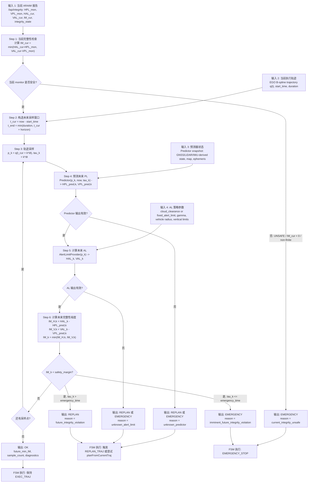

# 当前 IAP 仓库 Safety Planner 开发手册

> 适用仓库状态: `/home/dev/ws_iap/src/iap`  
> 参考文档: `iap_safety_planner_refactor_plan_2.md`、`EGO Planner Refactor.pdf`  
> 目标: 在当前 IAP + EGO Planner 代码中逐步开发 integrity-aware safety planner。

---

## 1. 结论先行

`iap_safety_planner_refactor_plan_2.md` 和 `EGO Planner Refactor.pdf` 的总体方向适合当前仓库: 不把 A* 作为默认强前端替代 EGO，不把完整性安全条件混进后端优化器，而是采用:

```text
P0  RiskGrid / cost field 数据底座
P5  Runtime Integrity Supervisor 硬监督
P2  候选轨迹排序
P1  B-spline 后端 integrity soft cost
P3  全局参考偏置
P4  risk-aware A* 初值生成
```

但当前仓库已经不是文档中的纯概念状态。IAP 侧已有 predictor、PL grid、UnifiedRiskGrid、Phase 2 evaluator 和 cost field topic；真正缺口在 EGO C++ 侧:

- EGO 子包已经暴露了若干 `planner_use_integrity_*` launch 参数，但 C++ 端多数没有消费。
- `bspline_opt` 当前没有真正订阅或查询 `/iap/integrity_cost_field`。
- `path_searching::AStar` 当前边代价仍是距离，没有 risk cost。
- `EGOReplanFSM::checkCollisionCallback()` 当前只检查深度丢失、障碍、swarm 碰撞，没有检查 `PL_pred < AL`。

因此开发应从“让 EGO 侧能读完整性场并做 P5 硬监督”开始，而不是先重构 A* 或大改 optimizer。

---

## 2. 当前代码事实

### 2.1 路径映射

旧文档多处引用:

```text
src/iap/sim/ego_planner_swarm_ws/src/planner/...
```

当前仓库实际 EGO 代码在:

```text
src/iap/src/iap/planner/plan_manage
src/iap/src/iap/planner/bspline_opt
src/iap/src/iap/planner/path_searching
src/iap/src/iap/planner/plan_env
src/iap/src/iap/planner/traj_utils
```

开发时以当前路径为准。

### 2.2 已有 IAP 完整性基础

当前仓库已经有以下基础设施:

| 模块 | 当前文件 | 作用 |
|---|---|---|
| Future PL 预测 | `include/iap/planner/future_pl_field_predictor.hpp` | direct/grid advisory PL 查询 |
| PLGrid | `include/iap/planner/pl_grid.hpp` | 本地 3D PL 缓存与梯度 |
| UnifiedRiskGrid | `include/iap/planner/unified_risk_grid.hpp` | 统一风险 voxel、stale/unknown policy、PI cost 缓存 |
| PI cost adapter | `include/iap/planner/pi_cost_adapter.hpp` | 将 HPL/VPL/AL 转为 PI cost/risk band |
| Phase 2 evaluator | `apps/phase2_planner_integrity_evaluator.cpp` | 评估轨迹完整性并发布 cost field |
| cost field topic | `/iap/integrity_cost_field` | 面向后端/兼容的完整性 cost field |
| front cost field topic | `/iap/integrity_front_cost_field` | 面向前端搜索/overlay 的完整性 cost field |

这些模块应复用，不要在 EGO 子包里重新实现 predictor。

### 2.3 EGO Planner 当前流程

当前规划主链路:

```text
ego_planner_node
  -> EGOReplanFSM::init()
  -> EGOPlannerManager::initPlanModules()
  -> EGOPlannerManager::reboundReplan()
  -> BsplineOptimizer::initControlPoints()
  -> BsplineOptimizer::BsplineOptimizeTrajRebound()
  -> BsplineOptimizer::combineCostRebound()
```

关键文件:

| 责任 | 当前文件 |
|---|---|
| FSM、安全回调、轨迹发布 | `src/iap/src/iap/planner/plan_manage/src/ego_replan_fsm.cpp` |
| 初值生成、候选轨迹选择、全局参考轨迹 | `src/iap/src/iap/planner/plan_manage/src/planner_manager.cpp` |
| B-spline L-BFGS 代价组合 | `src/iap/src/iap/planner/bspline_opt/src/bspline_optimizer.cpp` |
| A* 搜索 | `src/iap/src/iap/planner/path_searching/src/dyn_a_star.cpp` |
| EGO occupancy map | `src/iap/src/iap/planner/plan_env/src/grid_map.cpp` |

当前 `combineCostRebound()` 只组合:

```text
smoothness + distance + feasibility + swarm + terminal
```

还没有 integrity soft cost。

### 2.4 参数壳与实现不一致

`demo9_ego_planner_closed_loop.launch.py` 和 `plan_manage/launch/advanced_param.launch.py` 已经传入:

```text
planner_use_integrity_cost
planner_lambda_integrity
planner_use_integrity_front_search
planner_use_integrity_global_search
risk_overlay_*
```

但当前 C++ 端 `BsplineOptimizer::setParam()` 只读取传统 optimization 参数，`EGOPlannerManager::initPlanModules()` 只读取传统 manager 参数，`AStar` 也没有 risk callback。

这意味着当前仓库更像“Phase 2 evaluator + launch 参数已准备，EGO planner 消费端未完成”。

---

## 3. 对旧方案的适配判断

### 3.1 P0 RiskGrid

适合当前仓库，但不应把 risk grid 嵌进 EGO `GridMap`。

建议:

- 保留 EGO `GridMap` 只负责 occupancy / inflate occupancy。
- 保留 `UnifiedRiskGrid` 作为 evaluator 侧数据底座。
- EGO 侧 v1 通过 PointCloud2 cost field 订阅缓存完整性样本，不直接链接 `FuturePLFieldPredictor`。
- 后续再清理 `UnifiedRiskVoxel` 中 raw/derived 混合问题，但不要把该清理作为 P5/P1 前置阻塞。

### 3.2 P5 Runtime Integrity Supervisor

最适合当前仓库优先开发。

理由:

- FSM 已经有 `checkCollisionCallback()`，自然适合并列加入 `checkTrajIntegrity()`。
- P5 不改变 optimizer，不会引入 L-BFGS 梯度调参风险。
- 可以先验证 `PL_pred < AL` 语义、stale/unknown policy 和重规划/急停行为。

P5 必须保持“唯一硬裁决者”语义:

```text
后端 soft cost: 偏好低 PL / 低 risk 区域
P5 supervisor: 判定轨迹是否满足 PL_pred < AL
```

不要把 P5 的硬安全判定改写成 optimizer 里的普通软代价。

### 3.3 P1 后端 integrity soft cost

适合第二阶段或第四阶段做。

v1 建议:

- 在 `BsplineOptimizer::combineCostRebound()` 增加 `calcIntegrityCost()`。
- 通过 EGO 侧 cost field 缓存查询 `cost` 和 `grad_x/y/z`。
- cost 表示 localization-quality preference，不把 `PL_pred - AL` 的硬违例项作为后端主项。
- 启用 `lambda_integrity`、`integrity_grad_norm_max`、`integrity_cost_max`，默认关闭。

不要在 v1 中为了算 `AL = f(d_obs)` 给 EGO 后端引入 ESDF。EGO 的障碍 clearance 仍由 `calcDistanceCostRebound()` 负责。

### 3.4 P2 候选排序

适合利用当前 `use_distinctive_trajs` 分支实现。

当前 `planner_manager.cpp` 在 `pp_.use_distinctive_trajs` 时会优化多条候选，并按 `final_cost` 选择最小值。可以改为:

```text
score = final_cost + lambda_candidate_integrity * trajectory_integrity_score
```

其中 `trajectory_integrity_score` 来自沿候选 B-spline 采样 cost field。

P2 只能在已有候选里选优，不能声称发现新同伦类。

### 3.5 P3/P4

推后。

P3 全局参考偏置适合在 P1/P2 稳定后做。P4 risk-aware A* 只有在实验显示“当前候选集没有覆盖安全走廊，后端被局部同伦类困住”时再启用。

---

## 4. 推荐开发顺序

### 阶段 0: Baseline 与数据确认

目标: 确认当前仓库 baseline 能跑，cost field 能发布，明确实验数据可用。

步骤:

1. 跑 demo9 无完整性接入闭环:

   ```bash
   ros2 launch iap demo9_ego_planner_closed_loop.launch.py \
     start_rviz:=false \
     run_duration_s:=60 \
     allow_truth_alignment:=false \
     use_so3_dynamics:=true \
     planner_use_integrity_cost:=false \
     planner_use_integrity_front_search:=false \
     planner_use_integrity_global_search:=false
   ```

2. 跑 demo10 read-only 评估:

   ```bash
   ros2 launch iap demo10_ego_planner_pi_lite_eval.launch.py \
     start_rviz:=false \
     run_duration_s:=60 \
     allow_truth_alignment:=false \
     use_so3_dynamics:=true \
     use_gnss:=true \
     use_araim:=true \
     phase2_use_pl_grid:=true
   ```

3. 验证 topic:

   ```bash
   ros2 topic hz /iap/integrity_cost_field
   ros2 topic hz /iap/integrity_front_cost_field
   ros2 topic echo /iap/integrity --once
   ```

4. 记录:

   ```text
   export/phase1_summary.json
   export/phase2_summary.json
   export/integrity_along_planner_traj.csv
   ```

验收:

- demo9 默认开关全关时规划行为不变。
- demo10 能生成完整性评估输出。
- cost field 缺失时 EGO 不崩溃。

### 阶段 1: EGO 侧轻量 IntegrityCostField

目标: EGO C++ 侧能订阅并查询 PointCloud2 完整性场，但暂不改变轨迹。

建议新增:

```text
src/iap/src/iap/planner/bspline_opt/include/bspline_opt/integrity_cost_field.h
src/iap/src/iap/planner/bspline_opt/src/integrity_cost_field.cpp
```

接口建议:

```cpp
struct IntegrityCostSample {
  Eigen::Vector3d position;
  double hpl;
  double vpl;
  double hal;
  double val;
  double im_min;
  double cost;
  Eigen::Vector3d grad;
  double stamp_s;
  bool valid;
};

class IntegrityCostField {
 public:
  void init(rclcpp::Node::SharedPtr node,
            const std::string& topic,
            double nearest_radius_m,
            double stale_timeout_s,
            double cost_max,
            double grad_norm_max);
  bool queryNearest(const Eigen::Vector3d& p,
                    double now_s,
                    IntegrityCostSample* out) const;
  double scoreTrajectory(const UniformBspline& traj,
                         double t0,
                         double t1,
                         double dt,
                         double now_s) const;
};
```

实现要求:

- 订阅 `/iap/integrity_cost_field` 和/或 `/iap/integrity_front_cost_field`。
- 解析 PointCloud2 字段: `x,y,z,hpl,vpl,hal,val,im_min,cost,grad_x,grad_y,grad_z,stamp_s`。
- 字段缺失时使用保守 fallback:
  - 无 `im_min` 时由 `min(hal-hpl, val-vpl)` 计算。
  - 无梯度时梯度置零。
  - cost 非有限时视为查询失败。
- stale 或 miss 时返回 false，不返回 0 风险给 P5；P1 可单独决定 unknown penalty。
- v1 最近邻查询即可，后续再做栅格索引或 KD-tree。

接入点:

- `EGOPlannerManager::initPlanModules()` 创建并传给 optimizer。
- `BsplineOptimizer` 保存 shared pointer。
- `EGOReplanFSM` 或 `EGOPlannerManager` 能访问同一个 field 用于 P5/P2。

验收:

- 开关关闭时不订阅、不查询。
- 开关开启但 topic 缺失时 planner 不崩溃。
- 加 debug log 或 CSV 证明查询命中率、stale 次数、miss 次数。

### 阶段 2: P5 Runtime Integrity Supervisor

目标: 在不改变优化器的情况下，增加完整性硬监督。

建议新增函数:

```text
EGOPlannerManager::checkTrajectoryIntegrity(...)
或
EGOReplanFSM::checkTrajIntegrity(...)
```

采样逻辑:

```text
for t in [t_cur, min(duration, t_cur + horizon)] step dt:
  p = position_traj.evaluateDeBoorT(t)
  q = integrity_field.queryNearest(p, now_s)
  if miss/stale/unknown:
    记录 conservative failure
  if q.im_min < 0:
    记录 unsafe failure
```

FSM 策略:

```text
current certified PL_mon > current AL:
  -> EMERGENCY_STOP

future trajectory min IM < 0:
  -> 先尝试 planFromCurrentTraj()
  -> 成功则 EXEC_TRAJ
  -> 若危险发生在 emergency_time_ 内则 EMERGENCY_STOP
  -> 否则 REPLAN_TRAJ

field stale / unknown:
  -> 默认触发 REPLAN_TRAJ
  -> 连续失败或 imminent 时 EMERGENCY_STOP
```

v1 可不新增 FSM 状态，复用现有 `REPLAN_TRAJ` 和 `EMERGENCY_STOP`。

验收:

- P5-only 模式下，轨迹形状不因 integrity 改变。
- 人为构造负 `im_min` field 后，FSM 有明确 replan 或 emergency 日志。
- field 缺失/过期不被当作安全。

### 阶段 3: P2 候选排序

目标: 对已有候选进行完整性评分，不引入新 A*。

修改位置:

```text
src/iap/src/iap/planner/plan_manage/src/planner_manager.cpp
```

当前逻辑:

```cpp
if (final_cost < min_cost) {
  min_cost = final_cost;
  ctrl_pts = ctrl_pts_temp;
}
```

建议改为:

```text
candidate_score = final_cost
                + lambda_candidate_integrity * sampled_integrity_cost
                + unknown_penalty * unknown_ratio
```

评分采样:

- 用 `UniformBspline(ctrl_pts_temp, 3, ts)`。
- `dt = max(0.05, ts / 2)`。
- 采样到 `min(duration, planning_horizon_time)`。
- 记录每条候选的 `mean_cost`、`min_im`、`unknown_ratio`。

验收:

- `use_distinctive_trajs=false` 时行为不变。
- `use_distinctive_trajs=true` 且 P2 开启时，候选选择日志显示 integrity score。
- 不声称 P2 生成新走廊。

### 阶段 4: P1 后端 soft integrity cost

目标: 在 `combineCostRebound()` 中加入低权重 integrity preference。

修改位置:

```text
src/iap/src/iap/planner/bspline_opt/include/bspline_opt/bspline_optimizer.h
src/iap/src/iap/planner/bspline_opt/src/bspline_optimizer.cpp
```

新增参数:

```text
optimization/use_integrity_cost
optimization/lambda_integrity
optimization/integrity_cost_topic
optimization/integrity_field_stale_timeout_s
optimization/integrity_nearest_radius_m
optimization/integrity_cost_max
optimization/integrity_grad_norm_max
optimization/integrity_min_samples
```

新增函数:

```cpp
void calcIntegrityCost(const Eigen::MatrixXd& q,
                       double& cost,
                       Eigen::MatrixXd& gradient);
```

v1 控制点版:

```text
for i in optimized internal control points:
  sample = field.queryNearest(q.col(i), now_s)
  if hit:
    cost += clamp(sample.cost)
    gradient.col(i) += clipped(sample.grad)
  else:
    cost += unknown_penalty_for_soft_cost
```

组合:

```text
f_combine += lambda_integrity * f_integrity
grad_3D   += lambda_integrity * g_integrity
```

关键约束:

- 不在后端把 `PL_pred >= AL` 当硬约束。
- 不让 integrity 梯度压过 collision 梯度。
- `lambda_integrity` 初值很小，例如 `1e-5` 到 `1e-4`。
- 梯度裁剪后再进入 L-BFGS。

验收:

- 开关关闭时 `combineCostRebound()` 与原行为一致。
- 开关开启且 field 有梯度时，debug CSV 有非零 integrity cost/grad。
- P1-low-weight 下碰撞安全和可行性不退化。

### 阶段 5: P3/P4 按需开发

P3 全局参考偏置:

- 在 `planGlobalTraj()` / `planGlobalTrajWaypoints()` 的 waypoint/intermediate point 生成前加入 risk-aware waypoint 选择。
- 优先只改变全局参考点，不改变局部 optimizer。

P4 risk-aware A*:

- 修改 `path_searching::AStar`，新增 risk cost callback，而不是让 AStar 直接依赖 predictor。
- 原边代价:

  ```text
  edge = distance
  ```

- 可选边代价:

  ```text
  edge = distance * (1 + lambda_integrity_front * pi_cost)
  ```

- field miss/stale 时必须退化为原 EGO 行为或保守 fallback，不能崩溃。

只在 P1/P2 实验证明无法跨同伦类时再做 P4。

---

## 5. 实验顺序

### E0 Baseline

目的: 确认无完整性接入的闭环性能。

配置:

```text
planner_use_integrity_cost=false
planner_use_integrity_front_search=false
planner_use_integrity_global_search=false
```

记录:

```text
规划成功率
tracking error
replan 次数
碰撞/急停次数
```

### E1 Read-only Integrity Evaluation

目的: 验证 PL/AL/IM 数据质量，不改变 planner。

使用 demo10 或 demo11 evaluator，确认:

```text
/iap/integrity
/iap/integrity_cost_field
/iap/integrity_front_cost_field
phase2_summary.json
integrity_along_planner_traj.csv
```

### E2 P5-only

目的: 验证完整性硬监督。

配置:

```text
planner_integrity_supervisor=true
planner_use_integrity_cost=false
planner_use_integrity_front_search=false
planner_use_integrity_global_search=false
```

指标:

```text
min IM
unsafe sample count
integrity-triggered replan count
integrity-triggered emergency count
unknown/stale count
```

### E3 P2-only

目的: 验证候选排序能否在已有候选中选出低风险轨迹。

配置:

```text
manager/use_distinctive_trajs=true
planner_integrity_candidate_ranking=true
planner_use_integrity_cost=false
```

对比:

```text
final_cost 最小候选
integrity_score 最小候选
最终选择候选
```

### E4 P1 Low Weight

目的: 验证后端 soft cost 对轨迹有温和影响。

配置:

```text
planner_use_integrity_cost=true
planner_lambda_integrity=1e-5
planner_integrity_grad_norm_max=0.1
```

指标:

```text
mean PL 是否下降
min IM 是否提高
碰撞距离是否不退化
优化失败率是否不升高
规划耗时是否可接受
```

### E5 P1 Sweep

目的: 调参和确定稳定区间。

扫描:

```text
lambda_integrity: 1e-6, 3e-6, 1e-5, 3e-5, 1e-4
grad_norm_max: 0.05, 0.1, 0.2
stale_timeout_s: 0.5, 1.0, 2.0
unknown_penalty: low, medium, high
```

拒绝标准:

```text
碰撞风险上升
规划成功率下降明显
轨迹抖动或 homotopy flip 明显
L-BFGS 耗时大幅增加
```

### E6 P3/P4

目的: 只有在 P1/P2 无法找到安全走廊时验证前端/全局偏置。

对比:

```text
P1/P2 only
P3 global reference bias
P4 risk-aware A*
```

P4 需要额外记录:

```text
A* searched node count
integrity samples used
risk cost contribution
fallback count
path switching count
```

---

## 6. 测试与验收

### 6.1 单元测试建议

新增或扩展测试:

```text
test_integrity_cost_field.cpp
test_integrity_supervisor.cpp
test_integrity_candidate_ranking.cpp
test_bspline_integrity_cost.cpp
test_astar_integrity_edge_cost.cpp
```

覆盖:

- PointCloud2 字段解析。
- 缺字段 fallback。
- stale/unknown 不被当作安全。
- `im_min < 0` 触发 unsafe。
- P1 梯度裁剪。
- P2 候选评分排序。
- A* 开关关闭时与原距离代价一致。

### 6.2 构建命令

推荐构建:

```bash
colcon build \
  --base-paths src/iap src/gnss_comm \
  --packages-select iap path_searching bspline_opt ego_planner
```

如果本地仍保留旧 workspace 路径，可按实际 `colcon list` 结果加入:

```bash
src/iap/sim/ego_planner_swarm_ws/src
```

但当前代码审阅以 `src/iap/src/iap/planner/...` 为准。

### 6.3 回归要求

必须满足:

- demo9 默认完整性开关全关时行为不变。
- cost field 不发布时 planner 不崩溃。
- P5 对 unsafe IM 有明确日志、重规划或急停。
- P1 开关关闭时 optimizer cost 与原实现等价。
- P1 开关开启时 collision cost 仍优先。

### 6.4 数据产物

每轮实验保存:

```text
phase1_summary.json
phase2_summary.json
integrity_along_planner_traj.csv
planner_integrity_cost_debug.csv
planner_integrity_supervisor_debug.csv
candidate_integrity_ranking.csv
```

核心对比指标:

```text
mean PL
min IM
unsafe sample ratio
unknown/stale sample ratio
replan count
emergency count
planning success rate
planning latency
tracking error
collision/clearance metrics
```

---

## 7. 实现边界与禁忌

必须保持:

- Predictor 只产生 advisory PL/raw prediction。
- RiskGrid / evaluator 负责缓存、派生字段和 topic 发布。
- EGO 后端 soft cost 只表达偏好。
- P5 supervisor 才拥有 `PL_pred < AL` 的硬裁决权。

不要做:

- 不要把 `PL_pred >= AL` 作为 L-BFGS 中唯一安全保证。
- 不要为了后端 soft cost 给 EGO 强行引入实时 ESDF。
- 不要把 `/iap/integrity` 的 current certified monitor PL 当成所有未来位置的 predicted PL。
- 不要让 `path_searching::AStar` 直接依赖 `FuturePLFieldPredictor`。
- 不要默认开启完整性规划改动破坏 demo9 baseline。

---

## 8. 建议提交边界

```text
Commit 1: Add EGO IntegrityCostField subscriber/cache and read-only debug.
Commit 2: Add P5 runtime integrity supervisor and logs.
Commit 3: Add candidate integrity ranking over distinctive trajectories.
Commit 4: Add B-spline backend integrity soft cost.
Commit 5: Add global reference bias or A* risk edge cost if experiments justify it.
Commit 6: Add validation scripts/docs and update launch defaults.
```

---

## 9. 最小可行路线

如果只做一个可发表、可验证的 v1，建议止步于:

```text
P0: 使用现有 evaluator / UnifiedRiskGrid / cost field
P5: FSM runtime integrity supervisor
P2: distinctive trajectory candidate ranking
P1: 低权重后端 soft integrity cost
```

P3/P4 留作扩展实验。这样最符合 EGO “薄前端 + 强后端”的架构，也最能控制工程风险。

---

## 10. P5 完整设计: Current Monitor + Future Predictor 双通道监督

### 10.1 P5 的职责边界

P5 Runtime Integrity Supervisor 不是“接 ARAIM 还是接 Predictor”的二选一模块。它必须同时使用两类信息，但二者语义不同:

| 来源 | 用途 | 语义 |
|---|---|---|
| ARAIM `/iap/integrity` | 当前点硬安全检查 | current certified monitor |
| Predictor `PredictorModule::query()` | 未来轨迹采样点 PL 预测 | advisory predicted PL |
| P5 `AlertLimitProvider` | 未来轨迹采样点 AL 计算 | planner safety policy |

P5 的唯一硬判定是:

```text
current:  HPL_mon < HAL_current 且 VPL_mon < VAL_current
future:   HPL_pred(p(t), t) < HAL(p(t)) 且 VPL_pred(p(t), t) < VAL(p(t))
```

Predictor 不计算 AL、不做 safety decision；ARAIM 不预测未来轨迹；后端 optimizer 的 `cost` 不能替代 P5 的硬安全判定。

### 10.2 输入接口

#### 当前 certified monitor 输入

P5 订阅 `/iap/integrity`，消息类型为 `iap/msg/IntegrityReport`。当前点检查使用字段:

```text
integrity_state
hpl, vpl
hal, val
im_h, im_v, im_min
failure_reason
```

判定规则:

```text
if integrity_state == UNSAFE:
  action = EMERGENCY
elif im_min < 0 or im_h < 0 or im_v < 0:
  action = EMERGENCY
elif hpl/vpl/hal/val/im_min non-finite:
  action = EMERGENCY or HOLD_CONSERVATIVE
else:
  current monitor is safe
```

当前点的 `HAL/VAL` 直接来自 ARAIM monitor 发布的 `/iap/integrity`，不要在 P5 内重新设置当前 AL。

#### 未来 predicted PL 输入

未来轨迹点的 PL 来自 Predictor:

```cpp
PredictorQueryInput input(
    query_position_map,
    latest_integrity_snapshot,
    query_time_s,
    horizon_s,
    "map");
PredictorQueryResult result = predictor.query(input);
```

P5 使用 `result.hpl/result.vpl/result.available/result.valid/result.fallback_reason`。如果 Predictor 返回 unavailable、invalid、fallback 且 fallback policy 不允许，则该采样点是 `UNKNOWN_PREDICTOR`，不能判为 safe。

v1 工程上可以通过 IAP 侧 `PlannerIntegritySupervisor/Adapter` 封装 Predictor 调用，再把检查结果提供给 EGO FSM；不要让 EGO planner 重新实现 GNSS/LiDAR predictor。

#### 轨迹输入

P5 检查 EGO 当前执行轨迹:

```text
EGOPlannerManager::local_data_.position_traj_
EGOPlannerManager::local_data_.start_time_
EGOPlannerManager::local_data_.duration_
```

后续可在 `callReboundReplan()` 发布轨迹前增加 candidate gate，但 v1 先只检查当前执行轨迹，减少对 EGO 主流程的侵入。

### 10.3 未来 AL 从哪里来

未来轨迹点的 AL 不来自 Predictor。P5 需要一个独立的 `AlertLimitProvider`:

```cpp
struct AlertLimitQuery {
  Eigen::Vector3d p_w;
  double query_time_s;
};

struct AlertLimitResult {
  bool available;
  double hal_m;
  double val_m;
  double dist_to_obstacle_m;
  std::string source;
  std::string failure_reason;
};
```

#### 官方 safety 模式: cloud_clearance

优先使用 `iap::AlertLimitModelParams` 与 `evaluate_alert_limit()`:

```text
HAL = gamma_h * max(dist_to_obstacle - drone_radius - safety_buffer, 0)
VAL = gamma_v * vertical_clearance
```

其中:

- `dist_to_obstacle` 来自 planner 可用的局部地图/点云 clearance 查询。
- `vertical_clearance` 来自飞行高度上下界或局部地图 z 边界。
- `gamma_h/gamma_v`、`drone_radius`、`safety_buffer` 来自 P5 参数。

如果 clearance 不可得，`AL` 标为 unavailable，P5 走保守分支。

#### Bring-up 模式: fixed_alert_limit

调试早期可以使用固定:

```text
HAL = p5_fixed_hal_m
VAL = p5_fixed_val_m
```

但该模式只能用于接口联调和 predictor/P5 流程验证，不能描述为 obstacle-aware safety，因为它没有随障碍 clearance 变化。

### 10.4 checkTrajIntegrity 检查当前还是未来

`checkTrajIntegrity()` 必须同时检查当前点和未来执行轨迹:

```text
1. checkCurrentIntegrity()
   - 使用 /iap/integrity
   - 当前 monitor unsafe 立即 EMERGENCY

2. checkFutureTrajectoryIntegrity()
   - 从当前执行轨迹 t_cur 开始向前采样
   - 对每个采样点查询 Predictor predicted PL
   - 对每个采样点查询 AlertLimitProvider future AL
   - 计算 im_h/im_v/im_min
   - 根据 first violation tau 决定 REPLAN 或 EMERGENCY
```

默认采样参数:

```text
p5_enable: false
p5_horizon_s: 3.0
p5_dt_s: 0.1
p5_min_replan_margin_m: 0.0
p5_unknown_policy: replan
p5_fixed_hal_m: 30.0
p5_fixed_val_m: 60.0
p5_al_model: cloud_clearance
```

采样范围:

```text
t_cur = now - local_data_.start_time_
t_end = min(local_data_.duration_, t_cur + p5_horizon_s)
for t in [t_cur, t_end] step p5_dt_s:
  p = position_traj.evaluateDeBoorT(t)
  tau = t - t_cur
```

### 10.5 P5 动作策略

P5 输出不是一个单纯 bool，而是决策结果:

```cpp
enum class IntegrityAction {
  OK,
  REPLAN,
  SLOW_DOWN,
  EMERGENCY,
  UNKNOWN_CONSERVATIVE
};
```

建议 v1 动作映射:

| 条件 | 动作 |
|---|---|
| 当前 `/iap/integrity` unsafe 或 `im_min < 0` | `EMERGENCY` |
| future `im_min < 0` 且 `first_violation_tau_s <= emergency_time_` | `EMERGENCY` |
| future `im_min < 0` 且违例不临近 | `REPLAN` |
| Predictor unavailable/stale | `REPLAN`，连续失败或临近时 `EMERGENCY` |
| future AL unavailable | `REPLAN`，连续失败或临近时 `EMERGENCY` |
| 全部采样安全 | `OK` |

v1 不新增 FSM 状态，复用当前:

```text
REPLAN      -> changeFSMExecState(REPLAN_TRAJ, "INTEGRITY")
EMERGENCY   -> changeFSMExecState(EMERGENCY_STOP, "INTEGRITY")
OK          -> no state change
```

### 10.6 推荐实现形态

推荐新增一个 IAP 侧 adapter/supervisor，EGO FSM 只调用轻接口:

```cpp
struct PlannerIntegrityCheckRequest {
  UniformBspline position_traj;
  double t_cur_s;
  double duration_s;
  double now_s;
};

struct PlannerIntegrityCheckResult {
  IntegrityAction action;
  bool current_available;
  bool predictor_available;
  bool al_available;
  double current_im_min_m;
  double future_min_im_m;
  double first_violation_tau_s;
  std::string reason;
};
```

EGO 侧 v1 接入点:

```text
EGOReplanFSM::checkCollisionCallback()
  -> 原 depth/collision/swarm 检查
  -> checkTrajIntegrity()
  -> 根据 action 切 REPLAN_TRAJ 或 EMERGENCY_STOP
```

这样 EGO 不需要知道 GNSS/LiDAR predictor 内部细节，也避免把 Predictor 逻辑复制进 planner。

### 10.7 P5 系统流程图（论文版）

下面流程图按程序运行顺序描述 P5: 输入进入系统后，先完成当前完整性检查，再沿未来轨迹采样并进行预测完整性检查，最后输出监督动作和诊断量。



论文中可以把 P5 描述为一个确定性监督器:

```text
Input:
  current certified monitor report R_cur,
  executing trajectory q(t),
  predictor state S_pred,
  alert-limit policy pi_AL.

Processing:
  verify current monitor integrity,
  sample future trajectory,
  predict future PL at each sample,
  compute future AL at each sample,
  evaluate integrity margin IM = AL - PL,
  select the most conservative action.

Output:
  action in {OK, REPLAN, EMERGENCY},
  current IM, minimum future IM,
  first violation time, status reason.
```

### 10.8 P5 伪代码（论文版）

下面伪代码是论文可用的算法描述。它不绑定具体 C++ 类名，只保留 IAP 系统中的关键输入、处理和输出。

```text
Algorithm 1: Runtime Integrity Supervisor P5

Input:
  R_cur          current ARAIM integrity report
                 (HPL_mon, VPL_mon, HAL_cur, VAL_cur, IM_cur, integrity_state)
  q(t)           currently executing EGO B-spline trajectory
  t_start        trajectory start time
  T              trajectory duration
  S_pred         Predictor state and snapshot
  pi_AL          alert-limit policy for future trajectory points
  t_now          current wall-clock time
  H              prediction horizon
  dt             trajectory sampling interval
  T_emg          emergency time threshold
  m_safe         required minimum integrity margin

Output:
  a              supervisor action in {OK, REPLAN, EMERGENCY}
  d              diagnostic tuple
                 (IM_cur, IM_future_min, tau_first, reason)

Procedure:
  1:  if R_cur is unavailable or non-finite then
  2:      return EMERGENCY, (NaN, NaN, 0, "unknown_current_integrity")
  3:  end if

  4:  IM_H_cur <- HAL_cur - HPL_mon
  5:  IM_V_cur <- VAL_cur - VPL_mon
  6:  IM_cur <- min(IM_H_cur, IM_V_cur)

  7:  if integrity_state is UNSAFE or IM_cur < 0 then
  8:      return EMERGENCY, (IM_cur, NaN, 0, "current_integrity_violation")
  9:  end if

 10:  if q(t) is unavailable then
 11:      return OK, (IM_cur, NaN, NaN, "no_active_trajectory")
 12:  end if

 13:  t_cur <- clamp(t_now - t_start, 0, T)
 14:  t_end <- min(T, t_cur + H)
 15:  IM_future_min <- +infinity
 16:  tau_first <- NaN

 17:  for tau from 0 to (t_end - t_cur) with step dt do
 18:      p_tau <- q(t_cur + tau)

 19:      (HPL_pred, VPL_pred, pred_valid) <- PredictorQuery(S_pred, p_tau, t_now, tau)
 20:      if pred_valid is false then
 21:          if tau <= T_emg then
 22:              return EMERGENCY, (IM_cur, IM_future_min, tau, "unknown_predictor_imminent")
 23:          else
 24:              return REPLAN, (IM_cur, IM_future_min, tau, "unknown_predictor")
 25:          end if
 26:      end if

 27:      (HAL_tau, VAL_tau, AL_valid) <- AlertLimit(pi_AL, p_tau)
 28:      if AL_valid is false then
 29:          if tau <= T_emg then
 30:              return EMERGENCY, (IM_cur, IM_future_min, tau, "unknown_alert_limit_imminent")
 31:          else
 32:              return REPLAN, (IM_cur, IM_future_min, tau, "unknown_alert_limit")
 33:          end if
 34:      end if

 35:      IM_H_tau <- HAL_tau - HPL_pred
 36:      IM_V_tau <- VAL_tau - VPL_pred
 37:      IM_tau <- min(IM_H_tau, IM_V_tau)
 38:      IM_future_min <- min(IM_future_min, IM_tau)

 39:      if IM_tau < m_safe then
 40:          tau_first <- tau
 41:          if tau_first <= T_emg then
 42:              return EMERGENCY,
                      (IM_cur, IM_future_min, tau_first,
                       "future_integrity_violation_imminent")
 43:          else
 44:              return REPLAN,
                      (IM_cur, IM_future_min, tau_first,
                       "future_integrity_violation")
 45:          end if
 46:      end if
 47:  end for

 48:  return OK, (IM_cur, IM_future_min, NaN, "integrity_safe")
```

上述算法强调三个原则:

- 当前 certified monitor violation 具有最高优先级，直接输出 `EMERGENCY`。
- 未来轨迹检查使用 Predictor 的 advisory PL，但安全裁决只在 P5 中完成。
- Predictor 或 AL 不可用时不允许把轨迹判为 safe，而是按时间紧迫性输出 `REPLAN` 或 `EMERGENCY`。

### 10.9 状态输出与日志

建议新增状态输出 topic:

```text
/iap/planner_integrity_status
```

最小字段:

```text
stamp
action
reason
current_im_min
future_min_im
first_violation_tau_s
predictor_available
al_available
sample_count
unsafe_sample_count
unknown_sample_count
```

CSV 日志:

```text
planner_integrity_supervisor_debug.csv
```

每个采样点记录:

```text
stamp,tau,x,y,z,hpl_pred,vpl_pred,hal,val,im_h,im_v,im_min,
predictor_valid,al_valid,action,reason
```

### 10.10 与 `/iap/integrity_cost_field` 的关系

`/iap/integrity_cost_field` 不作为 P5 必需输入。

原因:

- P5 需要明确的 `HPL/VPL/HAL/VAL/IM` 语义来做硬判定。
- `cost` 是 planner preference，不是 safety statement。
- 当前代码中 `/iap/integrity_cost_field` 更像 Phase 2 evaluator 的 backend soft-cost 兼容输出，尚未被 EGO C++ 真正消费。

使用边界:

```text
P5: 使用 /iap/integrity + Predictor + AlertLimitProvider
P1: 可选使用 /iap/integrity_cost_field 的 cost/grad 做后端 soft cost
P2/P3/P4: 可选使用 risk band/cost 做排序或偏置
```

不要把 `/iap/integrity_cost_field` 写成 P5 的核心依赖。

### 10.11 P5 验收测试

必须覆盖:

1. 当前 monitor unsafe:
   - 构造 `/iap/integrity.im_min < 0` 或 `integrity_state=UNSAFE`
   - 期望 P5 输出 `EMERGENCY`

2. 未来轨迹 unsafe:
   - mock Predictor 在某个 `tau` 返回 `HPL_pred > HAL`
   - 若 `tau > emergency_time_`，期望 `REPLAN`
   - 若 `tau <= emergency_time_`，期望 `EMERGENCY`

3. AL 缺失:
   - future AL unavailable
   - 不得判 safe，期望 `REPLAN` 或保守动作

4. Predictor 不可用:
   - `available=false` 或 stale
   - planner 不崩溃，进入保守分支

5. 回归:
   - `p5_enable=false` 时 demo9 行为不变
   - P5 开启但所有采样 safe 时不触发重规划
