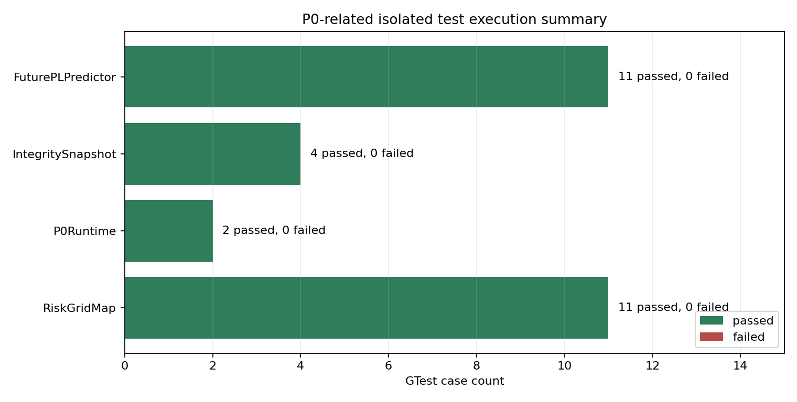
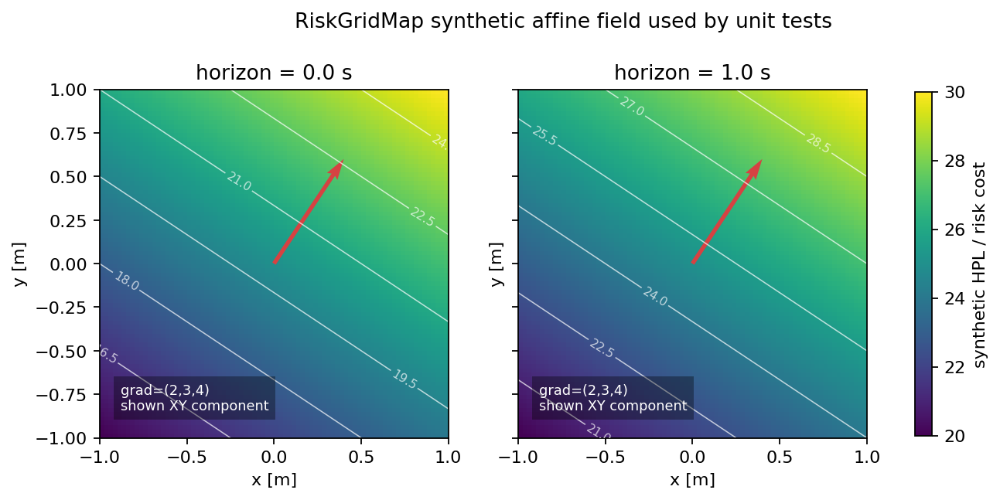
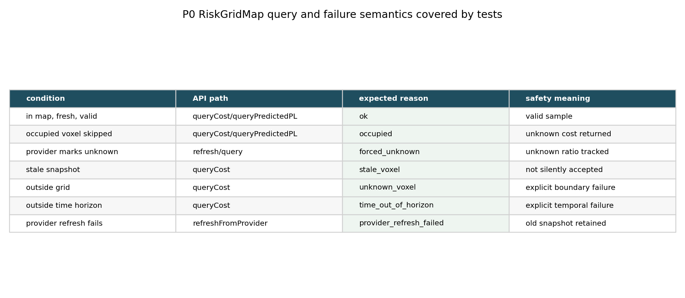
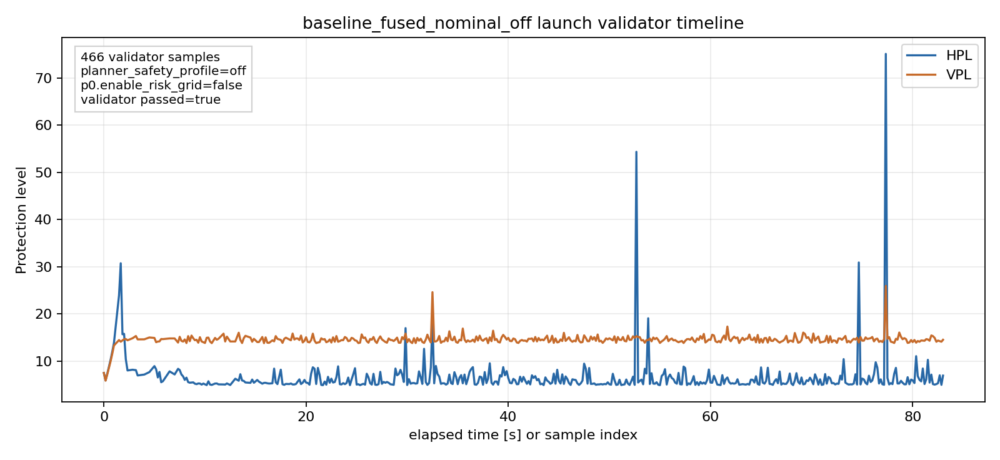

# Safety Planner P0 Risk Grid 测试报告

记录日期：2026-06-29

## 1. 测试范围

本报告记录 Safety Planner P0 Risk Grid 当前已经完成的测试结果。P0 的目标是把 Predictor 输出的未来 protection level 转成 planner 可查询的风险网格，并保证查询语义、异常状态和 runtime 开关不会污染 baseline planner。

本报告纳入两类证据：

| 类型 | 证据 | 说明 |
| --- | --- | --- |
| 模块级 GTest | `test_risk_grid_map`、`test_p0_risk_grid_runtime`、`test_integrity_snapshot`、`test_future_pl_field_predictor` | 覆盖 RiskGridMap 插值、snapshot、异常语义、P0 runtime 开关和输入 snapshot 构造。 |
| baseline launch 旁证 | `baseline_fused_nominal_off` export | 验证默认关闭 P0 时，baseline fused nominal launch 可以通过 validator，且 manifest 中 P0 明确关闭。 |

本报告不把 baseline launch 结果解释为 P0 开启后的闭环通过结果。当前结果目录中未发现 `experiment:=p0_open_sky` 的 export，因此 P0 open-sky 闭环实验仍需补跑。

## 2. 测试方法

执行 P0 相关 isolated GTest：

```bash
./build/iap/test_risk_grid_map --gtest_output=xml:/tmp/p0_test_risk_grid_map.gtest.xml
./build/ego_planner/test_p0_risk_grid_runtime --gtest_output=xml:/tmp/p0_test_runtime.gtest.xml
./build/iap/test_integrity_snapshot --gtest_output=xml:/tmp/p0_test_integrity_snapshot.gtest.xml
./build/iap/test_future_pl_field_predictor --gtest_output=xml:/tmp/p0_test_future_pl_field_predictor.gtest.xml
```

已存在的 baseline launch 结果来自：

```bash
ros2 launch iap test_planner.launch.py \
  experiment:=baseline_fused_nominal_off \
  run_duration_s:=90 \
  start_rviz:=true \
  run_validator:=true
```

对应导出目录：

```text
src/iap/results/planner_validation/exports/test_planner_baseline_fused_nominal_off_fused_nominal_1782315960493
```

## 3. 总体执行结果

| 测试目标 | 用例数 | 失败数 | 结论 |
| --- | ---: | ---: | --- |
| `test_risk_grid_map` | 11 | 0 | 通过 |
| `test_p0_risk_grid_runtime` | 2 | 0 | 通过 |
| `test_integrity_snapshot` | 4 | 0 | 通过 |
| `test_future_pl_field_predictor` | 11 | 0 | 通过 |
| 合计 | 28 | 0 | 通过 |

结果图：



图说明：该图汇总了 P0 相关 GTest 的通过数量。`RiskGridMap` 和 `FuturePLPredictor` 各覆盖 11 个用例，`IntegritySnapshot` 覆盖 4 个用例，`P0Runtime` 覆盖 2 个用例。

分析：所有 28 个用例均通过，说明 P0 风险网格的核心数据结构、输入 snapshot、future PL 查询路径和 runtime 开关在 isolated test 层没有发现失败。这里的测试边界是模块级，不依赖 ROS launch 的实时调度、RViz 或 rosbag。

结论：P0 的模块级基础能力可以进入闭环场景测试；但该图不能证明 `p0_open_sky` 或其他 P0 launch preset 已经闭环通过。

## 4. 实验一：RiskGridMap 插值与风险场语义

对应 C++ 测试：

```text
RiskGridMapTest.IndexRoundTripAndBoundaryBehavior
RiskGridMapTest.TrilinearCostInterpolationAndAnalyticGradient
RiskGridMapTest.TemporalInterpolationAcrossHorizons
RiskGridMapTest.QueryCostAndPredictedPLAreSemanticallySeparate
RiskGridMapTest.SnapshotVoxelAccessorExposesReadOnlyLayerData
```

测试文件：

```text
src/iap/test/test_risk_grid_map.cpp
```

测试使用固定 synthetic provider：

```text
hpl_pred = 20 + 2*x + 3*y + 4*z + 5*horizon_s
vpl_pred = 0.25 * hpl_pred
```

结果图：



图说明：该图重建了单元测试中使用的合成 affine risk field。左图是 `horizon=0.0s`，右图是 `horizon=1.0s`，颜色表示 synthetic HPL/risk cost，红色箭头表示 XY 平面的梯度方向。

分析：测试期望 `queryCost()` 在网格内部返回和解析公式一致的 cost，并返回梯度 `(2, 3, 4)`；`queryPredictedPL()` 返回同一个位置和时间上的 HPL/VPL，而不是只返回 planner cost。右图相对左图整体增加 5，对应 temporal interpolation 中 `5*horizon_s` 的时间项。

结论：RiskGridMap 的空间三线性插值、时间插值、梯度计算和 cost/PL 查询语义已经被直接验证。P0 后续闭环实验如果出现轨迹绕行或 risk cost 变化，可以把问题定位到 provider 输入、runtime refresh 或 planner 消费侧，而不是首先怀疑网格插值基础实现。

## 5. 实验二：异常、unknown、stale 和 refresh 失败语义

对应 C++ 测试：

```text
RiskGridMapTest.SkipOccupiedVoxelsCanBeDisabled
RiskGridMapTest.SkipOccupiedVoxelsMarksOccupiedAsUnknown
RiskGridMapTest.SkipOccupiedVoxelsKeepsFreePredicateBehavior
RiskGridMapTest.UnknownStaleInvalidAndOutOfRangeAreExplicit
RiskGridMapTest.SnapshotGenerationIdIsStableAfterRefresh
RiskGridMapTest.RefreshFailureKeepsPreviousActiveSnapshot
```

结果图：



图说明：该图列出了 P0 RiskGridMap 已覆盖的查询条件、API 路径、期望 reason，以及对应的安全含义。

分析：P0 风险查询没有把不可用状态静默转换成低风险。occupied voxel、unknown voxel、stale voxel、非法时间、超出 horizon 和 provider refresh 失败都会给出明确 reason。尤其是 `RefreshFailureKeepsPreviousActiveSnapshot` 验证了 provider 更新失败时不会清空旧 snapshot，而是保留上一代可用 snapshot，并在 health 中记录 `provider_refresh_failed`。

结论：P0 的失败语义符合 safety planner 的可解释性要求。后续实验在分析 `planning/risk_grid_health` 或 rosbag 后处理时，可以把 reason 作为失败分类依据，而不是只看 planner 是否成功到达。

## 6. 实验三：P0 runtime 开关与输入 snapshot

对应 C++ 测试：

```text
P0RiskGridRuntimeTest.DisabledConfigCreatesNoRuntimeObject
P0RiskGridRuntimeTest.EnabledRuntimeConstructsWithInjectedProvider
IntegritySnapshotBuilderTest.FullInputProducesValidSnapshot
IntegritySnapshotBuilderTest.MissingGnssEpochIsExplicit
IntegritySnapshotBuilderTest.MissingLidarDoesNotInvalidateGnssOnlySnapshot
IntegritySnapshotBuilderTest.CurrentFieldsAreCopied
```

关键检查：

| 检查项 | 结果 |
| --- | --- |
| `p0.enable_risk_grid=false` | 不创建 P0 runtime object，同时声明 P0 参数，避免参数缺失。 |
| `p0.enable_risk_grid=true` | runtime 可构造，初始 health 为未 ready。 |
| 无 snapshot 输入刷新 | `refreshOnceForTest()` 返回 false，reason 为 `snapshot_unavailable`。 |
| 完整 IntegritySnapshot 输入 | pose、GNSS epoch、lambda、LiDAR snapshot 和 current integrity 字段被复制。 |
| 缺失 GNSS epoch | snapshot 仍 valid，但 `has_epoch=false`，状态显式。 |
| 缺失 LiDAR | 不影响 GNSS-only snapshot 的有效性。 |

分析：这些测试覆盖了 P0 和 planner 主流程之间最重要的隔离点。默认关闭时不会创建 runtime object；开启但没有可用 snapshot 时不会伪造 ready 状态；snapshot builder 对缺失 GNSS/LiDAR 输入使用显式字段表达，而不是把缺失输入混成数值 0。

结论：P0 的开关隔离和输入构造行为合理，可以支持 experiment preset 中 `baseline_fused_nominal_off` 与 `p0_open_sky` 的互不污染。

## 7. baseline-off launch 旁证

baseline launch manifest：

```json
{
  "experiment": "baseline_fused_nominal_off",
  "scenario": "fused_nominal",
  "planner_safety_profile": "off",
  "p0.enable_risk_grid": false,
  "planner_enable_p1": false,
  "planner_enable_p2": false,
  "planner_enable_p3_local": false,
  "planner_enable_p3_global": false,
  "planner_enable_p4": false,
  "planner_enable_p5_runtime": false,
  "planner_enable_p5_final": false
}
```

validator summary：

| 字段 | 值 |
| --- | --- |
| `passed` | `true` |
| `message_count` | `466` |
| `gnss_valid_seen` | `true` |
| `lidar_valid_seen` | `true` |
| `fallback_valid_seen` | `true` |
| `required_fusion_mode` | `max_pl` |

结果图：



图说明：该图来自 `baseline_fused_nominal_off` 的 `test_planner_integrity_validation.csv`，展示 466 条 validator 样本中的 HPL/VPL 时间线，并在图中标注本次 run 的关键配置。

分析：manifest 明确记录 `planner_safety_profile=off` 且 `p0.enable_risk_grid=false`，validator summary 记录 `passed=true`。这说明新增 preset 和 P0 参数没有破坏 baseline fused nominal 的默认关闭路径，也没有造成 P0 参数残留到 baseline 实验中。

结论：baseline-off 实验达到预期，可作为后续 P0-on 实验的对照组。但该结果不能替代 P0 `experiment:=p0_open_sky` 的开启验证。

## 8. 当前未覆盖项

当前结果目录中只发现 `baseline_fused_nominal_off` 的 export，没有发现 `p0_open_sky` 或其他 P0-on export。因此以下结论还不能给出：

| 待验证项 | 推荐命令 | 通过标准 |
| --- | --- | --- |
| P0 open-sky 闭环启动 | `ros2 launch iap test_planner.launch.py experiment:=p0_open_sky run_duration_s:=90 run_validator:=true` | manifest 中 `p0.enable_risk_grid=true`，`planning/risk_grid_health` 有消息，validator 通过。 |
| P0 debug metrics | `ros2 launch iap test_planner.launch.py experiment:=p0_open_sky p0.debug_metrics_enable:=true` | rosbag 或在线 topic 可看到 `planning/risk_grid_health`，reason/valid_ratio/unknown_ratio 合理。 |
| 显式 override 隔离 | `ros2 launch iap test_planner.launch.py experiment:=p0_open_sky p0.enable_risk_grid:=false` | manifest 中 override 生效，P0 被关闭，baseline 行为不受污染。 |

## 9. 总结

P0 当前模块级测试结果通过：RiskGridMap 插值、时间插值、query reason、snapshot generation、refresh 失败保留旧 snapshot、runtime 默认关闭、runtime 开启构造、IntegritySnapshot 输入构造和 Future PL 查询路径均没有失败。

当前可以确认的是：P0 的基础实现和默认关闭隔离符合预期，baseline-off launch 没有被 P0 preset 机制污染。

当前不能确认的是：P0 在 `experiment:=p0_open_sky` 下的完整 ROS2 闭环效果。下一步应补跑 P0 open-sky preset，并把 `planning/risk_grid_health`、manifest、validator summary 和必要的 RViz/rosbag 后处理图补充进本报告。
