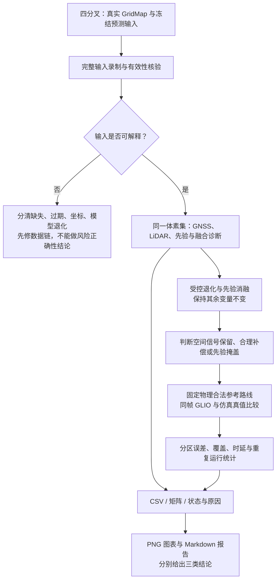

# Advisory PL 空间退化验证：方案与预实验报告

原方案状态（2026-10-06）：**工具与合成机制对照已实施；真实森林扫描和误差校准 INCONCLUSIVE，现场阻止**。本轮状态见下方 2026-10-07 续轮结果。

续轮（2026-10-07）：四处原有修改已授权审阅、独立提交 `534cd4a`，现场阻塞已解除。
坐标 v5 实现 `88b3c8b` 后完成一次 canonical 实测；该轮未到分叉／终点，
GNSS epoch 重建未关联，参考—位姿约 0.2 s 不满足 0.05 s 校准门限。
本轮将监测实际使用的完整优化后 epoch 与坐标记录一起传递，删除 planner
独立重建；保留 GNSS 拒绝和全部执行规则。原始证据：
[23 份录制及一次超时](../../log/20261007T033528Z_495/export/advisory/validation/recordings/survey_requests.csv)、
[起点附近扫描](../../log/20261007T033528Z_495/export/advisory/validation/real_start/points.csv)、
[当次物理搜索重放](../../log/20261007T033528Z_495/export/analysis/failure_map_timeout.json)。
真实双源互补、同参考时刻米数校准、完整任务与默认推广仍待证据。

第二轮 `20261007T035010Z_435` 的三份真实输入已通过优化后坐标方向核验，
参考—位姿约 0.2 s，GNSS 监测拒绝仍保留。请求起点合法、取整起点被拒绝的
恢复问题按当次日志定位；先修正负坐标取整偏差，现场验证与报告另行登记。

本轮正式结果（2026-10-07）：
[图文 report.md](../../log/20261007T032125Z_369/export/analysis/advisory_validation/final_audited/report.md)、
[summary.json](../../log/20261007T032125Z_369/export/analysis/advisory_validation/final_audited/summary.json)。
已完成三次 canonical、干净工作树、GPU 预检通过的独立探索运行；74/76 完整
录制，73 份真实重放。起点／运动段或停滞／末次停滞附近分别扫描 100 唯一
体素；未到实际分叉，未将停滞输入替换或改名为分叉输入。
空间差异已观测（有效结果 LiDAR-only），不能据此验收双源、误差尺度或全图。
方向转换数值闭合通过；优化后的 map Up/ENU Up 漂移最大 6.529°，物理竖直
对齐和旋转不确定性尚未验证。参考—位姿 0.124–0.273 s，全部超出 0.05 s
校准门限。GNSS 当前监测拒绝，单 GPS 星座及整星座故障配置保持原样，未放宽准入。
三次分别前进 9.777／4.661／4.640 m，未到终点；原始停车原因与失败地图按
当次 run 区分，晚期缺同身份地图的根因保持未知。坐标／来源、真实全场景敏感性、
95%经验误差符合性、固定路线接续与完整任务均仍缺关键证据。
9＋9 校准／验证及 6 次任务对照未启动；默认校准参数未推广。旧正式报告未覆盖。

当前实现依据：`d05d792fac3d831a2dd474bc7ca650500499fe32`。
现有运行依据：`20261006T114500Z_605`，场景 `icra_dense_forest_four_fork_v2`。
现有运行保留了无关 RViz 修改，因此这里只引用诊断观察，不作为干净版本的现场验收。

## 1. 要回答什么

分开验证三个问题，不把它们合成一个 PASS：

1. **可用性**：真实输入是否能稳定生成有原因、可追溯的预测结果？
2. **空间敏感性**：候选位置的有效观测变弱时，融合结果是否保留这种退化？另一个来源合理补偿时，融合 PL 可以保持稳定。
3. **误差符合性**：模型的相对风险和数值尺度，是否与同条件下实际 GLIO 定位误差相符？

HPL/VPL 是冻结参考时刻、零预测时域的实验性空间预测。空间敏感性成立不等于误差已校准，更不等于认证完整性保证。不同位置不必产生不同颜色。

## 2. 地图与执行边界

**主实验使用当前四分叉地图，无须新建地图，也不建立第二张风险地图。** 继续共用 GridMap 的 0.1 m 空间索引。离线选点步长只决定抽查密度，不修改地图分辨率。

主实验先选三个真实冻结输入：起点、现有运动段中部、接近停止位置。每份在无人机附近约 10 m × 10 m、同一体素高度层，以约 1 m 间距选最多 100 个唯一体素中心；只对预先选定的退化边界加密至约 0.5 m。未观测、障碍、越界和预测缺失分别标注，不插值填成有效风险。

现有地图中若没有足够的独立退化对照，先使用小型离线 fixture 或已有 `lidar_corridor_degenerate` 做机制补充；它们不是四分叉实测。无需为了得到红色热力图改造森林或调整规划阈值。

离线诊断不占 planner 在线预算；可视化仍是独立进程。试验变体不回写占据、风险缓存或执行授权，不调整实际净空、预警线、控制器或发布闸门。



## 3. 已有证据：能说明什么，不能说明什么

| 现有观察 | 证据 | 能得出的结论 |
|---|---|---|
| 50 轮显示任务中 49 轮预测器调用为零，一轮调用 72 次 | `profiling/grid_map_visualizer_81286.csv` | 成图链路需要核验；零调用不等于模型返回了零 PL |
| advisory 避让样本 0，未知样本累计 33,349 次 | `profiling/planner_flow_82526.csv` | 本次不能证明风险引导有效；也不支持 PL 到处划禁飞区的解释 |
| 候选快照的 `risk_valid_until_s=null`，PL CSV 只有表头 | `export/planner/failure_map/candidate/` | 该快照无法重放完整的风险预测 |
| 实际曲线进入物理未知体素 `(105,115,15)` | `export/analysis/curve_observation_candidate.json` | 是物理观测问题；不等于完整性预测缺失 |

现有候选地图如下，仅用于说明物理未知与 PL 未预测的区别。青线是被拒绝的候选，浅橙色是物理未知；不是风险图或最终停止帧。


### 3.1 强先验的解析示意

当前接入将误差代理 `e` 转成 `Lambda_prior=(3/e)^2 I`；默认融合 PL 系数为 5，偏差/预留为 0。保存快照的 `e=0.0118184521 m`，仅先验对应 PL 约为 `5e/3=0.0196974 m`，低于 HPL 显示下限 0.25 m。

下面图的观测信息是**合成的各向同性数值**，只演示公式；没有执行 Predictor 的来源准入、新鲜度或空间查询。它不证明本次实际热力图的值是多少，也不提供参数修改建议。


待核验假设：共享强先验是否掩盖了候选位置的观测退化，以及 FGO 后验与再次加入的观测信息是否存在未经处理的相关性/重复计入。不能把这两项直接写成已证实原因。

## 4. 第一阶段：输入与输出可用性

复用已有 `PredictionInput`、输入编解码及 `PredictorModule`，从只读导出入口保存完整冻结输入；不另写一套预测模型。现有 `failure_map` 保存物理地图与部分诊断，但缺少完整 GNSS/预测上下文，不能替代这项录制。

每份输入必须保存：

- revision、参数、几何、地图代数、参考时间、各来源时间戳与身份/hash；
- 完整冻结占据及观测证据、预测所用地图点/派生规则；
- 位姿、当前监测数据、先验矩阵；GNSS epoch、卫星几何、噪声及排除集合；
- 原始序列化 payload、格式身份与校验和。使用匹配的代码/参数解码。

对固定点，分别记录输入拒绝、位置过滤、准备预算不足与模型计算失败。当前包装器在 fusion 模式下无 GNSS epoch 会提前失去预测函数；必须单独验证这是否妨碍有效 LiDAR 的来源补偿，不能将其混成 LiDAR 模型退化。

离线复查以保存的参考时刻解释冻结输入，不擅自把旧时间戳改成当前时间。跨版本/几何不匹配明确失败。正式扫描保存每个请求点，包括失败点，避免只统计成功样本。

检查条件：

1. 三份真实输入的准入结果、实际预测调用数和有效/无效原因可解释；没有任意设定覆盖率强迫未知区通过。
2. 同输入、同点重复查询，在预先声明的浮点容差内一致；缓存、批量与显示计算不改变结果。
3. `INVALID/STALE/UNKNOWN` 不成为有效零值；无来源时不靠先验伪造有效预测。
4. 输入仍不可用时，空间正确性记为 `INCONCLUSIVE_INPUT_UNAVAILABLE`，先处理准入原因。

## 5. 第二阶段：空间信号与受控退化

### 5.1 同点诊断表

每点导出坐标/体素、物理观测状态、查询状态与原因、来源使用标志、GNSS HPL/VPL、LiDAR-only 与 prior-only PL、最终融合 HPL/VPL、融合前保守修正值和修正增量；保存三个信息矩阵、融合协方差、特征值/弱方向以及各矩阵 trace。

这些是实验 CSV 内容，不要求扩充生产 `GridRiskVoxel`。离线结果须与生产 `makeRiskPrediction()` 的 PL/状态对齐。显示源选择、线程数和精度不同造成的误差也要记录；不把旧 query probe 的旧先验构造直接当成当前 manager。

### 5.2 对照组

| 组别 | 只改变什么 | 如何解释结果 |
|---|---|---|
| S0 真实空间扫描 | 候选体素中心 | 观察真实几何差异；保持一份冻结输入与统一先验 |
| S1 GNSS 退化 | 逐级减少有效卫星或增大测量噪声；固定 LiDAR/先验 | GNSS 信息减弱；融合可被 LiDAR 合理补偿 |
| S2 LiDAR 退化 | 在离线 fixture 中减少法向支持或制造弱方向；固定 GNSS/先验 | 检查弱方向，而不只看点数或 trace |
| S3 双源退化 | 两类观测同时逐级减弱；固定先验 | 识别退化响应、先验地板与来源不可用状态 |
| S4 先验消融 | 同点、同观测，先验系数 alpha 为 1 / 0.1 / 0 | 仅诊断掩盖程度；alpha=0 可无解，不用于授权运动 |
| S5 缺失/过期 | 分别令 GNSS、LiDAR或当前输入不可用 | 区分模型明确退化与缺失；验证包装器和模型的来源规则 |

S1/S2/S3 对预测器输入做受控变化，不删除物理障碍或伪造自由空间。真实空间扫描和合成机制图分开存储、分开下结论。来源无法形成可用模型时，报告状态而非强迫画连续曲线。

### 5.3 判定方法

- 有效观测信息逐级减少、其余条件不变时，协方差/PL 不应反向改善，变化要超过重复计算的数值误差。
- 单源变差而融合稳定，先核对另一来源在同一弱方向是否提供足够信息；这是可能合理的补偿，不自动判失败。
- 两源减弱而 PL 几乎不变，结合 prior-only、弱方向信息占比和 S4 判断是否被先验主导。
- 报告正常/退化区域的绝对差、相对差、分位数、方向与有效率；热图同时使用统一物理色标与数据分布图，不靠自动缩放判成功。
- “信号保留比”可记为 `DeltaPL(alpha=1)/DeltaPL(alpha=0)`；分母接近零或任一组无效时记 N/A，不强行判定。该指标仅诊断，不是认证门槛。
- 必须验证 FGO 后验先验与观测贡献的相关性假设；若不能解释，数值符合性保持待定。

若单源互补与双源退化的可解释对照不足，结果记为 `INCONCLUSIVE_SPATIAL_CONTRAST`。本阶段不引入未经论证的“必须上升 20%”阈值。

## 6. 第三阶段：与实际定位误差比较

先使用已有运动段验证数据对齐。更广范围需要在同一森林中固定一条物理合法参考路线，经过正常和退化位置；验证不同预测变体时保持相同路线、初始条件和扰动 seed，避免风险规划自己改变采样区域。若当前接续阻塞使路线无法覆盖，标记覆盖不足，不宣称全地图误差已验证。

记录 GLIO 位姿、仿真真值、同帧预测输入、当前质量及观测条件。真值仅用于验证，不反馈给风险预测。使用已知坐标变换、外参和时间戳对齐，不逐段重新拟合坐标以消除误差。计算：

`e_H = sqrt((x_GLIO-x_truth)^2 + (y_GLIO-y_truth)^2)`，`e_V = abs(z_GLIO-z_truth)`。

先对比**当前位置、同参考时刻**的 PL 与误差。当前 tau=0 的空间预测不能直接作为未来到达时刻的误差保证；未来预测与到达条件不同的样本单独分析，不混入同帧覆盖统计。

先做至少三次配对重复运行作为探索性分析，再依据跨运行波动决定是否增加样本。报告空间风险排序与误差趋势、每个区域误差分位数、PL 超出次数、有效覆盖率、输入拒绝与端到端延迟。PL 超出率按有效样本计算，另列全部请求的缺失率，不能删掉不利样本。

时序样本有相关性，不能把高频点数当成独立试验数量。置信区间按运行/轨迹块处理；三次重复不支持尾部概率或完整性风险认证。PL 高时不一定出现一次大误差，低 PL 也不应仅凭一条误差小的轨迹获得保证。

## 7. 产物与图文报告生成流程

待实现一条离线报告流水线：完整输入采集 → 真实预测器重放 → CSV/矩阵结果 → matplotlib 图表 → Markdown。复用现有输入 codec、预测器实验与绘图方法；不得直接启动有 `/tmp` 默认输出的旧 probe。实验输出统一由 artifact resolver 分配/采用 `IAP_RUN_DIR`，登记子 manifest。

```text
IAP_RUN_DIR/
├── runtime/ros/                         原运行日志
├── profiling/                          查询/准备/总耗时
├── export/advisory/validation/          输入 payload、点结果、矩阵与状态
├── export/analysis/advisory_validation/
│   ├── input_availability.png           有效率、时间戳与失败原因
│   ├── spatial_layers.png               同范围 GNSS/LiDAR/prior/fused HPL+VPL
│   ├── degradation_response.png         S1/S2/S3 的 PL 与弱方向信息
│   ├── prior_ablation.png               S4，标注诊断变体
│   ├── error_vs_pl.png                  同帧实际误差与预测
│   ├── timing.png                      准备、查询、总体耗时
│   ├── summary.json
│   └── report.md                        自动生成的图文实验报告
└── metadata/manifests/                  参数、revision、hash与产物登记
```

空间图缺失值用独立颜色，HPL/VPL 显示米数、色标上下限、参考时刻、地图代数与有效率。不要把物理未知、预测缺失、明确退化涂成同一种“高风险”。每图注明真实重放/合成机制/实测误差身份。

报告固定包含：实验目的；版本与参数；地图及输入来源；方法/对照；图与原始数值；分项判定；性能与覆盖局限；原因及最小修改建议。所有结论链接原始 CSV/JSON，不能只引用截图或 RViz 是否红。

当前生成的解析图及其 manifest 位于现有运行的 `export/analysis/` 与 `metadata/manifests/`，未覆盖在线模块输出。当前不是完整报告流水线的完成声明。

## 8. 当前结果与下一步

| 验证项目 | 当前状态 |
|---|---|
| 现有日志核对与强先验解析示意 | 已完成，仅诊断/推导 |
| 完整冻结预测输入录制与重放一致性 | 已实现；服务传输、codec、重复/batch/包装器对齐测试通过；真实录制待现场 |
| 三份森林输入的空间扫描与退化对照 | 待测 |
| 实际定位误差与 PL 校准 | 待测 |
| CSV 到图文报告的完整自动流水线 | 已实现并运行合成 S0、S1–S5；真实误差图明确 NOT RUN |

**先完成输入录制与 S0/S4；若输入不可用先修准入，若先验掩盖先核验先验语义与相关性；再做 S1/S2/S3 与真实误差对照。** 不先改 PL 阈值、色标、地图或增加多候选管理。

现场仍以 `iap_sim.launch.py` 为入口、四分叉为主场景。正式现场需要提交版本、干净工作树和 GPU 预检；无关 RViz 修改保留，不通过另建工作树绕过规则。当前新现场状态为 `LIVE_BLOCKED_BY_UNRELATED_DIRTY_WORKTREE`。离线分析可以继续，但不能代替新现场验收。

## 9. 代码与参考资料

- [体素风险字段](../../src/iap/planner/plan_env/include/plan_env/grid_map.h)
- [当前先验与输入绑定](../../src/iap/planner/plan_manage/src/planner_risk.cpp)
- [生产预测包装器](../../src/iap/planner/plan_manage/src/prediction_input.cpp)
- [冻结输入 codec](../../src/iap/planner/plan_manage/src/prediction_input_codec.cpp)
- [FIM 融合公式](../../src/iap/predictor/fusion_advisory_predictor.cpp)
- [独立显示实现](../../src/iap/planner/plan_manage/src/grid_map_visualizer.cpp)
- [已有 Predictor 实验报告](predictor_test_report.md)：历史证据与实验方法，不替代当前版本验证。
- [运行产物契约](../spec/run_artifact_contract.md)
- [当前规划流程](../spec/ego_based_planning_flow.md)

## 10. 本轮实施记录（2026-10-06）

开始时 HEAD 为方案提交 `ec53b65a485617a58e2c69f2bc3678ea09ed7819`，未切换版本。该提交只改文档，因此方案对 `d05d792` 生产代码、融合公式、先验和显示下限的描述仍适用于开始时 HEAD。保留唯一既有的 `config/sim_ego/grid_map_stage1.rviz` 修改，未修改原版 EGO 仓库。

已完成共享生产冻结准备入口、只读服务完整录制、原 codec 重放、逐点状态/原因、来源 PL、矩阵/eigen/weak direction、耗时、checksum/版本及图文报告。没有替换模型、放宽有效性或改在线准入；包装器只新增可选拒绝原因。工具语义见 [契约](../spec/advisory_validation_contract.md)。

本轮 run：`log/20261006T123756Z_794`。历史工具提交 `21f692e` 的绑定复跑已经完成，见 [正式报告](../../log/20261006T123756Z_794/export/analysis/advisory_validation/committed/report.md) 与 [原始 summary](../../log/20261006T123756Z_794/export/analysis/advisory_validation/committed/summary.json)。提交前候选证据保留独立身份；这些合成证据均不能替代真实扫描。

合成六平面夹具采用完整 v1 payload 和真实 PredictorModule，S0 查询 100 个唯一中心，S1–S5/来源诊断共 135 个请求。双源 sigma 1→100 时，alpha=1 的 HPL 约 0.0199696→0.0200000 m，alpha=0 则 0.362424→36.22181 m；基线弱方向先验占比约 99.6965%。这是先验主导的机制证据，不能直接写成森林实测的空间 FAIL/PASS。

缺 GNSS 的 S5 复现包装器未绑定、模块仍可使用有效 LiDAR；prior-only 且两源均不可用没有得到有效预测。FGO smoother 后验被缩成对角先验后又加入空间观测，未见交叉协方差或来源去重；实际因子重叠和数值偏差仍未量化。证据及建议见报告，不在本任务擅自修正生产模型。

独立结论暂为：真实输入可用性 `INCONCLUSIVE_INPUT_UNAVAILABLE`；真实空间敏感性 `INCONCLUSIVE_INPUT_UNAVAILABLE`；实际误差符合性 `INCONCLUSIVE_LIVE_NOT_RUN`。合成单调性和源准入回归已通过，并不把准入矛盾当成生产能力已修复。

现场仍为 `LIVE_BLOCKED_BY_UNRELATED_DIRTY_WORKTREE`。历史 GPU 预检已通过、正式离线复跑已登记；新现场须重新检查工作树与 GPU。三份真实输入、合法固定路线、至少三次配对重复和 GLIO 误差校准保持待测。


## 本轮：Advisory 后验先验默认关闭（2026-10-06）

本轮接续 HEAD `9b03f36`，没有回退版本。默认关闭 shared FGO posterior proxy，只读启动开关 `risk/use_posterior_prior` / 仿真 `advisory_posterior_prior`；ON 仅旧行为复现。OFF 冻结输入 has_lambda_base=false，当前监测、误差代理、运动质量保留。当前输出为“基于观测条件的融合 Advisory”，没有未来 GLIO 误差保证。开关及 A/B 合同见 [工具契约](../spec/advisory_validation_contract.md)，实际 launch 命令见 README。

新 run 为 `log/20261006T141611Z_756`。同物理地图/源观测/时间/参数/候选的 S0–S5 双组工具已经实现；完整编码配对只移除先验标志/矩阵，来源诊断及正则化证据另存。关闭组不重新引入 S4 alpha 先验。CPU 弱墙恢复曲线出图仍被原物理检查拒绝，需分别记录规划覆盖和预测机制；缺 GNSS 的准入差异不在本轮放宽。正式提交绑定复跑与图文报告已登记；旧报告及产物保持原身份。现场三份输入、固定合法路线、配对 seed 至少三次运行和实际误差校准仍待测，不将机制测试写成真实森林验收。

回归已执行：6 项新 A/B 合同、9 项原冻结工具合同、33 项 EGO baseline、独立可视化/规划进程管线、35 项 canonical launch 合同及 PredictorModule CTest 通过；已安装 launch 的 --show-args 确认默认 false。产物契约检查通过。日志在本轮 runtime/ros。

正式提交绑定实验代码 `f3de428b2e95e4744ca85cbef6273ce4b35d91e1` 已完成同输入复跑。新 [图文 report.md](../../log/20261006T141611Z_756/export/analysis/advisory_validation/committed_ab/report.md)、[summary.json](../../log/20261006T141611Z_756/export/analysis/advisory_validation/committed_ab/summary.json)、[数值/模型解释](../../log/20261006T141611Z_756/export/analysis/advisory_validation/committed_ab/findings.md)、[原始数值表](../../log/20261006T141611Z_756/export/analysis/advisory_validation/committed_ab/ab_values.csv)；完整输入分别在本 run 的 `export/advisory/validation/committed_ab_on/` 与 `committed_ab_off/`，没有真实森林输入。40 个对照变体、每组 139 请求，39 对完整编码 SHA256 相等，缺物理地图一对 N/A。OFF 所有 has_lambda_base=false、prior_used=0；两组各 120/139 官方有效，S0 各 100/100 有效，其余失败/诊断不丢弃。

合成空间 HPL 跨度 ON 1.46556361e-5→OFF 0.142859503 m（9747.75 倍），VPL 跨度 1.02482704e-5→0.083014211 m（8100.31 倍）。双源噪声 1→100 时 OFF HPL 0.362424369→36.2218096 m，ON 0.0199696167→0.0199999970 m；OFF 弱法向 LiDAR-only HPL=9.59613 m，双源=8.19796 m，信息互补有机制证据。极端 ×1e6 时 GNSS 因 singular_geometry 退出，epsilon 占弱方向约 99.9810%，HPL 接近 4999.52450 m；GNSS anchor/raw/FIM 标量仍有尺度差异，未经实际误差校准。CPU 弱墙恢复出图被原物理闸门拒绝，是需要后续修复的覆盖风险，不通过调预算/先验隐藏。原值和矩阵已在 report 链接。

三项真实结论分别为：输入可用性 `INCONCLUSIVE_INPUT_UNAVAILABLE`；空间敏感性 `INCONCLUSIVE_INPUT_UNAVAILABLE`；实际误差符合性 `INCONCLUSIVE_LIVE_NOT_RUN`。GPU READY（nvidia-smi=0、cuInit=0、device_count=1），提交后原有 RViz、两份文档和旧报告脚本修改仍保留，现场为 `LIVE_BLOCKED_BY_UNRELATED_DIRTY_WORKTREE`，live_started=false。完整 [预检 JSON](../../log/20261006T141611Z_756/metadata/manifests/advisory_preflight.json)。真实 start/middle/stop、固定合法路线、配对 seed 至少三次重复、坐标/外参/时间现场核验仍未完成；误差 CSV 只有表头，不代表零误差。

实际执行命令（已 source ROS 与 workspace，所有命令采用同一 `IAP_RUN_DIR=/home/dev/ws_iap/src/iap/log/20261006T141611Z_756`）：

```bash
ctest --test-dir build/ego_planner -R '^(test_advisory_prior_ab|test_advisory_validation|test_ego_baseline|test_ego_pipeline)$' --output-on-failure
python3 src/iap/test/test_canonical_launch_contracts.py
ctest --test-dir build/iap -R '^test_predictor_module$' --output-on-failure
ros2 launch iap iap_sim.launch.py --show-args
python3 src/iap/scripts/dev_predictor/advisory_validation.py preflight
python3 src/iap/scripts/dev_predictor/compare_advisory_error.py
python3 src/iap/scripts/dev_predictor/advisory_prior_ab_validation.py fixture --binary build/ego_planner/advisory_validation --label committed_ab
```

`--show-args` 只验证已安装入口参数，不启动现场。重跑须取消 IAP_RUN_DIR，让 resolver 新分配，不能在本正式 run 覆盖同名产物；完整构建/测试/实验命令与日志登记在本 run metadata/manifests。未执行的森林 record/launch 不列为已完成命令。

## 分阶段验证契约与本轮状态（2026-10-06）

默认关闭 Advisory 后验代理，预测输入／来源信息／运动执行三种有效性分离。
共享 `PredictorModule::admission` 负责来源准入，缺 GNSS 不再阻止合法 LiDAR。
联合原始信息秩与正则化弱方向占比先于有效 PL 授予；占比上限 1%，
官方数值退化值为空。来源独立秩亏可由联合观测补足。v4 codec 保存数值与支持分组参数及原始格式身份，
v1/v2/v3 仅保留历史诊断读取；缓存身份与来源新鲜度同步约束。

准入／数值、codec、生产包装器及批次回归已通过；重复与表面加密对照已完成，
LiDAR 在现有 PCA 尺度内按表面族平均相关贡献，保留新增独立法向。
来源 raw／anchored／information PL 明确分列。地图 ENU 与估计器旋转的实测
同帧证据仍缺失，不宣称绝对尺度已统一或已校准。实际曲线约束已贯通初始化、rebound、refine 与重定时检查；
冻结 CPU 弱墙 OFF 回归生成合法曲线、通过发布闸门并验证一次接续的固定 P/V/A 与执行 ID 消费。
独立检查增加 cubic 轴向极值硬边界核对，采样间越界不能靠软惩罚获得授权；
真正不可解的拒绝检查保留。实时 ROS 发布／接续及固定路线校准与任务对照仍待测。真实森林现场仍待测：
`LIVE_BLOCKED_BY_UNRELATED_DIRTY_WORKTREE`，不推广未经独立实测的校准参数。
契约见 [advisory_prediction_contract.md](../spec/advisory_prediction_contract.md)。
本轮正式报告：[report.md](../../log/20261006T154206Z_544/export/analysis/advisory_validation/final/report.md)。

固定路线校准工具已实现：三条件 × 三次校准／三次独立验证、disjoint seed，
测量残差噪声标定后必须重放，再冻结统一换算；水平／垂直同时满足的 95%
经验覆盖按独立运行报告，无效请求留在分母，趋势按 5 s 轨迹块及 block bootstrap。
冻结参数需显式加载，hash／原始格式身份进入 v4 codec、输入身份与缓存。
这些是工具合同回归；本轮没有真实合法参考路线、ENU 旋转／外参时间证据、
观测 seed 注入或退化时序实测。校准／独立验证保持 INCONCLUSIVE，默认参数不推广。


规划引导开关 `planning/advisory_guidance_enabled` 默认开启，canonical 参数为
`advisory_guidance:=false`；关闭仍计算／录制／显示预测，A* 新查询与缓存刷新
复用同一偏好转换。无障碍合成退化带的 CPU 开关对照验证真实曲线绕行及发布，
guide 跟踪使用实际 N-3 样条跨度，并在原修复预算／权重内以实际越线点约束
返回同一合法 guide。物理／运动／整曲线／最新走廊闸门均保留。

`advisory_trial:=<absolute JSON>` 已接入固定 waypoint、canonical 速度、
配对 observation seed 与整次运行恒定的单源退化；森林 map seed=41021 不变。
启动要求真实冻结地图的物理路线证明、静态坐标／外参／时间证据及其 hash，
复制到同一 run 后登记。录制请求有独立 ID 和完整清单；未录到输入或未重放
也进入误差分母。本轮未取得这些真实前置证据，九次校准、九次独立验证和六次
任务对照均未启动；95% 经验覆盖与森林任务结果保持 INCONCLUSIVE，默认不推广。


正式实施代码依次提交：`fa0a780`（准入／数值）、`9d41d66`（采样／缓存）、
`8763abb`（实际曲线）、`a61b16d`（校准合同／来源噪声）、`7da3cba`（引导／试验与报告）。
最终相关回归 8 个规划目标、7 个预测／输入目标通过；38 项 canonical launch、
9 项录制／重放、7 项 A/B／报告、6 项经验校准合同及 35 项 EGO baseline 均通过。
CPU 单独合成开关对照 HPL 同为 2 m，曲线横向偏移 OFF=0、ON=0.819709 m，
原发布闸门通过，不能替代真实 ROS／森林接续。

提交绑定的合成同输入 S0–S5 复跑保留 ON/OFF 完整冻结输入；HPL 空间跨度
ON=0.0000146556 m、OFF=0.1428595 m。双源共同退化传入最终结果；共同秩亏
或正则化主导官方 PL 为空。epsilon ×0.1/1/10 的正常 OFF PL 最大相对变化
约 2.60e-8（预定 ≤5%），未放宽标准。重复 ×2/4 的信息及 H/V 变化均为 0，
同覆盖密度最大变化 0.0298937%（预定 ≤5%）。原始支持、矩阵、数值、图和
命令见本节正式报告链接；真实误差请求 CSV 仅有表头，独立实测运行 0。

独立验收：准入／数值 PASS_CPU_REGRESSION；采样稳定性 PASS_SYNTHETIC；
来源同帧语义 FAIL_INCOMPLETE_FRAME_CONTRACT；真实空间敏感性与误差经验符合性
INCONCLUSIVE；曲线发布／接续 PASS_CPU，森林任务 INCONCLUSIVE。GPU READY
（nvidia-smi=0、cuInit=0、device_count=1），四处用户修改仍保持原样，现场状态
LIVE_BLOCKED_BY_UNRELATED_DIRTY_WORKTREE。未启动三份真实冻结扫描、18 次校准／
独立验证或 6 次任务对照，默认校准参数未推广。下一步补 ENU／外参／时间证据
和生产物理检查通过的固定参考路线后，实施独立实测；冻结 tau=0 不作未来误差保证。

## 坐标契约与真实森林续轮（2026-10-07）

原有四处修改审阅提交为 `534cd4a`；坐标实现使用优化后 E/R/X 同帧证明，
共享输入将 GNSS 射线／信息投影至 map，codec v5 绑定完整坐标及缓存身份。
Current Monitor 与真实曲线执行闸门不变。旧格式保留历史读取，缺证据不授予
本轮校准资格。本轮开发与测试 run 为 `log/20261007T032125Z_369`；现场输入、
固定路线、9＋9 误差与6次任务按顺序待测，不能以坐标单测替代实测。

最终日志核验发现历史 ARAIM `worst_hyp` 行为 62 列，表头及 epoch 行为 60 列。
报告将这些假设行标为格式无效、身份统计为空，保留原日志及旧报告快照；不重新
排列列值追认假设身份。epoch 行和冻结输入支持当前 GNSS 监测拒绝的观察，
整星座退化的精确假设身份仍需修复生产导出后核验。现场停车归因与此独立。
