# Predictor Isolated Test Coverage 实验报告

记录日期：2026-06-11

## 1. 测试范围

本报告记录 Predictor 模块 `Isolated Test Coverage` 部分的实验结果。实验对象是独立 predictor advisory query 逻辑，验证 GNSS、LiDAR 和 FIM fusion 输出的正确性、fallback 可解释性以及矩阵诊断语义。

本报告只使用 isolated GTest 结果作为结论依据，不使用 system launch、planner success、`/iap/integrity` monitor fusion 输出或 trajectory 结果作为通过标准。

纳入本次实验的测试目标：

| 测试目标 | 用例数 | 说明 |
| --- | ---: | --- |
| `test_predictor_module` | 19 | PredictorModule、GNSS advisory、LiDAR advisory、fusion advisory、GNSS sweep、current/advisory separation 和 fusion gate 的模块级查询测试。 |
| `test_lidar_observability_fim` | 15 | LiDAR observability/FIM、退化几何、corridor degeneracy、primitive generation 和 missing-input diagnostics。 |
| `test_predicted_araim` | 5 | GNSS predicted ARAIM、legacy wrapper 和 clock Schur complement advisory FIM。 |

## 2. 测试方法

基于当前源码重建 `iap` 包测试目标：

```bash
source install/setup.bash
colcon build --packages-select iap --cmake-args -DBUILD_TESTING=ON
```

运行 Predictor isolated coverage：

```bash
source install/setup.bash
colcon test --packages-select iap --ctest-args -R "test_predictor_module|test_lidar_observability_fim|test_predicted_araim" --output-on-failure
```

为生成报告和复核测试清单，额外导出：

```bash
ctest --test-dir build/iap -R 'test_predictor_module|test_lidar_observability_fim|test_predicted_araim' --output-on-failure
./build/iap/test_predictor_module --gtest_list_tests
./build/iap/test_lidar_observability_fim --gtest_list_tests
./build/iap/test_predicted_araim --gtest_list_tests
```

## 3. 总体执行结果

构建命令执行结果：

```text
Starting >>> iap
Finished <<< iap [4.71s]

Summary: 1 package finished [4.77s]
```

测试目标执行结果：

| 测试目标 | 结果 | 耗时 |
| --- | --- | ---: |
| `test_predicted_araim` | Passed，5 cases | 0.05 sec |
| `test_lidar_observability_fim` | Passed，15 cases | 0.05 sec |
| `test_predictor_module` | Passed，19 cases | 0.05 sec |

汇总结果：

```text
100% tests passed, 0 tests failed out of 3

Label Time Summary:
gtest    =   0.15 sec*proc (3 tests)

Total Test time (real) =   0.15 sec
```

结果图：

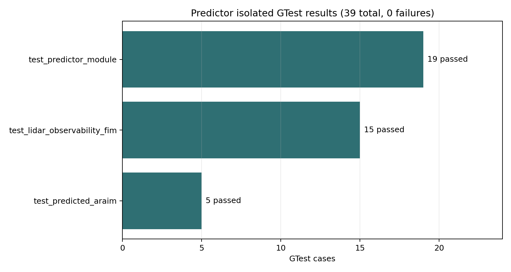

## 4. GNSS 实验一：Open-sky 8 星 advisory

对应 C++ 测试：

```text
PredictorModuleTest.GnssOpenSkyProducesFinitePlAndFim
PredictedAraimComputerTest.OpenSkyWithoutOccupancyProducesResult
```

测试文件：

```text
src/iap/test/test_predictor_module.cpp
src/iap/test/test_predicted_araim.cpp
```

### 4.1 测试目的

该实验验证 GNSS predictor 在 open-sky、多卫星输入下可以输出可用 advisory result。核心检查不是 planner 是否成功，而是 GNSS advisory 自身是否满足：

- `valid == true`
- `available == true`
- `fallback == false`
- HPL/VPL/PL 为有限正数
- 3x3 position-only GNSS FIM 有效且 finite
- 可用卫星数与输入 open-sky epoch 对齐

这对应测试计划中的要求：open-sky multi-satellite input returns finite HPL/VPL and valid 3x3 position FIM。

### 4.2 固定输入

测试直接构造 8 颗人工 GNSS 卫星，不依赖真实 RINEX、仿真 launch 或外部 topic。

| 字段 | 构造方式 |
| --- | --- |
| `stamp` | `100.0` |
| `gps_sec` | `2100000.0` |
| `sat_id` | `300 + i` 或 `100 + i`，取决于测试文件 |
| `constellation` | `G` |
| `elevation` | `0.45 + 0.08 * (i % 4)` 或 `0.45 + 0.10 * (i % 4)` rad |
| `azimuth` | `2*pi*i/n_sats` |
| `pr_sigma` | `3.0 + (i % 2)` m |
| `excluded` | `false` |

open-sky 场景不设置 `LocalOccupancyGrid`，因此 visibility predictor 将所有高于 elevation mask 的卫星视为可见。

固定 8 星 open-sky sky plot 如下。图中半径表示 zenith angle，越靠近中心 elevation 越高：

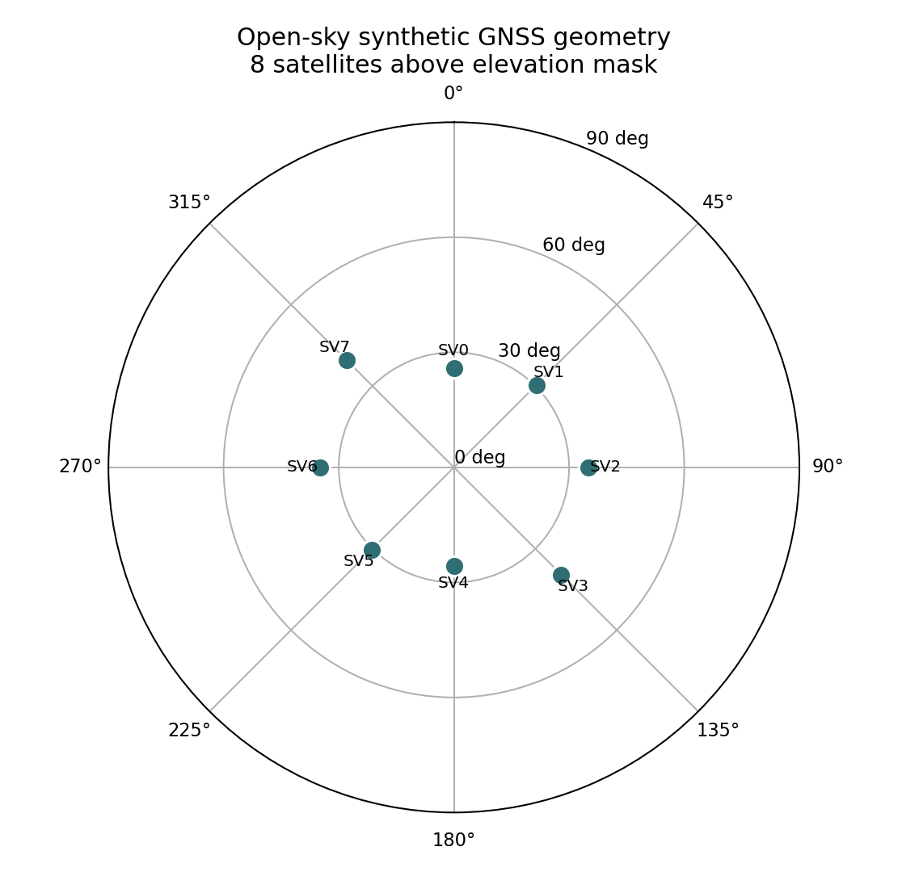

### 4.3 参数对齐

测试使用固定 GNSS predictor 参数，避免 dynamic budget 和外部配置影响实验判断：

| 参数 | 值 | 说明 |
| --- | ---: | --- |
| `geometry_params.dynamic_budget` | `false` | 固定使用测试内 K factor。 |
| `geometry_params.K_ff` | `5.0` | fault-free PL scale。 |
| `geometry_params.K_fa` | `4.0` | false-alarm term scale。 |
| `geometry_params.K_md` | `3.0` | missed-detection term scale。 |
| `geometry_params.min_sats` | `4` | 少于 4 颗卫星即不可形成 GNSS geometry advisory。 |
| `visibility_params.min_elevation` | `0.1` rad | 本实验 8 颗卫星均高于该阈值。 |

### 4.4 检查项

`PredictorModuleTest.GnssOpenSkyProducesFinitePlAndFim` 检查：

- `result.valid == true`
- `result.available == true`
- `result.fallback == false`
- `result.hpl > 0.0`
- `result.vpl > 0.0`
- `result.fim_valid == true`
- `result.lambda_gnss` 为 3x3 且 `allFinite()`
- `result.lambda_trace > 0.0`
- `result.n_used == 8`

`PredictedAraimComputerTest.OpenSkyWithoutOccupancyProducesResult` 额外检查：

- `result.n_vis == 8`
- `result.n_hypotheses == 8`
- `result.pl_scalar == max(result.hpl, result.vpl)`
- `pdop/sigma_h/sigma_v` 均为正数

### 4.5 本次执行结果

两个 open-sky GNSS 用例均通过：

```text
PredictorModuleTest.GnssOpenSkyProducesFinitePlAndFim RUN COMPLETED
PredictedAraimComputerTest.OpenSkyWithoutOccupancyProducesResult RUN COMPLETED
```

### 4.6 实验结论

在固定 8 星 open-sky 输入下，GNSS predictor 能输出有限的 HPL/VPL/PL，并生成 position-only 3x3 GNSS FIM。该结果说明 predictor advisory 层在不依赖 planner 和 system launch 的条件下，可以独立完成 GNSS 可用性和矩阵诊断输出。

## 5. GNSS 实验二：缺失输入与卫星不足 fallback

对应 C++ 测试：

```text
PredictorModuleTest.GnssMissingEpochIsExplicitFallback
PredictorModuleTest.GnssTooFewSatsDoesNotReturnFiniteFallbackPl
PredictorModuleTest.GnssExcludedSatellitesReduceUsedCountAndFallbackExplicitly
PredictedAraimComputerTest.MissingEpochFallbackReason
PredictedAraimComputerTest.TooFewSatellitesFallsBack
```

测试文件：

```text
src/iap/test/test_predictor_module.cpp
src/iap/test/test_predicted_araim.cpp
```

### 5.1 测试目的

该实验验证 GNSS predictor 在不可形成有效 geometry advisory 时不会输出伪有效 protection level，而是通过明确 fallback reason 说明失败原因。

本实验覆盖三类失败：

- 没有 GNSS epoch：`no_gnss_epoch`
- 卫星总数少于 `min_sats`：`too_few_sats`
- 输入 epoch 有 8 颗卫星，但 5 颗被 `excluded=true` 排除，剩余可用卫星低于 `min_sats`

### 5.2 固定输入

| 场景 | 输入构造 | 预期 |
| --- | --- | --- |
| Missing epoch | `snapshot.has_epoch=false` | `fallback_reason == "no_gnss_epoch"` |
| Too few satellites | `make_epoch(3)` | `fallback_reason == "too_few_sats"` |
| Excluded satellites | `make_epoch(8)` 后将前 5 颗设置 `excluded=true` | `n_visible == 3`，`n_used == 3`，`fallback_reason == "too_few_sats"` |

Excluded satellites 场景的意义是区分“epoch 中存在卫星”和“可用于 geometry 的卫星”。GNSS predictor 必须在 visibility 和 geometry 构造时跳过 excluded satellite，不能因为原始 epoch 数量为 8 就误判为可用。

### 5.3 参数对齐

该实验使用与 open-sky 实验相同的 GNSS 参数，其中关键参数是：

| 参数 | 值 | 说明 |
| --- | ---: | --- |
| `geometry_params.min_sats` | `4` | 少于 4 颗可用卫星时必须 fallback。 |
| `gnss.fallback_pl` | `33.0` | `PredictedAraimComputer` fallback PL 检查使用该 sentinel。 |
| `visibility_params.min_elevation` | `0.1` rad | 排除原因主要来自 missing/too-few/excluded，不混入低仰角 mask。 |

### 5.4 检查项

Predictor module 层检查：

- `valid == false`
- `available == false`
- `fallback == true`
- fallback reason 与输入原因一致
- `hpl/vpl/pl_scalar` 不返回有限正常值

Predicted ARAIM legacy 层检查：

- missing epoch 返回 `fallback_reason == "no_gnss_epoch"`
- 3 星输入返回 `fallback_reason == "too_few_sats"`
- fallback HPL/VPL 与配置的 fallback sentinel 对齐

### 5.5 本次执行结果

相关用例均通过：

```text
PredictorModuleTest.GnssMissingEpochIsExplicitFallback RUN COMPLETED
PredictorModuleTest.GnssTooFewSatsDoesNotReturnFiniteFallbackPl RUN COMPLETED
PredictorModuleTest.GnssExcludedSatellitesReduceUsedCountAndFallbackExplicitly RUN COMPLETED
PredictedAraimComputerTest.MissingEpochFallbackReason RUN COMPLETED
PredictedAraimComputerTest.TooFewSatellitesFallsBack RUN COMPLETED
```

### 5.6 实验结论

GNSS predictor 对缺失 epoch、卫星不足和 excluded satellite 均能给出明确 fallback reason。特别是 excluded satellites 实验确认了 predictor 使用的是“可用卫星数”而不是原始 epoch 中的卫星总数，避免了被 FDE 排除的卫星继续参与 advisory geometry 的风险。

## 6. GNSS 实验三：Map occlusion/skymask 退化

对应 C++ 测试：

```text
PredictorModuleTest.GnssMapOcclusionReducesVisibleCountAndDegradesProtectionLevels
```

测试文件：

```text
src/iap/test/test_predictor_module.cpp
```

### 6.1 测试目的

该实验验证 predictor 中的 GNSS visibility/skymask 逻辑会真实影响 advisory 输出，而不是只在日志或 debug 字段中出现。测试要求 map occlusion 使可见卫星数减少，并使几何精度指标和 protection level 退化。

该实验对应测试计划中的要求：Map occlusion/skymask changes visible satellite count and degrades PDOP/HPL/VPL。

### 6.2 固定输入

基础输入仍使用 8 颗人工 GNSS 卫星：

| 输入 | 值 |
| --- | --- |
| 卫星数 | 8 |
| Query position | `(0, 0, 0)` |
| Occupancy mode | `LocalOccupancyGrid` |
| Hard occlusion | `true` |
| Occlusion range | `6.0 m` |
| Ray start offset | `0.0 m` |
| 被遮挡卫星 index | `{0, 2}` |
| Blocker range | `2.0 m`、`2.25 m`、`2.5 m` along each selected LOS |

测试先执行 open-sky baseline，再为 index 0 和 index 2 的卫星 LOS 插入 occupied voxels，最后再次查询 GNSS advisory。

Open-sky 与 occluded case 的可见/可用卫星数对比如下。PDOP/HPL/VPL 的具体数值未在当前 artifacts 中导出，退化关系由本节 GTest 的 `EXPECT_GT` 断言验证。

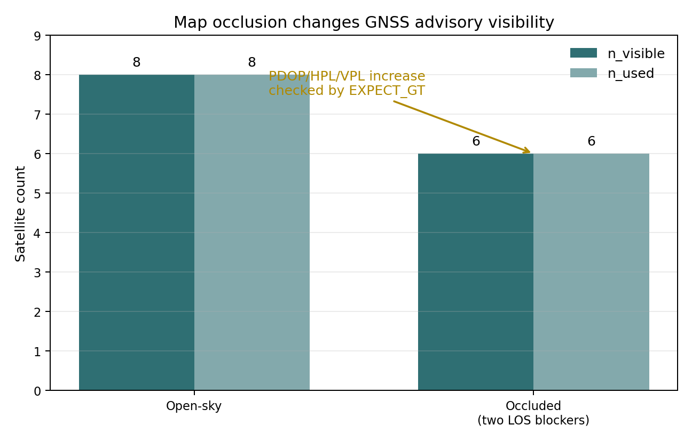

### 6.3 参数对齐

| 参数 | 值 | 说明 |
| --- | ---: | --- |
| `visibility_params.hard_occlusion` | `true` | 被 occupancy ray hit 的卫星直接不可见。 |
| `visibility_params.occ_range` | `6.0` | blocker 位于 2-2.5 m 范围内，应被 ray casting 命中。 |
| `visibility_params.ray_start_offset` | `0.0` | 避免测试 blocker 被起点 offset 跳过。 |
| `LocalOccupancyGrid.voxel_size` | `0.25` | 与 blocker spacing 对齐，保证 voxel hit 稳定。 |

### 6.4 检查项

Baseline open-sky 检查：

- `open_sky.valid == true`
- `open_sky.n_visible == 8`
- `open_sky.n_used == 8`

Occluded case 检查：

- `occluded.valid == true`
- `occluded.fallback == false`
- `occluded.n_visible < open_sky.n_visible`
- `occluded.n_used < open_sky.n_used`
- `occluded.n_visible == 6`
- `occluded.n_used == 6`
- `occluded.pdop > open_sky.pdop`
- `occluded.hpl > open_sky.hpl`
- `occluded.vpl > open_sky.vpl`

### 6.5 本次执行结果

用例通过：

```text
PredictorModuleTest.GnssMapOcclusionReducesVisibleCountAndDegradesProtectionLevels RUN COMPLETED
```

### 6.6 实验结论

在固定 8 星场景中，插入两个 LOS blocker 后，predictor 的可见/可用卫星数从 8 降到 6，同时 PDOP、HPL 和 VPL 均相对 open-sky baseline 增大。该结果说明 map occlusion/skymask 不只是输入字段，而是会进入 GNSS advisory 几何计算并影响最终 protection level。

### 6.7 补充实验 A：GNSS geometry sweep

对应 C++ 测试：

```text
PredictorModuleTest.GnssGeometryDegradationSweepIncreasesPl
```

保存数据：

```text
gnss_geometry_sweep.csv
```

该实验在 fixed synthetic GNSS epoch 上构造 8 组 geometry case，包括均匀分布、半空间集中、单象限集中、低仰角主导、6 星、5 星、4 星和 3 星 invalid case。每组导出：

```text
case_id,n_used,azimuth_spread_deg,elevation_mean_deg,elevation_min_deg,
pdop,hdop,vdop,hpl,vpl,pl_e,pl_n,pl_u,
lambda_gnss_min_eig,lambda_gnss_condition,valid,fallback_reason
```

检查项：

- 所有 `n_used >= min_sats` 的 valid case 必须输出 finite HPL/VPL/FIM diagnostics。
- `three_satellites_invalid` 必须返回 `too_few_sats`。
- 单象限集中和 4 星 geometry 的 HPL/VPL 相比 open-sky baseline 明显退化。

结果图：

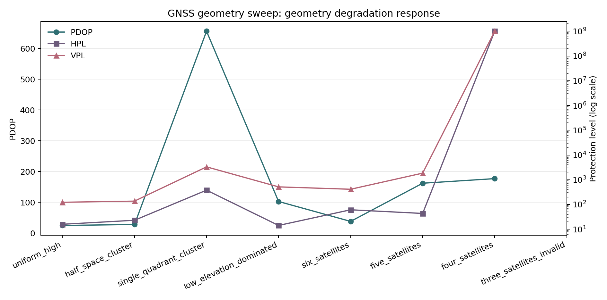

代表性 skyplot：

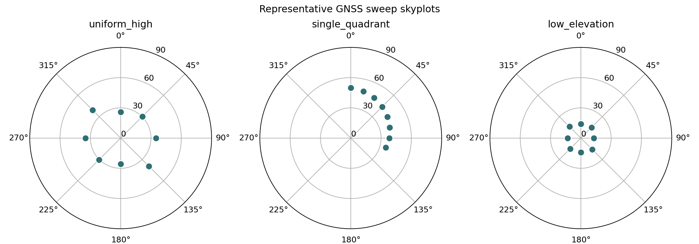

实验结论：GNSS predictor 对 geometry degradation 有可观测响应。单象限集中、低卫星数和 4 星边界 case 会显著抬高 PDOP/PL；低于 `min_sats` 时不会输出伪有效 PL，而是显式 fallback。

### 6.8 补充实验 B：GNSS sigma inflation sweep

对应 C++ 测试：

```text
PredictorModuleTest.GnssSigmaInflationIncreasesPl
```

保存数据：

```text
gnss_sigma_sweep.csv
```

该实验固定 8 星 geometry，只缩放 open-sky 下 visibility/canopy noise model 的 sigma 参数：

```text
sigma_scale = 1x, 2x, 4x, 8x
```

检查项：

- HPL/VPL 随 sigma scale 增大。
- `lambda_gnss_trace` 随 sigma scale 增大而下降。
- 所有 case 保持 valid 且无 NaN/Inf。

结果图：

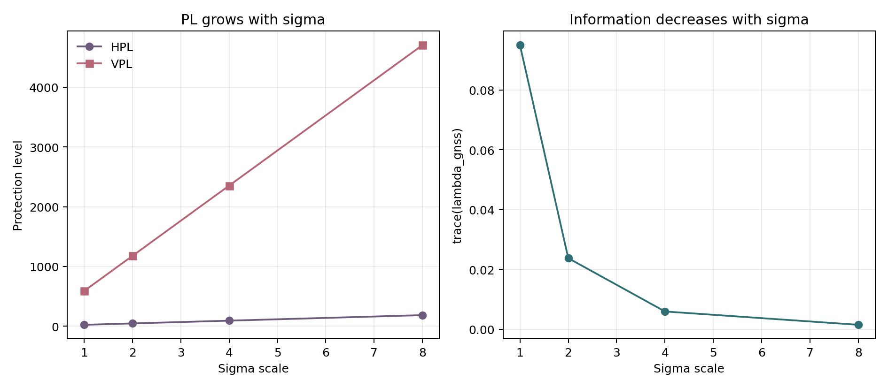

实验结论：在 geometry 不变时，measurement noise 单独增大会降低 GNSS 信息量并抬高 protection level。这补充证明了 predictor 不只对 visible count 敏感，也对 effective sigma 敏感。

## 7. GNSS 实验四：Clock Schur complement advisory FIM

对应 C++ 测试：

```text
PredictedAraimComputerTest.AdvisoryFimUsesClockSchurComplement
PredictorModuleTest.GnssOpenSkyProducesFinitePlAndFim
```

测试文件：

```text
src/iap/test/test_predicted_araim.cpp
src/iap/test/test_predictor_module.cpp
```

### 7.1 测试目的

GNSS 原始 normal matrix 包含 3D position 和 receiver clock state。Predictor fusion 只接受 map/ENU 3D position-only information，因此 GNSS predictor 必须正确消去 clock，输出 3x3 `lambda_gnss`。

该实验验证：

- position-clock 4D normal matrix 按 Schur complement 消去 clock
- 输出 `lambda` 与手工公式一致
- 输出 trace 为正
- 最小特征值不显著为负，即 PSD 或在数值容差内

### 7.2 固定输入

使用 8 颗人工 GNSS 卫星，输入构造与第 4 节 open-sky 实验一致。测试调用：

```text
predictor.predict_advisory_fim(Eigen::Vector3d::Zero())
```

内部产生 4x4 normal matrix `h_full`，其中：

- `h_pp = h_full.block<3,3>(0,0)`
- `h_pc = h_full.block<3,1>(0,3)`
- `h_cp = h_full.block<1,3>(3,0)`
- `h_cc = h_full(3,3)`

### 7.3 参数对齐

| 参数 | 值 | 说明 |
| --- | ---: | --- |
| `fim_clock_epsilon` | `1.0e-6` | 防止 clock block 数值奇异。 |
| `min_sats` | `4` | 8 星输入满足 FIM 构造条件。 |

### 7.4 检查项

测试中手工构造期望结果：

```text
expected = h_pp - (h_pc * h_cp) / (h_cc + fim_clock_epsilon)
```

然后检查：

- `result.valid == true`
- `result.n_used == 8`
- `norm(result.lambda - expected) <= 1e-10`
- `result.trace > 0.0`
- `result.min_eig >= -1e-9`

### 7.5 本次执行结果

用例通过：

```text
PredictedAraimComputerTest.AdvisoryFimUsesClockSchurComplement RUN COMPLETED
```

### 7.6 实验结论

GNSS advisory FIM 的 clock elimination 与 Schur complement 手工公式一致，输出满足 finite、正 trace 和 PSD 容差要求。该实验确认 Predictor fusion 使用的 GNSS `lambda_gnss` 是 position-only map/ENU information，而不是混入 receiver clock 的 4D 矩阵。

## 8. LiDAR 实验一：Feature-rich 3D primitives FIM

对应 C++ 测试：

```text
PredictorModuleTest.LidarRichPrimitivesProducesValidFim
LidarObservabilityFimTest.RichCloudProducesValidInformation
LidarObservabilityFimTest.AdvisoryFimReflectsNormalAnisotropy
```

测试文件：

```text
src/iap/test/test_predictor_module.cpp
src/iap/test/test_lidar_observability_fim.cpp
```

### 8.1 测试目的

该实验验证 LiDAR predictor 在 feature-rich 3D geometry 下可以输出有效 FIM，并且 primitive normals 的方向分布会反映在 FIM 各轴信息量上。

### 8.2 固定输入

模块级测试直接构造三组轴向 primitives：

| Primitive group | center | normal | 数量 |
| --- | --- | --- | ---: |
| X normal | `(0.4*i, 0, 0)` | `UnitX()` | 11 |
| Y normal | `(0, 0.4*i, 0)` | `UnitY()` | 11 |
| Z normal | `(0, 0, 0.4*i)` | `UnitZ()` | 11 |

`LidarObservabilityFimTest.RichCloudProducesValidInformation` 构造 dense 3D point cloud：

| 轴 | 采样范围 | 步长系数 |
| --- | --- | --- |
| X | `ix=-3..3` | `0.7` |
| Y | `iy=-3..3` | `0.6` |
| Z | `iz=-2..2` | `0.5` |

原点被跳过，因此 rich cloud 共有 `7*7*5 - 1 = 244` 个点。

Feature-rich module test 与 anisotropy test 中 primitive normal 的数量分布如下：

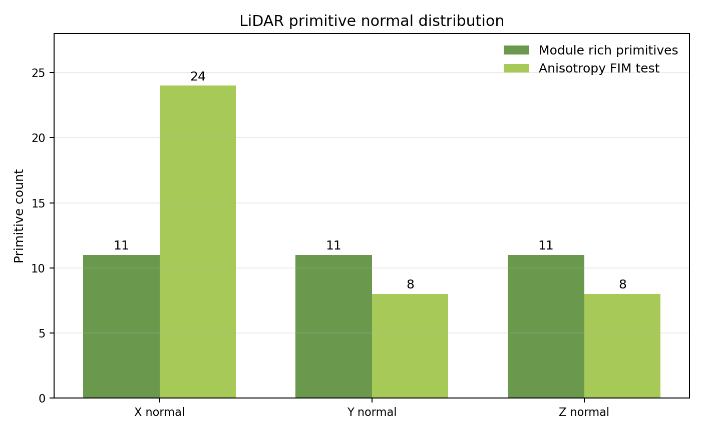

### 8.3 参数对齐

| 参数 | 值 | 说明 |
| --- | ---: | --- |
| `fim_radius_m` | `10.0` | 查询点周围 10 m 内 primitives 参与 FIM。 |
| `fim_min_voxels` | `6` | 至少 6 个 voxel/primitive 支持。 |
| `fim_range_sigma_base` | `1.0` | LiDAR range noise base。 |
| `fim_condition_max` | `1.0e8` | FIM condition 上限。 |
| `enable_legacy_observability` | `false` | 测试 advisory FIM 本身，不让 legacy observability 掩盖 FIM failure。 |

### 8.4 检查项

模块级检查：

- `result.valid == true`
- `result.available == true`
- `result.fim_valid == true`
- `lambda_lidar` 为 3x3 且 finite
- `lambda_trace > 0.0`
- `n_primitives > 0`

Normal anisotropy 检查：

- X normal primitives 数量更多时，`lambda(0,0)` 大于 `lambda(1,1)` 和 `lambda(2,2)`
- `n_valid_normals == primitives.size()`

### 8.5 本次执行结果

相关用例均通过：

```text
PredictorModuleTest.LidarRichPrimitivesProducesValidFim RUN COMPLETED
LidarObservabilityFimTest.RichCloudProducesValidInformation RUN COMPLETED
LidarObservabilityFimTest.AdvisoryFimReflectsNormalAnisotropy RUN COMPLETED
```

### 8.6 实验结论

Feature-rich LiDAR primitives 可以产生有效 position-only LiDAR FIM。Normal anisotropy 实验进一步说明 FIM 不只是非零矩阵，而是会反映 geometry normal distribution 对不同方向定位约束强弱的影响。

## 9. LiDAR 实验二：退化、稀疏和 missing input diagnostics

对应 C++ 测试：

```text
LidarObservabilityFimTest.TooFewPointsFallbackIsExplicit
LidarObservabilityFimTest.DegenerateGeometryLowersAlpha
LidarObservabilityFimTest.PoorCurrentTdopAndExclusionsDownweightAlpha
LidarObservabilityFimTest.MissingCloudFallbackIsFinite
LidarObservabilityFimTest.InvalidParamsFallbackIsFinite
PredictorModuleTest.LidarMissingPrimitivesIsExplicitFallback
LidarObservabilityFimTest.AdvisoryFimRequiresNormals
LidarObservabilityFimTest.EmptyPrimitiveGenerationReportsMissingNormals
```

测试文件：

```text
src/iap/test/test_lidar_observability_fim.cpp
src/iap/test/test_predictor_module.cpp
```

### 9.1 测试目的

该实验验证 LiDAR predictor 遇到不可观测或输入缺失时，输出明确 diagnostics，而不是返回伪有效 FIM。重点覆盖：

- 点数过少
- 线状退化几何
- 当前 LiDAR TDOP 差或 trunk exclusion 过多导致 observability 权重下降
- 缺失 LiDAR map
- 参数非法
- 缺失 normals/primitives

### 9.2 固定输入

| 场景 | 输入构造 | 预期 reason 或趋势 |
| --- | --- | --- |
| Too few points | 只有 `(1,0,0)` 和 `(0,1,0)` 两个点 | `too_few_points` |
| Degenerate line | `i=-30..30` 的 X 轴线状点，跳过原点，共 60 点 | `degenerate_geometry` |
| Poor current | rich cloud + `tdop=15.0` + 2 个 excluded trunks | `lidar_alpha` 低于 nominal |
| Missing cloud | `map_points == nullptr` | `missing_lidar_map` |
| Invalid params | `search_radius_m=0.0` | `invalid_lidar_params` |
| Missing primitives | 未设置 LiDAR FIM primitives | `missing_lidar_normals` |
| Empty primitive generation | 输入点集为空 | `missing_lidar_normals` |

上述 fallback diagnostics 覆盖关系如下。图中数量表示本报告中对应 reason 被 GTest 直接覆盖的检查点数量：

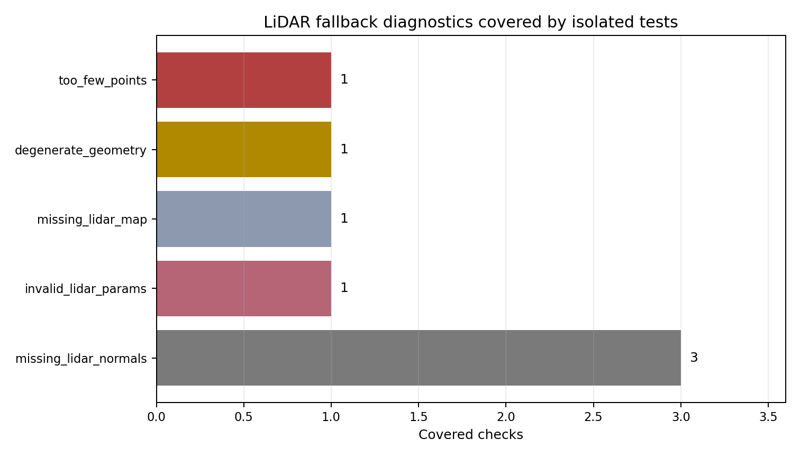

### 9.3 参数对齐

`make_estimator()` 使用固定参数：

| 参数 | 值 |
| --- | ---: |
| `search_radius_m` | `8.0` |
| `min_points` | `12` |
| `good_points` | `60` |
| `sigma_lidar_m` | `0.5` |
| `condition_ref` | `20.0` |
| `condition_max` | `1.0e8` |
| `tdop_ref` | `2.0` |
| `tdop_max` | `20.0` |

### 9.4 检查项

本实验检查：

- fallback 场景 `valid == false`
- fallback reason 与输入原因一致
- `lidar_alpha == 0.0` 或低于 nominal
- `tdop_proxy` 和 `condition` 保持 finite
- 缺失 normals 时 `lambda.trace() == 0.0`
- `enable_legacy_observability=false` 时 missing primitives 不会被 legacy 路径掩盖

### 9.5 本次执行结果

相关用例均通过：

```text
LidarObservabilityFimTest.TooFewPointsFallbackIsExplicit RUN COMPLETED
LidarObservabilityFimTest.DegenerateGeometryLowersAlpha RUN COMPLETED
LidarObservabilityFimTest.PoorCurrentTdopAndExclusionsDownweightAlpha RUN COMPLETED
LidarObservabilityFimTest.MissingCloudFallbackIsFinite RUN COMPLETED
LidarObservabilityFimTest.InvalidParamsFallbackIsFinite RUN COMPLETED
PredictorModuleTest.LidarMissingPrimitivesIsExplicitFallback RUN COMPLETED
LidarObservabilityFimTest.AdvisoryFimRequiresNormals RUN COMPLETED
LidarObservabilityFimTest.EmptyPrimitiveGenerationReportsMissingNormals RUN COMPLETED
```

### 9.6 实验结论

LiDAR predictor 对稀疏、退化和缺失输入均能输出明确 fallback diagnostics，并保持数值字段 finite。该实验确认 LiDAR advisory FIM 的 failure mode 是可解释的，不会在输入无效时产生看似正常的 FIM 或 PL。

### 9.7 补充实验 D：Corridor / one-sided LiDAR degeneracy

对应 C++ 测试：

```text
LidarObservabilityFimTest.CorridorGeometryWeakensAlongCorridorInformation
```

保存数据：

```text
lidar_corridor_degeneracy.csv
```

该实验直接构造三类 LiDAR FIM primitives：

| Case | 几何构造 | 目的 |
| --- | --- | --- |
| `rich` | X/Y/Z 三轴 normals 均衡分布 | 作为 feature-rich baseline。 |
| `corridor` | 左右两面墙，normal 主要沿 `±Y`，走廊轴为 X | 模拟前后方向欠约束。 |
| `one_sided` | 只有单侧墙面 normal | 模拟单侧约束。 |

导出字段包括：

```text
case_id,n_primitives,lambda_xx,lambda_yy,lambda_zz,
min_eig,mid_eig,max_eig,condition,tdop,normal_diversity_score,
along_corridor_sigma,degeneracy_score,allowed_for_fusion,fallback_reason
```

Top-down geometry：

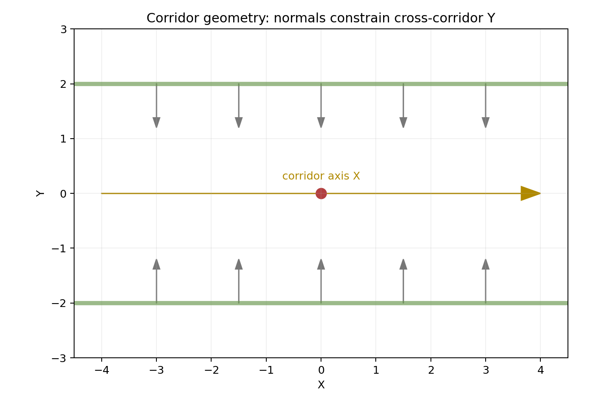

Eigenvalue 对比：

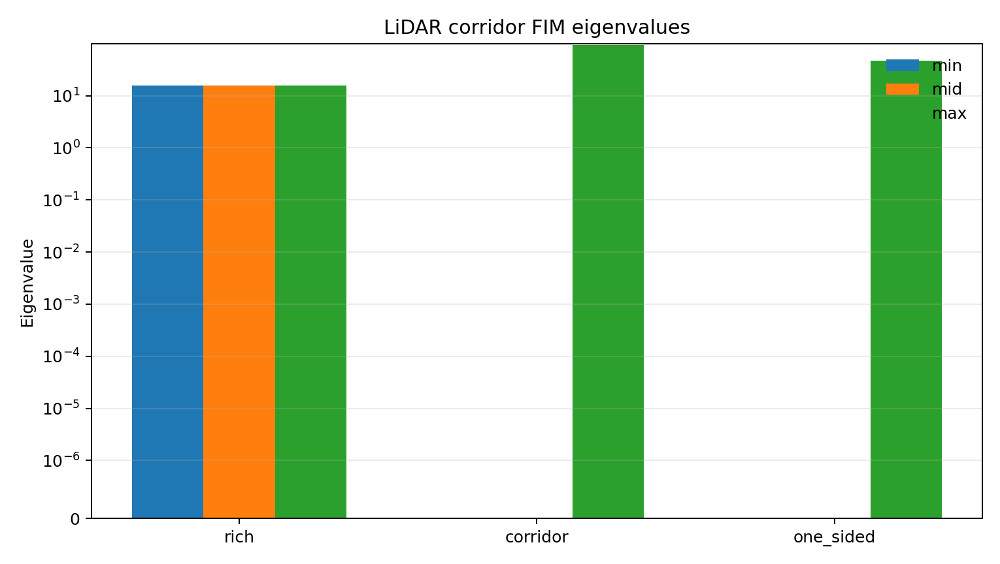

Axis information 对比：

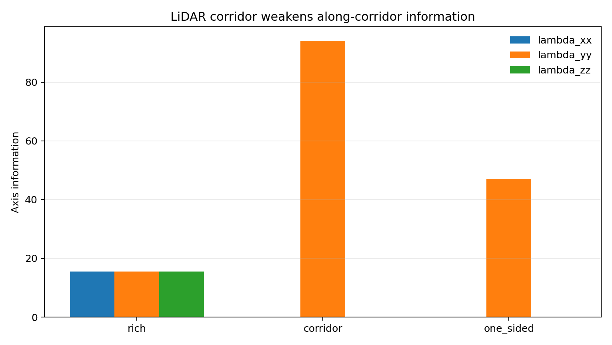

实验结论：Corridor 和 one-sided geometry 的 `lambda_xx` 接近 0，condition 达到退化量级，沿走廊方向 sigma 明显大于横向 sigma。该实验直接覆盖了“走廊方向前后欠约束但 LiDAR PL 可能被误判为好”的 isolated 风险。

## 10. LiDAR 实验三：Primitive generation 参数边界

对应 C++ 测试：

```text
LidarObservabilityFimTest.PcaRadiusChangesPrimitiveCount
LidarObservabilityFimTest.PcaMinSupportBoundaryIsInclusive
LidarObservabilityFimTest.VoxelSamplingReducesDenseClusterDuplicates
LidarObservabilityFimTest.CloudProvidedNormalsAreUsedBeforePca
```

测试文件：

```text
src/iap/test/test_lidar_observability_fim.cpp
```

### 10.1 测试目的

该实验验证 LiDAR FIM primitive generation 的关键参数确实影响 primitive 输出，并检查边界条件：

- PCA radius 增大时 primitive count 增加
- `pca_min_support` 边界是 inclusive
- voxel sampling 能减少 dense cluster duplicate primitives
- 当 cloud normals 可用且配置优先使用时，不需要 PCA fallback

### 10.2 固定输入

PCA radius 实验使用平面网格：

| 参数 | 值 |
| --- | ---: |
| `half_width` | `3` |
| `spacing` | `0.4` |
| 点数 | `49` |
| small radius | `0.45` |
| large radius | `0.75` |

Min-support 边界实验输入 6 个平面点：

```text
(-1,-1,0), (-1,1,0), (1,-1,0), (1,1,0), (0,0,0), (0.4,-0.2,0)
```

Voxel sampling 实验输入：

- dense plane grid：`half_width=6`，`spacing=0.02`
- sparse plane grid：`half_width=1`，`spacing=0.2`，offset `(2,0,0)`
- 对比 `pca_voxel_sample_m=0.0` 和 `0.5`

Cloud normals 实验输入 5 个点，并为每个点提供 `UnitX()` normal。

Primitive generation 参数边界实验的输入和判据概览如下：

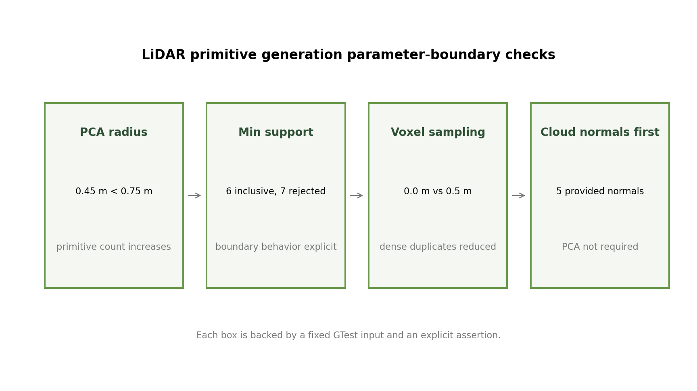

补充导出数据：

```text
lidar_primitive_generation_parameters.csv
```

参数曲线如下：

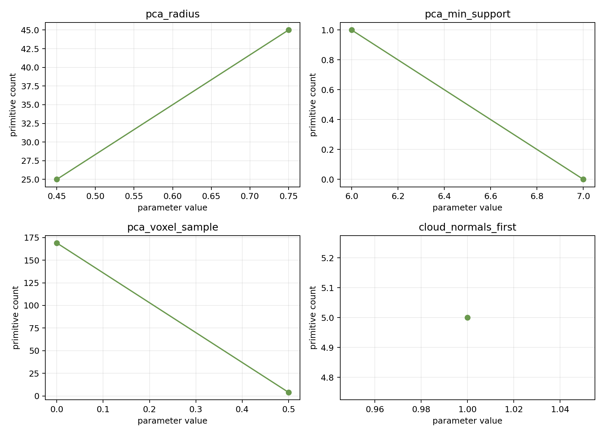

### 10.3 参数对齐

| 测试 | 关键参数 | 判据 |
| --- | --- | --- |
| PCA radius | `pca_radius_m=0.45` vs `0.75` | large radius primitive count 更大 |
| Min support | `pca_min_support=6` vs `7` | 6 支持点可生成，7 不可生成 |
| Voxel sampling | `pca_voxel_sample_m=0.5` | dense cluster duplicate 降低 |
| Cloud normals first | `use_cloud_normals_first=true` | 输出 primitive 数等于输入点数 |

### 10.4 检查项

本实验检查：

- `small->size() < large->size()`
- `pca_min_support=6` 时输出 1 个 primitive
- `pca_min_support=7` 时输出为空并报告 `missing_lidar_normals`
- voxel sampling 后 dense center 附近 primitive 数从大于 20 降到不超过 4
- cloud-provided normals 路径中 `support_count == 1`，normal 与 `UnitX()` 对齐

### 10.5 本次执行结果

相关用例均通过：

```text
LidarObservabilityFimTest.PcaRadiusChangesPrimitiveCount RUN COMPLETED
LidarObservabilityFimTest.PcaMinSupportBoundaryIsInclusive RUN COMPLETED
LidarObservabilityFimTest.VoxelSamplingReducesDenseClusterDuplicates RUN COMPLETED
LidarObservabilityFimTest.CloudProvidedNormalsAreUsedBeforePca RUN COMPLETED
```

### 10.6 实验结论

Primitive generation 对 PCA radius、support threshold、voxel sampling 和 cloud normals 参数均有可观测响应。该实验保证 LiDAR advisory FIM 的输入 primitives 不是黑盒常量，而是由几何和参数稳定控制。

## 11. Fusion 实验一：GNSS-only advisory 与 missing prior

对应 C++ 测试：

```text
PredictorModuleTest.FusionGnssOnlyProducesFiniteAdvisoryPl
```

测试文件：

```text
src/iap/test/test_predictor_module.cpp
```

### 11.1 测试目的

该实验验证 fusion predictor 在没有 LiDAR source、没有 valid prior 的情况下，仍可使用有效 GNSS advisory 形成可用 fused output。该行为很重要，因为 predictor advisory 不应把缺失 prior 当作阻断 GNSS 输出的硬失败。

### 11.2 固定输入

| 输入 | 值 |
| --- | --- |
| GNSS | open-sky 8 星，valid |
| LiDAR | 默认空 `LidarAdvisoryResult` |
| Prior | `has_lambda_base=false` |
| Fusion params | `fim_epsilon=1e-6`，`K_H_adv=5.0`，`K_V_adv=5.0` |

### 11.3 检查项

- `result.valid == true`
- `result.available == true`
- `result.fallback == false`
- `result.gnss_used == true`
- `result.lidar_used == false`
- `result.prior_valid == false`
- `fallback_reason` 包含 `missing_prior`
- `hpl/vpl` finite

### 11.4 本次执行结果

用例通过：

```text
PredictorModuleTest.FusionGnssOnlyProducesFiniteAdvisoryPl RUN COMPLETED
```

### 11.5 实验结论

Fusion predictor 可以在 missing prior 条件下保留 GNSS-only advisory 输出，并通过 fallback reason chain 记录 prior 缺失。这说明 missing prior 是 explainability diagnostic，而不是强制 invalid 的条件。

### 11.6 补充实验 C：Current/advisory separation guard

对应 C++ 测试：

```text
PredictorModuleTest.CurrentIntegrityDoesNotOverrideAdvisoryPrediction
```

保存数据：

```text
current_advisory_separation.csv
```

该实验固定同一组 GNSS epoch，只改变 snapshot 中的 current certified monitor fields：

| Case | `current_hpl` | `current_vpl` | `current.valid` |
| --- | ---: | ---: | --- |
| `current_tiny` | 0.1 | 0.1 | true |
| `current_huge` | 1000 | 1000 | true |
| `current_invalid` | 500 | 600 | false |

检查项：

- GNSS advisory HPL/VPL 在三组输入中保持一致。
- selected/fused advisory HPL/VPL 在三组输入中保持一致。
- `copied_current_flag == 0`。
- fallback reason 不来自 current HPL/VPL。

结果图：

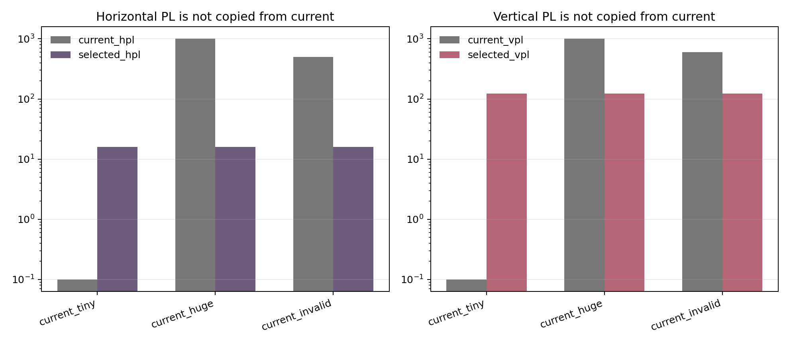

实验结论：Predictor 没有把 `/iap/integrity` current monitor 的 HPL/VPL 直接复制为 advisory 输出。Current fields 只作为 snapshot diagnostic/current-state context，不覆盖 independent advisory prediction。

## 12. Fusion 实验二：GNSS + LiDAR FIM additive fusion

对应 C++ 测试：

```text
PredictorModuleTest.ModuleFusesGnssAndLidarWithoutGridFields
```

测试文件：

```text
src/iap/test/test_predictor_module.cpp
```

### 12.1 测试目的

该实验验证完整 `PredictorModule::query()` 在同时存在 GNSS、LiDAR 和 prior 时，输出 fused advisory，并满足 FIM additive fusion 公式：

```text
lambda_pred = lambda_prior + lambda_gnss + lambda_lidar
```

同时检查 query metadata、source flags 和 fused protection level 的可解释性。

Fusion additive FIM 的信息流如下。当前 artifacts 未保存 `lambda_*` 数值矩阵，因此图中展示的是测试验证的矩阵关系；具体等式由 `isApprox(..., 1e-9)` 断言保证。

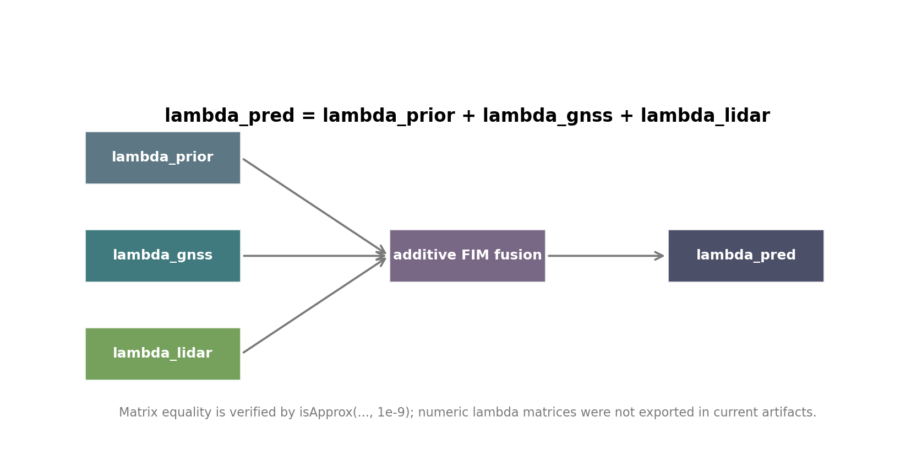

### 12.2 固定输入

| 字段 | 值 |
| --- | --- |
| Query position | `(1.0, 2.0, 3.0)` |
| Query time | `123.5` |
| Horizon | `2.5` |
| Frame | `map` |
| GNSS epoch | open-sky 8 星 |
| LiDAR primitives | X/Y/Z 三轴 normals，共 33 个 |
| Prior lambda | `0.25 * I_3` |

### 12.3 参数对齐

Fusion 参数：

| 参数 | 值 |
| --- | ---: |
| `fim_epsilon` | `1.0e-6` |
| `K_H_adv` | `5.0` |
| `K_V_adv` | `5.0` |

### 12.4 检查项

本实验检查：

- Query metadata 原样返回：position、time、horizon、frame
- `gnss.valid == true`
- `lidar.valid == true`
- `fused.valid == true`
- `fused.gnss_used == true`
- `fused.lidar_used == true`
- `fused.prior_valid == true`
- `lambda_pred` 与三项相加结果在 `1e-9` 容差内一致
- `fused.hpl/vpl` finite
- source flags 包含 valid、available、GNSS/LiDAR/Fusion valid、prior valid、GNSS/LiDAR used、regularized

### 12.5 本次执行结果

用例通过：

```text
PredictorModuleTest.ModuleFusesGnssAndLidarWithoutGridFields RUN COMPLETED
```

### 12.6 实验结论

`PredictorModule::query()` 在 GNSS、LiDAR 和 prior 均可用时，满足 additive FIM fusion 公式，并能通过 source flags 解释最终 fused advisory 来自哪些 source。该实验说明 fusion 输出不是简单选源，而是对 common 3D position state 的信息矩阵叠加。

### 12.7 补充实验 F：Fusion lambda matrix artifact export

对应 C++ 测试：

```text
PredictorModuleTest.ModuleFusesGnssAndLidarWithoutGridFields
```

保存数据：

```text
fusion_lambda_matrices.json
```

该 artifact 导出 fusion 测试中的完整 3x3 information matrices：

```text
lambda_prior
lambda_gnss
lambda_lidar
lambda_pred
lambda_sum = lambda_prior + lambda_gnss + lambda_lidar
lambda_error = lambda_pred - lambda_sum
lambda_error_norm
eig_prior/eig_gnss/eig_lidar/eig_pred
```

检查项仍由 C++ GTest 完成：

```text
result.fused.lambda_pred.isApprox(expected_lambda, 1.0e-9)
```

数值 heatmap：

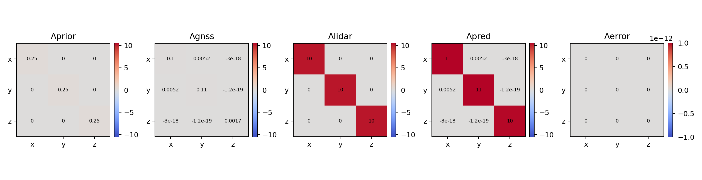

Eigenvalue 对比：

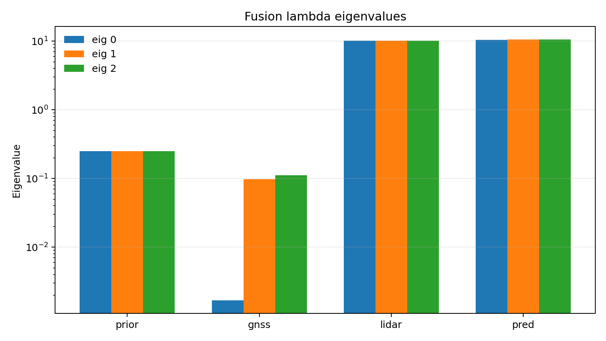

实验结论：`lambda_error_norm` 为 0，说明导出的 `lambda_pred` 与三项相加结果完全对齐。Heatmap 和 eigenvalue 图比 schematic 更直观地展示了 prior、GNSS、LiDAR 对 fused information 的贡献。

## 13. Fusion 实验三：Invalid prior 与 no-source negative

对应 C++ 测试：

```text
PredictorModuleTest.FusionRejectsIndefinitePriorButKeepsGnssOnly
PredictorModuleTest.ModuleNoGnssNoLidarIsUnavailableWithNanPl
```

测试文件：

```text
src/iap/test/test_predictor_module.cpp
```

### 13.1 测试目的

该实验验证 fusion predictor 对两类负面场景的处理：

- Prior 矩阵 indefinite：必须拒绝 prior，但不应阻断有效 GNSS advisory。
- 无 GNSS、无 LiDAR source：必须返回 unavailable，并给出 combined fallback reason。

### 13.2 固定输入

Invalid prior 场景：

| 字段 | 值 |
| --- | --- |
| GNSS | open-sky 8 星，valid |
| LiDAR | 空 |
| Prior | `I_3`，但 `lambda_base_pos(0,0) = -1.0` |

No-source 场景：

| 字段 | 值 |
| --- | --- |
| GNSS epoch | missing |
| LiDAR primitives | missing |
| Prior | valid `0.25 * I_3` |
| Query position | `(0,0,0)` |

### 13.3 检查项

Invalid prior 检查：

- `result.valid == true`
- `result.available == true`
- `result.gnss_used == true`
- `result.lidar_used == false`
- `result.prior_valid == false`
- `lambda_prior` 被置零
- fallback reason 包含 `invalid_prior_position_information`
- `lambda_pred == lambda_gnss`

No-source negative 检查：

- `result.valid == false`
- `result.available == false`
- `result.fallback == true`
- fallback reason 包含 `gnss:no_gnss_epoch`
- `gnss.available == false`
- `lidar.available == false`
- `fused.available == false`
- fused HPL/VPL/PL 为 NaN，而不是伪 finite PL
- source flags 不包含 available，但包含 fallback

### 13.4 本次执行结果

两个用例均通过：

```text
PredictorModuleTest.FusionRejectsIndefinitePriorButKeepsGnssOnly RUN COMPLETED
PredictorModuleTest.ModuleNoGnssNoLidarIsUnavailableWithNanPl RUN COMPLETED
```

### 13.5 实验结论

Fusion predictor 能识别并拒绝 indefinite prior，同时保留有效 GNSS advisory；当无任何 advisory source 可用时，fusion 结果明确 unavailable，并返回 combined fallback reason。该行为避免了错误 prior 或无源场景下产生伪有效 fused PL。

### 13.6 补充实验 E：Fusion conservative gate

对应 C++ 测试：

```text
PredictorModuleTest.DegenerateLidarDoesNotReduceSelectedPl
```

保存数据：

```text
fusion_gate_safety.csv
```

当前代码没有 `GNSS_ONLY/FIM_ADD_DEBUG/CONSERVATIVE_MAX` 三个独立枚举，本实验按现有接口映射为：

| 报告字段 | 当前实现含义 |
| --- | --- |
| `gnss_hpl/vpl` | GNSS-only reference，来自 GNSS advisory result。 |
| `fused_hpl/vpl` | default FIM-add raw fused output。 |
| `selected_hpl/vpl` | `conservative_max_with_gnss=true` 后的 selected output。 |

测试 case：

| Case | LiDAR 输入 | 预期 |
| --- | --- | --- |
| `rich_lidar` | X/Y/Z 三轴 feature-rich primitives | LiDAR 可用于 fusion，raw fused PL 可降低，但 selected PL 不低于 GNSS reference。 |
| `degenerate_lidar` | 单方向 normals 的退化 LiDAR FIM | LiDAR 不应被当作有效安全降低来源。 |
| `missing_lidar` | 缺失 LiDAR source | selected output 回到 GNSS reference 或显式 reason。 |

结果图：

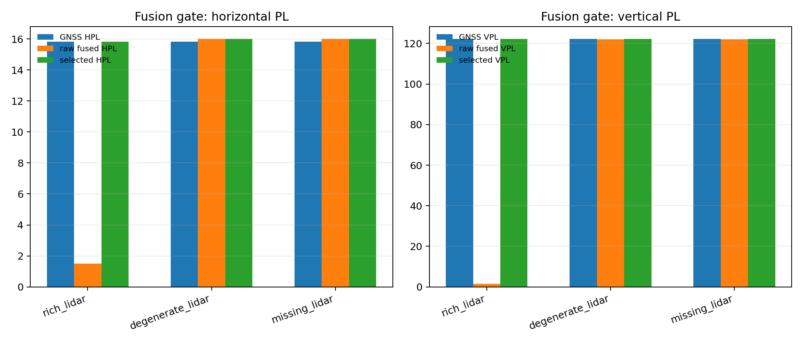

实验结论：Raw FIM-add 在 rich LiDAR 下可以显著降低 PL；打开 `conservative_max_with_gnss` 后，selected HPL/VPL 不低于 GNSS reference。退化和缺失 LiDAR case 不会通过 selected output 产生低于 GNSS 的 protection level。

## 14. Fusion 实验四：Query guard 前置保护

对应 C++ 测试：

```text
PredictorModuleTest.InvalidPositionKeepsQueryMetadataAndFallsBack
PredictorModuleTest.InvalidQueryTimeFallsBackBeforePrediction
PredictorModuleTest.InvalidHorizonFallsBackBeforePrediction
PredictorModuleTest.UnsupportedFrameFallsBackBeforePrediction
```

测试文件：

```text
src/iap/test/test_predictor_module.cpp
```

### 14.1 测试目的

该实验验证 `PredictorModule::query()` 在进入 GNSS/LiDAR/Fusion 计算前，会先检查 query input 的基本有效性。非法 query 不应触发后续 predictor 计算，也不应产生部分有效的 source flags。

### 14.2 固定输入

| 场景 | 输入 | 预期 fallback reason |
| --- | --- | --- |
| Invalid position | `query_position_map.x = NaN` | `invalid_position` |
| Invalid query time | `query_time_s = NaN` | `invalid_query_time` |
| Invalid horizon | `horizon_s = -0.1` | `invalid_horizon` |
| Unsupported frame | `frame_id = "world"` | `unsupported_query_frame` |

### 14.3 检查项

所有 guard 场景均检查：

- `valid == false`
- `available == false`
- `fallback == true`
- fallback reason 与输入错误一致
- GNSS/LiDAR/Fusion 子结果不被标记为 valid
- source flags 不包含 GNSS/LiDAR/Fusion valid

Invalid position 场景额外检查 query metadata 仍被保留，便于调试调用方输入错误。

### 14.4 本次执行结果

相关用例均通过：

```text
PredictorModuleTest.InvalidPositionKeepsQueryMetadataAndFallsBack RUN COMPLETED
PredictorModuleTest.InvalidQueryTimeFallsBackBeforePrediction RUN COMPLETED
PredictorModuleTest.InvalidHorizonFallsBackBeforePrediction RUN COMPLETED
PredictorModuleTest.UnsupportedFrameFallsBackBeforePrediction RUN COMPLETED
```

### 14.5 实验结论

PredictorModule 对非法 query input 有明确前置保护，不会让非法位置、时间、horizon 或 frame 进入 advisory 计算链路。该实验保证调用方输入错误会被清晰暴露，而不是污染 GNSS/LiDAR/Fusion 结果。

## 15. System 实验一：Predictor GNSS open-sky only

对应 system experiment preset：

```text
predictor_gnss_open_sky_only
```

保存数据：

```text
src/iap/results/predictor_validation/predictor_system_predictor_gnss_open_sky_only_run1/
```

### 15.1 测试目的

该实验验证 predictor 模块在 system launch 环境下，可以基于实时 `/iap/integrity`、odom、GNSS epoch 和地图输入完成 GNSS-only advisory query，并按 IAP log 目录规则保存实验证据。

本实验重点不是 planner success，而是验证：

- predictor probe 能被 `/iap/integrity` epoch 在线触发。
- `predictor_output_mode=gnss_only` 时 selected source 稳定为 GNSS。
- open-sky 条件下 GNSS advisory result 持续 valid。
- 固定 query set 产生空间邻域内 6 个 query 点。
- 保存的 CSV、JSON、profiling 和 figures 可用于离线复核。
- advisory output 不是简单复制 current `/iap/integrity` monitor output。

### 15.2 运行配置

本次 run 使用如下 launch 配置：

| 配置项 | 值 |
| --- | --- |
| `experiment` | `predictor_gnss_open_sky_only` |
| `araim_experiment` | `gnss_open_sky` |
| `predictor_output_mode` | `gnss_only` |
| `probe_query_set` | `e1_fixed_neighborhood` |
| `predictor_enable_debug_log` | `true` |
| `validator_require_debug_logs` | `true` |
| `start_planner` | `false`，由 predictor launch include ARAIM launch 时设置 |
| `record_bag` | `false` |

固定 query set 每个 `/iap/integrity` epoch 查询 6 个位置：

| Query label | Offset `(x,y,z)` m |
| --- | --- |
| `p0` | `(0, 0, 0)` |
| `p_forward` | `(5, 0, 0)` |
| `p_back` | `(-5, 0, 0)` |
| `p_left` | `(0, 5, 0)` |
| `p_right` | `(0, -5, 0)` |
| `p_up` | `(0, 0, 2)` |

### 15.3 检查项

实验 1 analyzer 使用以下阈值作为通过标准：

| 检查项 | 阈值 | 本次结果 |
| --- | ---: | ---: |
| GNSS selected source ratio | `> 95%` | `100%` |
| GNSS valid ratio | `> 95%` | `100%` |
| selected fallback ratio | `< 5%` | `0%` |
| `module_total_us` p95 | `< 2000 us` | `34.21 us` |
| valid rows NaN/Inf | 不允许 | `0` |
| current/advisory copy ratio | `< 5%` | `0%` |

### 15.4 本次执行结果

Analyzer 汇总结果：

```text
passed: true
query_count: 2748
selected_source_GNSS_ratio: 1.0
gnss_valid_ratio: 1.0
fallback_ratio: 0.0
module_total_us p50/p95/max: 26.31 / 34.21 / 56.55 us
copied_current_flag_ratio: 0.0
```

Query 分布：

| Query label | Rows |
| --- | ---: |
| `p0` | 458 |
| `p_forward` | 458 |
| `p_back` | 458 |
| `p_left` | 458 |
| `p_right` | 458 |
| `p_up` | 458 |

总计 `2748 = 458 * 6` 条 predictor query。CSV 时间跨度约 `76.17 s`，按 6 个 query/epoch 估算 `/iap/integrity` 触发频率约 `6.01 Hz`。

GNSS open-sky geometry 结果：

| 指标 | 本次范围或均值 |
| --- | ---: |
| `gnss_n_visible` | `41` |
| `gnss_n_used` | `41` |
| `gnss_pdop` | `4.6597 - 4.6639`，均值 `4.6618` |
| `selected_hpl` | `10.7246 - 10.7570 m`，均值 `10.7407 m` |
| `selected_vpl` | `25.1454 - 25.1517 m`，均值 `25.1489 m` |
| `module_total_us` | `20.43 - 56.55 us`，均值 `26.95 us` |

需要说明的是，本次 run 目录中未保存 `export/test_predictor_validation_summary.json`，因此本节结论以 `predictor_e1_analysis_summary.json` 和 `test_predictor_query_probe_summary.json` 为依据。后续正式归档 run 应保留 validator summary，便于和 system validator 输出一同留证。

### 15.5 结果图

Selected PL timeline：


该图展示 6 个 query 点的 selected HPL/VPL 随时间变化。open-sky 条件下曲线应保持连续、有限且无 fallback 断点；本次结果中 HPL 约 `10.74 m`、VPL 约 `25.15 m`，说明 GNSS-only selected output 在整个 run 中稳定可用。

GNSS geometry timeline：


该图用于检查 GNSS 几何质量和可用卫星数。`visible/used` 卫星数保持 41，PDOP 约 4.66，说明 open-sky preset 下 visibility 和 geometry 构造稳定，没有出现卫星数突降或 geometry 退化。

Current vs advisory：


该图对比 current `/iap/integrity` monitor 输出和 predictor advisory 输出。实验 1 要求 advisory 是基于 query 位置重新计算的预测结果，而不是直接复制 current PL。本次 analyzer 给出的 `copied_current_flag_ratio=0.0`，该图用于直观复核 current 与 advisory 曲线的分离关系。

Latency distribution：


该图展示 predictor query latency 分布。`module_total_us` p95 为 `34.21 us`，远低于实验阈值 `2000 us`，说明本次 GNSS-only advisory query 在 system probe 中具备在线运行裕量。该结论是普通 ROS 2 在线执行结果，不代表硬实时保证。

Query spatial map：


该图展示 6 个固定 query offset 在轨迹附近的空间分布，用于确认实验 1 覆盖的是当前位姿邻域，而不是单点 current pose。`p_forward/p_back/p_left/p_right/p_up` 均围绕 odom 当前位姿生成，符合 `e1_fixed_neighborhood` 设计。

### 15.6 实验结论

本次 Predictor system experiment 1 通过。`predictor_gnss_open_sky_only` 在 system launch 环境下成功产生 2748 条 GNSS-only advisory query，selected source 全部为 GNSS，GNSS valid ratio 为 100%，fallback ratio 为 0%，并生成符合 IAP `export/profiling/metadata/figures` 目录规则的 CSV、JSON 和 PNG 证据。

该结果说明：在 open-sky GNSS 条件下，predictor 模块可以由 `/iap/integrity` 在线触发，在固定空间邻域内输出稳定、有限、可复核的 GNSS advisory protection level。实验同时确认 planner/grid disabled 条件下 predictor probe 可以独立完成 system-level evidence collection。

## 16. System 实验二：Predictor LiDAR feature-rich only

对应 system experiment preset：

```text
predictor_lidar_feature_rich_only
```

保存数据：

```text
src/iap/results/predictor_validation/predictor_system_predictor_lidar_feature_rich_only_bag/
```

### 16.1 测试目的

该实验验证 predictor 模块在 system launch 环境下，可以在 feature-rich LiDAR 地图中输出有效的 LiDAR-only advisory result，并保存可解释的 LiDAR FIM、primitive、fallback reason、latency 和地图快照证据。

本实验只证明 LiDAR diagnostic 和 LiDAR-only query 可用，不证明 LiDAR fusion safety，也不证明 planner 成功避障。

### 16.2 运行配置

本次 run 使用如下 launch 配置：

| 配置项 | 值 |
| --- | --- |
| `experiment` | `predictor_lidar_feature_rich_only` |
| `araim_experiment` | `lidar_feature_rich` |
| `predictor_output_mode` | `lidar_only` |
| `validator_required_selected_source` | `LIDAR` |
| `predictor_enable_debug_log` | `true` |
| `validator_require_debug_logs` | `true` |
| `record_bag` | `true` |
| `start_planner` | `false`，由 predictor launch include ARAIM launch 时设置 |

本实验使用 `current_pose` query set，即每个 `/iap/integrity` epoch 对当前 odom 位姿执行一个 LiDAR-only predictor query。

运行指令：
```
RUN_ROOT=/home/dev/ws_iap/src/iap/results/predictor_validation/predictor_system_predictor_lidar_feature_rich_only_bag

ros2 launch iap test_predictor.launch.py   experiment:=predictor_lidar_feature_rich_only   start_rviz:=true   predictor_enable_debug_log:=true   validator_require_debug_logs:=true   run_duration_s:=90   validation_duration_s:=85   predictor_export_dir:=$RUN_ROOT/export

python3 src/iap/scripts/dev_predictor/analyze_predictor_system_e2.py   --run-dir $RUN_ROOT   --fail-on-threshold
```

### 16.3 检查项

实验 2 analyzer 使用以下阈值作为通过标准：

| 检查项 | 阈值 | 本次结果 |
| --- | ---: | ---: |
| LIDAR selected source ratio | `> 80%` | `100%` |
| LiDAR valid ratio | `> 80%` | `100%` |
| LiDAR FIM valid ratio | 报告项 | `100%` |
| selected fallback ratio | 越低越好 | `0%` |
| median `lidar_n_primitives` | `>= 6` | `276` |
| median `lidar_lambda_condition` | `< 1e6` | `7.72` |
| `module_total_us` p95 | `< 10000 us` | `20.46 us` |
| valid rows NaN/Inf | 不允许 | `0` |

Validator summary 同样通过，并确认 required debug files 均存在，包括 `predictor_lidar_debug.csv`、`predictor_lidar_primitives_debug.csv`、`fallback_reason_by_time.csv`、`downsampled_map.csv`、`latency_debug.csv` 和 metadata JSON。

### 16.4 本次执行结果

Analyzer 汇总结果：

```text
passed: true
query_count: 308
selected_source_LIDAR_ratio: 1.0
lidar_valid_ratio: 1.0
lidar_fim_valid_ratio: 1.0
fallback_ratio: 0.0
median_lidar_n_primitives: 276
median_lidar_n_valid_normals: 276
median_lidar_lambda_trace: 284.65
median_lidar_lambda_min_eig: 28.67
median_lidar_condition: 7.72
module_total_us p50/p95/max: 11.13 / 20.46 / 32.68 us
```

CSV 共记录 `308` 条 predictor query，时间跨度约 `87.83 s`，触发频率约 `3.51 Hz`。所有 selected source 均为 `LIDAR`，所有 LiDAR advisory query 均 valid，selected fallback count 为 0。

LiDAR-only advisory 数值范围：

| 指标 | 本次范围或中位数 |
| --- | ---: |
| `selected_hpl` | `0.8768 - 0.9161 m`，中位数 `0.8945 m` |
| `selected_vpl` | `0.3329 - 0.3371 m`，中位数 `0.3349 m` |
| `selected_pl` | `0.8768 - 0.9161 m`，中位数 `0.8945 m` |
| `lidar_n_primitives` | `267 - 278`，中位数 `276` |
| `lidar_n_valid_normals` | `267 - 278`，中位数 `276` |
| `lidar_lambda_trace` | `275.87 - 285.53`，中位数 `284.65` |
| `lidar_lambda_min_eig` | `26.09 - 28.85`，中位数 `28.67` |
| `lidar_lambda_condition` | `7.64 - 8.28`，中位数 `7.72` |

Fallback reason 中出现 `gnss:no_gnss_epoch` 和 `gnss:not_evaluated` 是符合预期的：该 experiment 明确关闭 GNSS integrity，并使用 `predictor_output_mode=lidar_only`，因此 GNSS 不参与 selected output。LiDAR selected output 没有 fallback。

### 16.5 结果图

Selected PL timeline：


图例说明：蓝色曲线表示 selected HPL，橙色曲线表示 selected VPL，深色曲线表示 selected scalar PL。该图用于确认 LiDAR-only selected output 在整个 run 中连续、有限且无 fallback 断点。本次 HPL 约 `0.89 m`，VPL 约 `0.335 m`，说明 feature-rich LiDAR geometry 下 selected PL 稳定。

LiDAR diagnostics timeline：


图例说明：第一行展示 LiDAR primitives 数量和 valid normals 数量；第二行展示 LiDAR information matrix trace；第三行以对数坐标展示 condition number。该图用于确认 feature-rich map 提供了足够 primitive 和稳定 FIM 诊断。本次 primitive 中位数为 `276`，condition 中位数为 `7.72`，远低于阈值 `1e6`。

LiDAR eigenvalues timeline：


图例说明：蓝色曲线为 LiDAR FIM 最小特征值，橙色曲线为由 `min_eig * condition` 估计的最大特征值，深色曲线为 FIM trace。该图用于观察 LiDAR FIM 是否持续正定且不过度病态。本次最小特征值中位数约 `28.67`，condition 约 `7.72`，说明三维信息约束稳定。

LiDAR primitives top-down：


图例说明：散点表示从 downsampled map 生成的 LiDAR FIM primitives 在 XY 平面的分布，颜色表示 primitive weight。该图用于确认实验不是空地图或单一结构输入，而是在 feature-rich 地图中生成了空间分布充分的 primitive 证据。

LiDAR normal distribution：


图例说明：三个直方图分别统计 primitive normal 的 `x/y/z` 分量分布。该图用于检查法向量是否覆盖多个方向；多方向 normal 分布是 LiDAR FIM 条件数较低、可观测性较好的直接原因之一。

### 16.6 实验结论

本次 Predictor system experiment 2 通过。`predictor_lidar_feature_rich_only` 在 feature-rich LiDAR runtime 环境下产生 308 条 LiDAR-only advisory query，selected source 全部为 `LIDAR`，LiDAR valid ratio 和 FIM valid ratio 均为 100%，fallback ratio 为 0%，并按 IAP `export/profiling/metadata/figures` 目录规则保存了 CSV、JSON、地图快照和 PNG 证据。

该结果说明：在 planner/grid disabled 条件下，predictor probe 可以由 `/iap/integrity` 在线触发，并基于 feature-rich LiDAR map 生成稳定、有限、可解释的 LiDAR-only advisory FIM 输出。实验结果满足 system test plan 中对 LiDAR diagnostic 和 LiDAR-only query availability 的要求。

## 17. System 实验三：Predictor fusion nominal

对应 system experiment preset：

```text
predictor_fusion_nominal
```

保存数据：

```text
src/iap/results/predictor_validation/predictor_system_predictor_fusion_nominal_run1/
```

### 17.1 测试目的

该实验验证 predictor 模块在 nominal GNSS、feature-rich LiDAR 和 current prior 均可用的 system launch 环境下，可以输出有效的 Fusion advisory result，并保存可复核的 Fusion FIM 诊断证据。

本实验重点不是 planner success 或避障效果，而是验证：

- `predictor_output_mode=fusion` 时 selected source 稳定为 `FUSION`。
- GNSS、LiDAR 和 fused advisory result 在同一批 query 中同时 valid。
- Fusion FIM 满足加法一致性：`lambda_pred = lambda_prior + lambda_gnss + lambda_lidar`。
- Fusion debug、GNSS visibility、LiDAR debug、fallback reason、latency 和 metadata 均按 IAP log 目录规则保存。
- 在 planner/grid disabled 条件下，predictor probe 仍可由 `/iap/integrity` 在线触发并完成 system-level evidence collection。

### 17.2 运行配置

本次 run 使用如下 launch 配置：

| 配置项 | 值 |
| --- | --- |
| `experiment` | `predictor_fusion_nominal` |
| `araim_experiment` | `fused_nominal` |
| `predictor_output_mode` | `fusion` |
| `validator_required_selected_source` | `FUSION` |
| `predictor_enable_debug_log` | `true` |
| `validator_require_debug_logs` | `true` |
| `record_bag` | `false` |
| `start_planner` | `false`，由 predictor launch include ARAIM launch 时设置 |

本实验使用 `current_pose` query set，即每个 `/iap/integrity` epoch 对当前 odom 位姿执行一个 fusion predictor query。实验 3 的目标是 nominal fusion advisory 和 FIM 加法一致性，因此不要求无人机水平运动一段距离。

运行指令：

```bash
RUN_ROOT=/home/dev/ws_iap/src/iap/results/predictor_validation/predictor_system_predictor_fusion_nominal_run1

ros2 launch iap test_predictor.launch.py \
  experiment:=predictor_fusion_nominal \
  start_rviz:=false \
  record_bag:=false \
  predictor_enable_debug_log:=true \
  validator_require_debug_logs:=true \
  run_duration_s:=90 \
  validation_duration_s:=85 \
  predictor_export_dir:=$RUN_ROOT/export

python3 src/iap/scripts/dev_predictor/analyze_predictor_system_e3.py \
  --run-dir $RUN_ROOT \
  --fail-on-threshold
```

### 17.3 检查项

实验 3 analyzer 使用以下阈值作为通过标准：

| 检查项 | 阈值 | 本次结果 |
| --- | ---: | ---: |
| FUSION selected source ratio | `> 80%` | `100%` |
| GNSS valid ratio | `> 80%` | `100%` |
| LiDAR valid ratio | `> 80%` | `100%` |
| Fused valid ratio | `> 80%` | `100%` |
| selected fallback ratio | `< 10%` | `0%` |
| `lambda_sum_error` p95 | `<= 1e-6` | `0.0` |
| min `fused_lambda_pred_min_eig` | `> -1e-9` | `27.30` |
| `module_total_us` p95 | `< 10000 us` | `40.39 us` |
| valid rows NaN/Inf | 不允许 | `0` |

Validator summary 同样通过，并确认 required debug files 均存在，包括 `predictor_fusion_debug.csv`、`source_selection_debug.csv`、`gnss_visibility_by_query.csv`、`predictor_lidar_debug.csv`、`fallback_reason_by_time.csv`、`downsampled_map.csv`、`latency_debug.csv` 和 metadata JSON。

### 17.4 本次执行结果

Analyzer 汇总结果：

```text
passed: true
query_count: 292
selected_source_FUSION_ratio: 1.0
gnss_valid_ratio: 1.0
lidar_valid_ratio: 1.0
fused_valid_ratio: 1.0
fallback_ratio: 0.0
lambda_sum_error_p95: 0.0
fused_lambda_pred_min_eig_min: 27.2968
median_fused_lambda_condition: 7.36
module_total_us p50/p95/max: 37.78 / 40.39 / 48.14 us
```

CSV 共记录 `292` 条 predictor query，时间跨度约 `88.00 s`，触发频率约 `3.32 Hz`。所有 selected source 均为 `FUSION`，所有 GNSS、LiDAR 和 fused advisory query 均 valid，selected fallback count 为 0。

Fusion advisory 数值范围：

| 指标 | 本次范围或中位数 |
| --- | ---: |
| `selected_hpl` | `0.8733 - 0.9570 m`，中位数 `0.9129 m` |
| `selected_vpl` | `0.3342 - 0.3411 m`，中位数 `0.3372 m` |
| `selected_pl` | `0.8733 - 0.9570 m`，中位数 `0.9129 m` |
| `gnss_hpl` | `10.7199 - 10.8345 m`，中位数 `10.7371 m` |
| `gnss_vpl` | `25.1441 - 25.5136 m`，中位数 `25.1484 m` |
| `fused_lambda_prior_trace` | `1.7502 - 17.8633`，中位数 `2.0753` |
| `fused_lambda_gnss_trace` | `0.8420 - 0.8550`，中位数 `0.8545` |
| `fused_lambda_lidar_trace` | `275.2019 - 285.3188`，中位数 `284.2462` |
| `fused_lambda_pred_trace` | `278.1229 - 296.4450`，中位数 `287.1870` |
| `fused_lambda_pred_min_eig` | `27.2968 - 32.7786`，中位数 `29.9944` |
| `fused_lambda_pred_condition` | `6.8478 - 7.9147`，中位数 `7.3602` |
| `lambda_sum_error` | `0.0 - 0.0`，p95 `0.0` |

`lambda_sum_error=0.0` 表示本次 run 中 `predictor_fusion_debug.csv` 记录的 `lambda_pred` 与 `lambda_prior + lambda_gnss + lambda_lidar` 逐项一致，满足 system experiment 3 对 FIM 加法一致性的要求。

### 17.5 结果图

Source HPL/VPL timeline：


图例说明：深色曲线表示 selected HPL/VPL，紫色曲线表示 fused HPL/VPL，蓝色和橙色曲线分别表示 GNSS HPL/VPL reference。该图用于确认 selected output 与 fused output 对齐，同时观察 fusion advisory 相比 GNSS-only reference 的 PL 量级。本次 selected/fused HPL 约 `0.91 m`，明显低于 GNSS HPL 约 `10.74 m`，说明 feature-rich LiDAR 信息在 fusion 中提供了主要位置约束。

Lambda contribution timeline：


图例说明：灰色曲线为 prior trace，蓝色曲线为 GNSS trace，绿色曲线为 LiDAR trace，紫色曲线为 fused predicted trace。该图用于检查 `lambda_pred` 的贡献来源。本次 LiDAR trace 中位数约 `284.25`，GNSS trace 中位数约 `0.85`，prior trace 中位数约 `2.08`，因此 fused trace 主要由 feature-rich LiDAR FIM 贡献。

Lambda sum error timeline：


图例说明：红色曲线表示 `max_abs(lambda_pred - lambda_prior - lambda_gnss - lambda_lidar)`。该图直接验证 Fusion FIM 加法一致性。本次所有 query 的误差均为 `0.0`，p95 低于阈值 `1e-6`。

Lambda condition timeline：


图例说明：紫色曲线为 fused `lambda_pred` condition number，蓝色曲线为 GNSS condition number，绿色曲线为 LiDAR condition number。该图用于确认 fusion FIM 持续正定且不过度病态。本次 fused condition 中位数为 `7.36`，最小特征值全程大于 `27.29`，说明 fusion 信息矩阵诊断稳定。

Source selection histogram：


图例说明：柱状图统计每类 selected source 的 query 数量。该图用于确认 experiment preset 和 source selection 行为一致。本次 292 条 query 全部选择 `FUSION`，没有 GNSS/LiDAR fallback selected output。

Latency distribution：


图例说明：直方图展示 `module_total_us` 的分布，红色虚线为 p95 latency。该图用于评估 system probe 中 fusion predictor query 的在线运行开销。本次 `module_total_us` p95 为 `40.39 us`，远低于阈值 `10000 us`。该结论是普通 ROS 2 在线执行结果，不代表硬实时保证。

### 17.6 实验结论

本次 Predictor system experiment 3 通过。`predictor_fusion_nominal` 在 nominal GNSS + feature-rich LiDAR + current prior 可用条件下产生 292 条 Fusion advisory query，selected source 全部为 `FUSION`，GNSS/LiDAR/Fused valid ratio 均为 100%，fallback ratio 为 0%，`lambda_sum_error_p95=0.0`。

该结果说明：在 planner/grid disabled 条件下，predictor probe 可以由 `/iap/integrity` 在线触发，并基于 GNSS advisory FIM、LiDAR advisory FIM 和 current prior 生成稳定、有限、可解释的 Fusion selected output。实验结果满足 system test plan 中对 nominal fusion advisory availability 和 FIM 加法一致性的要求。

## 18. System 实验四：Predictor GNSS degraded + LiDAR good fusion

对应 system experiment preset：

```text
predictor_gnss_degraded_lidar_good
```

保存数据：

```text
src/iap/results/predictor_validation/predictor_system_predictor_gnss_degraded_lidar_good_run1/
```

### 18.1 测试目的

该实验验证 predictor 模块在 GNSS degraded、feature-rich LiDAR 和 current prior 均可用的 system launch 环境下，可以在无人机沿 planner 路线运动时输出有效的 Fusion advisory result，并保存可复核的 GNSS degradation、LiDAR support 和 Fusion FIM 诊断证据。

本实验重点验证：

- `predictor_output_mode=fusion` 时 selected source 主要为 `FUSION`。
- GNSS degraded 场景相对实验一 open-sky baseline 有可观测的 HPL/PDOP 退化。
- LiDAR feature-rich diagnostics 保持健康，能在 GNSS degraded 条件下提供主要信息约束。
- Fusion FIM 满足加法一致性：`lambda_pred = lambda_prior + lambda_gnss + lambda_lidar`。
- Planner 只负责普通路线运动，不使用 predictor 输出，也不启用 risk overlay。
- GNSS、LiDAR、Fusion、fallback、latency、metadata 和 analyzer 派生 CSV/PNG 均按 IAP `export/profiling/metadata/figures` 目录规则保存。

### 18.2 运行配置

本次 run 使用如下 launch 配置：

| 配置项 | 值 |
| --- | --- |
| `experiment` | `predictor_gnss_degraded_lidar_good` |
| `araim_experiment` | `gnss_degraded_lidar_good` |
| `predictor_output_mode` | `fusion` |
| `validator_required_selected_source` | `FUSION` |
| `predictor_enable_debug_log` | `true` |
| `validator_require_debug_logs` | `true` |
| `start_planner` | `true` |
| planner odom topic | `/sim/drone_0/truth_odom` |
| planner uses predictor | `false` |
| planner risk overlay | `false` |
| predictor probe query set | `current_pose` |

本实验启用普通 planner，使无人机在仿真中移动。run1 中 query 位姿覆盖 `x=-12.03 - 11.73 m`、`y=-0.28 - 2.86 m`、`z=0.00 - 2.36 m`，说明该实验不是静止采样。Predictor probe 仍使用 predictor 输入 odom，不把 planner truth-control topic 当作 predictor evidence。

运行指令：

```bash
RUN_ROOT=/home/dev/ws_iap/src/iap/results/predictor_validation/predictor_system_predictor_gnss_degraded_lidar_good_run1
OPEN_SKY_RUN=/home/dev/ws_iap/src/iap/results/predictor_validation/predictor_system_predictor_gnss_open_sky_only_run1

ros2 launch iap test_predictor.launch.py \
  experiment:=predictor_gnss_degraded_lidar_good \
  start_planner:=true \
  start_rviz:=false \
  record_bag:=false \
  predictor_enable_debug_log:=true \
  validator_require_debug_logs:=true \
  run_duration_s:=120 \
  validation_duration_s:=115 \
  predictor_export_dir:=$RUN_ROOT/export

python3 src/iap/scripts/dev_predictor/analyze_predictor_system_e4.py \
  --run-dir $RUN_ROOT \
  --open-sky-run-dir $OPEN_SKY_RUN \
  --fail-on-threshold
```

### 18.3 检查项

实验 4 analyzer 使用以下阈值作为通过标准：

| 检查项 | 阈值 | 本次结果 |
| --- | ---: | ---: |
| FUSION selected source ratio | `> 70%` | `100%` |
| GNSS valid ratio | `> 70%` | `100%` |
| LiDAR valid ratio | `> 70%` | `100%` |
| Fused valid ratio | `> 70%` | `100%` |
| selected fallback ratio | `< 10%` | `0%` |
| median `gnss_hpl` vs E1 baseline | `E4 > E1` | `10.7543 > 10.7406 m` |
| median `gnss_pdop` vs E1 baseline | `E4 > E1` | `4.6636 > 4.6619` |
| median `lidar_lambda_condition` | `< 1e6` | `7.72` |
| `lambda_sum_error` p95 | `<= 1e-6` | `0.0` |
| `module_total_us` p95 | `< 10000 us` | `46.49 us` |
| valid rows NaN/Inf | 不允许 | `0` |
| fallback reason | fallback rows 不允许为空 | 无 fallback rows |

`predictor_e4_analysis_summary.json` 的 `passed=true`，因此实验四结果符合 analyzer 阈值预期。需要注意的是，本次 run1 未生成 `export/test_predictor_validation_summary.json`；本节结论基于 E4 analyzer summary、probe summary 和主 CSV。该缺失不影响本节对 predictor 输出数据的分析，但后续若需要 validator 证据，应复跑并确认 validator summary 文件落盘。

### 18.4 本次执行结果

Analyzer 汇总结果：

```text
passed: true
query_count: 269
selected_source_FUSION_ratio: 1.0
gnss_valid_ratio: 1.0
lidar_valid_ratio: 1.0
fused_valid_ratio: 1.0
fallback_ratio: 0.0
median_gnss_hpl: 10.7543 m
median_open_sky_gnss_hpl: 10.7406 m
median_gnss_pdop: 4.6636
median_open_sky_gnss_pdop: 4.6619
median_lidar_lambda_condition: 7.72
lambda_sum_error_p95: 0.0
module_total_us p50/p95/max: 38.37 / 46.49 / 49.93 us
```

CSV 共记录 `269` 条 predictor query，时间跨度约 `67.83 s`，触发频率约 `3.95 Hz`。所有 selected source 均为 `FUSION`，所有 GNSS、LiDAR 和 fused advisory query 均 valid，selected fallback count 为 0。

Fusion advisory 与传感器诊断数值范围：

| 指标 | 本次范围或中位数 |
| --- | ---: |
| `selected_hpl` | `0.5034 - 0.9722 m`，中位数 `0.9274 m` |
| `selected_vpl` | `0.2050 - 0.3407 m`，中位数 `0.3366 m` |
| `gnss_hpl` | `10.7330 - 11.5068 m`，中位数 `10.7543 m` |
| `gnss_vpl` | `25.1475 - 26.4521 m`，中位数 `25.1514 m` |
| `gnss_pdop` | `4.6609 - 4.9196`，中位数 `4.6636` |
| GNSS visible/used satellites | visible `41`，used `41`，excluded `0` |
| `effective_sigma_mean` | `5.2058 - 5.4172`，中位数 `5.2058` |
| `lidar_n_primitives` | `267 - 806`，中位数 `277` |
| `lidar_lambda_trace` | `275.9161 - 888.7942`，中位数 `285.1882` |
| `lidar_lambda_min_eig` | `26.0925 - 98.2111`，中位数 `28.6881` |
| `lidar_lambda_condition` | `4.9181 - 11.9988`，中位数 `7.7210` |
| `fused_lambda_prior_trace` | `0.0341 - 13.4113`，中位数 `0.0746` |
| `fused_lambda_gnss_trace` | `0.7797 - 0.8546`，中位数 `0.8540` |
| `fused_lambda_lidar_trace` | `275.9161 - 888.7942`，中位数 `285.1882` |
| `fused_lambda_pred_trace` | `276.8233 - 889.6918`，中位数 `286.1689` |
| `fused_lambda_pred_min_eig` | `26.4495 - 98.6700`，中位数 `29.0671` |
| `fused_lambda_pred_condition` | `4.8955 - 11.8627`，中位数 `7.6240` |
| `lambda_sum_error` | `0.0 - 0.0`，p95 `0.0` |

本次 GNSS degraded 的表现是相对 E1 baseline 的轻微 HPL/PDOP 退化，而不是卫星可见数量下降：run1 中 `gnss_n_visible=41` 且 `gnss_n_used=41` 全程不变。E4 median `gnss_hpl` 和 `gnss_pdop` 均高于 E1 open-sky baseline，满足本实验 analyzer 的 degradation 判据。

### 18.5 结果图

GNSS degradation timeline：


图例说明：该图同时展示 GNSS HPL/VPL、PDOP、effective sigma 和 visible/used satellite count。它用于确认 degraded 场景中的 GNSS 质量变化。本次 visible/used satellite count 始终为 `41`，因此退化主要体现为 HPL、PDOP 和 effective sigma 的轻微升高，而不是卫星数量减少。

LiDAR support timeline：


图例说明：该图展示 LiDAR primitive 数量、valid normal 数量、LiDAR information trace 和 condition number。它用于确认 GNSS degraded 时 LiDAR feature-rich 支撑是否保持健康。本次 primitive 中位数为 `277`，LiDAR condition 中位数为 `7.72`，远低于阈值 `1e6`。

GNSS vs Fusion HPL/VPL：


图例说明：该图对比 GNSS-only HPL/VPL 与 fused/selected HPL/VPL。它用于确认 selected output 是否来自 fusion，以及 fusion 是否利用 LiDAR/prior 信息降低 advisory PL。本次 selected HPL 中位数约 `0.927 m`，明显低于 GNSS HPL 中位数约 `10.754 m`。

Lambda contribution timeline：


图例说明：灰色曲线表示 prior trace，蓝色曲线表示 GNSS trace，绿色曲线表示 LiDAR trace，紫色曲线表示 fused predicted trace。该图用于解释 fusion information 的来源。本次 LiDAR trace 中位数约 `285.19`，GNSS trace 中位数约 `0.85`，说明 feature-rich LiDAR 是 fused information 的主要贡献项；`lambda_sum_error_p95=0.0` 说明加法一致性成立。

Spatial query map colored by GNSS HPL：


图例说明：该图把每个 query 的空间位置按 GNSS HPL 着色。它用于确认 E4 是移动实验，并观察路线不同位置的 GNSS degraded severity。run1 的 query 覆盖 `x=-12.03 - 11.73 m`，对应 planner 驱动下的一段空间轨迹。

Spatial query map colored by selected HPL：


图例说明：该图使用同一批空间 query，但按 selected HPL 着色。它用于观察 fusion selected output 在运动路径上的保护级别变化。本次 selected HPL 全程有限，范围为 `0.5034 - 0.9722 m`，说明 Fusion selected result 在该路径上保持稳定。

### 18.6 实验结论

本次 Predictor system experiment 4 通过。`predictor_gnss_degraded_lidar_good` 在启用 planner 运动、GNSS degraded、feature-rich LiDAR 和 Fusion output mode 条件下产生 269 条 Fusion advisory query，selected source 全部为 `FUSION`，GNSS/LiDAR/Fused valid ratio 均为 100%，fallback ratio 为 0%，`lambda_sum_error_p95=0.0`。

该结果说明：predictor 在 GNSS 轻微退化但 LiDAR feature-rich 的 system 场景中可以持续输出稳定、有限、可解释的 Fusion selected result。实验满足 system test plan 对 GNSS degradation evidence、LiDAR diagnostic health、Fusion source selection、FIM 加法一致性和 IAP log 目录保存规则的要求。

## 19. System 实验五：Predictor LiDAR sparse + GNSS good fusion

对应 system experiment preset：

```text
predictor_lidar_sparse_gnss_good
```

保存数据：

```text
src/iap/results/predictor_validation/predictor_system_predictor_lidar_sparse_gnss_good_run1/
```

### 19.1 测试目的

该实验验证 predictor 模块在 GNSS good、LiDAR sparse/degraded 和 Fusion output mode 条件下，退化 LiDAR 不会污染 GNSS-good advisory 输出。本实验采用当前 E5 策略：selected source 仍要求为 `FUSION`，但通过 conservative gate 保证 selected/fused PL 不低于 GNSS-only reference。

本实验重点验证：

- `predictor_output_mode=fusion` 时 selected source 稳定为 `FUSION`。
- GNSS open-sky reference 保持稳定，GNSS HPL/PDOP 不相对实验一 baseline 明显退化。
- LiDAR sparse/degraded indicator 被触发，且 LiDAR diagnostics 可解释。
- conservative max with GNSS 生效，selected/fused HPL/VPL 不低于 GNSS HPL/VPL。
- Fusion FIM 满足加法一致性：`lambda_pred = lambda_prior + lambda_gnss + lambda_lidar`。
- `lidar_gate_debug.csv`、GNSS/LiDAR/Fusion debug、fallback、latency、metadata 和 PNG 均按 IAP `export/profiling/metadata/figures` 目录规则保存。

### 19.2 运行配置

本次 run 使用如下 launch 配置：

| 配置项 | 值 |
| --- | --- |
| `experiment` | `predictor_lidar_sparse_gnss_good` |
| `araim_experiment` | `lidar_degraded_gnss_good` |
| `predictor_output_mode` | `fusion` |
| `validator_required_selected_source` | `FUSION` |
| `predictor_enable_debug_log` | `true` |
| `validator_require_debug_logs` | `true` |
| `predictor_fusion_conservative_max_with_gnss` | `true` |
| `probe_lidar_map_max_points` | `500` |
| `start_planner` | `false` |
| predictor probe query set | `current_pose` |

E5 默认不启用 planner，目标是验证 sparse/degraded LiDAR 对 fusion advisory 的影响，而不是验证路线飞行。`probe_lidar_map_max_points=500` 用于限制 probe 使用的 LiDAR map 点数，使实验场景形成可观测的 sparse LiDAR diagnostics。

运行指令：

```bash
RUN_ROOT=/home/dev/ws_iap/src/iap/results/predictor_validation/predictor_system_predictor_lidar_sparse_gnss_good_run1
OPEN_SKY_RUN=/home/dev/ws_iap/src/iap/results/predictor_validation/predictor_system_predictor_gnss_open_sky_only_run1

ros2 launch iap test_predictor.launch.py \
  experiment:=predictor_lidar_sparse_gnss_good \
  start_rviz:=false \
  record_bag:=false \
  predictor_enable_debug_log:=true \
  validator_require_debug_logs:=true \
  run_duration_s:=90 \
  validation_duration_s:=85 \
  predictor_export_dir:=$RUN_ROOT/export

python3 src/iap/scripts/dev_predictor/analyze_predictor_system_e5.py \
  --run-dir $RUN_ROOT \
  --open-sky-run-dir $OPEN_SKY_RUN \
  --fail-on-threshold
```

### 19.3 检查项

实验 5 analyzer 使用以下阈值作为通过标准：

| 检查项 | 阈值 | 本次结果 |
| --- | ---: | ---: |
| FUSION selected source ratio | `> 80%` | `100%` |
| GNSS valid ratio | `> 95%` | `100%` |
| Fused valid ratio | `> 80%` | `100%` |
| selected fallback ratio | `< 10%` | `0%` |
| median `gnss_hpl` vs E1 baseline | `<= 1.10x E1` | `10.7380 <= 11.8147 m` |
| median `gnss_pdop` vs E1 baseline | `<= 1.10x E1` | `4.6615 <= 5.1280` |
| LiDAR degraded indicator | 必须触发 | 触发，median primitives `28` |
| conservative gate violation | `0` | `0` |
| `lambda_sum_error` p95 | `<= 1e-6` | `0.0` |
| `module_total_us` p95 | `< 10000 us` | `38.51 us` |
| valid rows NaN/Inf | 不允许 | `0` |
| fallback reason | fallback rows 不允许为空 | 无 fallback rows |

`predictor_e5_analysis_summary.json` 的 `passed=true`，validator summary 也为 `passed=true`。Analyzer/probe 全 run 统计 `529` 条 query；validator 在 `validation_duration_s=85` 的窗口内统计 `498` 条 query，两者都显示 selected source 全部为 `FUSION`。

### 19.4 本次执行结果

Analyzer 汇总结果：

```text
passed: true
query_count: 529
selected_source_FUSION_ratio: 1.0
gnss_valid_ratio: 1.0
lidar_valid_ratio: 1.0
fused_valid_ratio: 1.0
fallback_ratio: 0.0
median_gnss_hpl: 10.7380 m
median_open_sky_gnss_hpl: 10.7406 m
median_gnss_pdop: 4.6615
median_open_sky_gnss_pdop: 4.6619
median_lidar_n_primitives: 28
median_lidar_lambda_condition: 4.75
conservative_gate_violation_count: 0
lambda_sum_error_p95: 0.0
module_total_us p50/p95/max: 36.67 / 38.51 / 47.04 us
```

CSV 共记录 `529` 条 predictor query，时间跨度约 `88.00 s`，触发频率约 `6.00 Hz`。所有 selected source 均为 `FUSION`，所有 selected/fused/GNSS advisory query 均 valid，selected fallback count 为 0。

Fusion advisory 与传感器诊断数值范围：

| 指标 | 本次范围或中位数 |
| --- | ---: |
| `selected_hpl` | `10.7196 - 10.7569 m`，中位数 `10.7380 m` |
| `selected_vpl` | `25.1441 - 25.1517 m`，中位数 `25.1486 m` |
| `gnss_hpl` | `10.7196 - 10.7569 m`，中位数 `10.7380 m` |
| `gnss_vpl` | `25.1441 - 25.1517 m`，中位数 `25.1486 m` |
| `gnss_pdop` | `4.6591 - 4.6639`，中位数 `4.6615` |
| GNSS visible/used satellites | visible `41`，used `41` |
| `lidar_n_primitives` | `26 - 28`，中位数 `28` |
| `lidar_lambda_trace` | `22.0507 - 23.2666`，中位数 `23.2660` |
| `lidar_lambda_min_eig` | `2.7509 - 3.0318`，中位数 `3.0314` |
| `lidar_lambda_condition` | `4.7509 - 5.1088`，中位数 `4.7525` |
| `fused_lambda_prior_trace` | `1.7509 - 2.2284`，中位数 `2.0743` |
| `fused_lambda_gnss_trace` | `0.8539 - 0.8550`，中位数 `0.8544` |
| `fused_lambda_lidar_trace` | `22.0507 - 23.2666`，中位数 `23.2660` |
| `fused_lambda_pred_trace` | `24.6569 - 26.3488`，中位数 `26.1733` |
| `fused_lambda_pred_condition` | `3.3735 - 3.7287`，中位数 `3.4359` |
| `selected_hpl - gnss_hpl` | `0.0 - 0.0 m` |
| `selected_vpl - gnss_vpl` | `0.0 - 0.0 m` |
| `lambda_sum_error` | `0.0 - 0.0`，p95 `0.0` |

本次 E5 的 LiDAR sparse/degraded 证据是 primitive 数量显著低于 feature-rich run：E5 median `lidar_n_primitives=28`，而 E4 feature-rich run 中位数约 `277`。同时 `fusion_conservative_max_with_gnss=true`，source flags 中 `conservative_max` 对 529 条 query 全部置位，保证 selected/fused PL 与 GNSS reference 对齐，不出现比 GNSS-only 更乐观的 selected output。

### 19.5 结果图

LiDAR degradation timeline：


图例说明：该图展示 LiDAR primitive 数量、valid normal 数量、LiDAR condition number 和派生 degradation score。它用于证明 E5 中 LiDAR 输入确实处于 sparse/degraded 条件。本次 primitive 数量仅 `26 - 28`，明显低于 feature-rich 实验，因此 sparse indicator 被触发。

GNSS stability timeline：


图例说明：该图展示 GNSS visible/used satellite count、PDOP、effective sigma、GNSS HPL/VPL。它用于确认 E5 的 GNSS-good 假设。本次 visible/used satellite count 始终为 `41`，median GNSS HPL/PDOP 与 E1 open-sky baseline 基本一致。

Fusion gate timeline：


图例说明：上半部分展示 analyzer 派生的 `lidar_allowed_for_fusion`，下半部分展示 `selected_hpl - gnss_hpl` 和 `selected_vpl - gnss_vpl`。它用于检查退化 LiDAR 是否让 selected output 低估 GNSS reference。本次两个 margin 全程为 `0.0`，conservative gate violation count 为 0。

Selected vs GNSS PL：


图例说明：该图对比 selected/fused HPL/VPL 与 GNSS HPL/VPL。它用于确认 selected source 虽然为 `FUSION`，但最终 selected PL 没有低于 GNSS-only reference。本次 selected HPL/VPL 与 GNSS HPL/VPL 重合，说明 conservative max with GNSS 生效。

LiDAR primitives top-down：


图例说明：该图把 query 空间位置按 `lidar_n_primitives` 着色。它用于观察 sparse LiDAR primitive 支撑在空间上的分布。本次实验未启用 planner，query set 为 `current_pose`，因此该图主要作为 sparse primitive count 的空间留证，而不是路线覆盖证明。

LiDAR eigenvalues timeline：


图例说明：该图展示 LiDAR trace、LiDAR min eigenvalue 和 fused min eigenvalue。它用于检查 sparse LiDAR FIM 是否仍为有限诊断量，并观察它对 fused information 的贡献。本次 LiDAR trace 中位数约 `23.27`，明显小于 E4 feature-rich 的约 `285.19`，符合 sparse/degraded 场景预期。

### 19.6 实验结论

本次 Predictor system experiment 5 通过。`predictor_lidar_sparse_gnss_good` 在 GNSS good、LiDAR sparse/degraded 和 Fusion output mode 条件下产生 529 条 Fusion advisory query，selected source 全部为 `FUSION`，GNSS/Fused valid ratio 均为 100%，fallback ratio 为 0%，`conservative_gate_violation_count=0`，`lambda_sum_error_p95=0.0`。

该结果说明：在 sparse LiDAR 条件下，predictor 仍能输出稳定 Fusion selected result，并通过 conservative max with GNSS 避免退化 LiDAR 使 selected/fused PL 相对 GNSS-only reference 过度乐观。实验满足 system test plan 对 LiDAR sparse/degraded evidence、GNSS stability、Fusion source selection、conservative gate 和 IAP log 目录保存规则的要求。

## 20. System 实验六：Predictor GNSS outage + LiDAR recovery

对应 system experiment preset：

```text
predictor_gnss_outage_lidar_recovery
```

保存数据：

```text
src/iap/results/predictor_validation/predictor_system_predictor_gnss_outage_lidar_recovery_run4/
```

### 20.1 测试目的

该实验验证 predictor 模块在 GNSS outage window 中是否满足保守 fallback 行为。实验六采用 `GNSS-required` policy：即使 LiDAR/Fusion advisory 在数值上仍可计算，只要 GNSS epoch 缺失或 GNSS advisory 不可用，selected output 就不能继续声明为有效 Fusion 结果，而应显式进入 `NONE/INVALID` 或带原因的 fallback。

因此 outage window 内的预期行为是：

- `gnss_valid=false` 或至少 GNSS advisory 不可用于 selected output。
- `selected_valid=false`，或 selected source 为 `NONE/INVALID`。
- 如果进入 fallback，必须记录非空 fallback reason，例如 `no_gnss_epoch` 或 `too_few_sats`。
- GNSS recovery 后 selected output 恢复 valid。
- 所有数据仍按 IAP `export/profiling/metadata/figures` 目录规则保存。

### 20.2 运行配置

本次 run 使用如下 launch 配置：

| 配置项 | 值 |
| --- | --- |
| `experiment` | `predictor_gnss_outage_lidar_recovery` |
| `araim_experiment` | `manual` |
| `predictor_output_mode` | `fusion` |
| `validator_required_selected_source` | 空，不强制固定 source |
| `predictor_enable_debug_log` | `true` |
| `validator_require_debug_logs` | `true` |
| `predictor_fusion_conservative_max_with_gnss` | `false` |
| `gnss_ephemeris_source` | `synthetic` |
| `gnss_enabled_constellations` | `GPS` |
| `gnss_scenario_file` | `generated:gnss_outage` |
| `gnss_enable_fault_injection` | `true` |
| `probe_gnss_epoch_max_age_s` | `0.5` |
| `probe_require_gnss_for_selected_output` | `true` |
| `start_planner` | `false` |
| predictor probe query set | `current_pose` |
| analyzer policy | `gnss_required` |
| nominal outage window | `35.0 - 60.0 s` |
| analyzer observed outage window | `35.0 - 58.8 s` |

需要说明：GNSS simulator 的 nominal outage window 为 `35.0 - 60.0 s`，但 predictor query 时间轴上 `58.83 s` 左右已经收到恢复后的有效 GNSS epoch。为了避免把恢复后的正常 query 误计入 outage，E6 analyzer 对 run4 使用 `35.0 - 58.8 s` 作为实际观测 outage window。

运行指令：

```bash
RUN_ROOT=/home/dev/ws_iap/src/iap/results/predictor_validation/predictor_system_predictor_gnss_outage_lidar_recovery_run4

ros2 launch iap test_predictor.launch.py \
  experiment:=predictor_gnss_outage_lidar_recovery \
  start_rviz:=false \
  start_planner:=false \
  record_bag:=false \
  run_duration_s:=90 \
  validation_duration_s:=85 \
  predictor_enable_debug_log:=true \
  validator_require_debug_logs:=true \
  predictor_export_dir:=$RUN_ROOT/export

ros2 run iap analyze_predictor_system_e6.py \
  --run-dir $RUN_ROOT \
  --policy gnss_required \
  --outage-start-s 35.0 \
  --outage-end-s 58.8
```

### 20.3 检查项

实验 6 analyzer 使用以下阈值作为通过标准：

| 检查项 | 阈值 | 本次结果 |
| --- | ---: | ---: |
| pre-outage selected valid ratio | `>= 50%` | `96.4%` |
| outage `gnss_valid` ratio | `<= 20%` | `0.0%` |
| outage invalid or explained fallback ratio | `>= 95%` | `100%` |
| post-recovery selected valid ratio | `>= 50%` | `100%` |
| `module_total_us` p95 | `< 15000 us` | `19.95 us` |
| valid rows NaN/Inf | 不允许 | `0` |
| required debug files | 必须存在且非空 | 全部存在 |

`predictor_e6_analysis_summary.json` 的 `passed=true`，`failures=[]`。`test_predictor_validation_summary.json` 同样为 `passed=true`，并确认 required debug logs 均存在且非空。

### 20.4 本次执行结果

Analyzer 汇总结果：

```text
passed: true
query_count: 326
window_counts: before=139, outage=70, after=117
before_selected_valid_ratio: 0.9640
outage_gnss_valid_ratio: 0.0
outage_valid_ratio: 0.0
outage_invalid_or_explained_fallback_ratio: 1.0
after_selected_valid_ratio: 1.0
source_histogram: FUSION=251, NONE=75
outage_source_histogram: NONE=70
fallback_reason_histogram: selected/module/gnss/fused no_gnss_epoch = 75
module_total_us p50/p95/max: 16.05 / 19.95 / 34.60 us
predictor_invalid_start_s: 35.17 s
predictor_valid_recovery_s: 58.83 s
recovery_delay_s: 0.03 s
```

CSV 共记录 `326` 条 predictor query。按 analyzer 的 `35.0 - 58.8 s` 实际观测 outage window 划分，outage 期间共有 `70` 条 query。

关键数值范围：

| 指标 | before outage | outage window | after recovery |
| --- | ---: | ---: | ---: |
| query count | `139` | `70` | `117` |
| selected source | 主要为 `FUSION` | `NONE 70/70` | `FUSION 117/117` |
| selected valid ratio | `96.4%` | `0.0%` | `100%` |
| GNSS valid ratio | `96.4%` | `0.0%` | `100%` |
| selected fallback ratio | `3.6%` | `100%` | `0%` |
| median `gnss_n_visible` | `6` | `0` | `6` |
| outage fallback reason | - | `gnss:no_gnss_epoch` | - |
| recovery delay | - | - | `0.03 s` |

本次 run4 形成了真正的 GNSS outage：outage window 内 GNSS 可见卫星中位数为 `0`，`gnss_valid_ratio=0.0`，selected source 全部切换为 `NONE`，selected output 全部 invalid，并且 fallback reason 均指向 `gnss:no_gnss_epoch`。GNSS 恢复后，selected output 在约 `0.03 s` 内恢复为 valid `FUSION`。

### 20.5 结果图

Outage window timeline：


图例说明：红色阴影区域表示 analyzer 使用的实际观测 GNSS outage window `35.0 - 58.8 s`，蓝色阶梯线表示 `gnss_valid`，黑色阶梯线表示 `selected_valid`，紫色/绿色曲线表示 GNSS visible/used satellite count，橙色曲线表示 `module_total_us`。该图用于同时检查 outage 是否触发、selected output 是否失效以及 latency 是否异常。本次红色窗口内 `gnss_valid` 和 `selected_valid` 均降为 0，窗口结束后恢复为 1，符合 GNSS-required policy。

Fallback reason timeline：


图例说明：纵轴为 fallback reason category，横轴为实验时间，红色阴影为 outage window。该图用于确认 outage 期间是否产生 `no_gnss_epoch`、`too_few_sats` 或其他可解释 fallback reason。本次 outage window 内 fallback reason 集中为 `gnss:no_gnss_epoch`，说明 selected output 失效不是静默失败，而是记录了明确原因。

Source selection timeline：


图例说明：纵轴为 selected source category，横轴为实验时间，红色阴影为 outage window。该图用于确认 GNSS outage 期间 selected source 是否切换为 `NONE/INVALID` 或其他 policy 允许的 source。本次 outage 前后 selected source 为 `FUSION`，outage window 内切换为 `NONE`，符合 conservative GNSS-required 预期。

Recovery latency：


图例说明：柱状图显示 analyzer 使用的 outage duration 和计算得到的 recovery delay。`predictor_invalid_start_s=35.17 s`，`predictor_valid_recovery_s=58.83 s`，`recovery_delay_s=0.03 s`。该图用于确认 outage 结束后 selected output 是否及时从 invalid/NONE 恢复为 valid。

GNSS visible timeline：


图例说明：蓝色/绿色/红色曲线分别表示 visible、used、excluded satellite count，紫色曲线表示 PDOP，橙色曲线表示 effective sigma mean，红色阴影为 outage window。该图用于判断 GNSS fault injection 是否真正 drop 可见卫星。本次 visible/used satellite count 在 outage window 内降为 `0`，窗口前后恢复到约 `6`，证明 run4 触发了真正的 GNSS outage。

Selected PL timeline：


图例说明：黑色曲线表示 selected HPL/VPL，蓝色和橙色曲线表示 GNSS HPL/VPL，紫色曲线表示 fused HPL/VPL，红色阴影为 outage window。该图用于检查 outage 期间 selected PL 是否继续输出伪有效有限值。本次 selected output 在 outage window 内为 invalid/NONE，因此 selected PL 不再作为有效安全界输出；窗口结束后 selected PL 随 `FUSION` 恢复。

### 20.6 实验结论

本次 Predictor system experiment 6 通过。`predictor_gnss_outage_lidar_recovery` 在真实 GNSS outage 条件下产生 326 条 predictor query，outage window 内 GNSS 可见卫星数降为 0，`gnss_valid_ratio=0.0`，selected output 全部切换为 invalid `NONE`，并记录 `gnss:no_gnss_epoch` fallback reason；GNSS 恢复后 selected output 返回 valid `FUSION`，恢复延迟约 `0.03 s`。

该结果说明：在 `GNSS-required` conservative policy 下，predictor 不会在 GNSS outage 期间静默输出伪有效 Fusion selected result；同时，所有 CSV、JSON、latency profiling、metadata 和 figure 产物均按 IAP log 目录规则保存在 `export/`、`profiling/`、`metadata/` 和 `figures/` 中，满足实验六的数据留证和可复现要求。

## 21. System 实验七：Predictor no-source negative

对应 system experiment preset：

```text
predictor_no_source_negative
```

保存数据：

```text
src/iap/results/predictor_validation/predictor_system_predictor_no_source_negative_run1/
```

### 21.1 测试目的

该实验验证 predictor 模块在无 advisory source 条件下不会输出伪安全的有限 selected PL，也不会把 current integrity 的 HPL/VPL 复制成 advisory result。实验七采用 negative case 配置：GNSS 关闭、LiDAR primitives 关闭、Predictor output mode 保持 `fusion`。

本实验的预期行为是：

- `gnss_valid=false`
- `lidar_valid=false`
- `fused_valid=false`
- `selected_valid=false`
- `selected_fallback=true`
- selected source 为 `NONE`
- fallback reason 非空，并能解释 GNSS/LiDAR source 缺失
- invalid selected rows 中 `selected_hpl/selected_vpl/selected_pl` 不允许为 finite
- selected PL 不允许复制 current integrity 的 HPL/VPL

### 21.2 运行配置

本次 run 使用如下 launch 配置：

| 配置项 | 值 |
| --- | --- |
| `experiment` | `predictor_no_source_negative` |
| `araim_experiment` | `fallback_only` |
| `predictor_output_mode` | `fusion` |
| `predictor_enable_debug_log` | `true` |
| `validator_require_debug_logs` | `true` |
| `validator_required_selected_source` | 空，不要求固定 valid source |
| `validator_require_selected_valid` | `false` |
| `validator_require_gnss_valid` | `false` |
| `validator_require_lidar_valid` | `false` |
| `validator_require_fusion_valid` | `false` |
| `probe_use_lidar_primitives` | `false` |
| `probe_require_gnss_for_selected_output` | `false` |
| `probe_enable_current_prior` | `true` |
| `start_planner` | `false` |
| predictor probe query set | `current_pose` |

运行指令：

```bash
RUN_ROOT=/home/dev/ws_iap/src/iap/results/predictor_validation/predictor_system_predictor_no_source_negative_run1

ros2 launch iap test_predictor.launch.py \
  experiment:=predictor_no_source_negative \
  start_rviz:=true \
  record_bag:=false \
  predictor_enable_debug_log:=true \
  validator_require_debug_logs:=true \
  run_duration_s:=90 \
  validation_duration_s:=85 \
  predictor_export_dir:=$RUN_ROOT/export

python3 src/iap/scripts/dev_predictor/analyze_predictor_system_e7.py \
  --run-dir $RUN_ROOT \
  --fail-on-threshold
```

需要说明：通用 `test_predictor_validator.py` 的 summary 在本次 run 中为 `passed=false`，原因是它把 `predictor_lidar_primitives_debug.csv` 空文件视为 required debug log failure；但实验七的 negative case 明确设置 `probe_use_lidar_primitives=false`，LiDAR primitive debug 为空是预期现象。因此本实验采用 E7 专用 analyzer 的 `predictor_e7_analysis_summary.json` 和 `invalid_output_audit.json` 作为验收依据。

### 21.3 检查项

实验 7 analyzer 使用以下阈值作为通过标准：

| 检查项 | 阈值 | 本次结果 |
| --- | ---: | ---: |
| `query_count` | `> 0` | `530` |
| `selected_valid_ratio` | `== 0` | `0.0%` |
| `selected_fallback_ratio` | `== 100%` | `100%` |
| `gnss_valid_ratio` | `== 0` | `0.0%` |
| `lidar_valid_ratio` | `== 0` | `0.0%` |
| `fused_valid_ratio` | `== 0` | `0.0%` |
| finite selected PL count | `0` | `0` |
| empty fallback reason count | `0` | `0` |
| copied current flag count | `0` | `0` |
| `module_total_us` p95 | `< 10000 us` | `4.39 us` |

`predictor_e7_analysis_summary.json` 的 `passed=true`，`failures=[]`。`invalid_output_audit.json` 同样为 `passed=true`，并确认 invalid selected rows 中没有 finite selected PL，也没有 current/advisory copy。

### 21.4 本次执行结果

Analyzer 汇总结果：

```text
passed: true
query_count: 530
selected_valid_ratio: 0.0
selected_fallback_ratio: 1.0
gnss_valid_ratio: 0.0
lidar_valid_ratio: 0.0
fused_valid_ratio: 0.0
module_valid_ratio: 0.0
module_fallback_ratio: 1.0
source_histogram: NONE=530
finite_selected_pl_count: 0
fallback_reason_empty_count: 0
copied_current_flag_count: 0
module_total_us p50/p95/max: 3.06 / 4.39 / 7.89 us
```

CSV 共记录 `530` 条 predictor query，时间跨度约 `88.17 s`。所有 query 均为 selected invalid + selected fallback，selected source 全部为 `NONE`。GNSS source 不可用的直接原因为 `no_gnss_epoch`；LiDAR source 不可用的直接原因为 `missing_lidar_normals`。组合 fallback reason 在所有 query 中一致：

```text
gnss:no_gnss_epoch;lidar:missing_lidar_normals
```

Current integrity 在该 run 中仍然存在，current HPL/VPL 中位数约 `0.150 m`，但 selected HPL/VPL/PL 全部为 `NaN`，`copied_current_flag_count=0`。这说明 predictor 没有把 current integrity 的 finite PL 误当成 advisory selected output。

关键数值如下：

| 指标 | 结果 |
| --- | ---: |
| query count | `530` |
| selected source | `NONE 530/530` |
| selected valid count | `0` |
| selected fallback count | `530` |
| GNSS valid count | `0` |
| LiDAR valid count | `0` |
| Fusion valid count | `0` |
| finite selected PL count | `0` |
| copied current flag count | `0` |
| empty fallback reason count | `0` |
| current HPL/VPL median | `0.150 m / 0.150 m` |
| module latency p95 | `4.39 us` |

### 21.5 结果图

Valid/fallback flags：


图例说明：上半部分显示 `selected_valid` 和 `selected_fallback`，下半部分显示 `gnss_valid`、`lidar_valid` 和 `fused_valid`。该图用于确认 no-source negative 条件下 selected output 是否持续 invalid，同时是否显式进入 fallback。本次全程 `selected_valid=0`、`selected_fallback=1`，GNSS/LiDAR/Fusion valid flag 全部为 0，符合实验预期。

Fallback reason histogram：


图例说明：横轴为出现次数，纵轴为 fallback reason category。该图用于确认 negative case 不是静默失败，而是为每条 query 记录明确原因。本次 530 条 query 的 reason 均包含 `gnss:no_gnss_epoch` 和 `lidar:missing_lidar_normals`，说明 GNSS source 与 LiDAR source 缺失均被记录。

Selected PL timeline：


图例说明：上半部分绘制 selected HPL/VPL/PL，下半部分绘制 finite selected PL flag。该图用于检查 invalid selected rows 是否仍输出了有限 PL。本次 selected HPL/VPL/PL 全程为 NaN，finite selected PL flag 全程为 0，说明 predictor 没有输出伪安全 finite PL。

Current vs selected PL：


图例说明：前两行分别比较 current HPL/VPL 与 selected HPL/VPL，第三行显示 copied current flag。该图用于验证 current integrity 虽然存在 finite PL，但 selected advisory 不会直接复制 current PL。本次 current HPL/VPL 为有限值，而 selected HPL/VPL 为 NaN，copy flag 全程为 0。

Source selection timeline：


图例说明：上半部分显示 selected source category，下半部分显示 module valid/fallback flag。该图用于确认 no-source 条件下 selected source 是否稳定为 `NONE`，以及 module 是否持续以 fallback 形式解释不可用状态。本次 selected source 全程为 `NONE`，module valid 全程为 0，module fallback 全程为 1。

### 21.6 实验结论

本次 Predictor system experiment 7 通过。`predictor_no_source_negative` 在 GNSS disabled、LiDAR primitives disabled 和 Fusion output mode 条件下产生 530 条 predictor query，所有 query 均 selected invalid，selected source 全部为 `NONE`，fallback ratio 为 100%，fallback reason 非空且稳定指向 `gnss:no_gnss_epoch;lidar:missing_lidar_normals`。

该结果说明：在无 advisory source 的 negative case 中，predictor 不会输出伪安全 finite selected PL，也不会把 current integrity 的 finite HPL/VPL 复制成 selected advisory。所有主 CSV、派生审计 CSV、JSON、latency profiling、metadata 和 figure 产物均按 IAP log 目录规则保存在 `export/`、`profiling/`、`metadata/` 和 `figures/` 中，满足实验七的数据留证和可复现要求。

## 22. System 实验八：Predictor current/advisory separation

对应 system experiment：

```text
predictor_current_advisory_separation
```

本次使用结果目录：

```text
src/iap/results/predictor_validation/predictor_system_predictor_current_advisory_separation_run1
```

### 22.1 测试目的

该实验验证 predictor 在 GNSS open-sky、GNSS-only selected output 条件下，current ARAIM 输入不会覆盖 advisory predictor 输出。实验在 probe 内对每个 `/iap/integrity` epoch 注入三类 current variant：

| Variant | Current HPL/VPL | Current state | 预期 selected output |
| --- | ---: | ---: | --- |
| `normal` | 使用原始 current integrity | `0` | 跟随 GNSS advisory |
| `current_high` | `1000 / 1000 m` | `0` | 仍跟随 GNSS advisory，不复制 high current |
| `current_unsafe` | `500 / 600 m` | `2` | 仍跟随 GNSS advisory，不复制 unsafe current |

核心验收不是 planner 是否运动，而是 selected HPL/VPL 是否与 GNSS advisory HPL/VPL 一致，并且 artificial current variant 下 `copied_current_flag=0`。

### 22.2 运行配置

本次 run 使用：

```bash
RUN_ROOT=/home/dev/ws_iap/src/iap/results/predictor_validation/predictor_system_predictor_current_advisory_separation_run1

ros2 launch iap test_predictor.launch.py \
  experiment:=predictor_current_advisory_separation \
  start_rviz:=false \
  record_bag:=false \
  predictor_enable_debug_log:=true \
  validator_require_debug_logs:=true \
  run_duration_s:=90 \
  validation_duration_s:=85 \
  predictor_export_dir:=$RUN_ROOT/export

python3 src/iap/scripts/dev_predictor/analyze_predictor_system_e8.py \
  --run-dir $RUN_ROOT \
  --fail-on-threshold
```

`run_manifest.json` 记录的关键配置如下：

| 配置项 | 值 |
| --- | --- |
| `araim_experiment` | `gnss_open_sky` |
| `predictor_output_mode` | `gnss_only` |
| `start_planner` | `false` |
| `planner_uses_predictor` | `false` |
| `probe_current_variant_set` | `e8_current_advisory_separation` |
| `probe_current_high_hpl_m / vpl_m` | `1000.0 / 1000.0` |
| `probe_current_unsafe_hpl_m / vpl_m` | `500.0 / 600.0` |
| `probe_current_unsafe_state` | `2` |

### 22.3 保存数据检查

本次 run 按 IAP log 分类规则保存产物：

| Category | 文件 |
| --- | --- |
| `export/` | `test_predictor_query_probe.csv`、`test_predictor_query_probe_summary.json`、`test_predictor_validation_summary.json` |
| `export/` | `current_advisory_separation.csv`、`current_advisory_variant_summary.json`、`predictor_e8_analysis_summary.json` |
| `export/` | `source_selection_debug.csv`、`gnss_epoch_debug.csv`、`gnss_visibility_by_query.csv`、`fallback_reason_by_time.csv` |
| `export/` | `predictor_lidar_debug.csv`、`predictor_lidar_primitives_debug.csv`、`predictor_fusion_debug.csv`、`downsampled_map.csv` |
| `profiling/` | `latency_debug.csv` |
| `metadata/` | `run_manifest.json`、`predictor_launch_config.json`、`predictor_probe_config.json` |
| `figures/` | `E8_current_vs_advisory_bar.png`、`E8_copied_current_flag_timeline.png`、`E8_selected_vs_gnss_timeline.png`、`E8_variant_latency_distribution.png` |

Runtime validator summary 为 `passed=true`，其 85 秒 validation window 内检查到 1494 条 query，全部 selected source 为 `GNSS`。E8 analyzer 使用完整 run CSV，检查到 1587 条 query。

### 22.4 验收结果

`predictor_e8_analysis_summary.json` 的 `passed=true`，无 failure reason：

| 验收项 | 阈值 | run1 结果 |
| --- | ---: | ---: |
| query count | `> 0` | `1587` |
| required variants | 包含 `normal/current_high/current_unsafe` | 三类均存在 |
| variant count | 三类均衡 | `529 / 529 / 529` |
| selected source GNSS ratio | `> 0.95` | `1.000` |
| selected valid ratio | `> 0.95` | `1.000` |
| GNSS valid ratio | `> 0.95` | `1.000` |
| selected 与 GNSS HPL/VPL mismatch count | `0` | `0` |
| artificial current copied count | `0` | `0` |
| current_high median HPL/VPL | 接近 `1000 / 1000 m` | `1000.0 / 1000.0 m` |
| current_unsafe state != 2 count | `0` | `0` |
| non-finite valid fields | `0` | `0` |
| module latency p95 | `< 2000 us` | `33.77 us` |

三类 variant 的中位数对比如下：

| Variant | Median current HPL/VPL | Median GNSS HPL/VPL | Median selected HPL/VPL |
| --- | ---: | ---: | ---: |
| `normal` | `5.0496 / 14.4060 m` | `10.7380 / 25.1486 m` | `10.7380 / 25.1486 m` |
| `current_high` | `1000.0 / 1000.0 m` | `10.7380 / 25.1486 m` | `10.7380 / 25.1486 m` |
| `current_unsafe` | `500.0 / 600.0 m` | `10.7380 / 25.1486 m` | `10.7380 / 25.1486 m` |

该结果说明 selected HPL/VPL 严格跟随 GNSS advisory，而不是 current ARAIM input。即使 current 被人工改为 `1000/1000 m` 或 unsafe `500/600 m,state=2`，selected output 仍保持 GNSS-only predictor 结果。

### 22.5 结果图

Current vs advisory bar：


图例说明：该图按 variant 对比 median current HPL/VPL、GNSS HPL/VPL 和 selected HPL/VPL。它用于直观看出 current 被注入为极大值或 unsafe 值后，selected output 是否仍贴合 GNSS advisory。本次 `current_high` 和 `current_unsafe` 的 current PL 明显远大于 GNSS/selected PL，而 selected 与 GNSS 两组柱保持重合。

Copied current flag timeline：


图例说明：该图显示每条 query 的 `copied_current_flag`，并按 current variant 分组。它用于确认人工 current variant 是否被误复制到 selected advisory。本次三类 variant 全程 copy flag 为 0，说明没有发生 current-to-advisory 覆盖。

Selected vs GNSS timeline：


图例说明：该图展示 GNSS HPL/VPL 与 selected HPL/VPL 的时间序列对比。它用于检查 selected output 是否在整个 run 中持续跟随 GNSS advisory。本次 selected HPL/VPL 与 GNSS HPL/VPL 全程重合，`selected_minus_gnss_hpl/vpl` 为 0。

Variant latency distribution：


图例说明：该图按 current variant 展示 `module_total_us` 延迟分布。它用于确认三类 current 注入不会引入异常计算开销。本次 module latency p95 为 `33.77 us`，远低于 `2000 us` 阈值，三类 variant 分布接近。

### 22.6 实验结论

本次 Predictor system experiment 8 通过。`predictor_current_advisory_separation` 在 GNSS open-sky、GNSS-only selected output 条件下产生 1587 条完整 analyzer query，三类 current variant 各 529 条，selected source 全部为 `GNSS`，selected valid ratio 和 GNSS valid ratio 均为 100%。

实验中人工注入的 `current_high=1000/1000 m` 和 `current_unsafe=500/600 m,state=2` 均没有覆盖 selected advisory：selected HPL/VPL 与 GNSS HPL/VPL 完全一致，`copied_current_flag_count=0`，selected/GNSS mismatch count 为 0。该结果说明 predictor 的 advisory output 与 current integrity input 在 system launch 环境下保持分离，满足实验八预期。

## 23. System 实验九：Predictor GNSS sigma degradation

对应 system experiment：

```text
predictor_gnss_sigma_degradation
```

本次使用结果目录：

```text
src/iap/results/predictor_validation/predictor_system_predictor_gnss_sigma_degradation_run1
```

### 23.1 测试目的

该实验验证 predictor 在 GNSS open-sky、GNSS-only selected output 条件下，对 GNSS pseudorange sigma inflation 的响应是否正确。实验使用同一 launch preset 分别运行 `1x`、`2x` 和 `4x` 三个独立 run，并由 E9 analyzer 汇总比较。

核心验收目标如下：

- `effective_sigma_mean/max` 随 sigma scale 从 `1x -> 2x -> 4x` 严格递增。
- `gnss_hpl/gnss_vpl` 与 `selected_hpl/selected_vpl` 随 sigma scale 严格递增。
- `gnss_lambda_trace` 随 sigma scale 严格递减。
- selected source 保持 `GNSS`，GNSS valid ratio 保持 100%，fallback ratio 保持 0%。

### 23.2 运行配置

本次 sweep 使用如下配置：

| Scale | Run dir | `gnss_pr_noise_base` | `gnss_dop_noise_base` | `probe_gnss_sigma_scale` |
| --- | --- | ---: | ---: | ---: |
| `1x` | `scale_1x` | `1.0` | `0.03` | `1.0` |
| `2x` | `scale_2x` | `2.0` | `0.06` | `2.0` |
| `4x` | `scale_4x` | `4.0` | `0.12` | `4.0` |

其中 `probe_gnss_sigma_scale` 是 predictor advisory 实际使用的 sigma sweep 开关，会同时作用到 GNSS epoch `pr_sigma` 和 visibility predictor 的 effective canopy sigma 参数；`gnss_pr_noise_base` 和 `gnss_dop_noise_base` 保留用于 simulator/current ARAIM 配置一致性。

运行指令：

```bash
SWEEP_ROOT=/home/dev/ws_iap/src/iap/results/predictor_validation/predictor_system_predictor_gnss_sigma_degradation_run1
RUN_1X=$SWEEP_ROOT/scale_1x
RUN_2X=$SWEEP_ROOT/scale_2x
RUN_4X=$SWEEP_ROOT/scale_4x

ros2 launch iap test_predictor.launch.py \
  experiment:=predictor_gnss_sigma_degradation \
  start_rviz:=false \
  record_bag:=false \
  predictor_enable_debug_log:=true \
  validator_require_debug_logs:=true \
  run_duration_s:=90 \
  validation_duration_s:=85 \
  gnss_pr_noise_base:=1.0 \
  gnss_dop_noise_base:=0.03 \
  probe_gnss_sigma_scale:=1.0 \
  predictor_export_dir:=$RUN_1X/export

ros2 launch iap test_predictor.launch.py \
  experiment:=predictor_gnss_sigma_degradation \
  start_rviz:=false \
  record_bag:=false \
  predictor_enable_debug_log:=true \
  validator_require_debug_logs:=true \
  run_duration_s:=90 \
  validation_duration_s:=85 \
  gnss_pr_noise_base:=2.0 \
  gnss_dop_noise_base:=0.06 \
  probe_gnss_sigma_scale:=2.0 \
  predictor_export_dir:=$RUN_2X/export

ros2 launch iap test_predictor.launch.py \
  experiment:=predictor_gnss_sigma_degradation \
  start_rviz:=false \
  record_bag:=false \
  predictor_enable_debug_log:=true \
  validator_require_debug_logs:=true \
  run_duration_s:=90 \
  validation_duration_s:=85 \
  gnss_pr_noise_base:=4.0 \
  gnss_dop_noise_base:=0.12 \
  probe_gnss_sigma_scale:=4.0 \
  predictor_export_dir:=$RUN_4X/export

python3 src/iap/scripts/dev_predictor/analyze_predictor_system_e9.py \
  --scale-run 1:$RUN_1X \
  --scale-run 2:$RUN_2X \
  --scale-run 4:$RUN_4X \
  --output-run-dir $SWEEP_ROOT \
  --fail-on-threshold
```

### 23.3 保存数据检查

每个 scale run 按 IAP log 分类规则保存产物：

| Category | 文件 |
| --- | --- |
| `scale_*/export/` | `test_predictor_query_probe.csv`、`test_predictor_query_probe_summary.json`、`test_predictor_validation_summary.json` |
| `scale_*/export/` | `source_selection_debug.csv`、`gnss_epoch_debug.csv`、`gnss_visibility_by_query.csv`、`fallback_reason_by_time.csv` |
| `scale_*/export/` | `predictor_lidar_debug.csv`、`predictor_lidar_primitives_debug.csv`、`predictor_fusion_debug.csv`、`downsampled_map.csv` |
| `scale_*/profiling/` | `latency_debug.csv` |
| `scale_*/metadata/` | `run_manifest.json`、`predictor_launch_config.json`、`predictor_probe_config.json` |

E9 analyzer 汇总输出保存于 sweep root：

| Category | 文件 |
| --- | --- |
| `export/` | `gnss_sigma_sweep_system.csv`、`predictor_e9_analysis_summary.json` |
| `figures/` | `E9_sigma_vs_pl.png`、`E9_sigma_vs_lambda_trace.png`、`E9_effective_sigma_by_scale.png`、`E9_latency_by_scale.png` |

### 23.4 验收结果

`predictor_e9_analysis_summary.json` 的 `passed=true`，`failures=[]`。三个 scale 均满足 selected source、GNSS valid、fallback 和 latency 阈值：

| Scale | Query count | GNSS selected ratio | GNSS valid ratio | Fallback ratio | Latency p95 |
| --- | ---: | ---: | ---: | ---: | ---: |
| `1x` | `530` | `1.000` | `1.000` | `0.000` | `34.25 us` |
| `2x` | `530` | `1.000` | `1.000` | `0.000` | `34.16 us` |
| `4x` | `530` | `1.000` | `1.000` | `0.000` | `34.35 us` |

关键单调性结果如下：

| 指标 | `1x` | `2x` | `4x` | 预期 |
| --- | ---: | ---: | ---: | --- |
| median effective sigma mean | `5.2058 m` | `10.4115 m` | `20.8231 m` | 严格递增 |
| median effective sigma max | `5.5790 m` | `11.1578 m` | `22.3157 m` | 严格递增 |
| median GNSS HPL | `10.7381 m` | `21.4761 m` | `42.9523 m` | 严格递增 |
| median GNSS VPL | `25.1486 m` | `50.2971 m` | `100.5943 m` | 严格递增 |
| median selected HPL | `10.7381 m` | `21.4761 m` | `42.9523 m` | 严格递增 |
| median selected VPL | `25.1486 m` | `50.2971 m` | `100.5943 m` | 严格递增 |
| median GNSS lambda trace | `0.8544` | `0.2136` | `0.0534` | 严格递减 |

Analyzer 的 monotonic checks 全部为 `true`：

```text
effective_sigma_mean_increasing: true
effective_sigma_max_increasing: true
gnss_hpl_increasing: true
gnss_vpl_increasing: true
selected_hpl_increasing: true
selected_vpl_increasing: true
gnss_lambda_trace_decreasing: true
```

### 23.5 结果图

Sigma vs PL：


图例说明：该图横轴为 sigma scale，纵轴为 protection level，曲线包括 GNSS HPL、GNSS VPL、selected HPL 和 selected VPL。它用于验证 measurement sigma inflation 是否直接反映到 GNSS advisory PL 和 selected output PL。本次四条曲线均随 `1x -> 2x -> 4x` 单调上升，且 selected HPL/VPL 与 GNSS HPL/VPL 重合，符合 GNSS-only selected output 预期。

Sigma vs lambda trace：


图例说明：该图横轴为 sigma scale，纵轴为 GNSS position-only FIM 的 trace。它用于验证 sigma 变大时，GNSS information matrix 的总信息量是否下降。本次 `lambda_trace` 从 `0.8544` 降至 `0.2136` 再降至 `0.0534`，符合测量噪声增大导致信息量降低的预期。

Effective sigma by scale：


图例说明：该图展示每个 scale 下的 median `effective_sigma_mean` 和 `effective_sigma_max`。它用于确认 analyzer 看到的不是 launch 参数本身，而是 predictor 最终用于 GNSS geometry/FIM 计算的 effective sigma。本次 mean/max 均近似按 `1x/2x/4x` 成比例增长，说明 sigma sweep 已真实进入 predictor advisory。

Latency by scale：


图例说明：该图展示每个 scale 下的 `module_total_us` p95。它用于确认 sigma inflation 不会引入异常计算开销。本次三个 scale 的 p95 均约 `34 us`，远低于 `2000 us` 阈值，说明 E9 sigma sweep 对 runtime latency 没有可观测负面影响。

### 23.6 实验结论

本次 Predictor system experiment 9 通过。`predictor_gnss_sigma_degradation` 在 GNSS open-sky、GNSS-only selected output 条件下完成 `1x/2x/4x` 三组独立 run，每组记录 `530` 条 predictor query，selected source 全部为 `GNSS`，GNSS valid ratio 为 100%，fallback ratio 为 0%。

实验结果显示，predictor advisory 对 pseudorange sigma inflation 的响应符合预期：`effective_sigma_mean/max`、GNSS HPL/VPL 和 selected HPL/VPL 随 scale 严格递增，GNSS FIM `lambda_trace` 随 scale 严格递减。该结果说明 GNSS predictor 的 PL 和 FIM diagnostics 能正确反映 measurement noise inflation，并且在 sigma degradation 场景下不会 fallback 或切换 source。所有 per-scale CSV、summary JSON、metadata、latency profiling 以及 sweep-level 派生 CSV/PNG 均按 IAP log 目录规则保存。

## 24. System 实验十：Predictor corridor LiDAR degeneracy

对应 system experiment：

```text
predictor_corridor_lidar_degeneracy
```

本次使用结果目录：

```text
src/iap/results/predictor_validation/predictor_system_predictor_corridor_lidar_degeneracy_run1
```

### 24.1 测试目的

该实验验证 predictor 在 corridor LiDAR geometry 下能否产生可解释的 LiDAR degeneracy diagnostics。走廊长轴为 X 方向，墙面/地面几何会强约束横向和垂直方向，但沿走廊方向的信息应明显较弱。

核心验收目标如下：

- `along_corridor_information` 明显低于 `cross_corridor_information`。
- `weak_axis_ratio = along / cross` 低于阈值 `0.25`。
- `lidar_lambda_condition` 或 `degeneracy_score` 显示退化增强。
- LiDAR 不应被 analyzer 判定为可靠 fusion source，或必须给出明确 gate/fallback reason。
- 所有诊断字段 finite，latency 满足 system analyzer 阈值。

### 24.2 运行配置

本次 run 使用 `lidar_corridor_degenerate` ARAIM preset 和 `lidar_only` predictor selected output：

| 参数 | 值 |
| --- | --- |
| `experiment` | `predictor_corridor_lidar_degeneracy` |
| `araim_experiment` | `lidar_corridor_degenerate` |
| `predictor_output_mode` | `lidar_only` |
| `start_planner` | `false` |
| `probe_use_lidar_primitives` | `true` |
| `probe_enable_map_snapshot` | `true` |
| `probe_lidar_map_max_points` | `2500` |
| `lidar_fim_condition_max` | `1000000.0` |
| `lidar_fim_radius_m` | `8.0` |

运行指令：

```bash
RUN_ROOT=/home/dev/ws_iap/src/iap/results/predictor_validation/predictor_system_predictor_corridor_lidar_degeneracy_run1

ros2 launch iap test_predictor.launch.py \
  experiment:=predictor_corridor_lidar_degeneracy \
  start_rviz:=false \
  record_bag:=false \
  predictor_enable_debug_log:=true \
  validator_require_debug_logs:=true \
  run_duration_s:=90 \
  validation_duration_s:=85 \
  predictor_export_dir:=$RUN_ROOT/export

python3 src/iap/scripts/dev_predictor/analyze_predictor_system_e10.py \
  --run-dir $RUN_ROOT \
  --fail-on-threshold
```

### 24.3 保存数据检查

本次 run 按 IAP log 分类规则保存产物：

| Category | 文件 |
| --- | --- |
| `export/` | `test_predictor_query_probe.csv`、`test_predictor_query_probe_summary.json`、`test_predictor_validation_summary.json` |
| `export/` | `source_selection_debug.csv`、`gnss_epoch_debug.csv`、`gnss_visibility_by_query.csv`、`fallback_reason_by_time.csv` |
| `export/` | `predictor_lidar_debug.csv`、`predictor_lidar_primitives_debug.csv`、`predictor_fusion_debug.csv`、`downsampled_map.csv` |
| `export/` | `lidar_corridor_degeneracy_system.csv`、`predictor_e10_analysis_summary.json` |
| `profiling/` | `latency_debug.csv` |
| `metadata/` | `run_manifest.json`、`predictor_launch_config.json`、`predictor_probe_config.json` |
| `figures/` | `E10_corridor_map_topdown.png`、`E10_lidar_condition_timeline.png`、`E10_along_vs_cross_corridor_information.png`、`E10_lidar_gate_timeline.png`、`E10_lidar_eigenvalues_timeline.png` |

### 24.4 验收结果

`predictor_e10_analysis_summary.json` 的 `passed=true`，`failures=[]`。关键统计如下：

| 指标 | 结果 | 阈值/预期 |
| --- | ---: | --- |
| Query count | `529` | `> 0` |
| LiDAR debug rows | `529` | `> 0` |
| Fusion debug rows | `529` | `> 0` |
| Downsampled map rows | `2500` | `> 0` |
| median along corridor information | `1.0857` | 低于 cross direction |
| median cross corridor information | `1148.4353` | 高于 along direction |
| median weak axis ratio | `0.000945` | `< 0.25` |
| median LiDAR condition | `1064.9819` | 退化增强 |
| median degeneracy score | `1057.7632` | `>= 1000` |
| median LiDAR primitives | `702` | 有足够 primitive 支持诊断 |
| LiDAR allowed for fusion false ratio | `1.000` | `> 0.80` |
| Gate reason nonempty ratio | `1.000` | `> 0.80` |
| nonfinite diagnostic fields | `0` | `0` |
| module total latency p95 | `19.28 us` | `< 10000 us` |

派生 CSV `lidar_corridor_degeneracy_system.csv` 记录每个 query 的 corridor axis、LiDAR primitive 数量、FIM condition、`lidar_alpha`、`lidar_tdop`、along/cross information、weak-axis ratio、degeneracy score 和 gate reason。结果显示 analyzer 对所有 query 均判定 `lidar_allowed_for_fusion=false`，且 gate reason 非空。

### 24.5 结果图

Corridor map top-down：


图例说明：该图展示 analyzer 使用的 downsampled map 点、query 位置和 corridor axis。X 方向箭头代表走廊长轴，地图点主要分布在走廊墙面/地面上。该图用于确认本次实验确实处于 corridor geometry，而不是 feature-rich 随机树木地图。

LiDAR condition timeline：


图例说明：该图展示 LiDAR FIM condition、degeneracy score、`lidar_alpha` 和 `lidar_tdop` 随 query 时间的变化。condition 和 degeneracy score 持续处于高值区间，说明 corridor geometry 对 LiDAR FIM 造成可观测退化；`lidar_alpha=0`、`lidar_tdop=20` 也反映该几何不应被视为高质量 LiDAR support。

Along vs cross corridor information：


图例说明：该图对比沿走廊方向 X 的 information 和横向 Y 的 information，并给出 `along/cross` ratio。实验中 median along information 为 `1.0857`，median cross information 为 `1148.4353`，ratio 只有 `0.000945`，直接证明沿走廊方向信息显著弱于横向信息。

LiDAR gate timeline：


图例说明：该图展示 LiDAR valid、analyzer 派生的 `lidar_allowed_for_fusion` 和 selected fallback flag。虽然 LiDAR query 能产生 valid lidar-only selected result，但 analyzer 对所有 query 均判定 `lidar_allowed_for_fusion=false`，说明 corridor degeneracy 被 gate 逻辑识别，不应直接作为可靠 fusion 贡献。

LiDAR eigenvalues timeline：


图例说明：该图展示 `lambda_lidar` 3x3 information matrix 的三个 eigenvalue。最小 eigenvalue 长期显著低于中/最大 eigenvalue，说明 LiDAR 信息矩阵存在弱方向；这与沿走廊方向 information 弱的结论一致。

### 24.6 实验结论

本次 Predictor system experiment 10 通过。`predictor_corridor_lidar_degeneracy` 在 corridor LiDAR geometry、LiDAR-only selected output 条件下记录 `529` 条 predictor query，所有必需 CSV、metadata、latency profiling 和 E10 PNG 均按 IAP log 分类规则保存。

实验结果显示，corridor geometry 下 LiDAR FIM 的沿走廊方向信息显著弱于横向信息：median `weak_axis_ratio=0.000945`，远低于 `0.25` 阈值；median `degeneracy_score=1057.7632`，达到退化判据；analyzer 对全部 query 判定 `lidar_allowed_for_fusion=false`，且 gate reason 非空。该结果符合实验预期，说明 predictor system logging 可以解释 corridor LiDAR degeneracy，并能为后续 fusion gate 或安全策略提供 system-level evidence。

## 25. System 实验十一：Predictor stale snapshot guard

对应 system experiment：

```text
predictor_stale_snapshot_guard
```

本次使用结果目录：

```text
src/iap/results/predictor_validation/predictor_system_predictor_stale_snapshot_guard_run3
```

### 25.1 测试目的

该实验验证 predictor 在 fusion output mode 下的 input freshness guard。实验通过 probe 内部注入 stale variants，而不是停止 ROS topic，从而在持续 `/iap/integrity` callback 中稳定生成可分析 query rows。

核心验收目标如下：

- `normal` variant 在 GNSS、LiDAR、prior 都新鲜时输出 valid `FUSION` selected result。
- `stale_odom`、`stale_integrity`、`stale_gnss`、`stale_snapshot` 四类 stale variant 均必须输出 invalid/fallback。
- stale rows 不允许输出 finite selected HPL/VPL/PL。
- fallback reason 必须非空，并且与对应 stale source 匹配。
- latency 满足 system analyzer 阈值。

### 25.2 运行配置

本次 run 使用 `fused_nominal` ARAIM preset、`fusion` predictor selected output，并启用 freshness guard：

| 参数 | 值 |
| --- | --- |
| `experiment` | `predictor_stale_snapshot_guard` |
| `araim_experiment` | `fused_nominal` |
| `predictor_output_mode` | `fusion` |
| `start_planner` | `false` |
| `probe_stale_variant_set` | `e11_stale_snapshot_guard` |
| `probe_stale_age_s` | `2.0` |
| `predictor_enable_freshness_guard` | `true` |
| `predictor_max_odom_age_s` | `0.5` |
| `predictor_max_integrity_age_s` | `0.5` |
| `predictor_max_gnss_age_s` | `0.5` |
| `predictor_max_snapshot_age_s` | `0.5` |

运行指令：

```bash
RUN_ROOT=/home/dev/ws_iap/src/iap/results/predictor_validation/predictor_system_predictor_stale_snapshot_guard_run3

ros2 launch iap test_predictor.launch.py \
  experiment:=predictor_stale_snapshot_guard \
  start_rviz:=false \
  record_bag:=false \
  predictor_enable_debug_log:=true \
  validator_require_debug_logs:=true \
  run_duration_s:=90 \
  validation_duration_s:=85 \
  predictor_export_dir:=$RUN_ROOT/export

python3 src/iap/scripts/dev_predictor/analyze_predictor_system_e11.py \
  --run-dir $RUN_ROOT \
  --fail-on-threshold
```

### 25.3 保存数据检查

本次 run 按 IAP log 分类规则保存产物：

| Category | 文件 |
| --- | --- |
| `export/` | `test_predictor_query_probe.csv`、`test_predictor_query_probe_summary.json`、`test_predictor_validation_summary.json` |
| `export/` | `source_selection_debug.csv`、`gnss_epoch_debug.csv`、`gnss_visibility_by_query.csv`、`fallback_reason_by_time.csv` |
| `export/` | `predictor_lidar_debug.csv`、`predictor_lidar_primitives_debug.csv`、`predictor_fusion_debug.csv`、`downsampled_map.csv` |
| `export/` | `stale_snapshot_debug.csv`、`stale_snapshot_audit.json`、`predictor_e11_analysis_summary.json` |
| `profiling/` | `latency_debug.csv` |
| `metadata/` | `run_manifest.json`、`predictor_launch_config.json`、`predictor_probe_config.json` |
| `figures/` | `E11_age_vs_validity.png`、`E11_stale_reason_timeline.png`、`E11_stale_source_histogram.png`、`E11_latency_distribution.png` |

### 25.4 验收结果

`predictor_e11_analysis_summary.json` 的 `passed=true`，`failures=[]`。关键统计如下：

| 指标 | 结果 | 阈值/预期 |
| --- | ---: | --- |
| Query count | `1590` | `> 0` |
| Stale debug rows | `1590` | 与 query count 对齐 |
| Required variants | `normal/stale_odom/stale_integrity/stale_gnss/stale_snapshot` | 全部存在 |
| Rows per variant | `318` | 五类均衡 |
| Normal selected valid ratio | `1.000` | `> 0.80` |
| Stale selected valid count | `0` | `0` |
| Stale selected fallback ratio | `1.000` | `1.000` |
| Stale reason nonempty ratio | `1.000` | `1.000` |
| Stale nonfinite selected PL ratio | `1.000` | `1.000` |
| Bad age rows | `0` | `0` |
| Bad reason rows | `0` | `0` |
| Finite PL rows in stale variants | `0` | `0` |
| module total latency p95 | `39.07 us` | `< 10000 us` |

每个 stale variant 的中位 age 与注入一致：`stale_odom` 的 median odom age 为 `2.0 s`，`stale_integrity` 的 median integrity age 为 `2.0 s`，`stale_gnss` 的 median GNSS age 为 `2.0 s`，`stale_snapshot` 的 median snapshot age 为 `2.0 s`。fallback reason histogram 分别记录 `stale_odom=318`、`stale_integrity=318`、`stale_gnss_epoch=318`、`stale_snapshot=318`。

### 25.5 结果图

Age vs validity：


图例说明：该图按 stale variant 展示 odom、integrity、GNSS epoch 和 snapshot age，并叠加 selected valid/fallback 状态。`normal` rows 的各类 age 为 0 且 selected valid；四类 stale rows 的对应 source age 为 `2.0 s`，超过 `0.5 s` freshness threshold，并全部进入 fallback。

Stale reason timeline：


图例说明：该图展示每个 query 的 stale variant 与 fallback reason 随时间变化。四类 stale source 分别映射到 `stale_odom`、`stale_integrity`、`stale_gnss_epoch` 和 `stale_snapshot`，没有出现 reason 为空或 reason mismatch 的行。

Stale source histogram：


图例说明：该图统计各 stale source 和 fallback reason 的出现次数。四类 stale reason 均为 `318` 条，说明 E11 注入覆盖均衡，且 freshness guard 对每类 stale source 都给出了明确、可解释的 fallback reason。

Latency distribution：


图例说明：该图展示 `module_total_us` latency 分布。E11 中 normal query 需要完成 fusion advisory，stale query 在 freshness guard 阶段快速返回 invalid/fallback，因此整体 p95 为 `39.07 us`，远低于 `10000 us` 阈值。

### 25.6 实验结论

本次 Predictor system experiment 11 通过。`predictor_stale_snapshot_guard` 在 fusion output mode 下记录 `1590` 条 predictor query，五类 stale variant 各 `318` 条，所有必需 CSV、metadata、latency profiling 和 E11 PNG 均按 IAP log 分类规则保存。

实验结果显示，freshness guard 能正确区分正常 snapshot 与 stale odom、stale current integrity、stale GNSS epoch、stale snapshot 四类输入退化。normal rows 全部输出 valid `FUSION` selected result；stale rows 全部输出 invalid/fallback，不返回 finite selected PL，并且 fallback reason 与对应 stale source 完全匹配。该结果符合实验预期，说明 predictor 不会在 stale input 条件下 silent valid，也不会把过期 snapshot 伪装成安全 advisory 输出。

## 26. System 实验十二：Predictor query latency stress

对应 system experiment：

```text
predictor_query_latency_stress
```

本次使用结果目录：

```text
src/iap/results/predictor_validation/predictor_system_predictor_query_latency_stress_run1
```

### 26.1 测试目的

该实验验证 predictor 在 `fused_nominal` system runtime 下执行高频 batch query 时不会阻塞，并且 selected output 仍稳定为 `FUSION`。实验在每个 `/iap/integrity` tick 内依次执行 batch size `1/10/50/100` 的 query set，用同一 runtime 条件比较 batch size 对 per-query latency 和 batch total latency 的影响。

核心验收目标如下：

- 必须覆盖 batch size `1/10/50/100`。
- 每个 batch 的 selected source 主要保持 `FUSION`，selected result 保持 valid。
- GNSS、LiDAR、Fusion source validity 不发生 timeout 或系统性失效。
- fallback ratio 保持低值。
- per-query latency 和 batch total latency 均低于 analyzer 阈值。
- latency 字段无 NaN/Inf，并按 IAP log 分类规则保存 CSV/JSON/PNG。

### 26.2 运行配置

本次 run 使用 `fused_nominal` ARAIM preset 和 `fusion` predictor selected output：

| 参数 | 值 |
| --- | --- |
| `experiment` | `predictor_query_latency_stress` |
| `araim_experiment` | `fused_nominal` |
| `predictor_output_mode` | `fusion` |
| `start_planner` | `false` |
| `probe_query_set` | `e12_latency_stress` |
| `probe_latency_stress_batch_sizes` | `1,10,50,100` |
| `probe_query_min_period_s` | `0.0` |
| `probe_use_lidar_primitives` | `true` |
| `predictor_debug_max_lidar_primitives` | `1` |
| `validator_required_selected_source` | `FUSION` |

运行指令：

```bash
RUN_ROOT=/home/dev/ws_iap/src/iap/results/predictor_validation/predictor_system_predictor_query_latency_stress_run1

ros2 launch iap test_predictor.launch.py \
  experiment:=predictor_query_latency_stress \
  start_rviz:=false \
  record_bag:=false \
  predictor_enable_debug_log:=true \
  validator_require_debug_logs:=true \
  run_duration_s:=90 \
  validation_duration_s:=85 \
  predictor_debug_max_lidar_primitives:=1 \
  predictor_export_dir:=$RUN_ROOT/export

python3 src/iap/scripts/dev_predictor/analyze_predictor_system_e12.py \
  --run-dir $RUN_ROOT \
  --fail-on-threshold
```

### 26.3 保存数据检查

本次 run 按 IAP log 分类规则保存产物：

| Category | 文件 |
| --- | --- |
| `export/` | `test_predictor_query_probe.csv`、`test_predictor_query_probe_summary.json`、`test_predictor_validation_summary.json` |
| `export/` | `source_selection_debug.csv`、`gnss_epoch_debug.csv`、`gnss_visibility_by_query.csv`、`fallback_reason_by_time.csv` |
| `export/` | `predictor_lidar_debug.csv`、`predictor_lidar_primitives_debug.csv`、`predictor_fusion_debug.csv`、`downsampled_map.csv` |
| `export/` | `latency_stress_tick_debug.csv`、`latency_stress.csv`、`predictor_e12_analysis_summary.json` |
| `profiling/` | `latency_debug.csv` |
| `metadata/` | `run_manifest.json`、`predictor_launch_config.json`、`predictor_probe_config.json` |
| `figures/` | `E12_latency_vs_query_count.png`、`E12_p95_p99_latency.png`、`E12_batch_total_latency.png`、`E12_source_validity_by_batch.png` |

### 26.4 验收结果

`predictor_e12_analysis_summary.json` 的 `passed=true`，`failures=[]`。关键统计如下：

| 指标 | Batch 1 | Batch 10 | Batch 50 | Batch 100 | 阈值/预期 |
| --- | ---: | ---: | ---: | ---: | --- |
| Query count | `306` | `3060` | `15300` | `30600` | `> 0` |
| Selected source FUSION ratio | `1.000` | `1.000` | `1.000` | `1.000` | `> 0.95` |
| Selected valid ratio | `1.000` | `1.000` | `1.000` | `1.000` | `> 0.95` |
| GNSS valid ratio | `0.9706` | `0.9706` | `0.9706` | `0.9706` | `> 0.95` |
| LiDAR valid ratio | `1.000` | `1.000` | `1.000` | `1.000` | `> 0.95` |
| Fused valid ratio | `1.000` | `1.000` | `1.000` | `1.000` | `> 0.95` |
| Fallback ratio | `0.000` | `0.000` | `0.000` | `0.000` | `< 0.05` |
| `module_total_us p95` | `39.59` | `34.53` | `35.94` | `36.62` | p99 `< 10000 us` |
| `module_total_us p99` | `43.53` | `36.43` | `37.03` | `37.89` | `< 10000 us` |
| `batch_total_us p95` | `289.73` | `1663.13` | `8181.04` | `16296.95` | `< 200000 us` |

总计记录 `49266` 条 predictor query、`49266` 条 per-query latency rows 和 `1224` 条 batch tick rows。所有 batch 均无 nonfinite latency rows。batch 100 的 `module_total_us p95=36.62 us`，低于 batch 1 的 `3.0x` 增长阈值；batch total latency 随 query count 近似线性增长，100-query batch 的 p95 约为 `16.30 ms`。

### 26.5 结果图

Latency vs query count：


图例说明：该图展示 GNSS、LiDAR、Fusion 和 module total 的 per-query p95 latency 随 batch size 的变化。batch size 从 `1` 增至 `100` 时，module per-query p95 维持在约 `35-40 us` 区间，没有随 batch size 出现不可控增长。

P95/P99 latency：


图例说明：该图重点展示 module total 的 p95/p99 latency，并与 direct total step p95 对比。所有 batch 的 module p99 均低于 `44 us`，远低于 `10000 us` 阈值，说明 high-frequency query 下 tail latency 仍然稳定。

Batch total latency：


图例说明：该图展示每个 batch 的整体执行耗时 p50/p95/p99。batch total latency 随 query count 增长，100-query batch 的 p95 为 `16296.95 us`，低于 `200000 us` 阈值，说明系统可以在一个 tick 内完成 100 个 advisory query。

Source validity by batch：


图例说明：该图展示 selected source、selected valid、GNSS valid、LiDAR valid 和 fused valid ratio。所有 batch 的 selected source 均为 `FUSION`，selected/LiDAR/Fused valid ratio 均为 `1.0`，GNSS valid ratio 为 `0.9706`，仍高于 `0.95` 阈值，说明 stress query 未导致 source timeout 或 selected output 失稳。

### 26.6 实验结论

本次 Predictor system experiment 12 通过。`predictor_query_latency_stress` 在 `fused_nominal` runtime、fusion selected output 条件下完成 `1/10/50/100` batch sweep，共记录 `49266` 条 predictor query，所有必需 CSV、metadata、latency profiling 和 E12 PNG 均按 IAP log 分类规则保存。

实验结果显示，batch size 增大不会造成 selected source 失稳或 fallback：所有 batch 的 selected source FUSION ratio 和 selected valid ratio 均为 `1.0`，fallback ratio 为 `0.0`。per-query module tail latency 稳定，batch 100 的 `module_total_us p99=37.89 us`；batch total latency 随 query count 可控增长，batch 100 的 `batch_total_us p95=16.30 ms`。该结果符合实验预期，说明 predictor advisory query 在 system runtime 下具备高频 batch 查询能力。

## 27. 附录：覆盖矩阵与产物

覆盖矩阵图：

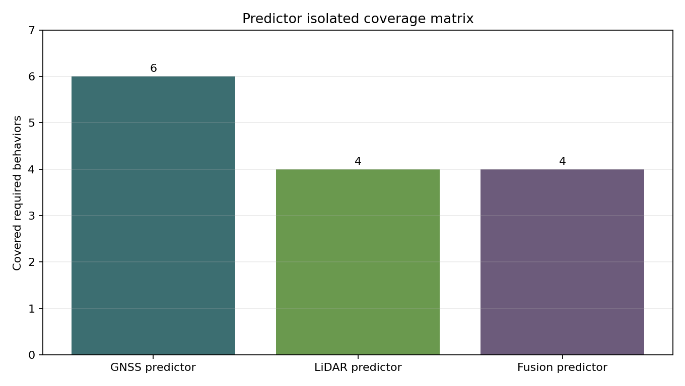

本次保存的实验产物位于：

```text
src/iap/docs/dev_predictor/predictor_isolated_test_coverage_artifacts/
```

关键文件：

| 文件 | 说明 |
| --- | --- |
| `colcon_test_isolated_final.log` | `colcon test` 原始输出。 |
| `ctest_isolated_final.log` | 3 个 isolated GTest 目标的 ctest 明细输出。 |
| `test_predictor_module_gtest_list.txt` | Predictor module 用例清单。 |
| `test_lidar_observability_fim_gtest_list.txt` | LiDAR FIM 用例清单。 |
| `test_predicted_araim_gtest_list.txt` | Predicted ARAIM 用例清单。 |
| `test_predictor_module_gtest_result.json` | Predictor module GTest JSON 结果。 |
| `test_lidar_observability_fim_gtest_result.json` | LiDAR FIM GTest JSON 结果。 |
| `test_predicted_araim_gtest_result.json` | Predicted ARAIM GTest JSON 结果。 |
| `predictor_isolated_coverage_matrix.csv` | 覆盖矩阵 CSV。 |
| `predictor_isolated_coverage_matrix.json` | 覆盖矩阵 JSON。 |
| `predictor_isolated_test_results_summary.json` | 测试结果 summary JSON。 |
| `predictor_isolated_test_results.png` | 测试结果图。 |
| `predictor_isolated_coverage_matrix.png` | 覆盖矩阵图。 |
| `gnss_open_sky_satellite_geometry.png` | GNSS open-sky 8 星 sky plot。 |
| `gnss_occlusion_visibility_counts.png` | GNSS occlusion 前后 visible/used count 对比图。 |
| `lidar_feature_rich_primitives.png` | LiDAR feature-rich primitive normal 数量图。 |
| `lidar_fallback_diagnostics.png` | LiDAR fallback diagnostics 覆盖图。 |
| `lidar_primitive_generation_checks.png` | LiDAR primitive generation 参数边界图。 |
| `fusion_lambda_addition_schematic.png` | Fusion additive FIM 信息流示意图。 |
| `gnss_geometry_sweep.csv` | GNSS geometry sweep 数值结果。 |
| `gnss_geometry_sweep_pdop_pl.png` | GNSS geometry sweep 的 PDOP/HPL/VPL 趋势图。 |
| `gnss_geometry_sweep_skyplots.png` | GNSS geometry sweep 代表性 skyplot。 |
| `gnss_sigma_sweep.csv` | GNSS sigma inflation sweep 数值结果。 |
| `gnss_sigma_sweep_pl.png` | GNSS sigma sweep PL 和 information trace 图。 |
| `gnss_occlusion_pl_degradation.csv` | GNSS occlusion 前后 PDOP/HPL/VPL 数值结果。 |
| `gnss_occlusion_pl_degradation.png` | GNSS occlusion 前后 PDOP/HPL/VPL 对比图。 |
| `current_advisory_separation.csv` | Current/advisory separation 数值结果。 |
| `current_vs_advisory_isolated.png` | Current HPL/VPL 与 selected advisory PL 对比图。 |
| `lidar_corridor_degeneracy.csv` | LiDAR corridor degeneracy 数值结果。 |
| `lidar_corridor_geometry_topdown.png` | Corridor geometry top-down 示意图。 |
| `lidar_corridor_eigenvalues.png` | LiDAR corridor eigenvalue 对比图。 |
| `lidar_corridor_axis_information.png` | LiDAR corridor axis information 对比图。 |
| `lidar_primitive_generation_parameters.csv` | Primitive generation 参数曲线数据。 |
| `lidar_primitive_generation_parameter_curves.png` | Primitive generation 参数曲线图。 |
| `fusion_gate_safety.csv` | Fusion conservative gate 数值结果。 |
| `fusion_gate_selected_vs_gnss.png` | Fusion selected PL 与 GNSS reference 对比图。 |
| `fusion_lambda_matrices.json` | Fusion lambda 矩阵、误差和 eigenvalues。 |
| `fusion_lambda_heatmaps.png` | Fusion lambda heatmap。 |
| `fusion_lambda_eigenvalues.png` | Fusion lambda eigenvalue 对比图。 |
| `../../results/predictor_validation/predictor_system_predictor_gnss_open_sky_only_run1/export/test_predictor_query_probe.csv` | System experiment 1 predictor query 主 CSV。 |
| `../../results/predictor_validation/predictor_system_predictor_gnss_open_sky_only_run1/export/test_predictor_query_probe_summary.json` | System experiment 1 probe summary。 |
| `../../results/predictor_validation/predictor_system_predictor_gnss_open_sky_only_run1/export/predictor_e1_analysis_summary.json` | System experiment 1 analyzer summary，`passed=true`。 |
| `../../results/predictor_validation/predictor_system_predictor_gnss_open_sky_only_run1/export/gnss_epoch_debug.csv` | System experiment 1 GNSS epoch debug 明细。 |
| `../../results/predictor_validation/predictor_system_predictor_gnss_open_sky_only_run1/export/gnss_visibility_by_query.csv` | System experiment 1 每个 query 的 GNSS visibility 明细。 |
| `../../results/predictor_validation/predictor_system_predictor_gnss_open_sky_only_run1/export/source_selection_debug.csv` | System experiment 1 source selection debug 明细。 |
| `../../results/predictor_validation/predictor_system_predictor_gnss_open_sky_only_run1/profiling/latency_debug.csv` | System experiment 1 latency profiling CSV。 |
| `../../results/predictor_validation/predictor_system_predictor_gnss_open_sky_only_run1/metadata/run_manifest.json` | System experiment 1 run manifest。 |
| `../../results/predictor_validation/predictor_system_predictor_gnss_open_sky_only_run1/figures/E1_selected_pl_timeline.png` | System experiment 1 selected PL timeline。 |
| `../../results/predictor_validation/predictor_system_predictor_gnss_open_sky_only_run1/figures/E1_gnss_geometry_timeline.png` | System experiment 1 GNSS geometry timeline。 |
| `../../results/predictor_validation/predictor_system_predictor_gnss_open_sky_only_run1/figures/E1_current_vs_advisory.png` | System experiment 1 current/advisory 对比图。 |
| `../../results/predictor_validation/predictor_system_predictor_gnss_open_sky_only_run1/figures/E1_latency_distribution.png` | System experiment 1 latency distribution。 |
| `../../results/predictor_validation/predictor_system_predictor_gnss_open_sky_only_run1/figures/E1_query_spatial_map.png` | System experiment 1 query spatial map。 |
| `../../results/predictor_validation/predictor_system_predictor_lidar_feature_rich_only_bag/export/test_predictor_query_probe.csv` | System experiment 2 predictor query 主 CSV。 |
| `../../results/predictor_validation/predictor_system_predictor_lidar_feature_rich_only_bag/export/test_predictor_query_probe_summary.json` | System experiment 2 probe summary。 |
| `../../results/predictor_validation/predictor_system_predictor_lidar_feature_rich_only_bag/export/test_predictor_validation_summary.json` | System experiment 2 validator summary，`passed=true`。 |
| `../../results/predictor_validation/predictor_system_predictor_lidar_feature_rich_only_bag/export/predictor_e2_analysis_summary.json` | System experiment 2 analyzer summary，`passed=true`。 |
| `../../results/predictor_validation/predictor_system_predictor_lidar_feature_rich_only_bag/export/predictor_lidar_debug.csv` | System experiment 2 LiDAR FIM diagnostics。 |
| `../../results/predictor_validation/predictor_system_predictor_lidar_feature_rich_only_bag/export/predictor_lidar_primitives_debug.csv` | System experiment 2 LiDAR primitive debug 明细。 |
| `../../results/predictor_validation/predictor_system_predictor_lidar_feature_rich_only_bag/export/fallback_reason_by_time.csv` | System experiment 2 fallback reason timeline。 |
| `../../results/predictor_validation/predictor_system_predictor_lidar_feature_rich_only_bag/export/downsampled_map.csv` | System experiment 2 predictor 使用的 downsampled map snapshot。 |
| `../../results/predictor_validation/predictor_system_predictor_lidar_feature_rich_only_bag/profiling/latency_debug.csv` | System experiment 2 latency profiling CSV。 |
| `../../results/predictor_validation/predictor_system_predictor_lidar_feature_rich_only_bag/metadata/run_manifest.json` | System experiment 2 run manifest。 |
| `../../results/predictor_validation/predictor_system_predictor_lidar_feature_rich_only_bag/figures/E2_selected_pl_timeline.png` | System experiment 2 selected PL timeline。 |
| `../../results/predictor_validation/predictor_system_predictor_lidar_feature_rich_only_bag/figures/E2_lidar_diagnostics_timeline.png` | System experiment 2 LiDAR diagnostics timeline。 |
| `../../results/predictor_validation/predictor_system_predictor_lidar_feature_rich_only_bag/figures/E2_lidar_eigenvalues_timeline.png` | System experiment 2 LiDAR eigenvalue diagnostics timeline。 |
| `../../results/predictor_validation/predictor_system_predictor_lidar_feature_rich_only_bag/figures/E2_lidar_primitives_topdown.png` | System experiment 2 LiDAR primitives top-down 图。 |
| `../../results/predictor_validation/predictor_system_predictor_lidar_feature_rich_only_bag/figures/E2_lidar_normal_distribution.png` | System experiment 2 LiDAR primitive normal distribution。 |
| `../../results/predictor_validation/predictor_system_predictor_fusion_nominal_run1/export/test_predictor_query_probe.csv` | System experiment 3 predictor query 主 CSV。 |
| `../../results/predictor_validation/predictor_system_predictor_fusion_nominal_run1/export/test_predictor_query_probe_summary.json` | System experiment 3 probe summary。 |
| `../../results/predictor_validation/predictor_system_predictor_fusion_nominal_run1/export/test_predictor_validation_summary.json` | System experiment 3 validator summary，`passed=true`。 |
| `../../results/predictor_validation/predictor_system_predictor_fusion_nominal_run1/export/predictor_e3_analysis_summary.json` | System experiment 3 analyzer summary，`passed=true`。 |
| `../../results/predictor_validation/predictor_system_predictor_fusion_nominal_run1/export/predictor_fusion_debug.csv` | System experiment 3 Fusion FIM matrix debug。 |
| `../../results/predictor_validation/predictor_system_predictor_fusion_nominal_run1/export/predictor_lidar_debug.csv` | System experiment 3 LiDAR FIM diagnostics。 |
| `../../results/predictor_validation/predictor_system_predictor_fusion_nominal_run1/export/gnss_visibility_by_query.csv` | System experiment 3 GNSS visibility by query。 |
| `../../results/predictor_validation/predictor_system_predictor_fusion_nominal_run1/export/fallback_reason_by_time.csv` | System experiment 3 fallback reason timeline。 |
| `../../results/predictor_validation/predictor_system_predictor_fusion_nominal_run1/profiling/latency_debug.csv` | System experiment 3 latency profiling CSV。 |
| `../../results/predictor_validation/predictor_system_predictor_fusion_nominal_run1/metadata/run_manifest.json` | System experiment 3 run manifest。 |
| `../../results/predictor_validation/predictor_system_predictor_fusion_nominal_run1/figures/E3_source_hpl_vpl_timeline.png` | System experiment 3 source HPL/VPL timeline。 |
| `../../results/predictor_validation/predictor_system_predictor_fusion_nominal_run1/figures/E3_lambda_contribution_timeline.png` | System experiment 3 lambda contribution timeline。 |
| `../../results/predictor_validation/predictor_system_predictor_fusion_nominal_run1/figures/E3_lambda_sum_error_timeline.png` | System experiment 3 lambda sum error timeline。 |
| `../../results/predictor_validation/predictor_system_predictor_fusion_nominal_run1/figures/E3_lambda_condition_timeline.png` | System experiment 3 lambda condition timeline。 |
| `../../results/predictor_validation/predictor_system_predictor_fusion_nominal_run1/figures/E3_source_selection_histogram.png` | System experiment 3 selected source histogram。 |
| `../../results/predictor_validation/predictor_system_predictor_fusion_nominal_run1/figures/E3_latency_distribution.png` | System experiment 3 latency distribution。 |
| `../../results/predictor_validation/predictor_system_predictor_gnss_degraded_lidar_good_run1/export/test_predictor_query_probe.csv` | System experiment 4 predictor query 主 CSV。 |
| `../../results/predictor_validation/predictor_system_predictor_gnss_degraded_lidar_good_run1/export/test_predictor_query_probe_summary.json` | System experiment 4 probe summary。 |
| `../../results/predictor_validation/predictor_system_predictor_gnss_degraded_lidar_good_run1/export/predictor_e4_analysis_summary.json` | System experiment 4 analyzer summary，`passed=true`。 |
| `../../results/predictor_validation/predictor_system_predictor_gnss_degraded_lidar_good_run1/export/gnss_visibility_by_query.csv` | System experiment 4 GNSS visibility by query。 |
| `../../results/predictor_validation/predictor_system_predictor_gnss_degraded_lidar_good_run1/export/satellite_used_mask.csv` | System experiment 4 analyzer 派生 satellite used mask。 |
| `../../results/predictor_validation/predictor_system_predictor_gnss_degraded_lidar_good_run1/export/scenario_region_labels.csv` | System experiment 4 analyzer 派生 scenario region labels。 |
| `../../results/predictor_validation/predictor_system_predictor_gnss_degraded_lidar_good_run1/export/predictor_lidar_debug.csv` | System experiment 4 LiDAR FIM diagnostics。 |
| `../../results/predictor_validation/predictor_system_predictor_gnss_degraded_lidar_good_run1/export/predictor_lidar_primitives_debug.csv` | System experiment 4 LiDAR primitive debug 明细。 |
| `../../results/predictor_validation/predictor_system_predictor_gnss_degraded_lidar_good_run1/export/predictor_fusion_debug.csv` | System experiment 4 Fusion FIM matrix debug。 |
| `../../results/predictor_validation/predictor_system_predictor_gnss_degraded_lidar_good_run1/export/source_selection_debug.csv` | System experiment 4 source selection debug 明细。 |
| `../../results/predictor_validation/predictor_system_predictor_gnss_degraded_lidar_good_run1/export/fallback_reason_by_time.csv` | System experiment 4 fallback reason timeline。 |
| `../../results/predictor_validation/predictor_system_predictor_gnss_degraded_lidar_good_run1/profiling/latency_debug.csv` | System experiment 4 latency profiling CSV。 |
| `../../results/predictor_validation/predictor_system_predictor_gnss_degraded_lidar_good_run1/metadata/run_manifest.json` | System experiment 4 run manifest，记录 planner enabled 但不使用 predictor。 |
| `../../results/predictor_validation/predictor_system_predictor_gnss_degraded_lidar_good_run1/figures/E4_gnss_degradation_timeline.png` | System experiment 4 GNSS degradation timeline。 |
| `../../results/predictor_validation/predictor_system_predictor_gnss_degraded_lidar_good_run1/figures/E4_lidar_support_timeline.png` | System experiment 4 LiDAR support timeline。 |
| `../../results/predictor_validation/predictor_system_predictor_gnss_degraded_lidar_good_run1/figures/E4_gnss_vs_fusion_hpl_vpl.png` | System experiment 4 GNSS vs Fusion HPL/VPL 对比图。 |
| `../../results/predictor_validation/predictor_system_predictor_gnss_degraded_lidar_good_run1/figures/E4_lambda_contribution_timeline.png` | System experiment 4 lambda contribution timeline。 |
| `../../results/predictor_validation/predictor_system_predictor_gnss_degraded_lidar_good_run1/figures/E4_spatial_query_map_colored_by_gnss_hpl.png` | System experiment 4 spatial query map，按 GNSS HPL 着色。 |
| `../../results/predictor_validation/predictor_system_predictor_gnss_degraded_lidar_good_run1/figures/E4_spatial_query_map_colored_by_selected_hpl.png` | System experiment 4 spatial query map，按 selected HPL 着色。 |
| `../../results/predictor_validation/predictor_system_predictor_lidar_sparse_gnss_good_run1/export/test_predictor_query_probe.csv` | System experiment 5 predictor query 主 CSV。 |
| `../../results/predictor_validation/predictor_system_predictor_lidar_sparse_gnss_good_run1/export/test_predictor_query_probe_summary.json` | System experiment 5 probe summary。 |
| `../../results/predictor_validation/predictor_system_predictor_lidar_sparse_gnss_good_run1/export/test_predictor_validation_summary.json` | System experiment 5 validator summary，`passed=true`。 |
| `../../results/predictor_validation/predictor_system_predictor_lidar_sparse_gnss_good_run1/export/predictor_e5_analysis_summary.json` | System experiment 5 analyzer summary，`passed=true`。 |
| `../../results/predictor_validation/predictor_system_predictor_lidar_sparse_gnss_good_run1/export/lidar_gate_debug.csv` | System experiment 5 analyzer 派生 LiDAR fusion gate debug。 |
| `../../results/predictor_validation/predictor_system_predictor_lidar_sparse_gnss_good_run1/export/gnss_visibility_by_query.csv` | System experiment 5 GNSS visibility by query。 |
| `../../results/predictor_validation/predictor_system_predictor_lidar_sparse_gnss_good_run1/export/predictor_lidar_debug.csv` | System experiment 5 LiDAR FIM diagnostics。 |
| `../../results/predictor_validation/predictor_system_predictor_lidar_sparse_gnss_good_run1/export/predictor_lidar_primitives_debug.csv` | System experiment 5 LiDAR primitive debug 明细。 |
| `../../results/predictor_validation/predictor_system_predictor_lidar_sparse_gnss_good_run1/export/predictor_fusion_debug.csv` | System experiment 5 Fusion FIM matrix debug。 |
| `../../results/predictor_validation/predictor_system_predictor_lidar_sparse_gnss_good_run1/export/source_selection_debug.csv` | System experiment 5 source selection debug 明细。 |
| `../../results/predictor_validation/predictor_system_predictor_lidar_sparse_gnss_good_run1/export/fallback_reason_by_time.csv` | System experiment 5 fallback reason timeline。 |
| `../../results/predictor_validation/predictor_system_predictor_lidar_sparse_gnss_good_run1/export/downsampled_map.csv` | System experiment 5 predictor 使用的 sparse downsampled map snapshot。 |
| `../../results/predictor_validation/predictor_system_predictor_lidar_sparse_gnss_good_run1/profiling/latency_debug.csv` | System experiment 5 latency profiling CSV。 |
| `../../results/predictor_validation/predictor_system_predictor_lidar_sparse_gnss_good_run1/metadata/run_manifest.json` | System experiment 5 run manifest。 |
| `../../results/predictor_validation/predictor_system_predictor_lidar_sparse_gnss_good_run1/metadata/predictor_probe_config.json` | System experiment 5 probe config，记录 conservative max 和 sparse map point limit。 |
| `../../results/predictor_validation/predictor_system_predictor_lidar_sparse_gnss_good_run1/figures/E5_lidar_degradation_timeline.png` | System experiment 5 LiDAR degradation timeline。 |
| `../../results/predictor_validation/predictor_system_predictor_lidar_sparse_gnss_good_run1/figures/E5_gnss_stability_timeline.png` | System experiment 5 GNSS stability timeline。 |
| `../../results/predictor_validation/predictor_system_predictor_lidar_sparse_gnss_good_run1/figures/E5_fusion_gate_timeline.png` | System experiment 5 fusion gate timeline。 |
| `../../results/predictor_validation/predictor_system_predictor_lidar_sparse_gnss_good_run1/figures/E5_selected_vs_gnss_pl.png` | System experiment 5 selected vs GNSS PL 对比图。 |
| `../../results/predictor_validation/predictor_system_predictor_lidar_sparse_gnss_good_run1/figures/E5_lidar_primitives_topdown.png` | System experiment 5 LiDAR primitives top-down 图。 |
| `../../results/predictor_validation/predictor_system_predictor_lidar_sparse_gnss_good_run1/figures/E5_lidar_eigenvalues_timeline.png` | System experiment 5 LiDAR eigenvalue diagnostics timeline。 |
| `../../results/predictor_validation/predictor_system_predictor_gnss_outage_lidar_recovery_run4/export/test_predictor_query_probe.csv` | System experiment 6 predictor query 主 CSV。 |
| `../../results/predictor_validation/predictor_system_predictor_gnss_outage_lidar_recovery_run4/export/test_predictor_query_probe_summary.json` | System experiment 6 probe summary。 |
| `../../results/predictor_validation/predictor_system_predictor_gnss_outage_lidar_recovery_run4/export/test_predictor_validation_summary.json` | System experiment 6 runtime validator summary，`passed=true`。 |
| `../../results/predictor_validation/predictor_system_predictor_gnss_outage_lidar_recovery_run4/export/predictor_e6_analysis_summary.json` | System experiment 6 analyzer summary，`passed=true`。 |
| `../../results/predictor_validation/predictor_system_predictor_gnss_outage_lidar_recovery_run4/export/outage_event_times.json` | System experiment 6 analyzer 派生 outage/recovery event times。 |
| `../../results/predictor_validation/predictor_system_predictor_gnss_outage_lidar_recovery_run4/export/recovery_metrics.json` | System experiment 6 analyzer 派生 recovery metrics。 |
| `../../results/predictor_validation/predictor_system_predictor_gnss_outage_lidar_recovery_run4/export/gnss_visibility_by_query.csv` | System experiment 6 GNSS visibility by query，记录 outage 内可见卫星降为 0。 |
| `../../results/predictor_validation/predictor_system_predictor_gnss_outage_lidar_recovery_run4/export/predictor_lidar_debug.csv` | System experiment 6 LiDAR FIM diagnostics。 |
| `../../results/predictor_validation/predictor_system_predictor_gnss_outage_lidar_recovery_run4/export/predictor_lidar_primitives_debug.csv` | System experiment 6 LiDAR primitive debug 明细。 |
| `../../results/predictor_validation/predictor_system_predictor_gnss_outage_lidar_recovery_run4/export/predictor_fusion_debug.csv` | System experiment 6 Fusion FIM matrix debug。 |
| `../../results/predictor_validation/predictor_system_predictor_gnss_outage_lidar_recovery_run4/export/source_selection_debug.csv` | System experiment 6 source selection debug 明细，记录 outage 内 selected source 为 `NONE`。 |
| `../../results/predictor_validation/predictor_system_predictor_gnss_outage_lidar_recovery_run4/export/fallback_reason_by_time.csv` | System experiment 6 fallback reason timeline，记录 `gnss:no_gnss_epoch`。 |
| `../../results/predictor_validation/predictor_system_predictor_gnss_outage_lidar_recovery_run4/profiling/latency_debug.csv` | System experiment 6 latency profiling CSV。 |
| `../../results/predictor_validation/predictor_system_predictor_gnss_outage_lidar_recovery_run4/metadata/run_manifest.json` | System experiment 6 run manifest。 |
| `../../results/predictor_validation/predictor_system_predictor_gnss_outage_lidar_recovery_run4/metadata/predictor_probe_config.json` | System experiment 6 probe config，记录 `require_gnss_for_selected_output=true`。 |
| `../../results/predictor_validation/predictor_system_predictor_gnss_outage_lidar_recovery_run4/figures/E6_outage_window_timeline.png` | System experiment 6 outage window timeline。 |
| `../../results/predictor_validation/predictor_system_predictor_gnss_outage_lidar_recovery_run4/figures/E6_fallback_reason_timeline.png` | System experiment 6 fallback reason timeline。 |
| `../../results/predictor_validation/predictor_system_predictor_gnss_outage_lidar_recovery_run4/figures/E6_source_selection_timeline.png` | System experiment 6 source selection timeline。 |
| `../../results/predictor_validation/predictor_system_predictor_gnss_outage_lidar_recovery_run4/figures/E6_recovery_latency.png` | System experiment 6 recovery latency 图。 |
| `../../results/predictor_validation/predictor_system_predictor_gnss_outage_lidar_recovery_run4/figures/E6_gnss_n_visible_timeline.png` | System experiment 6 GNSS visible/used satellite timeline。 |
| `../../results/predictor_validation/predictor_system_predictor_gnss_outage_lidar_recovery_run4/figures/E6_selected_pl_timeline.png` | System experiment 6 selected PL timeline。 |
| `../../results/predictor_validation/predictor_system_predictor_no_source_negative_run1/export/test_predictor_query_probe.csv` | System experiment 7 predictor query 主 CSV。 |
| `../../results/predictor_validation/predictor_system_predictor_no_source_negative_run1/export/test_predictor_query_probe_summary.json` | System experiment 7 probe summary。 |
| `../../results/predictor_validation/predictor_system_predictor_no_source_negative_run1/export/predictor_e7_analysis_summary.json` | System experiment 7 analyzer summary，`passed=true`。 |
| `../../results/predictor_validation/predictor_system_predictor_no_source_negative_run1/export/invalid_output_audit.json` | System experiment 7 invalid output audit，确认无 finite selected PL、无 current copy。 |
| `../../results/predictor_validation/predictor_system_predictor_no_source_negative_run1/export/negative_case_rows.csv` | System experiment 7 analyzer 派生 negative-case row audit。 |
| `../../results/predictor_validation/predictor_system_predictor_no_source_negative_run1/export/snapshot_debug.csv` | System experiment 7 analyzer 派生 snapshot debug。 |
| `../../results/predictor_validation/predictor_system_predictor_no_source_negative_run1/export/current_vs_advisory_debug.csv` | System experiment 7 current/advisory copy audit CSV。 |
| `../../results/predictor_validation/predictor_system_predictor_no_source_negative_run1/export/source_selection_debug.csv` | System experiment 7 source selection debug 明细，记录 selected source 为 `NONE`。 |
| `../../results/predictor_validation/predictor_system_predictor_no_source_negative_run1/export/fallback_reason_by_time.csv` | System experiment 7 fallback reason timeline，记录 GNSS/LiDAR source 缺失原因。 |
| `../../results/predictor_validation/predictor_system_predictor_no_source_negative_run1/export/predictor_fusion_debug.csv` | System experiment 7 Fusion debug，记录 fused invalid/fallback。 |
| `../../results/predictor_validation/predictor_system_predictor_no_source_negative_run1/export/predictor_lidar_debug.csv` | System experiment 7 LiDAR diagnostics，记录 missing LiDAR normals。 |
| `../../results/predictor_validation/predictor_system_predictor_no_source_negative_run1/export/gnss_visibility_by_query.csv` | System experiment 7 GNSS visibility by query，记录无 GNSS epoch。 |
| `../../results/predictor_validation/predictor_system_predictor_no_source_negative_run1/profiling/latency_debug.csv` | System experiment 7 latency profiling CSV。 |
| `../../results/predictor_validation/predictor_system_predictor_no_source_negative_run1/metadata/run_manifest.json` | System experiment 7 run manifest。 |
| `../../results/predictor_validation/predictor_system_predictor_no_source_negative_run1/metadata/predictor_probe_config.json` | System experiment 7 probe config，记录 `use_lidar_primitives=false`。 |
| `../../results/predictor_validation/predictor_system_predictor_no_source_negative_run1/figures/E7_valid_fallback_flags.png` | System experiment 7 valid/fallback flags 图。 |
| `../../results/predictor_validation/predictor_system_predictor_no_source_negative_run1/figures/E7_fallback_reason_histogram.png` | System experiment 7 fallback reason histogram。 |
| `../../results/predictor_validation/predictor_system_predictor_no_source_negative_run1/figures/E7_selected_pl_timeline.png` | System experiment 7 selected PL timeline。 |
| `../../results/predictor_validation/predictor_system_predictor_no_source_negative_run1/figures/E7_current_vs_selected_pl.png` | System experiment 7 current vs selected PL copy audit 图。 |
| `../../results/predictor_validation/predictor_system_predictor_no_source_negative_run1/figures/E7_source_selection_timeline.png` | System experiment 7 source selection timeline。 |
| `../../results/predictor_validation/predictor_system_predictor_current_advisory_separation_run1/export/test_predictor_query_probe.csv` | System experiment 8 predictor query 主 CSV，记录 current variant 和 selected/GNSS/current PL。 |
| `../../results/predictor_validation/predictor_system_predictor_current_advisory_separation_run1/export/test_predictor_query_probe_summary.json` | System experiment 8 probe summary。 |
| `../../results/predictor_validation/predictor_system_predictor_current_advisory_separation_run1/export/test_predictor_validation_summary.json` | System experiment 8 runtime validator summary，`passed=true`。 |
| `../../results/predictor_validation/predictor_system_predictor_current_advisory_separation_run1/export/predictor_e8_analysis_summary.json` | System experiment 8 analyzer summary，`passed=true`。 |
| `../../results/predictor_validation/predictor_system_predictor_current_advisory_separation_run1/export/current_advisory_separation.csv` | System experiment 8 analyzer 派生 current/advisory separation 明细。 |
| `../../results/predictor_validation/predictor_system_predictor_current_advisory_separation_run1/export/current_advisory_variant_summary.json` | System experiment 8 各 current variant 的统计摘要。 |
| `../../results/predictor_validation/predictor_system_predictor_current_advisory_separation_run1/export/source_selection_debug.csv` | System experiment 8 source selection debug 明细，记录 selected source 为 `GNSS`。 |
| `../../results/predictor_validation/predictor_system_predictor_current_advisory_separation_run1/export/gnss_visibility_by_query.csv` | System experiment 8 GNSS visibility by query。 |
| `../../results/predictor_validation/predictor_system_predictor_current_advisory_separation_run1/export/fallback_reason_by_time.csv` | System experiment 8 fallback reason timeline。 |
| `../../results/predictor_validation/predictor_system_predictor_current_advisory_separation_run1/profiling/latency_debug.csv` | System experiment 8 latency profiling CSV。 |
| `../../results/predictor_validation/predictor_system_predictor_current_advisory_separation_run1/metadata/run_manifest.json` | System experiment 8 run manifest，记录 current variant 注入参数。 |
| `../../results/predictor_validation/predictor_system_predictor_current_advisory_separation_run1/metadata/predictor_probe_config.json` | System experiment 8 probe config，记录 `current_variant_set=e8_current_advisory_separation`。 |
| `../../results/predictor_validation/predictor_system_predictor_current_advisory_separation_run1/figures/E8_current_vs_advisory_bar.png` | System experiment 8 current/advisory median PL 对比图。 |
| `../../results/predictor_validation/predictor_system_predictor_current_advisory_separation_run1/figures/E8_copied_current_flag_timeline.png` | System experiment 8 copied current flag timeline。 |
| `../../results/predictor_validation/predictor_system_predictor_current_advisory_separation_run1/figures/E8_selected_vs_gnss_timeline.png` | System experiment 8 selected vs GNSS HPL/VPL timeline。 |
| `../../results/predictor_validation/predictor_system_predictor_current_advisory_separation_run1/figures/E8_variant_latency_distribution.png` | System experiment 8 variant latency distribution。 |
| `../../results/predictor_validation/predictor_system_predictor_gnss_sigma_degradation_run1/export/gnss_sigma_sweep_system.csv` | System experiment 9 analyzer 派生 GNSS sigma sweep 汇总 CSV。 |
| `../../results/predictor_validation/predictor_system_predictor_gnss_sigma_degradation_run1/export/predictor_e9_analysis_summary.json` | System experiment 9 analyzer summary，`passed=true`。 |
| `../../results/predictor_validation/predictor_system_predictor_gnss_sigma_degradation_run1/scale_1x/export/test_predictor_query_probe.csv` | System experiment 9 scale 1x predictor query 主 CSV。 |
| `../../results/predictor_validation/predictor_system_predictor_gnss_sigma_degradation_run1/scale_2x/export/test_predictor_query_probe.csv` | System experiment 9 scale 2x predictor query 主 CSV。 |
| `../../results/predictor_validation/predictor_system_predictor_gnss_sigma_degradation_run1/scale_4x/export/test_predictor_query_probe.csv` | System experiment 9 scale 4x predictor query 主 CSV。 |
| `../../results/predictor_validation/predictor_system_predictor_gnss_sigma_degradation_run1/scale_1x/export/gnss_visibility_by_query.csv` | System experiment 9 scale 1x GNSS visibility by query。 |
| `../../results/predictor_validation/predictor_system_predictor_gnss_sigma_degradation_run1/scale_2x/export/gnss_visibility_by_query.csv` | System experiment 9 scale 2x GNSS visibility by query。 |
| `../../results/predictor_validation/predictor_system_predictor_gnss_sigma_degradation_run1/scale_4x/export/gnss_visibility_by_query.csv` | System experiment 9 scale 4x GNSS visibility by query。 |
| `../../results/predictor_validation/predictor_system_predictor_gnss_sigma_degradation_run1/scale_1x/profiling/latency_debug.csv` | System experiment 9 scale 1x latency profiling CSV。 |
| `../../results/predictor_validation/predictor_system_predictor_gnss_sigma_degradation_run1/scale_2x/profiling/latency_debug.csv` | System experiment 9 scale 2x latency profiling CSV。 |
| `../../results/predictor_validation/predictor_system_predictor_gnss_sigma_degradation_run1/scale_4x/profiling/latency_debug.csv` | System experiment 9 scale 4x latency profiling CSV。 |
| `../../results/predictor_validation/predictor_system_predictor_gnss_sigma_degradation_run1/scale_1x/metadata/run_manifest.json` | System experiment 9 scale 1x run manifest。 |
| `../../results/predictor_validation/predictor_system_predictor_gnss_sigma_degradation_run1/scale_2x/metadata/run_manifest.json` | System experiment 9 scale 2x run manifest。 |
| `../../results/predictor_validation/predictor_system_predictor_gnss_sigma_degradation_run1/scale_4x/metadata/run_manifest.json` | System experiment 9 scale 4x run manifest。 |
| `../../results/predictor_validation/predictor_system_predictor_gnss_sigma_degradation_run1/scale_1x/metadata/predictor_probe_config.json` | System experiment 9 scale 1x probe config，记录 `probe_gnss_sigma_scale=1.0`。 |
| `../../results/predictor_validation/predictor_system_predictor_gnss_sigma_degradation_run1/scale_2x/metadata/predictor_probe_config.json` | System experiment 9 scale 2x probe config，记录 `probe_gnss_sigma_scale=2.0`。 |
| `../../results/predictor_validation/predictor_system_predictor_gnss_sigma_degradation_run1/scale_4x/metadata/predictor_probe_config.json` | System experiment 9 scale 4x probe config，记录 `probe_gnss_sigma_scale=4.0`。 |
| `../../results/predictor_validation/predictor_system_predictor_gnss_sigma_degradation_run1/figures/E9_sigma_vs_pl.png` | System experiment 9 sigma scale vs GNSS/selected PL 图。 |
| `../../results/predictor_validation/predictor_system_predictor_gnss_sigma_degradation_run1/figures/E9_sigma_vs_lambda_trace.png` | System experiment 9 sigma scale vs GNSS FIM trace 图。 |
| `../../results/predictor_validation/predictor_system_predictor_gnss_sigma_degradation_run1/figures/E9_effective_sigma_by_scale.png` | System experiment 9 effective sigma by scale 图。 |
| `../../results/predictor_validation/predictor_system_predictor_gnss_sigma_degradation_run1/figures/E9_latency_by_scale.png` | System experiment 9 latency by scale 图。 |
| `../../results/predictor_validation/predictor_system_predictor_corridor_lidar_degeneracy_run1/export/test_predictor_query_probe.csv` | System experiment 10 predictor query 主 CSV，记录 LiDAR alpha/TDOP 和 selected output。 |
| `../../results/predictor_validation/predictor_system_predictor_corridor_lidar_degeneracy_run1/export/test_predictor_query_probe_summary.json` | System experiment 10 probe summary。 |
| `../../results/predictor_validation/predictor_system_predictor_corridor_lidar_degeneracy_run1/export/test_predictor_validation_summary.json` | System experiment 10 runtime validator summary，`passed=true`。 |
| `../../results/predictor_validation/predictor_system_predictor_corridor_lidar_degeneracy_run1/export/predictor_e10_analysis_summary.json` | System experiment 10 analyzer summary，`passed=true`。 |
| `../../results/predictor_validation/predictor_system_predictor_corridor_lidar_degeneracy_run1/export/lidar_corridor_degeneracy_system.csv` | System experiment 10 analyzer 派生 corridor degeneracy 明细 CSV。 |
| `../../results/predictor_validation/predictor_system_predictor_corridor_lidar_degeneracy_run1/export/predictor_lidar_debug.csv` | System experiment 10 LiDAR FIM diagnostics。 |
| `../../results/predictor_validation/predictor_system_predictor_corridor_lidar_degeneracy_run1/export/predictor_lidar_primitives_debug.csv` | System experiment 10 LiDAR primitive debug 明细。 |
| `../../results/predictor_validation/predictor_system_predictor_corridor_lidar_degeneracy_run1/export/predictor_fusion_debug.csv` | System experiment 10 Fusion debug，提供 `lambda_lidar_00..22` 用于 along/cross information 派生。 |
| `../../results/predictor_validation/predictor_system_predictor_corridor_lidar_degeneracy_run1/export/source_selection_debug.csv` | System experiment 10 source selection debug 明细。 |
| `../../results/predictor_validation/predictor_system_predictor_corridor_lidar_degeneracy_run1/export/fallback_reason_by_time.csv` | System experiment 10 fallback/gate reason timeline。 |
| `../../results/predictor_validation/predictor_system_predictor_corridor_lidar_degeneracy_run1/export/downsampled_map.csv` | System experiment 10 predictor 使用的 corridor downsampled map snapshot。 |
| `../../results/predictor_validation/predictor_system_predictor_corridor_lidar_degeneracy_run1/profiling/latency_debug.csv` | System experiment 10 latency profiling CSV。 |
| `../../results/predictor_validation/predictor_system_predictor_corridor_lidar_degeneracy_run1/metadata/run_manifest.json` | System experiment 10 run manifest。 |
| `../../results/predictor_validation/predictor_system_predictor_corridor_lidar_degeneracy_run1/metadata/predictor_probe_config.json` | System experiment 10 probe config，记录 `output_mode=lidar_only`、`query_set=current_pose` 和 LiDAR FIM 参数。 |
| `../../results/predictor_validation/predictor_system_predictor_corridor_lidar_degeneracy_run1/figures/E10_corridor_map_topdown.png` | System experiment 10 corridor map top-down 图。 |
| `../../results/predictor_validation/predictor_system_predictor_corridor_lidar_degeneracy_run1/figures/E10_lidar_condition_timeline.png` | System experiment 10 LiDAR condition/degeneracy timeline。 |
| `../../results/predictor_validation/predictor_system_predictor_corridor_lidar_degeneracy_run1/figures/E10_along_vs_cross_corridor_information.png` | System experiment 10 along vs cross corridor information 图。 |
| `../../results/predictor_validation/predictor_system_predictor_corridor_lidar_degeneracy_run1/figures/E10_lidar_gate_timeline.png` | System experiment 10 LiDAR gate timeline。 |
| `../../results/predictor_validation/predictor_system_predictor_corridor_lidar_degeneracy_run1/figures/E10_lidar_eigenvalues_timeline.png` | System experiment 10 LiDAR eigenvalue diagnostics timeline。 |
| `../../results/predictor_validation/predictor_system_predictor_stale_snapshot_guard_run3/export/test_predictor_query_probe.csv` | System experiment 11 predictor query 主 CSV，记录 stale variant、source age 和 selected output。 |
| `../../results/predictor_validation/predictor_system_predictor_stale_snapshot_guard_run3/export/test_predictor_query_probe_summary.json` | System experiment 11 probe summary。 |
| `../../results/predictor_validation/predictor_system_predictor_stale_snapshot_guard_run3/export/test_predictor_validation_summary.json` | System experiment 11 runtime validator summary，`passed=true`。 |
| `../../results/predictor_validation/predictor_system_predictor_stale_snapshot_guard_run3/export/predictor_e11_analysis_summary.json` | System experiment 11 analyzer summary，`passed=true`。 |
| `../../results/predictor_validation/predictor_system_predictor_stale_snapshot_guard_run3/export/stale_snapshot_audit.json` | System experiment 11 stale snapshot audit，确认无 bad age/reason/finite stale PL。 |
| `../../results/predictor_validation/predictor_system_predictor_stale_snapshot_guard_run3/export/stale_snapshot_debug.csv` | System experiment 11 原生 stale snapshot debug CSV。 |
| `../../results/predictor_validation/predictor_system_predictor_stale_snapshot_guard_run3/export/predictor_fusion_debug.csv` | System experiment 11 Fusion debug，记录 normal rows 的 fusion advisory。 |
| `../../results/predictor_validation/predictor_system_predictor_stale_snapshot_guard_run3/export/predictor_lidar_debug.csv` | System experiment 11 LiDAR FIM diagnostics。 |
| `../../results/predictor_validation/predictor_system_predictor_stale_snapshot_guard_run3/export/gnss_visibility_by_query.csv` | System experiment 11 GNSS visibility by query。 |
| `../../results/predictor_validation/predictor_system_predictor_stale_snapshot_guard_run3/export/source_selection_debug.csv` | System experiment 11 source selection debug 明细，记录 normal 为 `FUSION`、stale 为 `NONE`。 |
| `../../results/predictor_validation/predictor_system_predictor_stale_snapshot_guard_run3/export/fallback_reason_by_time.csv` | System experiment 11 fallback reason timeline，记录四类 stale reason。 |
| `../../results/predictor_validation/predictor_system_predictor_stale_snapshot_guard_run3/profiling/latency_debug.csv` | System experiment 11 latency profiling CSV。 |
| `../../results/predictor_validation/predictor_system_predictor_stale_snapshot_guard_run3/metadata/run_manifest.json` | System experiment 11 run manifest。 |
| `../../results/predictor_validation/predictor_system_predictor_stale_snapshot_guard_run3/metadata/predictor_probe_config.json` | System experiment 11 probe config，记录 `stale_variant_set=e11_stale_snapshot_guard` 和 max age 阈值。 |
| `../../results/predictor_validation/predictor_system_predictor_stale_snapshot_guard_run3/figures/E11_age_vs_validity.png` | System experiment 11 age vs validity 图。 |
| `../../results/predictor_validation/predictor_system_predictor_stale_snapshot_guard_run3/figures/E11_stale_reason_timeline.png` | System experiment 11 stale reason timeline。 |
| `../../results/predictor_validation/predictor_system_predictor_stale_snapshot_guard_run3/figures/E11_stale_source_histogram.png` | System experiment 11 stale source/reason histogram。 |
| `../../results/predictor_validation/predictor_system_predictor_stale_snapshot_guard_run3/figures/E11_latency_distribution.png` | System experiment 11 latency distribution。 |
| `../../results/predictor_validation/predictor_system_predictor_query_latency_stress_run1/export/test_predictor_query_probe.csv` | System experiment 12 predictor query 主 CSV，记录 query batch size/index 和 selected output。 |
| `../../results/predictor_validation/predictor_system_predictor_query_latency_stress_run1/export/test_predictor_query_probe_summary.json` | System experiment 12 probe summary。 |
| `../../results/predictor_validation/predictor_system_predictor_query_latency_stress_run1/export/test_predictor_validation_summary.json` | System experiment 12 runtime validator summary，`passed=true`。 |
| `../../results/predictor_validation/predictor_system_predictor_query_latency_stress_run1/export/predictor_e12_analysis_summary.json` | System experiment 12 analyzer summary，`passed=true`。 |
| `../../results/predictor_validation/predictor_system_predictor_query_latency_stress_run1/export/latency_stress.csv` | System experiment 12 analyzer 派生 batch latency 汇总 CSV。 |
| `../../results/predictor_validation/predictor_system_predictor_query_latency_stress_run1/export/latency_stress_tick_debug.csv` | System experiment 12 原生 batch tick latency debug CSV。 |
| `../../results/predictor_validation/predictor_system_predictor_query_latency_stress_run1/export/source_selection_debug.csv` | System experiment 12 source selection debug 明细，记录 selected source 为 `FUSION`。 |
| `../../results/predictor_validation/predictor_system_predictor_query_latency_stress_run1/export/gnss_visibility_by_query.csv` | System experiment 12 GNSS visibility by query。 |
| `../../results/predictor_validation/predictor_system_predictor_query_latency_stress_run1/export/predictor_lidar_debug.csv` | System experiment 12 LiDAR FIM diagnostics。 |
| `../../results/predictor_validation/predictor_system_predictor_query_latency_stress_run1/export/predictor_fusion_debug.csv` | System experiment 12 Fusion debug。 |
| `../../results/predictor_validation/predictor_system_predictor_query_latency_stress_run1/export/fallback_reason_by_time.csv` | System experiment 12 fallback reason timeline。 |
| `../../results/predictor_validation/predictor_system_predictor_query_latency_stress_run1/profiling/latency_debug.csv` | System experiment 12 per-query latency profiling CSV。 |
| `../../results/predictor_validation/predictor_system_predictor_query_latency_stress_run1/metadata/run_manifest.json` | System experiment 12 run manifest。 |
| `../../results/predictor_validation/predictor_system_predictor_query_latency_stress_run1/metadata/predictor_probe_config.json` | System experiment 12 probe config，记录 `query_set=e12_latency_stress` 和 batch sizes。 |
| `../../results/predictor_validation/predictor_system_predictor_query_latency_stress_run1/figures/E12_latency_vs_query_count.png` | System experiment 12 latency vs query count 图。 |
| `../../results/predictor_validation/predictor_system_predictor_query_latency_stress_run1/figures/E12_p95_p99_latency.png` | System experiment 12 p95/p99 latency 图。 |
| `../../results/predictor_validation/predictor_system_predictor_query_latency_stress_run1/figures/E12_batch_total_latency.png` | System experiment 12 batch total latency 图。 |
| `../../results/predictor_validation/predictor_system_predictor_query_latency_stress_run1/figures/E12_source_validity_by_batch.png` | System experiment 12 source validity by batch 图。 |

## 28. 总结

本次 Predictor Isolated Test Coverage 共执行 3 个 GTest 目标、39 个测试用例，结果全部通过。

实验结论：

- GNSS predictor 在 open-sky 8 星输入下可输出 finite PL 和有效 3x3 FIM。
- GNSS predictor 对 missing epoch、too few satellites、excluded satellites 和 map occlusion/skymask 退化均有可观测、可解释行为。
- GNSS geometry sweep 和 sigma sweep 进一步证明 geometry degradation 与 measurement noise inflation 会以数值方式反映到 PDOP、PL 和 FIM diagnostics。
- GNSS clock Schur complement 与手工公式一致，position-only FIM 满足数值诊断要求。
- LiDAR predictor 在 feature-rich primitives 下输出有效 FIM，在 sparse/degenerate/missing input 下输出明确 fallback diagnostics。
- LiDAR corridor degeneracy 实验显示走廊方向信息明显弱于横向信息，可作为后续 LiDAR fusion gate 的 isolated baseline。
- Primitive generation 对 PCA radius、support threshold、voxel sampling 和 cloud normals 参数响应正确。
- Fusion predictor 满足 `lambda_pred = lambda_prior + lambda_gnss + lambda_lidar`，并能解释 GNSS-only、GNSS+LiDAR、invalid prior、no-source、conservative selected PL 和非法 query input 场景。
- System experiment 1 进一步确认 predictor 在 `predictor_gnss_open_sky_only` launch 下可由 `/iap/integrity` 在线触发，2748 条 GNSS-only query 全部 valid，fallback ratio 为 0%，并按 IAP log 目录规则保存 CSV、JSON 和 PNG 证据。
- System experiment 2 确认 predictor 在 `predictor_lidar_feature_rich_only` launch 下可输出稳定 LiDAR-only advisory query，308 条 query 全部 selected 为 `LIDAR`，LiDAR valid ratio 为 100%，median condition 为 `7.72`，并保存 LiDAR FIM、primitive、fallback、map snapshot 和 PNG 证据。
- System experiment 3 确认 predictor 在 `predictor_fusion_nominal` launch 下可输出稳定 Fusion advisory query，292 条 query 全部 selected 为 `FUSION`，GNSS/LiDAR/Fused valid ratio 均为 100%，`lambda_sum_error_p95=0.0`，并保存 Fusion FIM、source selection、fallback、latency 和 PNG 证据。
- System experiment 4 确认 predictor 在 `predictor_gnss_degraded_lidar_good` launch 下可在 planner 运动场景输出稳定 Fusion advisory query，269 条 query 全部 selected 为 `FUSION`，E4 median GNSS HPL/PDOP 高于 E1 open-sky baseline，LiDAR condition 中位数为 `7.72`，`lambda_sum_error_p95=0.0`，并保存 GNSS degradation、LiDAR support、Fusion FIM、derived CSV 和 PNG 证据。
- System experiment 5 确认 predictor 在 `predictor_lidar_sparse_gnss_good` launch 下可在 GNSS good、LiDAR sparse/degraded 场景输出稳定 Fusion advisory query，529 条 query 全部 selected 为 `FUSION`，LiDAR primitive 中位数为 `28`，conservative gate violation 为 0，`lambda_sum_error_p95=0.0`，并保存 LiDAR gate、GNSS stability、Fusion FIM、latency 和 PNG 证据。
- System experiment 6 确认 predictor 在 `predictor_gnss_outage_lidar_recovery` launch 下满足 `GNSS-required` outage 验收：326 条 query 中 outage window 内 `gnss_valid_ratio=0.0`、selected source 全部为 `NONE`、fallback reason 为 `gnss:no_gnss_epoch`，GNSS 恢复后 selected output 返回 valid `FUSION`，`recovery_delay_s=0.03`，并保存 outage/recovery metrics、source selection、fallback、GNSS visibility、latency 和 PNG 证据。
- System experiment 7 确认 predictor 在 `predictor_no_source_negative` launch 下满足 no-source negative 验收：530 条 query 全部 selected invalid，selected source 全部为 `NONE`，fallback ratio 为 100%，finite selected PL count 为 0，copied current flag count 为 0，并保存 invalid output audit、negative-case rows、snapshot、current/advisory copy audit、latency 和 PNG 证据。
- System experiment 8 确认 predictor 在 `predictor_current_advisory_separation` launch 下满足 current/advisory separation 验收：1587 条 analyzer query 全部 selected 为 `GNSS` 且 valid，三类 current variant 各 529 条，selected HPL/VPL 与 GNSS HPL/VPL 完全一致，artificial current copied count 为 0，并保存 current/advisory separation CSV、variant summary、latency 和 PNG 证据。
- System experiment 9 确认 predictor 在 `predictor_gnss_sigma_degradation` launch 下满足 GNSS sigma sweep 验收：`1x/2x/4x` 三组 run 各记录 530 条 query，selected source 全部为 `GNSS`，fallback ratio 为 0%，`effective_sigma_mean` 与 GNSS/selected HPL/VPL 随 scale 严格递增，GNSS `lambda_trace` 随 scale 严格递减，并保存 sweep summary CSV、per-scale logs、metadata、latency 和 PNG 证据。
- System experiment 10 确认 predictor 在 `predictor_corridor_lidar_degeneracy` launch 下满足 corridor LiDAR degeneracy 验收：529 条 query 显示 median along information `1.0857` 明显低于 cross information `1148.4353`，median `weak_axis_ratio=0.000945`，median `degeneracy_score=1057.7632`，`lidar_allowed_for_fusion=false` ratio 为 100%，并保存 corridor degeneracy CSV、LiDAR/Fusion debug、map snapshot、latency 和 PNG 证据。
- System experiment 11 确认 predictor 在 `predictor_stale_snapshot_guard` launch 下满足 stale snapshot guard 验收：1590 条 query 覆盖 `normal/stale_odom/stale_integrity/stale_gnss/stale_snapshot` 五类 variant，normal rows 全部 valid `FUSION`，stale rows 全部 invalid/fallback，finite stale selected PL count 为 0，四类 stale reason 各 318 条且无 reason mismatch，并保存 stale audit、stale debug、source selection、latency 和 PNG 证据。
- System experiment 12 确认 predictor 在 `predictor_query_latency_stress` launch 下满足 high-frequency query latency stress 验收：`1/10/50/100` batch sweep 共记录 49266 条 query，所有 batch selected source FUSION ratio 和 selected valid ratio 均为 100%，fallback ratio 为 0%，batch 100 的 `module_total_us p99=37.89 us`、`batch_total_us p95=16.30 ms`，并保存 latency stress CSV、batch tick debug、source/FIM debug、metadata 和 PNG 证据。

因此，Predictor 模块的 isolated advisory query 行为已通过本次实验验证，可作为后续 system experiments 和导师汇报的 isolated baseline。
