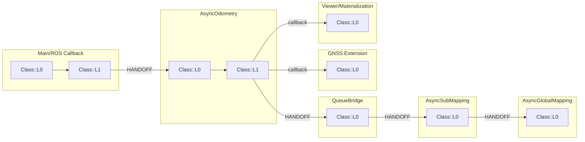

# IAP 变量-函数脉络图最小可用模板

本文档是一次性产出的主模板，但结构设计为可复用更新。

## 1. 目标与边界

### 1.1 覆盖边界
- 必含模块：odometry、sub-mapping、global-mapping、gnss、viewer。
- 必含线程泳道：
  - Main/ROS Callback
  - AsyncOdometry
  - QueueBridge
  - AsyncSubMapping
  - AsyncGlobalMapping
  - GNSS Extension
  - Viewer/Materialization

### 1.2 展开深度
- 每个主流程函数最多向下展开 3 层调用。
- 深度定义：
  - L0：主干函数
  - L1：L0 直接调用
  - L2：L1 直接调用
  - L3：L2 直接调用

### 1.3 变量粒度
- 必跟踪：状态变量与关键容器。
- 函数内局部变量：仅列出，不画全量依赖边。

### 1.4 输入输出定义
- 输入：函数参数 + 读取的成员变量。
- 输出：返回值 + 写入的成员变量 + 发送到队列/回调/发布链的对象。

---

## 2. 交付目录结构（建议）

将图谱与账本分离，保证可维护。

```text
src/iap/docs/topology/
  00_scope_legend.md
  10_swimlane_mainline.md
  20_function_cards.md
  30_variable_ledger.md
  40_cross_thread_handoffs.md
  90_update_checklist.md
```

最小可用版本可以先只产出：
- 10_swimlane_mainline.md
- 20_function_cards.md
- 30_variable_ledger.md

---

## 3. 图例规范（Legend）

### 3.1 节点类型
- 主干函数节点（L0）：粗边框矩形。
- 子函数节点（L1-L3）：普通矩形。
- 状态变量节点（S 级）：圆角矩形。
- 关键容器节点（C 级）：六边形。
- 局部变量节点（L 级）：仅在函数卡片中列表，不在总图铺开。

### 3.2 边类型
- 调用边：实线。
- 读成员变量：虚线，标注 R。
- 写成员变量：实线，标注 W。
- 跨线程移交（queue/callback）：加粗实线，标注 HANDOFF。
- 输入参数/返回值：点划线，标注 IN/OUT。

### 3.3 命名规则
- 函数节点名：Class::Function。
- 变量节点名：Class.member。
- 局部变量名：local@Class::Function::var。
- 线程泳道统一前缀：
  - T0_Main
  - T1_Odom
  - T2_Bridge
  - T3_Sub
  - T4_Global
  - T5_GNSS
  - T6_Viewer

---

## 4. 变量分级规则

### 4.1 S 级（State）
判定条件：
- 跨帧持久化。
- 直接影响位姿、速度、偏置、时钟、图优化状态。

示例类型：
- 图状态键集合、滑窗状态、估计帧核心状态。

必填字段：
- 所属 class
- 生命周期（初始化/更新/边缘化/回写）
- 主写入点
- 主读取点

### 4.2 C 级（Container）
判定条件：
- 承载跨函数或跨线程的数据移交。
- 容量、时序、淘汰策略影响行为。

示例类型：
- IMU/Frame 队列、submap 队列、epoch 缓冲、keyframe 容器。

必填字段：
- 生产者
- 消费者
- 入队/出队条件
- 清理策略

### 4.3 L 级（Local）
判定条件：
- 仅函数内短生命周期。

记录规则：
- 只在函数卡片列出 名称/类型/用途。
- 不在总图单独建节点，除非是关键中间结果（例如直接决定分支与异常处理）。

---

## 5. 主干函数树模板（3 层）

按线程泳道填写，先主干后展开。

| Lane | L0 主干函数 | L1 调用 | L2 调用 | L3 调用 | 备注 |
|---|---|---|---|---|---|
| T0_Main | TODO | TODO | TODO | TODO | |
| T1_Odom | TODO | TODO | TODO | TODO | |
| T2_Bridge | TODO | TODO | TODO | TODO | |
| T3_Sub | TODO | TODO | TODO | TODO | |
| T4_Global | TODO | TODO | TODO | TODO | |
| T5_GNSS | TODO | TODO | TODO | TODO | |
| T6_Viewer | TODO | TODO | TODO | TODO | |

---

## 6. 函数卡片模板（每个 L0 一张）

### Function Card: Class::Function

| 字段 | 内容 |
|---|---|
| 所属线程泳道 | T?_XXX |
| 所属 class | TODO |
| 触发条件 | TODO |
| 上游调用者 | TODO |
| 下游调用（L1-L3） | TODO |
| 输入参数 | TODO |
| 返回值 | TODO |
| 读取成员变量 | TODO |
| 写入成员变量 | TODO |
| 读写关键容器 | TODO |
| 产生的跨线程移交 | TODO |
| 副作用（回调/发布/日志/文件） | TODO |

局部变量列表（仅列出）：

| 局部变量 | 类型 | 用途 | 是否关键分支变量 |
|---|---|---|---|
| TODO | TODO | TODO | YES/NO |

---

## 7. 变量账本模板

| 变量名 | 分级(S/C/L) | 所属 class | 类型 | 初始化位置 | 主写入点 | 主读取点 | 生命周期结束条件 |
|---|---|---|---|---|---|---|---|
| TODO | TODO | TODO | TODO | TODO | TODO | TODO | TODO |

---

## 8. 跨线程移交模板

| 数据对象 | 生产线程/函数 | 消费线程/函数 | 移交方式 | 时序约束 | 失败症状 |
|---|---|---|---|---|---|
| TODO | TODO | TODO | queue/callback | TODO | TODO |

---

## 9. Mermaid 最小骨架（强制泳道）



---

## 10. 一次性产出与后续复用规则

### 10.1 一次性产出要求
- 首版完成全边界覆盖（odometry/sub/global/gnss/viewer）。
- 每个 L0 主干函数至少有 1 张函数卡片。
- 变量账本至少覆盖全部 S 级与 C 级变量。

### 10.2 后续复用更新
- 新增函数：补主干表 + 函数卡片。
- 变量读写变化：仅更新变量账本对应条目。
- 线程移交变化：只改跨线程移交表，不重画整图。

### 10.3 版本标记建议
- 在文首记录：
  - 代码分支
  - 提交哈希
  - 生成日期
  - 维护人

---

## 11. 快速执行清单（MVP）

1. 先填 5) 主干函数树模板，锁定 L0-L3。
2. 再填 8) 跨线程移交模板，锁定泳道连接。
3. 接着填 6) 函数卡片（先 L0，后 L1）。
4. 最后补 7) 变量账本（先 S 级，再 C 级，最后 L 级列表）。

完成标准：可以从入口函数沿泳道追踪到 viewer/global 输出，并能看到每步读写了哪些成员变量与关键容器。

---

## 12. Implementation Progress

已启动 IAP 首版 topology graph 实施，当前产物：

1. 范围与图例: [src/iap/docs/topology/00_scope_legend.md](src/iap/docs/topology/00_scope_legend.md)
2. 主干泳道图: [src/iap/docs/topology/10_swimlane_mainline.md](src/iap/docs/topology/10_swimlane_mainline.md)
3. 主流程函数卡片(L0): [src/iap/docs/topology/20_function_cards.md](src/iap/docs/topology/20_function_cards.md)
4. 变量账本(S/C/L 首版): [src/iap/docs/topology/30_variable_ledger.md](src/iap/docs/topology/30_variable_ledger.md)
5. 跨线程移交矩阵: [src/iap/docs/topology/40_cross_thread_handoffs.md](src/iap/docs/topology/40_cross_thread_handoffs.md)

下一步将按该模板继续补全 L1-L3 深度与变量读写点锚定。