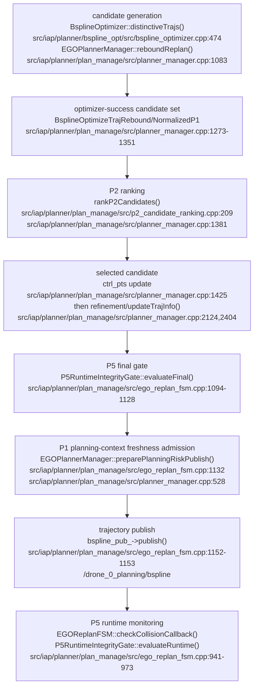

# ICRA 2027 P0 + P2 + P5 实际代码映射

> 基线：`dev/icra`，`21180f3`（2026-08-16 检查）。下列行号均以该提交为基准，采用一基行号。本文只描述当前代码；“ICRA 处理”列是会议分支的隔离或补测要求，不代表缺口已经实现。

## 1. 总体边界

- P0 是 planner-side advisory prediction grid。当前 certified integrity 由 `/iap/integrity` 输入，P0 predictor 不发布或改写 current certified PL/AL/IM：`include/iap/predictor/predictor_types.hpp:2`，`iap::PredictorQueryInput`。
- P2 只对 `EGOPlannerManager::reboundReplan()` 已经优化成功的候选排序；它不是候选生成器，也不是 hard-safety gate：`src/iap/planner/plan_manage/src/planner_manager.cpp:1273`，`rankP2Candidates()`。
- P5 是独立 hard-safety authority。final gate 位于本机 B-spline 发布前，runtime gate 监控已提交轨迹：`src/iap/planner/plan_manage/src/ego_replan_fsm.cpp:1094`、`:1153`、`:941`，`EGOReplanFSM::callReboundReplan()` / `checkCollisionCallback()`。
- 当前没有名为 `icra` 的 safety profile；正式 profile 隔离需要新增配置，但应保留 P1/P3/P4 源码和编译目标。

## 2. P0：risk grid / snapshot

| 项目 | 当前代码位置 | 当前行为 | 已有测试 | 缺口 | ICRA 处理 |
|---|---|---|---|---|---|
| 核心类型 | `include/iap/planner/risk_grid_map.hpp:76`、`:95`、`:123`、`:230`、`:279`；`RiskGridMapParams`、`RiskGridHealth`、`RiskVoxel`、`RiskGridSnapshot`、`RiskGridMap` | `RiskGridMap` 持有 active generation；consumer 获得只读 `RiskGridSnapshot`。voxel 保存 `c_pi/hpl_pred/vpl_pred/stamp/valid/stale/unknown/source_flags/reason`。 | `test_risk_grid_map`，`CMakeLists.txt:632` | 无显式 schema/version 字段。 | 文档和实验 manifest 绑定 commit、generation 和参数，不改变类型。 |
| generation / snapshot 实现 | `src/iap/planner/risk_grid_map.cpp:155`，`RiskGridSnapshot::Generation`；`:821`，`RiskGridMap::acquireSnapshot()` | generation 拥有 params、health、geometry、stamp、ID 和完整 voxel vector；snapshot 通过 `shared_ptr<const Generation>` 保持不可变旧代。 | `test_risk_grid_map`；`test_planning_risk_context`，`src/iap/planner/plan_manage/CMakeLists.txt:165` | 没有跨进程 snapshot ID 服务；只在本进程共享对象。 | 以 `generation_id` 和 `stamp_s` 作为证据身份。 |
| planner 调用入口 | `src/iap/planner/plan_manage/src/planner_manager.cpp:140`、`:233`、`:296`；`EGOPlannerManager::initPlanModules()` / `acquireRiskGridSnapshot()` | manager 创建 `P0RiskGridRuntime`，注入 inflated occupancy 和冻结 occupancy diagnostic query；P2/P5 经 manager 获取 snapshot。 | `test_p0_risk_grid_runtime`；`test_planning_risk_context` | P0 frame 没有独立参数接入 manager 的 `trajectory_frame_id_`。 | ICRA 固定 `grid_map/frame_id=map`，并在 manifest 校验。 |
| runtime gate | `src/iap/planner/plan_manage/src/p0_risk_grid_runtime.cpp:588`，`P0RiskGridRuntime::createIfEnabled()`；`:696`，`createRosInterfaces()` | `p0.enable_risk_grid=false` 时不创建 runtime；enabled 后创建输入、refresh、health callback group 和 wall timers。 | `P0RiskGridRuntimeTest.DisabledConfigCreatesNoRuntimeObject`，`src/iap/planner/plan_manage/test/test_p0_risk_grid_runtime.cpp:313` | 无动态开关；参数在节点初始化时读取。 | profile 启动时固定 enabled，不依赖运行期切换。 |
| current snapshot 创建 | `src/iap/planner/plan_manage/src/p0_risk_grid_runtime.cpp:1459`、`:1533`；`P0RiskGridRuntime::currentFromMsg()` / `buildSnapshot()`；`src/iap/planner/integrity_snapshot.cpp:23`，`IntegritySnapshotBuilder::build_from_latest()` | 在锁内一致复制 odom、current integrity、GNSS epoch；要求 pose 和 current integrity 有效。current 值直接复制 `/iap/integrity`，可选地只把 current PL 转为 advisory predictor prior information。 | `test_integrity_snapshot`，`CMakeLists.txt:620`；P0 runtime stamp/snapshot tests | current prior 的 `k_h=k_v=5` 是代码常量，不是 launch 参数。 | 保持 current/advisory 边界；报告 prior 是否启用及 provenance flag。 |
| refresh 时间 | `src/iap/planner/plan_manage/src/p0_risk_grid_runtime.cpp:811`，`P0RiskGridRuntime::refreshTimerCallback()`；`:817`；health callback `:785` | refresh 使用 `currentMessageStamp()`：优先 odom stamp，缺失时使用 current integrity stamp；wall timer 只触发调用，不把 wall-clock 写成 grid stamp。 | `OdomStampIsPreferredForRefreshTime`、`CurrentStampIsFallbackWhenOdomInvalid`、`RefreshSnapshotUsesMessageStamp`，同一 P0 test target | message stamp 不可用时 refresh 失败并保留旧代。 | 正式实验同时记录 message-time 与 steady-time 性能字段。 |
| grid 创建和原子更新 | `src/iap/planner/risk_grid_map.cpp:911`、`:955`、`:1047`、`:1193`；`RiskGridMap::refreshFromProvider()` | 先冻结 geometry/params/generation；遍历全部 horizon × x × y × z，构造 `query_time=now+horizon`；provider batch 全部返回后构造新 generation，最后在 mutex 内一次替换 active。refresh 失败不会发布半成品。 | `test_risk_grid_map`；P0 runtime generation tests | 没有 incremental/rolling generation 更新。 | 会议性能口径按完整 generation refresh 统计。 |
| frame | `include/iap/planner/risk_grid_map.hpp:77`；`src/iap/planner/plan_manage/src/p0_risk_grid_runtime.cpp:207`；`src/iap/planner/plan_manage/src/planner_manager.cpp:225` | risk grid 默认 frame 为 `map`；predictor query 构造时硬编码 `"map"`。manager 另从 `grid_map/frame_id` 读取轨迹 frame；没有 `p0.frame_id` 参数。 | predictor frame validation，`src/iap/predictor/predictor_module.cpp:292`，`test_predictor_module` | 两个 frame 只能靠配置约定保持一致。 | ICRA profile 固定 `grid_map/frame_id=map` 并在 preflight 拒绝其他值。 |
| Predictor query → P0 voxel | `src/iap/planner/plan_manage/src/p0_risk_grid_runtime.cpp:165`，`PredictorModuleRiskProvider::batchQuery()`；`:203`、`:211`；`src/iap/predictor/predictor_module.cpp:383`，`PredictorModule::queryBatch()`；`src/iap/planner/risk_grid_map.cpp:1022`、`:1082` | 同位置的各 horizon query 分组，构造 `PredictorQueryInput(position, IntegritySnapshot, query_time, horizon, map, snapshot.stamp)`；结果映射回原 voxel index。有效 result 写入 HPL/VPL，`c_pi=max(HPL,VPL)` 后 clamp；无效 result 写 unknown cost/reason。 | `test_predictor_module`、`test_risk_grid_map`、`test_p0_risk_grid_runtime` | P0 参数 `use_predictor_batch_query` 存在于类型但 runtime 没有分支使用。 | 把实际 batch 路径作为唯一会议口径，不宣称该布尔量可切换。 |
| current integrity / advisory prediction 边界 | `include/iap/planner/integrity_snapshot.hpp:18`、`:63`；`include/iap/predictor/predictor_types.hpp:2`；`src/iap/predictor/predictor_module.cpp:258` | `CurrentIntegrityState` 是 certified monitor 快照；predictor 只生成 advisory `PredictorQueryResult`。current stale 时 prior 被清除；若 GNSS/LiDAR 仍可用，advisory 可继续有效并标记 `stale_current_prior`。 | `test_integrity_snapshot`、`test_predictor_module` | P0 health 可能 ready，但 current prior 已 stale；需看 source flags/reason，不能只看 ready。 | 结果表同时报告 current freshness、source provenance 和 P0 ratios。 |
| source provenance | `include/iap/predictor/predictor_types.hpp:223`，`PredictorResultFlags`；`src/iap/predictor/predictor_module.cpp:10`，`make_source_flags()`；`src/iap/planner/risk_grid_map.cpp:1102` | 每个 voxel 保存 flags：available/valid/fallback、GNSS/LiDAR/fusion/prior、regularized、conservative-max、stale-current-prior；health 聚合对应计数。occupied skip 使用 `RISK_GRID_SOURCE_OCCUPIED_SKIP`。 | provenance assertions in predictor/risk-grid/P0 runtime tests | generation 没有单一 `source_name`；混合源必须从 flags/aggregate 解释。 | CSV/manifest 保留 flags 和 aggregate counters，不折叠成模糊标签。 |
| `ready/stale` 来源 | `src/iap/planner/risk_grid_map.cpp:1154`、`:808`、`:1205`；`RiskGridMap::health(now_s)` / `markRefreshFailure()` | 成功构造完整 generation 后 `ready=true, stale=false`；动态 health 的 `age=max(0, now-active_stamp)`，超过 `stale_timeout_s` 才 stale。失败时若有旧 active，保留其 ratios 并更新 age/stale/reason。 | `test_risk_grid_map`；P0 raw health tests | `RiskGridSnapshot::health()` 返回 generation 创建时冻结的 health（通常 age=0）；动态 stale 应从 runtime raw health 或 voxel query 得到。 | P0 acceptance 使用 `/planning/risk_grid_health`；P2/P5 仍记录实际 query stale。 |
| `valid_ratio/unknown_ratio/reason` 来源 | `src/iap/planner/risk_grid_map.cpp:1067`、`:1154` | 分母是全部 horizon voxel，包括 occupied skip；valid 要求 provider result available、valid、非 stale 且 PL finite。全 unknown 时 `ready` 仍为 true，但 reason 改为 dominant unknown reason。 | P0-6 occupied skip tests；risk-grid health tests | `ready` 不是“有足够有效 voxel”的同义词。 | ICRA gate 同时检查 ready、stale、valid/unknown ratio 和 reason。 |
| snapshot 查询 | `src/iap/planner/risk_grid_map.cpp:573`，`RiskGridSnapshot::queryCost()`；`:662`，`queryPredictedPL()`；`:319`，`validate_corner()` | query 先按 `tau=query_time-generation_stamp` 选/插值 horizon，再做 8-corner trilinear interpolation；任一 required corner unknown/occupied/stale/invalid 即 conservative miss。stale 由 `query_time-voxel.stamp > stale_timeout` 判定。 | affine/interpolation/stale/occupied tests in `test_risk_grid_map` | 没有 consumer query-result cache。 | 保留 conservative corner 语义；P2/P5 缺口按 miss 分类。 |
| full-grid 性能路径 | `src/iap/planner/plan_manage/src/p0_risk_grid_runtime.cpp:915`、`:945`、`:972`；`PredictorModuleRiskProvider::batchQuery()` `:182`；`PredictorModule::queryBatch()` `src/iap/predictor/predictor_module.cpp:407` | 每次 refresh 计算 `Nx*Ny*Nz*Nh`；按位置分 worker，batch 内 LiDAR 以 `(x,y,z,snapshot_stamp)` 缓存，各 horizon 共用 LiDAR result；GNSS/fusion 仍逐 query。health 输出 refresh/provider duration、query/unique-position、LiDAR eval/cache hit 和 worker count。 | P0 runtime provider batching/performance diagnostics tests | generation 之间没有 reuse；候选轨迹采样成本约为样本数 × horizon/8-corner 插值。 | 正式性能报告必须用 raw health 的 full-grid 指标，不用候选数反推。 |
| launch arguments / node parameters | declarations `launch/test_planner.launch.py:894`；node pass-through `:1543`；runtime declarations `src/iap/planner/plan_manage/src/p0_risk_grid_runtime.cpp:269` | 核心开关/geometry/time：`p0.enable_risk_grid`、`p0.resolution_m`、`p0.size_x_m`、`p0.size_y_m`、`p0.size_z_m`、`p0.horizons_s`、`p0.refresh_period_s`、`p0.stale_timeout_s`、`p0.skip_occupied_voxels`、`p0.debug_metrics_enable`。输入/health：`p0.odom_topic`、`p0.integrity_topic`、`p0.range_meas_topic`、`p0.ephem_topic`、`p0.glo_ephem_topic`、`p0.receiver_lla_topic`、`p0.iono_topic`、`p0.map_topic`、`p0.health_topic`、`p0.gnss_epoch_max_age_s`。predictor：`p0.predictor.source_mode`、`p0.predictor.gnss_epoch_policy`、`p0.predictor.use_current_integrity_prior`、`p0.predictor.conservative_max_with_gnss`、`p0.predictor.lidar_legacy_observability`、`p0.predictor.lidar_fim_radius_m`、`p0.predictor.worker_count`。 | launch Python compile/checks；P0 config override tests；raw health absolute-topic unit test | `p0.health_topic` 仅兼容声明，authoritative publisher 固定绝对 `/planning/risk_grid_health`；`p0_6.fixture.*` 及 `p5_3/4/6/7.fixture.*` 是实验 fixture 参数，不是核心 P0 API。 | 正式会议实验统一走 `test_planner.launch.py`，保存这些 effective values 和 fixture values。 |
| advanced launch 差异 | `src/iap/planner/plan_manage/launch/advanced_param.launch.py:456` | advanced launch 传入上述 geometry/time、输入 topics、`p0.health_topic`，但不传 `p0.gnss_epoch_max_age_s` 或任何 `p0.predictor.*`，因此使用 runtime 默认值。 | Python syntax/launch construction | 两个入口并非同一参数面；从 advanced launch 运行不能证明 test launch 的 predictor 配置。 | ICRA 不使用 advanced launch；若必须使用，先补齐参数并记录 manifest。 |
| YAML | `launch/test_planner.launch.py:1495`、`src/iap/planner/plan_manage/launch/advanced_param.launch.py:420` | P0/P2/P5 planner 参数均以 launch `Node(parameters=[...])` inline 传入；`config/` 下没有包含 `p0.*` 的 planner YAML。ARAIM YAML 属于 current integrity producer，不是 P0 grid 配置。 | `rg 'p0\\.' config` 当前无命中 | 不能把 ARAIM YAML 误写成 P0 YAML。 | CODE_MAP 明确记录“无 P0 YAML”；后续 profile 若加 YAML，另行更新映射。 |
| health topic | `src/iap/planner/plan_manage/src/p0_risk_grid_runtime.cpp:761`、`:972` | 无论 `p0.debug_metrics_enable`，机器可读 JSON 都发布到绝对 `/planning/risk_grid_health`；包含核心 health、provenance 和性能字段。 | `RawHealthTopicIsAbsoluteAndIndependentOfDebugFlag`，`src/iap/planner/plan_manage/test/test_p0_risk_grid_runtime.cpp:609` | launch arg `p0.health_topic` 实际不会改变 authoritative topic。 | preflight 和 bag 固定检查绝对 topic。 |
| P0 RViz | `src/iap/planner/plan_manage/include/ego_planner/safety_rviz_publisher.h:133`；publisher `src/iap/planner/plan_manage/src/safety_rviz_publisher.cpp:305`；调用 `src/iap/planner/plan_manage/src/p0_risk_grid_runtime.cpp:963` | `/iap/rviz/risk_grid_health`、`/iap/rviz/predicted_pl_cloud`、`/iap/rviz/risk_validity_cloud`；validity cloud 受 `safety_viz.enable_validity_cloud` 控制。 | SafetyRvizPublisher tests included in P0/P5 targets | RViz 是诊断，不是 acceptance source。 | 正式判定使用 raw topic/CSV，RViz 只作图。 |
| 单测入口 | `CMakeLists.txt:620`、`:630`、`:632`；`src/iap/planner/plan_manage/CMakeLists.txt:104`、`:165` | `test_integrity_snapshot`、`test_predictor_module`、`test_risk_grid_map`、`test_p0_risk_grid_runtime`、`test_planning_risk_context`。 | 以上目标存在。 | 单测不能替代带真实 ROS 时间/topic 的系统验证。 | 作为 ICRA pre-merge 必跑集合。 |
| 正式实验入口 | presets `launch/test_planner.launch.py:541`、`:568`、`:580`、`:592`；analyzers `scripts/dev_planner/analyze_planner_p0_phase1.py:829`、`scripts/dev_planner/analyze_safety_planner_run.py:20640`；analyzer tests `test/test_analyze_safety_planner_run_p0_6.py:1` | `p0_open_sky`、`p0_degraded_lidar_good`、`p0_corridor_degenerate`、`p0_fallback_only`；统一 analyzer 支持 `--experiment-id P0-*`，P0 phase-1 analyzer 读取 export/bag。 | analyzer Python tests | 部分历史 analyzer 分支仍含旧 blocked-fixture 文案，不能当作当前 launch 能力证明。 | 以实际运行 manifest、bag 和 analyzer exit 为正式证据。 |

## 3. P2：successful candidate ranking

| 项目 | 当前代码位置 | 当前行为 | 已有测试 | 缺口 | ICRA 处理 |
|---|---|---|---|---|---|
| 候选生成 | `src/iap/planner/bspline_opt/src/bspline_optimizer.cpp:474`，`BsplineOptimizer::distinctiveTrajs()`；调用 `src/iap/planner/plan_manage/src/planner_manager.cpp:1083` | `manager/use_distinctive_trajs` 开启时，optimizer 从 collision segments 生成 topology/control-point seeds。P1 collision fanout 和 P1 gradient supplement 还可在 `src/iap/planner/plan_manage/src/planner_manager.cpp:1093`、`:1211` 改变集合。 | optimizer/P1 candidate tests；`test_planning_risk_context` | P2 自己不生成候选；P1 配置未隔离时，P2 输入集合可能已被 P1 改写。 | ICRA 关闭 P1 fanout/supplement，仅对 base planner 成功候选排序。 |
| “成功候选”条件 | `src/iap/planner/plan_manage/src/planner_manager.cpp:1273`、`:1284`、`:1291`、`:1322` | optimizer 返回 success；若 collision fanout active，还要求 `evaluateP1FixedLatticeRisk().full_support`。只有通过者写入 `p2_candidates`。 | manager/P1 support tests；P2 unit inputs 默认 `opt_success=true` | P2 API 不重新验证 collision/feasibility，只信任上游 success vector。 | 系统测试证明进入 P2 的每个候选均为同次 attempt 的 base optimizer success。 |
| candidate identity | `src/iap/planner/plan_manage/src/planner_manager.cpp:1275`、`:1346`；`src/iap/planner/plan_manage/include/ego_planner/p2_candidate_ranking.h:34` | ID 是本次 `trajs` 逆序循环生成的 `int` 序号 `trajs.size()-i`；`P2CandidateInput` 只含 ID、control points、final cost、cost breakdown。 | CSV/selection unit tests | 无稳定跨 attempt identity、control-point hash 或 source topology ID。 | 增补系统证据时记录 attempt ID、set hash 和 control-point hash；不把当前整数当全局 ID。 |
| 是否同一 planning attempt | `EGOPlannerManager::reboundReplan()` `src/iap/planner/plan_manage/src/planner_manager.cpp:768`；候选循环 `:1273`；P2 调用 `:1381` | 单次函数调用中收集 vector 后一次性排名，因此按控制流属于同一 replan 调用。 | `test_planning_risk_context` 验证 context generation lifecycle | `P2CandidateInput`/`rankP2Candidates()` 没有 `planning_attempt_id` 参数，无法在接口边界验证。 | ICRA 必须补 attempt/set identity 系统断言；当前只可写“控制流同次”，不可写“接口保证”。 |
| P2 获得集合的位置 | `src/iap/planner/plan_manage/src/planner_manager.cpp:1374`，`EGOPlannerManager::reboundReplan()` | manager 在所有候选优化结束后将完整 success vector 交给 `rankP2Candidates()`。 | `test_p2_candidate_ranking` | 无 producer/consumer schema version。 | 保持 P2 位于 manager 层，不下沉到 optimizer 生成新候选。 |
| original optimizer cost | `src/iap/planner/bspline_opt/src/bspline_optimizer.cpp:4692`、`:4699`；`BsplineOptimizer::combineCostRebound()` | `original_cost = λsmooth*smoothness + λcollision*distance + λfeasibility*feasibility + λcollision*swarm + λterminal*terminal`；写入 breakdown `:4712`。 | `NormalizationUsesOriginalCostNotTotalCost`，`src/iap/planner/plan_manage/test/test_p2_candidate_ranking.cpp:129` | cost components 没有在 P2 CSV 分列。 | ICRA 排名只使用 `original_cost`，与 P1 total 隔离。 |
| `total_cost` / P1 cost | `src/iap/planner/bspline_opt/include/bspline_opt/bspline_optimizer.h:179`；`src/iap/planner/bspline_opt/src/bspline_optimizer.cpp:4755`、`:4814` | P1 enabled 时会把 normalized/raw integrity 和 anchor 加入 `f_combine`，最终写 `total_cost`；breakdown 同时保留 `original_cost` 和 `integrity_cost`。 | `NormalizationUsesOriginalCostNotTotalCost` | P2 CSV 记录 total，但 enabled ranking 不用；名称容易误读。 | 论文/文档明确优化器 score 的来源，禁止把 total 当 P2 optimizer term。 |
| P2 integrity score | `src/iap/planner/plan_manage/src/p2_candidate_ranking.cpp:84`、`:247` | B-spline 按 `p2.sample_dt_s` 采样 P0 `queryCost()`；`J_int = mean + w_max*max + w_unknown*unknown_ratio + w_stale*stale_ratio`；`score = normalized(original_cost) + lambda*J_int`。 | enabled ranking unit test | mean 只对 hit 样本求均值；unknown/stale 通过比例罚项进入。无单独保存 `J_int` 字段。 | 报告公式和每一项原始 metric，不从 `total_cost` 反推。 |
| metrics-only | `src/iap/planner/plan_manage/src/p2_candidate_ranking.cpp:260`、`:284` | enabled + `metrics_only=true` 时仍采样、算 score、写 debug，但 winner 保持最小 `original_cost`；fallback reason=`metrics_only`。 | `MetricsOnlyPreservesOriginalCostWinner` | manager 后续 P1 formal helper 仍可能覆盖 winner。 | ICRA metrics-only 实验同时关闭所有 P1 formal/fanout 参数。 |
| enabled | `src/iap/planner/plan_manage/src/p2_candidate_ranking.cpp:284` | snapshot 存在、至少一个 candidate 达到 `min_valid_ratio`、且非 metrics-only 时，按最小 candidate score 选 winner。 | `RankingEnabledSelectsCandidateScoreWinner` | 只要求“任一”candidate 达标；低有效率 candidate 仍可参与 score 比较。 | 在系统测试中要求整个 set 的比较域一致；当前行为列为缺口，不包装成保证。 |
| disabled | `src/iap/planner/plan_manage/src/p2_candidate_ranking.cpp:18`、`:225` | 不采样 P0，按 `P2CandidateInput::final_cost` 最小值选 winner，返回 fallback=`disabled`。 | `DisabledSelectsOriginalRuntimeWinnerByFinalCost` | `final_cost` 来自 optimizer；P1 开启时它可能已是包含 P1 的 total。测试名称中的 “Original” 不等于 breakdown `original_cost`。 | ICRA 关闭 P1 后 disabled baseline 才可解释为 base optimizer winner。 |
| winner 更新 | `src/iap/planner/plan_manage/src/planner_manager.cpp:1381`、`:1425` | P2 result 先更新 `ctrl_pts` 和 selected candidate ID。 | ranking unit tests | P1 selection `src/iap/planner/plan_manage/src/planner_manager.cpp:1522`、`:1543` 可再次覆盖 `ctrl_pts`；RViz selected 还可能被 raw P2 metrics 覆写。 | ICRA 关闭 P1 及 formal override；补 selected-ID/control-point 一致性测试。 |
| single candidate | `src/iap/planner/plan_manage/src/p2_candidate_ranking.cpp:56`、`:270` | 无专门分支；min selectors 自然返回 index 0。若该候选有效且 enabled，仍标记 `used_integrity_ranking=true`，虽然不存在相对选择。 | 无 | 缺少 single-candidate 语义测试和 no-op reason。 | ICRA 系统统计单候选 attempt，论文不把它计作 P2 selection improvement。 |
| low-valid fallback | `src/iap/planner/plan_manage/src/p2_candidate_ranking.cpp:270` | 所有候选 `valid_ratio < min_valid_ratio` 才 fallback 到最小 original cost，reason=`valid_ratio_too_low`。 | `LowValidRatioFallsBackToOriginalCost` | 混合有效率集合不 fail closed。 | 补全-set consistency/coverage gate 测试；当前 behavior 如实报告。 |
| unknown / stale | `src/iap/planner/plan_manage/src/p2_candidate_ranking.cpp:75`、`:125` | query miss 中 reason 含 `stale` 或 sample.stale 计 stale，其余计 unknown；两者进入加权 penalty。snapshot null 则 fallback original。 | snapshot-unavailable、all-unknown tests | 不检查动态 `RiskGridMap::health(now)`；只依赖逐 sample query。 | 系统测试覆盖 post-refresh stale、unknown 和 mixed candidate。 |
| NaN | `src/iap/planner/plan_manage/src/p2_candidate_ranking.cpp:233`、`:247`、`:56` | sampling config/trajectory 有有限性检查，但 original/final cost 和最终 score 没有统一 finite guard；NaN 比较会保留先遇候选。 | 无 | 缺少 NaN/Inf optimizer cost test。 | ICRA 进入正式实验前补 fail-closed/filtered candidate 规则。 |
| same snapshot | `src/iap/planner/plan_manage/src/planner_manager.cpp:1376`；`rankP2Candidates()` 参数 `src/iap/planner/plan_manage/include/ego_planner/p2_candidate_ranking.h:71` | P2 enabled 时整次调用传同一个 `planning_snapshot` shared pointer；每条 metric 写相同 generation ID。 | immutable context tests | 函数不验证各 candidate 的生成/优化是否绑定该 snapshot；input 无 generation 字段。 | 增加 candidate→attempt→generation 证据链。 |
| debug CSV | `src/iap/planner/plan_manage/src/p2_candidate_ranking.cpp:166`；launch path `launch/test_planner.launch.py:1449` | enabled + `p2.debug_csv_enable` 时追加 `planner_p2_candidate_ranking_debug.csv`；含 batch/candidate/costs/ratios/generation/score/selected/reason。 | unit tests不验证文件 schema | 无 attempt ID、candidate-set hash、control-point hash；P2 disabled 不写 CSV。 | 会议系统测试先补 identity/provenance 字段。 |
| topic / RViz | `src/iap/planner/plan_manage/include/ego_planner/safety_rviz_publisher.h:145`；`src/iap/planner/plan_manage/src/safety_rviz_publisher.cpp:341`；manager call `src/iap/planner/plan_manage/src/planner_manager.cpp:1394` | 只有 RViz MarkerArray `/iap/rviz/p2_candidate_trajectories`，受 `safety_viz.enable_p2_viz` 控制；没有独立机器可读 P2 topic。 | visualization code linked into planning context target | RViz selected 标志可能与 P1 后置 override 不一致。 | 正式证据以 CSV/新增 identity artifact 为准，RViz 只诊断。 |
| 单测 | `src/iap/planner/plan_manage/CMakeLists.txt:142`；`src/iap/planner/plan_manage/test/test_p2_candidate_ranking.cpp:114` | `test_p2_candidate_ranking` 当前 6 个 case：disabled、original-not-total、metrics-only、enabled winner、snapshot unavailable、low-valid/all-unknown。 | 6/6 目标 case 存在 | 缺 single、mixed-valid、stale health、NaN、attempt/set identity、P2→publish integration。 | 列为 ICRA 前置补测清单。 |
| 系统实验 | `launch/test_planner.launch.py:677`，preset `p2_degraded_lidar_good` | preset 开 P2、distinctive trajectories、CSV 和 RViz。 | launch preset | `scripts/dev_planner/analyze_safety_planner_run.py` 没有 P2-specific formal phase/analyzer；无当前 P2 正式系统验收。 | 新增 P2 same-attempt/same-set/same-snapshot ranking experiment 后才用于论文结论。 |

### 3.1 P2 五项特别验证

| 问题 | 当前结论 | 代码证据 | ICRA 风险/处理 |
|---|---|---|---|
| P2 是否可能读取包含 P1 的 `total cost` | **P2 enabled/metrics-only 的 ranking 不读取 `total_cost`，只读取 `original_cost`。P2 disabled 读取 `final_cost`，该值在 P1 optimizer path 下可能包含 P1。** | `src/iap/planner/plan_manage/src/p2_candidate_ranking.cpp:225`、`:233`、`:247`；`src/iap/planner/bspline_opt/src/bspline_optimizer.cpp:4755`、`:4814` | 关闭 P1 后建立 base baseline；保留 original-vs-total 单测。 |
| P2 是否会生成新候选 | **不会。** | 生成在 `BsplineOptimizer::distinctiveTrajs()` 和 manager P1 fanout；P2 入口只接收 `const vector<P2CandidateInput>&`：`src/iap/planner/plan_manage/include/ego_planner/p2_candidate_ranking.h:71` | 保持模块边界；关闭 P1 生成旁路。 |
| P2 是否会把候选直接判为 hard unsafe | **不会。** 只加 soft score 或 fallback；hard rejection 属于 P5 final/runtime。 | `src/iap/planner/plan_manage/src/p2_candidate_ranking.cpp:242`、`:284`；`src/iap/planner/plan_manage/src/ego_replan_fsm.cpp:1111` | 论文明确 P5 是唯一 hard-safety authority。 |
| P2 是否能在 candidate set 不一致时进行比较 | **代码会比较，但不能检测不一致。** 没有 attempt ID、set identity、trajectory domain/version 检查。 | `P2CandidateInput` `src/iap/planner/plan_manage/include/ego_planner/p2_candidate_ranking.h:34`；`rankP2Candidates()` `:71` | ICRA 需补接口/系统 identity 证据后，才能宣称 same set。 |
| P2 是否能绑定同一 P0 snapshot | **单次 rank 调用共享一个 snapshot，但 candidate 本身没有 snapshot binding。P5 final 还会获取最新 snapshot。** | `src/iap/planner/plan_manage/src/planner_manager.cpp:1376`、`:1381`；`src/iap/planner/plan_manage/src/ego_replan_fsm.cpp:1098`、`:1103` | 为 P2 候选补 generation binding；将 P5 latest-generation policy作为独立事实报告。 |

## 4. P5：final gate 和 runtime monitoring

| 项目 | 当前代码位置 | 当前行为 | 已有测试 | 缺口 | ICRA 处理 |
|---|---|---|---|---|---|
| runtime/final gate 开关 | `src/iap/planner/plan_manage/src/p5_runtime_integrity_gate.cpp:436`、`:513`；`P5RuntimeIntegrityGate::declareAndReadConfig()` / `createIfEnabled()` | `p5.enable_runtime_gate`、`p5.enable_final_gate` 独立；两者皆 false 时 manager 不创建 P5 object。 | disabled/config unit cases in `test_p5_runtime_integrity_gate` | 无动态运行期开关。 | profile 固定两者 true；disabled baseline 固定两者 false。 |
| current integrity 输入 | `src/iap/planner/plan_manage/src/p5_runtime_integrity_gate.cpp:575`、`:1239`；`createRosInterfaces()` / `currentFromMsg()` | 订阅 `p5.integrity_topic`（默认 `/iap/integrity`）；复制 HPL/VPL/HAL/VAL/IM，要求 finite 且消息 invalid flags 均 false。 | current valid/invalid/stale tests | P5 重新计算 current IM，而不是信任 `msg.im` 作为 gate 数值；`msg.im` 只参与 valid 判定。 | 报告 `IM_H=HAL-HPL`、`IM_V=VAL-VPL` 和 min。 |
| current gate | `src/iap/planner/plan_manage/src/p5_runtime_integrity_gate.cpp:684`、`:709`、`:761`，`evaluateCurrentGate()` | `current_im_min=min(HAL-HPL,VAL-VPL)`。invalid 立即 request replan；valid message 的 age 先达到 `p5.current_stale_to_replan_s` 才进入 stale，并由 runtime 首次记录 `current_problem_started_s_`，stale duration 再达到 `p5.current_stale_to_replan_s` 才 request replan，达到 `p5.current_stale_to_emergency_s` 才成为 emergency candidate。低 margin 按 margin 与持续时间处理。 | current stale/low-margin/debounce tests | final 调用传 `update_state=false`，不会启动 stale/low-margin duration timer；final-only 与 runtime+final 的时序不同。 | 两种配置分别系统验证，不把 age 阈值误写成 action 阈值。 |
| future trajectory query | `src/iap/planner/plan_manage/src/p5_runtime_integrity_gate.cpp:780`、`:858`；`evaluateFutureGate()` | 对 `LocalTrajData::position_traj_` 从当前 `t_cur` 到 `min(duration,t_cur+horizon)` 按 `sample_dt` 采样；调用 `RiskGridSnapshot::queryPredictedPL(p, now+tau, ..., tau, final_gate)`。 | `FutureSamplesCarryTrajectoryTiming`、coverage-tail、fixture tests | snapshot coverage 尾部 miss 可被判定为 coverage limit 并跳过；需报告实际 sample count。 | 正式 hard gate 检查 sample coverage/unknown ratio。 |
| PL | `src/iap/planner/risk_grid_map.cpp:662`，`RiskGridSnapshot::queryPredictedPL()` | 从同一 P0 generation 对 HPL/VPL 做 temporal + trilinear interpolation；fixture 可在测试场景覆盖 result。 | risk-grid PL query and P5 fixture tests | P5 不直接调用 predictor；依赖最近完成的 P0 generation。 | 绑定 P0 generation、stamp、query tau。 |
| AL | `src/iap/planner/plan_manage/include/ego_planner/p5_runtime_integrity_gate.h:39`；实现 `src/iap/planner/plan_manage/src/p5_runtime_integrity_gate.cpp:223`、`:295`、`:307`、`:319`、`:341` | `PredAlertLimitProvider` 支持 `current_msg_constant`、`config_constant`、`occupancy_clearance`、`vertical_bound_only`；clearance 模式从 planner occupancy/map bounds 算 HAL/VAL。 | current/config/vertical/invalid AL unit tests | AL mode 是运行参数，论文必须固定，不能混合实验。 | ICRA manifest 固定 mode 与全部 bounds/scale 参数。 |
| future IM | `src/iap/planner/plan_manage/src/p5_runtime_integrity_gate.cpp:907` | 每个有效样本 `IM=min(HAL-HPL_pred,VAL-VPL_pred)`；低于 future replan margin 计 bad。 | future bad/replan/emergency tests | P5 不使用 P0 `c_pi`；使用 HPL/VPL 与 AL。 | 论文和图表使用 PL/AL/IM 链，不用 P2 cost 替代。 |
| stale / unknown / NaN | `src/iap/planner/plan_manage/src/p5_runtime_integrity_gate.cpp:790`、`:897`、`:938`；`src/iap/planner/risk_grid_map.cpp:319` | snapshot null → unknown/replan；AL invalid、query miss、PL unavailable/invalid/stale/nonfinite 都计 unknown。unknown ratio 达阈值 replan，runtime 持续 unknown 可 emergency。voxel freshness由 query time 相对 voxel stamp判定。 | snapshot unavailable、unknown duration recovery、invalid AL、NaN tests | `snapshot->health().age_s` 是 generation 冻结值，P5 `field_age_s` 诊断通常为 0；真正 stale 主要由 voxel query 暴露。 | acceptance 不只读 `field_age_s`，同时检查 P0 raw health 和 P5 sample reasons。 |
| bad / emergency 策略 | `src/iap/planner/plan_manage/src/p5_runtime_integrity_gate.cpp:954` | first bad tau 在 FSM emergency window 内，或 minimum IM 低于 future emergency margin → emergency candidate；否则 bad ratio 超阈值 → replan。 | near/future bad tests | emergency action 先尝试 replanning；不是立即无条件 publish stop。 | 系统实验区分 request、replan 成功和最终 emergency state。 |
| debounce | `src/iap/planner/plan_manage/src/p5_runtime_integrity_gate.cpp:1032`，`applyDebounce()` | runtime emergency 立即通过；replan 需连续 `bad_tick_to_replan`；连续 good ticks 清状态。 | debounce/current tests | final gate 不走 tick debounce，而走 failure budget。 | runtime/final state 分开统计。 |
| final failure budget | `src/iap/planner/plan_manage/src/p5_runtime_integrity_gate.cpp:1077`，`applyFinalGateBudget()` | unknown-only、短暂 stale、轻微 current low margin 不累计 escalation budget；其他连续失败按 count/duration 升级为 `FINAL_GATE_FAILED` emergency candidate。无论是否累计，非 OK final status 都阻止本次发布。 | final startup/stale/budget/reset tests | 状态跨 final attempts 保存在 gate object。 | 记录 raw action/reason 与 budget 后 action/reason。 |
| final gate 调用 | `src/iap/planner/plan_manage/src/ego_replan_fsm.cpp:976`、`:1094`；`EGOReplanFSM::callReboundReplan()` | manager 规划并把最终/refined trajectory 写入 `local_data_` 后构造 Bspline message；P5 对该 `LocalTrajData` 评估。非 OK 时恢复 `previous_local_data` 并返回 false。 | `FinalGateFailureIsReturnedBeforePublishPath`、P5-7 fixture unit tests | 单测验证 gate return；发布顺序的完整 ROS integration 主要由 P5-7 analyzer证明。 | P5 是 hard-safety final gate；ICRA 关闭 P1 后，它也是正常轨迹发布前唯一会拒绝的 final admission。 |
| P1 pre-publish admission | `src/iap/planner/plan_manage/src/ego_replan_fsm.cpp:1132`；`EGOPlannerManager::preparePlanningRiskPublish()` `src/iap/planner/plan_manage/src/planner_manager.cpp:528` | P5 OK 后、publish 前仍检查 planning risk context freshness；仅当 context 不 fresh 且 `p1_objective_applied=true` 时阻止发布，否则按 base fallback 通过。 | `test_planning_risk_context`；P1 admission tests | P1 开启时不能称 P5 是“唯一 final admission”；此检查绑定 planning snapshot，而 P5 使用 latest snapshot。 | ICRA 将 P1 objective/metrics/fanout 全关，并在 manifest 证明 `p1_objective_applied=false`。 |
| snapshot policy | `src/iap/planner/plan_manage/src/ego_replan_fsm.cpp:1098`、`:1099` | final gate重新 `acquireRiskGridSnapshot()`；若与 planning generation 不同只 WARN，仍使用 latest generation。 | planning context immutable tests、P5 tests | P2 和 P5 final 不保证同一 P0 snapshot。 | ICRA 结果明确区分 P2 decision generation 与 P5 admission generation；若论文要求同代，需后续改代码。 |
| publish 顺序 | publisher创建 `src/iap/planner/plan_manage/src/ego_replan_fsm.cpp:123`；final `:1111`；publish `:1152`；remap `launch/test_planner.launch.py:1480` | final gate 确实发生在 `bspline_pub_->publish(bspline)` 之前。test launch 把相对 `planning/bspline` remap 为 drone-specific `bspline_topic`，当前 drone 0 证据 topic 为 `/drone_0_planning/bspline`。 | P5-7 analyzer含 publish timeline | emergency-stop trajectory 在 `src/iap/planner/plan_manage/src/ego_replan_fsm.cpp:1264` 直接发布，不再次经过 P5 final；它是安全停止命令。 | 文档区分正常轨迹 admission 与 emergency-stop publish。 |
| runtime monitoring | `src/iap/planner/plan_manage/src/ego_replan_fsm.cpp:858`、`:941`；`EGOReplanFSM::checkCollisionCallback()` | 仅在 `EXEC_TRAJ` 且 runtime enabled 时获取最新 snapshot 并评估当前 committed `local_data_`；replan action 切换 `REPLAN_TRAJ`，emergency candidate 先尝试 `planFromCurrentTraj()`，失败才进入 `EMERGENCY_STOP`。 | runtime P5 unit/system analyzer | runtime callback同时执行传统 collision/swarm checks，action cause 需区分。 | analyzer用 reason/phase 和 fixture cause exclusion。 |
| action/reason topic | `src/iap/planner/plan_manage/src/p5_runtime_integrity_gate.cpp:1144`、`:1174`；参数 `:505` | JSON status 含 phase/action/raw_action/reason/raw_reason、current/future reason、IM、ratios、generation、failure budget和samples；只有 `p5.debug_metrics_enable=true` 才创建 `p5.status_topic` publisher。没有独立 action topic 或 reason topic。 | status/analyzer tests | 默认 topic 是相对 `planning/integrity_gate_status`，test launch/bag使用 `/planning/integrity_gate_status`。 | 正式实验强制 debug metrics 并验证 resolved topic。 |
| P5 RViz | `src/iap/planner/plan_manage/include/ego_planner/safety_rviz_publisher.h:136`、`:139`；publisher `src/iap/planner/plan_manage/src/safety_rviz_publisher.cpp:316`、`:322` | `/iap/rviz/trajectory_integrity_samples`、`/iap/rviz/current_traj_integrity_colored`、`/iap/rviz/p5_gate_status`、`/iap/rviz/p5_current_im_bars`。 | SafetyRvizPublisher code linked in P5 unit target | RViz publishers在 gate object存在时创建，机器判定不能依赖 Marker。 | raw JSON/bag为验收，RViz为图示。 |
| disabled 分支 | `src/iap/planner/plan_manage/src/p5_runtime_integrity_gate.cpp:513`、`:627`、`:644` | 双 gate off → 无 P5 object/subscription/status/RViz；若只关闭其中之一，相应 evaluate 返回 `DISABLED`，final disabled 还清 failure budget。 | P5 disabled unit tests；P5-8 analyzer paths in `scripts/dev_planner/analyze_safety_planner_run.py:20212` | SafetyRvizPublisher 也由 P0/manager 另行创建，因此“P5 off”不等于所有 `/iap/rviz/*` 都消失。 | P5-8 只检查 P5-specific raw/Marker topics 和 manifest。 |
| 单测 | `src/iap/planner/plan_manage/CMakeLists.txt:127`；`src/iap/planner/plan_manage/test/test_p5_runtime_integrity_gate.cpp:1` | `test_p5_runtime_integrity_gate` 覆盖 current/future、AL modes、stale/unknown、debounce、failure budget、final fixture与trajectory timing；`test_planning_risk_context`覆盖上下文。 | 两个目标存在 | 缺少真正 executor/topic publish integration gtest。 | 与 P5-1…P5-8 bag analyzer共同作为验收。 |
| 系统实验 | presets `launch/test_planner.launch.py:604`、`:611`；phase dispatch `scripts/dev_planner/analyze_safety_planner_run.py:16816`；analyzer tests `test/test_analyze_safety_planner_run_p5_1.py:1` | `p5_corridor`、`p5_fallback_unknown` 和 P5-3…P5-7 fixtures；统一 analyzer 实现 P5-1…P5-8 hard gates、发布 timeline、reason/cause exclusion。 | analyzer test file覆盖各 phase | preset 数少于 phase 数，部分 phase靠 fixture/CLI组合；必须以 manifest证明实际组合。 | 正式 campaign保存 launch command、manifest、bag、analyzer summary。 |

### 4.1 从候选到 runtime 的实际调用链



实际链中 P2 后还有 trajectory refinement 和 `updateTrajInfo()`；P5 final 评估的是最终写入 `LocalTrajData` 的轨迹，不是未经 refinement 的 raw P2 control points。P1 开启时还可在 `src/iap/planner/plan_manage/src/planner_manager.cpp:1522` 后覆盖 P2 winner，所以 ICRA profile 必须关闭 P1 全部影响路径。

## 5. P1、P3、P4 关闭路径与 profile 优先级

| 项目 | 当前代码位置 | 当前行为 | 已有测试 | 缺口 | ICRA 处理 |
|---|---|---|---|---|---|
| 高层 launch switches | `launch/test_planner.launch.py:873` | 实际参数名：`planner_enable_all_safety`、`planner_enable_p1`、`planner_enable_p2`、`planner_enable_p3_local`、`planner_enable_p3_global`、`planner_enable_p4`、`planner_enable_p5_runtime`、`planner_enable_p5_final`。 | launch/analyzer manifest tests | 这些名字只存在于 `test_planner.launch.py`，不是 planner node 参数。 | ICRA preset显式写全部 switch，不依赖默认值。 |
| profile | `launch/test_planner.launch.py:1305`，`_resolve_safety_switches()` | 有效 profile 只有 `off,p1,p2,p3,p4,p5,all`；`planner_enable_all_safety=true` 把 profile 设为 `all`。profile 默认只在对应 switch 未被 override/preset 时生效。任一 safety 模块需要 P0，若 P0未显式配置则隐式开启。 | launch preset tests/analyzer manifest gates | 当前无 `icra` profile。 | 后续新增专用 ICRA preset/profile；本 CODE_MAP 不改 launch。 |
| preset/CLI 优先级 | `launch/test_planner.launch.py:1091`，`_apply_preset_values()`；`:1333` | experiment/scenario/combo preset 不覆盖显式用户 launch arg；解析 switch 时 CLI override 或 preset key 优先于 profile default。 | launch helper tests | lower-level node参数如 `p1.use_integrity_cost` 有独立 CLI override，可绕过高层 switch派生值。 | preflight同时检查 high-level switch和effective node参数/manifest。 |
| P1 主开关 | launch派生 `launch/test_planner.launch.py:1433`、node传入 `:1629`；optimizer gate `src/iap/planner/bspline_opt/src/bspline_optimizer.cpp:4715` | `planner_enable_p1` 默认派生 `p1.use_integrity_cost`；但显式 `p1.use_integrity_cost` override优先。optimizer只有 snapshot存在且 metrics/use/debug 任一 true才 evaluate P1。 | P1 unit/formal analyzer tests | 仅把 `planner_enable_p1=false` 不足以抵御显式 lower-level override。 | 固定 `p1.use_integrity_cost=false`、`p1.metrics_only=false`、`p1.lambda_integrity=0`、`p1.debug_csv_enable=false`。 |
| P1 metrics-only | defaults `launch/test_planner.launch.py:978`；派生 `:1434` | 当前 P1 disabled 时默认派生 `p1.metrics_only=true`；若 P0/P2提供 snapshot，metrics/debug组合仍可能执行 P1观测或后置 formal helper。 | P1 metrics-only tests | “objective off”不等于“P1 code path完全静默”。 | ICRA 明确将 `p1.metrics_only=false`，不复用期刊 P1 reference preset。 |
| P1 候选 fanout/formal override | declare `src/iap/planner/plan_manage/src/planner_manager.cpp:148`；生成 `:1093`、`:1211`；winner override `:1388`、`:1522` | `manager/p1_collision_fanout_clearance_m`、`manager/p1_collision_fanout_preserve_homotopies`、`manager/p1_collision_fanout_mirror_y` 可生成/保留 P1候选或覆盖 P2选择；`p1_fork_formal` preset在 `launch/test_planner.launch.py:641` 开启。 | P1 fanout/candidate selection/context tests | 高层 P1 switch不直接控制这三个 manager参数。 | 固定 clearance=`0.0`、preserve=`false`、mirror=`false`；禁止 `p1_fork_formal` preset。 |
| P3 local | switch `launch/test_planner.launch.py:877`；派生 `:1437`；node param `:1659` | `planner_enable_p3_local` → `p3.enable_local_reference_bias`，lower-level CLI override优先。 | `test_p3_reference_bias` | profile switch与node param双层。 | 两者 effective value均验证为 false。 |
| P3 global | switch `launch/test_planner.launch.py:878`；派生 `:1438`；node param `:1660` | `planner_enable_p3_global` → `p3.enable_global_reference_bias`，lower-level CLI override优先。 | `test_p3_reference_bias` / manager path tests | 同上。 | 两者 effective value均验证为 false。 |
| P4 | switch `launch/test_planner.launch.py:879`；派生 `:1439`；node param `:1674` | `planner_enable_p4` → `p4.enable_risk_aware_astar`，lower-level CLI override优先。 | `test_p4_risk_astar`，`src/iap/planner/path_searching/CMakeLists.txt:65` | 同上。 | 两者 effective value均验证为 false。 |
| P2 metrics-only | defaults `launch/test_planner.launch.py:996`；派生 `:1435`、`:1436` | P2 enabled profile默认 `p2.metrics_only=false`；显式 lower-level override优先。 | P2 metrics-only unit test | ICRA 若误设 true，P2只记录不改 winner。 | ICRA selection arm固定 `p2.enable_candidate_ranking=true`、`p2.metrics_only=false`；reference arm可显式 true。 |
| 保留编译 | CMake仍编译 P1/P3/P4 sources/tests，例如 `src/iap/planner/plan_manage/CMakeLists.txt:110`、`:154`，`src/iap/planner/path_searching/CMakeLists.txt:65` | 所有模块继续编译；关闭通过runtime params完成。 | 各模块现有单测 | 删除源码或 `#ifdef ICRA` 会破坏后续期刊分支。 | 只做profile/preset隔离，不删实现、类型、target或历史实验。 |

### 5.1 ICRA profile 必须保证的 effective 配置

当前代码没有 `planner_safety_profile:=icra`。在新增专用 profile 之前，等价的显式启动约束如下；正式 preflight 应读取运行 manifest，而不是只检查命令行文本：

```text
planner_safety_profile:=off
planner_enable_all_safety:=false

p0.enable_risk_grid:=true
planner_enable_p2:=true
planner_enable_p5_runtime:=true
planner_enable_p5_final:=true

planner_enable_p1:=false
p1.use_integrity_cost:=false
p1.metrics_only:=false
p1.lambda_integrity:=0.0
p1.debug_csv_enable:=false
manager/p1_collision_fanout_clearance_m:=0.0
manager/p1_collision_fanout_preserve_homotopies:=false
manager/p1_collision_fanout_mirror_y:=false

planner_enable_p3_local:=false
planner_enable_p3_global:=false
p3.enable_local_reference_bias:=false
p3.enable_global_reference_bias:=false

planner_enable_p4:=false
p4.enable_risk_aware_astar:=false

p2.enable_candidate_ranking:=true
p2.metrics_only:=false
p5.enable_runtime_gate:=true
p5.enable_final_gate:=true
```

因为 `_apply_preset_values()` 不覆盖显式 CLI arguments，这组显式值能抵御 experiment/scenario preset 的同名值；但正式实现仍应提供单一 ICRA preset和 manifest hard gate，避免手工漏项。关闭仅发生在参数层，P1/P3/P4 保持编译，从而不破坏后续期刊分支。

## 6. 当前测试状态与 ICRA 缺口摘要

| 模块 | 单元/组件测试目标 | 正式或系统入口 | 当前关键缺口 |
|---|---|---|---|
| P0 | `test_integrity_snapshot`、`test_predictor_module`、`test_risk_grid_map`、`test_p0_risk_grid_runtime`、`test_planning_risk_context` | `test_planner.launch.py` P0 presets；`analyze_planner_p0_phase1.py`；`analyze_safety_planner_run.py --experiment-id P0-*` | frame一致性为配置约定；generation间无缓存；部分历史 analyzer分支需按实际 run manifest甄别。 |
| P2 | `test_p2_candidate_ranking` | `p2_degraded_lidar_good` preset | 无 P2正式系统 analyzer；缺 attempt/set/control-point identity、全set coverage、single、mixed-valid、stale、NaN、winner→publish binding。 |
| P5 | `test_p5_runtime_integrity_gate`、`test_planning_risk_context` | `p5_corridor`、`p5_fallback_unknown`；P5-1…P5-8 analyzer | P2与P5不绑定同代 P0；缺 executor级 gtest；final-only duration状态需单独验证。 |
| 关闭路径 | P1/P3/P4各自单测和 analyzer manifest gates | baseline/P5/P1/P2/P3/P4/all presets | 无 ICRA专用 profile；高层 switch与lower-level override/fanout必须共同检查。 |

本文的会议范围结论是：当前代码已经提供 P0 advisory field、P2 soft ranking 和独立 P5 final/runtime authority，但“同一 planning attempt、同一 candidate set、同一 P0 snapshot”的 P2实验契约尚未由 P2接口或正式系统测试完整证明。该契约必须在 ICRA profile隔离和系统证据补齐后才能作为论文结论。
