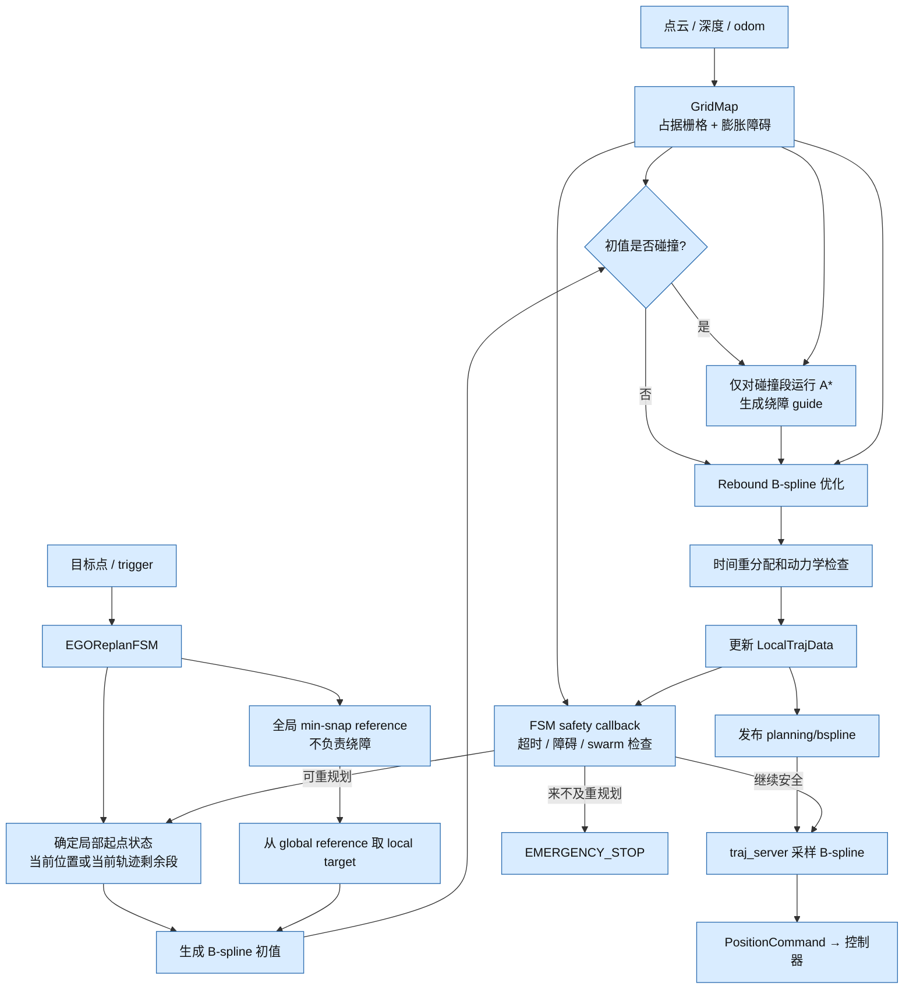
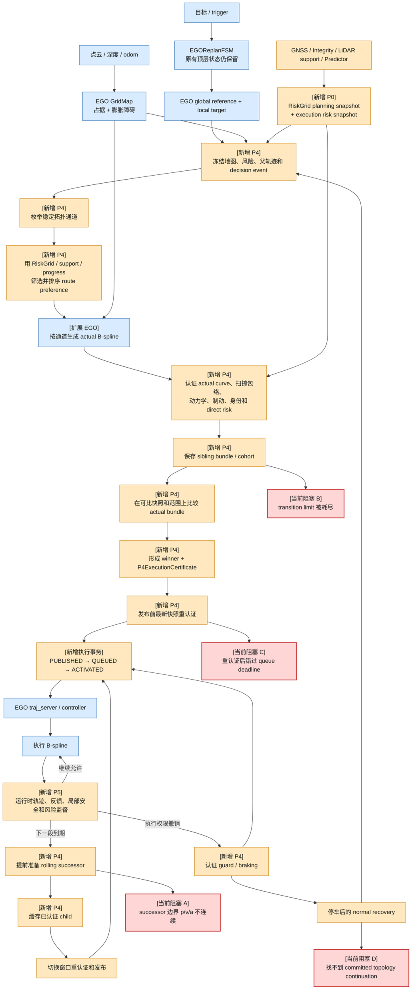
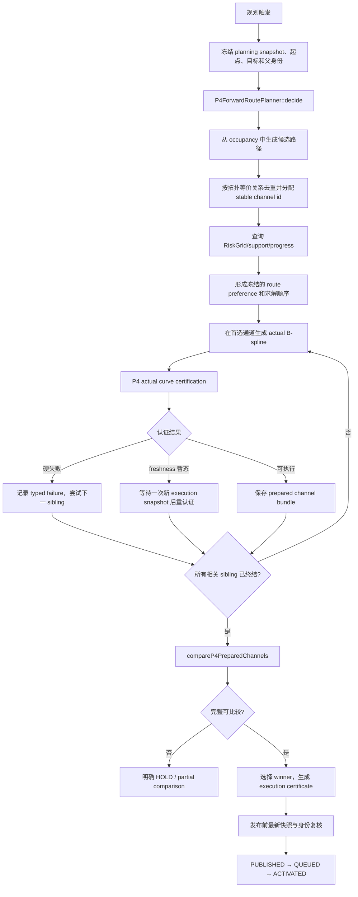
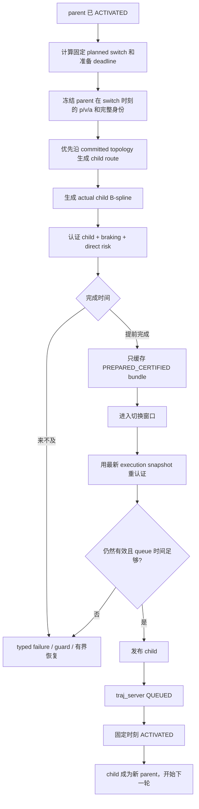
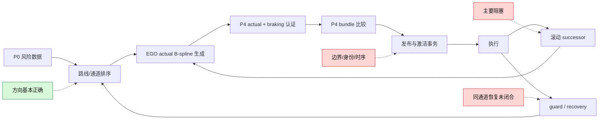

# EGO Planner 与当前 Safety Planner 流程调研

> 调研基线：仓库 `4996f37`，2026-09-28。
> 最近一次 clean compact live：`run-20260928T064303Z-799861`，运行代码 `d6e0073`。
> 本文描述当前代码和最近 live 事实，不把建议中的重构写成已实现功能。

## 0. 先说结论

当前系统仍保留 EGO Planner 的 FSM、局部 B-spline、rebound optimizer、GridMap 和 traj_server，但 P4 已经不再只是原计划中的“风险感知 A*”。它现在位于 EGO 的局部规划与轨迹发布之间，承担：

- 枚举和维护稳定拓扑通道；
- 使用 RiskGrid 给通道排序；
- 为多个通道分别生成实际 B-spline；
- 认证实际轨迹、扫掠包络和制动曲线；
- 比较 actual bundle，选择最终通道；
- 缓存、重认证和发布滚动 successor；
- 维护父子轨迹身份、通道承诺、guard 和恢复生命周期。

因此当前架构可以概括为：

```text
EGO Planner
+ P0 风险数据与执行快照
+ P4 多通道规划、认证和执行事务
+ P5 运行时监督
```

原始设想“在 EGO 使用的地图空间上增加 predictor 风险信息，让路径搜索自然考虑风险”已经实现了一部分：A* 能读取 `RiskGridSnapshot` 并把风险加入边代价。但这条链路后来只成为 P4 的一个前置参考；最终通道选择和执行授权主要由后面的 actual bundle 流程决定。

还有一个需要先纠正的认识：原始 EGO Planner 并不会在任务开始时对整个 GridMap 做一次完整的 obstacle-aware 全局 A*。它先生成不绕障的全局 min-snap 参考，然后在局部 B-spline 初始化发现碰撞段时，才对碰撞段运行 A*，为 rebound optimizer 提供绕障 guide。

---

## 1. 原始 EGO Planner 系统流程

### 1.1 人话说明

原始 EGO 的主线很短：

1. GridMap 从点云或深度图维护局部占据栅格和膨胀障碍。
2. FSM 收到目标后生成一条全局 min-snap 参考。
3. 每次局部规划从当前位置或当前轨迹截取起点，在 planning horizon 上确定 local target。
4. 生成 B-spline 初值。
5. 如果初值穿过障碍，只对碰撞段用 A* 找绕障 guide。
6. rebound optimizer 优化平滑度、障碍距离、动力学可行性等代价。
7. 通过检查后发布 B-spline，traj_server 采样成控制命令。
8. FSM 周期检查障碍、地图/深度超时和其他无人机；必要时重规划或急停。

### 1.2 原始流程图



### 1.3 原始模块责任

| 模块 | 原始责任 | 不负责什么 |
| --- | --- | --- |
| `GridMap` | 局部占据与膨胀障碍查询 | GNSS 风险、通道身份、执行授权 |
| `EGOReplanFSM` | 目标、规划、执行、重规划和急停状态切换 | 多候选事务和证书生命周期 |
| `EGOPlannerManager` | global/local reference、局部规划和轨迹数据 | 多通道 bundle 比较 |
| `AStar` | 给碰撞段找一条绕障 guide | 默认全局路线选择 |
| `BsplineOptimizer` | 优化平滑、障碍距离和动力学可行性 | 最终执行授权 |
| `traj_server` | 接收 B-spline 并输出控制命令 | 决定哪条通道风险更低 |

主要代码入口：

- `src/iap/planner/plan_env/src/grid_map.cpp`
- `src/iap/planner/path_searching/src/dyn_a_star.cpp`
- `src/iap/planner/bspline_opt/src/bspline_optimizer.cpp`
- `src/iap/planner/plan_manage/src/planner_manager.cpp`
- `src/iap/planner/plan_manage/src/ego_replan_fsm.cpp`
- `src/iap/planner/plan_manage/src/traj_server.cpp`

---

## 2. 当前 Safety Planner 系统流程

### 2.1 当前流程图

图中蓝色是保留的 EGO 主体，橙色是后来加入或大幅扩展的流程，红色是最近 live 暴露阻塞的位置。



### 2.2 相对 EGO Planner 新增或改变了什么

| 环节 | 原始 EGO | 当前系统 | 影响 |
| --- | --- | --- | --- |
| 地图 | 只维护 occupancy GridMap | 保留 GridMap，另建 P0 RiskGrid 和 execution snapshot | 障碍事实与预测风险分开保存 |
| A* | 只处理碰撞段，按距离搜索 | 可读取 RiskGrid，把风险加入边代价 | 已实现原始“搜索自然考虑风险”的一部分 |
| 路线 | 没有稳定通道身份 | 枚举、去重并维护 stable topology channel | 能明确比较分叉左右侧，但增加通道生命周期 |
| 候选 | optimizer 内部选可用 B-spline | 每个通道可形成独立 actual bundle | 轨迹生成从一次求解变成多通道事务 |
| 风险决策 | 没有 GNSS 风险 | route guide 排一次，actual bundle 又排一次 | 同一选路可能在两个阶段得到不同答案 |
| 最终检查 | 障碍和动力学检查为主 | actual curve、扫掠包络、制动、局部状态、direct risk、freshness、identity | 增强了执行前证明，同时显著增加计算和状态 |
| 发布 | 规划成功后直接发布 B-spline | 证书验证后经历 PUBLISHED/QUEUED/ACTIVATED | 防止 planner 与 controller 对执行轨迹理解不一致 |
| 滚动规划 | 从当前轨迹重规划 | 提前准备、缓存、重认证并切换 successor | 支持连续飞行，但形成复杂的父子轨迹事务 |
| 恢复 | 重规划失败后急停或继续尝试 | guard、HOLD、committed topology、停车后 recovery | 防止静默换边，但恢复活性成为当前难点 |
| 运行时监督 | 地图超时、碰撞和 swarm | P5 加入身份、反馈、制动、freshness 和完整性监督 | 能撤销失效授权，也可能触发更多恢复路径 |

### 2.3 P4 的语义已经发生变化

早期设计中的 P4 是：

```text
碰撞段出现
→ risk-aware A*
→ 给 rebound optimizer 一个风险更低的绕障 guide
```

当前代码中的 P4 是：

```text
通道发现与排序
→ actual B-spline 生成
→ actual trajectory + braking 认证
→ 多 bundle 比较
→ 执行证书
→ 发布握手
→ successor
→ guard 与恢复
```

规范现在也明确规定 P4 是实际 B-spline 的执行前权威，而 RiskGrid 只是 coarse search/cost field。这一变化解释了为什么当前的大部分问题不再发生在 A* 本身，而发生在 manager 的 bundle、身份、重认证和 successor 生命周期中。

### 2.4 当前代码集中度

当前主要相关文件规模如下，仅用于说明责任集中程度：

| 文件 | 当前行数 | 主要责任 |
| --- | ---: | --- |
| `planner_manager.cpp` | 21,755 | EGO 局部规划、P4 通道事务、认证接线、证书、successor、guard、恢复和日志 |
| `planner_manager.h` | 2,158 | 大量 P4 状态、身份、bundle 和生命周期类型 |
| `p4_forward_route.cpp` | 5,458 | 通道搜索、排序、bounded execution 和 worker |
| `p0_risk_grid_runtime.cpp` | 4,932 | RiskGrid 与 execution snapshot 生成 |
| `p5_runtime_integrity_gate.cpp` | 1,597 | 运行时监督 |
| `ego_replan_fsm.cpp` | 2,424 | 原 EGO FSM 加 P4/P5 调度与发布路径 |

这说明系统还以 EGO 为底座，但 planner manager 已同时承担路线协调器、轨迹生成协调器和执行监督协调器的工作。当前复杂度主要来自责任交叉，而不是顶层 FSM 新增了大量可见状态。

当前 ICRA mission live 的主链是 `P0 + P4 + P5`。P1 后端软代价、P2 distinctive trajectory ranking 和 P3 reference bias 的代码仍保留，但按当前实施计划不承担这次场景的主要选路和执行授权，因此没有把它们画进主流程图。

### 2.5 相对最初设想，偏离发生在哪里

第一步扩展是合理且必要的：RiskGrid 只能影响搜索偏好，最终 actual B-spline 和 braking 仍要独立认证。否则离散栅格、插值误差、轨迹时序和真实扫掠包络都没有安全证明。

真正改变架构的是后续两步：

1. actual 认证结果不仅回答“这条轨迹能否执行”，还参与第二轮跨通道排名，因此 route 层和 actual 层都拥有选路权；
2. P4 又接管了 successor、发布握手、通道承诺、guard 和恢复，使一次选路延伸成跨多个 callback、快照和轨迹身份的长期事务。

因此系统从“EGO 在风险地图上规划，再做一次最终安全检查”，变成了“EGO 负责生成曲线，P4 在其上方运行第二套路线与执行协调流程”。最终认证本身不应删除；需要重点审视的是重复选路权和跨阶段状态所有权。

---

## 3. P4 当前详细流程

### 3.1 普通规划和选路



通道阶段的输出只是 preference。真正可发布的对象必须是带时间参数、固定起止状态、制动库和完整身份的 actual B-spline。

actual bundle 比较目前会处理这些信息：

- 是否通过模式对应的执行授权；
- actual curve 在共同前向时空范围上的风险；
- 风险区间、unknown exposure 和已知 upper PL；
- FIM 诊断；
- route preference、incumbent 和 stable channel identity；
- actual progress、snapshot identity 和 typed failure。

近期 fork 选错问题大多发生在这里：不同起始时间、不同覆盖范围、极小浮点差、旧 route preference 或 `NORMAL/MISSION_DEGRADED` 标签曾先后覆盖前面已经得到的低风险通道偏好。

### 3.2 actual curve 认证

一条 route guide 不能直接执行。P4 会把它交给现有 EGO rebound optimizer 生成 actual B-spline，然后检查：

```text
轨迹和父子身份一致
→ B-spline 几何与时间参数有效
→ 碰撞和扫掠包络安全
→ 净空满足要求
→ 速度、加速度和终端停车条件满足要求
→ 所有可达 braking curve 可认证
→ 地图、局部状态和输入仍新鲜
→ actual curve 在 execution snapshot 上完成 direct risk batch
→ 按 STRICT 或 MISSION 策略形成执行权限
```

这里的最终认证不能简单删除。RiskGrid 是离散、插值和预测得到的搜索代价，不能单独证明连续 B-spline、跟踪包络和制动曲线可安全执行。

### 3.3 successor 连续飞行流程



最近一次 live 已证明以下部分工作正常：

- child 可以提前约 4 秒完成而不被误判过期；
- 到切换前约 376–415 ms 才使用最新快照重认证；
- 能产生 `SUCCESSOR_PREPARED_CERTIFIED`、`PREPARED_SUCCESSOR_REAUTHORIZED` 和 `SUCCESSOR_PUBLISH_AUTHORIZED`；
- 唯一的 switch-window miss 是切换后约 337 ms 的真实迟到；
- 迟到后只进行一次 committed-topology regeneration，没有无限重启完整通道搜索。

所以“提前完成的 successor 被丢掉”已经不是当前首要阻塞，不应再次重写这部分缓存语义。

### 3.4 guard 与恢复

当当前执行权限被撤销或 successor 未能按时接管时：

```text
保留当前仍适用的执行证书
→ 选择并认证可达的 braking/guard curve
→ 发布并等待精确 ACTIVATED ACK
→ 到达批准的停车端点
→ 清理旧 cohort 的终态准备事务
→ 从停车状态重新进入 normal planning
→ 若仍在一个已进入的分叉内，优先证明 committed topology continuation
→ 当前通道硬不可行时，才允许显式 HOLD/制动后 reroute
```

这条路径的安全语义已经比早期版本清楚：系统不会在通道内部因为部分 GNSS 指标较低而静默换边。但它目前还不能稳定恢复出一条同通道 successor，因此活性仍然未闭合。

---

## 4. 当前阻塞

以下结论以最近一次 clean live 为准。它没有通过最终验收：虽然出现 8 次 successor switch、零命令拒绝和零不连续切换，但存在 5 次 non-nominal activation、4 次 parent mismatch、1 次零速切换、约 22.304 秒非终点停顿，且没有到达目标。

### 4.1 阻塞 A：successor 的边界状态不连续

**现象**

- event 7 多次出现 `successor_boundary_state_discontinuous`。

**位于流程中的位置**

```text
冻结 parent 的 switch 时刻 p/v/a
→ 生成 child
→ 检查 child 起点是否与 parent 的固定边界连续
```

**人话解释**

规划器想让下一段在某个未来时刻接棒，但生成 child 时使用的父轨迹位置、速度或加速度，与最后用于检查/发布时认定的父边界没有完全对上。它不是简单的“轨迹算得慢”，而是边界状态由 execution clock、planned switch、parent LocalTrajData 和 callback 时序共同决定，存在多个来源。

**当前状态**

尚未由最新 live 证明解决。这是恢复开发后应先核对的最早首因之一。修复应让一个不可变的 parent boundary state 从生成一直绑定到认证和发布，不能靠放宽连续性阈值通过。

### 4.2 阻塞 B：同一个通道准备事务耗尽 transition limit

**现象**

- 最新 live 出现 1 次 `transition_limit_exceeded`。

**位于流程中的位置**

```text
候选准备
→ 等待快照
→ sibling 切换
→ actual 认证
→ cohort 比较
```

**人话解释**

一个 decision event 内部发生了过多次状态推进。transition limit 本身是在阻止无限循环；它被触发说明上游仍可能在 pending、retry、sibling 或 callback 重入之间反复转换。

**当前状态**

不能通过调大上限解决。需要把该 event 的 transition 序列按统一 identity 排出来，确定哪一个已经消费或终结的工作项被再次调度。此前 terminal cohort 无限复活的问题已经修过，但最新证据说明有限终结仍有一个剩余入口。

### 4.3 阻塞 C：trajectory 18 重认证成功后仍错过发布队列

**现象**

- trajectory 18 进入最新快照重认证，但最后发生 queue deadline miss。

**位于流程中的位置**

```text
PREPARED_CERTIFIED
→ latest-snapshot reauthorization
→ publication validation
→ traj_server queue
```

**人话解释**

路线和 actual child 可能已经算完，也可能已经重新证明安全，但留给“验证、发送、traj_server 接收”的时间不够，最终无法在固定 switch 前进入队列。此时系统按安全规则拒绝迟到 child，结果是 parent 到端点停车或进入 guard。

**当前状态**

提前缓存已经生效，所以不能再用“更早开始所有计算”笼统处理。需要分解 trajectory 18 在重认证、manager 发布检查、ROS 发送和 traj_server 排队各自耗时，确认是重认证启动过晚、调度阻塞，还是 queue margin 的所有者不一致。

### 4.4 阻塞 D：进入通道后长期无法证明同通道 continuation

**现象**

- event 35–56 反复出现 `committed_topology_continuation_not_yet_proven`。

**位于流程中的位置**

```text
已经进入 committed topology
→ successor 或 guard/recovery 失败
→ 重新生成同拓扑 continuation
→ 一直没有得到可发布 actual curve
```

**人话解释**

系统现在能够阻止“在通道中途偷偷换到另一边”，但当一次 successor 失败后，还不能稳定生成同一通道的下一段。安全性提高了，活性没有闭合，于是飞机反复等待，最后停车。

**当前状态**

已有一次性 regeneration 机制，也已经证明不会无限重启完整搜索；仍需查清每次 continuation 不能证明的第一条 typed failure。应只允许两类有限结果：

1. 同一 committed topology 的新 actual successor 通过全部认证并接管；
2. 当前通道被硬安全事实证明不可行，有限进入已有 HOLD/制动，并在停车后显式 reroute。

长期返回“还没证明”不是可接受终态。

### 4.5 外部可见结果仍未满足任务目标

最近一次 live 的 actual odom 在 fork 0、1、2 的中央区域都只有 low 投票，high 为 0，说明当前选路方向比之前稳定。但各分叉 station 只到约：

| fork | low/high 中央样本 | 最大 station | 是否完整穿越 |
| --- | --- | ---: | --- |
| 0 | low 277 / high 0 | 0.7473 | 否 |
| 1 | low 397 / high 0 | 0.7490 | 否 |
| 2 | low 433 / high 0 | 0.5711 | 否 |
| 3 | 未进入 | — | 否 |

因此当前结果是：**选路方向暂时正确，但连续执行链仍在分叉内部中断，最终有效成绩仍是 0/4，且没有到达终点。**

---

## 5. 当前问题在系统上的位置



目前最直接的问题已经不是“RiskGrid 能不能看出 low 风险更低”。最近一次 live 中 fork 0–2 的方向投票都是 low。真正让任务失败的是：

1. 下一段必须接在父轨迹的哪个精确 p/v/a 上，仍有不一致；
2. 已认证 child 在重认证和发布队列之间仍可能错过固定切换时刻；
3. 一次 successor 失败后，同通道 continuation 不能稳定恢复；
4. 某些 lifecycle 工作项仍可能重复推进到 transition limit。

这些问题都集中在 **P4 的 actual trajectory 生成之后、真正连续执行之前**，而不是 Predictor、RiskGrid 或基础 A* 的风险计算入口。

---

## 6. 架构判断与后续开发边界

### 6.1 应保留的部分

- EGO 的 GridMap、B-spline optimizer、traj_server 和顶层 FSM；
- RiskGrid 对 A*/guide 搜索的风险偏好；
- actual B-spline、扫掠包络和 braking 的最终硬安全认证；
- 精确的 PUBLISHED/QUEUED/ACTIVATED 身份握手；
- 进入通道后的 topology commitment；
- P5 根据新障碍、反馈失控、证据过期等新事实撤销权限。

### 6.2 应停止继续扩张的部分

- 不再为每一条新日志添加一个新的 sibling、retry 或 lifecycle 特例；
- 不再让 route preference、actual comparator 和 recovery 各自拥有一套通道选择语义；
- 不再用调大 transition limit、deadline 或 freshness 窗口掩盖状态所有权问题；
- 不再把已经证明正常的提前 successor cache 当作当前首因重写；
- 不在已进入通道后重新启动普通多通道竞赛，除非当前通道被硬安全事实证明不可行并完成安全停车。

### 6.3 恢复开发时的建议顺序

1. 用 event 7 建立一条完整的 parent boundary identity 时间线，统一生成、认证、重认证和发布使用的 p/v/a。
2. 对唯一的 `transition_limit_exceeded` 输出完整 transition 序列，删除重复消费入口，不提高上限。
3. 分解 trajectory 18 从 reauthorization 开始到 traj_server QUEUED 的耗时和 callback 阻塞点。
4. 对 event 35–56 只分析第一条 typed failure，证明同 topology continuation 或有限 HOLD，禁止无终点 pending。
5. 做一次 clean compact live，先要求一个分叉从入口到出口完整 low 穿越并形成至少一次非零速、身份匹配的 successor 接管。
6. 只有完整穿越恢复后，才继续检查 fork 1–3 和终点；首个健康 live 前不启动最终三连验收。

---

## 7. 主要代码与证据索引

| 内容 | 路径 |
| --- | --- |
| 原始 EGO 流程审计 | `docs/dev_planner/iap_original_ego_planner_flow_audit.md` |
| 当前连续飞行实施记录 | `docs/icra27/MISSION_CONTINUOUS_FLIGHT_IMPLEMENTATION_PLAN.md` |
| 规划规范 | `docs/spec/conventions.md` |
| EGO FSM 与 P4/P5 调度 | `src/iap/planner/plan_manage/src/ego_replan_fsm.cpp` |
| 当前主要协调器 | `src/iap/planner/plan_manage/src/planner_manager.cpp` |
| P4 route/channel planner | `src/iap/planner/bspline_opt/src/p4_forward_route.cpp` |
| actual curve certifier | `src/iap/planner/plan_manage/src/p4_actual_curve_certifier.cpp` |
| P0 RiskGrid runtime | `src/iap/planner/plan_manage/src/p0_risk_grid_runtime.cpp` |
| risk-aware A* | `src/iap/planner/path_searching/src/dyn_a_star.cpp` |
| EGO rebound optimizer | `src/iap/planner/bspline_opt/src/bspline_optimizer.cpp` |
| P5 runtime gate | `src/iap/planner/plan_manage/src/p5_runtime_integrity_gate.cpp` |
| 最新 live 结论 | `MISSION_CONTINUOUS_FLIGHT_IMPLEMENTATION_PLAN.md` 第 487–488 行 |
