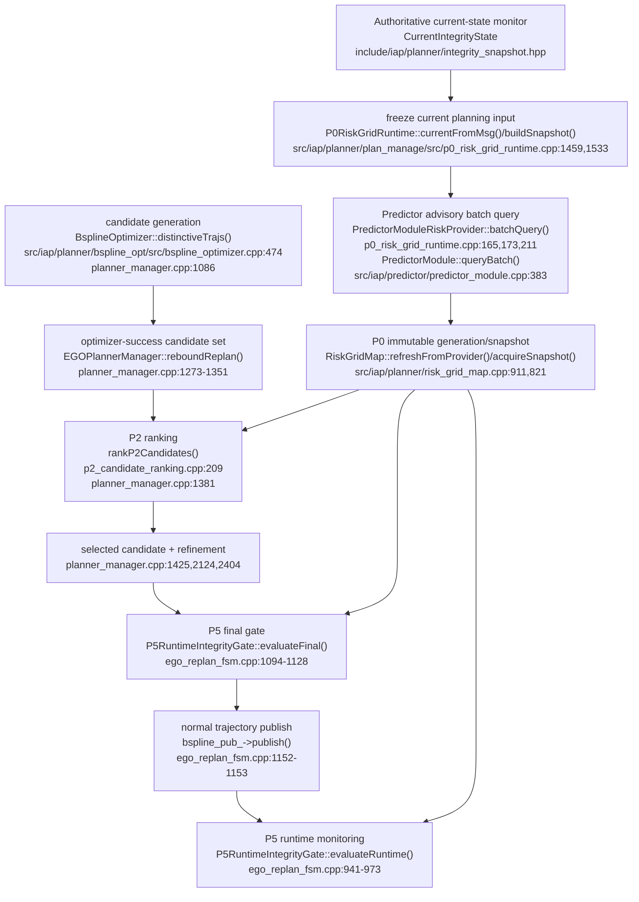

# ICRA 2027 P0 -> P4-v2 -> P5 科学纠偏实施计划

## Development-first acceleration — 2026-08-26

用户决定 `USER-ICRA-ROUTE-20260826-002`（pushed anchor
`b24a330d79d6e85e8080cf2a359bb1a18765e5a5`）保持研究问题、required modules、primary claim、arms、
fallback 与 campaign authority 不变，但把早期多轮审核合并进 ICRA-072：同一任务完成可运行的
`P0 -> P4-v2 -> EGO -> P5` vertical slice 和一次 development live smoke。效果诊断、针对性优化、
power/preregistration/held-out 均后置。ICRA-071 repair 保留为非阻塞 backlog。

开发优先不等于科学 PASS。ICRA-072/073 只能证明接口、进程和 lineage 跑通；不得声称降低风险、
qualification 或 campaign readiness。GPU preflight、required-process fail-closed、occupancy/EGO/P5 authority
与 artifact retention 继续强制。

## User-owned active plan — 2026-08-26

用户以 `USER-ICRA-ROUTE-20260826-001` 恢复 `P0_P4_V2_P5` 为唯一研究主线。决策绑定 pushed
anchor `48caa9ddf24990accb65e2ad230d12821487793c`；偏差证据、P4-v2 科学设计、机器可读 route lock
和 ICRA-071..080 gate 顺序统一定义在
`docs/icra27/ICRA_P0_P4_P5_DEVIATION_AUDIT_AND_RECOVERY_ROADMAP.md`。

执行顺序冻结为：

```text
ICRA-072 end-to-end vertical slice + development live smoke
  -> ICRA-073 effect diagnostics
    -> ICRA-074 targeted optimization
      -> ICRA-075 exploratory / power inputs
          -> ICRA-076 preregistration freeze
            -> ICRA-077 held-out confirmation
              -> ICRA-078 G0D lineage
                -> ICRA-079 prospective P5 integration
                  -> explicit USER campaign decision -> ICRA-080
```

P4-v1 G0C 的 `SCIENTIFIC_NO_GO`、输入 hashes 和 raw evidence 永久保留，不得改门、重跑成 PASS 或用
旧 confirmatory seeds 调参。P4-v2 primary 固定为 controllable interior 的 provider-only maximum risk；
mean/length/latency 为 secondary，whole-path maximum 为 non-inferiority。确认样本数只能在 exploratory
后、查看 held-out 数据前按预注册 power rule 冻结为每类 30–60 个独立 seed-run。

ICRA-070 以 `SUPERSEDED_UNQUALIFIED_BY_USER_ROUTE_DECISION` 关闭，不取得 P5 qualification verdict；
其 P0+P5 实现和证据作为 matched control 保留。当前 build/install、raw evidence 与受保护 PDF 不清理。
原 P0+P5 专用 ICRA-071 计划在激活前被本计划取代；新 ICRA-071 只实现 user-route/state/doc/RQ 本地
守卫。其 Review PASS 前不得修改 P4 产品代码是 decision 001 的旧顺序；decision 002 已明确由
ICRA-072 独立授权 bounded P4-v2 development surface。

### Inverse-corridor design freeze and task boundary

`docs/icra27/dev/ICRA_P4_V2_INVERSE_CORRIDOR_FIXTURE.md` 已冻结
`ICRA_P4_V2_INVERSE_CORRIDOR_FIXTURE_V1`，但当前状态仍是
`DESIGN_FROZEN / IMPLEMENTATION_DEFERRED_TO_ICRA-073`。ICRA-072 最新 Review 为 `REQUEST_CHANGES`，
所以当前 continuation 只可修复 terminal lineage、补齐真实 production-shaped 回归，并使用一个独立命名的
development-only selection trigger 令既有 vertical slice 自然产生完整 provider support。该 trigger 不得
复用 inverse-corridor 名称、几何或科学效果身份。

只有 ICRA-072 full-lineage Review PASS 才能签发 ICRA-073。ICRA-073 才实现 PRIMARY、EXACT_MIRROR、
FLAT_NULL，运行 paired P0+P5 control / P0+P4-v2+P5 treatment，并以独立 oracle 诊断已提交 final
B-spline。Oracle 仅属旁路 evaluation plane，不得进入 P0 snapshot、P4 search/selection、EGO feasibility
或 P5 final/runtime 的决策输入。ICRA-073 只测量并保留结果，不得边测边调；所有依据其结果的针对性优化
只能由后续 ICRA-074 显式授权。

研究路线、required modules、primary claim、arms、fallback 和 campaign activation 的所有权为 USER。
Supervisor 遇到科学 NO_GO 只能进入 `BLOCKED_AWAITING_USER_RESEARCH_DECISION` 并提出建议，不能自动
激活 contingency。

## Superseded contingency activation — 2026-08-25

ICRA-066 以权威 analyzer 关闭 P4-G0C：技术证据 `15/15/15 runs`、`192/192 decisions` 全部有效，
但 Type-7 `Q10(max_original-max_risk)=0`，未超过 `1e-12` numerical-noise floor。因此 P4 为
`SCIENTIFIC_NO_GO`，不得冻结应用阈值、进入 G0D、创建 r7 或把失败结果包装成 treatment。

在当时治理规则下，预注册的 P0+P5 contingency 曾由 Supervisor 显式激活。其历史开发顺序为：隔离且 fail-closed 的
`icra_p0_p5` profile → prospective P5 final/runtime system qualification → 仅在资格通过后冻结
contingency campaign。P0 Gate-0B 保持 PASS；P1/P2/P3/P4 仅保留源码/回归，不进入会议 profile。

ICRA-067 已完成并通过 Supervisor 的 profile/synthetic-harness Review：三类 synthetic case 均为
`VALIDATION_ONLY_PASS`，不构成 live qualification。ICRA-068 已完成历史 P4 测试夹具解耦、543/543
测试、isolated build/install 和 GPU preflight，但 live runner 把 19 个 inactive empty values 编码成
非法 ROS token（例如 `p1.debug_csv_path:=`），因此 SAFE_NORMAL 在 0/16 required processes 启动前停止。
这不是 GPU、P0/P5 产品或科学结果失败；`-001` 注册集冻结并退役。

ICRA-069 的签发任务是：修复 empty-argument serialization，以真实 ROS parser 在 GPU 前验证三条
命令，采用不变的 ICRA-068 product install 并分离 product/runner provenance，然后用新 `-002` identities
一次完成三场景 live qualification。修复与执行之间不安排 intermediate review，不授权产品或阈值变更。

ICRA-069 已关闭 serialization blocker：三条 installed parser proof 为 `0/0/0`，GPU PASS。SAFE_NORMAL
运行 90 秒后在 15/16 required processes 停止。固定 SAFE/FINAL 的 `lidar_corridor_degenerate` 和
RUNTIME 的 `fallback_only` 都令 `use_gnss=false`，因此 conditional `test_planner_gnss_sim_node` 按 launch
设计不启动。这不是 Builder/node/GPU failure，而是 qualification case 没有实例化目标传感器系统。

首版 ICRA-070 在 `d335665` 错误地把缩减运行模式写成 15-process system contract，现已撤销。ICRA-070
当时仍是唯一 active task：保留 canonical 16 processes，新增一个由现有 corridor geometry 与现有
degraded-GNSS preset 组合出的 qualification-specific full-sensor scenario，并令三个 case 都启用
GNSS pseudorange+doppler、IMU/LiDAR estimator、GNSS/ARAIM + LiDAR integrity 与 `max_pl` fusion。任务先
静态证明 sensor/source contract 和 GNSS 依赖，再使用 retained build 创建 no-compile isolated overlay，
随后以 `-003` identities 一次完成 parser、GPU、三场景和 analyzer。P5 fixture/threshold/action 不变，
`-002` 全集冻结退役。

ICRA-070 在静态 full-sensor 修正和 567/567 tests 后，首次 overlay preparation 被安装边界携带的
`launch/__pycache__/*.pyc` 阻塞。ICRA-068 的 7,364-entry inventory 保持不变，parser/GPU/live/analyzer
仍为零次，因此只授权一次同任务 continuation：排除所有 Python cache、保留原 blocker evidence、生成
不覆盖旧证据的 v2 provenance，然后才运行仍未使用的 `-003` sequence。不得 whitelist `.pyc`，也不得
把该 packaging defect 解释为 GNSS/GPU/算法失败。

上述 repair continuation 的 `1b3c661...24d3e16` 静态实现经 Supervisor 接受，但 one-shot 入口在 mutation
前因 task-local Git `safe.directory` 缺失退出。完整 file-set 检查同时证明旧 overlay 只有 469 个 non-cache
entries，相对 ICRA-068 install 的 2,079 个缺 1,610 个，因此删除 cache 也不能把旧 overlay 修复为完整产品。
旧入口不得 retry，旧 overlay 与全部 terminal evidence 保留。当时仍属 ICRA-070 同一 Gate，只授权一个新的
non-overwriting complete overlay：从 retained ICRA-068 复制全部 non-cache bytes/modes，再只替换三个 current
aliases；静态闭合后才可执行尚未使用的 parser/GPU/`-003` live/analyzer sequence。该未完成资格现由用户
路线决定 supersede；build/install、raw evidence 与未跟踪 PDF 继续保留，不得清理。

在被 supersede 前的计划中，ICRA-070 PASS 后仍不得启动 campaign，而要先执行纯静态 guard。当前
ICRA-071 已实现但 Review REQUEST_CHANGES。用户决定 002 将其 repair 降为非阻塞 backlog，并直接授权
ICRA-072 vertical slice；这不是 ICRA-071 PASS，也不允许签发 campaign。

下方 P0 -> P4 -> P5 计划保留为 P4-v1 的审计记录。其 authority separation、collision contract 和
metrics-only 隔离继续适用；v1 objective、G0C estimand、fallback ownership 和任务顺序由上方 P4-v2
计划与 user route lock 取代。冲突时以本 active plan、route lock、根 `AGENT_STATE.md` 和
`NEXT_TASK.md` 为准。

## Historical P4-v1 active-plan declaration — 2026-08-20

本节至 `# Superseded historical record — P0 + P2 + P5` 为 P4-v1 实施计划的完整历史记录。
审阅基线为 dev/icra@bd3858a72ba0。它不再覆盖文件顶部的 P4-v2 active plan，也不再单独授权任务、
配置、实验或论文主张。

历史 Gate 0A 结论永久保留：9 个固定运行的 378/378 个成功优化 attempt 均为 singleton，
裁决仍为 NO_GO_P2。该结果只否定当时的 P2 treatment domain，既不是 GO_P4，也不是完整系统资格证明。

当前资格状态固定为：

~~~text
P0 BLOCKED / UNQUALIFIED
  → P4 NOT_QUALIFIED
  → P5 IMPLEMENTED-BUT-UNQUALIFIED
~~~

ICRA-004 不取消。Supervisor 只更新其路线元数据，任务仍限于 GPU preflight 和一次 20 s P0 smoke。
该 smoke 中 P4、P5 及 P1/P2/P3 全关。P0 Gate-0B 经 Supervisor review 前，不得授权 P4 生产代码。

## 1. 研究路线和 authority boundary

目标是条件式 P0 → P4 → P5，不是无条件串行执行：

~~~text
P0 immutable advisory snapshot
  → seed collision scan
      ├─ NO_COLLISION → 原 EGO 路径
      ├─ CLOSED_SEGMENTS → P4 guide preference
      └─ OPEN_ENDED_COLLISION / INVALID_INPUT → 当前 replan 失败
  → EGO optimization / refinement / feasibility
  → P5 final
  → normal publish
  → P5 runtime
~~~

P0 只提供 future-risk advisory 数据。P4 只选择 collision guide，不改变 occupied/free 判定，
不替代 EGO collision、dynamics、optimization、refinement 或 feasibility authority。

P5 final 和 runtime 是 IAP 层唯一 hard integrity gate。P5 final 必须位于正常 B-spline 发布之前；
P5 reject 不得产生该条正常发布。Emergency-stop 命令与正常发布分开统计。

本计划只主张系统内的 logical one-way authority separation，不主张 physical isolation、
certification-level proof，或 P4 对所有场景都降低真实风险。

## 2. Collision scan contract

未来 collision scan 的内部返回值冻结为：

~~~cpp
enum class CollisionScanStatus {
  NO_COLLISION,
  CLOSED_SEGMENTS,
  OPEN_ENDED_COLLISION,
  INVALID_INPUT
};
~~~

前 2/3 seed 只定义“允许触发 collision entry”的窗口。若窗口内发现 free → occupied，
扫描必须越过 2/3 继续到 seed 末端寻找 occupied → free，不得在 entry 点立即构造 segment。

CLOSED_SEGMENTS 的每个 segment 必须有两个 free endpoint，且中间至少有一个 occupied sample。
无 entry 返回 NO_COLLISION。输入或地图状态不可判定返回 INVALID_INPUT。

若到 seed 末端仍未找到 exit，则返回 OPEN_ENDED_COLLISION。它不得伪装为 NO_COLLISION，
不得使用 occupied endpoint，也不得交给 P4 A*。

OPEN_ENDED_COLLISION 和 INVALID_INPUT 均使当前 replan fail closed，不发布新的 normal trajectory。
上层沿既有 FSM/P5 安全路径处理，证据必须记录状态与原因。

多障碍输入按扫描顺序返回闭合 segments。若已存在闭合 segment，随后又出现 open-ended entry，
整个 scan 状态仍为 OPEN_ENDED_COLLISION，当前 replan 不消费部分结果。

## 3. P4 deep-module interface

未来唯一 P4 决策 seam 冻结为：

~~~cpp
P4GuideDecision planCollisionGuide(const P4GuideRequest&);
~~~

P4GuideRequest 必须一次性绑定：

- planning attempt ID 和 collision segment ID；
- 两个已验证为 free 的 endpoint；
- shared immutable P0 RiskGridSnapshot；
- snapshot generation、stamp、frame 和 query base；
- 冻结的 travel-time/query-time model；
- occupancy map epoch；
- P4 config 与 metrics-only 标志。

P4GuideDecision 必须返回：

- original、risk-aware 和 selected guide；
- 三者的 schema-versioned canonical path hash；
- original/risk 最终 guide 的 200 点等弧长风险 profile；
- mean/max、valid/unknown/stale/non-finite 数；
- 路径长度及 risk/original ratio；
- original search、risk search 和 total latency；
- snapshot、query-base、occupancy-epoch identity；
- selection status、selection_applied 和 fallback reason。

CSV、manifest 和 RViz 只能消费 P4GuideDecision，不能重新计算或影响选择。RViz 不是 gate evidence。

## 4. P4 搜索、比较和生命周期

同一 decision 内先运行 original A*，再运行 risk-aware A*。两次搜索共享 endpoints、
occupancy epoch、snapshot、query base 和 time model；不得跨 planning event 拼接结果。

occupied neighbor 必须在任何 risk query 前由原 EGO occupancy 规则硬拒绝。P4 risk 只进入
A* edge cost；不得进入 occupancy、heuristic 或硬可行性定义。

两条最终 guide 均以同一 snapshot 做 200 点等弧长重采样。比较对象是 A* 返回的完整 guide，
不是搜索期间的 edge 累积值，也不是后续 refined B-spline。

只有 200/200 样本 valid、mean 与 max 同时达到冻结改善门、长度比不超过冻结门，
且两次搜索均成功时，risk guide 才具备被选资格。否则 selected guide 为 original。

snapshot 未就绪、unknown、stale、non-finite、搜索失败或超时均 fail closed 到 original。
若 original search 自身失败，则返回 planner failure，不把 risk guide 当作安全替代。

若 occupancy epoch 或 request identity 在两次搜索、比较或 control-point 注入前变化，返回
DECISION_INVALID/REPLAN_REQUIRED。两条 guide 都不注入，本 attempt 不发布新 normal trajectory。

只有 occupancy identity 未变化时，risk snapshot/query/search/coverage/ratio 失败才回退
current-epoch original guide。证据必须区分 fallback 与 invalid-replan。

snapshot 生命周期必须持续到双搜索、重采样、选择以及 selected guide 注入 control-point
constraints 完成。initial collision 与 rebound collision 必须调用同一 seam。

P5 final/runtime 可获取更新的 snapshot，但必须分别记录 P4 与 P5 generation。
不同 generation 不得写成“同代验证”，P5 不接收 P4 score。

p4.metrics_only=true 时仍生成两条 guide 和完整 evidence，但 selected guide 固定为 original，
selection_applied=false。默认值为 false，以保持 P4 enable 的既有选择语义。

P4-G0B 和全部 G0C calibration 必须显式设置 p4.metrics_only=true。
threshold registry 冻结前不得把 risk guide 注入控制点；应用只从 G0D 开始。

所有 P4 qualification、calibration 和 formal-comparison arms 固定
manager/use_distinctive_trajs=false，防止 legacy candidate fanout 覆盖 guide lineage。

P0-only ICRA-004 不是 P4 arm，继续使用冻结的 ICRA-003 smoke 配置，不在本任务追加该 override。

## 5. Composite profile 与模块隔离

新增唯一 route profile：icra_p0_p4_p5。它同时开启 P0、P4、P5 final/runtime，
并执行 scope validator。不得用 all 或旧 p4 profile 代替。

主对照 profile 为 icra_p0_p5。除 P4 enable 外，它与 treatment 使用相同的 P0、P5、
场景、seed、规划器和 evidence 配置。

两个正式 arms 均锁定以下 high-level 值：

~~~text
planner_enable_all_safety=false
planner_enable_p1=false
planner_enable_p2=false
planner_enable_p3_local=false
planner_enable_p3_global=false
planner_enable_p4=<arm value>
planner_enable_p5_runtime=true
planner_enable_p5_final=true
manager/use_distinctive_trajs=false
~~~

同时锁定 lower-level isolation：

~~~text
p1.use_integrity_cost=false
p1.metrics_only=false
p1.lambda_integrity=0.0
p1.debug_csv_enable=false
safety_viz.enable_p1_viz=false
manager/p1_collision_fanout_clearance_m=0.0
manager/p1_collision_fanout_preserve_homotopies=false
manager/p1_collision_fanout_mirror_y=false

p2.enable_candidate_ranking=false
p2.metrics_only=false
p2.debug_csv_enable=false
safety_viz.enable_p2_viz=false

p3.enable_local_reference_bias=false
p3.enable_global_reference_bias=false
p3.debug_csv_enable=false
safety_viz.enable_p3_viz=false
~~~

treatment 还要求 p4.enable_risk_aware_astar=true、p4.metrics_only=false、
p5.enable_final_gate=true、p5.enable_runtime_gate=true。P0 runtime/map 也必须为 enabled。

scope validator 必须检查解析后的 effective map，并拒绝 all、旧 p4 profile、未知 key、
P1/P2/P3 任一 high/low/metrics/debug/viz override、distinctive trajectories，
以及 P5 final/runtime 关闭。

只有 manifest 声明 gate=G0B/G0C 的注册 qualification arm 可把 p4.metrics_only 设为 true；
正式 treatment 和 G0D 必须为 false。其他显式覆盖均拒绝。

P1/P2/P3 的源码、接口、CMake targets、tests 和 legacy profiles 全部保留。
本计划不删除模块，不加入 ICRA 条件编译，也不改变旧 profile 的默认行为。

## 6. Event-gated qualification

所有门按证据事件推进，不使用已经过期的日历日期。

### 6.1 Scope pivot gate

六份 ICRA 主文档、system flow、IAP-RQ-423、traceability、changes 和双 Agent 状态必须一致。
历史 NO_GO_P2 与 active route 必须能同时读取，不能互相覆盖。

AGENT_STATE 只能有一个 active role 和一个 unique next task。历史 verdict 使用独立字段；
不得把 P4 标记 PASS、GO 或 implemented。

### 6.2 P0 Gate-0B

ICRA-004 先完成 GPU preflight 与单次 20 s P0 smoke。required processes 必须存活，
integrity 输入有效，并观测到真实 P0 generation；P4/P5/P1/P2/P3 均关闭。

smoke 经 Supervisor review 后，才授权单次冻结的 60 s full-grid benchmark。
不得在两次运行之间调整 ROI、horizons、worker 或 refresh period。

60 s gate 要求每代 `refresh_query_count=76,800` 个 logical risk voxels、至少 20 个成功
generation，并报告实际 provider dispatch、spatial recompute/reuse、GNSS/LiDAR invocation、
horizon fusion、window shift/full-rebuild reason、type-7 p50/p95/max、stale/failed ratio 与
实际 interval。p95 必须不超过 400 ms。

进程退出、输入无效、零真实 generation、shape 错误、样本不足或 p95 超门均为 BLOCKED/FAIL。
不得以 launch 顶层返回 0 替代 required-process health。

#### 6.2.1 P0 staged refactor contract

`docs/icra27/P0_ROLLING_RISK_WINDOW_DESIGN.md` 是 P0 重构的唯一架构设计源。
实现顺序固定为：

1. production map-LOS + empirical covariance growth + spatial/horizon Seam；
2. 单 refresh 内空间证据去重；
3. fixed world lattice + dense ring window；
4. source version/TTL/occupancy delta 与 fail-closed publication；
5. worker 1/2/4 CPU profile；
6. 独立 smoke 和 60 s qualification。

每一步必须是独立 task 和 review。不得把 whole-result cross-horizon cache、rolling
window、worker 调整或 GPU 实现混入第一阶段。每代发布仍是完整 immutable snapshot；
“增量”只描述内部计算与复用，不允许消费者读取 partial generation。

`refresh_query_count` 继续表示完整 logical shape。`provider_query_count` 保留为实际
provider horizon-query count，但若后续 Interface 使该字段语义不再成立，必须先升级 health/
evidence schema 和 analyzer tests，不能静默重定义。cold start、周期 full rebuild 和 steady
rolling refresh 必须明确标记；正式 benchmark 如何纳入分位数必须在运行前由独立任务冻结。

### 6.3 P4-G0A — deterministic collision

第一笔 P4 任务必须只提交 deterministic red fixture 和测试，不修改生产实现。
fixture 必须稳定得到一个 free → occupied → free segment。

red suite 同时覆盖 NO_COLLISION、CLOSED_SEGMENTS、OPEN_ENDED_COLLISION、INVALID_INPUT、
多障碍、free endpoints，以及“entry 在前 2/3、exit 在后 1/3”。

测试及预期失败经 Supervisor review 后，才允许第一笔 P4 生产改动。

### 6.4 P4-G0B — dual guide

新增独立 p4_collision_guide_v1 spatial-risk fixture。它必须在 free corridor 中提供
可复现的高/低 c_pi，而 occupancy 几何保持一致。

同事件 original/risk guide 必须共享 request identity。gate 验证 200 点最终路径重采样、
mean/max 改善、长度比、fallback、snapshot 生命周期与 evidence 完整性。

G0B 固定 p4.metrics_only=true 和 selection_applied=false。该门证明 measurement seam，
不在阈值冻结前应用 risk guide。

### 6.5 P4-G0C — calibration and freeze

校准 seeds 固定为 [211, 223, 237, 253, 271]。每个 seed 运行三次，共 15 个不可覆盖运行，
且至少取得 100 个 complete P4 decisions；不足即 BLOCKED。

全部 calibration 固定 p4.metrics_only=true 和 selection_applied=false。
校准数据只冻结阈值，不改变 online guide。

每条被比较路径必须是 200/200 valid。每次 A* 的既有 hard timeout 保持 0.2 s，
ICRA protocol 把可配置参数 p4.max_extra_path_ratio 的当前默认值 1.30 冻结为实验 hard cap。
旧 profile 在 ICRA 外仍可覆盖该参数；ICRA calibration 不得放宽它。

mean 与 max 的改善门分别取对应校准改善量的第 10 百分位：

~~~text
mean_improvement_gate = Q10(mean_original - mean_risk)
max_improvement_gate  = Q10(max_original - max_risk)
~~~

长度门与双搜索延迟门冻结为：

~~~text
path_ratio_gate = min(1.30, Q95(path_ratio) + 0.02)
dual_search_p95_gate =
  min(0.40 s, Q95(total_search_s) + max(0.01 s, 0.20 * Q95(total_search_s)))
~~~

任一改善门不大于冻结的 numerical-noise floor、存在 invalid coverage，
或任一次搜索 timeout，P4 Gate 失败。不得通过删 run 或放宽阈值补救。

校准 runs 不进入论文统计。阈值、noise floor、fixture/config hash 和原始 run index
必须在独立 freeze changeset 中固化；正式 runner 绑定该 changeset hash。

### 6.6 P4-G0D — full lineage and P5

selected decision/hash 必须可追到 control-point injection、rebound optimization、
refinement/feasibility、LocalTrajData 和最终 B-spline hash。

G0D 是第一个允许 p4.metrics_only=false、selection_applied=true 的 gate。
它必须绑定已经冻结的 threshold-registry hash。

P5 final 必须在 normal publish 前。final reject 的对应 normal-publish count 必须为零。
P5 runtime 覆盖 safe、unsafe、stale、unknown 和 non-finite。

initial/rebound 必须使用同一 P4 seam；metrics-only 必须是几何 no-op；
P4/P5 generation identity 必须分别可审计。

## 7. 正式实验冻结

主比较只有两个 arms：

- control：P0 + P5；
- treatment：P0 + P4 + P5。

正式矩阵为 primary、exact mirror、flat-null 三个场景 × 两个 arms × 十个冻结 seeds，
共 60 runs。十个 seed 在首个正式 run 前写入冻结 registry，且不得与校准 seeds 重叠。

EGO baseline、P4 metrics-only、P0+P4/P5-off 仅用于资格或机制诊断，
不替代主比较，也不进入主 treatment effect。

每个 formal run 绑定 git commit、composite profile hash、threshold hash、fixture hash、
seed、scenario、arm、artifact manifest 和 analyzer version。失败 run 不覆盖且进入分母。

campaign 前必须通过 GPU preflight 和可用空间不少于 40 GiB 的容量门。
不满足时 runner fail closed，不自动清理、不降级录包、不开始正式运行。

P4-v1 的历史规则要求任一资格门失败时把 active target 标记 BLOCKED，并允许另一个 Supervisor
decision 激活 P0+P5 contingency。该 fallback authority 已被本文件顶部的 user route lock 取代；当前
必须进入 `BLOCKED_AWAITING_USER_RESEARCH_DECISION`，不能由 Supervisor、runner 或实现者自动降级。

## 8. Tests and acceptance

focused tests 必须覆盖 collision 状态机、同 identity 双 guide、200 点 mean/max、
occupied-before-risk、unknown/stale/non-finite、搜索失败和 0.2 s timeout。

integration tests 必须覆盖 occupancy epoch 变化、snapshot 生命周期、initial/rebound 共用 seam、
metrics-only no-op、distinctive-off、B-spline lineage 和 refinement 后 hash。

profile tests 必须覆盖 composite profile、control/treatment 只差 P4、P1/P2/P3 双层关闭，
以及 all、旧 p4、P5-off、distinctive-on、metrics/debug/viz 和 lower-level 恶意 override 的 fail-closed。

P5 tests 必须证明 final-before-publish、reject-no-normal-publish 和 runtime
safe/unsafe/stale/unknown/non-finite。P1/P2/P3 历史回归测试继续运行。

每个 gate 只在证据 artifact、manifest identity、analyzer 和测试同时满足时通过。
文档中的 PLANNED、IMPLEMENTED、QUALIFIED、PASS 不得互相代替。

## 9. Single-active-role work order

1. Supervisor 完成本次 scope pivot，登记 IAP-RQ-423，并按新路线元数据重发 ICRA-004。
2. DeepSeek 只执行 ICRA-004 的 GPU preflight 和 20 s P0 smoke，然后交回。
3. Supervisor review smoke；通过后单独授权冻结的 60 s P0 benchmark。
4. DeepSeek 执行 benchmark 并交回；Supervisor 裁决 P0 Gate-0B。
5. 仅 P0 通过后，DeepSeek 提交 P4-G0A test-only red fixture，不改生产代码。
6. Supervisor review red fixture；通过后授权 collision scan 与 open-ended 生产改动。
7. DeepSeek 实现 scan contract 并交回；Supervisor review 后授权 P4 deep module。
8. DeepSeek 实现 dual guide、snapshot lifecycle、metrics-only 和 focused evidence。
9. Supervisor review P4-G0B；通过后只授权冻结 calibration 与 threshold registry。
10. DeepSeek 运行 calibration 并交回；Supervisor 按预注册公式冻结 thresholds，裁决 P4-G0C。
11. 仅 G0C 通过后，Supervisor 授权 composite profile、lineage 与 P5 integration。
12. DeepSeek 完成 P4-G0D 并交回；Supervisor 裁决 integration gate。
13. 只有全部 gate 通过后，DeepSeek 执行 60-run campaign；Supervisor 冻结结果与分析。

任一时刻 AGENT_STATE 只能出现一个 active role。Supervisor review 未结束前不得预发下一项；
DeepSeek 不修改 Supervisor-owned plan/scope/status，Supervisor 不修改 DEV_LOG。

## 10. Requirements and change policy

实现与证据由 IAP-RQ-423 追踪：collision contract、同事件 dual guide、风险改善选择、
B-spline/P5 lineage。代码落地前 TRACEABILITY 状态保持 PLANNED / NOT_IMPLEMENTED。

每笔生产改动必须更新 CHANGES 和 TRACEABILITY，并只修改当前 NEXT_TASK 允许的文件。
不得删除 P1/P2/P3，不得修改冻结历史 artifact，不得把历史 NO_GO_P2 改写为 P4 证据。

---

# Superseded historical record — P0 + P2 + P5

> 以下内容按原文保留，用于审计 2026-08-18 及更早的决策。它不是 active work queue；
> 与上方计划冲突时，以上方 P0 → P4 → P5 active plan 为唯一权威。

# ICRA 2027 P0 + P2 + P5 会议版改造实施计划

## Activation addendum — 2026-08-18 Supervisor verdict

This addendum is authoritative over the historical preregistration below wherever they conflict.

- Gate 0A is `NO_GO_P2`: nine fixed seed-11 runs produced 378 optimizer-success attempts, all singleton, with zero eligible same-attempt multi-candidate sets. This narrow result freezes all W2 work and every P2 scoring, winner, batch-identity, fixture, candidate-generation or P2 experiment item in W0–W6.
- Gate 0A is not a complete-system qualification. The same raw runs show `iap_rosnode` died with exit `-6` after `cudaErrorNoDevice`, while the integrity validator exited 2 with no messages. The singleton evidence still answers the narrow P2 treatment-domain question, but it does not qualify live integrity, P0 or P5 behavior.
- Gate 0B has no valid performance conclusion. Its top-level launch returned 0 while `iap_rosnode` died; zero real P0 generations and zero 76,800-query refreshes occurred. P0 p50/p95/max are unmeasured. The historical `P0_PERFORMANCE_GATE_FAIL` label is superseded by `BLOCKED / P0_INPUT_AVAILABILITY_FAIL` until a required-process-clean run reaches provider evaluation.
- The active conference route is P0 + P5. P0 provides only a future-PL advisory field; P5 final/runtime remains the IAP layer's sole hard integrity gate; original EGO collision/dynamics checks remain authoritative for motion feasibility. P1/P3/P4 remain closed.
- The unique next task is `ICRA-002 / GATE_0B`, defined at repository root in `NEXT_TASK.md`: add explicit qualification-only CPU backend selection, truthful input/process evidence and fail-closed analysis; pass one 20 s smoke before the single unchanged 60 s full-grid benchmark.
- No ROI, horizon, worker or refresh-period tuning is authorized in ICRA-002. No P2 or P5 decision logic, campaign, rosbag, external backup or disk remediation is authorized.

The remainder of this file is retained unchanged as the historical P0 + P2 + P5 preregistration. It is not an active work queue and cannot be used to bypass this addendum.

> 状态：工程计划，不是实验结果。
> 计划基线：`dev/icra`；代码冻结点 `21180f3`；代码映射文档提交 `0f2e487`。
> 代码位置和当前行为以 [`CODE_MAP.md`](CODE_MAP.md) 及上述冻结点为准；行号漂移时以类和函数名为权威定位。
> 需求追溯：`IAP-RQ-320`（predicted PL）、`IAP-RQ-400`（integrity-aware planning）、`IAP-RQ-410`（planning/runtime lifecycle）、`IAP-RQ-422`（可复现实验）。

## 1. 目标、范围和不可变边界

会议版只保留 P0、P2、P5 主线。P1、P3、P4 仅从会议 profile、录包、分析和论文中移除；源码、接口、编译目标、历史测试及期刊恢复入口全部保留。不移动或改写冻结 tag，不改变旧 full-IAP profile 的解析规则和默认行为。

目标架构冻结为：

```text
Current GNSS/LiDAR integrity
            ↓
Predictor advisory query
            ↓
P0 predicted-PL field / snapshot
            ↓
P2 ranking of the same rebound-optimizer-success candidate set
            ↓
P5 independent final gate
            ↓
trajectory publication
            ↓
P5 independent runtime gate
```

实现和验收必须同时满足以下边界：

1. P0 和 Predictor 只提供 advisory prediction；P0 可单向读取 current-integrity prior，但不得回写或覆盖 authoritative current-state monitor within the system。
2. P2 是 preference，不是 safety authority；其输出不得命名为 hard PASS。
3. P2 不生成候选，也不调用候选生成器。
4. P2 不改变 optimizer success、碰撞检测和动力学可行性的定义。
5. 一次 P2 比较只接受同一 planning attempt、同一 rebound-optimizer-success candidate set、同一 P0 snapshot。
6. P2 基准项只读取 `BsplineOptimizer::OptimizerCostBreakdown::original_cost`，不读取可能含 P1 的 `total_cost`。
7. null、single、risk tie、任一样本 unknown/stale、任一非有限输入或 support/coverage 不一致时，P2 回退到 immutable original winner；`valid_ratio` 只作诊断。
8. P5 是 IAP 层唯一 hard integrity gate；原始 EGO collision/dynamics checks 保持运动可行性 authority。
9. P5 final gate 必须在正常 `/drone_0_planning/bspline` 发布前完成；P5 reject 必须阻止对应正常轨迹发布。
10. P5 runtime gate 独立监控已经发布和执行的轨迹。
11. unknown、stale 和非有限 PL/AL/IM 都不能解释为低风险。
12. P5 current gate 继续使用 authoritative current-state monitor within the system；P0/Predictor 结果只能进入 future/advisory 路径。本计划只主张 logical one-way separation，不主张 physical isolation 或 certification-level proof。

## 2. 实际调用链和目标插入点



P2 比较的所有候选绑定 planning context 已获取的同一个 snapshot。P5 为保持 hard-authority 独立性，final/runtime 可以重新获取最新 P0 generation，但必须同时记录 P2 decision snapshot ID 和 P5 evaluation snapshot ID。P5 不接收 P2 score。

正常发布链在 P5 后还会调用 `EGOPlannerManager::preparePlanningRiskPublish()`（`planner_manager.cpp:528`）。ICRA profile 必须保证 `p1_objective_applied=false`，使该路径只能记录/放行，不能成为第二个会议版 hard authority。`ego_replan_fsm.cpp:1264` 的 emergency-stop trajectory 是安全停止命令，不属于待 P5 final admission 的正常规划轨迹，分析器须分开计数。

## 3. 计划新增的内部接口和证据契约

### 3.1 P0 Gate 0 evidence adapter

Gate 0 通过小型只读 adapter 消费既有 `RiskGridSnapshot::Generation` 和 `/planning/risk_grid_health`，不改变现有 query conservative-corner 语义。全量 Generation provenance 扩展属于会后可选工作。adapter 记录：

- `schema_version`、`generation_id`、`snapshot_stamp_s`、`frame_id`；
- snapshot 创建时冻结的 current integrity stamp、HAL/VAL、PL/IM freshness，只作为 advisory provenance；
- Predictor source flags、GNSS/LiDAR/fusion/prior 聚合计数；
- full-grid query count、unique positions、LiDAR evaluation/cache hit、worker count；
- refresh elapsed、provider batch elapsed、完成时间和失败/unknown/stale reason。

`RiskGridSnapshot::health()` 仍返回 generation 创建时的不可变 health；动态 field age/stale 继续来自 `/planning/risk_grid_health` 和实际 voxel query，不回写旧 snapshot。incremental grid 或跨 generation cache 不在会议 Gate 0 范围。

### 3.2 P2 candidate-set boundary

新增或扩展内部类型：

```text
P2CandidateSet
  planning_attempt_id
  shared_ptr<const RiskGridSnapshot> snapshot
  snapshot_generation_id / snapshot_stamp_s
  candidate_set_hash
  vector<P2CandidateEvidence> candidates

P2CandidateEvidence
  candidate_id / candidate_hash
  control_points / degree / knot_interval
  original_optimizer_cost
  legacy_total_cost               # 只记录，禁止用于会议排序
  optimizer_success
  dynamic_feasibility / collision evidence

P2CandidateRankingResult
  original_winner_id
  score_winner_id                 # metrics-only 时为 hypothetical winner
  selected_winner_id
  selection_applied
  fallback_reason
```

复用 `EGOPlannerManager::PlanningRiskContext` 和 `beginPlanningRiskContextWithSnapshot()`；Gate 0 直接沿用现有 planning attempt ID。`p1_planning_attempt_seq_` 中性化重命名属于会后可选重构，禁止为 Gate 0 建立第二个 attempt counter。

candidate ID 是 attempt-local ordinal。candidate hash 使用 `fnv1a64:<16hex>`，输入为 schema tag、B-spline degree、knot interval、control-point 维度和按固定次序序列化的 IEEE-754 字节。candidate-set hash 对排序后的 `(candidate_hash, multiplicity)` 计算，表示集合成员身份；运行时还必须断言 P2 只收到一个共享 candidate-set 对象和 snapshot 指针。artifact 文件使用 SHA256，不能用 FNV 替代文件完整性校验。

### 3.3 P2 计算定义

为避免无依据重写已工作的 P2，会议实现保持当前 `queryCost()` score 语义；同一采样 lattice 额外调用 `queryPredictedPL()` 产生论文指标，并将新增查询计入 candidate query latency。

该连续 PL preference 与 `docs/spec/talk_spec.md` §F 的 `hinge(PL_pred-AL)^2` objective 不同：会议版需要在 PL 尚未越过 AL 时仍能比较较低 advisory risk，而越界后的 hard authority 明确保留给 P5。实现 W2-03 前，必须把这项会议范围偏差、理由和期刊恢复路径写入 `docs/CHANGES.md`，并在 `docs/TRACEABILITY.md` 绑定 `IAP-RQ-320/IAP-RQ-400/IAP-RQ-410`；未完成该登记不得合入 scoring change。若范围审查不接受偏差，则回退为 P2 metrics-only 并触发2026-08-26的P0+P5备用论文，不临时发明第三套score。

```text
integrity_score_i =
    mean(c_pi)
  + p2.w_max_cost * max(c_pi)
  + p2.w_unknown * unknown_ratio
  + p2.w_stale * stale_ratio

final_ranking_score_i =
    normalized(original_optimizer_cost_i)
  + p2.lambda_candidate_integrity * integrity_score_i

minimum_predicted_IM_i =
    min_samples(min(HAL_snapshot - HPL_pred,
                    VAL_snapshot - VPL_pred))
```

`mean(c_pi)` 和 `mean predicted PL` 分别记录，不宣称二者在插值后严格相同。HAL/VAL 来自该 P0 snapshot 冻结的 advisory provenance，只用于 P2 metrics，不替代 P5 authoritative current-state monitor。

original winner 定义为最小 finite `original_optimizer_cost`，平局按 candidate ID。若所有 original cost 都非 finite，则返回 planner input failure `no_finite_original_candidate`；这不是 P2 safety reject。

### 3.4 P5 identity-only binding

新增 `P5DecisionBinding`/admission trace：

- planning attempt ID、candidate-set hash；
- selected candidate ID/hash；
- pre-refinement 与 final trajectory hash/trajectory ID；
- P2 snapshot generation；
- P5 final snapshot generation；
- final decision/action/reason、publish event；
- runtime committed trajectory ID 和每次 runtime action/reason。

该类型不得包含 P2 integrity score、ranking score 或 winner preference，防止 P5 action 与 P2 score 直接耦合。

### 3.5 ROS 和文件证据

- 保留 `/planning/risk_grid_health` 和 `/planning/integrity_gate_status`。
- `/planning/p2_candidate_ranking` 版本化 JSON topic 降为会后可选诊断；Gate 0 正式证据使用 candidate CSV + manifest。
- 保留现有 `/iap/rviz/p2_candidate_trajectories` 及 P0/P5 RViz；RViz 只用于图示，不作为 hard-gate 数据源。
- 新增 `icra_candidate_set.csv`、`icra_candidate_control_points.csv`、`icra_p0_health.csv`、`icra_p2_score_decomposition.csv`、`icra_p5_action_timeline.csv`。
- 每一行携带 `schema_version/run_id/manifest_path/git_commit/configuration_hash/seed/scenario`，再携带适用的 attempt/set/candidate/snapshot identity。

## 4. Gate 0：先证明候选资格与 P0 性能

Gate 0 只增加默认关闭、只读的 instrumentation；不得改变候选生成、优化、排序、refinement、P5 decision 或 action。Gate 0A 为 `CONDITIONAL` 或 `NO-GO-P2` 时仍独立完成 Gate 0B；停止规则只阻止后续 P2 interface/scoring 开发。

### 4.1 Gate 0A — rebound-optimizer-success candidate qualification

- 固定映射：primary=`p1_fork_fused_v1`、mirror=`p1_fork_fused_mirror_v1`、flat-null=`p1_fork_symmetric_null_v1`；每场景三次，logical seed 11。
- 组件 seed 固定为 `forest_random_seed=11`、`gnss_random_seed=20260011`、`terminal_wall_feature_seed=11022`。
- P0/P1/P2/P3/P4/P5 及 P1 fanout/supplement 全部 effective false；保留 `manager/use_distinctive_trajs=true`，不录 bag，固定运行 90 s、验证窗口 85 s。
- 每个 run 至少有一个同 attempt 的 `generated>=2 && optimizer_success>=2` 集合才合格；三次均满足才称稳定场景。所有 attempt 都进入分母，多数 attempt 少于两个 success candidate 判 `NO-GO-P2`。
- 任一开关违规、optimizer input 与 base generated 不一致、P1 fanout/supplement 介入、attempt identity 不可证明或 planner crash，直接 `NO-GO-P2`。
- 三场景均稳定且 selected candidate 进入原始 EGO 后续检查为 `GO`；部分稳定为 `CONDITIONAL`，不得自动增加 synthetic fixture。

### 4.2 Gate 0B — P0 fixed full-grid benchmark

- 单次 `gnss_open_sky` P0-only no-bag run：`30x30x6 m`、`0.75 m`、horizons `0.0..2.5 s` 步长 `0.5 s`、refresh `0.5 s`、worker 1、`p0.skip_occupied_voxels=true`、60 s。
- 轻量 subscriber 只捕获 `/planning/risk_grid_health` JSON，按 refresh steady timestamp 去重；至少 20 个不同成功 generation。
- `refresh_query_count` 必须为 `ceil(30/0.75) * ceil(30/0.75) * ceil(6/0.75) * 6 = 76,800`；`provider_query_count` 可因 occupied skip 更小，不得混写。
- type-7 线性分位数报告 p50/p95、max、stale/failed ratio、实际 interval 和 `p95/500 ms`。少于 20 个成功 generation、shape 不符或 p95 > 400 ms 均输出 `P0_PERFORMANCE_GATE_FAIL`；只建议 worker、ROI、horizons、refresh period，不自动调参。

### 4.3 Gate 0 产物与停止线

聚合产物固定为 `candidate_qualification.csv`、`candidate_control_points.csv`、`effective_config.json`、`p0_full_grid_benchmark.csv`、`p0_full_grid_summary.json` 和 `GATE0_QUALIFICATION_REPORT.md`。候选 hash 由 Python 按 `.17g` 序列化 degree、`ts`、矩阵维度和有序 control points 后计算 SHA256；C++ writer 不引入密码依赖。

若 Gate 0A 为 `NO-GO-P2`，停止 W2/W3 的 P2 主线并修订为 P0+P5 备用论文；若为 `CONDITIONAL`，只冻结可保留场景并评审是否接受显式 upstream controlled fixture。只有 `GO` 才进入最小 ICRA profile isolation 和 immutable P2 batch identity，且不先修改 scoring。

明确后移的会后项包括：attempt counter 中性化重命名、Generation 全量 evidence、P2 JSON topic、通用 campaign framework、全量 artifact 包装、incremental grid/cross-generation cache 和全仓 formatter。Gate 0 只对 touched files 做 lint/compile，不借机格式化历史代码。

## 5. W0：可复现性和 ICRA profile 隔离

为保持表格可读，以下缩写均是仓库内唯一实际路径：`planner_manager.{h,cpp}`=`src/iap/planner/plan_manage/{include/ego_planner/planner_manager.h,src/planner_manager.cpp}`，`p2_candidate_ranking.{h,cpp}`和`p5_runtime_integrity_gate.{h,cpp}`同属该`plan_manage`包，`risk_grid_map.{hpp,cpp}`=`{include/iap/planner/risk_grid_map.hpp,src/iap/planner/risk_grid_map.cpp}`。标为“新增”的路径当前不存在，其余“当前代码位置”必须在冻结点可由`rg`定位。

| ID | 目标 | 当前代码位置 | 具体修改 | 预计文件 | 测试 | 产物 | 验收标准 | 风险 | 回退方案 | 人日 |
|---|---|---|---|---|---|---|---|---|---|---:|
| W0-01 | 建立唯一 ICRA 配置源 | `launch/test_planner.launch.py:EXPERIMENT_PRESETS`、参数声明 `:873-1005` | 新增版本化 YAML，定义 C0/C1/C2、P0-only、P2 metrics-only、P0/P2/P5 参数、阈值文件和 whitelist；launch 不复制第二套默认值 | 新增 `config/icra27/icra_profile.yaml`、`config/icra27/icra_thresholds.yaml` | 新增 `test/test_icra_profile.py`，验证 schema、arm matrix、无未知 key | 固定 profile/threshold registry | C0/C1/C2 effective 配置唯一且可 hash | YAML 与 launch 漂移 | 测试从 YAML 生成预期 effective map，与 launch 解析结果比较 | 1.25 |
| W0-02 | 独立 launch 和 scope consistency gate | `_apply_preset_values()` `test_planner.launch.py:1091`；`_resolve_safety_switches()` `:1305` | 新增薄 wrapper，只暴露 arm、scenario、seed、duration、record mode/output、RViz；解析后执行 `_validate_icra_scope()`；拒绝 `all`、P1/P3/P4 及冲突 lower-level override | 新增 `launch/icra27_planner.launch.py`；修改 `launch/test_planner.launch.py` | 正向 C0/C1/C2 和逐个恶意 override launch tests | ICRA launch/preflight report | ICRA 入口无法启用 P1/P3/P4；旧入口行为不变 | 修改共享 resolver 影响 legacy profile | wrapper 负责 ICRA 校验，共享 resolver 只加无行为变化的 helper | 1.25 |
| W0-03 | manifest 可证明真实配置 | `test_planner.launch.py` manifest 构造 `:1979-2239` 及 recorder finalizer | 新增 `icra27_evidence_v1`；保存 profile/config/threshold/topic hashes、所有 high/low switches、全部 P0/P2/P5 effective params、seed/scenario/record mode、runtime binary hashes | 修改 launch/finalizer；新增 schema helper | manifest golden/schema tests；缺字段 fail-closed | ICRA run manifest | 只读 manifest 即可证明 P1/P3/P4=false 及实际 C0/C1/C2 | 只记录 CLI 而漏 preset 派生值 | 记录传给 node 的解析后 effective map | 1.0 |
| W0-04 | 限制录包并设置容量 gate | recorder topic list `test_planner.launch.py:2858`；`planner_bag_recorder_with_finalizer.py` | 增加 `none/light/representative`；启动前计算预算/可用空间；保存 resolved topic list/hash；超预算使 run 失败而非静默截断 | launch、recorder/finalizer、campaign helper | whitelist、重复 topic、低空间、超 size 测试 | bag metadata、capacity report | 普通正式 run 不录 raw LiDAR/depth/IMU/map/RViz | light bag 缺故障诊断 | 失败 run 保留 CSV/log/light bag；仅代表 run 录 expanded bag | 0.75 |
| W0-05 | 不改变冻结 tag和旧 profile | 现有 `off,p1,p2,p3,p4,p5,all` 解析 | 保存 legacy effective-parameter golden；运行 baseline/full profile smoke；不修改 tag，不重命名 preset | launch tests、CI notes | 顶层 `colcon test --packages-select iap`；nested `ego_planner` 独立 build/CTest | regression report | baseline profile 与本改造前 golden 一致 | 新 ICRA alias 覆盖旧 preset 名 | ICRA 名称全部使用 `icra_*`；发现 diff 时撤回共享路径修改 | 0.75 |

ICRA profile 需要同时验证的关闭项如下，不能只检查高层 switch：

```text
planner_enable_all_safety=false
planner_enable_p1=false
p1.use_integrity_cost=false
p1.metrics_only=false
p1.lambda_integrity=0.0
p1.debug_csv_enable=false
manager/p1_collision_fanout_clearance_m=0.0
manager/p1_collision_fanout_preserve_homotopies=false
manager/p1_collision_fanout_mirror_y=false

planner_enable_p3_local=false
planner_enable_p3_global=false
p3.enable_local_reference_bias=false
p3.enable_global_reference_bias=false
p3.debug_csv_enable=false

planner_enable_p4=false
p4.enable_risk_aware_astar=false
p4.debug_csv_enable=false
```

正式 arm 固定为：

| 配置 | `p0.enable_risk_grid` | `p2.enable_candidate_ranking` / `p2.metrics_only` | `p5.enable_final_gate` / `p5.enable_runtime_gate` | 目的 |
|---|---:|---|---|---|
| C0 Baseline EGO | false | false / false | false / false | 原始行为基线 |
| C1 Integrity Ranking | true | true / false | false / false | 证明 P2 preference |
| C2 Ranking + Hard Gate | true | true / false | true / true | 证明 preference 与 hard authority 分工 |
| P0-only qualification | true | false / false | false / false | 非论文 no-op sanity |
| P2 metrics-only qualification | true | true / true | false / false | 非论文 winner no-op 资格检查 |

## 6. W1：P0 会议版稳定化

| ID | 目标 | 当前代码位置 | 具体修改 | 预计文件 | 测试 | 产物 | 验收标准 | 风险 | 回退方案 | 人日 |
|---|---|---|---|---|---|---|---|---|---|---:|
| W1-01 | 固化最小 snapshot identity；全量 provenance 会后可选 | `include/iap/planner/risk_grid_map.hpp:RiskGridSnapshot`；`RiskGridSnapshot::Generation` `risk_grid_map.cpp:155`；`P0RiskGridRuntime::buildSnapshot()` `:1533` | Gate 0 只使用既有 generation/health 标量和小型 evidence adapter；全量 performance/file provenance 写入 Generation 后移 | Gate 0 capture/analyzer；可选 `risk_grid_map.hpp/.cpp` | `test_risk_grid_map`、Gate 0 analyzer tests | snapshot/evidence metadata | 不改变 snapshot/query 语义，动态 stale 不回写旧 snapshot | 核心结构被论文 writer 污染 | 保持 adapter 边界 | 0.5 |
| W1-02 | 输出正确的 P0 性能口径 | `P0RiskGridRuntime::refreshTimerCallback()` `:811`；provider performance `:915,945,972` | CSV 记录 full-grid refresh/provider latency、总 query、unique positions、LiDAR eval/cache hit、worker；候选查询另记，不混淆 | P0 runtime、CSV writer | fake clock、counter aggregation、CSV schema tests | `icra_p0_health.csv` | 每次 refresh 有完整 generation 级 timing；报告不使用几十微秒单 query 替代 full-grid | 同步写盘扰动刷新 | 使用缓冲 writer；逐样本数据只写 candidate CSV | 1.0 |
| W1-03 | P0-only 不改变 winner | P0 与 selection 当前无直接边；manager snapshot acquire `planner_manager.cpp:296` | 增加 config dependency test；对open/null、degraded、corridor全部资格场景以冻结seeds做C0/P0-only配对，比较candidate set、original winner和final B-spline | profile、qualification analyzer | 每个资格场景10-seed paired qualification | P0-only sanity report | 所有纳入资格测试的场景candidate set、winner和final trajectory均不变 | 跨run ROS时序导致identity不等价 | 任一场景无法证明即qualification FAIL并披露；该结果只作sanity，P2正式结论仍来自同attempt | 1.25 |
| W1-04 | 有条件调整 ROI/refresh | runtime默认`30×30×6 m`、`0.75 m`、5 horizons、`0.5 s`；`test_planner.launch.py:901`实际覆盖为6 horizons至`2.5 s` | benchmark和预算使用manifest中的6-layer effective值；仅当prequalification不满足已注册性能门时缩小ICRA local ROI/horizon或调整refresh，并记录原值/理由/最终值，不改共享默认 | ICRA YAML、manifest | frozen workload benchmark；runtime-default与launch-effective config test | 参数决策记录 | open/null/degraded/corridor仍覆盖且P0 p95 refresh过门 | 用5-layer默认低估正式负载或为速度牺牲覆盖 | 恢复当前6-layer launch值并缩小正式场景，不重写P0架构 | 1.0 |

P0 验收组合：

- open-sky/null：`ready=true`，reason、valid/unknown ratio 稳定；
- degraded：source flags 和 health ratios 能与 open-sky 区分；
- corridor/unknown：unknown/stale reason 可解释，绝不显示为低风险；
- 上述每个资格场景的P0-only paired run都必须保持candidate set、winner和final trajectory；无法建立跨run等价即显式qualification failure；
- 性能：同时报告 full-grid update latency、provider batch latency、candidate query latency 和 query count。

## 7. W2：同候选、同 snapshot 排序

| ID | 目标 | 当前代码位置 | 具体修改 | 预计文件 | 测试 | 产物 | 验收标准 | 风险 | 回退方案 | 人日 |
|---|---|---|---|---|---|---|---|---|---|---:|
| W2-01 | 复用 planning attempt；重命名会后可选 | `planner_manager.h:44 PlanningRiskContext`；`beginPlanningRiskContextWithSnapshot()` `planner_manager.cpp:312`；`p1_planning_attempt_seq_` | 每次 replan 只创建一个 attempt；本轮不做中性化重命名 | Gate 0 writer/context test | `test_planning_risk_context` | attempt timeline | 每个 P2 batch 精确对应一个 nonzero attempt ID 和一次 planning snapshot acquire | 破坏 P1 历史 schema | 不改现有字段 | 0.25 |
| W2-02 | 构造不可变 rebound-optimizer-success candidate set | `BsplineOptimizer::distinctiveTrajs()` `bspline_optimizer.cpp:474`；optimizer-success loop `planner_manager.cpp:1273-1351` | 所有上游 optimizer success 完成后一次性构造 `P2CandidateSet`；加入 candidate ID/hash/set hash；P2 只读，不触碰 generator/feasibility | `p2_candidate_ranking.h/.cpp`、`planner_manager.h/.cpp` | hash、duplicate、order、shared snapshot tests | candidate-set/control-point CSV | original 和 P2 比较行的 attempt/set/snapshot 完全一致 | hash 碰撞/候选后续原地改写 | 同时检查共享对象身份并保存完整 control points | 2.0 |
| W2-03 | 完整 score decomposition | `rankP2Candidates()` `p2_candidate_ranking.cpp:209`；当前采样 `:84,247`；`docs/spec/talk_spec.md` §F | 先在`docs/CHANGES.md`登记连续PL preference相对hinge objective的会议偏差并更新`docs/TRACEABILITY.md`；再按冻结公式记录original normalized term、`c_pi` mean/max、PL mean/max、min IM、ratios、length、sample/query/scoring latency | P2 ranking、CSV helper、`docs/CHANGES.md`、`docs/TRACEABILITY.md` | 手算公式、length、PL/IM、latency counter tests；偏差/需求ID文档检查 | `icra_p2_score_decomposition.csv`、偏差记录 | analyzer可从分项独立重算score，且偏差在代码合入前获scope审查 | `queryCost`与`queryPredictedPL`插值差异；偏差未获接受 | 两组值分列并记录query reason；未接受则P2 metrics-only并走P0+P5备用论文 | 2.5 |
| W2-04 | 实现 fail-closed fallback | 当前只覆盖 null/all-low-valid；`p2_candidate_ranking.cpp:260-284` | null、单候选、risk tie、任一样本 unknown/stale、任一非有限输入、support/coverage 不一致均返回 immutable original winner；`valid_ratio` 仅记录诊断，不作为 selection gate | P2 header/source | 表驱动 fallback gtests | fallback reason histogram | metrics-only/fallback 永不改变 actual winner | 所有 original cost 非 finite | 返回 `no_finite_original_candidate` planner input failure，不作 safety 判决 | 2.0 |
| W2-05 | 区分三个 winner | 当前 result 只含 selected/fallback | 输出 `original_winner_id`、`score_winner_id`、`selected_winner_id`、`selection_applied`；metrics-only 计算 hypothetical winner 但 actual=original；JSON topic 会后可选 | P2 header/source、manager、CSV | metrics-only/enabled/tie tests | candidate CSV | 只有 enabled 且无 fallback 可 `selection_applied=true` | debug topic 被误当正式证据 | 正式 analyzer 以 CSV+manifest 为准 | 1.0 |
| W2-06 | 证明不读 P1 total、不 hard reject/造候选 | `OptimizerCostBreakdown`；manager P2 调用 `:1374-1388` | 新增 total/original 排序相反 fixture；记录 candidate count before/after；禁止 P2 result 表达 PASS/REJECT | P2 gtest、manager integration test | `NormalizationUsesOriginalCostNotTotalCost` 扩展；API contract tests | Aug-22 gate report | total 含巨大 P1 cost 时 P2 仍按 original；前后 set hash/count 不变 | legacy disabled path使用 final cost | legacy profile 保持原行为；ICRA enabled/fallback 强制 original cost | 1.0 |
| W2-07 | 同 attempt 系统场景 | 现有 `p1_fork_fused_v1`、mirror/null/soft preset；P2 仅有 `p2_degraded_lidar_good` | 新增 `icra_asymmetric_primary/mirror/flat_null/soft_risk` aliases；P1-off 预资格需产生至少两个真实 optimizer-success candidates | launch、fixture、ICRA analyzer tests | seed-11 prequalification 后 10 seeds | same-attempt comparison report | primary 风险排序偏低风险；mirror 风险方向反转；null no-op | P1-off 时 base `distinctiveTrajs()` 不能稳定产生两候选 | 标记 `BLOCKED_SCENARIO_MISSING`；先补 P2 之前的 deterministic upstream seed fixture，绝不在 P2 造候选 | 1.0 |

W2 单元/系统测试矩阵必须显式覆盖：

| 模式 | actual winner | 必须证明 |
|---|---|---|
| disabled | legacy/base 行为 | P2 无采样、无 selection application |
| metrics-only | original winner | hypothetical score 可记录，actual winner 不变 |
| enabled primary | score winner | 同 attempt/set/snapshot 中偏好较低 integrity score |
| null/flat field | original winner | risk spread 在冻结 epsilon 内时 no-op |
| exact mirror | enabled winner | candidate correspondence成立，风险排序方向反转 |
| soft risk | 按冻结 score | 不执行 hard reject |
| low-valid | diagnostic only | 选择只由全量 support/coverage 与 unknown/stale fail-closed 规则控制，不使用 `0.30` gate |
| stale | original winner | stale 不作为低风险 |
| unknown | original winner | unknown 不作为低风险 |
| single candidate | 唯一 original candidate | no-op，reason=`single_candidate` |
| NaN/Inf | 最小 finite original | score 不参与；全非 finite 返回 planner input failure |
| P1 total-cost trap | original-cost winner | `total_cost` 排序相反也不影响结果 |

### 6.1 P2 特别验证矩阵

| 必验问题 | 实现约束 | 自动测试/正式证据 | 通过条件 |
|---|---|---|---|
| P2 是否可能读取包含 P1 的 total cost | ICRA enabled、metrics-only及全部fallback只以`original_optimizer_cost`确定base winner；`legacy_total_cost`只写证据 | `NormalizationUsesOriginalCostNotTotalCost`构造original/total相反排序；CSV重算 | selected/base winner与original一致，改变total不改变P2结果 |
| P2 是否会生成新候选 | `rankP2Candidates()`只接收一个const `P2CandidateSet`，不依赖`BsplineOptimizer`或generator接口 | 调用前后candidate count/hash/multiplicity；链接/API contract测试 | set hash、count和每个candidate hash完全不变 |
| P2 是否会把候选直接判为 hard unsafe | result只允许preference、metrics、fallback和planner-input-error；没有PASS/REJECT/safety action | enum/API审查测试；soft/unknown/stale系统case | P2不能删除rebound-optimizer-success candidate；unknown/stale只能回退original |
| P2 是否能在 candidate set 不一致时进行比较 | 一次rank只接受一个set对象；合并不同set/attempt的evidence必须fail closed | tampered attempt/set hash负测试；analyzer identity gate | 不产生ranking结论，run标为evidence invalid并保留 |
| P2 是否能绑定同一 P0 snapshot | set持有单一`shared_ptr<const RiskGridSnapshot>`；candidate不允许自带snapshot | pointer/generation/stamp断言；同attempt CSV group检查 | 所有candidate、original/score/selected行的snapshot tuple一致 |

正式证据必须来自一条 `icra_candidate_set.csv` attempt group 内的 original 与 selected 对比；两个独立 ROS run 只能用于 P0-only sanity 或 mirror 场景对应性，不能替代 P2 因果证据。

## 8. W3：P2 与 P5 权威隔离

| ID | 目标 | 当前代码位置 | 具体修改 | 预计文件 | 测试 | 产物 | 验收标准 | 风险 | 回退方案 | 人日 |
|---|---|---|---|---|---|---|---|---|---|---:|
| W3-01 | selected candidate 到 final trajectory 可追溯 | P2 selection `planner_manager.cpp:1425`；refinement/update `:2124,2404` | 建立 identity-only binding；保存 pre/post refinement hash 和 relation；不传 P2 score 给 P5 | planner manager、P5 header/source | binding continuity gtest | admission trace | 每条 final trajectory 都能追溯 selected candidate/attempt/set | time reallocation 改 hash | 明确保存 seed hash 和 final trajectory hash，禁止假设二者相等 | 1.25 |
| W3-02 | final gate 严格先于正常 publish | `P5RuntimeIntegrityGate::evaluateFinal()`；FSM `:1094-1153` | 在 final decision、P1-disabled prepublish、publish 三点写 timeline；加入 fake publisher/order seam；检查所有正常发布入口 | `ego_replan_fsm.cpp`、P5 tests | reject/no-publish、OK/publish-once、event-order tests | P5 action timeline | final reject 对应 normal publish 数为0，OK 后只发布一次 | swarm/emergency publish被误算绕过 | analyzer按 publish kind 区分 normal/swarm/emergency-stop | 1.25 |
| W3-03 | runtime 独立监控 committed trajectory | runtime callback FSM `:941-973`；`evaluateRuntime()` `p5_runtime_integrity_gate.cpp:627` | publish 成功后提交 binding；runtime 只读 committed trajectory、current monitor、自己的 future query；final/runtime state分别记录 | FSM、P5 gate | 相同轨迹不同 P2 score得到相同 P5 action；debounce/reset tests | runtime action timeline | P2 fallback/score 不可关闭或覆盖 P5 | final/runtime debounce共享状态 | 保持当前独立 final failure budget/runtime debounce，并加状态隔离断言 | 1.25 |
| W3-04 | C1/C2 authority 系统验收 | P5 enable/disabled `p5_runtime_integrity_gate.cpp:513,627,644`；现有 P5-1…P5-8 analyzer | C1 证明 P5 object/topic/action无影响；C2 nominal无 storm、unsafe final/runtime按预期；P2 fallback不改P5开关 | launch、P5 analyzer/tests | P5 disabled、nominal、final reject、runtime replan/emergency matrix | Aug-26 authority report | P2 从不产生 hard PASS/覆盖 P5；unsafe selected candidate 必经 P5 replan/reject | unsafe fixture只覆盖一个 gate | final-only/runtime-only fixture分别取证，论文明确用途 | 1.25 |

W3 验收判定：

- P2 输出只包含 preference/metrics/fallback；没有 hard PASS、hard reject 或 P5 action 字段。
- P2 选出的低风险候选仍无条件进入 P5 final evaluation。
- P5 final 非 OK 时，对应 normal trajectory publish 不存在。
- P5 runtime action 只绑定 committed trajectory 和自身 current/future evidence。
- C1 的 P5-specific topic/RViz/action 为零；C2 nominal 场景 final reject/emergency 为零，且无 replan storm。

## 9. W4：从会议范围关闭 P1、P3、P4

| ID | 目标 | 当前代码位置 | 具体修改 | 预计文件 | 测试 | 产物 | 验收标准 | 风险 | 回退方案 | 人日 |
|---|---|---|---|---|---|---|---|---|---|---:|
| W4-01 | 双层关闭所有 action/metrics path | high-level switches `test_planner.launch.py:873`；lower-level derivation `:1433-1439`；fanout `planner_manager.cpp:1093,1211,1522` | 固定本计划 W0 列出的 high/low params；禁止 `p1_fork_formal` 和 `planner_enable_all_safety`; scope validator检查effective值 | ICRA YAML、launch validator/tests | 每个 high/low/fanout 参数单独 override 必须启动失败 | scope consistency JSON/manifest | P1/P3/P4 不执行、不写 CSV、不发模块 RViz | 只关 high-level，lower override仍开 | validator以node effective map为准，不信任命令文本 | 1.0 |
| W4-02 | 移除会议分析和录包依赖 | recorder broad list；现有 analyzer P1/P3/P4 branches | ICRA analyzer不要求这些 CSV；light/representative whitelist删除其RViz/debug topics；论文图表模板不暴露这些列 | ICRA recorder/analyzer/docs | whitelist/schema/empty-topic tests；`git grep` checklist | exclusion report | manifest、launch、bag、analyzer四处都证明未启用 | 误删后续期刊能力 | 只改 `icra27` 配置和脚本，不删源文件/target/test | 0.5 |

关闭后必须继续编译和运行 P1/P3/P4 历史单测，防止会议隔离破坏期刊分支。期刊 backlog 记录恢复方式为选择旧 profile 或新增期刊 profile，而不是撤销会议代码或维护 `#ifdef ICRA` 分叉。

## 10. W5：ICRA 实验闭环

| ID | 目标 | 当前代码位置 | 具体修改 | 预计文件 | 测试 | 产物 | 验收标准 | 风险 | 回退方案 | 人日 |
|---|---|---|---|---|---|---|---|---|---|---:|
| W5-01 | 场景预资格和缺口判定 | 现有 `p1_fork_*` scenario presets、P0/P5 fixture 参数、`BsplineOptimizer::distinctiveTrajs()` | 建立 ICRA aliases；验证 P1-off 时同 attempt 至少2个成功候选、原始成本相近、primary/mirror对应；不满足即自动标记 blocker | launch、scenario helper、prequal analyzer | seed 11 快检，再跑冻结10 seeds | scenario qualification report | 每个正式场景在 campaign 前 PASS 或明确 `BLOCKED_SCENARIO_MISSING` | 现有 fixture依赖P1 fanout | 先调场景几何触发现有 generator；仍失败才新增P2之前的上游 seed fixture | 1.5 |
| W5-02 | 冻结配置和 seeds | 无独立 ICRA campaign matrix | 固定 C0/C1/C2 和 seeds `[11,23,37,53,71,89,107,127,149,173]`；primary/mirror使用相同 seed 对；GNSS seed 由 `20260000+seed` 派生 | ICRA YAML、campaign runner | dry-run 唯一性/配对测试 | campaign matrix CSV | run ID、arm、scenario、seed组合无重复/遗漏 | 临时扩大主线 | runner拒绝未登记arm/scenario/seed | 1.5 |
| W5-03 | 预注册并冻结数值阈值 | 当前阈值散落launch/analyzer | 阈值集中记录value/unit/basis/status/freeze commit/date；prequalification后、正式run前由独立commit从 `PROPOSED_THRESHOLD` 改为 `FROZEN` | `config/icra27/icra_thresholds.yaml`、validator | 未冻结阈值启动失败；结果目录不能覆盖 | threshold registry | 正式结果不能使用 proposed/事后修改阈值 | 根据正式结果调参 | campaign manifest绑定threshold SHA；变化必须产生新非正式campaign | 1.0 |
| W5-04 | 通用 campaign framework（会后可选） | 当前单run launch/recorder/finalizer | Gate 0 仅提供固定 seed/scenario、不可覆盖的专用 runner；preflight/resume/通用 matrix/`diagnostic_rerun_of` 后移 | Gate 0 runner；会后 `run_icra27_campaign.py` | 固定参数拒绝、重复输出测试 | Gate 0 state/logs | Gate 0 不能演化为隐式通用 campaign | ROS残留进程污染下一run | 每run新 output 目录 | 0.5 |
| W5-05 | 执行并冻结结果 | 无 ICRA frozen campaign | 仅在Aug-22/Aug-26 gates通过且threshold frozen后执行80个正式runs；Sep-2生成只读结果索引、hash和冻结commit | campaign outputs | per-run validation、campaign completeness、人工抽查 | frozen results bundle | 必需指标齐全，失败/缺失透明，artifact SHA可验证 | P2到Aug-26仍不稳定 | 激活预注册P0+P5备用论文，不新增场景/算法 | 2.25 |

### 10.1 正式场景和 run matrix

| 场景 | 配置 | 冻结 seeds | Run 数 | 主要判定 |
|---|---|---:|---:|---|
| Open-sky / flat-null | C0、C1、C2 | 10 | 30 | P2 no-op、P5不误触发、路径/延迟不显著退化 |
| Asymmetric primary | C1 | 10 | 10 | 同attempt至少2候选；original cost相近；P2偏好较低risk |
| Exact mirror | C1 | 10 | 10 | candidate correspondence成立；risk ranking方向反转 |
| Corridor stale/unknown | C1、C2 | 10 | 20 | P2 original fallback；P5 fail-safe |
| Targeted unsafe | C2 | 10 | 10 | final阻止publish或runtime产生预期action |
| **总计** |  |  | **80** |  |

Soft-risk difference保留为W2实现/资格模式，不增加第六类论文主场景。非论文资格运行包括：各资格场景的C0/P0-only配对、P2 metrics-only 10 runs，以及soft-risk C1 10 runs。P2因果证据始终使用C1单次attempt内部的original/selected字段，不使用C0跨run结果替代。

### 10.2 正式指标

每个run至少输出：

```text
planning attempt ID
candidate ID/hash and candidate-set hash
P2 and P5 snapshot identity
original/score/selected candidate ID
original optimizer cost and final ranking decomposition
mean/max predicted PL and minimum predicted IM
valid/unknown/stale ratio and fallback count/reason
trajectory length, collision count, dynamic feasibility
P2 candidate-query/scoring latency and P0 full-grid latency
P5 replan/final-reject/emergency counts
normal/emergency-stop trajectory publication counts
mission success and failure classification
```

### 10.3 失败和重跑规则

- 算法失败计入mission/fallback/reject统计，不允许用同run ID重跑覆盖。
- 基础设施失败保留manifest、CSV、日志和light bag；诊断重跑必须新建run并填写`diagnostic_rerun_of`。
- 缺少多候选、mirror对应或unsafe注入能力时标记`BLOCKED_SCENARIO_MISSING`，不得编造或用跨run结果替代。
- candidate set与snapshot identity不一致的attempt判为evidence invalid，P2不得比较；该run保留并计入evidence-failure统计。

## 11. W6：分析器和论文产物

| ID | 目标 | 当前代码位置 | 具体修改 | 预计文件 | 测试 | 产物 | 验收标准 | 风险 | 回退方案 | 人日 |
|---|---|---|---|---|---|---|---|---|---|---:|
| W6-01 | 统一 evidence schema | 现有P0/P2/P5各自JSON/CSV；P1 schema不适合会议主线 | 新增公共schema/provenance/threshold helper；writers共享列定义和typed reason；拒绝混合schema | 新增 `scripts/dev_planner/icra27_metrics.py`；修改C++ writers | Python schema/golden tests、C++ CSV row tests | manifest和5类CSV | 任一candidate/action可回溯commit/config/run/attempt/set/snapshot | campaign中途schema变化 | `schema_version`强制；旧run只读，不原地迁移 | 1.5 |
| W6-02 | run/campaign analyzer和图表 | `analyze_planner_p0_phase1.py`、`analyze_safety_planner_run.py` | 新增会议专用analyzer，复用可验证的P0/P5解析helper；生成top-down、candidate overlay、PL、IM、latency、fallback/reason图 | 新增 `analyze_icra27_run.py`、plot helper/tests | synthetic/golden CSV；primary/mirror/null/fallback/P5 cases | 用户要求的表格和图 | 图表只读取通过schema/identity校验的run并显示样本/失败数 | 选择性过滤失败run | campaign index是唯一输入；过滤原因写入summary | 2.0 |
| W6-03 | 全量 artifact 包装（会后可选） | 当前finalizer不hash全部产物 | Gate 0 只 hash 聚合证据与外部依赖归档；bag/log/plot 全量 artifact index 后移 | 会后 finalizer/artifact helper | 会后 tamper/missing tests | 可选 `icra_artifact_index.json` | 不阻塞 Gate 0 | artifact index自哈希循环 | index不含自身hash | 0.25 |
| W6-04 | caption-ready polish（会后可选） | 无ICRA汇总入口 | Gate 0 只输出审计表和 blocker；caption-ready plots、完整 appendix 和 C0/C1/C2 bundle 后移 | campaign analyzer/docs | 会后 dry-run | paper artifact bundle | 不隐藏失败、不编造blocker | 发现analyzer bug | 记录 analyzer version | 0.25 |

必须生成的论文产物：

```text
ICRA run manifest
candidate-level CSV
P0 health CSV
P2 score decomposition CSV
P5 action timeline CSV
scenario top-down plot
candidate trajectory overlay
candidate predicted-PL comparison
minimum IM comparison
latency breakdown
fallback/reason histogram
```

每个正式run绑定：

```text
Git commit
configuration hash
seed
scenario
candidate-set hash
P0 snapshot ID
analyzer schema + analyzer script SHA256
artifact index SHA256
```

artifact index列出除自身以外的全部artifact SHA256；campaign state再保存artifact-index SHA256，避免自哈希循环。

## 12. 录包 whitelist 和容量预算

### 12.1 Light bag：正式普通run默认

```text
/planning/evidence_provenance
/iap/integrity
/drone_0_visual_slam/odom
/sim/drone_0/truth_odom
/drone_0_planning/bspline
/drone_0_planning/pos_cmd
/planning/risk_grid_health
/planning/p2_candidate_ranking
/planning/integrity_gate_status
```

只有analyzer证明需要坐标转换时才加入`/tf`和`/tf_static`。light模式排除raw LiDAR、depth、IMU、map、point cloud和全部RViz topics。

### 12.2 Representative bag

在light基础上加入复现P0/P5因果所必需的sensor/map topics，以及P0/P2/P5 RViz topics；明确排除P1/P3/P4 CSV/topic/RViz。默认只保存以下6个seed-11代表run：

```text
C0 / open
C1 / asymmetric primary
C1 / exact mirror
C2 / open
C2 / corridor stale/unknown
C2 / targeted unsafe
```

### 12.3 容量门

当前审计值：工作区文件系统可用约`32 GiB`、使用率`95%`，仓库`results/`约`104 GiB`。因此当前不满足正式campaign空间条件；工具只能报告并停止，不得自动删除用户结果。

以下数值全部以`PROPOSED_THRESHOLD`写入threshold registry，正式实验前冻结：

| 项目 | 建议值 | 依据 |
|---|---:|---|
| light bag上限 | 250 MiB/run | 低率machine topics容量预算 |
| CSV/manifest/plots上限 | 100 MiB/run | 防止逐样本debug膨胀 |
| representative bag上限 | 2 GiB/run | 当前历史大bag量级上界 |
| representative run数 | 6 | 覆盖3 arms与关键因果场景 |
| campaign disk gate | `max(40 GiB, 2×未完成run最坏预算)` | 中断、失败和诊断重跑余量 |

## 13. `PROPOSED_THRESHOLD` 冻结表

所有未由现有规范明确给出的数值必须先以`PROPOSED_THRESHOLD`状态提交，附单位和依据；正式campaign拒绝任何未冻结项。预资格只验证fixture和measurement可用性，不能用正式结果事后调阈值。

| 阈值 | 初始建议 | 依据 | 冻结时间 |
|---|---:|---|---|
| P2 all-candidate valid ratio | 诊断量，不是 selection gate | 严格 batch fallback 已由 unknown/stale/support coverage 规则冻结；删除矛盾的 `0.30` 门 | Gate 0 文档提交即冻结 |
| unknown/stale fallback | 任一样本即fallback | 本计划不可变边界 | 代码合入即冻结 |
| null/risk tie epsilon | `1e-9` | double数值稳定性 | 不晚于2026-08-26 |
| P0 p95 full-grid latency | `≤0.8×refresh period` | 保留调度余量 | 不晚于2026-08-26 |
| P2 p95 scoring latency | `≤20 ms` | 规划周期预算；需prequalification测量验证可行性 | 不晚于2026-08-26 |
| asymmetric original-cost relative gap | `≤10%` | 排除明显原始成本优势 | 不晚于2026-08-26 |
| asymmetric predicted-PL gap | `≥0.5 m` | 保证risk差异可解释 | 不晚于2026-08-26 |
| mirror candidate matching RMS | `≤1e-3 m` | exact-mirror数值容差 | 不晚于2026-08-26 |
| paired path/latency median degradation | `≤5%` | baseline非显著退化门 | 不晚于2026-08-26 |
| mission goal tolerance | `0.5 m` | mission success几何判定 | 不晚于2026-08-26 |
| nominal P5 final reject/emergency | 0 | open-sky不误触发要求 | 代码合入即冻结 |
| bag/artifact/disk数值 | 见第11节 | campaign容量预算 | 不晚于2026-08-26 |

动态可行性必须为true、collision count必须为0，二者是原始 EGO winner 后续运动可行性/mission硬条件，不得误写成每个 rebound-optimizer-success candidate 在 P2 前都已通过。

## 14. 三人并行排期和时间门

人员流：

- **A — Planner/P2/P5**：W2、W3，协助W1 provenance。
- **B — Profile/manifest/recording**：W0、W4、W5 campaign infrastructure。
- **C — Scenario/analyzer/paper artifacts**：W1 qualification、W5场景与运行、W6。

总估算约`41人日`。W0→W2→W3→W5是关键路径；W1和W6与其并行。

| 日期 | Gate | 必须完成 | Go/No-Go / 回退 |
|---|---|---|---|
| 2026-08-16 | 代码冻结、ICRA分支、scope | 固定`dev/icra`、冻结点、P0+P2+P5范围；不改tag | 已完成范围冻结后只允许会议计划内任务 |
| 2026-08-17 | Gate 0A | P1/P3/P4 全关时 primary/mirror/null 的 base generated/optimizer-success 计数与 lineage | `NO-GO-P2` 停止 P2；`CONDITIONAL` 只评审 fixture，不自动创建 |
| 2026-08-18 | Gate 0B | 76,800-query P0 full refresh p50/p95、failure/stale ratio | 失败只给 ROI/horizon/worker/refresh 建议，不自动调参 |
| 2026-08-19 | CODE_MAP和profile isolation | 仅在 Gate 0A GO 后启动 W0/W4、实际开关矩阵、manifest/whitelist | 旧profile有diff则先修隔离，不进入P2系统实验 |
| 2026-08-22 | P2 deterministic mechanism | W2 attempt/set/snapshot identity、original-cost trap、同attempt fixture | 若同候选/同snapshot不能成立，停止扩大实验；相关场景标`BLOCKED_SCENARIO_MISSING` |
| 2026-08-26 | P2 fallback + P5 authority | W2 fallback矩阵、W3 final/runtime、阈值冻结、场景预资格 | 若P2仍不能稳定偏好低risk，切换预注册P0+P5备用论文 |
| 2026-09-02 | 正式结果冻结 | 80-run正式主线或已激活备用campaign、artifact/index/analyzer validation | 此后禁止新增P1/P3/P4、场景、阈值和核心算法 |
| 2026-09-07 | 8页完整论文稿 | W6图表、统计、失败appendix、全文 | 仅修表达/分析器明确bug |
| 2026-09-12 | critical-fix only | 上传包完整性复核 | 不重跑以改善结果，不调阈值 |
| 2026-09-13 | 首次正式上传 | 论文和supplement上传 | 保留可回滚上传包 |
| 2026-09-15 | 应急缓冲 | 只处理阻止提交的问题 | 不安排正常开发或新实验 |

备用论文在2026-08-26前预注册为C0 baseline与P0+P5（P2 off）对比。只有Go/No-Go记录可以激活；激活后不把失败P2结果包装为成功结论，也不扩大P1/P3/P4或新场景。

## 15. 合并、测试和最终验收

建议按可回滚小提交顺序实施：

1. W0/W4 profile、scope validator、manifest和recording isolation；
2. W1 P0 provenance/health CSV；
3. W2 attempt/set/snapshot identity与CSV，不先改变winner；
4. W2 enabled scoring/fallback和系统fixture；
5. W3 P5 binding、publish-order/runtime evidence；
6. W5/W6 campaign、analyzer、plots、artifact hashing；
7. threshold freeze commit；
8. 正式campaign与Sep-2结果冻结commit。

每个代码提交必须更新`docs/CHANGES.md`和`docs/TRACEABILITY.md`，绑定本计划顶部列出的IAP需求ID。配置、analyzer或证据schema变更同样需要traceability。

合并前必跑：

```text
test_integrity_snapshot
test_predictor_module
test_risk_grid_map
test_p0_risk_grid_runtime
test_planning_risk_context
test_p2_candidate_ranking
test_p5_runtime_integrity_gate
test_p3_reference_bias
test_p4_risk_astar
ICRA launch/profile/manifest/recorder Python tests
ICRA analyzer/campaign/artifact Python tests
colcon test --packages-select iap --event-handlers console_cohesion+
ctest --test-dir /home/dev/ws_iap/build/ego_planner -L gtest --output-on-failure
```

最终验收清单：

- manifest、launch effective map和`git grep`共同证明ICRA profile的P1/P3/P4全部关闭；
- C0/C1/C2和qualification arms配置hash唯一，旧full-IAP profile regression通过；
- P0输出完整full-grid/query性能和source provenance，P0-only不改变winner；
- 每个P2正式比较只有一个attempt、candidate-set hash和P0 snapshot ID；
- metrics-only/null/mirror/soft/fallback/single/NaN/total-cost trap全部通过；
- P2 candidate count/hash前后不变，没有hard reject/PASS/action；
- P5 final发生在正常publish之前，reject无对应publish；runtime独立监控committed trajectory；
- authoritative current-state monitor不被Predictor advisory覆盖，且只主张 logical one-way separation；unknown不解释为低risk；
- 正式run的CSV、manifest、bag和图表全部通过schema、identity和SHA256校验；
- 失败run、invalid evidence和`BLOCKED_SCENARIO_MISSING`均保留并进入汇总；
- 2026-09-02后没有新增模块、场景、阈值或核心算法。
