# ICRA 2027 System Flow and Development Boundary

> Status at 2026-08-18: **NO_GO_P2**. The active conference-development route is the **P0 + P5 backup paper path**. P2 is frozen. Gate 0B is separately blocked by a required upstream process failure and has no P0 performance result.
>
> This document is a development and evidence map. It does not claim certification-level proof, physical isolation, or a formal safety guarantee.

## Governing sources and interpretation

This flow is governed by the conference [scope contract](../ICRA_SCOPE.md), the activation addendum in the [implementation plan](../ICRA_IMPLEMENTATION_PLAN.md), the Supervisor verdict in [`SUPERVISOR_LOG.md`](../../../SUPERVISOR_LOG.md), and the [baseline freeze manifest](../FREEZE_MANIFEST.md). The historical [Gate 0 qualification report](../GATE0_QUALIFICATION_REPORT.md) remains evidence, but its Gate 0B performance label is superseded by the Supervisor review because the raw log exposes a hidden required-process failure. The requested `docs/icra27/ICRA_CODE_MAP.md` is not present at the reviewed HEAD; the existing [`CODE_MAP.md`](../CODE_MAP.md) and current source were used only to verify current class names, topics, and call order.

The diagram uses two kinds of statement:

- **Current implementation** names an existing call, type, or observed runtime path.
- **Scope contract** states the boundary that future ICRA work must preserve. A scope-contract node is not evidence that the behavior has already passed qualification.

The current integrity monitor is the authoritative current-state monitor within this system. P0/Predictor may read it in one direction as a current-integrity prior, but may not write back to it. P0 prediction and P2 preference remain advisory. Original EGO collision, dynamics, refinement, and feasibility logic remains authoritative for motion feasibility. P5 final and P5 runtime are separate gates and together form the only hard integrity-gate authority in the IAP layer.

## End-to-end authoritative system flow

```mermaid
flowchart LR
  subgraph LEGEND["Legend"]
    direction TB
    LEG_AUTH["Authoritative"]:::authoritative
    LEG_ADV["Advisory"]:::advisory
    LEG_HARD["Hard integrity gate"]:::hardgate
    LEG_BLOCK["Blocked / failing qualification"]:::blocked
    LEG_FROZEN["Frozen / deferred"]:::frozen
    LEG_OOS["Out of scope"]:::outscope
  end

  subgraph INPUTS["1. Inputs and current state"]
    direction TB
    IN_GNSS["GNSS<br/>pseudorange / Doppler / ephemeris"]:::authoritative
    IN_LIDAR["LiDAR<br/>map / observability inputs"]:::authoritative
    IN_ODOM["Odometry + planner state"]:::authoritative
    CURRENT_MON["Authoritative current-state monitor<br/>current PL / AL / IM on /iap/integrity<br/>current implementation"]:::authoritative
    SOURCE_STATE{"Required source stamp/state<br/>ready, fresh, finite, present?"}:::authoritative
    INPUT_FAILSAFE["Unknown / stale / missing source<br/>must remain unsafe/unknown<br/>fail-safe handling"]:::hardgate
    ONE_WAY["Scope invariant<br/>one-way current-integrity prior read<br/>no Predictor/P0 writeback"]:::authoritative

    IN_GNSS --> CURRENT_MON
    IN_LIDAR --> CURRENT_MON
    IN_GNSS --> SOURCE_STATE
    IN_LIDAR --> SOURCE_STATE
    IN_ODOM --> SOURCE_STATE
    CURRENT_MON --> SOURCE_STATE
    CURRENT_MON -->|read-only prior| ONE_WAY
    SOURCE_STATE -->|no| INPUT_FAILSAFE
  end

  subgraph P0_LAYER["2. P0 advisory prediction"]
    direction TB
    P0_INPUTS["Predictor inputs<br/>GNSS epoch + LiDAR map/FIM + odometry<br/>+ optional current-integrity prior<br/>current implementation"]:::advisory
    P0_REFRESH["P0 refresh callback<br/>P0RiskGridRuntime::refreshTimerCallback()"]:::advisory
    P0_AVAIL{"message stamp and coherent<br/>input snapshot available?"}:::advisory
    GATE0B["Gate 0B — BLOCKED / P0_INPUT_AVAILABILITY_FAIL<br/>iap_rosnode died -6 after cudaErrorNoDevice<br/>top-level launch exit 0 hid required-process failure<br/>100 callbacks; 0 real generations; refresh_query_count=0<br/>expected workload 76,800 never executed<br/>p50 / p95 / max unmeasured; no tuning conclusion"]:::blocked
    P0_GENERATE["Predicted protection-level field refresh/generation<br/>PredictorModuleRiskProvider::batchQuery()<br/>RiskGridMap::refreshFromProvider()<br/>advisory prediction"]:::advisory
    P0_SNAPSHOT["Attempt-local immutable predicted-PL snapshot<br/>RiskGridSnapshot shared immutable generation<br/>scope contract for P2"]:::advisory
    P0_STATE{"Snapshot state<br/>ready / stale / unknown"}:::advisory

    SOURCE_STATE -->|yes| P0_INPUTS
    ONE_WAY --> P0_INPUTS
    P0_INPUTS --> P0_REFRESH --> P0_AVAIL
    P0_AVAIL -->|no in Gate 0B| GATE0B
    P0_AVAIL -->|yes: target path| P0_GENERATE --> P0_SNAPSHOT --> P0_STATE
    GATE0B -. "no measurable generation" .-> P0_GENERATE
    P0_STATE -->|stale / unknown| INPUT_FAILSAFE
  end

  subgraph EGO_PLAN["3. EGO candidate planning — current implementation"]
    direction TB
    PLAN_ATTEMPT["One planning attempt<br/>collision segments"]:::authoritative
    DISTINCTIVE["BsplineOptimizer::distinctiveTrajs()"]:::authoritative
    BASE_SET["Base candidate set"]:::authoritative
    REBOUND_IN["Rebound optimizer input"]:::authoritative
    OPT_SUCCESS["rebound-optimizer-success candidate set<br/>collected after optimizer returns success"]:::authoritative
    GATE0A["Gate 0A — NO_GO_P2<br/>378 recorded attempts<br/>each attempt: 1 base candidate and 1 optimizer success<br/>0 same-attempt sets with generated >= 2 and optimizer_success >= 2<br/>P1 fanout/supplement did not intervene<br/>cannot prove or evaluate P2 reranking<br/>this is not optimizer, refinement, update, or publish failure"]:::blocked
    SINGLETON_PATH["Current singleton winner<br/>continues through the existing EGO path"]:::authoritative

    PLAN_ATTEMPT --> DISTINCTIVE --> BASE_SET --> REBOUND_IN --> OPT_SUCCESS
    OPT_SUCCESS --> GATE0A
    GATE0A -->|all recorded singleton attempts| SINGLETON_PATH
  end

  subgraph P2_LAYER["4. P2 advisory preference — FROZEN / BLOCKED"]
    direction TB
    P2_ENTRY["P2 scope entry contract<br/>only same planning attempt<br/>only rebound-optimizer-success candidates<br/>one immutable P0 snapshot for that attempt"]:::frozen
    P2_EVIDENCE{"Comparable and consistent evidence?<br/>candidate count >= 2; same attempt/snapshot<br/>finite inputs; complete support/coverage"}:::frozen
    P2_RANK["P2 ranking / winner preference<br/>advisory only; no candidate generation<br/>no hard reject; no safety PASS"]:::frozen
    P2_FALLBACK["Preserve immutable original winner on:<br/>null or single candidate; risk tie<br/>unknown/stale; non-finite input<br/>support/coverage or evidence inconsistency"]:::frozen
    ORIGINAL_WINNER["Original EGO/optimizer winner preserved<br/>scope-contract fallback"]:::authoritative
    P2_FREEZE["NO_GO_P2 freeze<br/>do not develop scoring, winner, batch identity,<br/>or candidate-generation changes<br/>wait for explicit human decision on an upstream controlled fixture<br/>do not automatically propose/create a synthetic fixture"]:::frozen

    OPT_SUCCESS -. "only after qualification is reopened" .-> P2_ENTRY
    P0_STATE -->|ready + attempt-local immutable identity| P2_ENTRY
    GATE0A --> P2_FREEZE
    P2_FREEZE -. "blocks entry qualification" .-> P2_ENTRY
    P2_ENTRY --> P2_EVIDENCE
    P2_EVIDENCE -->|yes| P2_RANK
    P2_EVIDENCE -->|no| P2_FALLBACK --> ORIGINAL_WINNER
  end

  subgraph EGO_POST["5. EGO post-selection motion authority"]
    direction TB
    SELECTED["Selected candidate"]:::authoritative
    REFINE["Refinement / time reallocation<br/>current implementation"]:::authoritative
    EGO_CHECKS["Original EGO collision / dynamics / feasibility checks<br/>authoritative for motion feasibility"]:::authoritative
    UPDATE_INFO["EGOPlannerManager::updateTrajInfo()<br/>final trajectory stored in LocalTrajData"]:::authoritative
    NORMAL_READY["Normal B-spline ready for final admission"]:::authoritative

    SINGLETON_PATH --> SELECTED
    ORIGINAL_WINNER --> SELECTED
    P2_RANK -->|preference only, if ever qualified| SELECTED
    SELECTED --> REFINE --> EGO_CHECKS --> UPDATE_INFO --> NORMAL_READY
  end

  subgraph P5_LAYER["6. P5 hard integrity authority"]
    direction TB
    P5_LATEST["Decision/execution-time latest valid integrity evidence<br/>authoritative current monitor + applicable latest P0 snapshot<br/>need not share P2 snapshot identity"]:::authoritative
    P5_FINAL["P5 FINAL integrity gate<br/>before acceptance / normal trajectory publication<br/>IAP-layer hard gate; does not replace EGO checks"]:::hardgate
    NORMAL_PUBLISH["Normal B-spline publish<br/>bspline_pub_->publish()<br/>/drone_0_planning/bspline"]:::authoritative
    EXECUTION["Committed trajectory execution"]:::authoritative
    P5_RUNTIME["P5 RUNTIME integrity gate<br/>continuous monitoring during execution<br/>separate from final gate"]:::hardgate
    FAILSAFE_ACTION["Fail-safe action<br/>reject/withhold normal publish, request replan,<br/>or request emergency-stop candidate as applicable"]:::hardgate

    CURRENT_MON --> P5_LATEST
    P0_STATE -. "latest available generation; may differ from P2" .-> P5_LATEST
    P5_LATEST --> P5_FINAL
    NORMAL_READY --> P5_FINAL
    P5_FINAL -->|safe| NORMAL_PUBLISH --> EXECUTION --> P5_RUNTIME
    P5_FINAL -->|unsafe / stale / unknown| FAILSAFE_ACTION
    P5_LATEST --> P5_RUNTIME
    P5_RUNTIME -->|safe| EXECUTION
    P5_RUNTIME -->|unsafe / stale / unknown| FAILSAFE_ACTION
    EGO_CHECKS -. "distinct, retained authority" .-> P5_FINAL
  end

  subgraph EVIDENCE["7. Campaign evidence storage — external operational gate"]
    direction TB
    CAMPAIGN_DISK["CAMPAIGN_DISK_NO_GO<br/>about 32 GiB available; formal campaign requires >= 40 GiB<br/>blocks the formal campaign, not the Gate 0A scientific conclusion<br/>do not delete, move, archive, or compress data in this task"]:::blocked
  end

  subgraph EXCLUDED["8. Frozen/deferred and conference out-of-scope work"]
    direction TB
    P1_DEFER["P1 soft integrity cost — frozen/deferred from conference profile"]:::frozen
    OOS_STACK["OUT OF SCOPE<br/>P3 local/global bias; P4 risk-aware A*; A-ALL<br/>full P1-P4 stack; continuous-time joint optimization<br/>new trajectory representations (including BLOM/MINCO)"]:::outscope
  end

  NORMAL_PUBLISH -. "campaign evidence" .-> CAMPAIGN_DISK

  classDef authoritative fill:#DCFCE7,stroke:#166534,stroke-width:2px,color:#052E16;
  classDef advisory fill:#DBEAFE,stroke:#1D4ED8,stroke-width:2px,color:#172554;
  classDef hardgate fill:#FEE2E2,stroke:#B91C1C,stroke-width:4px,color:#450A0A;
  classDef blocked fill:#FFF7ED,stroke:#EA580C,stroke-width:4px,color:#431407;
  classDef frozen fill:#F3E8FF,stroke:#7E22CE,stroke-width:3px,stroke-dasharray:6 4,color:#3B0764;
  classDef outscope fill:#E5E7EB,stroke:#4B5563,stroke-width:2px,stroke-dasharray:3 3,color:#111827;
```

Figure interpretation: the actual current planner path feeds the rebound-optimizer-success candidate set into P2 before the selected candidate enters the original EGO refinement and feasibility stages. The figure therefore does **not** claim that every candidate passed final EGO feasibility before P2. Gate 0 showed that the selected singleton candidate still reached recorded refinement, `updateTrajInfo()`, and normal publication events in all 378 attempts; those narrow planner events support `NO_GO_P2`. They do not erase the simultaneous `iap_rosnode`/integrity-validator failure and must not be presented as full-system qualification.

P5 final and P5 runtime intentionally appear as separate hard gates. Current code reacquires the latest available risk snapshot for each P5 evaluation and consumes the current monitor independently; P5 is not required to use P2's snapshot identity. This independence does not make P5 a replacement for EGO collision or dynamics authority.

## Gate 0 blockers and their meaning

### Gate 0A: `NO_GO_P2` (narrow candidate-qualification verdict)

The recorded natural path produced 378 planning attempts, each with one base candidate and one rebound optimizer success. There was no attempt with both `generated >= 2` and `optimizer_success >= 2`, so there is no eligible same-attempt set on which reranking could be evaluated. P1 collision fanout and supplement were absent. The singleton candidate path remained operational through optimizer success, selection, refinement/feasibility, `updateTrajInfo()`, and normal B-spline publication.

Consequence: P2 is frozen and blocked. Reopening it requires human review and explicit acceptance of an upstream controlled fixture. This document neither recommends nor authorizes automatic synthetic-fixture creation. This verdict answers only whether the observed natural candidate path supports P2 reranking; it is not a PASS for live integrity input, P0, P5 or the complete IAP system.

### Gate 0B: `BLOCKED / P0_INPUT_AVAILABILITY_FAIL`

The raw P0 log shows `iap_rosnode` loaded the GPU mapping backend on a machine with no CUDA device and died with exit `-6`. The runner observed only the top-level launch exit 0 and wrote `planner_crash=false`, so the required-process failure was hidden from the manifest. The capture then contains 100 refresh callbacks and zero successful generations: first `message_stamp_unavailable`, then `snapshot_unavailable`. These are downstream input-availability symptoms after the integrity producer died. Because `refresh_query_count` stayed at zero, the expected 76,800-query workload did not execute and no full-grid latency percentile was measured.

The nine Gate 0A logs similarly show `iap_rosnode` exit `-6` and validator exit 2 with zero integrity messages. That failure does not create missing P2 candidates and therefore does not overturn the narrow singleton verdict, but it prevents any broader system qualification.

Consequence: this is an upstream required-process/input-availability blocker, not evidence that P0 is too slow. P0 p50, p95 and max remain unmeasured. Explicitly select the qualification CPU backend, prove a live integrity report and one real P0 generation, and only then rerun the unchanged Gate 0B workload. Worker count, ROI, horizons, and refresh period must not be tuned from this result.

### `CAMPAIGN_DISK_NO_GO`

Available space is about 32 GiB, below the frozen formal-campaign threshold of at least 40 GiB. This independently blocks a formal campaign but does not alter the Gate 0A scientific conclusion. Storage remediation is outside this document-only task; no data may be deleted, moved, archived, or compressed here.

## Current development route

1. Overall state remains **NO_GO_P2**.
2. The active route is the **P0 + P5 backup paper path**.
3. The unique next task is `ICRA-002 / GATE_0B`: add an explicit qualification-only `gpu|cpu` backend choice, use `cpu`, and restore a live `iap_rosnode`, valid integrity input and at least one real successful P0 generation in the fixed smoke.
4. Only after the smoke passes, run the fixed Gate 0B protocol once and verify the 76,800-query shape, at least 20 successful generations, and p95 `<= 400 ms`. Do not reinterpret failed callbacks as latency samples.
5. After Gate 0B passes, independently validate P5 final and P5 runtime hard-gate behavior for unsafe, stale, and unknown states.
6. Keep P2 frozen. Only a human-reviewed, explicitly accepted upstream controlled fixture may reopen P2 qualification.
7. Before P2 qualification is restored, do not develop P2 scoring, winner selection, batch identity, or candidate-generation modifications.
8. Resolve the formal-campaign disk threshold separately before any formal campaign; do not perform disk remediation as part of this documentation task.

## Component status

Status vocabulary used below:

- `ACTIVE`: an in-scope path exists and is part of the current P0+P5 development route; it is not necessarily qualified.
- `PASS`: the specifically cited Gate 0 observation succeeded; this is not a certification claim.
- `BLOCKED`: progress depends on an unresolved prerequisite or external operational condition.
- `FAILED-QUALIFICATION`: the fixed qualification gate ran and did not meet its acceptance conditions.
- `FROZEN`: development is prohibited until the stated human/gate decision occurs.
- `OUT-OF-SCOPE`: excluded from the ICRA conference route.

| Component/path | ICRA role | Authority | Current state | Evidence/problem | Next gate |
|---|---|---|---|---|---|
| current integrity monitor | Current PL/AL/IM and current-state integrity source | Authoritative current-state monitor within the system | ACTIVE | `/iap/integrity` is read independently by P0 and P5; no Predictor/P0 writeback is allowed | Preserve one-way separation while diagnosing P0 inputs |
| Predictor/current prior path | Builds advisory predictor input; optional one-way current-integrity prior | Advisory consumer of current monitor | ACTIVE | Current code has the read path, but Gate 0B did not form a coherent usable generation input | Diagnose message stamp and snapshot availability without changing decisions |
| P0 snapshot generation | Refreshes the predicted-PL field | Advisory | BLOCKED | `iap_rosnode` died `-6` on the GPU backend; 100 callbacks, 0 real generations, `refresh_query_count=0`; workload and p95 unmeasured | Explicit CPU smoke; restore one real generation, then run fixed Gate 0B once |
| P0 immutable attempt snapshot | Supplies an attempt-local immutable predicted-PL snapshot | Advisory | BLOCKED | Immutable generation type exists, but no Gate 0B generation was available and the P2 attempt/set identity contract is not qualified | Gate 0B pass; P2 use remains frozen independently |
| EGO candidate generation | Produces base candidates from collision segments via `distinctiveTrajs()` | Original EGO planning authority | PASS | All 378 attempts produced one base candidate; this is operational but insufficient for P2 comparison | No P2 change; only human review may authorize an upstream controlled fixture |
| rebound optimizer | Optimizes base candidates and produces the rebound-optimizer-success candidate set | Original EGO optimizer authority | PASS | 378 inputs produced 378 successes; singleton status is not optimizer failure | Preserve optimizer behavior on active P0+P5 route |
| P2 ranking | Prefers a lower predicted-risk candidate within one eligible attempt/snapshot set | Advisory only | FROZEN | No attempt had a qualifying multi-candidate success set; reranking cannot be evaluated | Explicit human acceptance of upstream controlled fixture, then new qualification |
| EGO refinement/collision/dynamics | Refines selected candidate and enforces motion feasibility | Authoritative for motion feasibility | PASS | All selected singleton candidates reached the recorded refinement/update/publish path; this does not claim every pre-P2 candidate was finally feasible | Preserve authority and validate regression when P0+P5 work changes nearby integration |
| P5 final gate | Hard integrity admission before normal trajectory publication | IAP-layer hard integrity authority | ACTIVE | Existing call is before normal B-spline publish and can use a newer snapshot than P2; backup-route independent qualification remains | After Gate 0B passes, test safe/unsafe/stale/unknown final behavior |
| P5 runtime gate | Continuous hard integrity monitoring of the committed trajectory | IAP-layer hard integrity authority | ACTIVE | Separate runtime evaluation path uses latest execution-time evidence | After Gate 0B passes, test safe/unsafe/stale/unknown runtime behavior independently |
| campaign evidence storage | Stores formal run artifacts and evidence | External operational prerequisite; no algorithm authority | BLOCKED | About 32 GiB available versus at least 40 GiB required | Resolve capacity separately before formal campaign; preserve existing data |
| P1 soft cost | Deferred journal/full-stack path | No ICRA conference authority | OUT-OF-SCOPE | Excluded from conference profile; source may remain frozen | None on the ICRA conference route |
| P3/P4/A-ALL/full stack/new trajectory work | Excluded research expansion | None in ICRA conference scope | OUT-OF-SCOPE | P3 bias, P4 risk-aware A*, A-ALL, full P1-P4, continuous-time joint optimization, and new trajectory representations are excluded | None on the ICRA conference route |

## Invariants for future development

1. The current monitor must never accept Predictor/P0 writeback or override. The claimed separation is logical and one-way, not unproven physical isolation.
2. P0 must provide P2 with one attempt-local immutable predicted-PL snapshot.
3. P2 may compare only rebound-optimizer-success candidates from the same planning attempt and the same immutable snapshot.
4. P2 is always advisory preference. It must never become a hard integrity gate, emit a safety PASS, or hard-reject a candidate.
5. P2 must not generate candidates. Its eligible input set must be unchanged by ranking.
6. Null, single-candidate, risk-tie, unknown/stale, non-finite, incomplete-support, and inconsistent-evidence cases must preserve the immutable original winner.
7. Original EGO collision, dynamics, refinement, and feasibility authority must remain intact.
8. P5 final and P5 runtime are separate. Together they are the IAP layer's only hard integrity-gate authority, and they do not replace EGO motion-feasibility checks.
9. P5 may use the latest valid integrity evidence at decision or execution time; it is not required to share P2 snapshot identity.
10. Unknown, stale, missing-source, invalid, and non-finite integrity evidence must fail safe and must never be interpreted as low risk.
11. Diagnostic and evidence code must not alter candidate generation, optimization, ranking, refinement, feasibility, publication, or safety action.
12. Documentation, experiments, and paper claims must not assert certification-level proof, certified active perception, physical isolation, or formal safety guarantees.

## Explicit conference exclusions

The ICRA route excludes P1 soft cost, P3 local/global bias, P4 risk-aware A*, A-ALL, the full P1-P4 stack, continuous-time localization-planning joint optimization, new trajectory representations such as BLOM/MINCO, and certification-level PHMI/formal-safety claims. These items must not be pulled into the active P0+P5 route merely because their source remains in the frozen baseline.

## Future ICRA development records

- Place all subsequent ICRA branch development records in `docs/icra27/dev/`.
- Use the recommended filename form `YYYY-MM-DD_<topic>.md`.
- Every record must link back to this `ICRA_SYSTEM_FLOW.md`.
- Every record must identify the affected flow nodes, the invariants it preserves, its test evidence, any Gate-status transition, and unresolved problems.
- A flow-node status may change only after evidence verifies the applicable gate. Implementation completion alone is not sufficient to change `BLOCKED` or `FAILED-QUALIFICATION` to `PASS`.
