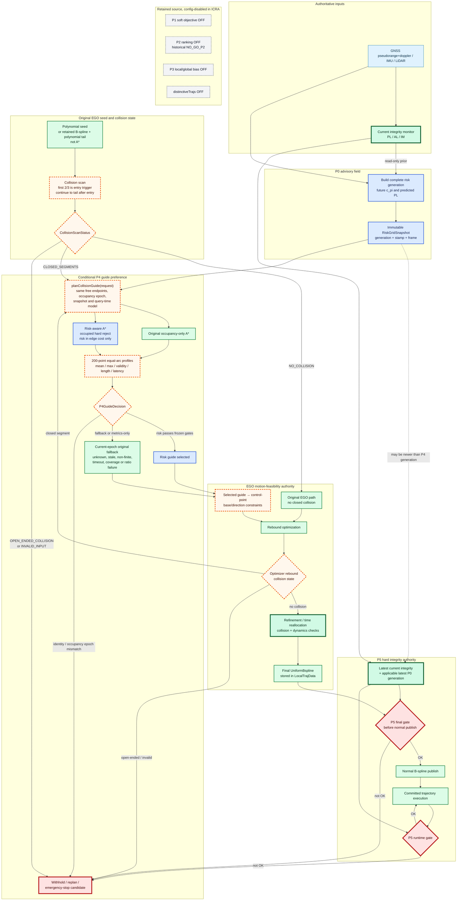

# ICRA System Flow — Active P0 + P5 contingency

> Contingency activated 2026-08-25 after authoritative P4-G0C `SCIENTIFIC_NO_GO`.

> Current status: P0 Gate-0B `PASS`; P4 `G0C NO_GO / DISABLED`; P5 `IMPLEMENTED-BUT-UNQUALIFIED`.

The active flow is now `P0 advisory snapshot -> original EGO planning/refinement -> P5 final -> normal publish
-> P5 runtime`. P1/P2/P3/P4 are disabled in the conference profile. The detailed P4 diagram below is retained
as the audited failed route and does not authorize P4 application or G0D.

> Scope pivot: 2026-08-20. Source audit: `dev/icra` at `bd3858a72ba06b7eb1551006876c55362c979bab`.

> Status: P0 `BLOCKED/UNQUALIFIED`; P4 `NOT_QUALIFIED`; P5 `IMPLEMENTED-BUT-UNQUALIFIED`. Historical Gate 0A remains `NO_GO_P2`.

This document is the living route diagram. Solid arrows show required runtime flow. Dashed orange nodes identify planned seams or unresolved gaps, not completed implementation.

## Target event flow

Initial `NO_COLLISION` bypasses P4 only for initial constraints. A later optimizer rebound collision re-enters the same scan and P4 seam.

If no later closed collision occurs, the path continues to P5. P4 runs only for one or more complete `free→occupied→free` segments.

An open-ended collision never receives a fabricated A* endpoint. The current replan fails and no new normal trajectory is published through that attempt.

## Audited implementation gaps

```mermaid
flowchart LR
  S["Polynomial / B-spline seed"]:::present
  C["initControlPoints<br/>scan stops near 2/3"]:::gap
  A["Single AstarSearch dispatch"]:::gap
  B["Control-point base/direction"]:::present
  X["Manager clears P4 snapshot"]:::gap
  O["Optimizer rebound"]:::present
  D["Paired original/risk code"]:::gap
  F["Final B-spline"]:::present
  P["P5 final before publish<br/>when enabled"]:::present

  S --> C
  C -->|closed segment only| A --> B --> X --> O
  O --> D
  D -->|snapshot unavailable fallback| F --> P
  X -.->|breaks risk snapshot lifetime| D

  classDef present fill:#DCFCE7,stroke:#15803D,stroke-width:2px,color:#052E16;
  classDef gap fill:#FFF7ED,stroke:#EA580C,stroke-width:3px,stroke-dasharray:6 4,color:#431407;
```

At the audited commit, the initial path can use risk-aware A* and reach control-point constraints. It does not create a same-event original/risk comparison or populate comparable guide evidence.

The paired original/risk code exists only in optimizer rebound. The manager has already cleared the snapshot, so that path normally falls back with `snapshot_unavailable`.

Existing P4 mean/max fields aggregate queried expanded edges. They are not risk profiles of the returned guide and cannot support a lower-risk-path claim.

The existing `p4` profile does not enable P5. The existing `all` profile enables forbidden P1/P2/P3 paths. The composite `icra_p0_p4_p5` profile is planned, not implemented.

## Event-gated status

| Gate/event | Entry condition | Exit evidence | Current state |
|---|---|---|---|
| Scope pivot | Supervisor authorizes new route | Docs, requirement, state and task agree | `CONDITIONAL_GO` for preparation |
| ICRA-004 smoke | Supervisor changeset handed off and functional GPU preflight | Valid integrity, one real P0 generation, 76,800 queries | `PASS`; reviewed at `3de0892` |
| P0 Gate-0B | Reviewed smoke PASS | ≥20 generations and p95 `≤400 ms` | `ICRA-005 TASK_READY`; benchmark pending |
| P4-G0A | P0 Gate-0B PASS; red fixture reviewed | Closed/no/open/multi scan cases PASS | `PASS` (historical closed route) |
| P4-G0B | G0A PASS | Metrics-only pair, identity and 200/200 profiles; no application | `PASS` (historical closed route) |
| P4-G0C | G0B PASS | Metrics-only calibration and positive mean/max improvement | `SCIENTIFIC_NO_GO`: max improvement Q10 = 0; route closed |
| P4-G0D | G0C scientific GO | Post-freeze selected hash reaches B-spline and P5 | Permanently unauthorized for this conference route |
| P5 system gate | Reviewed P0+P5 full-sensor profile, zero-failure tests, immutable install, parser `0/0/0`, GPU PASS, all 16 processes, GNSS+IMU+LiDAR topics and positive GNSS/LiDAR P0 use | SAFE_NORMAL, final reject/no-publish and runtime-fail prospective identities PASS | `ICRA-069 BLOCKED` because cases resolved GNSS-disabled; revised ICRA-070 full-sensor correction + `-003` live qualification `TASK_READY` |
| Campaign | All technical gates PASS | GPU ready and `≥40 GiB` free | Storage gate remains external |

Passing one row authorizes only Supervisor review and the next explicit task. It does not automatically move a later row to PASS.

ICRA-004 remains P0-only. P1/P2/P3/P4/P5 stay disabled in its smoke, and no P4 production change is allowed before reviewed P0 Gate-0B completion.

## Identity and fallback flow

One P4 request freezes attempt ID, segment ID, free endpoints, occupancy epoch, P0 generation, query base and P4 config.

The decision records original/risk/selected hashes, 200 samples per guide, risk statistics, length ratio, both search latencies, total latency and fallback reason.

If occupancy epoch or request identity changes before control-point injection, the decision is invalid. Neither guide is injected, and the attempt requests replan without a new normal publish.

When occupancy identity is unchanged, unknown, stale, invalid or non-finite risk is never treated as low risk. A risk-search failure or 0.2-second timeout falls back to the current-epoch original guide.

P5 may acquire a later P0 generation. Evidence stores P4 and P5 generation IDs separately; generation equality is reported only when observed.

## Configuration flow

The planned composite profile enables P0, P4, P5 final and P5 runtime. It fixes `planner_enable_all_safety=false` and `manager/use_distinctive_trajs=false`.

P1, P2 and P3 are disabled at both high- and low-level switches. Their metrics, debug, fanout and RViz paths are also off, while source, tests, targets and legacy profiles remain.

G0B and G0C force `p4.metrics_only=true` and `selection_applied=false`. They record both guides while injecting the original guide.

Only G0D and the frozen treatment may set `p4.metrics_only=false`. They must bind the frozen threshold-registry hash before applying the risk guide.

The resolver must fail on an explicit override that violates this profile. Neither the composite profile nor `p4.metrics_only` exists at the audited commit.

The only permitted metrics-only override belongs to registered G0B/G0C qualification arms. G0D and formal treatment require metrics-only false and a frozen threshold hash.

## Historical result placement

Gate 0A's 378 singleton attempts remain `NO_GO_P2`. This freezes P2 for the ICRA route but does not delete its implementation.

Historical early `collision_segment_count=0` rows remain unchanged. They are now interpreted narrowly: the early closed-segment observer saw no complete segment in its truncated window.

Later rebound evidence can coexist with those rows. The P4 gates require new prospective evidence and never relabel Gate 0A as a P4 test.

## Invariants

1. P0 and P4 are advisory; neither may write back to current PL/AL/IM or emit a safety PASS.
2. Occupancy rejection occurs before P4 risk evaluation and remains authoritative.
3. Original and risk guides share free endpoints, occupancy epoch, snapshot and time model.
4. Open-ended collision is explicit and prevents a new normal publish from that attempt.
5. P4 selection is observable through B-spline lineage; CSV/RViz never changes the decision.
6. EGO collision, dynamics, refinement and feasibility checks remain authoritative.
7. P5 final precedes normal publication; P5 runtime is a separate execution-time gate.
8. P1/P2/P3 stay in source but remain config-disabled in registered ICRA arms.
9. Unknown, stale, invalid and non-finite evidence fails closed or falls back as specified.
10. No documentation claims certification, physical isolation or a formal safety guarantee.

## Development records

Future records belong in `docs/icra27/dev/` and link to this file. Each record names affected flow nodes, task/gate, requirements, tests, evidence paths and unresolved blockers.

Implementation completion alone cannot change a gate status. Only a Supervisor evidence review may update `BLOCKED`, `NOT_QUALIFIED` or `IMPLEMENTED-BUT-UNQUALIFIED`.
