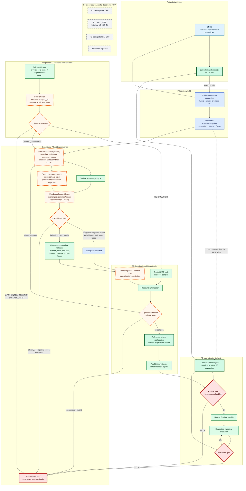

# ICRA System Flow — User-owned P0 -> P4-v2 -> P5 recovery

> User decision 008 update 2026-08-28: ICRA-076 remains BLOCKED/user-bypassed/NOT PASS with wrong-domain and
> incomplete-source-freeze debt. ICRA-077 may execute the unchanged frozen 360-row held-out order once. Runtime
> authority is unchanged; no retry, source/install change, ICRA-078, qualification or campaign is authorized.

> ICRA-076 repair Review update 2026-08-28: measured replay/U95/local evidence pass, but replay uses `r=0.5`
> instead of frozen `r=0.75/b=1.5 m`, and tracked third-party JSON probe inputs are absent from freeze-005.
> Runtime graph is unchanged; ICRA-076 is NOT PASS and held-out ICRA-077 remains inactive pending user decision.

> User decision 007 update 2026-08-27: repair ICRA-076 offline rather than bypass. The runtime graph is unchanged;
> the task only replaces synthetic replay evidence with production-emitted B measurements, corrects `|D_peak|`
> U95, localizes verification evidence and completes test-source byte freeze. No held-out ICRA-077, qualification
> or campaign work is authorized before Review PASS.

> ICRA-076 Review update 2026-08-27: freeze-003 is validator-green but rejected because repeatability snapshots
> are synthesized, U95 uses the wrong statistic, verification evidence is external and required verification-test
> bytes are not fully frozen. Runtime graph remains unchanged. ICRA-076 is BLOCKED/NOT PASS; no held-out ICRA-077,
> qualification or campaign task is active pending user decision.

> User decision 006 update 2026-08-27: ICRA-075 remains BLOCKED/user-bypassed/NOT PASS with 0/40, no power inputs
> and two accepted P1 defects. ICRA-076 is TASK_READY to freeze the unchanged runtime graph's formal protocol,
> threshold rule, conservative `n=60`, seeds/order and exact source/install identities. No held-out execution,
> ICRA-077, qualification or campaign is authorized before Review PASS.

> ICRA-075 bounded repair Review update 2026-08-27: metrics-only terminal publication now fails closed and the
> retained matrix-002 diagnosis correctly proves `FROZEN_CONTRACT_INCOMPATIBLE`, so Builder stopped before
> GPU/ROS/live. Standards still rejects overwritten earliest source-change evidence and unrestricted diagnosis
> output. The matrix remains 0/40 with no power inputs; no ICRA-076 task is active pending user decision. Runtime
> authority and route lock are unchanged.

> User decision 005 update 2026-08-27: ICRA-075 repair is TASK_READY. Restore fail-closed lineage/source gates and
> diagnose the retained P5 low margin. The runtime graph may change only to correct a proven miswire of existing
> frozen semantics; no risk/provider/AL/PL/fusion/P5 threshold or authority edge may be weakened. ICRA-076 remains
> blocked.

> ICRA-075 Review update 2026-08-27: first-row P5 `current_low_margin` prevents EGO final, publication and runtime;
> the matrix is 0/40 and no power record exists. Metrics-only terminal-lineage failures are fail-open before
> publication and analyzer lacks a final source recheck. ICRA-075 is BLOCKED/NOT PASS with `next_task=NONE` pending
> an explicit user repair-or-bypass decision; ICRA-076/formal Layer 4 remains unauthorized.

> ICRA-074 Review update 2026-08-27: V2 geometry and offline production P4-v2 seams pass 51/51; production/config
> remains unchanged and no effect claim follows. ICRA-075 is TASK_READY to materialize V2 runtime scenes and
> collect development exploratory/power inputs. Runtime authority split is unchanged; formal Layer 4 is blocked.

> User decision 004 update 2026-08-27: ICRA-073 remains BLOCKED/user-bypassed/NOT PASS. Only risky amplitude is
> amended to `±2.20 m` for expected `1.371035 m` raw cuboid clearance; every other 073 blocker remains accepted
> debt. That decision issued ICRA-074, which now passes; ICRA-075 is active. Runtime architecture is unchanged;
> no effect, qualification or campaign claim is authorized.

> Four-layer workflow update 2026-08-26: `docs/icra27/ICRA_FOUR_LAYER_DEVELOPMENT_WORKFLOW.md` groups the
> unchanged gates into iterative integration, stabilization, effect diagnosis and formal verification. ICRA-072A
> Layer 1 passed with source-bound `run-024`; ICRA-072B remains BLOCKED/NOT PASS. User decision
> `USER-ICRA-ROUTE-20260827-003` accepts that
> debt and activates ICRA-073 inverse-corridor effect diagnostics without weakening runtime authority.

> Development-first update 2026-08-26: user decision `USER-ICRA-ROUTE-20260826-002`, anchored at
> `b24a330d79d6e85e8080cf2a359bb1a18765e5a5`, authorizes ICRA-072 to connect this complete vertical slice before
> effect optimization. ICRA-071 repair is non-blocking backlog; campaign and scientific claims remain blocked.

> User route restored 2026-08-26 by `USER-ICRA-ROUTE-20260826-001`, bound to pushed anchor `48caa9d`.

> Current status: P0 Gate-0B `PASS`; P4-v1 `G0C SCIENTIFIC_NO_GO / IMMUTABLE`; source-bound `run-024` passes the
> complete P4-v2/EGO/fused-P5/publication/runtime identity chain and closes ICRA-072A Layer 1; ICRA-072B is
> `BLOCKED / USER-ACCEPTED BYPASS / NOT PASS`; ICRA-073 is also `BLOCKED / USER-ACCEPTED BYPASS / NOT PASS`;
> ICRA-074 is `PASS` and ICRA-075 is `TASK_READY`. P5 remains
> `IMPLEMENTED-BUT-UNQUALIFIED`.

> ICRA-070 is `SUPERSEDED_UNQUALIFIED_BY_USER_ROUTE_DECISION`. Its P0+P5 implementation/evidence remains the
> future matched control; replacement/parser/GPU/live/analyzer remain uninvoked. Only the exact regenerable
> build/install roots in the pushed retirement inventory are authorized for cleanup; its evidence and logs stay.

The active target is again `P0 advisory snapshot -> P4-v2 collision-guide preference -> EGO planning/refinement
-> P5 final -> normal publish -> P5 runtime`. The diagram below retains the valid external P4 seam and authority
split. Orange P4 internals are the active ICRA-072 development surface; their effect remains unqualified.

P4-v2 changes the internal risk decomposition, objective, time-aware search labels, controllable guide domain
and statistical estimand. It does not let risk override occupancy, EGO feasibility or P5 hard gates. The exact
route lock and recovery gates are in
`docs/icra27/ICRA_P0_P4_P5_DEVIATION_AUDIT_AND_RECOVERY_ROADMAP.md`.

The frozen inverse-corridor design is
`docs/icra27/dev/ICRA_P4_V2_INVERSE_CORRIDOR_FIXTURE.md`. Its independent oracle is outside the runtime graph:
after a normal publication identity exists, the evaluation plane may read the frozen scene truth and the same
committed final B-spline to produce diagnostics. No oracle centre line, tube label, expected route or risk truth
may flow into P0, P4, EGO or P5. ICRA-073 implemented only the descriptor/preflight and then stopped on the
frozen geometry conflict; the current ICRA-072 selection trigger remains a distinct development fixture and
carries no scientific effect authority.

> Scope pivot: 2026-08-20. Source audit: `dev/icra` at `bd3858a72ba06b7eb1551006876c55362c979bab`.

> Historical status at the 2026-08-20 source-audit baseline: P0 `BLOCKED/UNQUALIFIED`; P4 `NOT_QUALIFIED`;
> P5 `IMPLEMENTED-BUT-UNQUALIFIED`. It does not override the current status above. Historical Gate 0A remains
> `NO_GO_P2`.

This document is the living route diagram. Solid arrows show required runtime flow. Dashed orange nodes identify planned seams or unresolved gaps, not completed implementation.

## Target event flow

Initial `NO_COLLISION` bypasses P4 only for initial constraints. A later optimizer rebound collision re-enters the same scan and P4 seam.

If no later closed collision occurs, the path continues to P5. P4 runs only for one or more complete `free→occupied→free` segments.

An open-ended collision never receives a fabricated A* endpoint. The current replan fails and no new normal trajectory is published through that attempt.

## Audited implementation gaps

```mermaid
flowchart LR
  S["Polynomial / B-spline seed"]:::present
  C["initControlPoints<br/>scan stops near 2/3"]:::gap
  A["Single AstarSearch dispatch"]:::gap
  B["Control-point base/direction"]:::present
  X["Manager clears P4 snapshot"]:::gap
  O["Optimizer rebound"]:::present
  D["Paired original/risk code"]:::gap
  F["Final B-spline"]:::present
  P["P5 final before publish<br/>when enabled"]:::present

  S --> C
  C -->|closed segment only| A --> B --> X --> O
  O --> D
  D -->|snapshot unavailable fallback| F --> P
  X -.->|breaks risk snapshot lifetime| D

  classDef present fill:#DCFCE7,stroke:#15803D,stroke-width:2px,color:#052E16;
  classDef gap fill:#FFF7ED,stroke:#EA580C,stroke-width:3px,stroke-dasharray:6 4,color:#431407;
```

At the audited commit, the initial path can use risk-aware A* and reach control-point constraints. It does not create a same-event original/risk comparison or populate comparable guide evidence.

The paired original/risk code exists only in optimizer rebound. The manager has already cleared the snapshot, so that path normally falls back with `snapshot_unavailable`.

Existing P4 mean/max fields aggregate queried expanded edges. They are not risk profiles of the returned guide and cannot support a lower-risk-path claim.

The existing `p4` profile does not enable P5. The existing `all` profile enables forbidden P1/P2/P3 paths. The composite `icra_p0_p4_p5` profile is planned, not implemented.

## Event-gated status

| Gate/event | Entry condition | Exit evidence | Current state |
|---|---|---|---|
| User route recovery | User decision binds the exact pushed prior anchor | Route lock, docs, requirements and Supervisor state agree | `USER_RESTORED_P4_V2`; ICRA-071 handoff governed by `AGENT_STATE.md` |
| ICRA-004 smoke | Supervisor changeset handed off and functional GPU preflight | Valid integrity, one real P0 generation, 76,800 queries | `PASS`; reviewed at `3de0892` |
| P0 Gate-0B | Reviewed smoke PASS | ≥20 generations and p95 `≤400 ms` | `PASS` (ICRA-035) |
| P4-G0A | P0 Gate-0B PASS; red fixture reviewed | Closed/no/open/multi scan cases PASS | `PASS` (historical closed route) |
| P4-G0B | G0A PASS | Metrics-only pair, identity and 200/200 profiles; no application | `PASS` (historical closed route) |
| P4-G0C | G0B PASS | Metrics-only calibration and positive mean/max improvement | P4-v1 `SCIENTIFIC_NO_GO`: max improvement Q10 = 0; v1 route closed, v2 remains prospective |
| Layer 1 iterative integration | User route lock, decision 002 and four-layer workflow agree with state/task/plan | One repeatable-development run preserves a real P0/P4-v2/EGO/P5-final/publish/runtime identity | `PASS`; source-bound `run-024` preserves one ordered committed identity with exact source admission and operational closure |
| Layer 2 stabilization | ICRA-072A boundary Review PASS | Production-shaped happy-path regression plus epoch/attempt/lineage/P5 fail-closed boundaries | `BLOCKED / USER-ACCEPTED BYPASS / NOT PASS`; debt retained |
| Inverse-corridor effect diagnostic | User decision 003 and issued ICRA-073 | PRIMARY/MIRROR/NULL paired control/treatment with oracle-isolated final-trajectory diagnostics | `ICRA-073 BLOCKED / USER BYPASS / NOT PASS`; no paired diagnostic |
| Targeted optimization | User decision 004 and ICRA-074 | V2 geometry-only amendment followed by offline production P4-v2 bottleneck TDD | `ICRA-074 PASS`; production unchanged, no effect claim |
| Exploratory/power inputs | Issued ICRA-075 | V2 runtime scenes, development paired arms/ablations and non-freezing variance/power analysis | `ICRA-075 BLOCKED / USER BYPASS / NOT PASS`; 0/40 and no power inputs retained |
| Held-out confirmation | User decision 008 after ICRA-076 user bypass | Frozen PRIMARY/MIRROR/NULL 360-row paired one-shot | `ICRA-077 TASK_READY`; debt-bearing, no retry/source-install change |
| P4-G0D | P4-v2 held-out confirmatory PASS | Post-freeze selected hash reaches B-spline and P5 | Planned as `ICRA-078`; P4-v1 G0D remains unauthorized |
| P5 system gate | ICRA-078 Review PASS and a separately issued prospective integration task | Treatment/control SAFE_NORMAL, final reject/no-publish and runtime-fail identities PASS | Planned as `ICRA-079`; ICRA-070 is superseded unqualified and retained only as control-arm engineering |
| Campaign | ICRA-079 Supervisor Review PASS plus a distinct user decision | Fresh GPU and `≥40 GiB` free plus frozen ICRA-080 task | Explicitly blocked; no automatic transition from any scientific or qualification gate |

Passing one row authorizes only Supervisor review and the next explicit task. It does not automatically move a later row to PASS.

ICRA-004 remains P0-only. P1/P2/P3/P4/P5 stayed disabled in its smoke. P0 Gate-0B has passed; decision 002
authorizes current P4-v2 product work in ICRA-072 without accepting the ICRA-071 guard repair.

## Identity and fallback flow

One P4 request freezes attempt ID, segment ID, free endpoints, occupancy epoch, P0 generation, query base and P4 config.

The decision records original/risk/selected hashes, 200 samples per guide, risk statistics, length ratio, both search latencies, total latency and fallback reason.

If occupancy epoch or request identity changes before control-point injection, the decision is invalid. Neither guide is injected, and the attempt requests replan without a new normal publish.

When occupancy identity is unchanged, unknown, stale, invalid or non-finite risk is never treated as low risk. A risk-search failure or 0.2-second timeout falls back to the current-epoch original guide.

P5 may acquire a later P0 generation. Evidence stores P4 and P5 generation IDs separately; generation equality is reported only when observed.

## Configuration flow

The ICRA-072 development composite profile enables P0, P4-v2, P5 final and P5 runtime. It fixes
`planner_enable_all_safety=false` and `manager/use_distinctive_trajs=false`.

P1, P2 and P3 are disabled at both high- and low-level switches. Their metrics, debug, fanout and RViz paths are also off, while source, tests, targets and legacy profiles remain.

G0B and G0C force `p4.metrics_only=true` and `selection_applied=false`. They record both guides while injecting the original guide.

ICRA-072 may set `p4.metrics_only=false` only in its explicitly tagged development profile to prove flow and
lineage; this is not G0D or a qualified treatment. G0D and the later frozen treatment must separately bind the
frozen threshold-registry hash before any formal application.

The resolver must fail on an explicit override that violates this profile. The ICRA-072 task creates the new
development profile prospectively; it does not rewrite the audited historical state.

The only historical qualification metrics-only override belongs to registered G0B/G0C arms. ICRA-072 may use
false only in the tagged development profile without a science claim; G0D and formal treatment separately
require metrics-only false and a frozen threshold hash.

## Historical result placement

Gate 0A's 378 singleton attempts remain `NO_GO_P2`. This freezes P2 for the ICRA route but does not delete its implementation.

Historical early `collision_segment_count=0` rows remain unchanged. They are now interpreted narrowly: the early closed-segment observer saw no complete segment in its truncated window.

Later rebound evidence can coexist with those rows. The P4 gates require new prospective evidence and never relabel Gate 0A as a P4 test.

## Invariants

1. P0 and P4 are advisory; neither may write back to current PL/AL/IM or emit a safety PASS.
2. Occupancy rejection occurs before P4 risk evaluation and remains authoritative.
3. Original and risk guides share free endpoints, occupancy epoch, snapshot and time model.
4. Open-ended collision is explicit and prevents a new normal publish from that attempt.
5. P4 selection is observable through B-spline lineage; CSV/RViz never changes the decision.
6. EGO collision, dynamics, refinement and feasibility checks remain authoritative.
7. P5 final precedes normal publication; P5 runtime is a separate execution-time gate.
8. P1/P2/P3 stay in source but remain config-disabled in registered ICRA arms.
9. Unknown, stale, invalid and non-finite evidence fails closed or falls back as specified.
10. No documentation claims certification, physical isolation or a formal safety guarantee.

## Development records

Future records belong in `docs/icra27/dev/` and link to this file. Each record names affected flow nodes, task/gate, requirements, tests, evidence paths and unresolved blockers.

Implementation completion alone cannot change a gate status. Only a Supervisor evidence review may update `BLOCKED`, `NOT_QUALIFIED` or `IMPLEMENTED-BUT-UNQUALIFIED`.
