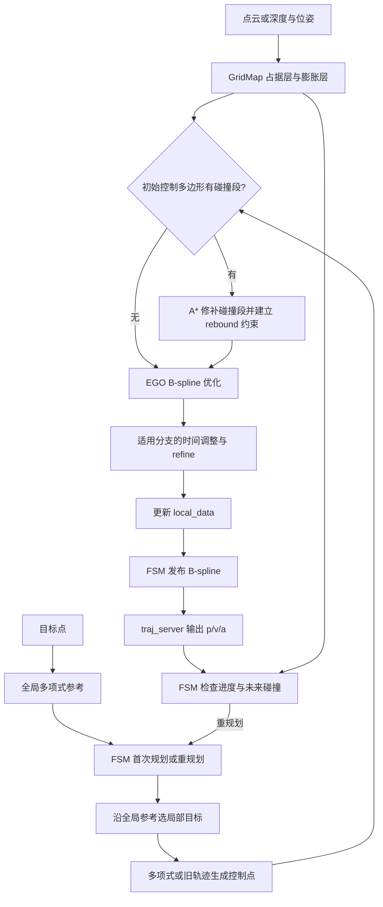
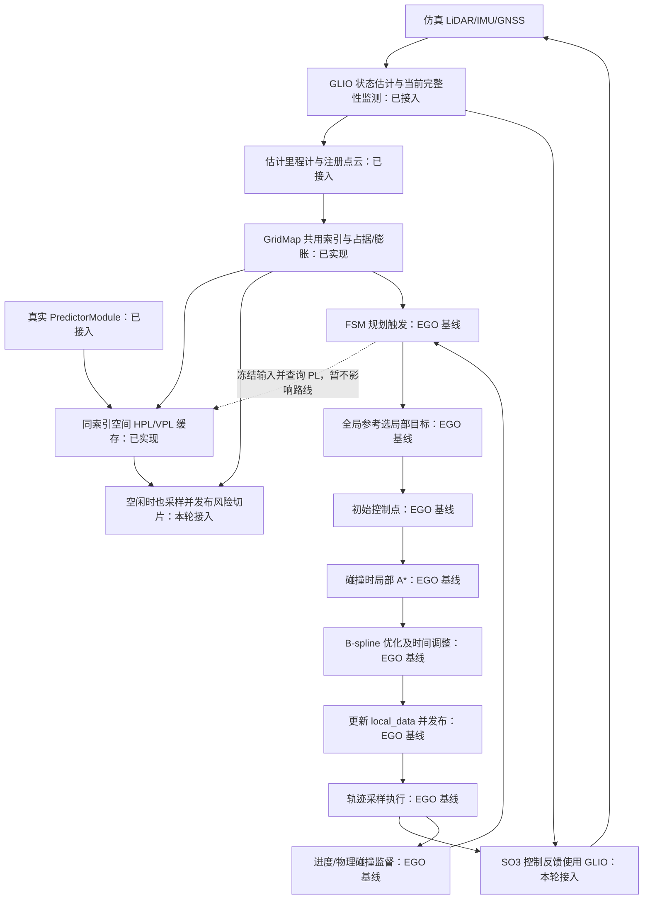
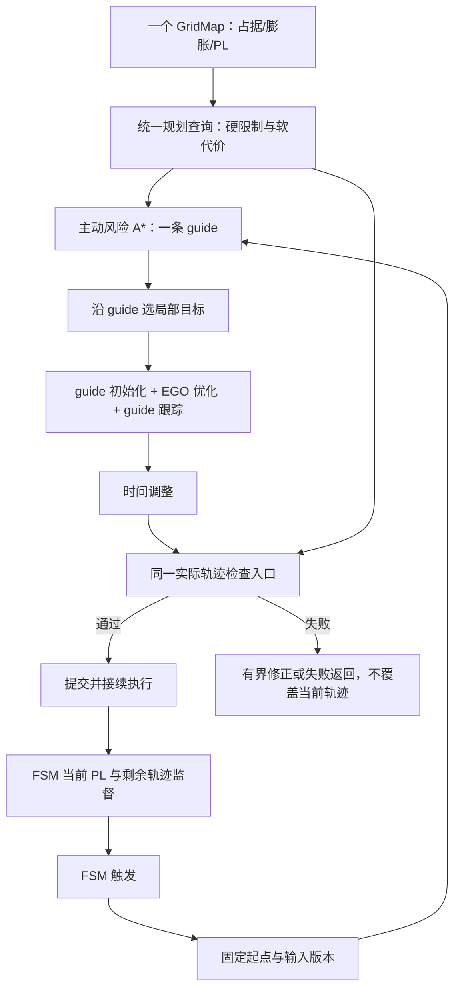

# 回归原版 EGO：规划流程与开发顺序

## 状态与依据

结构基线：`../ego-planner-swarm`，提交 `23a8d5a191711dd65633df689bd00f55d4dea8f9`。原版目录只读。
设计依据：工作区 `docs/0928_review.md` 第 1862 行以后的最终收敛，以及本轮用户确认。
阶段 1 已恢复 EGO 主线、同一个 GridMap 的空间 PL 缓存与真实 PredictorModule 接入。本轮扩展同图可视化与仿真闭环：控制器改用 GLIO 里程计；完整传感器闭环的实测结果单独记录，不将 RViz 画面当作安全认证。
风险搜索、guide 跟踪、完整实际轨迹检查、统一提交与连续接续依次在后续阶段开发。

## 原版轨迹流程（固定基线）

以下路径均相对原版 `src/planner/`。

| 模块/函数 | 职责与数据 |
|---|---|
| `plan_env/GridMap` | 点云/深度建图；MappingParameters 保存空间定义；MappingData 分别保存 occupancy_buffer_、occupancy_buffer_inflate_，共用 posToIndex/toAddress |
| `EGOReplanFSM::planNextWaypoint` | 接受目标，调用 manager.planGlobalTraj 生成全局多项式参考；参考本身不搜索障碍路线 |
| `EGOReplanFSM::execFSMCallback` | INIT → WAIT_TARGET → GEN_NEW_TRAJ/REPLAN_TRAJ → EXEC_TRAJ；依据进度、时间和碰撞滚动重规划 |
| `planFromGlobalTraj/planFromCurrentTraj` | 首次取里程计状态；重规划取旧曲线的 p/v/a，构造本次起点 |
| `getLocalTarget/callReboundReplan` | 沿全局参考选 planning horizon 内的局部目标，再调用 manager |
| `EGOPlannerManager::reboundReplan` | 多项式或旧轨迹采样 → B-spline 参数化 → rebound 优化 → 适用分支时间调整/refine → updateTrajInfo |
| `BsplineOptimizer::initControlPoints` | 检测控制多边形的碰撞段；有碰撞才调用 AStar 构造 rebound 基点和方向 |
| `AStar::AstarSearch` | 物理膨胀障碍查询，搜索碰撞段绕行路径；搜索节点池不是第二张环境地图 |
| `BsplineOptimizer::rebound_optimize` | 平滑、障碍、动力学及原 swarm 约束；必要时局部 rebound 修补 |
| `refineTrajAlgo/calcFitnessCost` | 时间调整后的参考跟踪与修正；默认 rebound 主目标没有 guide 跟踪项 |
| `updateTrajInfo` | 更新 local_data：位置曲线、导数、起点、时间和轨迹编号 |
| `callReboundReplan/traj_server::bsplineCallback` | FSM 发布 B-spline；server 替换当前曲线并建立导数 |
| `traj_server::cmdCallback` | 100 Hz 采样 p/v/a 和 yaw，输出 position_cmd |
| `EGOReplanFSM::checkCollisionCallback` | 约 50 ms 检查未来碰撞，触发重规划或 EmergencyStop |



原版边界：可选 distinctive_trajs 产生多个候选，新主线关闭该分支。部分优化/运行时碰撞检查只覆盖前约三分之二；时间调整在 swarm drone_id > 0 的分支被跳过。manager 先写 local_data 再由 FSM 发布。EmergencyStop 用六个相同控制点生成定点曲线，尚不是从运动状态生成的制动轨迹。上述行为是本轮基线，不代表最终完整性或执行保证。

## 当前阶段流程图（随代码同步）

本图已随阶段 1 实施更新，描述新的 IAP 代码主线。搜索、优化、检查与执行仍保持标明的 EGO 基线行为，不代表旧 P0–P5 能力。



## 目标设计与顺序

| 阶段 | 修改 | 验收 |
|---|---|---|
| 1：已实现，闭环待验收 | 恢复 EGO 主线，在 GridMap 增加独立 PL 层 | 同一索引、真实预测、缓存有效性、物理规划与命令链路的自动化测试已通过 |
| 1a：本轮仿真集成 | GLIO 同时接规划与 SO3，发布障碍及同图空间 PL 切片 | 真实输入链、有效 PL、实际曲线、控制反馈与可视化经闭环实测核验 |
| 2 | 每次规划主动搜索一条风险 guide | 无物理障碍、前方只有退化区时仍能绕行 |
| 3 | guide 初始化与主优化参考跟踪 | 优化和时间调整后实际曲线没有切回禁入区 |
| 4 | manager 中统一实际轨迹检查 | 完整候选发布前检查，运行时检查剩余轨迹；失败不污染当前轨迹 |
| 5 | 统一提交、连续接续与停止 | 同一状态/时间接续，至多当前+一条待接续轨迹，可执行的停止行为 |



每次只生成一条 guide 和一条候选。第一版不加直接 PL 梯度项。完整性必须禁止进入的区域用硬规则，允许进入但希望绕开的区域用软代价；阈值与权重在阶段 2 由用户确认。整条搜索边和最终实际曲线均须检查；不能只验证路径端点或控制点。失败不能永久写成物理障碍。同输入确定性搜索不无限重试。

## 阶段 1 接口与验证

### 所有权与接口

- `MappingData::risk_buffer_` 是与 occupancy_buffer_ 等长的 `vector<GridRiskVoxel>`，通过相同 posToIndex/toAddress 查询。每项保存 HPL、VPL、状态、版本；原点、分辨率和尺寸不重复存储。
- `GridMap::bindRiskContext(context)` 返回新版本；绑定拥有冻结输入的点查询函数及参考时刻/有效期/坐标系/占据版本。任何新绑定都会使旧版本不可查询。
- `GridMap::queryRisk(position, version, evaluation_time)` 按体素中心计算一次并复用同版本结果，不插值，不维护 horizon 数组。状态包括 UNCOMPUTED、VALID、INVALID、STALE、OUT_OF_MAP、FRAME_MISMATCH、VERSION_CHANGED、INVALID_QUERY；失败的 PL 为 NaN。
- `GridMap::invalidateRiskContext()` 用于输入更换；占据更新序列在查询前后均校验。resetBuffer 也提交占据版本并撤销风险上下文，不能在重置后重新绑定旧地图证据。
- `getOccupancy/getInflateOccupancy` 保持物理语义。GNSS 的 `set_occupancy_query` 读取同一地图的原始占据，观测支持独立查询；不会在预测器内部再构造 LocalOccupancyGrid。占据查询与外部格子查询的绑定采用后绑定者生效。

### 数据来源与时序

现有 manager 的 `planner_risk.cpp` 只负责订阅与绑定。里程计、IntegrityReport、GNSS 测量与星历组成 IntegritySnapshot；GNSS 历元按监测报告来源身份匹配，最多保留 64 个且按 GNSS 有效期裁剪。注册地图的只读视图提供原始障碍、观测证据和 LiDAR FIM 输入。这个视图属于 GridMap，不是独立地图管理器。

每次 reboundReplan 前绑定一次，使用 PredictorModule 点查询，query_time 与 evaluation_time 均固定为该轮参考时刻，horizon=0。阶段 1 查询起点 PL 作诊断，尚不参与搜索、代价或发布决策。地图和预测输入回调使用原 EGO 的单线程执行器；不启动旧 worker pool 或执行快照线程。

保留现有绑定中“当前 PL / K”构造对角位置先验的 advisory 近似（K=5），不把它解释为当前监测的协方差或新的认证结论。LiDAR 使用实际地图点构造 FIM，禁用 legacy observability 降级；没有有效预测时返回失败。

| 配置/接口 | 默认与含义 |
|---|---|
| `risk/source` | fusion；也支持 gnss、lidar，与场景完整性来源对应 |
| `risk/validity_s` | 0.5 s；约束本轮、里程计、当前 PL 和地图来源时间 |
| `risk/gnss_max_age_s` | 2.0 s；fusion/gnss 模式同时受 GNSS 历元有效期约束 |
| `risk/integrity` | canonical 重映射到 `/iap/integrity` |
| `risk/range, ephem, glo_ephem, receiver_lla, iono` | canonical 重映射到现有 `/ublox_driver/` 对应输入 |
| `odom_world` | FSM 与风险输入使用同一个里程计重映射 |
| `frame_id`（traj_server） | 默认 map；命令时钟使用节点时钟 |

有效期取所有适用输入截止时刻的最早值。缺失、未来时间、过期、非有限值、负 PL、坐标不匹配都不会成为有效零风险。空间预测只代表冻结时刻，不声明到达时刻的完整性。

### 清理与兼容边界

规划器恢复原版 FSM/manager/A*/B-spline/traj_server，删除已替换的 P0–P5 源码、专属测试和参数，以及独立 RiskGridMap/UnifiedRiskGrid、旧转换与旧 Phase-2 evaluator/P0 profiler。Bspline 消息和 LocalTrajData 去掉旧执行证书字段；这是有意的接口变更，需重建 traj_utils 及依赖包。独立预测算法和注册点云输入仍保留。

当前 canonical 仿真图由 `_includes/full_stack_runtime.py` 组成，不使用旧实验开关。历史 bp 入口、实验脚本和产物保留用于查阅；它们的旧规划参数、消息契约和验收结果不适用于本轮。`iap_flight` 暂时拒绝启动，待阶段 4/5 的检查、接续、停止完成后再恢复部署校准与车辆控制验收。

仿真保留注册点云输入所需的 SI 加速度系数 1.0、NAIVE 初始化、512×40 spherical_first_hit_v1 射线模型与 2 秒传感器启动延迟；地图和规划使用同一静态坐标平移，不动态对齐真值。

原版为适配现有输入进行了必要调整：统一节点时钟、命令 frame、Jazzy 头文件/依赖导出；未来开始时间到来前不发送原版的零坐标命令。尚未实现 pending 轨迹接续。

### 本轮仿真可视化接口

- `iap_sim` 中规划器与 SO3 控制器统一订阅 `/drone_0_visual_slam/odom`（`map`）；真值只供传感器仿真与对照。Current Integrity Monitor 仍是 GLIO 扩展，Advisory 查询仍由 EGO manager 调用 PredictorModule。
- `risk_viz/enabled=true` 时，manager 独立于规划目标每秒冻结一次预测上下文，在无人机附近 10×10 m、高度吸附至原 GridMap 体素中心的水平层，最多查询 100 个、间距约 1 m 的格子；同轮使用同一版本和原 `queryRisk()`，绑定上下文后给逐点采样 20 ms 预算。绑定开销另计并显示为 bind，整轮耗时显示为 cost；超采样预算只显示已算点并明确标为 incomplete。
- `/grid_map/occupancy`、`/grid_map/occupancy_inflate` 继续表示物理层；注册点云模式的原始占据可视化读取其真实 raw-cloud buffer。`/grid_map/risk_slice` 为 PointCloud2，字段 `x,y,z,rgb,hpl,vpl,status`，有效 PL 由固定色标着色；无效预测为紫色，未计算不伪造值。上下文过期、版本变化或坐标错误发布空切片。
- `/grid_map/risk_status` 是 TEXT_VIEW_FACING Marker，显示版本、冻结时间、切片高度、有效样本比例、耗时、当前监测 HPL/VPL 与原因；文字明确标注 frozen spatial PL。默认 HPL 色标 0–10 m、VPL 0–20 m，仅为可视化范围，不是安全阈值。
- `risk_viz/metric` 默认 `hpl`，可在 planner 运行时设成 `vpl`，下次切片更新颜色；`risk_viz/z_mode=follow|fixed` 与 `risk_viz/fixed_z_m` 在启动时选择高度。`traj_server` 在 `/planning/trajectory_curve` 发布其实际装载 B-spline 的采样曲线；RViz 用 GLIO 里程计历史显示实际运动。
- 当前风险图始终是某一冻结参考时刻的空间切片，不是未来到达时刻 PL，不影响 EGO 搜索、优化或执行授权。旧风险体素在新版本查询时不会作为有效数据返回。
- 首次 `fused_nominal` 闭环暴露随机森林树干直接穿过起飞点（真值地图最近障碍仅 0.089 m），造成 EGO 起始控制点碰撞。仿真随机森林现在只在起点和目标周围各留 1 m 圆形空间，保留中途树木与物理绕障任务；这属于场景输入修正，不改变 EGO 碰撞规则。
- 修正起终点后，已在真实传感器仿真中观察到 GLIO、注册障碍、B-spline、位置命令、SO3 命令与机体运动持续更新，SO3 的 ROS 订阅确认为 GLIO odom。该次运行还暴露了预测绑定耗时导致采样预算在第一点前耗尽，以及定时关闭时 `traj_server` 发布器被异步关闭；现按绑定和逐点采样分别计时，并让 `traj_server` 完成当前回调、释放 ROS 实体后关闭上下文。后续干净提交的实测结果仍需复核。

### 验证证据

- 显式 IAP 源路径构建 `iap、traj_utils、plan_env、path_searching、bspline_opt、ego_planner`：通过。
- `test_grid_map_risk`：6 项通过；地址/边界、占据独立、缓存命中、版本/重置、过期/坐标、异常值和查询期间失效。
- `test_grid_map_occupancy_epoch`：25 项通过；`test_registered_lidar_window`：18 项通过；注册点云启动/恢复进程测试通过。
- `test_predictor_module`：100 项通过，含新增直接占据查询对 GNSS canopy 结果的影响与 unknown 保留。
- `test_ego_baseline`：2 项通过；真实 LiDAR PL 查询及过期拒绝、EGO 物理障碍绕行与曲线/导数有限性。
- `test_ego_pipeline`：通过；独立规划节点接收目标、发布 B-spline，traj_server 输出 p/v/a 与独立 Cox-de Boor 基函数计算吻合。
- `test_canonical_launch_contracts`：32 项通过，涵盖统一地图配置、注册输入坐标、运行产物目录和阶段 1 实飞不可用。
- 上轮未运行 GPU/完整传感器闭环；当时两处 RViz 改动导致 `LIVE_BLOCKED_BY_UNRELATED_DIRTY_WORKTREE`。本轮已按用户要求单独提交两处改动；本次仿真可视化改动的自动化构建、GridMap 风险层、预测器、EGO 管线与 canonical launch 测试已通过。GPU 闭环结果待在提交后的干净工作区记录。不声明四分叉场景 LIVE PASS 或主动风险绕行已实现。

可复查命令（先加载 ROS 与工作区环境）：

```bash
src/iap/scripts/dev_planner/build_iap_dev.sh
ctest --test-dir build/plan_env -R 'test_grid_map_risk|test_grid_map_occupancy_epoch|test_registered_lidar_window|test_grid_map_startup_process' --output-on-failure
ctest --test-dir build/iap -R '^test_predictor_module$|^test_canonical_launch_contracts$' --output-on-failure
ctest --test-dir build/ego_planner -R '^test_ego_baseline$|^test_ego_pipeline$' --output-on-failure
```

首轮基线源文件：原版 [GridMap](../../../ego-planner-swarm/src/planner/plan_env/include/plan_env/grid_map.h)、[FSM](../../../ego-planner-swarm/src/planner/plan_manage/src/ego_replan_fsm.cpp)、[manager](../../../ego-planner-swarm/src/planner/plan_manage/src/planner_manager.cpp)、[优化器](../../../ego-planner-swarm/src/planner/bspline_opt/src/bspline_optimizer.cpp)、[轨迹服务](../../../ego-planner-swarm/src/planner/plan_manage/src/traj_server.cpp)。

## 文档维护规则

每次本轮规划开发在同一提交更新阶段流程图、接口、阶段状态和对应验证结果。未开发节点继续标记 EGO 基线。原版流程固定，目标图不作为已实现能力声明。无需为无关改动追加历史流水账。
