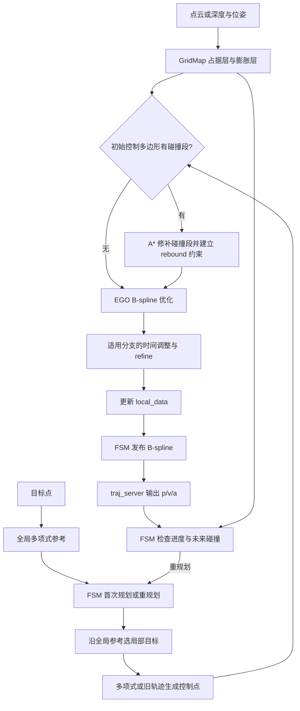
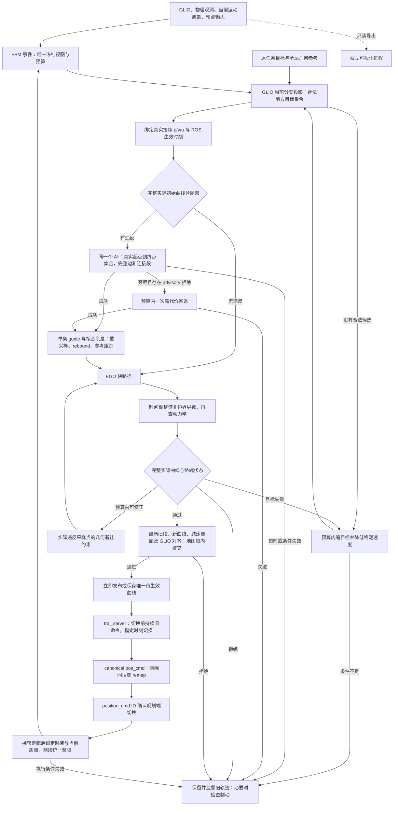
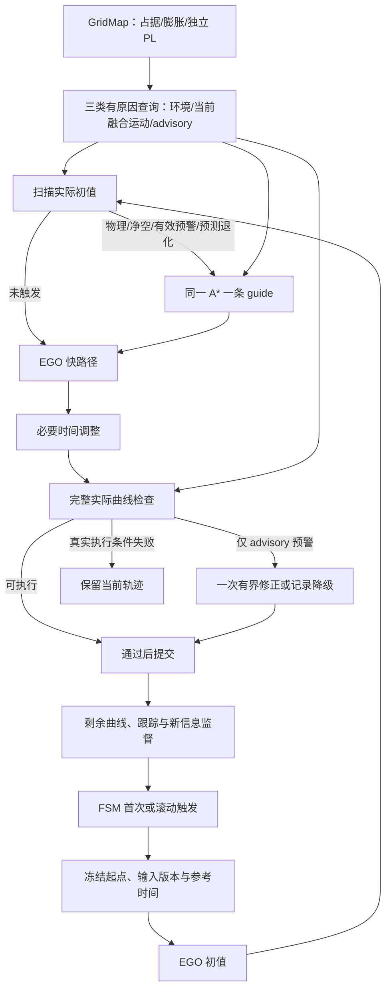

# 回归原版 EGO：规划流程与开发顺序

## 状态与依据

Advisory 验证见 [方案与实施结果](../dev_predictor/advisory_spatial_validation_plan.md)、[工具契约](advisory_validation_contract.md) 和 [正式报告](../../log/20261006T123756Z_794/export/analysis/advisory_validation/committed/report.md)。实验代码 `21f692e` 完成完整录制、原 codec/生产 PredictorModule 重放、来源拆分、S1–S5 合成机制对照及报告；共享同一冻结准备与状态映射，包装器只增加拒绝原因，来源准入、物理地图、执行授权和阈值不变。9 项新增 CPU 合同测试、EGO baseline/进程管线、PredictorModule CTest 与产物契约检查通过；提交后 135 个合成请求已重跑，225 项产物 hash 和报告链接已核验。缺 GNSS 阻断有效 LiDAR 的准入差异已复现，合成双源退化的弱方向先验贡献约 99.6965%，不等于真实森林结论，未擅自修正模型。真实输入可用性/空间敏感性为 `INCONCLUSIVE_INPUT_UNAVAILABLE`，实际误差为 `INCONCLUSIVE_LIVE_NOT_RUN`；GPU READY，但原有 RViz 修改仍触发 `LIVE_BLOCKED_BY_UNRELATED_DIRTY_WORKTREE`，没有启动现场。真实 start/middle/stop、固定合法路线和至少三次 GLIO 配对重复仍待测。

结构基线：`../ego-planner-swarm`，提交 `23a8d5a191711dd65633df689bd00f55d4dea8f9`。原版目录只读。
设计依据：工作区 `docs/0928_review.md` 第 1862 行以后的最终收敛，以及本轮用户确认。
阶段 1 已恢复 EGO 主线、同一个 GridMap 的空间 PL 缓存与真实 PredictorModule 接入；阶段 1a 已实测 GLIO 驱动的仿真和同图显示。本次实施把当前融合运动质量、物理环境与 advisory 预测分开查询，在原 EGO 触发点做完整性避让，并在写入 `local_data` 前检查实际曲线。以下「当前阶段」描述代码；新行为尚无四分叉现场验收记录，不能把旧运行结果当作本次功能的成功证据。原版流程图保持固定基线。
从本轮起，`iap_sim.launch.py` 默认且统一使用 `icra_dense_forest_four_fork_v2` 做完整仿真和可视化回归；单元测试可以保留小型定向 fixture，历史 `fused_nominal` 运行记录保持原场景身份，不迁写为四分叉结论。

## 运行时检查时序与实际曲线修正（当前修正）

本轮基线 `2d63cb8`，诊断依据 `20261006T110434Z_515`。保存的 remaining_stop 地图时间比检查参考时间新 0.100629 s；候选实际曲线距原始障碍中心 0.550945 m，原要求为 0.551355 m，欠缺 0.000411 m。原始快照保持不变。CSV 中 130 轮、114 次 repair_denied、0 次截止时间过期，advisory avoid / 回退均为零；本轮不把这些失败归因于 PL 或此前已修复的反馈/beam 接线。

运行时执行段和待生效段先组成同一走廊，`captureExecutionView()` 捕获物理 epoch 后读取当前运动上下文和 ROS 时间。两段检查共用这份 epoch、运动质量和时刻，并按该时刻重新计算剩余曲线起点及 FSM lead。运动误差扩大净空半径时最多重捕获一次；无效当前运动证据保留具体 CURRENT_MOTION 原因，不写成地图过期。普通地图更新不改变已捕获结论，真正的超龄、未来地图/运动时间、ROS 时钟倒退仍拒绝。发布走廊及独立最新曲线检查复用同一捕获入口；规划事件冻结也在物理捕获后绑定运动质量与参考时间。最终地图锁内提交检查继续保留。

同一 GridMap 的 guide 查询额外保留半个分辨率的拟合余量，按到真实起点/合法目标集合的距离在 0.5 m 范围内收回，精确起终状态仍按原阈值连接。正常搜索和 advisory 高代价回退共用该 guide 查询，原无违反初值仍走快路径。实际曲线检查收集所有物理/净空违反采样点的精确原始障碍几何；`addCurveClearanceConstraints()` 以这些点建立球外支撑平面，三次样条权重把梯度分配给对应四个控制点，二次罚项避免微小越线的梯度趋近零。每次实际曲线修正单独计 CurveCorrection 动作，累积几何约束；时间调整后仍恢复起终 p/v/a、复查动力学和完整曲线。拟合余量不降低最终授权阈值，候选失败不覆盖执行轨迹。

未知环境及 advisory 的原查询语义保持；没有可用原始障碍几何或固定边界不可修正时拒绝候选，不凭平面约束授权。共享预算仍为 1.5 s / 三次动作，单次 A* 至多 1 s。CSV 追加 `curve_correction_repairs` 与 `guide_fitting_reserve_m`，日志记录违反点数量和实际余量；渐变搜索半径可能降低现有单半径净空缓存的命中率，现场耗时仍待测量。

定向回归先复现负年龄 ENVIRONMENT_STALE 和单障碍 guide 成功后修复耗尽（`regression_red.log`）；修正后前者绑定捕获后的时刻及剩余起点，并覆盖真正过期、未来时间、时钟倒退、无效运动误差的分类。曲线 fixture 明确为合成、完全已观测；guide 余量足以解决默认平滑情况，更强平滑用例仍触发 15 个实际采样点的约束修正，在原三次动作内通过完整曲线检查（`final_regression.log`）。证据目录为 `log/20261006T111341Z_228/runtime/`：六包 Release 构建 `final_build.log` 及最新 planner 增量 `verified_build.log` 通过；IAP 29 项、GridMap 4 项、A* 1 项和 EGO 5 项行为 CTest（含 30 个 EGO 基线用例、进程管线、接续反馈及失败工具）全部通过，分别记录在 `iap_tests.log`、`gridmap_tests.log`、`astar_tests.log`、`ego_tests.log`。四分叉新现场运行仍为 `LIVE_BLOCKED_BY_UNRELATED_DIRTY_WORKTREE`，保留用户 RViz 修改；验收契约 Draft，不报告正式 PASS 或任务到达。

## 执行反馈接线与完整扫描传输（已实现）

基线 `9cccb56` 的现场记录 `20261006T103803Z_118` 暴露完整 launch 的反馈漏接：traj_server 发布 `/drone_0_planning/pos_cmd`，planner 的 `/position_cmd` 未重映射。服务端已切换、规划器未确认，同步窗口结束后进入已有检查制动。现在 canonical `_includes/full_stack_runtime.py` 对 planner 与服务端使用同一位置命令话题；生效时刻、0.1 s 确认检查和制动机制不变。

回归加载实际安装的 launch 声明并比较两端 remap，原代码明确失败、补齐后通过。`test_ego_full_stack_feedback` 从同一安装声明启动真实 planner/server，使用明确标为合成的 CPU 里程计、质量与自由射线输入；验证实际 AT_TIME 切换 ID 被 FSM 确认，切换后持续命令，且不发生 missing-ID 误制动。这是完整接线及执行链回归，不是完整 GLIO/森林现场运行；独立服务端测试继续保留。

候选快照 frame 144 的扫描时间 `1791283102.680392`，当时接收历史最新扫描为 `1791283102.5824025`，没有该扫描内容。已保存原始快照不变；用其扫描起止时间及明确合成的 20,480 束内容复现 `scan_start_mismatch`，正确证据晚到后按原精确时间和内容 hash 绑定，当前帧补发、活动帧 remove+add 及不回滚较新帧均通过。匹配容差仍为 1e-6 s，邻帧证据不能借用。

另确认完整射线源与接收端此前均为 Best Effort，而这些约 348 KB 的分片消息是必要自由空间证据。两端改为 Reliable / KeepLast(8)，仍用原 64 帧历史及串行 worker，不新增地图、重试状态或放宽观测规则。真实 CPU renderer 的 UDP 进程测试收到三份 20,480 束完整数组，起止时间与各自点云一致，发送和接收 QoS 均有运行期检查。原 late refresh 逻辑已能正确补齐，不改写时间来源。现场接收落后与丢失的具体比例尚未由包级抓取证明，Reliable 修正不等于所有观测空洞已消失。

对原日志复核得到 97 轮规划、16 条 A* `NO_PATH_WITH_UNOBSERVED`、14 条 `TIME_BUDGET`、53 轮修复配额拒绝；冻结 advisory avoid 和回退计数均为零。本轮没有放宽未知、净空、单次 A* / 总轮预算，也不把搜索超时解释为无路或 PL 禁入。剩余问题仍须分别核对真实遮挡、缺失观测证据和计算资源。

本轮证据在 `log/20261006T104511Z_975/runtime/`：`feedback_red.log` / `feedback_green.log`、`beam_red2.log` / `beam_green.log`、`full_stack_feedback4.log`、`renderer_transport.log`。三个相关包 Release 构建通过（`build.log`）；IAP 29 项、EGO 5 项、GridMap 4 项与 local_sensing 2 项行为 CTest 通过（对应 `*_tests.log`），新 Python 回归 flake8 通过。传输测试为父探针和子 renderer 固定已安装 `fastdds_udp_only.xml` 与 `rmw_fastrtps_cpp`，修正后复测记录为 `local_sensing_final_tests.log`。相关接口已修正；新四分叉运行仍受 `LIVE_BLOCKED_BY_UNRELATED_DIRTY_WORKTREE` 阻挡，验收契约为 Draft，不报告正式 PASS。

## 合法前方目标集合、单条 guide 与未来接续（当前实现）

本次变更基线为 `749e5be509ae6e35f7a8773547415108bcb2ee1f`。正常规划已取消原初值合法前缀/尾部作为恢复入口的要求：先检查完整实际初始曲线，无违反保留 EGO 快路径；有违反从真实接续状态向合法目标集合搜索一条 guide。以下历史阶段保留原实验身份，涉及旧修补入口或立即替换执行曲线的描述已由本节及当前流程图取代。

局部参考投影只由 GLIO 更新实际进度，目标选择和失败不推进进度。每个距离档位 `1.0 / 0.65 / 0.35` 在期望位置 1 m 球内枚举同一 GridMap 的中心，检查地图/搜索范围、真实观测、物理净空和沿当前分支的制动前进量，按位置距离、前进量、体素索引排序，最多保留 16 个。终端速度沿参考，以参考速度、动力学上限及已观测减速空间共同限速；余量无法证明时为零。最终任务目标保持原坐标及零速度；不合法时记录具体执行原因，可继续中间局部目标，不据此宣称到达。

一个 FSM 事件持有唯一 PlanningView 与 steady-clock 预算：总计最多 1.5 s、三次恢复动作，单次 A* 最多 1 s。搜索并沿 guide 初始化共同计一次；缩目标、曲线修正、advisory 回退、后端重启和发布重捕获另计。失败分类为 Budget、Target、Search、Curve、Release、Connection；预算耗尽不编码为环境过期。搜索、初始化、优化、尾部检查和提交均检查该截止时间。每个恢复动作改变目标、guide 约束或风险偏好，不再外层随机初值重试。

本轮 raw/inflate/observed、运动质量、预测上下文、风险策略和评估时间冻结。冻结 advisory 使用 GridMap 的分类/代价规则，普通在线更新不会改变同轮结论；提交时间超过有效期或在线代数已变时明确标为历史偏好/不可用。正常搜索只有队列穷尽且记录 advisory 拒绝才允许一次高代价回退；超时、公共输入失效、起点不合法均不触发。成功后才报告放宽偏好找到物理合法通路。起点预警不再使整条路线自动进入高代价模式；若物理合法的起点连接仅被 advisory 拒绝，正常搜索没有可用起始边，独立记为偏好穷尽后才计费回退。

首次规划绑定 GLIO 位置/速度，当前里程计没有加速度输入，初始化加速度为零。运动中绑定执行 ID、ROS 未来时刻及旧曲线在该时刻的 p/v/a；默认提前 1.6 s，其中最多 1.5 s 计算、0.1 s 发布余量。旧曲线剩余时间不足时同时缩短提前量和计算预算，不能保留发布余量则走已有检查制动恢复。时间倒退、迟到发布、测量过期或接续不一致撤销候选。时间调整重建均匀样条并恢复起终 p/v/a，随后重查动力学和整条实际曲线。

`Bspline.start_mode` 为 `IMMEDIATE=0` 或 `AT_TIME=1`；消息定义变更要求相关 ROS 包统一重编译。规划器与 traj_server 各保存一条执行曲线和至多一条待生效曲线，指定时刻前继续旧命令，迟到/重复/边界不连续消息拒绝。立即恢复取消待生效曲线。规划器通过既有 `/position_cmd.trajectory_id` 确认切换；超时没有该 ID 时进入已有恢复。发布前在原地图锁内核对旧曲线到接续时刻、新曲线、终端制动空间、当前运动质量和 GLIO 测量时刻对齐；失败候选不覆盖旧轨迹。等待期间监督两段：最新物理授权失效进入立即检查恢复以取消服务端队列；仅 advisory 警告请求下一次重规划，绝不独立急停。

阶段状态：上述源码与合成/进程回归已接入；四分叉真实持续前进、至少三次连续接续、原任务目标到达、有效 PL 覆盖和耗时仍待现场证据。版本化验收契约仍为 Draft。原失败快照内容未改动，其未观测修补起点不代表完整真实接续状态，不能要求该快照重放成功；目标在树内和无合法原尾部的回归明确采用合成合法起点。

本次自动化证据目录为 `log/20261006T100143Z_557/runtime/`：六包 Release 构建通过（`build_evidence.log`）；IAP 全部 29 项 CTest（`iap_final_tests.log`）、GridMap 四项（`gridmap_final_tests.log`）、A* 一项/21 个用例（`astar_verified_tests.log`）、EGO 四项行为检查（`ego_evidence_tests.log`，基线含 28 个用例、进程管线、失败地图工具及真实服务端接续）通过。新接续 Python 的 flake8 通过（`scheduled_python_lint.log`）。bspline_opt 没有注册独立 CTest，边界导数、guide 优化、实际曲线拒绝由 EGO 用例覆盖；未宣称历史全包 linter 问题已经消除。

合成 evidence 覆盖树内名义目标附近重选、集合内其他可达目标、未知原尾部旁路、未知不得穿越、原任务目标不替换、已观测制动余量限速、完整尾部检查、guide 绕行、时间调整后的 p/v/a、候选失败不覆盖旧轨迹、冻结 advisory 抵御普通更新、超时与穷尽分类以及起点预警的计费回退。真实 traj_server 测试覆盖旧命令持续、未来切换 p/v/a、迟到拒绝和立即指令取消 pending；FSM/manager 回归覆盖待生效段物理授权撤销，以及命令 ID 确认。两段失败取证携带曲线归属 ID；保存 pending 样条时恢复其局部采样时间，避免把旧时间原点配给新曲线。

无物理障碍的合成 advisory 带通过 `AdvisoryOnlyViolationBuildsOneGuideAndBendsCurve` 和 `TakesLongerRouteAroundPredictedBand` 证明触发 guide 与绕行。它们不是森林真实 PL 覆盖证据；当前 CSV 已记录冻结样本/avoid/unknown、发布降级、回退数、目标集合、接续 ID/时刻、失败阶段和各阶段耗时，真实覆盖率、停顿和闭环表现仍待参考运行。保留的 `config/sim_ego/grid_map_stage1.rviz` 无关修改触发 `AGENTS.md` 的 `LIVE_BLOCKED_BY_UNRELATED_DIRTY_WORKTREE`，未启动 180 s 森林参考运行或现场 risk 实验，不报告正式 PASS。

## 历史：前方目标、恢复、曲线闸门与独立显示

本轮以 `b3cd747` 为基线。局部目标从本轮 GLIO 参考投影之后选择，`last_progress_time_` 只表示实际投影，不表示目标时刻，不随缩目标或失败回退。终点未知时从当前投影扫描观测范围，并用参考累计前进距离判断原制动余量；中间障碍/未知不作为旁路不存在的证据。原强制旧参考前缀标志已删除。此阶段新增三个真实 FSM 入口测试，覆盖旧位置未知、失败不回退、参考内部障碍、弯曲参考弧长与自交处早分支。ego_planner 构建与三项相关 CTest 通过（`log/20261006T065847Z_524/runtime/step1_final_tests.log`）；初值入口不再整批拒绝未知控制点：公共输入失效仍等待，合法修补端点优先；未知猜测无合法端点时，以可执行的真实接续起点与目标搜索一条 guide，然后按弧长重采样、保留起终端导数并参数化给 EGO。`PlanningBudget` 从冻结入口开始，以 steady_clock 共用 1.5 s / 三次修复配额；A* 每次仍至多 1 s，缩目标、重初始化、搜索、advisory fallback 和后端重启共同扣费，优化取消回调检查同一 deadline。新增真实优化器未知旁路与嵌套预算测试；三项 EGO CTest 通过（`runtime/step2_tests.log`，同一运行目录）。正常规划现已复用 `FrozenOccupancyEpoch`，不再用失败快照创建 GridMap；原 raw 行索引、inflate 与完整 observed 以不可变数据共享，同代缓存冻结一次。失败取证只有显式开启时保留独立 opt-in 数据。`GridPlanningContext.epoch` 供目标、搜索、优化和整条实际曲线查询；A* 仅几何/坐标改变撤销，普通 live 代数变化记录统计、PL 按原软失效处理。最新曲线检查一次捕获全部检查位置及 raw 净空邻域，`commitFrozenCorridor()` 在原地图锁内比较 raw/inflate/observed 和时效后提交；远处更新通过，相关变化最多一次预算内重捕获，当前运动/接续状态在锁边界再核对，监督也复用一致走廊。新增 600 点精确差分与走廊撤销测试，EGO 3 项、A* 1 项、GridMap 4 项定向 CTest 通过（本轮 `step3_*tests*.log`）。复查同时补齐投影/端点/采样循环 deadline、A* 成功前超时检查及隐含重初始化配额；搜索或曲线拒绝不再自动缩目标。独立显示已迁到 `grid_map_visualizer`，当前接口与验证见下文；不据此宣称共享 CPU 开销或四分叉闭环已经验收。

### 本轮测量与验证边界

证据统一位于 `log/20261006T065847Z_524`，汇总为 `export/analysis/planner_flow_comparison.json`。从 `b3cd747` 的只读 Git 归档编译原 `plan_env/path_searching/failure_map_replay`，未切换分支/工作树；链接审计确认使用归档构建的两个库。两组复用未改动的 IAP Predictor 库，物理重放不运行 Predictor。冻结输入为 `20261006T033519Z_009/timeout`，输入 hash、Release/O3 flags、100³ 搜索池、0.1 m 步长、保存参数、一次预热/七次测量及 120 s 离线上限一致；在线仍是 1.5 s 总轮 / 1 s 单次 A*。

| 同冻结输入，默认诊断关 | 原 b3cd747 | 当前完整 epoch 路径 |
|---|---:|---:|
| 地图重建/复制/索引及冻结中位数 | 0.02015 s | 0.04226 s |
| 搜索器初始化中位数 | 0.01391 s | 0.01367 s |
| A* 中位数 | 0.64537 s | 0.65147 s |
| A* p95/max（七次最近秩） | 0.66842 s | 0.68208 s |
| 三阶段总耗时中位数 | 0.67929 s | 0.70776 s |
| 总耗时 p95/max | 0.70492 s | 0.75827 s |
| 空间回调查询 / 扩展 | 1,241,690 / 120,232 | 相同 |
| 队列 push / pop | 185,749 / 176,348 | 相同 |
| 搜索采样缓存估算 | 61.24 MB | 相同 |

全部成功，路径和代价 `120.90337868187963` 完全相同（规定容差 1e-9）；缓存三身份的命中/未命中亦相同。当前增加共享预算后，中间版本逐命中读时钟和锁几何使 A* 达到 0.83177 s；改为节点边界核对几何/时限、每次真实空间查询前核对时限后回到 0.65147 s（约减少 22%）。这些额外公共检查没有空间意义，采样身份/每条边/连接段/精确端点仍保留。冻结坐标变换包括原 `resolution_inv`，边界差分验证原浮点表达式一致。

相对 b3cd747，纯物理 A* 中位数约增加 0.9%，离线三阶段总耗时约增加 4.2%；不宣称本轮减少搜索节点或空间查询。当前离线 freeze 包含从文件重建 GridMap 后再捕获完整 epoch，冷路径多一次准备；正常在线已有唯一 GridMap，按代数复用 epoch，同代并发规划/导出经冻结 mutex 只准备一次。进程夹具测到冷冻结约 0.86 ms、同代复用约 1.3 µs（小型地图，非森林）。曲线检查不再复制整图。`offline_seconds` 及这里三阶段 total 都不是纯搜索；离线没有后端和最终闸门。

当前诊断开的 A* 中位数 0.83635 s、p95 0.86246 s，路径/代价/节点/查询完全相同；三次差分另逐一比较 3,725,070 个实际空间回调位置，拒绝原因、observed、索引及 advisory 分类/代价一致。差分额外精确查询不计入性能比较。新实现仍主要花费边遍历/缓存访问、精确净空边界及真实 advisory 有效性复核；全图冷冻结和导出序列化仍占共享资源。

同一个小型 LiDAR/强先验 fixture 一次预热后七组测量：导出中位数 0.112 ms、解码/原索引恢复/Predictor 准备 0.105 ms、单点中位数约 2.16 µs、各组单点 p95 中位数约 2.24 µs；每组 100 次真实 Predictor 查询且均有效（共 700）。进程显示夹具一次计算 93 个可显示样本，准备 0.358 ms、查询累计 0.339 ms、预算 20 ms、无超额，pending 高水位 1、覆盖 0，记录时累计 CPU 0.084 s、峰值 RSS 86,520 KiB。指标切换未产生新预测参考时间，点云 header 仍为原参考时间。独立 Predictor 基准进程含启动 CPU 0.085 s、峰值 RSS 93,700 KiB。这些只是合成来源和小地图的测量，不代表真实 GNSS/融合查询或同机森林开/关性能；原 1 Hz 热力图补算不再占 planner 回调，但服务导出和系统 CPU/内存仍共享。

最终日志为 `runtime/completed_six_package_build.log` 和 `runtime/completed_{map,search,ego,iap}_tests.log`。六包构建通过；GridMap 四项、A* 一项、EGO 三项行为 CTest 通过，IAP 29 项全部通过（含 PredictorModule 与 canonical launch 33 个契约用例）。本轮新增真实调用路径测试覆盖前方投影/自交/弧长、未知猜测绕行、统一配额、完整 epoch 差分和并发复用、原边界索引、实际 manager 的远处更新允许提交及走廊撤销/障碍/坐标/运动拒绝保留旧轨迹、实际只读服务版本不变、观测来源 1-based 编码/过期、内部未知不插值、有效历史重着色/清除、显示进程退出后命令继续。包级原有格式 lint 不作为本轮全绿声明。代码复核中的 GNSS 队列无锁早退、旧任务回流、清除遗漏无 lifetime 话题及服务失联无法恢复均已修正。

GPU 预检通过（RTX 4070 Ti SUPER、cuInit=0、device count=1）；用户的无关 `config/sim_ego/grid_map_stage1.rviz` 修改仍保留，现场状态为 `LIVE_BLOCKED_BY_UNRELATED_DIRTY_WORKTREE`。未启动五组成对 180 s 的四分叉实验，未实测连续三次接续、超过 5 m 前进或规划 med/p95 增幅 ≤10% / 成功率下降 ≤5 个百分点；不代称正式场景 PASS。合成优化器和进程管线共同验证 guide/曲线/发布和命令接口及拒绝保护，不能证明真实机体持续前进或闭环预算通过。停止扩张本轮优化范围。

## 搜索热路径的当前职责与验证

本轮基线为 `af6fde20bc86730ac2c76dfa5ad4b18b50dab7ae`；原版 EGO 只读。此次只缩减查询和诊断开销，保持 occupancy、inflate、PL/validity 三层、单条 guide、原 EGO 后端、整边体素/中点/连接段、实际完整 B-spline 独立检查及发布闸门。净空、PL、环境有效性、风险代价、启发权重、步长和在线预算均未放宽。

- `beginPlanningView()` 捕获同代地图后，`GridMap::preparePlanningQuery()` 计算本轮环境新鲜度、运动质量/时效/预算和所需净空。`queryPlanningCell(..., context)` 保留逐位置越界、真实 observed、raw/inflate 检查及原拒绝优先级。冻结结论只供搜索；实际曲线先使用本轮 epoch；发布检查和执行监督捕获一次一致走廊。
- 删除 PlanningView 的 `map<tuple<double,double,double>, GridPlanningCell>`。A* 的三份完整结果缓存合成一个 `unordered_map<uint64_t, GridSearchCell>`：体素中心有独立命名空间，节点键为两倍搜索 index，中点键为两个 index 之和。任意端点与连接段不按体素缓存。每次搜索清空结果并复用桶容量；不同轮、地图和运动参数不复用结论。节点池启动分配与每轮搜索分别计时，析构补齐原指针数组释放。
- GridMap 保留原 raw 地址/行偏移索引与原 PL 体素索引及预测版本。净空界缓存只保存同一原始体素中心的距离上下界，绑定冻结代数和本轮净空半径，不保存另一份规划结果。扫描半径 `R=ceil(required/resolution)+1`；未扫描的障碍中心距该中心至少 `(R+0.5)*resolution`。下界取扫描最近距离与此有限界的较小值，上界取确实找到的障碍距离。实际位置偏移 `d` 必须计入：`lower-d > required+1e-12` 才快通过，`upper+d < required-1e-12` 才快拒绝，其余原位置精查。有限扫描无命中只提供有限下界；需要最近位置的失败诊断仍扫描原精确邻域。膨胀与净空仍分别检查，膨胀值不重复加到半径。
- 常规搜索返回 `GridSearchCell`，不测量最近障碍位置、不缓存完整诊断；现有 `queryOccupancyDiagnostic(..., include_details=false)` 跳过 frame/source 字符串、中心和诊断状态生成，保留空间证据与代数。失败时按原冻结代数生成端点/首次拒绝详细数据，v3 失败快照增加首个拒绝位置、物理原因、独立 advisory 分类及按需最近障碍字段，仍使用原 artifact resolver、运行目录和子清单。基准工具存在 `IAP_RUN_DIR` 时采用外层运行，只写独立不可覆盖的子报告/子清单，不改 primary manifest、latest 或结束外层运行。默认统计不含逐点时钟；诊断开关启用占据/净空/查询封装/边检查计时；PlanningView 累计在线 PL 查询时间，A* 在搜索边界取差值，涵盖 miss 与命中刷新，另记实际 live GridMap advisory 接口调用次数（不是 PredictorModule 预测计算次数）。`search_performance_diagnostics=false` 时分项零值表示未测量。A* 对每种失败原因保留首次日志，后续限频；搜索退出原因和 live 地图变化仍分开。
- 搜索缓存命中仍通过 `queryPlanningViewAdvisory()` 复核 PL：原软过期、版本/坐标系/地图变更规则继续有效，历史偏好不冒充有效预测。环境未观测与 advisory 未预测仍不同；缺失预测不单独禁入或急停。活动帧与晚到 beam 的生产逻辑未更改，新增重复当前帧推进测试确认有效活动支持不被误删，真正移除后才回到未知。

冻结输入固定为 `log/20261006T033519Z_009/export/planner/failure_map/timeout` 的 generation 73，100×100×100 节点池、0.1 m 步长、保存端点/中心/运动参数，物理重放 multiplier=1；未运行真实 advisory。构建缓存标签为 RelWithDebInfo，但这些 planner CMake 文件实际设置 Release，生成编译命令为 `-O3 -DNDEBUG -std=gnu++17 -Wall -O3 -g`，修改前后相同。每组预热一次、测量七次；120 s 是固定离线重放上限，在线预算不变。输入文件解码在计时外；freeze 包含地图复制和 raw 索引准备；init 包含搜索池分配及回调准备；search 包含 A* 与结果记录；total 是三者之和。原 `offline_seconds` 含冻结、初始化和可能的端点尝试，不能称作纯搜索。

| 同输入测量 | HEAD 物理查询 | HEAD + PlanningView 浮点缓存职责重放 | 瘦身，分项诊断开 | 瘦身，默认诊断关 |
|---|---:|---:|---:|---:|
| freeze 中位数（s） | 0.0401 | 0.0389 | 0.0200 | 0.0202 |
| init 中位数（s） | 0.0189 | 0.0189 | 0.0136 | 0.0178 |
| A* 中位数（s） | 1.4048 | 2.4075 | 0.8549 | 0.6600 |
| A* 尾部 p95/max（s，七次最近秩） | 1.4145 | 2.4807 | 0.8963 | 0.6744 |
| total 中位数（s） | 1.4629 | 2.4629 | 0.8883 | 0.6978 |
| total 尾部 p95/max（s） | 1.4733 | 2.5427 | 0.9301 | 0.7152 |
| 净空累计中位数（s） | 0.3918 | 0.3939 | 0.1675 | 未开启 |
| 查询封装累计中位数（s，含子查询） | 0.5756 | 1.3872 | 0.2821 | 未开启 |
| 边检查累计中位数（s，含查询/缓存） | 1.2735 | 2.2398 | 0.7550 | 未开启 |

各组都找到同一路径，代价均为 `120.90337868187963`（比较容差 1e-9，实际差为 0），扩展 120,232 节点，队列 push/pop 为 185,749/176,348，空间回调调用为 1,241,690，均未改变。三个采样身份的 hit/miss 分别为中心 1,753,542/164,746、节点 2,815,221/159,136、中点 608,096/917,801；命中率证明这些身份需要复用，但不需要三份完整结构。PlanningView 浮点缓存仅 4 次命中、1,241,686 次未命中，查找/存入约 0.773 s，约 258.3 MB；已删除。原 A* 三缓存估算 227.9 MB，合并后 61.2 MB。净空界 hit/miss 为 989,123/139,075，约 6.4 MB；1,041,347 次快通过、16,358 次快拒绝、70,493 次边界精查，raw 邻域扫描从 1,128,198 次降为 139,075 次中心界扫描加 70,493 次实际位置精查。这里内存是 payload/key/links/buckets 估算，排除 allocator；边计时和查询计时嵌套，不能相加。

基线报告：`log/20261006T050854Z_151`（直接物理调用）、`log/20261006T050953Z_931`（复现已删除的 manager 缓存职责）；各自 `export/analysis/search_benchmark.json` 保存七次数据、路径、二进制和输入 hash，`metadata/config/baseline_measurement.patch` 保存在固定 HEAD 上重建测量入口的补丁。这两组没有真实 PredictorModule 调用；第二组只重放 manager 的浮点物理缓存，并不是一次线上 manager/FSM 运行。最终独占复测报告为 `log/20261006T054032Z_547`（诊断开）和 `log/20261006T054046Z_385`（默认）；另保存固定输入参数、实际 flags 和链接库 hash。报告在提交前运行，revision 为基线 HEAD，瘦身二进制与依赖由 hash 区别；代码随本次提交固定。`log/20261006T054118Z_445` 的三轮差分逐一比较实际 A* 调用的 3,725,070 个位置，执行原因、observed、index、advisory 类别/代价均与原精确接口一致；差分模式额外运行参考查询，不用于性能结论。`log/20261006T054203Z_511/runtime/adoption_check.log` 另验证 adopted benchmark 与外层 owner 共用运行，primary 清单字节及 latest 在子进程前后不变。PL 真实预测耗时、PL 缓存现场命中率和风险引导闭环性能未验收。

验证：六包构建通过；iap 29 项、plan_env 4 项、path_searching 1 项（19 个定向用例）、ego_planner 3 项相关 CTest 通过，含 canonical launch、EGO 进程链路、单源运动质量/advisory 缺失、实际曲线拒绝和失败候选保留旧轨迹。全包 EGO CTest 中 flake8、lint_cmake、uncrustify 未通过（日志包含原有 launch/CMake/全包格式问题）；此处行为通过不代表全包 linter 通过，未做无关格式重写。bspline_opt 当前无注册 CTest；行为通过 EGO 基线/管线测试验证。GridMap 差分覆盖 3 种半径、600 个边界/中心/同格偏移位置、诊断开关、更新代数、有限空邻域及阈值相邻浮点数；A* 覆盖窄风险带、长对角内部体素、中点/连接段、缓存跨轮和真实 GridMap PL 过期/重绑定。合成绕障管线单次测量：冻结约 1.3 ms、启动池分配约 16 ms、最后一次 A* 约 33 ms、后端优化/refine 约 0.46 ms（steady_clock，另累计适用的 bounded correction 优化）、整条实际曲线检查合计约 0.62 ms；这些是小型合成 fixture，不能代替森林快照后端或现场测量。

剩余主要开销是大量边遍历/缓存查找、必须保留的空间采样、边界精查及线上 PL 的有效性复核；冻结全图复制（本轮按代数复用）、原后端和最新实际曲线检查仍存在。停止扩张优化范围。`config/sim_ego/grid_map_stage1.rviz` 无关修改保留，现场前置条件为 `LIVE_BLOCKED_BY_UNRELATED_DIRTY_WORKTREE`。未启动本次 `icra_dense_forest_four_fork_v2` 现场，不宣称新轨迹接续或持续前进。即使物理重放进入一秒以内，也不证明含真实 advisory、地图更新和发布检查的在线预算已经满足。

复查当前实现（先加载 ROS 与工作区环境）：

```bash
IAP_FAILURE_MAP_REPLAY_BIN=/home/dev/ws_iap/build/ego_planner/failure_map_replay \
  python3 scripts/dev_planner/benchmark_failure_map.py \
  log/20261006T033519Z_009/export/planner/failure_map/timeout \
  --label search-slim --repeats 7
# 默认路径另加 --no-diagnostics；实际查询差分另加 --differential。
```

## 原版轨迹流程（固定基线）

以下路径均相对原版 `src/planner/`。

| 模块/函数 | 职责与数据 |
|---|---|
| `plan_env/GridMap` | 点云/深度建图；MappingParameters 保存空间定义；MappingData 分别保存 occupancy_buffer_、occupancy_buffer_inflate_，共用 posToIndex/toAddress |
| `EGOReplanFSM::planNextWaypoint` | 接受目标，调用 manager.planGlobalTraj 生成全局多项式参考；参考本身不搜索障碍路线 |
| `EGOReplanFSM::execFSMCallback` | INIT → WAIT_TARGET → GEN_NEW_TRAJ/REPLAN_TRAJ → EXEC_TRAJ；依据进度、时间和碰撞滚动重规划 |
| `planFromGlobalTraj/planFromCurrentTraj` | 首次取里程计状态；重规划取旧曲线的 p/v/a，构造本次起点 |
| `getLocalTarget/callReboundReplan` | 沿全局参考选 planning horizon 内的局部目标，再调用 manager |
| `EGOPlannerManager::reboundReplan` | 多项式或旧轨迹采样 → B-spline 参数化 → rebound 优化 → 适用分支时间调整/refine → updateTrajInfo |
| `BsplineOptimizer::initControlPoints` | 检测控制多边形的碰撞段；有碰撞才调用 AStar 构造 rebound 基点和方向 |
| `AStar::AstarSearch` | 物理膨胀障碍查询，搜索碰撞段绕行路径；搜索节点池不是第二张环境地图 |
| `BsplineOptimizer::rebound_optimize` | 平滑、障碍、动力学及原 swarm 约束；必要时局部 rebound 修补 |
| `refineTrajAlgo/calcFitnessCost` | 时间调整后的参考跟踪与修正；默认 rebound 主目标没有 guide 跟踪项 |
| `updateTrajInfo` | 更新 local_data：位置曲线、导数、起点、时间和轨迹编号 |
| `callReboundReplan/traj_server::bsplineCallback` | FSM 发布 B-spline；server 替换当前曲线并建立导数 |
| `traj_server::cmdCallback` | 100 Hz 采样 p/v/a 和 yaw，输出 position_cmd |
| `EGOReplanFSM::checkCollisionCallback` | 约 50 ms 检查未来碰撞，触发重规划或 EmergencyStop |



原版边界：可选 distinctive_trajs 产生多个候选，新主线关闭该分支。部分优化/运行时碰撞检查只覆盖前约三分之二；时间调整在 swarm drone_id > 0 的分支被跳过。manager 先写 local_data 再由 FSM 发布。EmergencyStop 用六个相同控制点生成定点曲线，尚不是从运动状态生成的制动轨迹。上述行为是本轮基线，不代表最终完整性或执行保证。

## 当前阶段流程图（随代码同步）

本图描述当前源码；已接入不表示现场验收通过。原版基线流程图保持不变。



### 本次接口和执行边界

| 接口 | 当前行为 |
|---|---|
| registered beam 绑定 / active delta | 完整扫描 Reliable / KeepLast(8)，原 64 帧历史；入站完整性、内容 hash 和 sensor frame 校验通过后进入原有 64 帧历史；匹配必须同时满足扫描起止时间，不能借邻帧。合法证据到达唤醒原序列化 worker：只补发仍为最新的当前扫描，保留活动帧按原 remove+add 事务更新；已提交来源的 beam/运动健康证据不因输入历史淘汰而丢失，incomplete 窗口不能被补证据操作提升为 complete。匹配已校验历史只比较时间，不重复计算 beam hash。未收到匹配证据时保持真实未知。 |
| `beginPlanningView` / `queryPlanningViewCell` / `endPlanningView` | FSM 一事件一份 1.5 s / 三动作预算，预测分类与代价绑定冻结输入、策略和评估时间；普通地图更新不撤销本轮，发布时另核对最新走廊和预测有效性。 |
| `getLocalTarget` / `setLocalTargets` / `terminalSpeedLimit` | 同一 GridMap 的 1 m 球内合法中心，确定性排序最多 16 个；原参考分支弧长前进量，已观测减速余量限速，实际进度不随目标移动；最终任务坐标不替换。 |
| `AstarSearchGoals` / `AstarSearch` | 集合最小距离启发式，返回 selected_goal 和一条含真实起点/精确终点的 guide；单点接口转调同一实现。完整边物理未知禁止穿越；明确区分 exhausted 与 TIME_BUDGET。正常规划不依赖 chooseRepairEndpoints；它只保留在无绑定状态的历史离线优化器入口。 |
| `curveViolates` / `searchRecoveryGuide` / `initializeFromGuide` | 完整初值含短尾段检查；从绑定起点搜索目标集合，沿 guide 初始化、建立 rebound 和跟踪；后端违反走同一恢复入口，不拼接坏初值尾部。 |
| `enforceBoundaryStates` / `assessTrajectory` | 三次均匀样条硬绑定两端 p/v/a；时间调整后恢复边界并复查动力学、完整实际曲线及终端制动空间；控制多边形不代替曲线检查。预算耗尽独立记录。 |
| `commitFrozenCorridor` / `publicationStillTimely` | 原地图锁内比较相关 raw/inflate/observed、时效和运动条件，GLIO 按测量时刻对齐，曲线按未来接续时刻对齐；序列化后再次检查发布时间余量，失败不覆盖执行轨迹。 |
| `Bspline.start_mode` / `observeExecutingTrajectory` | canonical 位置命令发布/订阅均为 `/drone_0_planning/pos_cmd`；IMMEDIATE=0；AT_TIME=1，默认提前 1.6 s，迟到拒绝；执行与待生效各一条，位置命令 ID 确认切换，立即恢复取消队列。 |
| `captureExecutionView` / `assessRemainingTrajectory` / `checkCollisionCallback` | 捕获后绑定时间和当前运动质量，两段共享物理 epoch；按该时刻重算剩余起点及 lead，真正 stale/future/时间倒退仍拒绝。监督旧段至切换及新段，合并 pending 的物理与 advisory 发现；待生效存在不能视为恢复成功，物理授权撤销进入检查恢复；advisory 缺失降级、有效警告请求重新规划。失败/未知尾段取证继续使用原有运行目录接口。 |
| `guide_query_` / `addCurveClearanceConstraints` | 同图 guide 保留半分辨率余量并在精确起终附近收回；实际曲线违反点驱动球外支撑平面，通过三次样条权重约束四个控制点。CurveCorrection 每次计一动作，最终净空/动力学/边界检查保留原阈值。 |

`captureFailureSnapshot(include_observation_evidence)` 在同一个 occupancy 锁内拷贝完整物理/观测层、当前 registered frame 和 current/active 的 hit/free 贡献；仅显式取证时保留每体素最近一次 observed→unknown 的 producer（当前帧替换、活动 delta、活动 recovery）。`RegisteredLidarWindow::unthinnedObservationMask` 重用原遍历，只在诊断中关闭端点去重，锁释放后执行，结果只写文件。`analyze_curve_observation.py` 先按实际 B-spline 和保存的采样区间重放首个未知点，检查地图/当前帧年龄，再对照原始帧、实际 mask 与未去重诊断 mask；缺失证据或不一致不能给出空间可执行授权。保存后的 assessment 持有同代快照，后续 live 地图更新不把失败曲线拼到另一代地图；无法取得同代证据时记录采集失败。

规划节点使用四线程 executor；地图回调原有独立 callback group，以及轻量里程计、完整性报告和命令时间锁存回调可在搜索时继续处理。风险绑定与 FSM 状态更新仍串行，避免把进行中的预测缓存写成另一张地图。立即轨迹通过发布闸门后生效；指定时刻轨迹通过发布闸门后进入 pending，命令 ID 确认实际切换后才替换规划端执行轨迹。

正常规划通过 `captureFrozenOccupancyEpoch()` 同代共享完整物理标志及 raw 地址/行索引，不创建第二张 GridMap；`GridMap::fromFailureSnapshot` 仅用于离线取证重放。`queryPlanningCell` 仍检查同一个立方邻域，只跳过空体素；精确距离、最近点同距顺序、膨胀和真实 observed 判断不变。正常规划索引绑定不可变 epoch；live 原接口的离线索引在地图变更后才回到原完整 buffer 路径。当前仅 A* 拥有本次搜索的采样结果缓存，GridMap 另复用净空界；没有新增风险地图或延长在线超时。差分回归覆盖 3 种体积半径、600 个含边界/中心/连续偏移的位置及拒绝诊断开关，共 3,600 对查询，并验证新 fused 障碍使索引失效。

以下为此前 raw 索引阶段的单次参考记录，不是本轮重复测量基线。同一 `20261006T033519Z_009/timeout` generation 73 快照、同样 1 秒离线总预算：改动前 A* 扩展 33,705 个节点、346,693 次查询，净空累计 0.642 秒；索引后扩展 55,434 个节点、575,577 次查询，净空累计 0.196 秒。两次仍为预算耗尽，不能归入无路。索引阶段保持默认 120 秒离线预算后，原端点在约 1.62 秒得到合法路径，`export/analysis/failure_map_timeout.json` 为 `ONLINE_SEARCH_TIMEOUT`；只证明保存时已观测搜索池和运动规则下的 A* 路径，不授权当前地图，也不证明整条 B-spline 可接续执行。六包构建及 GridMap、A*、EGO/产物/canonical 定向检查通过。GPU 预检为 RTX 4070 Ti SUPER、cuInit(0)=0、device count=1；保留的 RViz 改动仍使现场状态为 `LIVE_BLOCKED_BY_UNRELATED_DIRTY_WORKTREE`，没有新闭环结果。

A* 节点状态只在一条可执行 incoming edge 通过后写入本轮 `rounds`、OPEN、父节点和分数；被拒绝的边不能把该格误标成已发现。未发现分数初始化为 infinity（原 `1 >> 20` 实际为零），目标 index 在计算首次启发分数前初始化。四节点定向回归在修复前因直接边中点拒绝、后续合法绕行被错误访问状态跳过而返回 `NO_PATH`；修复后保持同样端点和中点约束、连续复用同一搜索器三次均找到四点合法绕行。此代码缺陷可复现，不据此断言它就是现场全部超时的原因。节点状态修复当时，同一 timeout 快照的 1 秒离线预算仍耗尽（扩展 88,042 个节点）；默认 120 秒预算在约 1.37 秒找到原端点合法路径，该阶段 `failure_map_timeout.json` 为 `ONLINE_SEARCH_TIMEOUT`。六包构建、完整 A* 定向套件、EGO 三项及 beam/canonical 接口检查通过；没有新四分叉闭环运行。

当前 v3 `current_frame` 附带 `beam_binding_reason`、`beam_received_count`、`beam_invalid_count`、`beam_evicted_count`、按接收顺序保留的首/末扫描时间与同起点候选的结束时间；观测分析报告原样给出 `beam_binding`。这些字段是接收/绑定诊断，不能授权自由空间。原因包括 `matched_exact_scan`、`retained_exact_scan`、`no_valid_received_evidence`、`scan_start_mismatch`、`scan_end_mismatch`。旧快照缺少这些字段时明确未知，不能据总消息计数推定具体扫描经过了传输。

当前固定回归使用 `20261006T033519Z_009` v3 generation 43 的全部 3,600 个当前帧 hit（frame 89），在原 0.1 m 格子/尺寸/原点重放：`(58,110,14)` 仍未知，z13/z15 仍观测，关闭端点去重也不覆盖该格；用明确标为合成的前一帧支持反复验证 current replacement 的 observed→unknown 转换。它不包含真实缺失的 beam 或上一帧原始扫描，不证明 LiDAR 没扫到。原始现场前进约 4.48 m 后没有新曲线接续，旧曲线到期并由 traj_server 保持终点悬停；这是此修复之前的参考结果，不是新修订的现场验收。

绑定回归通过真实 ROS beam 订阅、GLIM 公共回调和原序列化 worker，验证注册帧先到/beam 后到时当前帧补齐、已有合法健康的活动帧 remove+add、后续当前帧不会退回旧扫描、错时和坏 hash 不作观测证据。窗口测试验证同一扫描升级后 free 证据进入真实 mask，并在当前帧推进后由活动贡献保留。该缺陷已被定向测试复现，但旧现场没有接收侧绑定统计，因此尚不能认定晚到就是 frame 89 未绑定的现场根因。现场仍受无关 RViz 脏工作树规则阻挡。 六包构建、GridMap 四项、A*、EGO 三项、beam 绑定/真实交付/active policy 和 canonical launch 定向测试通过。

本次回归以 `20261005T163036Z_646` 的 v2 端点快照为固定夹具：原记录的搜索起点未观测，原已观测搜索池离线重放仍为 14 个合法入口、0 个合法出口、`INCONCLUSIVE_NO_VALID_REPAIR_ENDPOINTS`。同一夹具的在线端点选择测试确认没有合法出口；初值未知控制点在 A* 扩展前返回 `END_UNOBSERVED`，由 FSM 顺序缩短目标，若仍无完整可执行轨迹则等待搜索池相关体素或运动条件变化。该结果不证明该次真实环境全局无路，也不把前一次 `20261005T162512Z_204` 的约 3.7 m 前进和最终 `TRACKING_ERROR` 合并为同一运行。

构建与定向检查：`build_iap_dev.sh` 六个包通过；GridMap 风险/占据代数/注册窗口/启动、A*、EGO 基线/进程管线/失败地图工具及 canonical launch 测试通过。管线合成点云现在覆盖短轨迹三维已观测体积，缺失 GNSS 单独验证 advisory 不可用；测试未借稀疏射线伪造完整观测。A* 测试包括边中点/连接段拒绝、缓存、冻结搜索期间 live 地图推进和超时分类；EGO 测试包括障碍绕行、时间调整后曲线拒绝不覆盖旧轨迹、v2 快照和新增停滞/停止产物。四分叉现场运行需干净已提交修订与 GPU 预检；当前无关的 `config/sim_ego/grid_map_stage1.rviz` 修改仍在，故本次状态为 `LIVE_BLOCKED_BY_UNRELATED_DIRTY_WORKTREE`，未取得新实测任务进展或停机结论。

本次观测空洞取证补充：`20261006T024159Z_617` 的 `remaining_failure` 在 generation 40 报 `ENVIRONMENT_UNOBSERVED`，旧 v2 地图却保存当时飞机位置并查询为 `OK`，没有实际曲线、首个未知体素或同帧原始 beam。对该产物运行新分析器得到 `INCONCLUSIVE_MISSING_CURVE_AND_FRAME`，报告在该次运行的 `export/analysis/curve_observation_remaining_failure.json`。这份证据不能确认所述 10 cm 空洞来自射线覆盖、端点去重或窗口更新。该次日志中 1.000 秒的 `MAP_STALE` 也没有独立终止原因字段，不能事后确定其退出分支；新代码用定向回归证明同时超时/地图推进时保留两个事实。不得将此运行和两次 20261005 运行合并。

本次验证范围：六个包构建；GridMap/registered-window 回归覆盖原始射线和端点去重产生不同覆盖、当前 overlay 替换、active delta/recovery 移除、同代源快照；EGO 回归覆盖前面物理失败不遮蔽后面未知点、实际曲线/体素/同 mask 离线核对、终点短尾段、跟踪拒绝不遮蔽未知点和有界十类产物；A* 覆盖同时超时/地图变化，以及冻结搜索在 live 更新后成功。相关功能 CTest（GridMap 四个、A* 一个、EGO 三个）和 canonical launch 均通过。额外整包 CTest 的 `flake8`、`uncrustify`、`path_searching/lint_cmake` 未通过；用 HEAD 版本临时夹具分别复现了这些格式失败，未把整包检查写成全绿。现场仍被保留的无关 RViz 修改阻止（`LIVE_BLOCKED_BY_UNRELATED_DIRTY_WORKTREE`），已有 v3 确认当前帧替换移除支持；仍缺接收侧证据确认 beam 未绑定的现场原因，未宣称闭环通过。

## 目标设计与顺序

| 阶段 | 修改 | 验收 |
|---|---|---|
| 1：已实现 | 恢复 EGO 主线，在 GridMap 增加独立 PL 层 | 同一索引、真实预测、缓存有效性、物理规划与命令链路的自动化测试通过 |
| 1a：链路与显示已实测 | GLIO 同时接规划与 SO3，发布障碍及同图空间 PL 切片 | 真实输入链、有效 PL、实际曲线、控制反馈与可视化持续更新；不代表完成目标或安全飞行 |
| 2：代码已接入，现场待验 | 初值的完整性预警触发一条 guide；A* 逐体素检查物理与当前运动条件，advisory 优先避让、未知有限代价 | 无物理障碍仍绕开有效预测退化；宽远路线不受固定 30% 长度上限排除 |
| 3：代码已接入，现场待验 | guide 建立 rebound 基点并进入主优化 fitness 项；优化中新违反调用相同查询 | 平滑后实际曲线保留选路偏好，允许有记录的 advisory 回退 |
| 4：代码已接入，现场待验 | 时间调整后整条实际曲线与动力学检查；运行期检查剩余实际曲线 | 真实执行条件失败不覆盖当前轨迹；advisory 缺失不单独拒绝提交 |
| 5：部分实现 | 通过后写 `local_data`；无可执行接续时尝试检查连续制动，失败才使用标记未验证的仿真悬停 | 同一状态/时间接续及正式停止契约仍待完成；不能报告正式 PASS |



一次触发只交付一条 guide，不建立多候选竞赛。初值没有违反时保留 EGO 快路径；此方法是 *integrity-triggered replanning*，不声称对所有可通行路线求全局最低风险。物理环境、当前融合运动质量与局部净空是执行条件；advisory 的 0.45/0.50 m 线仅是主动避让线。未知预测的初始路径代价倍数为 1.5；同一 A* 在正常避让无路时至多顺序回退一次，不能放松真实执行条件。起点预警不授予整条路线自动回退；高代价规则只在正常搜索穷尽且存在 advisory 拒绝后使用。失效预测与真实退化保持不同状态。搜索边、优化后与时间调整后的曲线使用同一冻结预测上下文；运行期监督读取新信息。实验版本不声明概率完整性保证。

## 阶段 1 接口与验证

### 所有权与接口

- `MappingData::risk_buffer_` 是与 occupancy_buffer_ 等长的 `vector<GridRiskVoxel>`，通过相同 posToIndex/toAddress 查询。每项保存 HPL、VPL、状态、版本；原点、分辨率和尺寸不重复存储。
- `GridMap::bindRiskContext(context)` 返回新版本；绑定拥有冻结输入的点查询函数及参考时刻/有效期/坐标系/占据版本。任何新绑定都会使旧版本不可查询。
- `GridMap::queryRisk(position, version, evaluation_time)` 按体素中心计算一次并复用同版本结果，不插值，不维护 horizon 数组。状态包括 UNCOMPUTED、VALID、INVALID、STALE、OUT_OF_MAP、FRAME_MISMATCH、VERSION_CHANGED、INVALID_QUERY；失败的 PL 为 NaN。
- `GridMap::invalidateRiskContext()` 用于输入更换；占据更新序列在查询前后均校验。resetBuffer 也提交占据版本并撤销风险上下文，不能在重置后重新绑定旧地图证据。
- `getOccupancy/getInflateOccupancy` 保持物理语义。GNSS 的 `set_occupancy_query` 读取同一地图的原始占据，观测支持独立查询；不会在预测器内部再构造 LocalOccupancyGrid。占据查询与外部格子查询的绑定采用后绑定者生效。

### 数据来源与时序

现有 manager 的 `planner_risk.cpp` 只负责订阅与绑定。里程计、IntegrityReport、GNSS 测量与星历组成 IntegritySnapshot；GNSS 历元按监测报告来源身份匹配，最多保留 64 个且按 GNSS 有效期裁剪。注册地图的只读视图提供原始障碍、观测证据和 LiDAR FIM 输入。这个视图属于 GridMap，不是独立地图管理器。

每次 reboundReplan 前绑定一次，使用 PredictorModule 点查询，query_time 与 evaluation_time 均固定为该轮参考时刻，horizon=0。阶段 1 曾只查询起点作诊断；当前规划轮的初值扫描、搜索与 rebound 共用冻结物理/已观测视图和同代预测上下文，发布前的实际曲线检查使用最新相关信息。规划节点使用四线程 executor，地图、GLIO 和当前完整性锁存可在搜索时继续更新；FSM 和预测绑定仍串行，不启动旧 worker pool。

旧版本曾用来源最大 PL 反推对角位置先验；该量不是融合 FGO 后验。本次改用同帧 FGO 后验协方差的 `3 sqrt(lambda_max)` 实验代理构造对角先验；代理不是认证 PL。LiDAR 使用实际地图点构造 FIM，禁用 legacy observability 降级；没有有效预测时返回有原因的未知或无效状态，而非有效零风险。

| 配置/接口 | 默认与含义 |
|---|---|
| `risk/source` | fusion；也支持 gnss、lidar，与场景完整性来源对应 |
| `risk/validity_s` | 0.5 s；约束本轮、里程计、当前 PL 和地图来源时间 |
| `risk/gnss_max_age_s` | 2.0 s；fusion/gnss 模式同时受 GNSS 历元有效期约束 |
| `risk/integrity` | canonical 重映射到 `/iap/integrity` |
| `risk/range, ephem, glo_ephem, receiver_lla, iono` | canonical 重映射到现有 `/ublox_driver/` 对应输入 |
| `odom_world` | FSM 与风险输入使用同一个里程计重映射 |
| `frame_id`（traj_server） | 默认 map；命令时钟使用节点时钟 |

有效期取所有适用输入截止时刻的最早值。缺失、未来时间、过期、非有限值、负 PL、坐标不匹配都不会成为有效零风险。空间预测只代表冻结时刻，不声明到达时刻的完整性。

### 本次实验性规划接口

- `IntegrityReport.current_motion_quality` 是同帧 FGO 后验协方差、FGO 求解有效性、帧时间及测量支持形成的 **实验性运动质量**：`SUPPORTED`、最多 1 秒的 `BRIDGED` 或 `INVALID`。`current_motion_error_proxy_m = K_pl sqrt(lambda_max(Sigma_p))`，四分叉配置 `K_pl=3`。GNSS 来源的 `1e9` 退化哨兵不再标为可用 PL；GLIO 的 ICP 注册支持与来源 PL 有效性分别记录。实验性 ICP 接受门限为至少 20 内点、内点比例至少 0.20、RMSE 至多 0.50 m；这些门限是可配置机制参数，尚未完成四分叉校准。来源最大 PL、原 `UNSAFE` 和旧 `planner_state=HOVER` 仅供诊断，不是融合后验 PL、执行命令或独立运动授权。`SUPPORTED` 可申请新正常轨迹；`BRIDGED` 只用于监督已有短轨迹，不能提交新正常轨迹。
- `GridMap::queryPlanningRisk()` 以原体素地址返回 `VALID`、`AVOID`、`PREDICTED_DEGRADED`、`STALE_REFERENCE` 或 `UNKNOWN`。有效 HPL/VPL 达到 0.45/0.50 m 时触发优先避让，0.55/0.60 m 为实验任务预算；二者均不是独立急停线。未算出、短期过期与模型明确退化互不混淆。0.5 秒有效期后，最后有效值仅在 1 秒内作为衰减软偏好；参考位姿变动超过 0.5 m、坐标系或版本不匹配时不复用。旧值不写回当前有效 PL。advisory 未预测位置使用长度的 1.5 倍有限代价；环境未观测仍拒绝物理执行，允许将来记录预测覆盖不足。
- `GridMap::queryPlanningCell()` 同时返回 `GridExecutionReason` 与上述 advisory 类别。执行原因覆盖越界、环境未观测/过期、物理障碍、局部净空不足、当前质量失效/过期/预算不足及跟踪偏差。局部净空按需检查原始体素中心：机体 0.35 m + 跟踪预留 0.10 m + 当前误差代理 + 半体素对角线（0.1 m 分辨率时约 0.087 m）。原膨胀层仍是独立的物理障碍快速检查，局部净空不会把 0.3 m 膨胀值再次加入半径。无距离场或第三张禁入地图。
- `BsplineOptimizer::setPlanningQuery()` 继续消费 `GridPlanningCell`；A* 的 `setPlanningQuery()` 将同一查询投影为 `GridSearchCell`（执行原因、advisory 类别、代价）。manager 给 A* 绑定 `setAdvisoryQuery()`，缓存命中也复核最新预测有效性。初值违反时顺序运行一次正常避让搜索，确认 advisory 阻断后最多运行一次同搜索器的高代价回退；搜索边检查经过的体素。rebound 的基点/方向及优化中新违反检测调用同一查询，主目标可对一条 guide 做 fitness 跟踪。
- 四分叉停滞修复后，局部目标若在环境未观测区或 GridMap 范围外，FSM 从本轮 GLIO 的单调实际投影扫描前方参考弧长，选择可执行的前方点，要求至少 0.8 m 前进并以零末速度收束；没有足够范围或地图过期时等待新地图代数，不重复搜索同一旧输入。几何目标按现有搜索池上限和前进余量有界缩短（下限 0.8 m），每次扣同一修复预算；搜索失败后保留失败证据，若仍无可行段，保留失败而不挪动真实起点。A* 返回端点、环境、当前质量、穷尽、超时或 advisory 的分类原因；它不再把未观测或过期端点当障碍向外无限挪。物理端点只有在原始请求点有效、搜索格点舍入落入障碍且连接线可检查通过时，才允许 1 m 内调整；真实起点不能被挪成另一个规划起点。终点本身属于有效 advisory 避让区，或正常搜索穷尽且有 advisory 拒绝时，才运行现有一次高代价回退；超时不等价于该条件。
- A* 的体素中心和半格采样结果只在本次固定地图、搜索坐标和运动参数下复用，边仍逐体素检查；冻结物理 epoch 不随 live 代数变化；几何/坐标变化在节点循环撤销，普通 live 更新仅统计并使 advisory 按原规则软失效。物理结果缓存不延长 PL 有效期。最终曲线检查继续按实际位置重新查询，不读取 A* 缓存。`GridPlanningCell` 保留所需净空、局部扫描内最近原始障碍距离及位置、观测状态、地图代数与云时间。最近障碍未测到时记录为 `not_measured` 或 `no_raw_obstacle_in_scan`，不得打印有效零距离。
- `EGOPlannerManager::assessTrajectory()` 在提交前检查完整的时间调整后曲线、当前运动条件及候选起点与最新 GLIO 位置接续（0.30 m 门限），结果分开统计真实执行违反、advisory 预警和未知样本；预警切回时尝试一次修正，仍可执行则记录 degraded fallback。只有通过真实执行条件的候选写入 `local_data`。跟踪失效时从当前 GLIO 状态重新生成初值，不从已经偏离的旧曲线取起点。FSM 每 200 ms 检查剩余曲线、跟踪与新信息；advisory 预警只请求提前重规划，短暂缺失不触发急停。真正无法继续时尝试从当前速度生成、检查制动曲线；失败使用原版定点仿真悬停，并明确标记未验证。
- 上述 0.55/0.60 m、0.45/0.50 m、1.5 倍、0.35/0.10 m、0.5 s/1 s 等值是版本化四分叉机制实验参数，不是适航或概率完整性证明。环境观测范围外没有物理通行授权；当前质量也不保证未来未知空间。

### 清理与兼容边界

规划器恢复原版 FSM/manager/A*/B-spline/traj_server，删除已替换的 P0–P5 源码、专属测试和参数，以及独立 RiskGridMap/UnifiedRiskGrid、旧转换与旧 Phase-2 evaluator/P0 profiler。Bspline 消息和 LocalTrajData 去掉旧执行证书字段；这是有意的接口变更，需重建 traj_utils 及依赖包。独立预测算法和注册点云输入仍保留。

当前 canonical 仿真图由 `_includes/full_stack_runtime.py` 组成，不使用旧实验开关。历史 bp 入口、实验脚本和产物保留用于查阅；它们的旧规划参数、消息契约和验收结果不适用于本轮。`iap_flight` 暂时拒绝启动，待阶段 4/5 的检查、接续、停止完成后再恢复部署校准与车辆控制验收。

仿真保留注册点云输入所需的 SI 加速度系数 1.0、NAIVE 初始化、512×40 spherical_first_hit_v1 射线模型与 2 秒传感器启动延迟；地图和规划使用同一静态坐标平移，不动态对齐真值。

原版为适配现有输入进行了必要调整：统一节点时钟、命令 frame、Jazzy 头文件/依赖导出；未来开始时间到来前不发送原版的零坐标命令。本轮已实现 start_mode 和唯一 pending 接续，接口见当前实现节；真实森林接续仍待参考现场证据。

### 本轮仿真可视化接口

- `iap_sim.launch.py start_grid_map_visualizer:=true|false`（默认 true）在共享运行图中控制独立进程。planner 与 SO3 使用 GLIO odom；Current Integrity Monitor 仍是 GLIO 扩展。planner 仅对选路/执行检查所需位置查询 PL，删除其热力图定时器、色带、插值、图例和 GLIO 路径维护。
- `grid_map/prediction_input`（`iap/srv/GetGridMapPredictionInput`）在 planner 独立 callback group 中只读捕获完整 `FrozenOccupancyEpoch`，导出原 origin、extent、resolution/原倒数、frame、geometry identity、代数、raw/inflate/observed、raw 障碍及 `LocalEvidenceSnapshot::ReadOnlyData`（活动来源和观测时间），连同 `IntegritySnapshot`、`PredictorParams`、参考时间与有效期。v1 wire 为字段序列化的 Boost binary archive + zlib，标记 `iap_prediction_input_v1`，仅同版本构建互通，不是外部持久文件格式。服务不调用 `beginRiskQuery`，不预测、不改 PL 版本或缓存。
- `capturePredictionSnapshot()` 和 `makeRiskPrediction()` 由 planner 和显示共同使用，GNSS 队列读写使用同一 mutex；里程计/完整性用原原子锁存。显示不订阅 RViz 障碍重建地图，不配置自己的坐标原点，不回写 `risk_buffer_`。完整显示副本仅在活动任务中持有，历史只保留有限 PL 样本与绘制掩码。
- 约 1 Hz 请求；至多一个在途服务请求（3 s 超时移除并可恢复）、一个工作线程、一个活动任务与一份可替换的最新待处理输入。普通输入不取消活动任务；坐标/几何变化、时间回退或显式清除撤销旧任务，写回结果时在 mutex 内复核撤销号。首版无 CPU 限额/绑核；独立进程仍共享 CPU、内存及导出时的地图锁。
- 自有 steady-clock 预算为 `clamp(preparation p95 + 100 × scalar prediction p95, 20 ms, 200 ms)`，滚动窗口分别 32/256。启动使用同一输入的一个标量探测（结果保留，不重复查询）建立预算；准备计入解码/索引恢复/Predictor 绑定。最多 100 个样本；预算耗尽停止追加并标 incomplete。不可中断单点与准备阶段超额分别记录；不能保证单个库调用硬截止。
- `/grid_map/risk_slice` 保持 `x,y,z,rgb,hpl,vpl,status` PointCloud2，header stamp 为原预测参考时间（重着色不刷新），status 为该时刻的预测分类；当前有效性单独显示；`risk_status` 显示 advisory current/historical、参考时间、年龄、真实 Predictor 调用数和 incomplete，缺失/失效不显示成有效 PL。新无效输入撤销旧 current 标签，但不删除历史。Current Monitor 的状态仍由 `/iap/integrity` 表达，不以空间切片授权运动。
- `/grid_map/risk_surface` 只连接同一输入的四个有效样本，额外逐体素确认整个覆盖矩形真实 observed 且无 raw/inflate；不跨未知内部区域。样本点是预测、面色是显示插值。历史最多 60 s、61 幅，约每移动 4 m 保留一幅；普通代数更新、预测缺失/过期不发 DELETEALL。每幅图的到期时间固定在其参考时间 + retention，年龄或重着色只设置剩余 lifetime，不续命。
- 几何变化、时间回退或 `grid_map/clear_risk_history`（`std_srvs/srv/Trigger`）清理不适用历史，同时发送空 risk_slice/path 及 surface DELETEALL。历史年龄文字明确标记 historical；过期不标 current。HPL/VPL 切换复用已算值，不预测、不清历史。GLIO path 保留最多 500 点，实际曲线仍由 `traj_server` 发布。
- 所有 `risk_viz/*` 参数归 `grid_map_visualizer`，planner 不保留兼容层。`risk_viz/metric` 可运行时设 hpl/vpl；z_mode/fixed_z_m、色标及 retention/anchor_step 是启动配置。启停使用 launch 进程开关，不再使用 `risk_viz/enabled`。默认 HPL 色标 0.25–0.65 m、VPL 0.20–0.55 m，仅显示范围，安全阈值不变。`occupancy`/`occupancy_inflate` 原话题及物理可视化周期继续保留。
- `profiling/planner_flow_<pid>.csv` 分开记录 freeze、Predictor 准备、搜索器初始化、A*、后端、实际曲线/最终闸门；初始化为启动阶段值，不把它反复加到轮总耗时。另记录搜索节点/队列/空间回调、真实 Predictor 次数、修复及缓存。`planner_flow_<pid>_export.csv` 记录导出耗时/字节；并发 planner 查询可使 before/after 全局计数变化，不能把差值算成 export 预测次数。`grid_map_visualizer_<pid>.csv` 记录独立准备/单点汇总/预算/超额、最多一份待处理输入及覆盖次数、进程累计 CPU 和峰值 RSS，使用共享 resolver 与 PID 子清单。

- `iap_sim.launch.py capture_failure_map:=true` 显式启用有界失败证据。规划器按端点拒绝、搜索穷尽、搜索超时、最终曲线拒绝、持续无可执行目标、跟踪误差、剩余曲线失败和最终停止、曲线首个未观测点和地图变化各保存首份快照，最多十份，路径为同一次运行的 `export/planner/failure_map/{endpoint,exhausted,timeout,map_changed,candidate,curve_unobserved,stall,tracking_error,remaining_failure,remaining_stop}/`，`metadata/manifests/planner_failure_map_*.json` 是子清单；代数不一致则记录采集失败，不保存混代地图。`cells.bin` 按原 GridMap 地址保存 raw=1、inflate=2、observed=4 三个位。v2/v3 `snapshot.json` 记录空间几何与代数、完整运动净空参数、搜索池、原始端点、修补段控制点与索引；`queried_risk.csv` 只记录同版已查询的 PL。停滞及执行失败另有 `state.json`。`replay_failure_map.py` 用 RViz 显示物理和观测层；`analyze_failure_map.py` 从冻结地图重建 GridMap，调用原 C++ 净空查询和 A* 边/连接检查，在原搜索池内诊断端点选择、在线超时或已观测池内无修补路。离线默认预算 120 秒，过期/缺失证据、无合法替代端点和预算耗尽必须标为无法判定。报告写入同次运行的 `export/analysis/`；稀疏 PL 只作旁证。旧 v1 快照不支持同规则重放；快照不是未来预测或物理世界真值。
- 首次 `fused_nominal` 闭环暴露随机森林树干直接穿过起飞点（真值地图最近障碍仅 0.089 m），造成 EGO 起始控制点碰撞。仿真随机森林现在只在起点和目标周围各留 1 m 圆形空间，保留中途树木与物理绕障任务；这属于场景输入修正，不改变 EGO 碰撞规则。
- 修正起终点后，真实传感器仿真观察到 GLIO、注册障碍、B-spline、位置命令、SO3 命令与机体运动持续更新，SO3 的 ROS 订阅确认为 GLIO odom。该次运行还暴露了预测绑定耗时导致采样预算在第一点前耗尽，以及定时关闭时 `traj_server` 发布器被异步关闭；现按绑定和逐点采样分别计时，并让 `traj_server` 完成当前回调、释放 ROS 实体后关闭上下文。

### 验证证据

- 显式 IAP 源路径构建 `iap、traj_utils、plan_env、path_searching、bspline_opt、ego_planner`：通过。
- `test_grid_map_risk`：6 项通过；地址/边界、占据独立、缓存命中、版本/重置、过期/坐标、异常值和查询期间失效。
- `test_grid_map_occupancy_epoch`：25 项通过；`test_registered_lidar_window`：18 项通过；注册点云启动/恢复进程测试通过。
- `test_predictor_module`：100 项通过，含新增直接占据查询对 GNSS canopy 结果的影响与 unknown 保留。
- `test_ego_baseline`：2 项通过；真实 LiDAR PL 查询及过期拒绝、EGO 物理障碍绕行与曲线/导数有限性。
- `test_ego_pipeline`：通过；独立规划节点接收目标、发布 B-spline，traj_server 输出 p/v/a 与独立 Cox-de Boor 基函数计算吻合。
- `test_canonical_launch_contracts`：32 项通过，涵盖统一地图配置、注册输入坐标、运行产物目录和阶段 1 实飞不可用。
- 本轮先将原有两处 GLIO RViz 改动独立提交为 `d60c1c6`。可视化与 GLIO 控制链路提交为 `b5326d0`；两次现场发现的起点障碍、原始占据发布、采样预算和 `traj_server` 退出问题经 `2799639`、`04f80ca` 修复。相关包构建及上述聚焦测试通过，管线测试还断言轨迹服务正常退出。
- 干净修订 `04f80ca5fdbeeeae33ecb14f7ab010f6ecf4f7fb` 的 `fused_nominal` 75 秒现场运行目录为 `log/20261004T101419Z_083`，manifest 记录同一 commit 和 `git_worktree_clean=true`。GPU 预检 `nvidia-smi`、`cuInit(0)` 与 CUDA 设备数均通过，RViz 启动并订阅原始障碍与风险。55 秒探针窗口收到 GLIO odom 498、当前完整性报告 497、原始/膨胀障碍各 408、风险切片 53、B-spline 与实际曲线各 73、位置命令 5212、SO3 命令 5328 条；原始障碍末帧 26,295 点，风险切片最多 100 点，有效点帧 43 次。ROS 图确认 SO3 控制器订阅 `/drone_0_visual_slam/odom`，运行时 HPL→VPL 参数切换成功；全部进程正常退出。
- 同一窗口真值位置从约 `(-10.56,-0.24,0.51)` 移至 `(-2.73,-1.16,1.24)`，证明估计驱动的控制回路确实带动仿真器；GLIO 末值约 `(-4.34,-1.18,0.47)`，与真值偏差明显。当前监测持续报告 `UNSAFE`、HPL/VPL 约 `1e9 m`，不能把 Advisory 切片的约 0.4–0.5 m PL 当成当前位姿安全结论。该次运行未到达 x=12 m 目标，也未对实际机体轨迹作完整碰撞认证；EGO 仍保留物理避障基线行为。
- 运动中的切片整轮最大耗时约 132 ms，主要为冻结占据/预测绑定；逐点采样另受 20 ms 限制。55 秒窗口 GLIO 约 9 Hz、命令约 95–97 Hz，未见因切片而停止更新，但当前单线程规划器仍可能被绑定阶段短暂阻塞。这是后续性能优化的明确限制。
- 另一干净修订 `04f80ca` 的 `manual` 无目标运行 `log/20261004T101912Z_537` 中，仅将本次启动的 GNSS 仿真进程暂停 7 秒并恢复。风险状态从 `78/78` 有效转为 `0/78` 无效，旧有效颜色被新紫色无效样本覆盖；没有把失效预测显示成零风险。这里验证的是失效呈现，不代表 GNSS 恢复后一定重新获得有效预测。不声明四分叉场景 LIVE PASS 或主动风险绕行已实现。
- 统一场景默认切换提交 `7a3d8ee907c0183917faf54966a6410b22441b85` 的 90 秒现场运行目录为 `log/20261004T102551Z_178`。使用不带 `scenario` 参数的 canonical `iap_sim.launch.py`，manifest 记录 `icra_dense_forest_four_fork_v2`、该 commit 和干净工作区；GPU 预检通过，RViz 启动，所有进程正常退出。55 秒探针窗口收到 GLIO/当前报告各 520、原始与膨胀障碍各 368、风险切片 49、B-spline 和实际曲线各 50、位置命令 4782、SO3 命令 4991 条；末帧原始障碍 20,077 点、风险 99 点，HPL→VPL 运行时切换成功。真值从约 `(-18.00,0.00,1.51)` 移至 `(-4.16,-2.04,2.27)`，GLIO 末值约 `(-4.21,-1.97,2.08)`。ROS 图确认 SO3 订阅 GLIO odom。该窗口没有覆盖 x=18 m 目标到达，不能报告完整任务成功。
- 四分叉运行中的风险切片整轮最大耗时约 205 ms，主要来自冻结输入/预测绑定，逐点采样仍受 20 ms 预算；这会短暂阻塞当前单线程 planner。Current Integrity Monitor 持续为 `UNSAFE`、HPL/VPL 约 `1e9 m`，而 Advisory 空间切片仍可有有效 PL，二者在状态文字中分开显示。此轮证明同图可视化和传感器驱动控制链路，不是安全规划或四分叉正式 PASS。
- 四分叉显示历史实测：干净修订 `26700d5` 对应 `log/20261004T110440Z_711`。52 秒探针收到物理占据/膨胀各 47 帧、风险/当前面/图例各 49 帧，插值面最多 33 格；VPL 样本约 0.24–0.38 m。RViz 在探针 46 秒时 RSS 约 659 MiB；此前原始障碍每约 0.11 秒发布、20 秒 Boxes 留存的试跑在约 49 秒时约 2.3 GiB。1 秒可视化发布周期降低重复绘制量，地图更新和 PL 查询次数未随之减少或增加。
- 最终色带修订 `9f14f24` 的四分叉运行 `log/20261004T110943Z_881`，manifest 记录该修订与干净工作区。35 秒探针收到风险、当前面、图例、物理占据各 34 帧；该窗口 HPL 样本约 0.29–0.42 m，对应 68 种点颜色、无灰色中段，图例为 0.25/0.45/0.65 m；RViz 当时 RSS 约 473 MiB。两次均由定时 SIGINT 结束，节点正常退出。插值面随预测有效性和物理障碍变化，末帧允许为 0 格；历史预测以低透明度表示过去，失效时清除。本证据仅验证显示与资源开销，Current Monitor 仍报告 `UNSAFE`，没有证明主动风险绕行或完整任务到达。

### 本次改造验证与现场边界

- 失败地图 v2 同规则重放已完成构建；`test_grid_map_risk` 10 项、`test_advisory_a_star` 10 项、`test_failure_map_tools` 11 项，以及 `test_ego_baseline` 和 `test_ego_pipeline` 均通过。合成地图覆盖冻结地图与在线净空查询一致、未知/原始障碍墙、舍入端点及连接段、边中点、替代端点、在线超时、离线预算耗尽和每类首份产物。此为代码及合成输入验证；四分叉真实失败地图尚未采集。无关的 `config/sim_ego/grid_map_stage1.rviz` 工作区修改仍在，按仓库规则本次现场取证标记 `LIVE_BLOCKED_BY_UNRELATED_DIRTY_WORKTREE`，不得把上述测试写成四分叉连通性结论。
- 四分叉停滞诊断修复的离线验证：`plan_env` 的 GridMap 风险、占据代数、注册点云与启动进程 4 项定向测试通过；`path_searching` 的风险 A* 测试覆盖未观测/越界目标、物理端点、连接段及搜索缓存；`ego_planner` 的基线、进程管线和失败地图离线工具测试覆盖物理绕障、实际曲线检查、失败候选保留旧轨迹，以及保存地图中的可通路、目标未观测、已观测池无通路三种诊断。Canonical launch 与 PredictorModule 的定向测试也通过。此证据属于代码和合成输入验证；旧停滞运行未保存 GridMap，本修订的四分叉真实地图、搜索耗时及实际前进尚未取得，不能将其写成已修复的现场结论。包级 lint 全量检查仍有原有文件的 flake8/uncrustify 格式失败，功能测试结果单独记录。
- 相关包构建、GridMap 风险分类与执行原因测试、GNSS/LiDAR 单源与双源短时中断的运动质量测试、风险 A* 宽远路线及预警区起点测试均已通过。后续复核增加了单内点和过大 ICP RMSE 不刷新 LiDAR 支持、接续窗口到期不延长授权、桥接期间仍检查整条剩余物理曲线、候选起点偏离 GLIO 时拒绝的用例。优化器测试在没有物理障碍的直线路径上放入 advisory 避让带，验证由原初值触发单条 guide、主优化曲线发生绕行。EGO 测试验证物理绕障、时间调整后实际曲线的独立检查，以及失败候选不覆盖已有轨迹。
- ROS 进程管线测试用带已观测自由射线的测试点云及**合成**运动质量报告，验证目标、B-spline、指令、空闲风险显示和缺失空间 advisory 不会成为有效 PL。合成报告不等于 GLIO/FGO 实测。
- 运行期物理/当前质量监督每 200 ms 评估**整条剩余曲线**，滚动重规划失败期间仍继续监督旧曲线；完整 Predictor 绑定约每 1 s 一次，以避免每次监督都冻结预测地图。双源中断的 1 秒接续按报告测量支持年龄加报告后的实际经过时间截止，不截短物理障碍前向检查；持续违反告警限频。本次 `build/iap` 全部 28 项测试通过，`ego_planner` 两项行为测试、`plan_env` 四项行为测试及 `path_searching` 的 A* 测试通过。包级 lint 全集因原有文件及本次触及文件的格式不统一仍失败（flake8、lint_cmake、uncrustify），与上述行为测试分开记录。实际四分叉中的任务进展、无必要停顿、advisory 回退次数、当前质量失效响应及 CPU 耗时尚未实测，不能从定向测试推断。此前可视化阶段的 205 ms 冻结耗时是旧版本参考值。
- 现有 `config/sim_ego/grid_map_stage1.rviz` 是用户未提交的无关修改，本次保留。根据仓库干净工作区规则，即使本次实施代码单独提交，四分叉现场运行仍标为 `LIVE_BLOCKED_BY_UNRELATED_DIRTY_WORKTREE`；正式 PASS/FAIL 还取决于未完成的版本化契约。不能将上面的历史场景记录改写为本次安全规划验收。

可复查命令（先加载 ROS 与工作区环境）：

```bash
src/iap/scripts/dev_planner/build_iap_dev.sh
ctest --test-dir build/plan_env -R 'test_grid_map_risk|test_grid_map_occupancy_epoch|test_registered_lidar_window|test_grid_map_startup_process' --output-on-failure
ctest --test-dir build/path_searching -R '^test_advisory_a_star$' --output-on-failure
ctest --test-dir build/iap -R '^test_predictor_module$|^test_canonical_launch_contracts$' --output-on-failure
ctest --test-dir build/iap -R '^test_araim$' --output-on-failure
ctest --test-dir build/ego_planner -R '^test_ego_baseline$|^test_ego_pipeline$' --output-on-failure
```

首轮基线源文件：原版 [GridMap](../../../ego-planner-swarm/src/planner/plan_env/include/plan_env/grid_map.h)、[FSM](../../../ego-planner-swarm/src/planner/plan_manage/src/ego_replan_fsm.cpp)、[manager](../../../ego-planner-swarm/src/planner/plan_manage/src/planner_manager.cpp)、[优化器](../../../ego-planner-swarm/src/planner/bspline_opt/src/bspline_optimizer.cpp)、[轨迹服务](../../../ego-planner-swarm/src/planner/plan_manage/src/traj_server.cpp)。

## 文档维护规则

每次本轮规划开发在同一提交更新阶段流程图、接口、阶段状态和对应验证结果。未开发节点继续标记 EGO 基线。原版流程固定，目标图不作为已实现能力声明。无需为无关改动追加历史流水账。


## 本轮：Advisory 后验先验默认关闭（2026-10-06）

共享 snapshot 构造默认不再将 FGO 后验误差代理 `(3/e)^2 I` 加入 Advisory。`risk/use_posterior_prior` 为只读启动参数，仿真 `advisory_posterior_prior:=true` 仅复现旧行为。planner 与独立可视化使用同一导出输入；OFF has_lambda_base=false，当前质量/代理与运动、物理、B-spline/发布检查保持原语义。输入 identity 包含参与标志/矩阵，绑定 risk version 更新。GNSS 缺失的包装器/模块准入差异单独保留。

同输入 A/B 工具增加完整 codec 配对校验、S0–S5、正则化/弱方向诊断和来源矩阵报告；当前输出定位为“基于观测条件的融合 Advisory”。CPU 弱墙场景在 OFF 下暴露 Advisory 恢复曲线出图，被原物理检查拒绝；旧成功曲线测试显式绑定 ON，另加 OFF 拒绝回归。没有调整阈值、色标、预算或恢复代价。真实三份森林输入和至少三次配对运行仍待测；提交后需记录工作树与 GPU 预检，机制结果不能替代实际误差校准。正式复跑结果如下。

回归已执行：6 项新 A/B 合同、9 项原冻结工具合同、33 项 EGO baseline、独立可视化/规划进程管线、35 项 canonical launch 合同及 PredictorModule CTest 通过；已安装 launch 的 --show-args 确认默认 false。产物契约检查通过。日志在本轮 runtime/ros。

正式代码 `f3de428` 同输入复跑：40 变体、两组各 139 请求，39 对完整编码一致，缺物理输入一对 N/A；OFF 参与标志全部 false。合成 HPL 空间跨度增至 0.142859503 m，双源 ×100 时 HPL 增至 36.2218096 m；弱方向 epsilon 平台和 GNSS 标量/FIM 尺度差异仍存在。见 [正式 report](../../log/20261006T141611Z_756/export/analysis/advisory_validation/committed_ab/report.md)、[数值解释](../../log/20261006T141611Z_756/export/analysis/advisory_validation/committed_ab/findings.md) 及方案原始表链接。GPU READY，原有四处修改仍阻止现场：`LIVE_BLOCKED_BY_UNRELATED_DIRTY_WORKTREE`。真实输入可用性/空间敏感性为 INCONCLUSIVE_INPUT_UNAVAILABLE，实际误差为 INCONCLUSIVE_LIVE_NOT_RUN；三份真实冻结输入和三次配对运行保持待测。

## 分阶段验证契约与本轮状态（2026-10-06）

默认关闭 Advisory 后验代理，预测输入／来源信息／运动执行三种有效性分离。
共享 `PredictorModule::admission` 负责来源准入，缺 GNSS 不再阻止合法 LiDAR。
联合原始信息秩与正则化弱方向占比先于有效 PL 授予；占比上限 1%，
官方数值退化值为空。来源独立秩亏可由联合观测补足。v3 codec 保存数值与支持分组参数及原始格式身份，
v1/v2 仅保留历史诊断读取；缓存身份与来源新鲜度同步约束。

准入／数值、codec、生产包装器及批次回归已通过；重复与表面加密对照已完成，
LiDAR 在现有 PCA 尺度内按表面族平均相关贡献，保留新增独立法向。
来源 raw／anchored／information PL 明确分列。地图 ENU 与估计器旋转的实测
同帧证据仍缺失，不宣称绝对尺度已统一或已校准。实际曲线修复、固定路线
校准与任务对照继续实施。真实森林现场仍待测：
`LIVE_BLOCKED_BY_UNRELATED_DIRTY_WORKTREE`，不推广未经独立实测的校准参数。
契约见 [advisory_prediction_contract.md](../spec/advisory_prediction_contract.md)。
本轮正式报告：[report.md](../../log/20261006T154206Z_544/export/analysis/advisory_validation/staged/report.md)。
