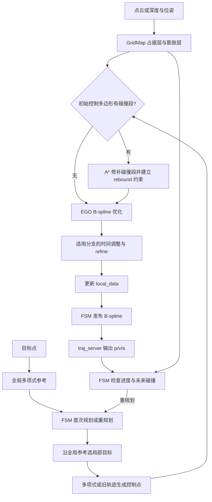
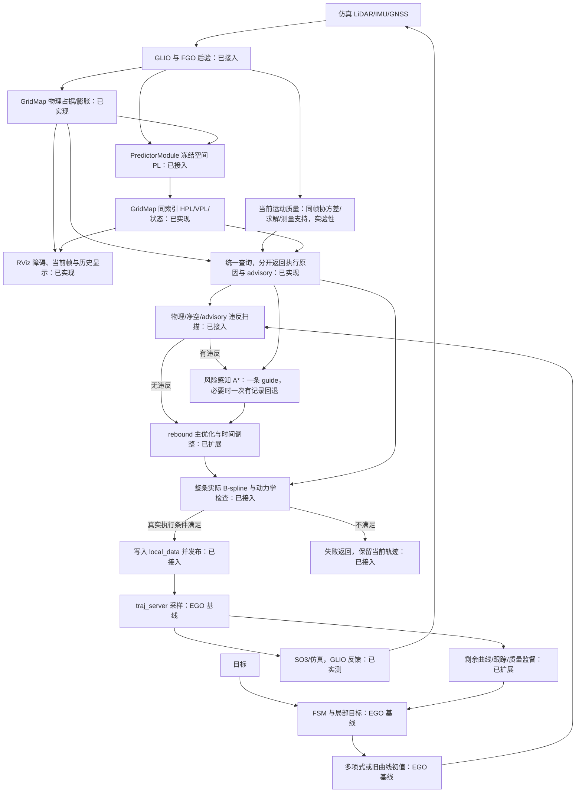
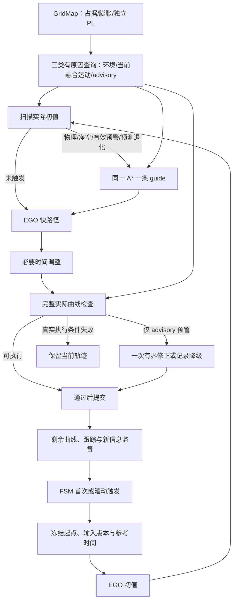

# 回归原版 EGO：规划流程与开发顺序

## 状态与依据

结构基线：`../ego-planner-swarm`，提交 `23a8d5a191711dd65633df689bd00f55d4dea8f9`。原版目录只读。
设计依据：工作区 `docs/0928_review.md` 第 1862 行以后的最终收敛，以及本轮用户确认。
阶段 1 已恢复 EGO 主线、同一个 GridMap 的空间 PL 缓存与真实 PredictorModule 接入；阶段 1a 已实测 GLIO 驱动的仿真和同图显示。本次实施把当前融合运动质量、物理环境与 advisory 预测分开查询，在原 EGO 触发点做完整性避让，并在写入 `local_data` 前检查实际曲线。以下「当前阶段」描述代码；新行为尚无四分叉现场验收记录，不能把旧运行结果当作本次功能的成功证据。原版流程图保持固定基线。
从本轮起，`iap_sim.launch.py` 默认且统一使用 `icra_dense_forest_four_fork_v2` 做完整仿真和可视化回归；单元测试可以保留小型定向 fixture，历史 `fused_nominal` 运行记录保持原场景身份，不迁写为四分叉结论。

## 原版轨迹流程（固定基线）

以下路径均相对原版 `src/planner/`。

| 模块/函数 | 职责与数据 |
|---|---|
| `plan_env/GridMap` | 点云/深度建图；MappingParameters 保存空间定义；MappingData 分别保存 occupancy_buffer_、occupancy_buffer_inflate_，共用 posToIndex/toAddress |
| `EGOReplanFSM::planNextWaypoint` | 接受目标，调用 manager.planGlobalTraj 生成全局多项式参考；参考本身不搜索障碍路线 |
| `EGOReplanFSM::execFSMCallback` | INIT → WAIT_TARGET → GEN_NEW_TRAJ/REPLAN_TRAJ → EXEC_TRAJ；依据进度、时间和碰撞滚动重规划 |
| `planFromGlobalTraj/planFromCurrentTraj` | 首次取里程计状态；重规划取旧曲线的 p/v/a，构造本次起点 |
| `getLocalTarget/callReboundReplan` | 沿全局参考选 planning horizon 内的局部目标，再调用 manager |
| `EGOPlannerManager::reboundReplan` | 多项式或旧轨迹采样 → B-spline 参数化 → rebound 优化 → 适用分支时间调整/refine → updateTrajInfo |
| `BsplineOptimizer::initControlPoints` | 检测控制多边形的碰撞段；有碰撞才调用 AStar 构造 rebound 基点和方向 |
| `AStar::AstarSearch` | 物理膨胀障碍查询，搜索碰撞段绕行路径；搜索节点池不是第二张环境地图 |
| `BsplineOptimizer::rebound_optimize` | 平滑、障碍、动力学及原 swarm 约束；必要时局部 rebound 修补 |
| `refineTrajAlgo/calcFitnessCost` | 时间调整后的参考跟踪与修正；默认 rebound 主目标没有 guide 跟踪项 |
| `updateTrajInfo` | 更新 local_data：位置曲线、导数、起点、时间和轨迹编号 |
| `callReboundReplan/traj_server::bsplineCallback` | FSM 发布 B-spline；server 替换当前曲线并建立导数 |
| `traj_server::cmdCallback` | 100 Hz 采样 p/v/a 和 yaw，输出 position_cmd |
| `EGOReplanFSM::checkCollisionCallback` | 约 50 ms 检查未来碰撞，触发重规划或 EmergencyStop |



原版边界：可选 distinctive_trajs 产生多个候选，新主线关闭该分支。部分优化/运行时碰撞检查只覆盖前约三分之二；时间调整在 swarm drone_id > 0 的分支被跳过。manager 先写 local_data 再由 FSM 发布。EmergencyStop 用六个相同控制点生成定点曲线，尚不是从运动状态生成的制动轨迹。上述行为是本轮基线，不代表最终完整性或执行保证。

## 当前阶段流程图（随代码同步）

本图描述本次代码中的一条规划主线；“已接入”表示实现状态，不代表四分叉现场验收通过。普通滚动触发和轨迹采样执行保留原 EGO FSM/`traj_server` 主线。



## 目标设计与顺序

| 阶段 | 修改 | 验收 |
|---|---|---|
| 1：已实现 | 恢复 EGO 主线，在 GridMap 增加独立 PL 层 | 同一索引、真实预测、缓存有效性、物理规划与命令链路的自动化测试通过 |
| 1a：链路与显示已实测 | GLIO 同时接规划与 SO3，发布障碍及同图空间 PL 切片 | 真实输入链、有效 PL、实际曲线、控制反馈与可视化持续更新；不代表完成目标或安全飞行 |
| 2：代码已接入，现场待验 | 初值的完整性预警触发一条 guide；A* 逐体素检查物理与当前运动条件，advisory 优先避让、未知有限代价 | 无物理障碍仍绕开有效预测退化；宽远路线不受固定 30% 长度上限排除 |
| 3：代码已接入，现场待验 | guide 建立 rebound 基点并进入主优化 fitness 项；优化中新违反调用相同查询 | 平滑后实际曲线保留选路偏好，允许有记录的 advisory 回退 |
| 4：代码已接入，现场待验 | 时间调整后整条实际曲线与动力学检查；运行期检查剩余实际曲线 | 真实执行条件失败不覆盖当前轨迹；advisory 缺失不单独拒绝提交 |
| 5：部分实现 | 通过后写 `local_data`；无可执行接续时尝试检查连续制动，失败才使用标记未验证的仿真悬停 | 同一状态/时间接续及正式停止契约仍待完成；不能报告正式 PASS |



一次触发只交付一条 guide，不建立多候选竞赛。初值没有违反时保留 EGO 快路径；此方法是 *integrity-triggered replanning*，不声称对所有可通行路线求全局最低风险。物理环境、当前融合运动质量与局部净空是执行条件；advisory 的 0.45/0.50 m 线仅是主动避让线。未知预测的初始路径代价倍数为 1.5；同一 A* 在正常避让无路时至多顺序回退一次，不能放松真实执行条件。起点在预警区直接用同一搜索器的高代价规则，不建独立脱离模式。失效预测与真实退化保持不同状态。搜索边、优化后与时间调整后的曲线使用同一冻结预测上下文；运行期监督读取新信息。实验版本不声明概率完整性保证。

## 阶段 1 接口与验证

### 所有权与接口

- `MappingData::risk_buffer_` 是与 occupancy_buffer_ 等长的 `vector<GridRiskVoxel>`，通过相同 posToIndex/toAddress 查询。每项保存 HPL、VPL、状态、版本；原点、分辨率和尺寸不重复存储。
- `GridMap::bindRiskContext(context)` 返回新版本；绑定拥有冻结输入的点查询函数及参考时刻/有效期/坐标系/占据版本。任何新绑定都会使旧版本不可查询。
- `GridMap::queryRisk(position, version, evaluation_time)` 按体素中心计算一次并复用同版本结果，不插值，不维护 horizon 数组。状态包括 UNCOMPUTED、VALID、INVALID、STALE、OUT_OF_MAP、FRAME_MISMATCH、VERSION_CHANGED、INVALID_QUERY；失败的 PL 为 NaN。
- `GridMap::invalidateRiskContext()` 用于输入更换；占据更新序列在查询前后均校验。resetBuffer 也提交占据版本并撤销风险上下文，不能在重置后重新绑定旧地图证据。
- `getOccupancy/getInflateOccupancy` 保持物理语义。GNSS 的 `set_occupancy_query` 读取同一地图的原始占据，观测支持独立查询；不会在预测器内部再构造 LocalOccupancyGrid。占据查询与外部格子查询的绑定采用后绑定者生效。

### 数据来源与时序

现有 manager 的 `planner_risk.cpp` 只负责订阅与绑定。里程计、IntegrityReport、GNSS 测量与星历组成 IntegritySnapshot；GNSS 历元按监测报告来源身份匹配，最多保留 64 个且按 GNSS 有效期裁剪。注册地图的只读视图提供原始障碍、观测证据和 LiDAR FIM 输入。这个视图属于 GridMap，不是独立地图管理器。

每次 reboundReplan 前绑定一次，使用 PredictorModule 点查询，query_time 与 evaluation_time 均固定为该轮参考时刻，horizon=0。阶段 1 曾只查询起点作诊断；当前代码还在初值扫描、搜索、rebound 和实际曲线检查中查询同一版本。地图和预测输入回调使用原 EGO 的单线程执行器；不启动旧 worker pool 或执行快照线程。

旧版本曾用来源最大 PL 反推对角位置先验；该量不是融合 FGO 后验。本次改用同帧 FGO 后验协方差的 `3 sqrt(lambda_max)` 实验代理构造对角先验；代理不是认证 PL。LiDAR 使用实际地图点构造 FIM，禁用 legacy observability 降级；没有有效预测时返回有原因的未知或无效状态，而非有效零风险。

| 配置/接口 | 默认与含义 |
|---|---|
| `risk/source` | fusion；也支持 gnss、lidar，与场景完整性来源对应 |
| `risk/validity_s` | 0.5 s；约束本轮、里程计、当前 PL 和地图来源时间 |
| `risk/gnss_max_age_s` | 2.0 s；fusion/gnss 模式同时受 GNSS 历元有效期约束 |
| `risk/integrity` | canonical 重映射到 `/iap/integrity` |
| `risk/range, ephem, glo_ephem, receiver_lla, iono` | canonical 重映射到现有 `/ublox_driver/` 对应输入 |
| `odom_world` | FSM 与风险输入使用同一个里程计重映射 |
| `frame_id`（traj_server） | 默认 map；命令时钟使用节点时钟 |

有效期取所有适用输入截止时刻的最早值。缺失、未来时间、过期、非有限值、负 PL、坐标不匹配都不会成为有效零风险。空间预测只代表冻结时刻，不声明到达时刻的完整性。

### 本次实验性规划接口

- `IntegrityReport.current_motion_quality` 是同帧 FGO 后验协方差、FGO 求解有效性、帧时间及测量支持形成的 **实验性运动质量**：`SUPPORTED`、最多 1 秒的 `BRIDGED` 或 `INVALID`。`current_motion_error_proxy_m = K_pl sqrt(lambda_max(Sigma_p))`，四分叉配置 `K_pl=3`。GNSS 来源的 `1e9` 退化哨兵不再标为可用 PL；GLIO 的 ICP 注册支持与来源 PL 有效性分别记录。来源最大 PL 与原 `UNSAFE` 仍供诊断，不是融合后验 PL 或独立运动授权。`SUPPORTED` 可申请新正常轨迹；`BRIDGED` 只用于监督已有短轨迹，不能提交新正常轨迹。
- `GridMap::queryPlanningRisk()` 以原体素地址返回 `VALID`、`AVOID`、`PREDICTED_DEGRADED`、`STALE_REFERENCE` 或 `UNKNOWN`。有效 HPL/VPL 达到 0.45/0.50 m 时触发优先避让，0.55/0.60 m 为实验任务预算；二者均不是独立急停线。未算出、短期过期与模型明确退化互不混淆。0.5 秒有效期后，最后有效值仅在 1 秒内作为衰减软偏好；参考位姿变动超过 0.5 m、坐标系或版本不匹配时不复用。旧值不写回当前有效 PL。未知区域可通行但代价为长度的 1.5 倍，允许将来记录预测覆盖不足。
- `GridMap::queryPlanningCell()` 同时返回 `GridExecutionReason` 与上述 advisory 类别。执行原因覆盖越界、环境未观测/过期、物理障碍、局部净空不足、当前质量失效/过期/预算不足及跟踪偏差。局部净空按需检查原始体素中心：机体 0.35 m + 跟踪预留 0.10 m + 当前误差代理 + 半体素对角线（0.1 m 分辨率时约 0.087 m）。原膨胀层仍是独立的物理障碍快速检查，局部净空不会把 0.3 m 膨胀值再次加入半径。无距离场或第三张禁入地图。
- `AStar::setPlanningQuery()` 与 `BsplineOptimizer::setPlanningQuery()` 使用同一冻结查询函数。初值违反时顺序运行一次正常避让搜索，确认 advisory 阻断后最多运行一次同搜索器的高代价回退；搜索边检查经过的体素。rebound 的基点/方向及优化中新违反检测调用同一查询，主目标可对一条 guide 做 fitness 跟踪。
- `EGOPlannerManager::assessTrajectory()` 在提交前检查完整的时间调整后曲线与当前运动条件，结果分开统计真实执行违反、advisory 预警和未知样本；预警切回时尝试一次修正，仍可执行则记录 degraded fallback。只有通过真实执行条件的候选写入 `local_data`。FSM 每 200 ms 检查剩余曲线、跟踪与新信息；advisory 预警只请求提前重规划，短暂缺失不触发急停。真正无法继续时尝试从当前速度生成、检查制动曲线；失败使用原版定点仿真悬停，并明确标记未验证。
- 上述 0.55/0.60 m、0.45/0.50 m、1.5 倍、0.35/0.10 m、0.5 s/1 s 等值是版本化四分叉机制实验参数，不是适航或概率完整性证明。环境观测范围外没有物理通行授权；当前质量也不保证未来未知空间。

### 清理与兼容边界

规划器恢复原版 FSM/manager/A*/B-spline/traj_server，删除已替换的 P0–P5 源码、专属测试和参数，以及独立 RiskGridMap/UnifiedRiskGrid、旧转换与旧 Phase-2 evaluator/P0 profiler。Bspline 消息和 LocalTrajData 去掉旧执行证书字段；这是有意的接口变更，需重建 traj_utils 及依赖包。独立预测算法和注册点云输入仍保留。

当前 canonical 仿真图由 `_includes/full_stack_runtime.py` 组成，不使用旧实验开关。历史 bp 入口、实验脚本和产物保留用于查阅；它们的旧规划参数、消息契约和验收结果不适用于本轮。`iap_flight` 暂时拒绝启动，待阶段 4/5 的检查、接续、停止完成后再恢复部署校准与车辆控制验收。

仿真保留注册点云输入所需的 SI 加速度系数 1.0、NAIVE 初始化、512×40 spherical_first_hit_v1 射线模型与 2 秒传感器启动延迟；地图和规划使用同一静态坐标平移，不动态对齐真值。

原版为适配现有输入进行了必要调整：统一节点时钟、命令 frame、Jazzy 头文件/依赖导出；未来开始时间到来前不发送原版的零坐标命令。尚未实现 pending 轨迹接续。

### 本轮仿真可视化接口

- `iap_sim` 中规划器与 SO3 控制器统一订阅 `/drone_0_visual_slam/odom`（`map`）；真值只供传感器仿真与对照。Current Integrity Monitor 仍是 GLIO 扩展，Advisory 查询仍由 EGO manager 调用 PredictorModule。
- `risk_viz/enabled=true` 时，manager 独立于规划目标每秒冻结一次预测上下文，在无人机附近 10×10 m、高度吸附至原 GridMap 体素中心的水平层，最多查询 100 个、间距约 1 m 的格子；同轮使用同一版本和原 `queryRisk()`，绑定上下文后给逐点采样 20 ms 预算。绑定开销另计并显示为 bind，整轮耗时显示为 cost；超采样预算只显示已算点并明确标为 incomplete。
- `/grid_map/occupancy`、`/grid_map/occupancy_inflate` 继续表示物理层；注册点云模式的原始占据可视化读取其真实 raw-cloud buffer。`/grid_map/risk_slice` 为 PointCloud2，字段 `x,y,z,rgb,hpl,vpl,status`，有效 PL 由固定色标着色；无效预测为紫色，未计算不伪造值。上下文过期、版本变化或坐标错误发布空切片。
- `/grid_map/risk_status` 是 TEXT_VIEW_FACING Marker，显示版本、冻结时间、切片高度、有效样本比例、实际插值面格数、耗时、当前监测 HPL/VPL 与原因；文字明确标注 frozen spatial PL。默认 HPL 显示范围 0.25–0.65 m、VPL 0.20–0.55 m，蓝、青、黄、红色带仅为可视化范围，不是安全阈值；`/grid_map/risk_legend` 在切片角落给出米数刻度。
- `/grid_map/risk_surface` 从同一轮至多 100 个真实 PL 点生成半透明三角面，只在四角预测均有效且同版本、格子采样点未被物理膨胀障碍占据时显示。面内颜色为**视觉插值**，不写入 `risk_buffer_`、不参与规划或有效性判断；原 `/grid_map/risk_slice` 保留真实样本点。风险面只有这一条 MarkerArray 话题：marker 的 lifetime 为 60 秒，相距约 4 m 的空间片段用不同 ID 留存，同一区域新结果覆盖同一 ID，避免持续叠加。RViz 的 MarkerArray 没有 Decay Time 属性；画面中的旧面只表示过去冻结时刻的显示结果。无有效 PL、预测上下文错误或色标指标切换时向同一话题发 DELETEALL，清除全部留存面。RViz 物理占据显示的 20 秒 Decay Time 同样只是显示历史，不改变 GridMap 物理层。仿真中原始和膨胀点云发布周期为 1 秒（`grid_map/visualization_period_s`）；仅可视化发布降频，地图更新与规划查询不降频，以免 20 秒重复三维方块耗尽 RViz 内存。
- 仿真 GLIO 注册当前帧已按 `publish_current_hits_map=true` 发布 `/iap/local_map/current_hits_map`（`map` 坐标、PointCloud2、SensorDataQoS）。RViz 以浅青色点显示最新约 0.2 秒的帧，输入停止后点云消失，独立于累计障碍层；它不改变 GridMap 的占据或 PL 数据。
- `risk_viz/metric` 默认 `hpl`，可在 planner 运行时设成 `vpl`，下次切片更新颜色；`risk_viz/z_mode=follow|fixed` 与 `risk_viz/fixed_z_m` 在启动时选择高度。`traj_server` 在 `/planning/trajectory_curve` 发布其实际装载 B-spline 的采样青色曲线；`/grid_map/glio_path` 是由 GLIO 里程计生成、最多 500 点的白色连续历史线。
- 风险图始终是某一冻结参考时刻的空间切片，不是未来到达时刻 PL。当前规划读取同一 `risk_buffer_` 的有效样本作避让偏好；RViz 插值面和过去 60 秒的显示面不进入规划。旧风险体素在新版本查询时不会作为当前有效数据返回；最后一次有效值最多在过期后 1 秒内作为逐渐减弱的软偏好。
- 首次 `fused_nominal` 闭环暴露随机森林树干直接穿过起飞点（真值地图最近障碍仅 0.089 m），造成 EGO 起始控制点碰撞。仿真随机森林现在只在起点和目标周围各留 1 m 圆形空间，保留中途树木与物理绕障任务；这属于场景输入修正，不改变 EGO 碰撞规则。
- 修正起终点后，真实传感器仿真观察到 GLIO、注册障碍、B-spline、位置命令、SO3 命令与机体运动持续更新，SO3 的 ROS 订阅确认为 GLIO odom。该次运行还暴露了预测绑定耗时导致采样预算在第一点前耗尽，以及定时关闭时 `traj_server` 发布器被异步关闭；现按绑定和逐点采样分别计时，并让 `traj_server` 完成当前回调、释放 ROS 实体后关闭上下文。

### 验证证据

- 显式 IAP 源路径构建 `iap、traj_utils、plan_env、path_searching、bspline_opt、ego_planner`：通过。
- `test_grid_map_risk`：6 项通过；地址/边界、占据独立、缓存命中、版本/重置、过期/坐标、异常值和查询期间失效。
- `test_grid_map_occupancy_epoch`：25 项通过；`test_registered_lidar_window`：18 项通过；注册点云启动/恢复进程测试通过。
- `test_predictor_module`：100 项通过，含新增直接占据查询对 GNSS canopy 结果的影响与 unknown 保留。
- `test_ego_baseline`：2 项通过；真实 LiDAR PL 查询及过期拒绝、EGO 物理障碍绕行与曲线/导数有限性。
- `test_ego_pipeline`：通过；独立规划节点接收目标、发布 B-spline，traj_server 输出 p/v/a 与独立 Cox-de Boor 基函数计算吻合。
- `test_canonical_launch_contracts`：32 项通过，涵盖统一地图配置、注册输入坐标、运行产物目录和阶段 1 实飞不可用。
- 本轮先将原有两处 GLIO RViz 改动独立提交为 `d60c1c6`。可视化与 GLIO 控制链路提交为 `b5326d0`；两次现场发现的起点障碍、原始占据发布、采样预算和 `traj_server` 退出问题经 `2799639`、`04f80ca` 修复。相关包构建及上述聚焦测试通过，管线测试还断言轨迹服务正常退出。
- 干净修订 `04f80ca5fdbeeeae33ecb14f7ab010f6ecf4f7fb` 的 `fused_nominal` 75 秒现场运行目录为 `log/20261004T101419Z_083`，manifest 记录同一 commit 和 `git_worktree_clean=true`。GPU 预检 `nvidia-smi`、`cuInit(0)` 与 CUDA 设备数均通过，RViz 启动并订阅原始障碍与风险。55 秒探针窗口收到 GLIO odom 498、当前完整性报告 497、原始/膨胀障碍各 408、风险切片 53、B-spline 与实际曲线各 73、位置命令 5212、SO3 命令 5328 条；原始障碍末帧 26,295 点，风险切片最多 100 点，有效点帧 43 次。ROS 图确认 SO3 控制器订阅 `/drone_0_visual_slam/odom`，运行时 HPL→VPL 参数切换成功；全部进程正常退出。
- 同一窗口真值位置从约 `(-10.56,-0.24,0.51)` 移至 `(-2.73,-1.16,1.24)`，证明估计驱动的控制回路确实带动仿真器；GLIO 末值约 `(-4.34,-1.18,0.47)`，与真值偏差明显。当前监测持续报告 `UNSAFE`、HPL/VPL 约 `1e9 m`，不能把 Advisory 切片的约 0.4–0.5 m PL 当成当前位姿安全结论。该次运行未到达 x=12 m 目标，也未对实际机体轨迹作完整碰撞认证；EGO 仍保留物理避障基线行为。
- 运动中的切片整轮最大耗时约 132 ms，主要为冻结占据/预测绑定；逐点采样另受 20 ms 限制。55 秒窗口 GLIO 约 9 Hz、命令约 95–97 Hz，未见因切片而停止更新，但当前单线程规划器仍可能被绑定阶段短暂阻塞。这是后续性能优化的明确限制。
- 另一干净修订 `04f80ca` 的 `manual` 无目标运行 `log/20261004T101912Z_537` 中，仅将本次启动的 GNSS 仿真进程暂停 7 秒并恢复。风险状态从 `78/78` 有效转为 `0/78` 无效，旧有效颜色被新紫色无效样本覆盖；没有把失效预测显示成零风险。这里验证的是失效呈现，不代表 GNSS 恢复后一定重新获得有效预测。不声明四分叉场景 LIVE PASS 或主动风险绕行已实现。
- 统一场景默认切换提交 `7a3d8ee907c0183917faf54966a6410b22441b85` 的 90 秒现场运行目录为 `log/20261004T102551Z_178`。使用不带 `scenario` 参数的 canonical `iap_sim.launch.py`，manifest 记录 `icra_dense_forest_four_fork_v2`、该 commit 和干净工作区；GPU 预检通过，RViz 启动，所有进程正常退出。55 秒探针窗口收到 GLIO/当前报告各 520、原始与膨胀障碍各 368、风险切片 49、B-spline 和实际曲线各 50、位置命令 4782、SO3 命令 4991 条；末帧原始障碍 20,077 点、风险 99 点，HPL→VPL 运行时切换成功。真值从约 `(-18.00,0.00,1.51)` 移至 `(-4.16,-2.04,2.27)`，GLIO 末值约 `(-4.21,-1.97,2.08)`。ROS 图确认 SO3 订阅 GLIO odom。该窗口没有覆盖 x=18 m 目标到达，不能报告完整任务成功。
- 四分叉运行中的风险切片整轮最大耗时约 205 ms，主要来自冻结输入/预测绑定，逐点采样仍受 20 ms 预算；这会短暂阻塞当前单线程 planner。Current Integrity Monitor 持续为 `UNSAFE`、HPL/VPL 约 `1e9 m`，而 Advisory 空间切片仍可有有效 PL，二者在状态文字中分开显示。此轮证明同图可视化和传感器驱动控制链路，不是安全规划或四分叉正式 PASS。
- 四分叉显示历史实测：干净修订 `26700d5` 对应 `log/20261004T110440Z_711`。52 秒探针收到物理占据/膨胀各 47 帧、风险/当前面/图例各 49 帧，插值面最多 33 格；VPL 样本约 0.24–0.38 m。RViz 在探针 46 秒时 RSS 约 659 MiB；此前原始障碍每约 0.11 秒发布、20 秒 Boxes 留存的试跑在约 49 秒时约 2.3 GiB。1 秒可视化发布周期降低重复绘制量，地图更新和 PL 查询次数未随之减少或增加。
- 最终色带修订 `9f14f24` 的四分叉运行 `log/20261004T110943Z_881`，manifest 记录该修订与干净工作区。35 秒探针收到风险、当前面、图例、物理占据各 34 帧；该窗口 HPL 样本约 0.29–0.42 m，对应 68 种点颜色、无灰色中段，图例为 0.25/0.45/0.65 m；RViz 当时 RSS 约 473 MiB。两次均由定时 SIGINT 结束，节点正常退出。插值面随预测有效性和物理障碍变化，末帧允许为 0 格；历史预测以低透明度表示过去，失效时清除。本证据仅验证显示与资源开销，Current Monitor 仍报告 `UNSAFE`，没有证明主动风险绕行或完整任务到达。

### 本次改造验证与现场边界

- 相关包构建、GridMap 风险分类与执行原因测试、GNSS/LiDAR 单源与双源短时中断的运动质量测试、风险 A* 宽远路线及预警区起点测试均已通过。优化器测试在没有物理障碍的直线路径上放入 advisory 避让带，验证由原初值触发单条 guide、主优化曲线发生绕行。EGO 测试验证物理绕障、时间调整后实际曲线的独立检查，以及失败候选不覆盖已有轨迹。
- ROS 进程管线测试用带已观测自由射线的测试点云及**合成**运动质量报告，验证目标、B-spline、指令、空闲风险显示和缺失空间 advisory 不会成为有效 PL。合成报告不等于 GLIO/FGO 实测。
- 运行期物理/当前质量监督每 200 ms 评估剩余曲线，滚动重规划失败期间仍继续监督旧曲线；完整 Predictor 绑定约每 1 s 一次，以避免每次监督都冻结预测地图。本次 `build/iap` 全部 28 项测试通过，`ego_planner` 两项行为测试、`plan_env` 四项行为测试及 `path_searching` 的 A* 测试通过。包级 lint 全集因原有文件及本次触及文件的格式不统一仍失败（flake8、lint_cmake、uncrustify），与上述行为测试分开记录。实际四分叉中的任务进展、无必要停顿、advisory 回退次数、当前质量失效响应及 CPU 耗时尚未实测，不能从定向测试推断。此前可视化阶段的 205 ms 冻结耗时是旧版本参考值。
- 现有 `config/sim_ego/grid_map_stage1.rviz` 是用户未提交的无关修改，本次保留。根据仓库干净工作区规则，即使本次实施代码单独提交，四分叉现场运行仍标为 `LIVE_BLOCKED_BY_UNRELATED_DIRTY_WORKTREE`；正式 PASS/FAIL 还取决于未完成的版本化契约。不能将上面的历史场景记录改写为本次安全规划验收。

可复查命令（先加载 ROS 与工作区环境）：

```bash
src/iap/scripts/dev_planner/build_iap_dev.sh
ctest --test-dir build/plan_env -R 'test_grid_map_risk|test_grid_map_occupancy_epoch|test_registered_lidar_window|test_grid_map_startup_process' --output-on-failure
ctest --test-dir build/path_searching -R '^test_advisory_a_star$' --output-on-failure
ctest --test-dir build/iap -R '^test_predictor_module$|^test_canonical_launch_contracts$' --output-on-failure
ctest --test-dir build/iap -R '^test_araim$' --output-on-failure
ctest --test-dir build/ego_planner -R '^test_ego_baseline$|^test_ego_pipeline$' --output-on-failure
```

首轮基线源文件：原版 [GridMap](../../../ego-planner-swarm/src/planner/plan_env/include/plan_env/grid_map.h)、[FSM](../../../ego-planner-swarm/src/planner/plan_manage/src/ego_replan_fsm.cpp)、[manager](../../../ego-planner-swarm/src/planner/plan_manage/src/planner_manager.cpp)、[优化器](../../../ego-planner-swarm/src/planner/bspline_opt/src/bspline_optimizer.cpp)、[轨迹服务](../../../ego-planner-swarm/src/planner/plan_manage/src/traj_server.cpp)。

## 文档维护规则

每次本轮规划开发在同一提交更新阶段流程图、接口、阶段状态和对应验证结果。未开发节点继续标记 EGO 基线。原版流程固定，目标图不作为已实现能力声明。无需为无关改动追加历史流水账。
