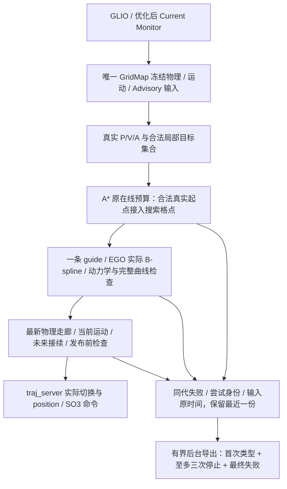
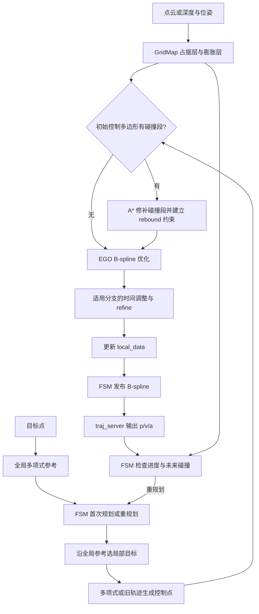
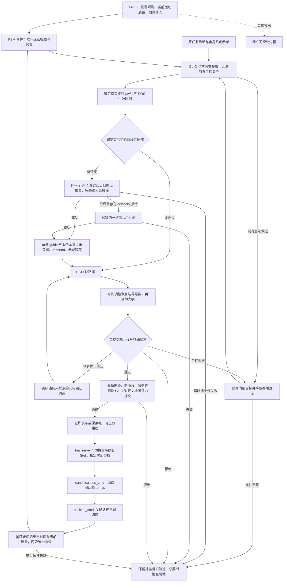
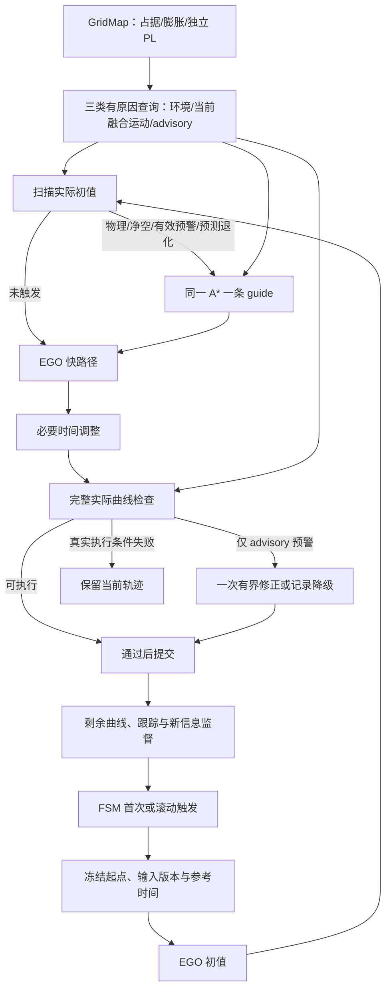
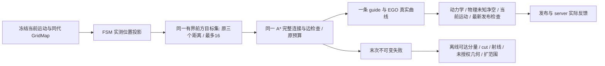
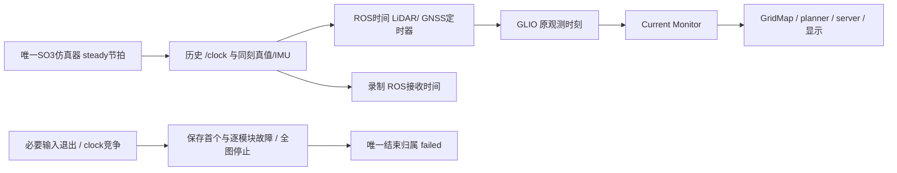
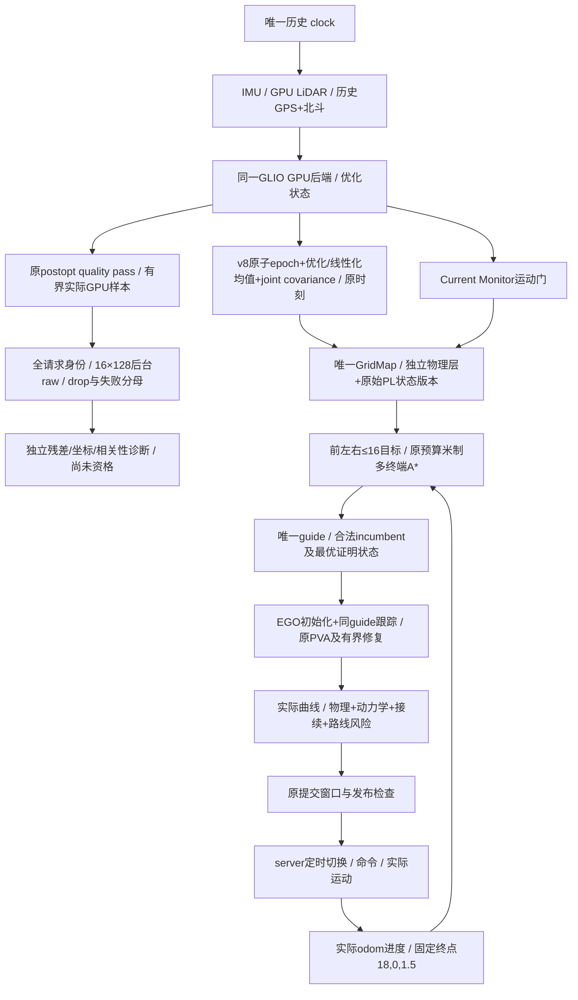

# 回归原版 EGO：规划流程与开发顺序

## 状态与依据

本轮当前状态与独立 A/B/C/D 结论见 [Curve／真实Advisory／通道实施进度](../dev_planner/curve_advisory_channel_progress.md)；下方旧阶段结果保留其历史版本身份。

本轮统一[图文交付索引](../../log/20261007T091820Z_056/export/analysis/delivery_report_20261007.md)
绑定77a09387及bd580c91现场，分别列代码／自动化／现场／阻塞。合法接续链及C机制
已验证不代表A全接续、B米数或D任务收益通过；正式B0/9＋0/9、D0/6，默认未推广。

原时间预测误差补充：28冻结receiver与之后到达的7/2800空间请求分开统计，
2693未到达及100地图外保留，不用局部条件覆盖追认B米数／9＋9或D六次任务。
安全撤销分类补充：bd580c91的8次server撤销成功包含7次生效前、1次生效后仍在队列；
另1次已激活后撤销被忽略。队列状态与生效时刻独立记录，不按时间自行推断激活。
当前流程、预算和资格门不变，详见
[原时间误差与撤销分类补充](../../log/20261007T091820Z_056/export/analysis/safety_feedback_live/prediction_error_report.md)。

历史 Advisory 工具验证见 [方案与实施结果](../dev_predictor/advisory_spatial_validation_plan.md)、[冻结验证工具契约](advisory_validation_contract.md) 和 [21f692e 正式报告](../../log/20261006T123756Z_794/export/analysis/advisory_validation/committed/report.md)。本段描述该历史版本；后续准入／数值修复及本轮待测状态见下方分阶段契约。完整录制、原 codec/生产 PredictorModule 重放、来源拆分、S1–S5 合成机制对照与报告已实施；生产包装器增加拒绝原因并共享相同冻结准备/状态映射，来源准入、物理地图、执行授权和阈值不变。缺 GNSS 阻断有效 LiDAR 的准入差异及强先验主导已在合成输入复现；未擅自修正模型。真实 start/middle/stop 扫描和三次 GLIO 误差重复仍为 INCONCLUSIVE，现场受无关 RViz 修改阻止，不声明风险地图已验证正确。

结构基线：`../ego-planner-swarm`，提交 `23a8d5a191711dd65633df689bd00f55d4dea8f9`。原版目录只读。
设计依据：工作区 `docs/0928_review.md` 第 1862 行以后的最终收敛，以及本轮用户确认。
阶段 1 已恢复 EGO 主线、同一个 GridMap 的空间 PL 缓存与真实 PredictorModule 接入；阶段 1a 已实测 GLIO 驱动的仿真和同图显示。本次实施把当前融合运动质量、物理环境与 advisory 预测分开查询，在原 EGO 触发点做完整性避让，并在写入 `local_data` 前检查实际曲线。以下「当前阶段」描述代码；新行为尚无四分叉现场验收记录，不能把旧运行结果当作本次功能的成功证据。原版流程图保持固定基线。
从本轮起，`iap_sim.launch.py` 默认且统一使用 `icra_dense_forest_four_fork_v2` 做完整仿真和可视化回归；单元测试可以保留小型定向 fixture，历史 `fused_nominal` 运行记录保持原场景身份，不迁写为四分叉结论。

## 四阶段实施：末次失败与格点接入（2026-10-07 当前轮）

实施进度见 [forest_four_stage_progress.md](../dev_planner/forest_four_stage_progress.md)。
起始 HEAD `5de1ec0`、`dev/iap_refactor`、干净工作树，GPU 三项预检均通过。
原版 EGO 只读。历史 `20261007T040151Z_586` 的 endpoint 是 generation 234，
末轮性能记录是 generation 1628，两者不可合并成最后停车根因。



A* 起点的真实坐标保持不变。其最近格点或连接被拒绝时，在已有 1 m 端点
恢复范围内按真实距离、格点索引确定顺序选择可连接格点；每个候选和完整连接
仍查询同一冻结物理层，检查共享 deadline。未知、净空、实际起点非法仍拒绝。
原终点恢复、搜索边检查、原在线预算不变。Result 追加实际接入格点和恢复标志。
已存在的有限端点范围也约束起点接入；不推进 GLIO 实际参考进度。

取证仍为 opt-in，复用 PlanningView/TrajectoryAssessment 不可变快照。
每次失败更新唯一最近记录，不再让首次错误类型遮蔽后来同类型失败。
规划尝试序号绑定真实 P/V/A、执行/候选/反馈 ID、生效时刻、共享预算、guide、
实际候选曲线（若已产生）与原地图/运动时间。最终失败补充该尝试最终阶段；
缺数据为 null，不借用事后地图。run_manifest 链接绑定代码与配置原始身份。
后台一个写入线程、最多两个待写任务、一个最近记录（活动写入另占一份）；
停止导出至多三份，正常进程退出另导出 terminal_final，原首次产物不覆盖。
队列拥塞明确记录丢失，末次导出优先；异常强杀不能保证最终导出。
这些上限约束 opt-in 取证，不能独立授予执行或替代完整失败分析。

独立 live capture 追加 GLIO 实际消费的 `/sim/drone_0/imu_iap` 与 SO3Command，
记录采集 header 与接收 ROS/steady 原时间；仅供离线重力方向与命令核验。

ARAIM worst_hyp 生产 CSV 的 absent epoch 字段修正为表头对应的 24 个空字段；
历史 62 列坏行不挪列、不追认。新生产回归验证 60 列表头、epoch 与 worst_hyp
字段身份一致。Current Monitor 拒绝与 Advisory 缺失仍保持原权限。

自动化红/绿证据在 `log/20261007T050106Z_396/runtime/`：
`capture_red.log` 复现缺末次证据，`capture_green2.log` 验证首次不覆盖及末次
仍绑定失败时旧代数；`start_red.log` 复现合法真实起点被非法舍入节点拒绝，
`astar_green.log` 24 项通过，含未知连接拒绝；`csv_red.log` 复现 62/60 列，
`csv_green.log` 验证生产写入修复。`final_build.log` 最终 Release 构建通过；`final_planner_tests.log` 五项行为 CTest、
`final_astar_tests.log` 与 `final_araim_tests.log` 均通过。现场结果须继续补记。
阶段一尚未完成固定路线/任务到达，二尚缺物理竖直/传播/真实双源实测，
三、四前置条件未满足。保留显式 EGO 基线，不推广参数或声明森林 PASS。

### 第一轮现场后的必要修复与范围

干净提交 `0a8ff61` 的 180 s canonical 探索 `20261007T051237Z_248` 未到达。
135 轮规划，最后性能 gen1648 与 terminal_final gen1623 不同，不能将该快照
追认为最后失败。最早违反在完整冻结入口：物理 epoch 先捕获，预测准备期间
地图更新，再捕证据导致混代。现将 opt-in evidence 在 `captureFrozenOccupancyEpoch`
同一事务中绑定；开关开启会失效旧无证据缓存。PlanningView 直接持有 epoch
证据，与已存在走廊冻结一致。红/绿 `freeze_red.log` / `freeze_green.log`
覆盖预测 provider 在准备期间更新地图，不借用后来的 occupancy。

OFF 时高频物理搜索仍刷新中性偏好，红例 trivial search 产生847次不需要的
Advisory查询。现 OFF 不安装 A* advisory hook，guide 查询不准备偏好；raw
独立预测/显示/实际曲线诊断仍查询，ON仍保留偏好避让。未降低检查或增加预算。
最终失败读取最新 A* Result；早期失败段 context 仅精确匹配时保留，成功 guide
不继承旧失败 context。快照追加完整局部目标集合、拟合余量/收回距离。
现有离线工具只说明基础物理净空可达，未复现 guide 余量/多目标；不能写成
在线同规则成功，也不能将离线延长预算推广在线。

canonical 支持同一 resolver 预分配且 active/同场景的 `run_dir`，使 ROS_LOG_DIR
能在 launch 日志初始化前设置，仍唯一入口/唯一主清单，旧完成运行拒绝。
首次探索因 FastDDS profile 路径误填使用 DDS 默认值，外部启动日志位置明确
登记；保留这次失败，不计正式校准。后续使用已安装 sim_ego 正确profile。

生产 CSV 修复需重编真正 writer `integrity_extension`，不能只用 header 测试
代替安装库。已重建。新 opt-in coordinate CSV 保存同帧 R(0) 边缘切空间
协方差及优化后速度/bias；异常不改变原来源权限，缺协方差不伪造数值。
当前 PL 仍以该旋转为条件，协方差记录尚不等于传播模型验证。
首次实测GNSS valid=0；canonical synthetic只生成GPS，整星座故障完整性
无法判定，不能强制来源有效。pose接收延迟约0.123–0.145s，现有0.05s
配对规则未满足；尚无状态传播或双源授权。

### 发布邻域与最终失败语义修正

`7f1ebb4` 第二轮 `20261007T053238Z_917` 180s 未到达，GLIO末位置
[-17.736, .043, 1.604]，只取得已发布/命令ID1、2，不能把17个内部成功
规划当成实际接续完成。184轮：120 Search、33 Release、14 Budget、17 None。
terminal_final 的中间candidate属attempt184且后来修正成功，phase=0；不能
当最后接续失败。现活动PlanningView内只有最终 attempt_failure替换最近记录；
第一次错误类型仍可后台保存。CSV追加planning_attempt_id；未分配候选ID为
null，不能借用当前执行ID。重复曲线失败仍保留同代epoch指针，不被首次导出
去重遮蔽；final_check独立记录最终检查的原时间/代数/理由，若发布epoch不同，
其原始标志另外保存final_check_cells.bin，绝不把规划地图改为发布时身份。
未取得发布epoch时map_available=false，不后捕地图伪装证据。

走廊捕获先枚举ceil(required/resolution)+1格点邻域，再在锁内冻结。原代码
用浮点required任何增长触发二次捕获，持续微增会丢弃同一已足够的邻域并
错误显示ENVIRONMENT_STALE。现在只有所需离散扫描半径变大时才重捕；
精确最新required仍用于每个点的原净空比较。增加红/绿复现连续1e-4m变化
不跨邻域边界，旧代码无epoch，新代码保留epoch与新阈值；不增加时间/修复
预算，不降低净空。38项baseline通过，管线/定时接续/实际反馈/失败工具/baseline五项CTest全部通过
（disposition_final_tests.log）；现场待干净版本复核。

第二轮生产CSV全部完整行为60列，GNSS仍拒绝；旋转边缘协方差1739份有效，
主轴标准差约4.82–4.98°，说明漂移幅度小不等于变换精度高。310份静止匹配
原IMU/估计姿态的平均比力可核对局部Up，未授予旋转传播或未来误差保证。
同guide拟合余量/0.5m taper/完整16目标的独立冻结重放保留源码与命令，
首个timeout gen60原起点合法，延长离线后穷尽250402节点，未找到已观测池内
到该目标集合的路；不能提高在线预算或将未知判成可通行。

### 同身份未知曲线拒绝与单 guide 几何修正

`c80ccc2` 第三轮 `20261007T054246Z_172` attempt730/gen1575 与最后CSV
行一致；末实际GLIO约[-13.545,.054,1.454]。A*成功guide，真实候选首次
拒绝[-13.430,-.407,1.300]为ENVIRONMENT_UNOBSERVED，原三次配额中两次
CurveCorrection后repair_denied。full地图/原stamp/curve/guide/final_check均
已保存，不能写成无guide、无物理路径或Advisory致停。

实际样本到已检查guide的支撑平面原仅响应Advisory AVOID。现在同一现有
`addCurveGuideConstraints`还处理物理未知/越界；每个投影支撑点和额外半格
余量仍查询同一冻结guide物理层，最后完整曲线/动力学/发布检查不变。复用
同一EGO目标、guide与原修正动作，未增加恢复状态、地图、预算或减少检查。
关闭引导仍能对未知曲线建立几何修正，不把Unknown改成free。原query未接
到A*的诊断夹具及其失败保留；修正夹具验证guide全点执行可用后，原方法
无物理边界约束，新方法优化后整条曲线物理可用（unknown_curve_green5.log）。
该回归不等于森林固定路线通过，继续干净提交的canonical实跑。

性能默认Target直到真正调用rebound，再分别记录最终结果；未选到目标
显式记录同代attempt_failure，不能用None行当成功。新冻结入口清空旧
A* Result，未执行搜索不借用旧selected_goal或旧guide。多目标成功的
end_lattice改为实际选中的格点；红例原记录最后枚举goal而非selected_goal。
canonical配置登记实际metadata/config根，保留runtime配置及文件hash。

## 运行时检查时序与实际曲线修正（当前修正）

本轮基线 `2d63cb8`，诊断依据 `20261006T110434Z_515`。保存的 remaining_stop 地图时间比检查参考时间新 0.100629 s；候选实际曲线距原始障碍中心 0.550945 m，原要求为 0.551355 m，欠缺 0.000411 m。原始快照保持不变。CSV 中 130 轮、114 次 repair_denied、0 次截止时间过期，advisory avoid / 回退均为零；本轮不把这些失败归因于 PL 或此前已修复的反馈/beam 接线。

运行时执行段和待生效段先组成同一走廊，`captureExecutionView()` 捕获物理 epoch 后读取当前运动上下文和 ROS 时间。两段检查共用这份 epoch、运动质量和时刻，并按该时刻重新计算剩余曲线起点及 FSM lead。运动误差扩大净空半径时最多重捕获一次；无效当前运动证据保留具体 CURRENT_MOTION 原因，不写成地图过期。普通地图更新不改变已捕获结论，真正的超龄、未来地图/运动时间、ROS 时钟倒退仍拒绝。发布走廊及独立最新曲线检查复用同一捕获入口；规划事件冻结也在物理捕获后绑定运动质量与参考时间。最终地图锁内提交检查继续保留。

同一 GridMap 的 guide 查询额外保留半个分辨率的拟合余量，按到真实起点/合法目标集合的距离在 0.5 m 范围内收回，精确起终状态仍按原阈值连接。正常搜索和 advisory 高代价回退共用该 guide 查询，原无违反初值仍走快路径。实际曲线检查收集所有物理/净空违反采样点的精确原始障碍几何；`addCurveClearanceConstraints()` 以这些点建立球外支撑平面，三次样条权重把梯度分配给对应四个控制点，二次罚项避免微小越线的梯度趋近零。每次实际曲线修正单独计 CurveCorrection 动作，累积几何约束；时间调整后仍恢复起终 p/v/a、复查动力学和完整曲线。拟合余量不降低最终授权阈值，候选失败不覆盖执行轨迹。

未知环境及 advisory 的原查询语义保持；没有可用原始障碍几何或固定边界不可修正时拒绝候选，不凭平面约束授权。共享预算仍为 1.5 s / 三次动作，单次 A* 至多 1 s。CSV 追加 `curve_correction_repairs` 与 `guide_fitting_reserve_m`，日志记录违反点数量和实际余量；渐变搜索半径可能降低现有单半径净空缓存的命中率，现场耗时仍待测量。

定向回归先复现负年龄 ENVIRONMENT_STALE 和单障碍 guide 成功后修复耗尽（`regression_red.log`）；修正后前者绑定捕获后的时刻及剩余起点，并覆盖真正过期、未来时间、时钟倒退、无效运动误差的分类。曲线 fixture 明确为合成、完全已观测；guide 余量足以解决默认平滑情况，更强平滑用例仍触发 15 个实际采样点的约束修正，在原三次动作内通过完整曲线检查（`final_regression.log`）。证据目录为 `log/20261006T111341Z_228/runtime/`：六包 Release 构建 `final_build.log` 及最新 planner 增量 `verified_build.log` 通过；IAP 29 项、GridMap 4 项、A* 1 项和 EGO 5 项行为 CTest（含 30 个 EGO 基线用例、进程管线、接续反馈及失败工具）全部通过，分别记录在 `iap_tests.log`、`gridmap_tests.log`、`astar_tests.log`、`ego_tests.log`。四分叉新现场运行仍为 `LIVE_BLOCKED_BY_UNRELATED_DIRTY_WORKTREE`，保留用户 RViz 修改；验收契约 Draft，不报告正式 PASS 或任务到达。

## 执行反馈接线与完整扫描传输（已实现）

基线 `9cccb56` 的现场记录 `20261006T103803Z_118` 暴露完整 launch 的反馈漏接：traj_server 发布 `/drone_0_planning/pos_cmd`，planner 的 `/position_cmd` 未重映射。服务端已切换、规划器未确认，同步窗口结束后进入已有检查制动。现在 canonical `_includes/full_stack_runtime.py` 对 planner 与服务端使用同一位置命令话题；生效时刻、0.1 s 确认检查和制动机制不变。

回归加载实际安装的 launch 声明并比较两端 remap，原代码明确失败、补齐后通过。`test_ego_full_stack_feedback` 从同一安装声明启动真实 planner/server，使用明确标为合成的 CPU 里程计、质量与自由射线输入；验证实际 AT_TIME 切换 ID 被 FSM 确认，切换后持续命令，且不发生 missing-ID 误制动。这是完整接线及执行链回归，不是完整 GLIO/森林现场运行；独立服务端测试继续保留。

候选快照 frame 144 的扫描时间 `1791283102.680392`，当时接收历史最新扫描为 `1791283102.5824025`，没有该扫描内容。已保存原始快照不变；用其扫描起止时间及明确合成的 20,480 束内容复现 `scan_start_mismatch`，正确证据晚到后按原精确时间和内容 hash 绑定，当前帧补发、活动帧 remove+add 及不回滚较新帧均通过。匹配容差仍为 1e-6 s，邻帧证据不能借用。

另确认完整射线源与接收端此前均为 Best Effort，而这些约 348 KB 的分片消息是必要自由空间证据。两端改为 Reliable / KeepLast(8)，仍用原 64 帧历史及串行 worker，不新增地图、重试状态或放宽观测规则。真实 CPU renderer 的 UDP 进程测试收到三份 20,480 束完整数组，起止时间与各自点云一致，发送和接收 QoS 均有运行期检查。原 late refresh 逻辑已能正确补齐，不改写时间来源。现场接收落后与丢失的具体比例尚未由包级抓取证明，Reliable 修正不等于所有观测空洞已消失。

对原日志复核得到 97 轮规划、16 条 A* `NO_PATH_WITH_UNOBSERVED`、14 条 `TIME_BUDGET`、53 轮修复配额拒绝；冻结 advisory avoid 和回退计数均为零。本轮没有放宽未知、净空、单次 A* / 总轮预算，也不把搜索超时解释为无路或 PL 禁入。剩余问题仍须分别核对真实遮挡、缺失观测证据和计算资源。

本轮证据在 `log/20261006T104511Z_975/runtime/`：`feedback_red.log` / `feedback_green.log`、`beam_red2.log` / `beam_green.log`、`full_stack_feedback4.log`、`renderer_transport.log`。三个相关包 Release 构建通过（`build.log`）；IAP 29 项、EGO 5 项、GridMap 4 项与 local_sensing 2 项行为 CTest 通过（对应 `*_tests.log`），新 Python 回归 flake8 通过。传输测试为父探针和子 renderer 固定已安装 `fastdds_udp_only.xml` 与 `rmw_fastrtps_cpp`，修正后复测记录为 `local_sensing_final_tests.log`。相关接口已修正；新四分叉运行仍受 `LIVE_BLOCKED_BY_UNRELATED_DIRTY_WORKTREE` 阻挡，验收契约为 Draft，不报告正式 PASS。

## 合法前方目标集合、单条 guide 与未来接续（当前实现）

本次变更基线为 `749e5be509ae6e35f7a8773547415108bcb2ee1f`。正常规划已取消原初值合法前缀/尾部作为恢复入口的要求：先检查完整实际初始曲线，无违反保留 EGO 快路径；有违反从真实接续状态向合法目标集合搜索一条 guide。以下历史阶段保留原实验身份，涉及旧修补入口或立即替换执行曲线的描述已由本节及当前流程图取代。

局部参考投影只由 GLIO 更新实际进度，目标选择和失败不推进进度。每个距离档位 `1.0 / 0.65 / 0.35` 在期望位置 1 m 球内枚举同一 GridMap 的中心，检查地图/搜索范围、真实观测、物理净空和沿当前分支的制动前进量，按位置距离、前进量、体素索引排序，最多保留 16 个。终端速度沿参考，以参考速度、动力学上限及已观测减速空间共同限速；余量无法证明时为零。最终任务目标保持原坐标及零速度；不合法时记录具体执行原因，可继续中间局部目标，不据此宣称到达。

一个 FSM 事件持有唯一 PlanningView 与 steady-clock 预算：总计最多 1.5 s、三次恢复动作，单次 A* 最多 1 s。搜索并沿 guide 初始化共同计一次；缩目标、曲线修正、advisory 回退、后端重启和发布重捕获另计。失败分类为 Budget、Target、Search、Curve、Release、Connection；预算耗尽不编码为环境过期。搜索、初始化、优化、尾部检查和提交均检查该截止时间。每个恢复动作改变目标、guide 约束或风险偏好，不再外层随机初值重试。

本轮 raw/inflate/observed、运动质量、预测上下文、风险策略和评估时间冻结。冻结 advisory 使用 GridMap 的分类/代价规则，普通在线更新不会改变同轮结论；提交时间超过有效期或在线代数已变时明确标为历史偏好/不可用。正常搜索只有队列穷尽且记录 advisory 拒绝才允许一次高代价回退；超时、公共输入失效、起点不合法均不触发。成功后才报告放宽偏好找到物理合法通路。起点预警不再使整条路线自动进入高代价模式；若物理合法的起点连接仅被 advisory 拒绝，正常搜索没有可用起始边，独立记为偏好穷尽后才计费回退。

首次规划绑定 GLIO 位置/速度，当前里程计没有加速度输入，初始化加速度为零。运动中绑定执行 ID、ROS 未来时刻及旧曲线在该时刻的 p/v/a；默认提前 1.6 s，其中最多 1.5 s 计算、0.1 s 发布余量。旧曲线剩余时间不足时同时缩短提前量和计算预算，不能保留发布余量则走已有检查制动恢复。时间倒退、迟到发布、测量过期或接续不一致撤销候选。时间调整重建均匀样条并恢复起终 p/v/a，随后重查动力学和整条实际曲线。

`Bspline.start_mode` 为 `IMMEDIATE=0`、`AT_TIME=1` 或 `CANCEL_PENDING=2`；消息定义变更要求相关 ROS 包统一重编译。规划器与 traj_server 各保存一条执行曲线和至多一条待生效曲线，指定时刻前继续旧命令，迟到/重复/边界不连续消息拒绝。立即恢复取消待生效曲线；物理／接续授权撤销在取证或制动构造之前发送空载荷CANCEL_PENDING及精确pending ID，server只移除该队列，继续当前命令。已接受ID单调保留，撤销后迟到副本不能恢复队列；错误ID／已激活ID不改变当前执行，非空撤销拒绝。撤销不授权新曲线，既有检查制动仍执行。规划器通过既有 `/position_cmd.trajectory_id` 确认切换；超时没有该 ID 时进入已有恢复。发布前在原地图锁内核对旧曲线到接续时刻、新曲线、终端制动空间、当前运动质量和 GLIO 测量时刻对齐；失败候选不覆盖旧轨迹。等待期间监督两段：最新物理授权失效先撤销服务端pending队列，再进入既有检查恢复；仅 advisory 警告请求下一次重规划，绝不独立急停。

阶段状态：上述源码与合成/进程回归已接入；四分叉真实持续前进、至少三次连续接续、原任务目标到达、有效 PL 覆盖和耗时仍待现场证据。版本化验收契约仍为 Draft。原失败快照内容未改动，其未观测修补起点不代表完整真实接续状态，不能要求该快照重放成功；目标在树内和无合法原尾部的回归明确采用合成合法起点。

本次自动化证据目录为 `log/20261006T100143Z_557/runtime/`：六包 Release 构建通过（`build_evidence.log`）；IAP 全部 29 项 CTest（`iap_final_tests.log`）、GridMap 四项（`gridmap_final_tests.log`）、A* 一项/21 个用例（`astar_verified_tests.log`）、EGO 四项行为检查（`ego_evidence_tests.log`，基线含 28 个用例、进程管线、失败地图工具及真实服务端接续）通过。新接续 Python 的 flake8 通过（`scheduled_python_lint.log`）。bspline_opt 没有注册独立 CTest，边界导数、guide 优化、实际曲线拒绝由 EGO 用例覆盖；未宣称历史全包 linter 问题已经消除。

合成 evidence 覆盖树内名义目标附近重选、集合内其他可达目标、未知原尾部旁路、未知不得穿越、原任务目标不替换、已观测制动余量限速、完整尾部检查、guide 绕行、时间调整后的 p/v/a、候选失败不覆盖旧轨迹、冻结 advisory 抵御普通更新、超时与穷尽分类以及起点预警的计费回退。真实 traj_server 测试覆盖旧命令持续、未来切换 p/v/a、迟到拒绝和立即指令取消 pending；FSM/manager 回归覆盖待生效段物理授权撤销，以及命令 ID 确认。两段失败取证携带曲线归属 ID；保存 pending 样条时恢复其局部采样时间，避免把旧时间原点配给新曲线。

无物理障碍的合成 advisory 带通过 `AdvisoryOnlyViolationBuildsOneGuideAndBendsCurve` 和 `TakesLongerRouteAroundPredictedBand` 证明触发 guide 与绕行。它们不是森林真实 PL 覆盖证据；当前 CSV 已记录冻结样本/avoid/unknown、发布降级、回退数、目标集合、接续 ID/时刻、失败阶段和各阶段耗时，真实覆盖率、停顿和闭环表现仍待参考运行。保留的 `config/sim_ego/grid_map_stage1.rviz` 无关修改触发 `AGENTS.md` 的 `LIVE_BLOCKED_BY_UNRELATED_DIRTY_WORKTREE`，未启动 180 s 森林参考运行或现场 risk 实验，不报告正式 PASS。

## 历史：前方目标、恢复、曲线闸门与独立显示

本轮以 `b3cd747` 为基线。局部目标从本轮 GLIO 参考投影之后选择，`last_progress_time_` 只表示实际投影，不表示目标时刻，不随缩目标或失败回退。终点未知时从当前投影扫描观测范围，并用参考累计前进距离判断原制动余量；中间障碍/未知不作为旁路不存在的证据。原强制旧参考前缀标志已删除。此阶段新增三个真实 FSM 入口测试，覆盖旧位置未知、失败不回退、参考内部障碍、弯曲参考弧长与自交处早分支。ego_planner 构建与三项相关 CTest 通过（`log/20261006T065847Z_524/runtime/step1_final_tests.log`）；初值入口不再整批拒绝未知控制点：公共输入失效仍等待，合法修补端点优先；未知猜测无合法端点时，以可执行的真实接续起点与目标搜索一条 guide，然后按弧长重采样、保留起终端导数并参数化给 EGO。`PlanningBudget` 从冻结入口开始，以 steady_clock 共用 1.5 s / 三次修复配额；A* 每次仍至多 1 s，缩目标、重初始化、搜索、advisory fallback 和后端重启共同扣费，优化取消回调检查同一 deadline。新增真实优化器未知旁路与嵌套预算测试；三项 EGO CTest 通过（`runtime/step2_tests.log`，同一运行目录）。正常规划现已复用 `FrozenOccupancyEpoch`，不再用失败快照创建 GridMap；原 raw 行索引、inflate 与完整 observed 以不可变数据共享，同代缓存冻结一次。失败取证只有显式开启时保留独立 opt-in 数据。`GridPlanningContext.epoch` 供目标、搜索、优化和整条实际曲线查询；A* 仅几何/坐标改变撤销，普通 live 代数变化记录统计、PL 按原软失效处理。最新曲线检查一次捕获全部检查位置及 raw 净空邻域，`commitFrozenCorridor()` 在原地图锁内比较 raw/inflate/observed 和时效后提交；远处更新通过，相关变化最多一次预算内重捕获，当前运动/接续状态在锁边界再核对，监督也复用一致走廊。新增 600 点精确差分与走廊撤销测试，EGO 3 项、A* 1 项、GridMap 4 项定向 CTest 通过（本轮 `step3_*tests*.log`）。复查同时补齐投影/端点/采样循环 deadline、A* 成功前超时检查及隐含重初始化配额；搜索或曲线拒绝不再自动缩目标。独立显示已迁到 `grid_map_visualizer`，当前接口与验证见下文；不据此宣称共享 CPU 开销或四分叉闭环已经验收。

### 本轮测量与验证边界

证据统一位于 `log/20261006T065847Z_524`，汇总为 `export/analysis/planner_flow_comparison.json`。从 `b3cd747` 的只读 Git 归档编译原 `plan_env/path_searching/failure_map_replay`，未切换分支/工作树；链接审计确认使用归档构建的两个库。两组复用未改动的 IAP Predictor 库，物理重放不运行 Predictor。冻结输入为 `20261006T033519Z_009/timeout`，输入 hash、Release/O3 flags、100³ 搜索池、0.1 m 步长、保存参数、一次预热/七次测量及 120 s 离线上限一致；在线仍是 1.5 s 总轮 / 1 s 单次 A*。

| 同冻结输入，默认诊断关 | 原 b3cd747 | 当前完整 epoch 路径 |
|---|---:|---:|
| 地图重建/复制/索引及冻结中位数 | 0.02015 s | 0.04226 s |
| 搜索器初始化中位数 | 0.01391 s | 0.01367 s |
| A* 中位数 | 0.64537 s | 0.65147 s |
| A* p95/max（七次最近秩） | 0.66842 s | 0.68208 s |
| 三阶段总耗时中位数 | 0.67929 s | 0.70776 s |
| 总耗时 p95/max | 0.70492 s | 0.75827 s |
| 空间回调查询 / 扩展 | 1,241,690 / 120,232 | 相同 |
| 队列 push / pop | 185,749 / 176,348 | 相同 |
| 搜索采样缓存估算 | 61.24 MB | 相同 |

全部成功，路径和代价 `120.90337868187963` 完全相同（规定容差 1e-9）；缓存三身份的命中/未命中亦相同。当前增加共享预算后，中间版本逐命中读时钟和锁几何使 A* 达到 0.83177 s；改为节点边界核对几何/时限、每次真实空间查询前核对时限后回到 0.65147 s（约减少 22%）。这些额外公共检查没有空间意义，采样身份/每条边/连接段/精确端点仍保留。冻结坐标变换包括原 `resolution_inv`，边界差分验证原浮点表达式一致。

相对 b3cd747，纯物理 A* 中位数约增加 0.9%，离线三阶段总耗时约增加 4.2%；不宣称本轮减少搜索节点或空间查询。当前离线 freeze 包含从文件重建 GridMap 后再捕获完整 epoch，冷路径多一次准备；正常在线已有唯一 GridMap，按代数复用 epoch，同代并发规划/导出经冻结 mutex 只准备一次。进程夹具测到冷冻结约 0.86 ms、同代复用约 1.3 µs（小型地图，非森林）。曲线检查不再复制整图。`offline_seconds` 及这里三阶段 total 都不是纯搜索；离线没有后端和最终闸门。

当前诊断开的 A* 中位数 0.83635 s、p95 0.86246 s，路径/代价/节点/查询完全相同；三次差分另逐一比较 3,725,070 个实际空间回调位置，拒绝原因、observed、索引及 advisory 分类/代价一致。差分额外精确查询不计入性能比较。新实现仍主要花费边遍历/缓存访问、精确净空边界及真实 advisory 有效性复核；全图冷冻结和导出序列化仍占共享资源。

同一个小型 LiDAR/强先验 fixture 一次预热后七组测量：导出中位数 0.112 ms、解码/原索引恢复/Predictor 准备 0.105 ms、单点中位数约 2.16 µs、各组单点 p95 中位数约 2.24 µs；每组 100 次真实 Predictor 查询且均有效（共 700）。进程显示夹具一次计算 93 个可显示样本，准备 0.358 ms、查询累计 0.339 ms、预算 20 ms、无超额，pending 高水位 1、覆盖 0，记录时累计 CPU 0.084 s、峰值 RSS 86,520 KiB。指标切换未产生新预测参考时间，点云 header 仍为原参考时间。独立 Predictor 基准进程含启动 CPU 0.085 s、峰值 RSS 93,700 KiB。这些只是合成来源和小地图的测量，不代表真实 GNSS/融合查询或同机森林开/关性能；原 1 Hz 热力图补算不再占 planner 回调，但服务导出和系统 CPU/内存仍共享。

最终日志为 `runtime/completed_six_package_build.log` 和 `runtime/completed_{map,search,ego,iap}_tests.log`。六包构建通过；GridMap 四项、A* 一项、EGO 三项行为 CTest 通过，IAP 29 项全部通过（含 PredictorModule 与 canonical launch 33 个契约用例）。本轮新增真实调用路径测试覆盖前方投影/自交/弧长、未知猜测绕行、统一配额、完整 epoch 差分和并发复用、原边界索引、实际 manager 的远处更新允许提交及走廊撤销/障碍/坐标/运动拒绝保留旧轨迹、实际只读服务版本不变、观测来源 1-based 编码/过期、内部未知不插值、有效历史重着色/清除、显示进程退出后命令继续。包级原有格式 lint 不作为本轮全绿声明。代码复核中的 GNSS 队列无锁早退、旧任务回流、清除遗漏无 lifetime 话题及服务失联无法恢复均已修正。

GPU 预检通过（RTX 4070 Ti SUPER、cuInit=0、device count=1）；用户的无关 `config/sim_ego/grid_map_stage1.rviz` 修改仍保留，现场状态为 `LIVE_BLOCKED_BY_UNRELATED_DIRTY_WORKTREE`。未启动五组成对 180 s 的四分叉实验，未实测连续三次接续、超过 5 m 前进或规划 med/p95 增幅 ≤10% / 成功率下降 ≤5 个百分点；不代称正式场景 PASS。合成优化器和进程管线共同验证 guide/曲线/发布和命令接口及拒绝保护，不能证明真实机体持续前进或闭环预算通过。停止扩张本轮优化范围。

## 搜索热路径的当前职责与验证

本轮基线为 `af6fde20bc86730ac2c76dfa5ad4b18b50dab7ae`；原版 EGO 只读。此次只缩减查询和诊断开销，保持 occupancy、inflate、PL/validity 三层、单条 guide、原 EGO 后端、整边体素/中点/连接段、实际完整 B-spline 独立检查及发布闸门。净空、PL、环境有效性、风险代价、启发权重、步长和在线预算均未放宽。

- `beginPlanningView()` 捕获同代地图后，`GridMap::preparePlanningQuery()` 计算本轮环境新鲜度、运动质量/时效/预算和所需净空。`queryPlanningCell(..., context)` 保留逐位置越界、真实 observed、raw/inflate 检查及原拒绝优先级。冻结结论只供搜索；实际曲线先使用本轮 epoch；发布检查和执行监督捕获一次一致走廊。
- 删除 PlanningView 的 `map<tuple<double,double,double>, GridPlanningCell>`。A* 的三份完整结果缓存合成一个 `unordered_map<uint64_t, GridSearchCell>`：体素中心有独立命名空间，节点键为两倍搜索 index，中点键为两个 index 之和。任意端点与连接段不按体素缓存。每次搜索清空结果并复用桶容量；不同轮、地图和运动参数不复用结论。节点池启动分配与每轮搜索分别计时，析构补齐原指针数组释放。
- GridMap 保留原 raw 地址/行偏移索引与原 PL 体素索引及预测版本。净空界缓存只保存同一原始体素中心的距离上下界，绑定冻结代数和本轮净空半径，不保存另一份规划结果。扫描半径 `R=ceil(required/resolution)+1`；未扫描的障碍中心距该中心至少 `(R+0.5)*resolution`。下界取扫描最近距离与此有限界的较小值，上界取确实找到的障碍距离。实际位置偏移 `d` 必须计入：`lower-d > required+1e-12` 才快通过，`upper+d < required-1e-12` 才快拒绝，其余原位置精查。有限扫描无命中只提供有限下界；需要最近位置的失败诊断仍扫描原精确邻域。膨胀与净空仍分别检查，膨胀值不重复加到半径。
- 常规搜索返回 `GridSearchCell`，不测量最近障碍位置、不缓存完整诊断；现有 `queryOccupancyDiagnostic(..., include_details=false)` 跳过 frame/source 字符串、中心和诊断状态生成，保留空间证据与代数。失败时按原冻结代数生成端点/首次拒绝详细数据，v3 失败快照增加首个拒绝位置、物理原因、独立 advisory 分类及按需最近障碍字段，仍使用原 artifact resolver、运行目录和子清单。基准工具存在 `IAP_RUN_DIR` 时采用外层运行，只写独立不可覆盖的子报告/子清单，不改 primary manifest、latest 或结束外层运行。默认统计不含逐点时钟；诊断开关启用占据/净空/查询封装/边检查计时；PlanningView 累计在线 PL 查询时间，A* 在搜索边界取差值，涵盖 miss 与命中刷新，另记实际 live GridMap advisory 接口调用次数（不是 PredictorModule 预测计算次数）。`search_performance_diagnostics=false` 时分项零值表示未测量。A* 对每种失败原因保留首次日志，后续限频；搜索退出原因和 live 地图变化仍分开。
- 搜索缓存命中仍通过 `queryPlanningViewAdvisory()` 复核 PL：原软过期、版本/坐标系/地图变更规则继续有效，历史偏好不冒充有效预测。环境未观测与 advisory 未预测仍不同；缺失预测不单独禁入或急停。活动帧与晚到 beam 的生产逻辑未更改，新增重复当前帧推进测试确认有效活动支持不被误删，真正移除后才回到未知。

冻结输入固定为 `log/20261006T033519Z_009/export/planner/failure_map/timeout` 的 generation 73，100×100×100 节点池、0.1 m 步长、保存端点/中心/运动参数，物理重放 multiplier=1；未运行真实 advisory。构建缓存标签为 RelWithDebInfo，但这些 planner CMake 文件实际设置 Release，生成编译命令为 `-O3 -DNDEBUG -std=gnu++17 -Wall -O3 -g`，修改前后相同。每组预热一次、测量七次；120 s 是固定离线重放上限，在线预算不变。输入文件解码在计时外；freeze 包含地图复制和 raw 索引准备；init 包含搜索池分配及回调准备；search 包含 A* 与结果记录；total 是三者之和。原 `offline_seconds` 含冻结、初始化和可能的端点尝试，不能称作纯搜索。

| 同输入测量 | HEAD 物理查询 | HEAD + PlanningView 浮点缓存职责重放 | 瘦身，分项诊断开 | 瘦身，默认诊断关 |
|---|---:|---:|---:|---:|
| freeze 中位数（s） | 0.0401 | 0.0389 | 0.0200 | 0.0202 |
| init 中位数（s） | 0.0189 | 0.0189 | 0.0136 | 0.0178 |
| A* 中位数（s） | 1.4048 | 2.4075 | 0.8549 | 0.6600 |
| A* 尾部 p95/max（s，七次最近秩） | 1.4145 | 2.4807 | 0.8963 | 0.6744 |
| total 中位数（s） | 1.4629 | 2.4629 | 0.8883 | 0.6978 |
| total 尾部 p95/max（s） | 1.4733 | 2.5427 | 0.9301 | 0.7152 |
| 净空累计中位数（s） | 0.3918 | 0.3939 | 0.1675 | 未开启 |
| 查询封装累计中位数（s，含子查询） | 0.5756 | 1.3872 | 0.2821 | 未开启 |
| 边检查累计中位数（s，含查询/缓存） | 1.2735 | 2.2398 | 0.7550 | 未开启 |

各组都找到同一路径，代价均为 `120.90337868187963`（比较容差 1e-9，实际差为 0），扩展 120,232 节点，队列 push/pop 为 185,749/176,348，空间回调调用为 1,241,690，均未改变。三个采样身份的 hit/miss 分别为中心 1,753,542/164,746、节点 2,815,221/159,136、中点 608,096/917,801；命中率证明这些身份需要复用，但不需要三份完整结构。PlanningView 浮点缓存仅 4 次命中、1,241,686 次未命中，查找/存入约 0.773 s，约 258.3 MB；已删除。原 A* 三缓存估算 227.9 MB，合并后 61.2 MB。净空界 hit/miss 为 989,123/139,075，约 6.4 MB；1,041,347 次快通过、16,358 次快拒绝、70,493 次边界精查，raw 邻域扫描从 1,128,198 次降为 139,075 次中心界扫描加 70,493 次实际位置精查。这里内存是 payload/key/links/buckets 估算，排除 allocator；边计时和查询计时嵌套，不能相加。

基线报告：`log/20261006T050854Z_151`（直接物理调用）、`log/20261006T050953Z_931`（复现已删除的 manager 缓存职责）；各自 `export/analysis/search_benchmark.json` 保存七次数据、路径、二进制和输入 hash，`metadata/config/baseline_measurement.patch` 保存在固定 HEAD 上重建测量入口的补丁。这两组没有真实 PredictorModule 调用；第二组只重放 manager 的浮点物理缓存，并不是一次线上 manager/FSM 运行。最终独占复测报告为 `log/20261006T054032Z_547`（诊断开）和 `log/20261006T054046Z_385`（默认）；另保存固定输入参数、实际 flags 和链接库 hash。报告在提交前运行，revision 为基线 HEAD，瘦身二进制与依赖由 hash 区别；代码随本次提交固定。`log/20261006T054118Z_445` 的三轮差分逐一比较实际 A* 调用的 3,725,070 个位置，执行原因、observed、index、advisory 类别/代价均与原精确接口一致；差分模式额外运行参考查询，不用于性能结论。`log/20261006T054203Z_511/runtime/adoption_check.log` 另验证 adopted benchmark 与外层 owner 共用运行，primary 清单字节及 latest 在子进程前后不变。PL 真实预测耗时、PL 缓存现场命中率和风险引导闭环性能未验收。

验证：六包构建通过；iap 29 项、plan_env 4 项、path_searching 1 项（19 个定向用例）、ego_planner 3 项相关 CTest 通过，含 canonical launch、EGO 进程链路、单源运动质量/advisory 缺失、实际曲线拒绝和失败候选保留旧轨迹。全包 EGO CTest 中 flake8、lint_cmake、uncrustify 未通过（日志包含原有 launch/CMake/全包格式问题）；此处行为通过不代表全包 linter 通过，未做无关格式重写。bspline_opt 当前无注册 CTest；行为通过 EGO 基线/管线测试验证。GridMap 差分覆盖 3 种半径、600 个边界/中心/同格偏移位置、诊断开关、更新代数、有限空邻域及阈值相邻浮点数；A* 覆盖窄风险带、长对角内部体素、中点/连接段、缓存跨轮和真实 GridMap PL 过期/重绑定。合成绕障管线单次测量：冻结约 1.3 ms、启动池分配约 16 ms、最后一次 A* 约 33 ms、后端优化/refine 约 0.46 ms（steady_clock，另累计适用的 bounded correction 优化）、整条实际曲线检查合计约 0.62 ms；这些是小型合成 fixture，不能代替森林快照后端或现场测量。

剩余主要开销是大量边遍历/缓存查找、必须保留的空间采样、边界精查及线上 PL 的有效性复核；冻结全图复制（本轮按代数复用）、原后端和最新实际曲线检查仍存在。停止扩张优化范围。`config/sim_ego/grid_map_stage1.rviz` 无关修改保留，现场前置条件为 `LIVE_BLOCKED_BY_UNRELATED_DIRTY_WORKTREE`。未启动本次 `icra_dense_forest_four_fork_v2` 现场，不宣称新轨迹接续或持续前进。即使物理重放进入一秒以内，也不证明含真实 advisory、地图更新和发布检查的在线预算已经满足。

复查当前实现（先加载 ROS 与工作区环境）：

```bash
IAP_FAILURE_MAP_REPLAY_BIN=/home/dev/ws_iap/build/ego_planner/failure_map_replay \
  python3 scripts/dev_planner/benchmark_failure_map.py \
  log/20261006T033519Z_009/export/planner/failure_map/timeout \
  --label search-slim --repeats 7
# 默认路径另加 --no-diagnostics；实际查询差分另加 --differential。
```

## 原版轨迹流程（固定基线）

以下路径均相对原版 `src/planner/`。

| 模块/函数 | 职责与数据 |
|---|---|
| `plan_env/GridMap` | 点云/深度建图；MappingParameters 保存空间定义；MappingData 分别保存 occupancy_buffer_、occupancy_buffer_inflate_，共用 posToIndex/toAddress |
| `EGOReplanFSM::planNextWaypoint` | 接受目标，调用 manager.planGlobalTraj 生成全局多项式参考；参考本身不搜索障碍路线 |
| `EGOReplanFSM::execFSMCallback` | INIT → WAIT_TARGET → GEN_NEW_TRAJ/REPLAN_TRAJ → EXEC_TRAJ；依据进度、时间和碰撞滚动重规划 |
| `planFromGlobalTraj/planFromCurrentTraj` | 首次取里程计状态；重规划取旧曲线的 p/v/a，构造本次起点 |
| `getLocalTarget/callReboundReplan` | 沿全局参考选 planning horizon 内的局部目标，再调用 manager |
| `EGOPlannerManager::reboundReplan` | 多项式或旧轨迹采样 → B-spline 参数化 → rebound 优化 → 适用分支时间调整/refine → updateTrajInfo |
| `BsplineOptimizer::initControlPoints` | 检测控制多边形的碰撞段；有碰撞才调用 AStar 构造 rebound 基点和方向 |
| `AStar::AstarSearch` | 物理膨胀障碍查询，搜索碰撞段绕行路径；搜索节点池不是第二张环境地图 |
| `BsplineOptimizer::rebound_optimize` | 平滑、障碍、动力学及原 swarm 约束；必要时局部 rebound 修补 |
| `refineTrajAlgo/calcFitnessCost` | 时间调整后的参考跟踪与修正；默认 rebound 主目标没有 guide 跟踪项 |
| `updateTrajInfo` | 更新 local_data：位置曲线、导数、起点、时间和轨迹编号 |
| `callReboundReplan/traj_server::bsplineCallback` | FSM 发布 B-spline；server 替换当前曲线并建立导数 |
| `traj_server::cmdCallback` | 100 Hz 采样 p/v/a 和 yaw，输出 position_cmd |
| `EGOReplanFSM::checkCollisionCallback` | 约 50 ms 检查未来碰撞，触发重规划或 EmergencyStop |



原版边界：可选 distinctive_trajs 产生多个候选，新主线关闭该分支。部分优化/运行时碰撞检查只覆盖前约三分之二；时间调整在 swarm drone_id > 0 的分支被跳过。manager 先写 local_data 再由 FSM 发布。EmergencyStop 用六个相同控制点生成定点曲线，尚不是从运动状态生成的制动轨迹。上述行为是本轮基线，不代表最终完整性或执行保证。

## 当前阶段流程图（随代码同步）

本图描述当前源码；已接入不表示现场验收通过。原版基线流程图保持不变。

当前 canonical 开发入口默认四分叉、历史 GPS＋北斗 RINEX、guidance ON、prior OFF，
独立可视化及 RViz ON。默认 NAV 为
`/home/dev/ws_iap/src/iap/log/20261007T231557Z_065/metadata/config/historical_nav.rnx`，
仍复制/hash登记到每个新 run，缺文件失败且不回退。OFF 对照显式指定
`advisory_guidance:=false`；synthetic 机制输入显式指定 `rinex_nav_file:=''`。
此次默认配置变更不修改搜索、物理或发布规则，也不解决已观察到的 ON 搜索超时；
PL 校准与完整任务资格保持未通过。入口合同验证覆盖默认值传递与显式 OFF/空 NAV 覆盖。
44 项 canonical 入口合同通过，已安装入口 `--show-args` 确认上述默认值；
日志见 `log/20261008T072500Z_651/runtime/`。本次未启动森林现场运行。



### 本次接口和执行边界

| 接口 | 当前行为 |
|---|---|
| registered beam 绑定 / active delta | 完整扫描 Reliable / KeepLast(8)，原 64 帧历史；入站完整性、内容 hash 和 sensor frame 校验通过后进入原有 64 帧历史；匹配必须同时满足扫描起止时间，不能借邻帧。合法证据到达唤醒原序列化 worker：只补发仍为最新的当前扫描，保留活动帧按原 remove+add 事务更新；已提交来源的 beam/运动健康证据不因输入历史淘汰而丢失，incomplete 窗口不能被补证据操作提升为 complete。匹配已校验历史只比较时间，不重复计算 beam hash。未收到匹配证据时保持真实未知。 |
| `beginPlanningView` / `queryPlanningViewCell` / `endPlanningView` | FSM 一事件一份 1.5 s / 三动作预算，预测分类与代价绑定冻结输入、策略和评估时间；普通地图更新不撤销本轮，发布时另核对最新走廊和预测有效性。 |
| `getLocalTarget` / `setLocalTargets` / `terminalSpeedLimit` | 同一 GridMap 的 1 m 球内合法中心，确定性排序最多 16 个；原参考分支弧长前进量，已观测减速余量限速，实际进度不随目标移动；最终任务坐标不替换。 |
| `AstarSearchGoals` / `AstarSearch` | 集合最小距离启发式，返回 selected_goal 和一条含真实起点/精确终点的 guide；单点接口转调同一实现。完整边物理未知禁止穿越；明确区分 exhausted 与 TIME_BUDGET。正常规划不依赖 chooseRepairEndpoints；它只保留在无绑定状态的历史离线优化器入口。 |
| `curveViolates` / `searchRecoveryGuide` / `initializeFromGuide` | 完整初值含短尾段检查；从绑定起点搜索目标集合，沿 guide 初始化、建立 rebound 和跟踪；后端违反走同一恢复入口，不拼接坏初值尾部。 |
| `enforceBoundaryStates` / `assessTrajectory` | 三次均匀样条硬绑定两端 p/v/a；时间调整后恢复边界并复查动力学、完整实际曲线及终端制动空间；控制多边形不代替曲线检查。预算耗尽独立记录。 |
| `commitFrozenCorridor` / `publicationStillTimely` | 原地图锁内比较相关 raw/inflate/observed、时效和运动条件，GLIO 按测量时刻对齐，曲线按未来接续时刻对齐；序列化后再次检查发布时间余量，失败不覆盖执行轨迹。 |
| `Bspline.start_mode` / `observeExecutingTrajectory` | canonical 位置命令发布/订阅均为 `/drone_0_planning/pos_cmd`；IMMEDIATE=0；AT_TIME=1；空载荷CANCEL_PENDING=2精确撤销pending、保留当前命令与已接受ID，迟到副本拒绝；默认提前 1.6 s，迟到拒绝；执行与待生效各一条，位置命令 ID 确认切换，立即恢复取消队列。 |
| `captureExecutionView` / `assessRemainingTrajectory` / `checkCollisionCallback` | 捕获后绑定时间和当前运动质量，两段共享物理 epoch；按该时刻重算剩余起点及 lead，真正 stale/future/时间倒退仍拒绝。监督旧段至切换及新段，合并 pending 的物理与 advisory 发现；待生效存在不能视为恢复成功，物理授权撤销进入检查恢复；advisory 缺失降级、有效警告请求重新规划。失败/未知尾段取证继续使用原有运行目录接口。 |
| `guide_query_` / `addCurveClearanceConstraints` | 同图 guide 保留半分辨率余量并在精确起终附近收回；实际曲线违反点驱动球外支撑平面，通过三次样条权重约束四个控制点。CurveCorrection 每次计一动作，最终净空/动力学/边界检查保留原阈值。 |

`captureFailureSnapshot(include_observation_evidence)` 在同一个 occupancy 锁内拷贝完整物理/观测层、当前 registered frame 和 current/active 的 hit/free 贡献；仅显式取证时保留每体素最近一次 observed→unknown 的 producer（当前帧替换、活动 delta、活动 recovery）。`RegisteredLidarWindow::unthinnedObservationMask` 重用原遍历，只在诊断中关闭端点去重，锁释放后执行，结果只写文件。`analyze_curve_observation.py` 先按实际 B-spline 和保存的采样区间重放首个未知点，检查地图/当前帧年龄，再对照原始帧、实际 mask 与未去重诊断 mask；缺失证据或不一致不能给出空间可执行授权。保存后的 assessment 持有同代快照，后续 live 地图更新不把失败曲线拼到另一代地图；无法取得同代证据时记录采集失败。

规划节点使用四线程 executor；地图回调原有独立 callback group，以及轻量里程计、完整性报告和命令时间锁存回调可在搜索时继续处理。风险绑定与 FSM 状态更新仍串行，避免把进行中的预测缓存写成另一张地图。立即轨迹通过发布闸门后生效；指定时刻轨迹通过发布闸门后进入 pending，命令 ID 确认实际切换后才替换规划端执行轨迹。

正常规划通过 `captureFrozenOccupancyEpoch()` 同代共享完整物理标志及 raw 地址/行索引，不创建第二张 GridMap；`GridMap::fromFailureSnapshot` 仅用于离线取证重放。`queryPlanningCell` 仍检查同一个立方邻域，只跳过空体素；精确距离、最近点同距顺序、膨胀和真实 observed 判断不变。正常规划索引绑定不可变 epoch；live 原接口的离线索引在地图变更后才回到原完整 buffer 路径。当前仅 A* 拥有本次搜索的采样结果缓存，GridMap 另复用净空界；没有新增风险地图或延长在线超时。差分回归覆盖 3 种体积半径、600 个含边界/中心/连续偏移的位置及拒绝诊断开关，共 3,600 对查询，并验证新 fused 障碍使索引失效。

以下为此前 raw 索引阶段的单次参考记录，不是本轮重复测量基线。同一 `20261006T033519Z_009/timeout` generation 73 快照、同样 1 秒离线总预算：改动前 A* 扩展 33,705 个节点、346,693 次查询，净空累计 0.642 秒；索引后扩展 55,434 个节点、575,577 次查询，净空累计 0.196 秒。两次仍为预算耗尽，不能归入无路。索引阶段保持默认 120 秒离线预算后，原端点在约 1.62 秒得到合法路径，`export/analysis/failure_map_timeout.json` 为 `ONLINE_SEARCH_TIMEOUT`；只证明保存时已观测搜索池和运动规则下的 A* 路径，不授权当前地图，也不证明整条 B-spline 可接续执行。六包构建及 GridMap、A*、EGO/产物/canonical 定向检查通过。GPU 预检为 RTX 4070 Ti SUPER、cuInit(0)=0、device count=1；保留的 RViz 改动仍使现场状态为 `LIVE_BLOCKED_BY_UNRELATED_DIRTY_WORKTREE`，没有新闭环结果。

A* 节点状态只在一条可执行 incoming edge 通过后写入本轮 `rounds`、OPEN、父节点和分数；被拒绝的边不能把该格误标成已发现。未发现分数初始化为 infinity（原 `1 >> 20` 实际为零），目标 index 在计算首次启发分数前初始化。四节点定向回归在修复前因直接边中点拒绝、后续合法绕行被错误访问状态跳过而返回 `NO_PATH`；修复后保持同样端点和中点约束、连续复用同一搜索器三次均找到四点合法绕行。此代码缺陷可复现，不据此断言它就是现场全部超时的原因。节点状态修复当时，同一 timeout 快照的 1 秒离线预算仍耗尽（扩展 88,042 个节点）；默认 120 秒预算在约 1.37 秒找到原端点合法路径，该阶段 `failure_map_timeout.json` 为 `ONLINE_SEARCH_TIMEOUT`。六包构建、完整 A* 定向套件、EGO 三项及 beam/canonical 接口检查通过；没有新四分叉闭环运行。

当前 v3 `current_frame` 附带 `beam_binding_reason`、`beam_received_count`、`beam_invalid_count`、`beam_evicted_count`、按接收顺序保留的首/末扫描时间与同起点候选的结束时间；观测分析报告原样给出 `beam_binding`。这些字段是接收/绑定诊断，不能授权自由空间。原因包括 `matched_exact_scan`、`retained_exact_scan`、`no_valid_received_evidence`、`scan_start_mismatch`、`scan_end_mismatch`。旧快照缺少这些字段时明确未知，不能据总消息计数推定具体扫描经过了传输。

当前固定回归使用 `20261006T033519Z_009` v3 generation 43 的全部 3,600 个当前帧 hit（frame 89），在原 0.1 m 格子/尺寸/原点重放：`(58,110,14)` 仍未知，z13/z15 仍观测，关闭端点去重也不覆盖该格；用明确标为合成的前一帧支持反复验证 current replacement 的 observed→unknown 转换。它不包含真实缺失的 beam 或上一帧原始扫描，不证明 LiDAR 没扫到。原始现场前进约 4.48 m 后没有新曲线接续，旧曲线到期并由 traj_server 保持终点悬停；这是此修复之前的参考结果，不是新修订的现场验收。

绑定回归通过真实 ROS beam 订阅、GLIM 公共回调和原序列化 worker，验证注册帧先到/beam 后到时当前帧补齐、已有合法健康的活动帧 remove+add、后续当前帧不会退回旧扫描、错时和坏 hash 不作观测证据。窗口测试验证同一扫描升级后 free 证据进入真实 mask，并在当前帧推进后由活动贡献保留。该缺陷已被定向测试复现，但旧现场没有接收侧绑定统计，因此尚不能认定晚到就是 frame 89 未绑定的现场根因。现场仍受无关 RViz 脏工作树规则阻挡。 六包构建、GridMap 四项、A*、EGO 三项、beam 绑定/真实交付/active policy 和 canonical launch 定向测试通过。

本次回归以 `20261005T163036Z_646` 的 v2 端点快照为固定夹具：原记录的搜索起点未观测，原已观测搜索池离线重放仍为 14 个合法入口、0 个合法出口、`INCONCLUSIVE_NO_VALID_REPAIR_ENDPOINTS`。同一夹具的在线端点选择测试确认没有合法出口；初值未知控制点在 A* 扩展前返回 `END_UNOBSERVED`，由 FSM 顺序缩短目标，若仍无完整可执行轨迹则等待搜索池相关体素或运动条件变化。该结果不证明该次真实环境全局无路，也不把前一次 `20261005T162512Z_204` 的约 3.7 m 前进和最终 `TRACKING_ERROR` 合并为同一运行。

构建与定向检查：`build_iap_dev.sh` 六个包通过；GridMap 风险/占据代数/注册窗口/启动、A*、EGO 基线/进程管线/失败地图工具及 canonical launch 测试通过。管线合成点云现在覆盖短轨迹三维已观测体积，缺失 GNSS 单独验证 advisory 不可用；测试未借稀疏射线伪造完整观测。A* 测试包括边中点/连接段拒绝、缓存、冻结搜索期间 live 地图推进和超时分类；EGO 测试包括障碍绕行、时间调整后曲线拒绝不覆盖旧轨迹、v2 快照和新增停滞/停止产物。四分叉现场运行需干净已提交修订与 GPU 预检；当前无关的 `config/sim_ego/grid_map_stage1.rviz` 修改仍在，故本次状态为 `LIVE_BLOCKED_BY_UNRELATED_DIRTY_WORKTREE`，未取得新实测任务进展或停机结论。

本次观测空洞取证补充：`20261006T024159Z_617` 的 `remaining_failure` 在 generation 40 报 `ENVIRONMENT_UNOBSERVED`，旧 v2 地图却保存当时飞机位置并查询为 `OK`，没有实际曲线、首个未知体素或同帧原始 beam。对该产物运行新分析器得到 `INCONCLUSIVE_MISSING_CURVE_AND_FRAME`，报告在该次运行的 `export/analysis/curve_observation_remaining_failure.json`。这份证据不能确认所述 10 cm 空洞来自射线覆盖、端点去重或窗口更新。该次日志中 1.000 秒的 `MAP_STALE` 也没有独立终止原因字段，不能事后确定其退出分支；新代码用定向回归证明同时超时/地图推进时保留两个事实。不得将此运行和两次 20261005 运行合并。

本次验证范围：六个包构建；GridMap/registered-window 回归覆盖原始射线和端点去重产生不同覆盖、当前 overlay 替换、active delta/recovery 移除、同代源快照；EGO 回归覆盖前面物理失败不遮蔽后面未知点、实际曲线/体素/同 mask 离线核对、终点短尾段、跟踪拒绝不遮蔽未知点和有界十类产物；A* 覆盖同时超时/地图变化，以及冻结搜索在 live 更新后成功。相关功能 CTest（GridMap 四个、A* 一个、EGO 三个）和 canonical launch 均通过。额外整包 CTest 的 `flake8`、`uncrustify`、`path_searching/lint_cmake` 未通过；用 HEAD 版本临时夹具分别复现了这些格式失败，未把整包检查写成全绿。现场仍被保留的无关 RViz 修改阻止（`LIVE_BLOCKED_BY_UNRELATED_DIRTY_WORKTREE`），已有 v3 确认当前帧替换移除支持；仍缺接收侧证据确认 beam 未绑定的现场原因，未宣称闭环通过。

## 目标设计与顺序

| 阶段 | 修改 | 验收 |
|---|---|---|
| 1：已实现 | 恢复 EGO 主线，在 GridMap 增加独立 PL 层 | 同一索引、真实预测、缓存有效性、物理规划与命令链路的自动化测试通过 |
| 1a：链路与显示已实测 | GLIO 同时接规划与 SO3，发布障碍及同图空间 PL 切片 | 真实输入链、有效 PL、实际曲线、控制反馈与可视化持续更新；不代表完成目标或安全飞行 |
| 2：代码已接入，现场待验 | 初值的完整性预警触发一条 guide；A* 逐体素检查物理与当前运动条件，advisory 优先避让、未知有限代价 | 无物理障碍仍绕开有效预测退化；宽远路线不受固定 30% 长度上限排除 |
| 3：代码已接入，现场待验 | guide 建立 rebound 基点并进入主优化 fitness 项；优化中新违反调用相同查询 | 平滑后实际曲线保留选路偏好，允许有记录的 advisory 回退 |
| 4：代码已接入，现场待验 | 时间调整后整条实际曲线与动力学检查；运行期检查剩余实际曲线 | 真实执行条件失败不覆盖当前轨迹；advisory 缺失不单独拒绝提交 |
| 5：部分实现 | 通过后写 `local_data`；无可执行接续时尝试检查连续制动，失败不发布替代曲线、保留当前执行ID及拒绝证据 | 同一状态/时间接续及正式停止契约仍待完成；不能报告正式 PASS |



一次触发只交付一条 guide，不建立多候选竞赛。初值没有违反时保留 EGO 快路径；此方法是 *integrity-triggered replanning*，不声称对所有可通行路线求全局最低风险。物理环境、当前融合运动质量与局部净空是执行条件；advisory 的 0.45/0.50 m 线仅是主动避让线。未知预测的初始路径代价倍数为 1.5；同一 A* 在正常避让无路时至多顺序回退一次，不能放松真实执行条件。起点预警不授予整条路线自动回退；高代价规则只在正常搜索穷尽且存在 advisory 拒绝后使用。失效预测与真实退化保持不同状态。搜索边、优化后与时间调整后的曲线使用同一冻结预测上下文；运行期监督读取新信息。实验版本不声明概率完整性保证。

## 阶段 1 接口与验证

### 所有权与接口

- `MappingData::risk_buffer_` 是与 occupancy_buffer_ 等长的 `vector<GridRiskVoxel>`，通过相同 posToIndex/toAddress 查询。每项保存 HPL、VPL、状态、版本；原点、分辨率和尺寸不重复存储。
- `GridMap::bindRiskContext(context)` 返回新版本；绑定拥有冻结输入的点查询函数及参考时刻/有效期/坐标系/占据版本。任何新绑定都会使旧版本不可查询。
- `GridMap::queryRisk(position, version, evaluation_time)` 按体素中心计算一次并复用同版本结果，不插值，不维护 horizon 数组。状态包括 UNCOMPUTED、VALID、INVALID、STALE、OUT_OF_MAP、FRAME_MISMATCH、VERSION_CHANGED、INVALID_QUERY；失败的 PL 为 NaN。
- `GridMap::invalidateRiskContext()` 用于输入更换；占据更新序列在查询前后均校验。resetBuffer 也提交占据版本并撤销风险上下文，不能在重置后重新绑定旧地图证据。
- `getOccupancy/getInflateOccupancy` 保持物理语义。GNSS 的 `set_occupancy_query` 读取同一地图的原始占据，观测支持独立查询；不会在预测器内部再构造 LocalOccupancyGrid。占据查询与外部格子查询的绑定采用后绑定者生效。

### 数据来源与时序

现有 manager 的 `planner_risk.cpp` 只负责订阅与绑定。里程计、IntegrityReport、GNSS 测量与星历组成 IntegritySnapshot；GNSS 历元按监测报告来源身份匹配，最多保留 64 个且按 GNSS 有效期裁剪。注册地图的只读视图提供原始障碍、观测证据和 LiDAR FIM 输入。这个视图属于 GridMap，不是独立地图管理器。

每次 reboundReplan 前绑定一次，使用 PredictorModule 点查询，query_time 与 evaluation_time 均固定为该轮参考时刻，horizon=0。阶段 1 曾只查询起点作诊断；当前规划轮的初值扫描、搜索与 rebound 共用冻结物理/已观测视图和同代预测上下文，发布前的实际曲线检查使用最新相关信息。规划节点使用四线程 executor，地图、GLIO 和当前完整性锁存可在搜索时继续更新；FSM 和预测绑定仍串行，不启动旧 worker pool。

旧版本曾用来源最大 PL 反推对角位置先验；该量不是融合 FGO 后验。本次改用同帧 FGO 后验协方差的 `3 sqrt(lambda_max)` 实验代理构造对角先验；代理不是认证 PL。LiDAR 使用实际地图点构造 FIM，禁用 legacy observability 降级；没有有效预测时返回有原因的未知或无效状态，而非有效零风险。

| 配置/接口 | 默认与含义 |
|---|---|
| `risk/source` | fusion；也支持 gnss、lidar，与场景完整性来源对应 |
| `risk/validity_s` | 0.5 s；约束本轮、里程计、当前 PL 和地图来源时间 |
| `risk/gnss_max_age_s` | 2.0 s；fusion/gnss 模式同时受 GNSS 历元有效期约束 |
| `risk/integrity` | canonical 重映射到 `/iap/integrity` |
| `risk/range, ephem, glo_ephem, receiver_lla, iono` | canonical 重映射到现有 `/ublox_driver/` 对应输入 |
| `odom_world` | FSM 与风险输入使用同一个里程计重映射 |
| `frame_id`（traj_server） | 默认 map；命令时钟使用节点时钟 |

有效期取所有适用输入截止时刻的最早值。缺失、未来时间、过期、非有限值、负 PL、坐标不匹配都不会成为有效零风险。空间预测只代表冻结时刻，不声明到达时刻的完整性。

### 本次实验性规划接口

- `IntegrityReport.current_motion_quality` 是同帧 FGO 后验协方差、FGO 求解有效性、帧时间及测量支持形成的 **实验性运动质量**：`SUPPORTED`、最多 1 秒的 `BRIDGED` 或 `INVALID`。`current_motion_error_proxy_m = K_pl sqrt(lambda_max(Sigma_p))`，四分叉配置 `K_pl=3`。GNSS 来源的 `1e9` 退化哨兵不再标为可用 PL；GLIO 的 ICP 注册支持与来源 PL 有效性分别记录。实验性 ICP 接受门限为至少 20 内点、内点比例至少 0.20、RMSE 至多 0.50 m；这些门限是可配置机制参数，尚未完成四分叉校准。来源最大 PL、原 `UNSAFE` 和旧 `planner_state=HOVER` 仅供诊断，不是融合后验 PL、执行命令或独立运动授权。`SUPPORTED` 可申请新正常轨迹；`BRIDGED` 只用于监督已有短轨迹，不能提交新正常轨迹。
- `GridMap::queryPlanningRisk()` 以原体素地址返回 `VALID`、`AVOID`、`PREDICTED_DEGRADED`、`STALE_REFERENCE` 或 `UNKNOWN`。有效 HPL/VPL 达到 0.45/0.50 m 时触发优先避让，0.55/0.60 m 为实验任务预算；二者均不是独立急停线。未算出、短期过期与模型明确退化互不混淆。0.5 秒有效期后，最后有效值仅在 1 秒内作为衰减软偏好；参考位姿变动超过 0.5 m、坐标系或版本不匹配时不复用。旧值不写回当前有效 PL。advisory 未预测位置使用长度的 1.5 倍有限代价；环境未观测仍拒绝物理执行，允许将来记录预测覆盖不足。
- `GridMap::queryPlanningCell()` 同时返回 `GridExecutionReason` 与上述 advisory 类别。执行原因覆盖越界、环境未观测/过期、物理障碍、局部净空不足、当前质量失效/过期/预算不足及跟踪偏差。局部净空按需检查原始体素中心：机体 0.35 m + 跟踪预留 0.10 m + 当前误差代理 + 半体素对角线（0.1 m 分辨率时约 0.087 m）。原膨胀层仍是独立的物理障碍快速检查，局部净空不会把 0.3 m 膨胀值再次加入半径。无距离场或第三张禁入地图。
- `BsplineOptimizer::setPlanningQuery()` 继续消费 `GridPlanningCell`；A* 的 `setPlanningQuery()` 将同一查询投影为 `GridSearchCell`（执行原因、advisory 类别、代价）。manager 给 A* 绑定 `setAdvisoryQuery()`，缓存命中也复核最新预测有效性。初值违反时顺序运行一次正常避让搜索，确认 advisory 阻断后最多运行一次同搜索器的高代价回退；搜索边检查经过的体素。rebound 的基点/方向及优化中新违反检测调用同一查询，主目标可对一条 guide 做 fitness 跟踪。
- 四分叉停滞修复后，局部目标若在环境未观测区或 GridMap 范围外，FSM 从本轮 GLIO 的单调实际投影扫描前方参考弧长，选择可执行的前方点，要求至少 0.8 m 前进并以零末速度收束；没有足够范围或地图过期时等待新地图代数，不重复搜索同一旧输入。几何目标按现有搜索池上限和前进余量有界缩短（下限 0.8 m），每次扣同一修复预算；搜索失败后保留失败证据，若仍无可行段，保留失败而不挪动真实起点。A* 返回端点、环境、当前质量、穷尽、超时或 advisory 的分类原因；它不再把未观测或过期端点当障碍向外无限挪。物理端点只有在原始请求点有效、搜索格点舍入落入障碍且连接线可检查通过时，才允许 1 m 内调整；真实起点不能被挪成另一个规划起点。终点本身属于有效 advisory 避让区，或正常搜索穷尽且有 advisory 拒绝时，才运行现有一次高代价回退；超时不等价于该条件。
- A* 的体素中心和半格采样结果只在本次固定地图、搜索坐标和运动参数下复用，边仍逐体素检查；冻结物理 epoch 不随 live 代数变化；几何/坐标变化在节点循环撤销，普通 live 更新仅统计并使 advisory 按原规则软失效。物理结果缓存不延长 PL 有效期。最终曲线检查继续按实际位置重新查询，不读取 A* 缓存。`GridPlanningCell` 保留所需净空、局部扫描内最近原始障碍距离及位置、观测状态、地图代数与云时间。最近障碍未测到时记录为 `not_measured` 或 `no_raw_obstacle_in_scan`，不得打印有效零距离。
- `EGOPlannerManager::assessTrajectory()` 在提交前检查完整的时间调整后曲线、当前运动条件及候选起点与最新 GLIO 位置接续（0.30 m 门限），结果分开统计真实执行违反、advisory 预警和未知样本；预警切回时尝试一次修正，仍可执行则记录 degraded fallback。只有通过真实执行条件的候选写入 `local_data`。跟踪失效时从当前 GLIO 状态重新生成初值，不从已经偏离的旧曲线取起点。FSM 每 200 ms 检查剩余曲线、跟踪与新信息；advisory 预警只请求提前重规划，短暂缺失不触发急停。真正无法继续时尝试从当前速度生成、检查制动曲线；失败不发布替代曲线、保留当前执行轨迹；拒绝不授予停止／悬停保证。旧未验证定点悬停生成入口已删除。
- 上述 0.55/0.60 m、0.45/0.50 m、1.5 倍、0.35/0.10 m、0.5 s/1 s 等值是版本化四分叉机制实验参数，不是适航或概率完整性证明。环境观测范围外没有物理通行授权；当前质量也不保证未来未知空间。

### 清理与兼容边界

规划器恢复原版 FSM/manager/A*/B-spline/traj_server，删除已替换的 P0–P5 源码、专属测试和参数，以及独立 RiskGridMap/UnifiedRiskGrid、旧转换与旧 Phase-2 evaluator/P0 profiler。Bspline 消息和 LocalTrajData 去掉旧执行证书字段；这是有意的接口变更，需重建 traj_utils 及依赖包。独立预测算法和注册点云输入仍保留。

当前 canonical 仿真图由 `_includes/full_stack_runtime.py` 组成，不使用旧实验开关。历史 bp 入口、实验脚本和产物保留用于查阅；它们的旧规划参数、消息契约和验收结果不适用于本轮。`iap_flight` 暂时拒绝启动，待阶段 4/5 的检查、接续、停止完成后再恢复部署校准与车辆控制验收。

仿真保留注册点云输入所需的 SI 加速度系数 1.0、NAIVE 初始化、512×40 spherical_first_hit_v1 射线模型与 2 秒传感器启动延迟；地图和规划使用同一静态坐标平移，不动态对齐真值。

原版为适配现有输入进行了必要调整：统一节点时钟、命令 frame、Jazzy 头文件/依赖导出；未来开始时间到来前不发送原版的零坐标命令。本轮已实现 start_mode 和唯一 pending 接续，接口见当前实现节；真实森林接续仍待参考现场证据。

### 本轮仿真可视化接口

- `iap_sim.launch.py start_grid_map_visualizer:=true|false`（默认 true）在共享运行图中控制独立进程。planner 与 SO3 使用 GLIO odom；Current Integrity Monitor 仍是 GLIO 扩展。planner 仅对选路/执行检查所需位置查询 PL，删除其热力图定时器、色带、插值、图例和 GLIO 路径维护。
- `grid_map/prediction_input`（`iap/srv/GetGridMapPredictionInput`）在 planner 独立 callback group 中只读捕获完整 `FrozenOccupancyEpoch`，导出原 origin、extent、resolution/原倒数、frame、geometry identity、代数、raw/inflate/observed、raw 障碍及 `LocalEvidenceSnapshot::ReadOnlyData`（活动来源和观测时间），连同 `IntegritySnapshot`、`PredictorParams`、参考时间与有效期。v1 wire 为字段序列化的 Boost binary archive + zlib，标记 `iap_prediction_input_v1`，仅同版本构建互通，不是外部持久文件格式。服务不调用 `beginRiskQuery`，不预测、不改 PL 版本或缓存。
- `capturePredictionSnapshot()` 和 `makeRiskPrediction()` 由 planner 和显示共同使用，GNSS 队列读写使用同一 mutex；里程计/完整性用原原子锁存。显示不订阅 RViz 障碍重建地图，不配置自己的坐标原点，不回写 `risk_buffer_`。完整显示副本仅在活动任务中持有，历史只保留有限 PL 样本与绘制掩码。
- 约 1 Hz 请求；至多一个在途服务请求（3 s 超时移除并可恢复）、一个工作线程、一个活动任务与一份可替换的最新待处理输入。普通输入不取消活动任务；坐标/几何变化、时间回退或显式清除撤销旧任务，写回结果时在 mutex 内复核撤销号。首版无 CPU 限额/绑核；独立进程仍共享 CPU、内存及导出时的地图锁。
- 自有 steady-clock 预算为 `clamp(preparation p95 + 100 × scalar prediction p95, 20 ms, 200 ms)`，滚动窗口分别 32/256。启动使用同一输入的一个标量探测（结果保留，不重复查询）建立预算；准备计入解码/索引恢复/Predictor 绑定。最多 100 个样本；预算耗尽停止追加并标 incomplete。不可中断单点与准备阶段超额分别记录；不能保证单个库调用硬截止。
- `/grid_map/risk_slice` 保持 `x,y,z,rgb,hpl,vpl,status` PointCloud2，header stamp 为原预测参考时间（重着色不刷新），status 为该时刻的预测分类；当前有效性单独显示；`risk_status` 显示 advisory current/historical、参考时间、年龄、真实 Predictor 调用数和 incomplete，缺失/失效不显示成有效 PL。新无效输入撤销旧 current 标签，但不删除历史。Current Monitor 的状态仍由 `/iap/integrity` 表达，不以空间切片授权运动。
- `/grid_map/risk_surface` 只连接同一输入的四个有效样本，额外逐体素确认整个覆盖矩形真实 observed 且无 raw/inflate；不跨未知内部区域。样本点是预测、面色是显示插值。历史最多 60 s、61 幅，约每移动 4 m 保留一幅；普通代数更新、预测缺失/过期不发 DELETEALL。每幅图的到期时间固定在其参考时间 + retention，年龄或重着色只设置剩余 lifetime，不续命。
- 几何变化、时间回退或 `grid_map/clear_risk_history`（`std_srvs/srv/Trigger`）清理不适用历史，同时发送空 risk_slice/path 及 surface DELETEALL。历史年龄文字明确标记 historical；过期不标 current。HPL/VPL 切换复用已算值，不预测、不清历史。GLIO path 保留最多 500 点，实际曲线仍由 `traj_server` 发布。
- 所有 `risk_viz/*` 参数归 `grid_map_visualizer`，planner 不保留兼容层。`risk_viz/metric` 可运行时设 hpl/vpl；z_mode/fixed_z_m、色标及 retention/anchor_step 是启动配置。启停使用 launch 进程开关，不再使用 `risk_viz/enabled`。默认 HPL 色标 0.25–0.65 m、VPL 0.20–0.55 m，仅显示范围，安全阈值不变。`occupancy`/`occupancy_inflate` 原话题及物理可视化周期继续保留。
- `profiling/planner_flow_<pid>.csv` 分开记录 freeze、Predictor 准备、搜索器初始化、A*、后端、实际曲线/最终闸门；初始化为启动阶段值，不把它反复加到轮总耗时。另记录搜索节点/队列/空间回调、真实 Predictor 次数、修复及缓存。`planner_flow_<pid>_export.csv` 记录导出耗时/字节；并发 planner 查询可使 before/after 全局计数变化，不能把差值算成 export 预测次数。`grid_map_visualizer_<pid>.csv` 记录独立准备/单点汇总/预算/超额、最多一份待处理输入及覆盖次数、进程累计 CPU 和峰值 RSS，使用共享 resolver 与 PID 子清单。

- `iap_sim.launch.py capture_failure_map:=true` 显式启用有界失败证据。规划器按端点拒绝、搜索穷尽、搜索超时、最终曲线拒绝、持续无可执行目标、跟踪误差、剩余曲线失败和最终停止、曲线首个未观测点和地图变化各保存首份快照，最多十份，路径为同一次运行的 `export/planner/failure_map/{endpoint,exhausted,timeout,map_changed,candidate,curve_unobserved,stall,tracking_error,remaining_failure,remaining_stop}/`，`metadata/manifests/planner_failure_map_*.json` 是子清单；代数不一致则记录采集失败，不保存混代地图。`cells.bin` 按原 GridMap 地址保存 raw=1、inflate=2、observed=4 三个位。v2/v3 `snapshot.json` 记录空间几何与代数、完整运动净空参数、搜索池、原始端点、修补段控制点与索引；`queried_risk.csv` 只记录同版已查询的 PL。停滞及执行失败另有 `state.json`。`replay_failure_map.py` 用 RViz 显示物理和观测层；`analyze_failure_map.py` 从冻结地图重建 GridMap，调用原 C++ 净空查询和 A* 边/连接检查，在原搜索池内诊断端点选择、在线超时或已观测池内无修补路。离线默认预算 120 秒，过期/缺失证据、无合法替代端点和预算耗尽必须标为无法判定。报告写入同次运行的 `export/analysis/`；稀疏 PL 只作旁证。旧 v1 快照不支持同规则重放；快照不是未来预测或物理世界真值。
- 首次 `fused_nominal` 闭环暴露随机森林树干直接穿过起飞点（真值地图最近障碍仅 0.089 m），造成 EGO 起始控制点碰撞。仿真随机森林现在只在起点和目标周围各留 1 m 圆形空间，保留中途树木与物理绕障任务；这属于场景输入修正，不改变 EGO 碰撞规则。
- 修正起终点后，真实传感器仿真观察到 GLIO、注册障碍、B-spline、位置命令、SO3 命令与机体运动持续更新，SO3 的 ROS 订阅确认为 GLIO odom。该次运行还暴露了预测绑定耗时导致采样预算在第一点前耗尽，以及定时关闭时 `traj_server` 发布器被异步关闭；现按绑定和逐点采样分别计时，并让 `traj_server` 完成当前回调、释放 ROS 实体后关闭上下文。

### 验证证据

- 显式 IAP 源路径构建 `iap、traj_utils、plan_env、path_searching、bspline_opt、ego_planner`：通过。
- `test_grid_map_risk`：6 项通过；地址/边界、占据独立、缓存命中、版本/重置、过期/坐标、异常值和查询期间失效。
- `test_grid_map_occupancy_epoch`：25 项通过；`test_registered_lidar_window`：18 项通过；注册点云启动/恢复进程测试通过。
- `test_predictor_module`：100 项通过，含新增直接占据查询对 GNSS canopy 结果的影响与 unknown 保留。
- `test_ego_baseline`：2 项通过；真实 LiDAR PL 查询及过期拒绝、EGO 物理障碍绕行与曲线/导数有限性。
- `test_ego_pipeline`：通过；独立规划节点接收目标、发布 B-spline，traj_server 输出 p/v/a 与独立 Cox-de Boor 基函数计算吻合。
- `test_canonical_launch_contracts`：32 项通过，涵盖统一地图配置、注册输入坐标、运行产物目录和阶段 1 实飞不可用。
- 本轮先将原有两处 GLIO RViz 改动独立提交为 `d60c1c6`。可视化与 GLIO 控制链路提交为 `b5326d0`；两次现场发现的起点障碍、原始占据发布、采样预算和 `traj_server` 退出问题经 `2799639`、`04f80ca` 修复。相关包构建及上述聚焦测试通过，管线测试还断言轨迹服务正常退出。
- 干净修订 `04f80ca5fdbeeeae33ecb14f7ab010f6ecf4f7fb` 的 `fused_nominal` 75 秒现场运行目录为 `log/20261004T101419Z_083`，manifest 记录同一 commit 和 `git_worktree_clean=true`。GPU 预检 `nvidia-smi`、`cuInit(0)` 与 CUDA 设备数均通过，RViz 启动并订阅原始障碍与风险。55 秒探针窗口收到 GLIO odom 498、当前完整性报告 497、原始/膨胀障碍各 408、风险切片 53、B-spline 与实际曲线各 73、位置命令 5212、SO3 命令 5328 条；原始障碍末帧 26,295 点，风险切片最多 100 点，有效点帧 43 次。ROS 图确认 SO3 控制器订阅 `/drone_0_visual_slam/odom`，运行时 HPL→VPL 参数切换成功；全部进程正常退出。
- 同一窗口真值位置从约 `(-10.56,-0.24,0.51)` 移至 `(-2.73,-1.16,1.24)`，证明估计驱动的控制回路确实带动仿真器；GLIO 末值约 `(-4.34,-1.18,0.47)`，与真值偏差明显。当前监测持续报告 `UNSAFE`、HPL/VPL 约 `1e9 m`，不能把 Advisory 切片的约 0.4–0.5 m PL 当成当前位姿安全结论。该次运行未到达 x=12 m 目标，也未对实际机体轨迹作完整碰撞认证；EGO 仍保留物理避障基线行为。
- 运动中的切片整轮最大耗时约 132 ms，主要为冻结占据/预测绑定；逐点采样另受 20 ms 限制。55 秒窗口 GLIO 约 9 Hz、命令约 95–97 Hz，未见因切片而停止更新，但当前单线程规划器仍可能被绑定阶段短暂阻塞。这是后续性能优化的明确限制。
- 另一干净修订 `04f80ca` 的 `manual` 无目标运行 `log/20261004T101912Z_537` 中，仅将本次启动的 GNSS 仿真进程暂停 7 秒并恢复。风险状态从 `78/78` 有效转为 `0/78` 无效，旧有效颜色被新紫色无效样本覆盖；没有把失效预测显示成零风险。这里验证的是失效呈现，不代表 GNSS 恢复后一定重新获得有效预测。不声明四分叉场景 LIVE PASS 或主动风险绕行已实现。
- 统一场景默认切换提交 `7a3d8ee907c0183917faf54966a6410b22441b85` 的 90 秒现场运行目录为 `log/20261004T102551Z_178`。使用不带 `scenario` 参数的 canonical `iap_sim.launch.py`，manifest 记录 `icra_dense_forest_four_fork_v2`、该 commit 和干净工作区；GPU 预检通过，RViz 启动，所有进程正常退出。55 秒探针窗口收到 GLIO/当前报告各 520、原始与膨胀障碍各 368、风险切片 49、B-spline 和实际曲线各 50、位置命令 4782、SO3 命令 4991 条；末帧原始障碍 20,077 点、风险 99 点，HPL→VPL 运行时切换成功。真值从约 `(-18.00,0.00,1.51)` 移至 `(-4.16,-2.04,2.27)`，GLIO 末值约 `(-4.21,-1.97,2.08)`。ROS 图确认 SO3 订阅 GLIO odom。该窗口没有覆盖 x=18 m 目标到达，不能报告完整任务成功。
- 四分叉运行中的风险切片整轮最大耗时约 205 ms，主要来自冻结输入/预测绑定，逐点采样仍受 20 ms 预算；这会短暂阻塞当前单线程 planner。Current Integrity Monitor 持续为 `UNSAFE`、HPL/VPL 约 `1e9 m`，而 Advisory 空间切片仍可有有效 PL，二者在状态文字中分开显示。此轮证明同图可视化和传感器驱动控制链路，不是安全规划或四分叉正式 PASS。
- 四分叉显示历史实测：干净修订 `26700d5` 对应 `log/20261004T110440Z_711`。52 秒探针收到物理占据/膨胀各 47 帧、风险/当前面/图例各 49 帧，插值面最多 33 格；VPL 样本约 0.24–0.38 m。RViz 在探针 46 秒时 RSS 约 659 MiB；此前原始障碍每约 0.11 秒发布、20 秒 Boxes 留存的试跑在约 49 秒时约 2.3 GiB。1 秒可视化发布周期降低重复绘制量，地图更新和 PL 查询次数未随之减少或增加。
- 最终色带修订 `9f14f24` 的四分叉运行 `log/20261004T110943Z_881`，manifest 记录该修订与干净工作区。35 秒探针收到风险、当前面、图例、物理占据各 34 帧；该窗口 HPL 样本约 0.29–0.42 m，对应 68 种点颜色、无灰色中段，图例为 0.25/0.45/0.65 m；RViz 当时 RSS 约 473 MiB。两次均由定时 SIGINT 结束，节点正常退出。插值面随预测有效性和物理障碍变化，末帧允许为 0 格；历史预测以低透明度表示过去，失效时清除。本证据仅验证显示与资源开销，Current Monitor 仍报告 `UNSAFE`，没有证明主动风险绕行或完整任务到达。

### 本次改造验证与现场边界

- 失败地图 v2 同规则重放已完成构建；`test_grid_map_risk` 10 项、`test_advisory_a_star` 10 项、`test_failure_map_tools` 11 项，以及 `test_ego_baseline` 和 `test_ego_pipeline` 均通过。合成地图覆盖冻结地图与在线净空查询一致、未知/原始障碍墙、舍入端点及连接段、边中点、替代端点、在线超时、离线预算耗尽和每类首份产物。此为代码及合成输入验证；四分叉真实失败地图尚未采集。无关的 `config/sim_ego/grid_map_stage1.rviz` 工作区修改仍在，按仓库规则本次现场取证标记 `LIVE_BLOCKED_BY_UNRELATED_DIRTY_WORKTREE`，不得把上述测试写成四分叉连通性结论。
- 四分叉停滞诊断修复的离线验证：`plan_env` 的 GridMap 风险、占据代数、注册点云与启动进程 4 项定向测试通过；`path_searching` 的风险 A* 测试覆盖未观测/越界目标、物理端点、连接段及搜索缓存；`ego_planner` 的基线、进程管线和失败地图离线工具测试覆盖物理绕障、实际曲线检查、失败候选保留旧轨迹，以及保存地图中的可通路、目标未观测、已观测池无通路三种诊断。Canonical launch 与 PredictorModule 的定向测试也通过。此证据属于代码和合成输入验证；旧停滞运行未保存 GridMap，本修订的四分叉真实地图、搜索耗时及实际前进尚未取得，不能将其写成已修复的现场结论。包级 lint 全量检查仍有原有文件的 flake8/uncrustify 格式失败，功能测试结果单独记录。
- 相关包构建、GridMap 风险分类与执行原因测试、GNSS/LiDAR 单源与双源短时中断的运动质量测试、风险 A* 宽远路线及预警区起点测试均已通过。后续复核增加了单内点和过大 ICP RMSE 不刷新 LiDAR 支持、接续窗口到期不延长授权、桥接期间仍检查整条剩余物理曲线、候选起点偏离 GLIO 时拒绝的用例。优化器测试在没有物理障碍的直线路径上放入 advisory 避让带，验证由原初值触发单条 guide、主优化曲线发生绕行。EGO 测试验证物理绕障、时间调整后实际曲线的独立检查，以及失败候选不覆盖已有轨迹。
- ROS 进程管线测试用带已观测自由射线的测试点云及**合成**运动质量报告，验证目标、B-spline、指令、空闲风险显示和缺失空间 advisory 不会成为有效 PL。合成报告不等于 GLIO/FGO 实测。
- 运行期物理/当前质量监督每 200 ms 评估**整条剩余曲线**，滚动重规划失败期间仍继续监督旧曲线；完整 Predictor 绑定约每 1 s 一次，以避免每次监督都冻结预测地图。双源中断的 1 秒接续按报告测量支持年龄加报告后的实际经过时间截止，不截短物理障碍前向检查；持续违反告警限频。本次 `build/iap` 全部 28 项测试通过，`ego_planner` 两项行为测试、`plan_env` 四项行为测试及 `path_searching` 的 A* 测试通过。包级 lint 全集因原有文件及本次触及文件的格式不统一仍失败（flake8、lint_cmake、uncrustify），与上述行为测试分开记录。实际四分叉中的任务进展、无必要停顿、advisory 回退次数、当前质量失效响应及 CPU 耗时尚未实测，不能从定向测试推断。此前可视化阶段的 205 ms 冻结耗时是旧版本参考值。
- 现有 `config/sim_ego/grid_map_stage1.rviz` 是用户未提交的无关修改，本次保留。根据仓库干净工作区规则，即使本次实施代码单独提交，四分叉现场运行仍标为 `LIVE_BLOCKED_BY_UNRELATED_DIRTY_WORKTREE`；正式 PASS/FAIL 还取决于未完成的版本化契约。不能将上面的历史场景记录改写为本次安全规划验收。

可复查命令（先加载 ROS 与工作区环境）：

```bash
src/iap/scripts/dev_planner/build_iap_dev.sh
ctest --test-dir build/plan_env -R 'test_grid_map_risk|test_grid_map_occupancy_epoch|test_registered_lidar_window|test_grid_map_startup_process' --output-on-failure
ctest --test-dir build/path_searching -R '^test_advisory_a_star$' --output-on-failure
ctest --test-dir build/iap -R '^test_predictor_module$|^test_canonical_launch_contracts$' --output-on-failure
ctest --test-dir build/iap -R '^test_araim$' --output-on-failure
ctest --test-dir build/ego_planner -R '^test_ego_baseline$|^test_ego_pipeline$' --output-on-failure
```

首轮基线源文件：原版 [GridMap](../../../ego-planner-swarm/src/planner/plan_env/include/plan_env/grid_map.h)、[FSM](../../../ego-planner-swarm/src/planner/plan_manage/src/ego_replan_fsm.cpp)、[manager](../../../ego-planner-swarm/src/planner/plan_manage/src/planner_manager.cpp)、[优化器](../../../ego-planner-swarm/src/planner/bspline_opt/src/bspline_optimizer.cpp)、[轨迹服务](../../../ego-planner-swarm/src/planner/plan_manage/src/traj_server.cpp)。

## 文档维护规则

每次本轮规划开发在同一提交更新阶段流程图、接口、阶段状态和对应验证结果。未开发节点继续标记 EGO 基线。原版流程固定，目标图不作为已实现能力声明。无需为无关改动追加历史流水账。


## 本轮：Advisory 后验先验默认关闭（2026-10-06）

共享 snapshot 构造默认不再将 FGO 后验误差代理 `(3/e)^2 I` 加入 Advisory。`risk/use_posterior_prior` 为只读启动参数，仿真 `advisory_posterior_prior:=true` 仅复现旧行为。planner 与独立可视化使用同一导出输入；OFF has_lambda_base=false，当前质量/代理与运动、物理、B-spline/发布检查保持原语义。输入 identity 包含参与标志/矩阵，绑定 risk version 更新。GNSS 缺失的包装器/模块准入差异单独保留。

同输入 A/B 工具增加完整 codec 配对校验、S0–S5、正则化/弱方向诊断和来源矩阵报告；当前输出定位为“基于观测条件的融合 Advisory”。CPU 弱墙场景在 OFF 下暴露 Advisory 恢复曲线出图，被原物理检查拒绝；旧成功曲线测试显式绑定 ON，另加 OFF 拒绝回归。没有调整阈值、色标、预算或恢复代价。真实三份森林输入和至少三次配对运行仍待测；提交后需记录工作树与 GPU 预检，机制结果不能替代实际误差校准。正式复跑结果如下。

回归已执行：6 项新 A/B 合同、9 项原冻结工具合同、33 项 EGO baseline、独立可视化/规划进程管线、35 项 canonical launch 合同及 PredictorModule CTest 通过；已安装 launch 的 --show-args 确认默认 false。产物契约检查通过。日志在本轮 runtime/ros。

正式代码 `f3de428` 同输入复跑：40 变体、两组各 139 请求，39 对完整编码一致，缺物理输入一对 N/A；OFF 参与标志全部 false。合成 HPL 空间跨度增至 0.142859503 m，双源 ×100 时 HPL 增至 36.2218096 m；弱方向 epsilon 平台和 GNSS 标量/FIM 尺度差异仍存在。见 [正式 report](../../log/20261006T141611Z_756/export/analysis/advisory_validation/committed_ab/report.md)、[数值解释](../../log/20261006T141611Z_756/export/analysis/advisory_validation/committed_ab/findings.md) 及方案原始表链接。GPU READY，原有四处修改仍阻止现场：`LIVE_BLOCKED_BY_UNRELATED_DIRTY_WORKTREE`。真实输入可用性/空间敏感性为 INCONCLUSIVE_INPUT_UNAVAILABLE，实际误差为 INCONCLUSIVE_LIVE_NOT_RUN；三份真实冻结输入和三次配对运行保持待测。

## 分阶段验证契约与本轮状态（2026-10-06）

默认关闭 Advisory 后验代理，预测输入／来源信息／运动执行三种有效性分离。
共享 `PredictorModule::admission` 负责来源准入，缺 GNSS 不再阻止合法 LiDAR。
联合原始信息秩与正则化弱方向占比先于有效 PL 授予；占比上限 1%，
官方数值退化值为空。来源独立秩亏可由联合观测补足。v4 codec 保存数值与支持分组参数及原始格式身份，
v1/v2/v3 仅保留历史诊断读取；缓存身份与来源新鲜度同步约束。

准入／数值、codec、生产包装器及批次回归已通过；重复与表面加密对照已完成，
LiDAR 在现有 PCA 尺度内按表面族平均相关贡献，保留新增独立法向。
来源 raw／anchored／information PL 明确分列。地图 ENU 与估计器旋转的实测
同帧证据仍缺失，不宣称绝对尺度已统一或已校准。实际曲线约束已贯通初始化、rebound、refine 与重定时检查；
冻结 CPU 弱墙 OFF 回归生成合法曲线、通过发布闸门并验证一次接续的固定 P/V/A 与执行 ID 消费。
独立检查增加 cubic 轴向极值硬边界核对，采样间越界不能靠软惩罚获得授权；
真正不可解的拒绝检查保留。实时 ROS 发布／接续及固定路线校准与任务对照仍待测。真实森林现场仍待测：
`LIVE_BLOCKED_BY_UNRELATED_DIRTY_WORKTREE`，不推广未经独立实测的校准参数。
契约见 [advisory_prediction_contract.md](../spec/advisory_prediction_contract.md)。
本轮正式报告：[report.md](../../log/20261006T154206Z_544/export/analysis/advisory_validation/final/report.md)。

固定路线校准工具已实现：三条件 × 三次校准／三次独立验证、disjoint seed，
测量残差噪声标定后必须重放，再冻结统一换算；水平／垂直同时满足的 95%
经验覆盖按独立运行报告，无效请求留在分母，趋势按 5 s 轨迹块及 block bootstrap。
冻结参数需显式加载，hash／原始格式身份进入 v4 codec、输入身份与缓存。
这些是工具合同回归；本轮没有真实合法参考路线、ENU 旋转／外参时间证据、
观测 seed 注入或退化时序实测。校准／独立验证保持 INCONCLUSIVE，默认参数不推广。


规划引导开关的唯一入口按开发主线默认ON，canonical 参数为
`advisory_guidance:=true`；显式false关闭仍计算／录制／显示预测，A* 新查询与缓存刷新
复用同一偏好转换。无障碍合成退化带的 CPU 开关对照验证真实曲线绕行及发布，
guide 跟踪使用实际 N-3 样条跨度，并在原修复预算／权重内以实际越线点约束
返回同一合法 guide。物理／运动／整曲线／最新走廊闸门均保留。

`advisory_trial:=<absolute JSON>` 已接入固定 waypoint、canonical 速度、
配对 observation seed 与整次运行恒定的单源退化；森林 map seed=41021 不变。
启动要求真实冻结地图的物理路线证明、静态坐标／外参／时间证据及其 hash，
复制到同一 run 后登记。录制请求有独立 ID 和完整清单；未录到输入或未重放
也进入误差分母。本轮未取得这些真实前置证据，九次校准、九次独立验证和六次
任务对照均未启动；95% 经验覆盖与森林任务结果保持 INCONCLUSIVE，默认不推广。


正式实施代码依次提交：`fa0a780`（准入／数值）、`9d41d66`（采样／缓存）、
`8763abb`（实际曲线）、`a61b16d`（校准合同／来源噪声）、`7da3cba`（引导／试验与报告）。
最终相关回归 8 个规划目标、7 个预测／输入目标通过；38 项 canonical launch、
9 项录制／重放、7 项 A/B／报告、6 项经验校准合同及 35 项 EGO baseline 均通过。
CPU 单独合成开关对照 HPL 同为 2 m，曲线横向偏移 OFF=0、ON=0.819709 m，
原发布闸门通过，不能替代真实 ROS／森林接续。

提交绑定的合成同输入 S0–S5 复跑保留 ON/OFF 完整冻结输入；HPL 空间跨度
ON=0.0000146556 m、OFF=0.1428595 m。双源共同退化传入最终结果；共同秩亏
或正则化主导官方 PL 为空。epsilon ×0.1/1/10 的正常 OFF PL 最大相对变化
约 2.60e-8（预定 ≤5%），未放宽标准。重复 ×2/4 的信息及 H/V 变化均为 0，
同覆盖密度最大变化 0.0298937%（预定 ≤5%）。原始支持、矩阵、数值、图和
命令见本节正式报告链接；真实误差请求 CSV 仅有表头，独立实测运行 0。

独立验收：准入／数值 PASS_CPU_REGRESSION；采样稳定性 PASS_SYNTHETIC；
来源同帧语义 FAIL_INCOMPLETE_FRAME_CONTRACT；真实空间敏感性与误差经验符合性
INCONCLUSIVE；曲线发布／接续 PASS_CPU，森林任务 INCONCLUSIVE。GPU READY
（nvidia-smi=0、cuInit=0、device_count=1），四处用户修改仍保持原样，现场状态
LIVE_BLOCKED_BY_UNRELATED_DIRTY_WORKTREE。未启动三份真实冻结扫描、18 次校准／
独立验证或 6 次任务对照，默认校准参数未推广。下一步补 ENU／外参／时间证据
和生产物理检查通过的固定参考路线后，实施独立实测；冻结 tau=0 不作未来误差保证。

## 坐标与真实森林验证续轮（2026-10-07）

从 `961ad94` 继续，四处原有修改已按用户授权审阅并提交 `534cd4a`。
Advisory v5 冻结同一次 FGO 优化的世界→ECEF、ENU 原点、地图／机体／LiDAR
外参与天线偏移；共享构造将 GNSS 射线及信息统一至 map，缺证据只排除 GNSS。
Current Monitor、物理地图、预算、阈值、最终曲线／发布检查不变。
先完成坐标核验与真实扫描，再通过合法固定路线执行，才进入 9 校准＋9
独立验证及 6 次引导对照；正式实测证据与本轮报告将在新 run 登记。
准入／坐标数值及 codec 回归已通过；真实坐标与森林扫描待提交后启动。
实际误差及任务尚未取得新证据，默认参数不推广。
代码审阅修正了 batch 缓存缺少完整 proof/投影后 LOS、审计缺真实 sidecar、
坐标导出静默异常等问题；预测冻结同一后验 pose，执行 odom 不变。

首轮真实运行 `log/20261007T033528Z_495` 前进约 9.8 m，未到分叉／终点。
23 份完整录制中发现坐标证明与独立重建 GNSS epoch 未关联；该轮只能支持
LiDAR 诊断，不能验证双源互补或校准。监测结果现在携带同一次优化的完整
GNSS epoch／逐测距残差，planner 删除自己的测距／星历缓存重建；冻结输入、
可视化和重放共同消费该来源。观测记录保留被监测器拒绝的来源，准入不放宽。
停车证据另按当次物理观测、净空及预算日志分析；工作树已干净，不是停车原因。

第二轮 `log/20261007T035010Z_435` 坐标方向实测通过、完整 epoch 已运输；
GNSS 当前监测仍拒绝，时间配对仍不足 0.05 s；历史 worst_hyp 行格式错误，假设身份未取得按列证据。
当次后段 A* 请求起点 execution=OK，但取整格点 START_BLOCKED。先修复已证实的
取整错误：floor(x+0.5) 替代 cast<int> 对中心负侧朝零截断；原算法可能偏移
超过最近格点的额外一步。分辨率、池大小、预算、guide 起点及所有实际曲线／
发布检查不变。最近格点仍物理不可用的连接恢复保持待测，不凭合法请求点
授权未经检查的连接；此修正需新的 canonical 现场回归。

本轮正式汇总：
[图文报告](../../log/20261007T032125Z_369/export/analysis/advisory_validation/final_audited/report.md)、
[原始请求／误差配对](../../log/20261007T032125Z_369/export/analysis/advisory_validation/final_audited/error_pair_requests.csv)、
[弱方向与正则化](../../log/20261007T032125Z_369/export/analysis/advisory_validation/final_audited/weak_directions.csv)。
三次干净版本探索实测（非配对 seed 校准）：76 请求、74 完整录制、73 重放；
两个超时和一个未重放请求保留。三轮前进 9.777、4.661、4.640 m，均未到分叉。
取整修正通过回归但未恢复完整森林执行，起点—格点连接仍失败，固定路线待测。
ENU 方向闭合误差约 1e-16；优化后 Up 对齐漂移最大 6.529°，参考—位姿差
0.124–0.273 s，不满足 0.05 s；同参考时刻误差合格配对为 0。
GNSS 原始观测已运输，但当前监测拒绝该来源；仅 GPS 星座及整星座故障配置已记录。融合
有效结果均由 LiDAR 提供、prior_used=false，不能证明实际双源互补。
真实已观测范围出现 PL 差异，9 份单层抽查各 100 唯一体素；分叉覆盖、趋势／
95%经验覆盖、9 校准＋9 独立验证、6 引导对照仍 INCONCLUSIVE／待测，默认不推广。
新报告工具校验历史 replay 产物 hash、拒绝重复独立 run；旧 manifest 未登记
receiver sibling CSV，其米数仅列诊断，不追认校准资格。报告相关 9 项检查通过。

最终日志核验发现历史 ARAIM `worst_hyp` 行为 62 列，表头及 epoch 行为 60 列。
报告将这些假设行标为格式无效、身份统计为空，保留原日志及旧报告快照；不重新
排列列值追认假设身份。epoch 行和冻结输入支持当前 GNSS 监测拒绝的观察，
整星座退化的精确假设身份仍需修复生产导出后核验。现场停车归因与此独立。

### 2026-10-07 四轮现场最终审计

最新结果/实际系统流程见
[四阶段图文报告](../../log/20261007T050106Z_396/export/analysis/forest_four_stage_final/report.md)。
本轮4次guide/prior OFF GPU探索均未到原终点。第四轮3c84bcd、300s，
实际前进16.422m，38发布ID/34实际命令ID，最终执行反馈38。
末次attempt265/gen2398与末CSV同身份；尚无候选曲线，actual_curve和
final_check为null，不能挪用旧曲线/guide。真实起点和接入合法，在线1s
TIME_BUDGET；完整原16目标、原池、原guide净空规则离线exhausted=true，
226897节点无路；最低原物理净空归因242253节点也穷尽无路。范围限冻结
已观测池，不表示全森林无路。未扩搜索预算或放松未知/净空。
第三轮attempt730/gen1575合法guide、实际曲线切未知，原静态后端与当前
后端同夹具红绿通过；末次失败与实际check地图独立绑定，失败不覆盖执行。
未验证的simulation hover fallback不算已验证制动/安全完成。

53列坐标动力学CSV与原IMU/pose实测记录物理Up/旋转边缘cov；第四轮
world/ENU Up漂移37.508°，参考与pose四份配对差0.176–0.208s仍超0.05。
CSV pre-postopt epoch身份只是诊断；最终report/输入使用postopt同epoch身份。
Current Monitor gnss_src.valid保持权威，GPS-only加整星座假设无有限PL是
完整性无法判定而非全部卫星已确认故障。当前合法LiDAR来源可以支持运动；
Advisory缺失不独立急停。未传播旋转/时间不确定性，无匹配GPU逐观测残差，
真实双源仍未验证。校准0/9、独立验证0/9、任务对照0/6，冻结配置null、
默认未推广；完整解锁条件与全量失败/命令/hash在报告中，不声明森林PASS。

### 同图归因与有界前方目标集合

`failure_map_replay --attribution <export directory>` 的离线取证入口使用
生产 `AstarSearchGoals`：真实起点连接、最近格点、有限恢复、26邻接、
内部体素中心/端点/中点检查均来自原实现。可达分量遍历仅在诊断时取消
首目标提前返回；辅助 self 端点只初始化合法真实起点，不计任务目标。
穷尽后导出节点/父节点和全部拒绝边，离线再筛出分量外完整有向 cut。
超时保留已找到通路及未完分量，不能推导无路。在线不安装该观察器。

三类主诊断保留同一不可变物理代数和 guide 余量：原观察授权池；保留
原障碍/最低净空但忽略未知的未授权几何图；按整数步平移原格点、扩到
冻结地图边界的观察授权图。另以同帧未稀疏支持作未授权反事实，检验
处理丢失是否足以单独造成目标断路。所有原输入 hash、原 map 字节及
原生产授权探针一致性登记；几何通路不改地图，不进入生产授权。
边界每项附同帧 beams/hits 证据、遮挡/覆盖/处理丢失和历史 loss producer。
目标分量以原终端连接资格区分；未判定和连接不合法均不伪装成分量 ID。

原末次 attempt265/gen2398 的原池穷尽226897节点；冻结地图边界穷尽
1637507节点仍不可达。几何诊断存在59点通路；仅补未稀疏支持也穷尽
227181节点无路。因此原搜索池边界不是解释，已记录障碍不足以单独
解释断路，处理丢失不是充分的单因。原池另有完整边检查的前方通路，
不能将集中目标不可达解释成所有前方目标不可达。实际曲线在该尝试
为null，不能拿上一条执行曲线当失败候选。原始/完善诊断保留在
`log/20261007T065143Z_342/export/analysis/`；最终提交绑定复核和现场仍续跑。

生产修复在同一 FSM 的目标接口：把原三个有限前进距离在首次选择时
各保留部分合法端点，共用原16目标上限、同一搜索/guide/EGO后端。
删除先远目标搜索耗尽后才缩短目标的串行尝试。目标靠实测位置投影
取得前进资格，task endpoint不改变，终端速度仍查观察制动空间。
未知、净空、当前运动、动力学、真实曲线与最新发布门禁保留。



新增自动化覆盖未知/障碍屏障、当前支持丢失与历史producer区别、不同
目标分量、原池截断、诊断超时和原字节不变。目标回归先红：未知墙
另一侧的集中目标全部无路；后绿：同一次搜索到达墙前合法前方目标，
未知仍拒绝、实测任务进度不前跳。现场通过与固定路线完成仍须独立
证据；未通过前保持校准0/9、验证0/9、任务对照0/6。

最终提交38bc9dfe的干净重放已绑定输入/后端hash：原16目标中6个终端
连接不合法，其余10个属于120/27节点两个已穷尽独立分量。原分量完整
cut为929464条有向边；46590个未知体素中305个有当前未稀疏支持，
历史producer没有当前时间资格。原字节及2139个生产查询签名不变。
最终图文、见证和清单见
[同图归因与现场报告](../../log/20261007T065143Z_342/export/analysis/forest_followup/report.md)。

GPU READY后的300s canonical run `20261007T072523Z_389` 全程关键进程
正常，实际GLIO x前进4.441m、发布/执行ID1–9、末执行反馈9，仍距原
终点31.559m。末CSV与snapshot同为attempt480/gen2762：原检查下搜索
成功、53点guide，最终Curve失败且actual_curve/final_check为null。
不得挪用guide/ID9作失败候选，候选生成分支取证仍待补齐。该观察结果
不证明固定路线或任务改善，未验证hover也不算物理制动通过。
本轮30请求/28完整输入，三份重放时间差0.199–0.209s超0.05s；GNSS
仍拒绝，旋转/状态cov时间传播与匹配模型逐观测残差尚未合格。
阶段一及二均未通过；校准0/9、验证0/9、任务对照0/6，无冻结参数。

## Curve／真实Advisory／通道规划新轮：阶段A取证

进度与阻塞见[本轮实施进度](../dev_planner/curve_advisory_channel_progress.md)。

本轮起始173f0e9、dev/iap_refactor、干净工作树；统一四分叉，原版EGO只读。
目标是guide→合法实际曲线→发布→server切换→命令→实际运动。历史末次
attempt480/gen2762的53点guide成功，但actual_curve/final_check为空。
已证实最早缺口仅为取证：候选保存晚于优化／动力学早退，不预设Curve根因。

opt-in取证现在在初始拟合、边界绑定、guide拟合、优化退出、各轮动力学和
重定时处保存当次控制点／knots／间隔／目标PVA／预算／solver结果。最多24份
阶段记录，超过时保留前23份与最新一份并登记丢弃数，沿用唯一有界后台writer。
`curve_generation_state=not_generated`、`final_check_state=not_checked`明确缺证据；
不借用执行曲线。后台计算实际分量速度／加速度极值及其时刻，另列原授权门禁
的导数控制点包络及原限制／tolerance，不能混淆实际峰值与保守包络。
物理图、运动质量、PL阈值、在线预算、修复次数及发布授权不变。

取证红／绿位于`log/20261007T091820Z_056/runtime/capture_{red,green}.log`。
最终Release构建与5项规划CTest全部通过，见`capture_final_{build,checks}.log`。
现场入口工具`run_curve_channel_live.py`采用canonical owner与GPU预检，记录完整
输入／失败请求、执行事件、进程树及源码／安装二进制／库hash；仅关闭其启动的
进程组。生命周期成功不是森林任务通过。阶段A真实根因与接续待新现场；
阶段B固定历史RINEX＋统一/clock／双源9+9、阶段C连续路径代价与左右终端、
阶段D六次配对均尚未实施，不推广任何默认参数。

### Curve capture and forest driver authority (2026-10-07)

A candidate geometry revision invalidates its previous final assessment before any
optimizer or retiming early return. Only `candidate` and `attempt_failure` attach
that attempt's backend stages. Execution supervision has its own supplied assessment;
its candidate `final_check_state` is `not_applicable`.

The forest measurement driver preallocates one canonical run and passes the private
`run_lifecycle_owner:=driver` handoff. The canonical launch retains its ordinary
shutdown ownership for direct invocation. The driver finalizes after all owned jobs
stop, registers subordinate manifests, and marks startup failures as failed.
The 300-second OFF diagnostic at `log/20261007T092819Z_721` ended normally, with
terminal attempt 432/gen 2803 rejected by physical clearance after feasible dynamics.
Its older capture schema has the ownership limitations above; this is reference
evidence, not A acceptance or a task completion.

Curve final dispositions also use the bounded first-kind `attempt_failure_curve`
artifact, so a later budget/search failure cannot erase the first real Curve symptom.
The existing single recent-terminal closure, writer queue and stage cap are unchanged.

### Production Curve replay and boundary refinement

`curve_backend_replay` reads captured candidate stages, original planning/cloud
and motion times, frozen voxel flags and explicit parameter YAML. `retime` replays
the old four-check symptom; `refine` starts at the captured optimized boundary;
`backend` also repeats guide initialization and rebound optimization, then the
bounded candidate-correction loop through the same production
`EGOPlannerManager::correctCurveCandidate` authority. These are read-only
mechanism experiments. No ROS server publication or freshness renewal is available.
Exit zero requires `physical_geometric_candidate_valid`: normal backend termination,
dynamics, full physical checking and geometric retention. Each constituent verdict
remains separately retained. `execution_authorized` is always false. Missing frozen
predictor input limits this replay to `OFF_GEOMETRY_ONLY`; explicit guidance ON
is rejected for `backend`/`initialize`.

For already captured candidates, `--mode audit` applies the production geometric
retention check at every stage with its owned guide. It runs no optimizer or
online allowance; absent frozen PL stays `NOT_AVAILABLE` and execution is never
authorized. The original attempt45/gen209 red diagnostic
(`20261007T141714Z_204`) has `guide_fit` deviation 0.149697 m, `guide_bound`
0.346292 m and first `optimized` 0.590059 m against the unchanged 0.136603 m
corridor. The earliest observed route violation is fitting; boundary binding and
optimization worsen it. The capture regression preserves that symptom under a
coordinate translation. The production regression then captured inconsistent
terminal direction and non-exact endpoint P/V/A; an exact-boundary-only probe
still lost the route at 0.324051 m, isolating the terminal approach mismatch.

Current fitting uses the same arc samples for position initialization and terminal
tangent, keeping the original count, interval policy and physical braking limit.
`parameterizeToBspline` eliminates the fixed endpoint triplets before solving the
interior least squares positions. Endpoint P/V/A is exact and subsequent binding
is idempotent. At least five finite samples/four finite derivatives and a finite
positive interval are required; invalid inputs throw. Rebound/refine and independent
dynamics/physical/route/publication gates retain their existing authority.

`--mode initialize` calls this production fit from the captured `guide_fit`, with
original start P/V/A, stage-owned guide, target, physical map/time and remaining
allowance. Each new captured stage appends `terminal_stop` from the fixed-task
policy, or null if unavailable. Replay does not infer stopping from zero speed:
legacy nonzero velocity proves continuation, but a zero without policy is rejected.
Captured controls precede `guide_fit_replayed`; captured and derived target velocities
and stop-policy source are separate. Final geometric retention does not fabricate PL.
Real attempt45/gen209 replay `20261007T144136Z_739` passes dynamics, full physical
check (601 samples) and route retention (0.119900 m < 0.136603 m), with no extra repair.
Earlier attempt12 replay retains its failure/missing-owned-guide identity.
The clean d2f0c7a OFF forest reference (`20261007T145306Z_103`, 300 s) produces
39 curves and commands for 38 IDs, ten scheduled activations, and 36.096 m actual
forward motion. Final truth distance is 0.447 m: half-metre neighbourhood only,
not original task completion (no EXEC_TRAJ→WAIT_TARGET completion). Original
0.3 m odometry/speed/elapsed/terminal rule is unchanged. Three pending revocations
and first Curve31/gen295 dynamic rejection remain; last274/gen2195 fails Target.
No unverified-hover log was seen; this does not grant full safety qualification.
A/C remain partial, and B/D formal runs remain blocked.

The observed attempt 12/gen 260 in run `20261007T094106Z_545` rejected four
boundary-only stretches with ratios 2.469/1.374/1.258/1.195. Rebinding endpoint
P/V/A without updating adjacent interior controls reproduces that dynamic failure.
Refine solves it in the translated free-map regression. The real frozen forest
replay with production clearance planes still fails dynamics and exhausts the
original repair allowance (`20261007T101503Z_947`); even an explicitly isolated
full-budget experiment fails (`20261007T101513Z_849`). A is not passed. Earlier
replays `20261007T100131Z_836` / `20261007T100133Z_005` omitted clearance planes
and are limited diagnostic evidence, not equivalent production replays.

The production seam rebinds constraints and refines the same guide after each
useful stretch, keeping four dynamics checks and the shared steady budget.
Adding clearance constraints consumes the existing CurveCorrection allowance.
Solver termination and its provisional physical verdict remain separate;
publication still requires the independent complete check. No unused stretch
follows the last failed check.

Default replay uses the captured stage's remaining 1.5-second budget and remaining
three repair slots. `--isolated-budget` is explicitly separate mechanism evidence.
Each new stage owns its guide; historical stages must match the supplied guide
endpoint. Budget-interrupted final checks are `incomplete`, with sampled count and
checked interval. Replay starts at the captured guide/optimized spline, so it does
not reproduce pre-guide polynomial initialization, commit-window timing, or the
previous server trajectory's connection check. Those require live evidence.
No replay result declares full online attempt equivalence or A acceptance.

Canonical simulation saves `metadata/config/planner_parameters.json`. Failure
snapshots additionally retain `virtual_ceiling_height_m` and `inflation_radius_m`;
old snapshots require explicit historical parameter supplementation and remain
historical evidence. The captured-boundary regression uses a translated free map
only to verify dynamics and exact endpoint P/V/A; it is not forest acceptance.

### Local terminal region and mandatory guide (C implementation in progress)

Global-reference projection advances from actual vehicle position only. It supplies
task direction; candidate eligibility no longer requires the 1 m reference ball or
positive projected progress. Within the original search pool, deterministic 0.5 m
coarse coverage spans forward/left/right at the current height and ±0.5 m. Physical
queries remain authoritative, and goals are spatially separated. At most 16 goals
share one search; the fixed final task endpoint has priority when eligible.
Endpoint eligibility and complete path connectivity remain separate conclusions.

Every local round starts the existing whole-route search under the same original
Search repair accounting, regardless of guidance OFF/ON or warning/collision.
There is one resulting guide at a time. The stable pool center is bound with the
goal set. That guide owns spline initialization, local endpoint and final nonzero
segment tangent; the original dynamic/braking-space rule caps terminal velocity.
Final task arrival still uses zero terminal velocity. No unvalidated guide reuse
or new search/repair budget is introduced. Below the warning line, GridMap derives `r=max((HPL+R_H)/B_H,(VPL+R_V)/B_V)`
and `m=1+0.5r` from stored raw PL/status/version. Unknown uses 1.5; invalid,
sentinel ≥1e9, stale, warning, degraded and bounded fallback retain distinct meaning.
OFF neutralizes this preference while keeping the same goals, search and physics.
Budgets/reserves remain the configured task limits, never a map/color-scale maximum.

The complete search objective is metric path length + spatially integrated risk
cost + local endpoint's Euclidean distance to the fixed task goal, once. Edge and
start/terminal connector costs share quarter-voxel trapezoidal sampling, matching
the fine actual-curve audit (half-voxel remains its numerical convergence comparison). Full voxel
physical checks remain in addition to this cost quadrature. The heuristic is the
minimum lattice metric distance + terminal connector lower bound + endpoint
remaining distance; its old amplification is removed. A* retains the best complete
incumbent and waits for a lower-bound proof. Budget expiry returns an existing
complete route as unproven; no complete route yields TIME_BUDGET. Changed advisory
costs suppress an optimality claim. A stale physical geometry still rejects.
Every actual candidate and release independently passes the original checks.
The same-guide independent audit now runs after optimization and retiming, before
release. It reports actual/guide metric length, risk-cost integral, valid spatial
coverage, frozen version and maximum sampled 3D distance to the guide. Its geometric corridor
is the existing half-voxel fitting reserve plus a voxel circumsphere; this controls
route retention and does not change physical clearance. Half/quarter-voxel spatial
quadrature reports the change in both normalized integrals as numerical uncertainty.
The frozen model cost is compared for finite multipliers at a single version,
including the declared UNKNOWN multiplier 1.5. ON rejects an increased normalized
actual model cost beyond that numerical uncertainty; OFF records the same raw audit
without that preference gate. Separately, only complete VALID, finite, non-sentinel
below-warning samples can support a valid-PL comparison; partial/unknown data never
become a valid PL claim. Source contribution coverage is not yet available and must
not be inferred from the valid-status spatial fraction.
Both modes enforce route retention and use the original CurveCorrection slots for
same-guide supporting-plane repair. A warning fallback admits warnings with its
existing multiplier 3; it still must preserve that model-cost preference. Refine
uses the same guide tracking weight as
rebound. Every corrected candidate repeats dynamics/physical/release checks. No
additional PL gradient or retry is added. C remains unqualified in real data until
B and the new forest evidence satisfy the applicable requirements.

Focused evidence: 31 A* cases, GridMap continuous/sentinel checks and planner
six planner/feedback and 40 canonical-launch checks in
`log/20261007T091820Z_056/runtime/channel_*`. The switch fixture uses explicit
static-room return rays; old narrow-cone observation withdrawals remain recorded
as correct physical rejections, not a server-switch defect. The two original
meter-unit defects have retained red outputs in `channel_metric_red.log`.
Legacy all-package CMake/style lint failures are recorded separately; CMake was
not changed for this implementation.

C3 regression policy distinguishes execution from route retention: the original
weak-wall ON future-connection input can be physically legal yet exceed the guide
corridor after the original search/fallback/retime slots are consumed; with the finer shared
quadrature it can instead exhaust the unchanged search deadline before a complete
guide exists. The nonlinear solver can also terminate with its recorded rounding-error code
before the first ON commit; that remains a Curve rejection. These directly
observed reasons are retained. Its rejection
and unchanged executing trajectory are retained explicitly. The identical OFF
physical fixture checks legal P/V/A server handoff. Neither fixture grants field
acceptance; the original ON red is not discarded to improve success statistics.


### 当前 B 星历输入接口修复

原 NAV → 唯一 broadcast loader（原 TOC/TOE、BDS TTR/AODE/AODC、整数资格）
→ 健康／已播发／原年龄内且所有请求星座存在 → 原观测发布与前端接收
→ 共享位置／差分速度模型 → 原 GNSS 因子／Monitor／Advisory。
后续历史统一 `/clock`、前端分星座二维钟差已经实施；活动星座FIM/故障列
及真实联合贡献冻结／校准仍待实施，尚未取得双源资格。
独立RTKLIB在12:00 UTC起六历元取得444组同记录比较，最大位置差
2.493e-7m、速度差2.702e-4m/s，metadata一致；8项生产接口回归通过。
这不授予正式B、9+9或D六次资格。

C3 a301cb1 OFF300秒现场：5发布／5命令，前进10.724m，仍距终点25.290m；
无本轮pending撤销／unverified hover，完整任务未到达。guide保留检查
揭示物理合法但路线偏离的候选，原修复耗尽，A/C仍未取得现场资格。
新证据在本轮分析run/export/analysis/channel_retention_live；旧证据原身份不变。


### 当前 B 历史统一时间接口

显式`rinex_nav_file` → 本run冻结NAV/hash → 严格GPS+BDS → 固定UTC历史clock。



暂停停止clock/physics/传感器生产，恢复后继续；生产者不能消费自身clock。
原共享steady搜索／Curve预算、实际run生命周期及固定终点保持。
自动化：43canonical契约、真实CPU进程时钟/odom/IMU/GNSS/first-hit LiDAR暂停、
非法日期／self-clock／竞争clock、strict缺文件退出、两种归属失败优先；
原planner时间回跳拒绝回归通过。005ce84完整GPU图60秒诊断：历史传感器／
GLIO／Monitor时间链正常，GPS/BDS伪距因子4408/11020；冻结5/6请求成功，
首个启动失败保留。末次Monitor HPL/VPL=88.347/238.822m；尚无真实联合资格。
活动列FIM/故障、真实残差标定及联合冻结资格仍未实施，正式B/D阻塞。

### 当前 B 前端分星座钟差接口

真实星历观测 → 同刻epoch选择 → 因子工厂按星座绑定Vector2 →
GPS c沿用原所有权，BDS d/GAL h/GLO j仅由GNSS扩展按实际因子建立 →
各自原ClockBetween模型／暖启动／gap／reset → post-opt原frame/stamp残差。
日志按因子的实际钟差输出；星座间差值及协方差用当前线性图联合边缘化，
保留相关交叉项，缺失不借旧值。协方差采样只作诊断，不授权PL或传播新鲜度。
生产红例：改GPS偏差10m/漂移0.2m/s错误改变BDS残差；独立状态后绿。
4项因子／epoch／相关协方差及全部95项ARAIM回归通过，干净现场待取得。
生产扩展回调回归覆盖G/C/GC/无数据、两种GPS所有权、原odometry状态保留、
独立跨帧暖启动／钟差链、GPS中断、原2秒gap及reset；首帧红例与跨帧绿例保留。
Monitor/FIM仍单列基线，不能称整个双星座模型已完成。
首次23e62ef现场前置未启动进程：安装GPU插件仅因CMake删除构建RPATH而
完整hash不同，旧逐字节比较误拒绝；驱动改为仅接受该精确ELF变换并保留
两份hash，任何其余字节变化仍拒绝。生产CMake变换／篡改拒绝回归另列。

分星座优化器权威注册已补齐：`register_gnss_clock_relinearization` 与因子工厂
共用 c/d/h/j 映射，沿用原 GPS Vector2 阈值，不改变噪声或预算。历史
131459Z_623 虽正常退出，其实际类型阈值表缺 d，GTSAM 查询可能解引用 end；
保留为未合格诊断。生产缺键断言红例及修复后96项ARAIM、真实扩展注入回归
通过；后者使用生产按类型阈值表。新的干净历史现场待登记，Monitor／FIM仍待修复。

### Current Monitor 活动钟差修复

实际观测星座 → 共享position／clock设计 → ENU＋每个实际使用星座的偏差列 →
nominal WLS → 每个单星／整星座故障重建剩余活动列 → 仅比较3D位置及协方差
→ 原准入／Current Motion接口。无数据系统不占列，未知身份及旧mixed四列拒绝。
删去未调用的epoch矩阵／假设重复构造，线性输入成为唯一求解入口；deprecated
geometry代理亦使用同一入口。真实退化／1e9哨兵保留，不更改预算或故障概率。
接口见[GNSS完整性契约](gnss_integrity_contract.md)。

eb1b10e干净60秒历史诊断run133003Z_100：实际c/d/h/j阈值表齐全，GPS/BDS
观测4744/11860，24行clock诊断及12份ISB协方差；Monitor末HPL/VPL
88.542/211.622m，实际前进4.322m，未到达。状态epoch最大差0.057s未传播，
100项ARAIM、6组相关CTest与43canonical通过，相关生产库／组件／node构建
安装通过；新的Monitor修复现场尚待取得。Advisory raw／FIM与冻结模型仍未合格。

### Advisory 活动钟差与冻结模型接口

真实SatObs星座 → raw／FIM共享活动列 → 每次查询及mask重新确定星座 →
原始clock信息逐列Schur消元 → 原PSD／来源准入。raw实际协方差为动态矩阵，
单星删去最后一颗某系统卫星时重建活动列；分离方差用subset−full位置对角。
精确几何／接收端anchor缓存包含星座，旧FIM入口复用同一消元规则及ENU旋转。
v6冻结clock_model并纳入身份；旧v1–v5及不支持模型不绑定生产GridMap。
三条生产红例为wrong-clock FIM、missing列、零分离方差；修复后focused两组
CTest通过；最终4组core、codec／baseline及43canonical通过，Release构建
安装通过。前次其余7组planner行为回归亦通过；旧录制夹具clock身份缺失
已补，格式检查3项失败单列。近退化GPS8+BDS1红例证明最后一星移除必须
按计数重建，修复后回归通过；新的干净现场尚待取得。
Raw仍仅单星故障；整星座与联合贡献资格、真实状态epoch对齐及不确定性、
实际GPU残差标定尚未完成。保持诊断与PL／motion资格区分，不推广。

d2d0b1c干净历史run134006Z_572：551次Monitor计算中位0.812ms、p95
0.954ms、最大1.493ms；末HPL/VPL99.982/224.361m，前进7.705m未到达。
原冻结5/6请求成功，图文在analysis/historical_monitor_clock_live；真实资格仍未取得。

### Pending authorization withdrawal

The old forest trace `20261007T111334Z_929` records trajectory31 revocation at
1791371743.516774213, activation at1743.907130743, and checked brake only at
1744.129517301. This proves a revoked pending authorization could activate before
the replacement was constructed; it does not prove collision at the future unknown
point. The real server regression on d2f0c7a reproduces ID4 activation after an
exact-ID withdrawal sent about0.35s before its start. Red source/binary/test hashes
and verdict are in analysis-run manifest `pending_withdrawal_red_before`.

CANCEL_PENDING=2 restores the missing lifecycle seam on the existing Bspline
channel. It contains only the queued trajectory ID, with empty control/knots/yaw
arrays; start time/order do not describe a candidate. It is sent to the local server,
not swarm transport. The server consumes it before spline parsing, removes only
the matching pending curve, and keeps active P/V/A commands unchanged. A bounded
highest-accepted ID rejects replayed/reordered curves after withdrawal; invalid
requests and unknown withdrawals consume no identity. A late cancellation of an
already active curve has no effect and cannot replace checked braking. The FSM
keeps captured pending identity until actual command acknowledgement/recovery;
withdrawal alone is neither a new motion grant nor a success state. The manager
records the withdrawal request time on its existing pending lifecycle. Matching
predecessor command ID/time after both request and scheduled start confirms that
the server retained the old curve, so the local pending is retired without changing
execution. Before-start/stale/future/foreign commands cannot acknowledge it. A
pending ID that actually activated still becomes the executing curve, retaining
race ownership and the original recovery requirement. ID and timestamp are latched
from one immutable command message, replacing independent atomics.

Release `traj_utils`及全部五个下游包统一构建／安装通过。四组行为CTest
（48项baseline、生产管线、真实server定时执行、完整反馈）、43项canonical
入口及2项Curve重放方法通过。精确撤销回归同时验证当前P/V/A命令不变、
错误ID不清合法队列、非空载荷拒绝、迟到副本不恢复、已激活ID不受影响以及
立即替代仍清队列。日志与版本/hash见分析run/runtime/pending_withdrawal_*；
c426b81干净300秒OFF森林run152217Z_653已完成：ID10于1791386606.353944597
撤下，比其预定生效1791386606.9630907提前0.609s，未激活／未产生命令；ID9
继续且随后检查刹车发布。33条曲线／32个命令ID，9次定时激活；前进36.062m，
终点距离0.669m，未按原规则到达。仍有一次后续unverified hover，不能声明整轮
安全或A/C全部通过；末次266/gen1870 Target及首个55/gen107 Curve留存。
图文／独立wire与command核对在analysis/pending_withdrawal_live。

### Rejected braking is not a replacement authorization

The actual c426b81 forest trace at1791386794.095217834 rejects checked braking
but publishes unchecked stationary trajectory33. The production FSM regression
reproduces this for physical unknown, stale map and unsupported current motion:
`planCheckedBrake=false` was converted to a new ID/curve and return true.
Original production/test hashes and the red verdict are retained in
`checked_brake_rejection_red_verified_before`; the preceding fixture compilation
failure is retained separately and is not counted as the symptom red.

Current `callEmergencyStop` returns false before serialization/publication when
checked braking fails. The unchecked `EGOPlannerManager::EmergencyStop` generator
and API are deleted. Active ID/control points stay
unchanged; pending identity stays until actual command acknowledgement/recovery.
The existing FSM and retry conditions are retained. A reproduced combination
(withdrawn pending + failed brake) previously blocked qualified input indefinitely;
post-start predecessor acknowledgement retires that revoked local pending while
preserving captured evidence and monotone IDs. This is cancellation confirmation,
not a replacement motion grant. The server continues
its prior commands; no safe hold, verified stopping or recovered authorization is
inferred from rejection. Physical input may still block progress. A changed qualified
input can pass the original three-attempt checked brake and publish its exact-PVA
IMMEDIATE curve, consuming exactly one execution ID. No added retries, clearance
relaxation, timing budget or motion qualification is introduced.

组合red_verified见`withdrawn_failed_brake_red_verified_before`：原生产FSM
消费生效时刻之后的旧ID命令仍保留pending。回归使用明确合成ROS时钟100→101.7s，
不改真实记录时间；检查撤销、失败刹车、旧ID反馈与之后合格刹车的整条局部链。
命令消息ID和header时间原子锁存为同一对象，避免并发回调混配。


### Coherent server command time

撤销确认要求server切换判断、实际曲线求值及命令header共享一次ROS时间采样。
原callback第二次读clock可能跨越pending生效时刻，发布旧ID＋生效后的时间，
造成错误确认并丢失随后激活的轨迹归属。真实生产callback在合成101.5→103s
跨102s边界的红例中复现；`server_clock_boundary_red_before`绑定修复前身份。
`cmdCallback`采样一次并传入`cmdCallbackAt`，排队／求值／header全部消费该时间。
首帧或暂停造成零dt时yaw rate为0，避免NaN；没有提高角速度限值或改变接续规则。

最终Release构建／安装与六组CTest全部通过：50项baseline、真实server时间回归、
生产管线／定时执行／完整反馈及两项Curve重放方法；43项canonical通过。
移除临时SIGSEGV探针后，三个相关baseline八轮重复全部通过；两次先前139退出
日志仍保留，未取得崩溃根因资格。`checked_recovery_implementation`绑定命令、
源／binary及全部日志hash。Spec／Standards复查分别登记；新森林现场尚待提交。


941fe41干净OFF300秒森林run160125Z_356验证ID4提前0.715s撤下且未激活；
检查刹车拒绝后旧ID3在原生效时刻后确认取消，本地pending释放。27曲线／26命令ID、
8次定时激活、2次制动拒绝且无unchecked hover；前进29.289m、距目标6.778m，
原任务规则未完成。末次362/gen2151 Target及首个Curve12/gen55留存，物理时效
仍阻塞；不声明安全停止或正式任务收益。图文／hash见analysis/checked_recovery_live。

历史v6原input、原时间／gen326重放100物理样本：63可查询、37物理过滤；
38仅LiDAR、15 GNSS raw有效＋LiDAR、10 information贡献＋LiDAR但raw退化。
重复／batch／wrapper63/63一致未授予米数或双源资格；49ms状态epoch差与实际GPU
残差／故障资格仍缺。analysis/clock_v6_original_diag保留物理／原始PL／来源图，
不插值、不称路线可达或正式9＋9通过。


### Physical evidence snapshot capture cost

`RegisteredLidarWindow::captureLocalEvidenceSnapshot`仍在同一物理事务中形成一份
不可变packed state及source index。活动来源按scan_end、frame ID排序；命中优先于
后续自由射线，最新同类来源覆盖旧来源，未知仍为零，原stale与LOS查询保持。
直接填充原压缩存储，删除重复逐体素状态／时间数组；content hash增量消费原规范
ASCII字段，顺序、十进制记录、分隔符和FNV常量不变，无新增缓存或身份版本。

捕获森林单帧726,889个观测体素的诊断：原快照构造中位约70ms，单独改hash约32ms，
压缩直写约11ms（首轮14–15ms）；原全字节packed/source及两个hash一致。原10ms
callback指标未满足，不能据局部测量解释完整300ms现场锁等待。66,528,000字节
临时数组消除，不延长物理年龄／扩大在线预算。23项registered window、GridMap
risk与occupancy epoch三组回归，以及六组生产Curve／执行回归、43入口通过。
等时多来源回归保留cbeed83生产hash oracle，检查命中优先和来源编号。
图文与命令／input/source/binary身份在analysis/registered_window_latency；新现场待提交。


61f6425干净OFF300秒run161537Z_154：32曲线／29命令ID、11次定时激活，
撤销7/15/27未激活，未见unchecked hover；前进30.464m、距目标5.559m，未完成。
141条限频warning中位41.671ms／max136.977ms仅为不同路线现场观察，非配对因果结论。
末次631/gen2759 Budget与首个Curve45/gen231原图保留。图文／hash在
analysis/physical_snapshot_live。12/gen55同输入initialize物理／动态通过而路线0.233m
仍超0.137m，physical verdict不能授予路线资格；原预算／修复与时刻保留。
上轮362/gen2151的阶段是Target，先前文档误读为Search已校正，原枚举数据保持。


### Frozen raw risk export authority

现场attempt3/gen18的793次冻结查询与零行CSV形成真实红例；旧export读取全局
cache，而规划读取事务内cache，物理snapshot也早于当前risk绑定。现在一份原始
cache同时提供分类查询与取证，按明确冻结代数绑定，不因live图先更新而清零
版本。export在规划线程核验原物理身份并复制已查询样本，后台不重新预测。
JSON显式区分冻结query与旧全局cache旁证；CSV保留raw H/V、status/version并
追加PredictorResultFlags及raw geometry诊断。INVALID/1e9不授予当前VALID，
无合格历史时为UNKNOWN；原有STALE_REFERENCE有界回退语义保持；
物理、年龄、来源、实际曲线和发布检查保持。回归包括live更新前后两种绑定时序、
错代数与几何拒绝、原时刻不刷新及哨兵。正式B／D仍阻塞，新的现场核对待提交。

最终Release构建／安装、三组地图与七组planner行为检查、43项canonical通过；
首次编译失败保留。命令、source/binary/log hash登记于frozen_risk_export_implementation。
冻结查询取证修复的现场仍待干净提交，不替代B／D资格。


C冻结原始导出现场：干净49de7c4、GPU三项及安装Release身份通过，唯一入口OFF／
prior OFF300秒run163937Z_338。attempt1/gen16的819次实际风险查询导出106唯一
原始格点、risk18且context匹配，原红例checker通过。106项flags1433全部LiDAR
贡献、GNSS raw未计算；非双源资格。三维同版本物理／H/V／来源／guide／被拒绝
曲线见analysis/frozen_risk_export_live/raw_physical_risk_curve.png，无插值／重新查询。
37曲线／33命令ID、15次定时激活；撤销6/13/16/22均未激活／命令，余量
1.091／0.967／0.251／0.325s，无unchecked hover。本轮无制动拒绝，不扩展拒绝证明。
实际前进29.148m、末[11.147866,-1.414617,1.766779]、距目标7.002m，原规则未完成。
首个Curve55/gen409与末次Budget563/gen2548保持；全部299次进程健康采样、
命令／binary／配置／输入hash见frozen_risk_export_live_final。取证接口现场通过，
A路线／物理拒绝及B正式0/9+0/9、D0/6继续阻塞，无参数推广。


A/C路线纠正接口调查（未完成）：12/gen55生产backend重放164734Z_062保持原时刻、
物理图、P/V/A及剩余额度，物理／动态通过但route0.232996>0.136603m。
assert_route.py已实际exit1锁定路线症状；先前checker字段名错误单列，不算红例。
独立固定控制点／interval／PVA拟合采样1→16倍后仍0.145149m，原拟合复算
控制点差<2e-14；此假设不足以修复。fit_probe只诊断，不当生产绿证据。
真实接口回归PureRouteCorrectionPreservesLegalDeviationInsideItsCorridor红：
0.08m合法偏离仍被施加guide中心线约束。策略是纯几何只纠正超原corridor
样本，使用原half-voxel拟合余量；将低预警线风险丢失与几何丢失分别传入，
未知／物理与风险支持约束保持独立，最终corridor／物理／动态门不变。
当前代码修复构建中；完整生产原输入纠正与新现场尚待验证，A未授予通过。


路线接口最终Release bspline／planner构建安装、七组planner与43入口通过。
Spec P2曾复现：最近AVOID段被过滤后，远处VALID段距离错误替代几何距离；
现先计算全guide几何距离再独立选支撑，带预警回退回归通过。低预警风险
目标恢复原中心线且不增余量，迭代-1008日志保留，没有放行异常退出。
两轴最终无硬问题，命令／source／binary／失败日志hash见route_corridor_implementation。
12/gen55诊断扩展probe170108Z_172不是完整生产入口：同原剩余两次额度，
物理／动态通过但最终route0.264558m，额度拒绝；正式A仍未通过。首次单向
纠正0.496693m、重定时refine0.234067m，保留平面另一侧及重绑定调查线索，
不据接口绿例宣称整条根因修复。原始input/time/PVA未改；PL仍NOT_AVAILABLE。


A/C双侧路线约束调查：固定捕获12/gen55控制点及简化共线guide，平移+16m x到
已观测自由fixture；端点PVA绑定后，生产接口一次原额度内纠正偏离0.491611m，
其余断言通过，guide_tube_symptom_red实际exit1。此fixture物理近似明确，
不等同原森林数值／资格；原冻结生产红例仍在164734Z_062。
事实：双侧二次成本改善偏离但原剩余两次纠正后仍0.139751m；删控制点平面
仅改3.1e-5m，不足解释残余。可移动basis归一化／端点余量版本恶化，失败日志
与hash保留，没有采用。策略：原半体素余量在真实几何丢失时绑定整条实际曲线，
双侧四次excess成本重视峰值并消费现有guide_weight；无真实几何违反仍不添加。
原始time／图／PVA／额度下，诊断扩展175524Z_207在两次原纠正后动态与完整物理
通过、route0.135264<0.136603m。此结果尚不是正式生产重放或现场资格。
现在将纠正额度／原因／约束绑定收拢为生产manager与backend replay共用接口；
原例测试覆盖原剩余两次且逐次独立查动力学，未扩大任何预算。正式入口将分别
报告各门及physical_geometric_candidate_valid，禁止以仅动态绿值表示候选合法。
重定时后同guide约束及新森林接续仍待后续验证；B正式0/9+0/9、D0/6不变。


重放取证边界补充：真实生产重放在已dynamic pass后发生纠正backend早退时，
原feasible会错误沿用。测试只包装生产main的输出，在“纠正准备完成”处消耗
原steady预算，不改ROS采集时间、不加生产fault开关；旧源码单项实际红
curve_late_failure_red：dynamics_feasible=True。现新solver前清除结论，当前候选
未查即not_checked。另将旧refine-only“动态／物理绿但route丢失”的exit0改为
复合拒绝；不是放宽原拒绝。ON缺原冻结预测输入拒绝回归。最终重建待验证。


A/C双侧路线纠正正式生产验证：Release构建／安装、七组planner行为回归及43项
入口检查通过。backend run182744Z_678、initialize run182745Z_581均保持原
attempt12/gen55图、时刻、冻结参数与PVA，原剩余两次纠正后动态／601点物理／
独立路线门全部通过：max0.135264m < 原corridor0.136603m，无重定时。
assert_route.py两次exit0；独立NumPy均匀601点采样图production_red_green.png保留优化红
0.233010m、第一纠正0.137271m仍拒绝、第二纠正0.135320m绿；此均匀采样
与生产实际采样的最大值分别报告，不混作逐点一致性证明。不存在预测PL输入，
OFF_GEOMETRY_ONLY，execution_authorized=false；不授予现场发布或Advisory米数资格。
晚期纠正失败红例修复及额度耗尽／ON缺冻结输入拒绝回归通过，旧refine-only
动态／物理通过但route丢失仍复合拒绝。两项审查最终无硬问题。
命令与源码／binary／配置／input／日志hash登记guide_tube_production_implementation。
新森林接续与重定时同guide保留仍待验证；B正式0/9+0/9、D0/6保持阻塞。


A/C双侧纠正现场：干净aa83f77、GPU三项与安装Release／配置身份通过，
OFF/prior OFF、固定终点300秒run182910Z_832，进程／录制driver完成。84曲线／
70命令ID，25次定时激活；14个撤销ID均未激活／命令，生效前余量0.041–0.954s。
独立wire→command P/V/A最大误差1.33e-7m／3.68e-8mps／2.05e-6mps²，
定时接续边界P/V/A差最大9.01e-8／7.21e-8／8.34e-8；无unchecked hover，
本轮无制动拒绝，不扩展拒绝证明。300健康采样中间288条全部所需进程存活；
其余为启动0.81–10.86s和正常结束301.68s，不能声称300条均已启动。
实际前进34.810m，末[16.810230,.518368,1.968758]、距目标1.380m，原FSM未完成。
首个Curve50/gen662：初始unknown、优化后净空与route拒绝，再纠正solver-1008，
当前final_check=not_checked；末次387/gen2640 Curve保留unknown与route0.179288m。
此轮验证合法发布／server接续／命令／运动的链条，但其余Curve根因及完整任务仍未
通过；与旧现场路径不同，不当严格收益对照。候选原始风险139项同物理66/risk66
全部LiDAR-only flags1433，GNSS raw未计算，不授予双源资格。图文／三维／hash
索引analysis/guide_tube_live与guide_tube_live_final；B正式0/9+0/9、D0/6不变。


A/C重定时绑定：抽取原生产retime清除入口后，真实单项红例
uniform_retime_red显示实际约束成本278.525266→0、梯度消失，仅保持断言失败。
策略：同一冻结guide／图、同控制点索引的uniform缩放保留normalized t/dt basis及
全部实际样条约束，普通新fit仍清除；换控制点数在修改状态前拒绝。不增加额度／
重定时次数，不放宽动力学、独立物理／route及发布门。两轴无硬问题；补非零端点
P/V/A重绑定后的样本求值回归。Release构建／安装、七组planner通过；扩展非零PVA重绑定单项及43入口检查通过。
保留样本加权位置与新样条求值差<1e-12，成本／梯度完全一致；现场尚待验证。
新Curve50/gen662原参数生产重放183620Z_726复现纠正solver-1008；与重定时
清除是独立问题，保持拒绝。B官方B1I 3.0原PDF重新取得并hash登记bds_icd_retry，
规范逐项审计仍待完成，正式B0/9+0/9、D0/6保持。


A/C重定时绑定现场：干净5a2f03f、GPU三项／安装Release／配置通过，
300秒OFF run184545Z_141。89曲线／81命令ID／49定时激活，独立wire命令P/V/A
最大误差7.81e-8／7.54e-8／1.45e-6；定时边界差2.01e-7／9.21e-8／1.17e-7。
八个撤销ID生效前0.084–1.104s撤下且无命令；第九个ID37已激活后才撤销，
server忽略，planner报告ENVIRONMENT_STALE随后独立已检查制动，完整接续仍有缺口。
另一次已检查制动拒绝无替换授权；无unverified hover。299健康样本中288条完整，
缺项均为0.82–10.86s启动。实际前进36.322m，末[18.322028,.033121,1.551477]，
距固定目标0.327793m、原FSM未完成；不改原到达规则，不当严格配对收益。
首个Curve49/gen595纠正后动力学失败／refine早退；末次211/gen2766原额度重定时
后ratio1.145056仍失败，final_check=not_checked。全部冻结候选保留。
6/gen100/risk114原始144项全部LiDAR-only flags1433，GNSSraw未计算。
图文／3D／命令／hash索引analysis/uniform_retime_live及uniform_retime_live_final。
B正式0/9+0/9、D0/6、默认不推广；重定时接口回归绿不表示全部Curve／任务通过。


B坐标接口：FGO原6×6是Pose3右局部切空间，平移块不等于world。
实际Pose3::retract数值扰动单项红例Up方差0.000425、独立期望0.0401m²。
生产提取现用同一优化X(IMU)的translation Jacobian，原local6×6仍交给LiDAR；
world位置协方差逆与轴sigma由原提取派生。时间／frame／准入／prior OFF不变，
旋转后谱及最大特征值运动代理保持；ENU与天线/外参旋转不确定性仍未取得资格。
Release core／实际GNSS及Integrity插件构建安装，16项fusion/covariance单项、
6组完整性／预测回归与43入口通过；两轴无硬问题，fresh snapshot前提写入接口。
红／绿／源码／binary／日志hash索引fgo_covariance_red_verified、fgo_covariance_implementation。
此修复尚无独立新现场协方差／GNSS时间配对验证，B不授予通过。

B星历扩窗：原历史NAV在2022-07-06 12:00UTC起300秒、10Hz共3001历元，
每历元31GPS／43BDS健康且原播发时间可用的NAV记录；222074生产／独立RTKLIB配对，
TOC/TOE/TTR/AODE及健康metadata全部一致，最大ECEF差2.766e-7m、
速度差2.828e-4mps、钟差1.084e-19s。速度为生产中央10ms与参考前向1ms分别保存。
仅广播传播接口，NAV总数不等于实际可见/使用数。原6历元证据不改写。
官方B1I3.0时间／钟差/TGD／GEO旋转审计见analysis/bds_icd_audit；C59/C60轨道身份
独立依据、信号传播/接收时间误差与生产双源各层资格仍待验证。
analysis/rinex_full_window绑定命令、NAV/独立源码/实际binary/输入hash；初次分析
仅小数offset字符串不同拒绝，改按原数值配对，原CSV不改写，不算模型红例。
正式B0/9+0/9、D0/6、默认不推广。


B／A协方差版历史现场：干净3634d4e、GPU三项／安装Release／配置通过，
GPS＋北斗RINEX、12:00UTC、300秒run190444Z_824。2992wire历元都含两信号；
GPS23936／BDS59840观测；GLIO真实PR残差样本23560／58900、RMS9.158／7.835m。
2944 Monitor均两星座、GNSS/LiDAR valid但UNSAFE，末HPL107.637／VPL229.277m。
C-G联合钟差差值协方差59/59有效，G自身差值不请求；原state/epoch差42–59ms未传播。
冻结28/30、两失败保留；原131风险样本25raw+LiDAR／32info-only+LiDAR／74LiDAR-only，
联合故障／来源资格／生产GPU残差／米数仍不足。原/clock无负跳，完整暂停仍未取得资格。
74曲线／67命令ID／37定时激活，真实前进36.053m、距固定目标0.165853m但原FSM未完成。
命令P/V/A及定时边界独立核对见execution.json；七个server撤销无命令，两个ignored
ID4/15不计成功。server日志为墙钟，历史接收余量不可判定；初次跨域相减字段已撤回。
无unverified hover，一次checked brake拒绝无替换；健康300条中288条完整，启动／退出缺项见JSON。
首个Curve4/gen62重定时后ratio1.100470仍拒绝；末次290/gen2294 Budget，末动力学
ratio105.239，final_check未检查，候选与原图留存。图文analysis/world_covariance_rinex_live；
world_covariance_rinex_live_final绑定完整命令、身份／NAV／配置／binary／input hash。
Curve49/gen595生产重放190538Z_435复现纠正后动态1.311→1.501→3.004及refine异常；
私有成本梯度诊断190805Z_870不是生产绿证据，条件数／约束可实现性仍待定位。
B正式0/9+0/9、D0/6、不推广；更靠近目标不写成任务通过或严格配对收益。


A/B server时钟取证接口：历史run190444Z_824暴露logger墙钟与/clock历史时间
不同域；原撤销ID证据保留，但不能从前缀得到生效前余量。现权威queue callback
直接记录receipt_ros_time_s、原effective_ros_time_s，激活记录activation_ros_time_s；
ignored撤销保留active ID。使用原单次捕获now／clock_now，不修改排队、授权或控制。
Release server构建安装，server时间／定时执行／完整反馈3组通过；新历史现场字段
及完整GPU图暂停尚待验证，旧跨域分析值撤回而非重写现场。正式B0/9+0/9、D0/6。


当前A/B取证状态：fe939ac历史GPS＋北斗现场已验证server显式ROS接收／生效／激活
字段，并观察唯一历史clock在完整GPU图中暂停／恢复；300秒steady包含12秒暂停，
实际历史跨度288.156秒，不计正式实验。原单次捕获时间→queue处置→曲线求值→
命令的权威流程与所有执行门保持。A Curve及完整接续、B真实米数、C真实低风险
保留、D任务收益仍未通过；异常时间跳变未验证。当前表、失败身份、自动化／现场
及阻塞索引见[实施进度](../dev_planner/curve_advisory_channel_progress.md)，完整图文
见本轮campaign的`export/analysis/server_ros_clock_pause/report.md`；正式0/9＋0/9、0/6。


B raw模型接口已补齐并通过机制回归：N个单星＋每个活动整星座故障，全部子集重新确定活动钟差，
仅比较位置块，任何退化不授予raw PL。原统一风险分配计入完整假设数；单星座
整故障可使raw失败而完整FIM仍为信息诊断，原来源准入与prior OFF保持。
v7冻结时钟／故障模型身份及hash，旧v1–v6只作历史读取；真实优化状态／epoch传播、
联合GNSS/LiDAR及米数资格未授予。自动化／现场状态以实施进度为准。


B v7接口新现场：d738289历史OFF300秒与4份原冻结扫描已取得读取／模型身份及坐标代数
证据，原时间不刷新。raw退化与FIM信息贡献分别导出；未授予联合故障、时间传播、物理
H/V或米数资格。原任务FSM未到达，正式0/9＋0/9、0/6。当前图文和阻塞见实施进度。


A guide拟合接口：现有名义弧长采样继续决定末端切向及总时长；初始化guide弧长采样间距细化至
不超过既有voxel对角线，避免粗采样抹去与真实起点P/V/A相接的早期转向。间隔按同一
分段数缩放、名义总时长不变；同一个guide、原steady预算和修复额度、全部独立检查保留。
Curve49接口机制红例偏离0.258424m>原0.136603m；Release生产修复与7组规划、43入口检查通过；原冻结49 initialize完整通过，
最大偏离0.097226m。旧粗控制点backend仍拒绝，不抹去旧症状；新现场接续待验证。

拟合重入的名义间隔与细化输出分别拥有：TargetShortening重搜沿用本轮原名义输入，
不能再次细化已输出的dt。审查红例捕捉7.2秒→2.4秒错误缩时；现拆分明确输入／输出，
不从新候选时长推断或刷新原物理/Advisory新鲜度。重复短guide及实际候选违规纠正回归已通过。

取证补充：guide_fit 保存采样模型及名义／实际间隔；新模型初始化重放不得将已细化的
实际间隔重新作为名义输入。旧粗采样记录显式标为历史间隔规则。未知模型、部分身份
及非正名义输入拒绝，不借用当前默认值。

A新现场921d340／203631Z_733：111发布、91命令ID、45定时激活；原FSM未完成，末距原终点
1.511774m。Curve99/gen1204新采样身份重放初始控制点／间隔完全一致；真实起点速度X
-0.578234m/s超过原0.525m/s容差上限，精确边界使重定时仍拒绝，最终未检查。
FSM在物理检查通过后追加tracking拒绝时，导出使用原assessment持有的epoch及time/motion；
记录capture与evaluation两个时间域，保留原代数一致性门，修复现场46→47/50导出缺口。

pending物理拒绝与active tracking并发时，物理失败保留pending曲线／原因／本地时间／位置；
active误差与参考ID在stopstate单列。仅active所属assessment可获active tracking覆写，
首个违反cell仍从原物理epoch/time/motion查询，无epoch不借live图。原撤销／恢复／命令
确认链保持；组合生产红→绿、7组规划＋43入口通过。新现场导出验证待完成。


## B 原子优化冻结接口（v8）

GNSS smoother finish按实际注入帧／epoch保存优化与线性化均值，以及包含
活动星座clock交叉项的联合协方差；一次bundle发布／Monitor读取。缺数据或
失败不借旧状态，原时间差标明NOT_PROPAGATED。ROS及v8冻结接口详见
[Advisory契约](advisory_prediction_contract.md#b-原子优化冻结接口v8)。
旧≤7维持历史读取；原来源准入／运动／预算不变。codec红例3项失败已保存，
核心7组、规划7组、入口43项、离线14项与校准6项通过；新60秒接口现场取证通过；完整预测资格待完成。正式B0/9＋0/9、D0/6。


B v8干净732f057现场212610Z_122（60秒接口诊断）：549条实际CG、25维joint包，
owner/layout/coordinate均值错配0；5/6冻结及5份同原时间重放／审计通过，失败请求保留。
取证median5.566ms／P95 7.289ms，原预算保持；原state−epoch −60至＋47ms未传播，
优化与线性化位置最大差17.392mm。11条可配对ISB CSV与同包差值完全一致；
末次550帧Monitor未覆盖。图文／hash索引：
`log/20261007T091820Z_056/export/analysis/optimized_bundle/report.md`。
该短运行不是正式300秒任务；原FSM未到达，B空间／米数、真实GPU残差／联合故障、
C真实通道保留、D0/6与B0/9＋0/9仍阻塞。继续可独立执行的生产取证工作。


B GPU残差取证正在实现：窄原生factor／CUDA derivative适配先与安装后端做代价／
Hessian／inlier等价，保留原生产路径。128样本有界采集，来自同一实际归约对应点；
生产后台导出与噪声资格尚未完成。接口见[gpu_match_evidence_contract.md](gpu_match_evidence_contract.md)。

GPU原生取证机制：Release CUDA／8组合原后端代价、Hessian、inlier等价通过；
旧样本红例8项失败保存后修复，allocation/download/sync失败明确不可用；
同步与异步接口、128上限、零匹配和恢复覆盖。GPU构建CMake≥3.24。
生产路径尚未接入；真实残差、噪声／相关性、联合故障及正式分母保持待验证。


B GPU生产取证已接入原postopt quality pass；默认capture_advisory_residuals=false。
显式true仅更改run-local取证开关，原stride／匹配／预算不变。16×128后台raw queue，
小请求账本保留全部身份与drop，原实际CUDA e/S与归约count/cost独立保存；
frame/target/level/原时刻／外参／GNSS owner绑定，未匹配不借旧epoch授予资格。
核心9组、规划7组、入口43项、审计4项通过；新干净历史现场样本审计通过；正式噪声／联合故障及B0/9＋0/9、D0/6保持阻塞。
接口：docs/spec/gpu_match_evidence_contract.md。

GPU取证评审修复：全请求ledger保留原target/voxel/keys和GNSS epoch/update身份；
quality批次异常逐factor取消／记录后原样重抛，保持原失败行为。直接canonical启动无
driver身份时明确unavailable，审计不允许修改原时刻或借旧包；身份红→绿4项已保存。


当前Curve／通道轮取证与执行关系（诊断箭头不授予来源或运动资格）：



B GPU现场闭环（干净7634cb49／222259Z_458，60秒显式诊断）：GPU3／安装Release／配置NAV
身份前置通过，全部进程exit0。3,983账本、3,982请求／可用导出、545 source frame、
357,945实际样本，queue drop／写失败0。独立e/S最大误差1.339e-6m／2.207e-7m²，
owner全部匹配；抽样median2.181%与多层相关性明确不授予独立noise或米数资格。
544双星座Monitor均UNSAFE，25D包owner/layout/means错配0；原state−epoch −91至＋50ms
NOT_PROPAGATED，5/6冻结、500原时间空间请求357 VALID／133 PHYSICAL_FILTERED／10
COORDINATE_ERROR，4 raw GNSS有限请求仍是诊断。18发布／13命令ID／3定时激活，5条
生效前撤销无对应激活／命令；前进10.251743m、末距固定终点25.759394m，原FSM未到达。
末attempt31实际曲线同图重放通过，但生产发布前制动空间净空拒绝；原代码仅覆写旧
assessment reason/position，未绑定新release epoch/time/cell，取证owner缺口需下一项修复。
同输入backend通过不等于release授权。核心9组、规划7组、入口43项、审计4项通过；
B空间／米数与C真实收益未资格，B0/9＋0/9、D0/6、默认不推广。
图文与原hash索引：log/20261007T091820Z_056/export/analysis/gpu_match_live/report_v2.md，
原相对图链接报告及manifest均保留，correction manifest只修正新报告链接。


### A 发布前组合物理检查的取证所有权

原冻结 candidate assessment 继续拥有实际曲线的 guide/Advisory 指标，最新 release
assessment 单独拥有发布物理证明；两者不是同一时间或地图的授权。新几何或新 attempt
清除两者；只记录检查结果的 release stage 不清除已完成的路线指标。

发布前仍按原顺序／空间步长检查前驱接续区间、实际曲线、末端可检查制动空间，
不增预算、修复或放宽净空。每次组合检查从同一 captureExecutionView 绑定完整
physical_epoch、generation、原评价 time、motion、首违 cell/position。curve／predecessor
首违 coordinate 是各自局部秒；terminal_stopping_space 是末端起算的米数，不能写成
曲线本地时间。该否定检查不更换执行轨迹。

failure snapshot 的 base/search/guide/input time 仍为原 planning view；独立 final_check
保存实际 release scope、原 generation/time/motion 和首违 section/time/stopping_distance。
新地图使用已有 final_check_cells.bin；不把最新原时刻赋予早期 backend 输入。每个检查
stage 保存 physical_generation/evaluation_time/scope 与首违 section。缺 epoch 的 curve 或
publication 检查均为 not_checked，保留 final_check_precondition_reason；阶段输出
physical_precondition_reason，不能借旧实际曲线检查写 checked。未检查的 guide/risk
不能当作零成本；CSV仍消费同候选的原冻结 route/Advisory owner。

同输入 backend 重放只证明原曲线检查，不涵盖最新前驱／制动空间与提交／server授权。
旧数据缺实际 release epoch 时保持该重放限制，不能从所存前一代物理图追认发布。
现场7634cb49 attempt31 的 phase5暴露该问题；生产 seam红例1→2代数错配与原binary/log
在 campaign release_corridor_owner_red 保留。完整Release／7组规划及43入口通过，三项机制与缺epoch真实导出回归通过，
两轴只读审查无剩余阻塞；安装已同步，新干净现场待完成；正式B0/9＋0/9、D0/6、默认不推广。


### 原 FSM 到达证据及发布 owner 现场核验

干净 `2ff5c31d` 的300秒 `225155Z_510` 已完成；54发布／48命令ID／31定时激活，
实际前进36.056m。attempt4 base59→release63净空拒绝；末完整拒绝attempt141
base1581→actual1584 OK→组合1585前驱未知，最新原map／motion／首违cell同代，
后续142–146成功。Curve89原时间生产重放仍动力学失败／final not_checked；141原
backend通过不等于组合发布通过。报告与hash索引见
[300秒发布检查现场报告](../../log/20261007T091820Z_056/export/analysis/release_owner_live/report.md)。

原到达规则保持。PRESET_TARGET 到达分支先同步调用 planNextWaypoint 重置路点，
日志可为 `[FSM]: from REPLAN_TRAJ to WAIT_TARGET`；仅匹配EXEC_TRAJ会漏判。
只读 `scripts/dev_planner/audit_task_arrival.py` 对原run提交源码、非初始化FSM转换
及原log hash审计，独立输出新resolver run；启动INIT、状态打印或SAFETY转换不算到达。
4项回归红绿（含原log缺hash／篡改拒绝）与历史审计 `230957Z_186` 确认225155与195232到达；203631与192221未到达。
旧报告／JSON／manifest不改写，旧false结论由本段更正。末wire54独立端点与附近
odom佐证保持分开，附近采集不冒充FSM精确应用样本。lifecycle退出0不授予到达。

7次pending撤销中5次生效前成功，42／45迟到约.070／.138秒且已命令执行；
原FSM到达不授予全接续安全资格。当前A合法发布／切换／运动及到达已观察，迟到反馈
仍待闭环；B传播／方向／噪声与联合故障资格阻塞，C真实合格风险收益未验证，
B0/9＋0/9、D正式0/6、默认不推广。本轮未启用GPU逐匹配导出。


### 安全入口的执行曲线所有权

真实pos_cmd最新缓冲 → 既有执行反馈确认 → 同owner实际曲线／物理epoch与跟踪监督
→ 原replan／撤销／checked brake处理。exec与safety入口复用相同反馈消费函数；
不按生效时间自行激活，不改变未知拒绝／预算。真实225155轨迹42／45迟到撤销之后
的机制红例：已有新ID命令但safety先运行，旧实现仍撤销pending；修复先消费新ID。
完整Release构建／7组规划／43入口／4到达回归通过，288ms机制绿例保留；安装已同步。
两轴审查无阻塞；干净300秒现场仍待完成。证据在campaign safety_feedback_owner_red／green。


安全feedback入口修复的干净300秒核验已完成（bd580c91／231557Z_065）：91发布／
83实际命令ID／53激活；原FSM未到达，48迟到约2ms与3 checked brake拒绝完整保留。
末完整拒绝182 base2518→release2521实际曲线未知，同输入backend通过不授予发布。
28原时间冻结重放和坐标代数通过；实际模块一致性分母1815 scan＋28 receiver，
原PL／information标志不授予联合米数资格。完整时序及各阶段阻塞见
[当前现场图文报告](../../log/20261007T091820Z_056/export/analysis/safety_feedback_live/report.md)。
A全接续、B米数和C真实风险收益未资格；D正式0/6、B0/9＋0/9，默认不推广。


独立历史轨道身份补证：IGS带时间区间SATELLITE/PRN＋IDENTIFIER与本地NAV全部
44个北斗PRN在2022-07-06T12:00UTC匹配，2022生产GEO类别差异0。C59→C217、
C60→C229均BDS-3G，历史有效区间覆盖300秒。2026已有重分配，不能把PRN-only
类别实现外推为2026或未来输入资格；健康／信号及Advisory资格仍分开。原HTTP bytes、
headers／UTC／metadata与NAV hash及全映射见
[历史轨道身份独立补证](../../log/20261007T091820Z_056/export/analysis/rinex_identity/report.md)。
只关闭独立身份依据缺口，旧报告与RTKLIB数值验证保持原身份。

## ON first-guide diagnosis and planning-bound input export

The active order is frozen ON search diagnosis, execution handover repair and an
explicit guidance-OFF reference, per-fork source/cost comparison, guide-to-curve
mechanism validation, then empirical calibration and independent mission pairs.
The original `20261008T071115Z_951` attempt 1 contains 7,508 queried PL voxels
and no complete Predictor payload. Its full ON replay remains INCONCLUSIVE;
missing saved voxels never become low-risk evidence. The original profiling
row records 7,508 actual Predictor calls, separately from 600,649 advisory
interface calls and 239,873 A* advisory refreshes.

`GetGridMapPredictionInput` keeps its current-display capture when
`planning_input=false`. With `planning_input=true`, `planning_attempt_id=0`
returns the latest immutable planning binding; an exact nonzero ID must match
that single retained slot or return `planning_attempt_not_retained` with no
payload. Response attempt/risk IDs describe that binding. An export does not
recapture its time, map or state and does not renew prediction validity.
Service changes require rebuilding IAP and planner dependents together.

Opt-in failure capture also writes `planning_input.bin` only when attempt,
physical generation and original reference time agree. Encoding and writing use
the existing bounded failure writer, outside the planning thread. The runtime
driver registers payload and snapshot SHA256 plus planning identities. Writer
errors remain explicit; missing inputs do not acquire replay qualification.

`replay_on_search.py` invokes the production multi-terminal A* with the real
start, saved complete goal set, saved lattice, original fitting reserve, physical
rules and explicit frozen parameters. Its one-second search budget is explicit;
this isolated search is not a full 1.5-second planner/Curve publication trial.
OFF, saved-PL partial diagnosis and complete-payload replay remain distinct.
Full replay first verifies clean captured revision, registered attempt/risk IDs,
payload and physical snapshot hashes. It then checks map geometry, cloud time,
ceiling/inflation, original prediction time and production model admission; a
rejected binding cannot become REAL_FROZEN evidence. Partial replay counts missing
unique voxels and preserves UNCOMPUTED preference. Component attribution remains
a separate exhaustive connectivity diagnostic and cannot replace this search.

First-input capture forces a 30-second launch limit and only stops early for a
finalized, registered search input with valid motion and a complete goal set.
Pending writer directories and early invalid-motion attempts do not satisfy the
capture gate. Owned helper processes stop with the launch; unexpected process
failures remain failures.

The bounded capture `20261008T075629Z_984` supplied a separately identified
attempt 5 (generation 23). The identity-checked replay
`20261008T080553Z_350` returns OFF guide in 0.0017 s but full ON times out at
1.0001 s with 8,880 true Predictor calls / 734,056 advisory calls / 6,353
expansions. This reproduces the first-guide failure without another long ON
flight. Original attempt 1 remains evidence-limited. Input registration, changed
hash/risk rejection and pending-writer exclusion regressions pass.

Frozen search now reuses classification alongside the original raw GridMap
voxel evidence. Each capture owns its time, history, policy and version; live
freshness checks are unchanged. Metric edge cost is always at least geometric
length, so an incoming edge to an OPEN node is skipped only when that lower
bound cannot improve its already checked path. Component boundary diagnostics
remain exhaustive. Endpoint connectors and full physical edge checks remain.

Component measurement identified LiDAR as the dominant cost (0.729 s versus
GNSS 0.160 s). Its existing primitive index now prepares constant normalized
normal outer products and sorted correlation-family IDs once per immutable
primitive set/support scale. Queries retain the exact radius cutoff, distance
weight, admission and average information per correlated family; only touched
families count. Stable local grouping avoids allocating/scanning all global
families on each radius query. Vector-reference regression covers clipped groups, duplicates,
nonunit/invalid normals, weights, confidence and three support scales. A scale
mismatch uses the existing uncached grouping, never incorrect prepared IDs.
The heuristic and objective are unchanged.

The complete attempt-5 replay `20261008T081842Z_923` returns ON guide in
0.486 s (10,889 predictions/classifications, 312,191 cache hits, 7,982 expansions,
70,268 dominated edges skipped). Search cost is 37.8865 m: length 4.2800 + risk
addition 1.6533 + terminal 31.9532; optimality is proven. LiDAR/GNSS/fusion query
times are 0.179/0.177/0.023 s. Preparation is 0.087 s. The regression command
uses `--require-guide` so the original timeout is a failing gate. Online CSV
and offline replay separately expose predictions, frozen-cache accesses/hits/
misses, classifications, edge samples and component/stage times. Cache and Predictor counters cover the frozen round; `last_search_edge_*`
fields describe the last search, while existing `search_s`/expansions aggregate
all searches in the shared budget. Timing is opt-in; these single-thread frozen
counters are read after queries finish.

Final local-only LiDAR grouping replay and original saved-PL diagnostic were
rerun after the final Release build. Original OFF still returns a guide; sparse
replay explicitly reports 4,487 missing unique voxels and zero Predictor calls,
so it remains a partial diagnostic rather than a historical complete ON replay.
The clean `d208ccb4` 30-second ON reference `20261008T082632Z_283` delivered
its first actual Curve on attempt 2 within 1.3007 s (search 0.9541 s). Production
dynamics, same-guide retention and latest publication checks preceded ID 1;
the recorded Bspline and actual command stream both carry ID 1. Later attempts
include 9 Search / 2 Release / 1 Budget rejections and remain failures. This is
first-route delivery evidence, not continuous-task acceptance. The fixed
complete-payload offline search and this live Curve have separate identities;
the old historical full Predictor input remains absent.

Safety supervision now consumes command feedback after physical assessment and
again after tracking/swarm checks, before withdrawal/recovery. If activation or withdrawal acknowledgment
changes the active/pending identity pair, the same callback captures and checks that
actual curve's remaining interval. One serialized FSM callback can see at most
one pending transition; it makes at most two identity-bound checks. A failure to
stabilize issues no withdrawal/replacement. Missing feedback does not promote a
queued trajectory based on scheduled time. Actual late activation feedback
promotes the candidate even after a withdrawal request; the candidate is then
checked as active. The server still cancels only matching pending IDs.

With existing opt-in `planning/capture_failure_map`, the authoritative receive
callback and consumption/safety/withdrawal seams record a registered
`profiling/planner_execution_<pid>.csv` with command/trajectory IDs, ROS time,
steady time, effective time, active and assessment IDs. Receipt never reads FSM
mutable state; the diagnostic stream is mutex-protected. Server receipt and
actual activation logs include ROS and monotonic times, including immediate
activation. Each checked-brake candidate rejection names dynamics or the
original physical/current execution reason; no rejected curve is forced out.
`--stop-after-task` stops only owned reference-run jobs after the unchanged FSM
arrival rule records `task_reached`, and does not turn process health into a
mission PASS. OFF baseline remains pending until that actual rule and execution
identity checks are demonstrated.

The in-check activation regression failed before post-check consumption and
passed after the fix. The other timing cases exercise feedback already buffered
and no feedback followed by actual late activation. A fourth regression
checks withdrawal acknowledgment during assessment: the pending replacement
is safe but the predecessor tail is unknown, so clearing pending must trigger
a full predecessor check and refuse that tail. This is an interface timing
regression, not a claimed observation in the forest reference run. Real server callback checks
cover a foreign cancel ID and a matching cancel after activation; both preserve
the correct execution identity. Formal risk qualification remains pending. Formal
experiments remain 0/9 calibration, 0/9 held-out and 0/6 mission runs. Mission
comparison uses three OFF/ON seed pairs (2101–2103), with actual executed curve
arc integral of max(HPL/HAL,VPL/VAL); unknown coverage and failures remain in the
report and cannot be replaced with zero risk.

Verification for this interface: the exact-attempt service regression was red
against current-display recapture and green after the binding repair. The
production search replay missing-PL test, complete EgoBaseline suite, failure
map tools, Advisory transport/replay tests, scheduled server execution, server
time tests and full-stack feedback checks passed. Offline original-map
production OFF returned a guide; saved-PL diagnosis reported missing coverage.
Artifacts are under `log/20261008T074231Z_810`; the first live Curve observation
is recorded separately above. Release rebuild of all six planner/IAP packages passed. Predictor/LiDAR,
A*, frozen-risk, occupancy/window/startup and planner functional checks passed.
The broad CTest run also exposes existing package-wide flake8, uncrustify and
lint_cmake failures; those formatting checks are not represented as passing.
An overlapping library rebuild invalidated three early test invocations;
only their subsequent stable-binary reruns count as functional evidence.

The reviewed handover regression build and six functional planner checks passed;
all four feedback timing cases passed. The full IAP CTest suite ran 32 checks:
31 passed; legacy `test_future_pl_field_predictor` has six invalid-result
assertions (including GNSS-only paths), retained as a reported unresolved test
limitation rather than counted as passing.

OFF reference `20261008T084814Z_392` reached the unchanged FSM arrival rule
at ROS 1657108978.877 (executing ID 59), after traversing all four forks. Core
launch processes shut down cleanly; both read-only helpers failed during the
intentional SIGINT with a repeated ROS shutdown, leaving their final manifests
unwritten. Its lifecycle remains failed and cannot be silently repaired. The
helper stop regression is red for that failure and green with interrupt handling
and idempotent `try_shutdown`; all data files close before registration. This
changes capture lifecycle only, not flight authorization or task arrival.

The optional reference driver `--capture-fork-entries` adopts the same run and
uses a read-only helper. Physical map-node parameters define four entrances;
the trigger is abs(x-entry)<=0.5 m and abs(y)<=the physical junction radius,
independent of risk labels. Each trigger retains odometry/frame/time and requests
the complete immutable current-display PredictionInput on the existing service.
This remains separate from exact planning-attempt captures. The payload hash,
producer identity, geometry parameters and each NOT_REACHED/CAPTURE_FAILED status
are registered in `fork_inputs`; service failure grants no input. Offline
qualification must still verify the payload state/reference lies in the entrance
and report unobserved branches. Captures acquired in the repeat OFF baseline
are diagnostic until its original arrival/execution baseline is verified.
