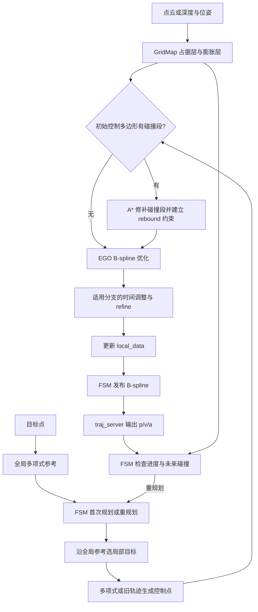
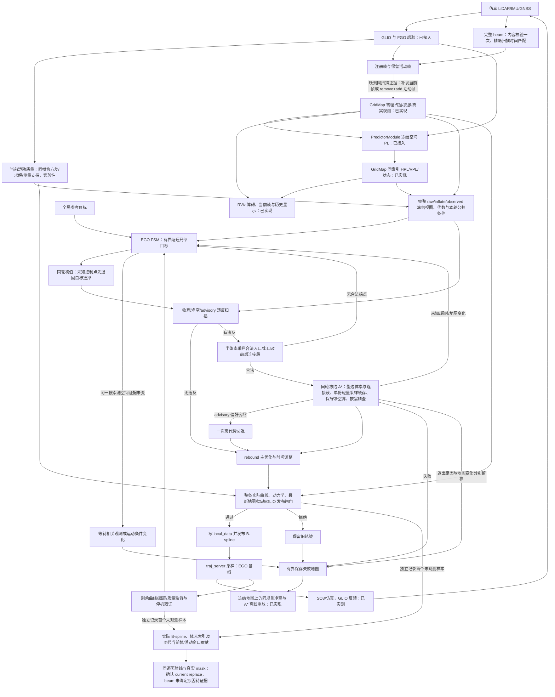
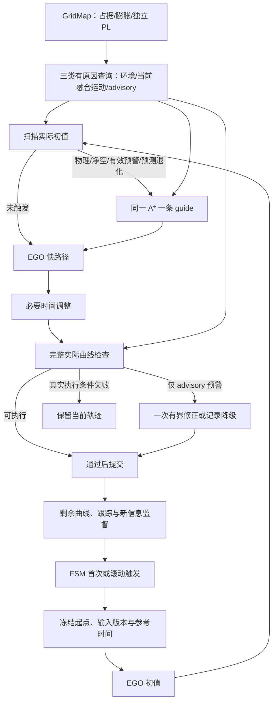

# 回归原版 EGO：规划流程与开发顺序

## 状态与依据

结构基线：`../ego-planner-swarm`，提交 `23a8d5a191711dd65633df689bd00f55d4dea8f9`。原版目录只读。
设计依据：工作区 `docs/0928_review.md` 第 1862 行以后的最终收敛，以及本轮用户确认。
阶段 1 已恢复 EGO 主线、同一个 GridMap 的空间 PL 缓存与真实 PredictorModule 接入；阶段 1a 已实测 GLIO 驱动的仿真和同图显示。本次实施把当前融合运动质量、物理环境与 advisory 预测分开查询，在原 EGO 触发点做完整性避让，并在写入 `local_data` 前检查实际曲线。以下「当前阶段」描述代码；新行为尚无四分叉现场验收记录，不能把旧运行结果当作本次功能的成功证据。原版流程图保持固定基线。
从本轮起，`iap_sim.launch.py` 默认且统一使用 `icra_dense_forest_four_fork_v2` 做完整仿真和可视化回归；单元测试可以保留小型定向 fixture，历史 `fused_nominal` 运行记录保持原场景身份，不迁写为四分叉结论。

## 前方目标、恢复、曲线闸门与独立显示

本轮以 `b3cd747` 为基线。局部目标从本轮 GLIO 参考投影之后选择，`last_progress_time_` 只表示实际投影，不表示目标时刻，不随缩目标或失败回退。终点未知时从当前投影扫描观测范围，并用参考累计前进距离判断原制动余量；中间障碍/未知不作为旁路不存在的证据。原强制旧参考前缀标志已删除。此阶段新增三个真实 FSM 入口测试，覆盖旧位置未知、失败不回退、参考内部障碍、弯曲参考弧长与自交处早分支。ego_planner 构建与三项相关 CTest 通过（`log/20261006T065847Z_524/runtime/step1_final_tests.log`）；初值入口不再整批拒绝未知控制点：公共输入失效仍等待，合法修补端点优先；未知猜测无合法端点时，以可执行的真实接续起点与目标搜索一条 guide，然后按弧长重采样、保留起终端导数并参数化给 EGO。`PlanningBudget` 从冻结入口开始，以 steady_clock 共用 1.5 s / 三次修复配额；A* 每次仍至多 1 s，缩目标、重初始化、搜索、advisory fallback 和后端重启共同扣费，优化取消回调检查同一 deadline。新增真实优化器未知旁路与嵌套预算测试；三项 EGO CTest 通过（`runtime/step2_tests.log`，同一运行目录）。正常规划现已复用 `FrozenOccupancyEpoch`，不再用失败快照创建 GridMap；原 raw 行索引、inflate 与完整 observed 以不可变数据共享，同代缓存冻结一次。失败取证只有显式开启时保留独立 opt-in 数据。`GridPlanningContext.epoch` 供目标、搜索、优化和整条实际曲线查询；A* 仅几何/坐标改变撤销，普通 live 代数变化记录统计、PL 按原软失效处理。最新曲线检查一次捕获全部检查位置及 raw 净空邻域，`commitFrozenCorridor()` 在原地图锁内比较 raw/inflate/observed 和时效后提交；远处更新通过，相关变化最多一次预算内重捕获，当前运动/接续状态在锁边界再核对，监督也复用一致走廊。新增 600 点精确差分与走廊撤销测试，EGO 3 项、A* 1 项、GridMap 4 项定向 CTest 通过（本轮 `step3_*tests*.log`）。复查同时补齐投影/端点/采样循环 deadline、A* 成功前超时检查及隐含重初始化配额；搜索或曲线拒绝不再自动缩目标。独立显示尚未迁出。

## 搜索热路径的当前职责与验证

本轮基线为 `af6fde20bc86730ac2c76dfa5ad4b18b50dab7ae`；原版 EGO 只读。此次只缩减查询和诊断开销，保持 occupancy、inflate、PL/validity 三层、单条 guide、原 EGO 后端、整边体素/中点/连接段、实际完整 B-spline 独立检查及发布闸门。净空、PL、环境有效性、风险代价、启发权重、步长和在线预算均未放宽。

- `beginPlanningView()` 捕获同代地图后，`GridMap::preparePlanningQuery()` 计算本轮环境新鲜度、运动质量/时效/预算和所需净空。`queryPlanningCell(..., context)` 保留逐位置越界、真实 observed、raw/inflate 检查及原拒绝优先级。冻结结论只供搜索；实际曲线先使用本轮 epoch；发布检查和执行监督捕获一次一致走廊。
- 删除 PlanningView 的 `map<tuple<double,double,double>, GridPlanningCell>`。A* 的三份完整结果缓存合成一个 `unordered_map<uint64_t, GridSearchCell>`：体素中心有独立命名空间，节点键为两倍搜索 index，中点键为两个 index 之和。任意端点与连接段不按体素缓存。每次搜索清空结果并复用桶容量；不同轮、地图和运动参数不复用结论。节点池启动分配与每轮搜索分别计时，析构补齐原指针数组释放。
- GridMap 保留原 raw 地址/行偏移索引与原 PL 体素索引及预测版本。净空界缓存只保存同一原始体素中心的距离上下界，绑定冻结代数和本轮净空半径，不保存另一份规划结果。扫描半径 `R=ceil(required/resolution)+1`；未扫描的障碍中心距该中心至少 `(R+0.5)*resolution`。下界取扫描最近距离与此有限界的较小值，上界取确实找到的障碍距离。实际位置偏移 `d` 必须计入：`lower-d > required+1e-12` 才快通过，`upper+d < required-1e-12` 才快拒绝，其余原位置精查。有限扫描无命中只提供有限下界；需要最近位置的失败诊断仍扫描原精确邻域。膨胀与净空仍分别检查，膨胀值不重复加到半径。
- 常规搜索返回 `GridSearchCell`，不测量最近障碍位置、不缓存完整诊断；现有 `queryOccupancyDiagnostic(..., include_details=false)` 跳过 frame/source 字符串、中心和诊断状态生成，保留空间证据与代数。失败时按原冻结代数生成端点/首次拒绝详细数据，v3 失败快照增加首个拒绝位置、物理原因、独立 advisory 分类及按需最近障碍字段，仍使用原 artifact resolver、运行目录和子清单。基准工具存在 `IAP_RUN_DIR` 时采用外层运行，只写独立不可覆盖的子报告/子清单，不改 primary manifest、latest 或结束外层运行。默认统计不含逐点时钟；诊断开关启用占据/净空/查询封装/边检查计时；PlanningView 累计在线 PL 查询时间，A* 在搜索边界取差值，涵盖 miss 与命中刷新，另记实际 live GridMap advisory 接口调用次数（不是 PredictorModule 预测计算次数）。`search_performance_diagnostics=false` 时分项零值表示未测量。A* 对每种失败原因保留首次日志，后续限频；搜索退出原因和 live 地图变化仍分开。
- 搜索缓存命中仍通过 `queryPlanningViewAdvisory()` 复核 PL：原软过期、版本/坐标系/地图变更规则继续有效，历史偏好不冒充有效预测。环境未观测与 advisory 未预测仍不同；缺失预测不单独禁入或急停。活动帧与晚到 beam 的生产逻辑未更改，新增重复当前帧推进测试确认有效活动支持不被误删，真正移除后才回到未知。

冻结输入固定为 `log/20261006T033519Z_009/export/planner/failure_map/timeout` 的 generation 73，100×100×100 节点池、0.1 m 步长、保存端点/中心/运动参数，物理重放 multiplier=1；未运行真实 advisory。构建缓存标签为 RelWithDebInfo，但这些 planner CMake 文件实际设置 Release，生成编译命令为 `-O3 -DNDEBUG -std=gnu++17 -Wall -O3 -g`，修改前后相同。每组预热一次、测量七次；120 s 是固定离线重放上限，在线预算不变。输入文件解码在计时外；freeze 包含地图复制和 raw 索引准备；init 包含搜索池分配及回调准备；search 包含 A* 与结果记录；total 是三者之和。原 `offline_seconds` 含冻结、初始化和可能的端点尝试，不能称作纯搜索。

| 同输入测量 | HEAD 物理查询 | HEAD + PlanningView 浮点缓存职责重放 | 瘦身，分项诊断开 | 瘦身，默认诊断关 |
|---|---:|---:|---:|---:|
| freeze 中位数（s） | 0.0401 | 0.0389 | 0.0200 | 0.0202 |
| init 中位数（s） | 0.0189 | 0.0189 | 0.0136 | 0.0178 |
| A* 中位数（s） | 1.4048 | 2.4075 | 0.8549 | 0.6600 |
| A* 尾部 p95/max（s，七次最近秩） | 1.4145 | 2.4807 | 0.8963 | 0.6744 |
| total 中位数（s） | 1.4629 | 2.4629 | 0.8883 | 0.6978 |
| total 尾部 p95/max（s） | 1.4733 | 2.5427 | 0.9301 | 0.7152 |
| 净空累计中位数（s） | 0.3918 | 0.3939 | 0.1675 | 未开启 |
| 查询封装累计中位数（s，含子查询） | 0.5756 | 1.3872 | 0.2821 | 未开启 |
| 边检查累计中位数（s，含查询/缓存） | 1.2735 | 2.2398 | 0.7550 | 未开启 |

各组都找到同一路径，代价均为 `120.90337868187963`（比较容差 1e-9，实际差为 0），扩展 120,232 节点，队列 push/pop 为 185,749/176,348，空间回调调用为 1,241,690，均未改变。三个采样身份的 hit/miss 分别为中心 1,753,542/164,746、节点 2,815,221/159,136、中点 608,096/917,801；命中率证明这些身份需要复用，但不需要三份完整结构。PlanningView 浮点缓存仅 4 次命中、1,241,686 次未命中，查找/存入约 0.773 s，约 258.3 MB；已删除。原 A* 三缓存估算 227.9 MB，合并后 61.2 MB。净空界 hit/miss 为 989,123/139,075，约 6.4 MB；1,041,347 次快通过、16,358 次快拒绝、70,493 次边界精查，raw 邻域扫描从 1,128,198 次降为 139,075 次中心界扫描加 70,493 次实际位置精查。这里内存是 payload/key/links/buckets 估算，排除 allocator；边计时和查询计时嵌套，不能相加。

基线报告：`log/20261006T050854Z_151`（直接物理调用）、`log/20261006T050953Z_931`（复现已删除的 manager 缓存职责）；各自 `export/analysis/search_benchmark.json` 保存七次数据、路径、二进制和输入 hash，`metadata/config/baseline_measurement.patch` 保存在固定 HEAD 上重建测量入口的补丁。这两组没有真实 PredictorModule 调用；第二组只重放 manager 的浮点物理缓存，并不是一次线上 manager/FSM 运行。最终独占复测报告为 `log/20261006T054032Z_547`（诊断开）和 `log/20261006T054046Z_385`（默认）；另保存固定输入参数、实际 flags 和链接库 hash。报告在提交前运行，revision 为基线 HEAD，瘦身二进制与依赖由 hash 区别；代码随本次提交固定。`log/20261006T054118Z_445` 的三轮差分逐一比较实际 A* 调用的 3,725,070 个位置，执行原因、observed、index、advisory 类别/代价均与原精确接口一致；差分模式额外运行参考查询，不用于性能结论。`log/20261006T054203Z_511/runtime/adoption_check.log` 另验证 adopted benchmark 与外层 owner 共用运行，primary 清单字节及 latest 在子进程前后不变。PL 真实预测耗时、PL 缓存现场命中率和风险引导闭环性能未验收。

验证：六包构建通过；iap 29 项、plan_env 4 项、path_searching 1 项（19 个定向用例）、ego_planner 3 项相关 CTest 通过，含 canonical launch、EGO 进程链路、单源运动质量/advisory 缺失、实际曲线拒绝和失败候选保留旧轨迹。全包 EGO CTest 中 flake8、lint_cmake、uncrustify 未通过（日志包含原有 launch/CMake/全包格式问题）；此处行为通过不代表全包 linter 通过，未做无关格式重写。bspline_opt 当前无注册 CTest；行为通过 EGO 基线/管线测试验证。GridMap 差分覆盖 3 种半径、600 个边界/中心/同格偏移位置、诊断开关、更新代数、有限空邻域及阈值相邻浮点数；A* 覆盖窄风险带、长对角内部体素、中点/连接段、缓存跨轮和真实 GridMap PL 过期/重绑定。合成绕障管线单次测量：冻结约 1.3 ms、启动池分配约 16 ms、最后一次 A* 约 33 ms、后端优化/refine 约 0.46 ms（steady_clock，另累计适用的 bounded correction 优化）、整条实际曲线检查合计约 0.62 ms；这些是小型合成 fixture，不能代替森林快照后端或现场测量。

剩余主要开销是大量边遍历/缓存查找、必须保留的空间采样、边界精查及线上 PL 的有效性复核；冻结全图复制（本轮按代数复用）、原后端和最新实际曲线检查仍存在。停止扩张优化范围。`config/sim_ego/grid_map_stage1.rviz` 无关修改保留，现场前置条件为 `LIVE_BLOCKED_BY_UNRELATED_DIRTY_WORKTREE`。未启动本次 `icra_dense_forest_four_fork_v2` 现场，不宣称新轨迹接续或持续前进。即使物理重放进入一秒以内，也不证明含真实 advisory、地图更新和发布检查的在线预算已经满足。

复查当前实现（先加载 ROS 与工作区环境）：

```bash
IAP_FAILURE_MAP_REPLAY_BIN=/home/dev/ws_iap/build/ego_planner/failure_map_replay \
  python3 scripts/dev_planner/benchmark_failure_map.py \
  log/20261006T033519Z_009/export/planner/failure_map/timeout \
  --label search-slim --repeats 7
# 默认路径另加 --no-diagnostics；实际查询差分另加 --differential。
```

## 原版轨迹流程（固定基线）

以下路径均相对原版 `src/planner/`。

| 模块/函数 | 职责与数据 |
|---|---|
| `plan_env/GridMap` | 点云/深度建图；MappingParameters 保存空间定义；MappingData 分别保存 occupancy_buffer_、occupancy_buffer_inflate_，共用 posToIndex/toAddress |
| `EGOReplanFSM::planNextWaypoint` | 接受目标，调用 manager.planGlobalTraj 生成全局多项式参考；参考本身不搜索障碍路线 |
| `EGOReplanFSM::execFSMCallback` | INIT → WAIT_TARGET → GEN_NEW_TRAJ/REPLAN_TRAJ → EXEC_TRAJ；依据进度、时间和碰撞滚动重规划 |
| `planFromGlobalTraj/planFromCurrentTraj` | 首次取里程计状态；重规划取旧曲线的 p/v/a，构造本次起点 |
| `getLocalTarget/callReboundReplan` | 沿全局参考选 planning horizon 内的局部目标，再调用 manager |
| `EGOPlannerManager::reboundReplan` | 多项式或旧轨迹采样 → B-spline 参数化 → rebound 优化 → 适用分支时间调整/refine → updateTrajInfo |
| `BsplineOptimizer::initControlPoints` | 检测控制多边形的碰撞段；有碰撞才调用 AStar 构造 rebound 基点和方向 |
| `AStar::AstarSearch` | 物理膨胀障碍查询，搜索碰撞段绕行路径；搜索节点池不是第二张环境地图 |
| `BsplineOptimizer::rebound_optimize` | 平滑、障碍、动力学及原 swarm 约束；必要时局部 rebound 修补 |
| `refineTrajAlgo/calcFitnessCost` | 时间调整后的参考跟踪与修正；默认 rebound 主目标没有 guide 跟踪项 |
| `updateTrajInfo` | 更新 local_data：位置曲线、导数、起点、时间和轨迹编号 |
| `callReboundReplan/traj_server::bsplineCallback` | FSM 发布 B-spline；server 替换当前曲线并建立导数 |
| `traj_server::cmdCallback` | 100 Hz 采样 p/v/a 和 yaw，输出 position_cmd |
| `EGOReplanFSM::checkCollisionCallback` | 约 50 ms 检查未来碰撞，触发重规划或 EmergencyStop |



原版边界：可选 distinctive_trajs 产生多个候选，新主线关闭该分支。部分优化/运行时碰撞检查只覆盖前约三分之二；时间调整在 swarm drone_id > 0 的分支被跳过。manager 先写 local_data 再由 FSM 发布。EmergencyStop 用六个相同控制点生成定点曲线，尚不是从运动状态生成的制动轨迹。上述行为是本轮基线，不代表最终完整性或执行保证。

## 当前阶段流程图（随代码同步）

本图描述本次代码中的一条规划主线；“已接入”表示实现状态，不代表四分叉现场验收通过。普通滚动触发和轨迹采样执行保留原 EGO FSM/`traj_server` 主线。



### 本次接口和执行边界

| 接口 | 当前行为 |
|---|---|
| registered beam 绑定 / active delta | 入站完整性、内容 hash 和 sensor frame 校验通过后进入原有 64 帧历史；匹配必须同时满足扫描起止时间，不能借邻帧。合法证据到达唤醒原序列化 worker：只补发仍为最新的当前扫描，保留活动帧按原 remove+add 事务更新；已提交来源的 beam/运动健康证据不因输入历史淘汰而丢失，incomplete 窗口不能被补证据操作提升为 complete。匹配已校验历史只比较时间，不重复计算 beam hash。未收到匹配证据时保持真实未知。 |
| `beginPlanningView` / `queryPlanningViewCell` / `endPlanningView` | 一轮目标、初值和 A* 共用完整的 raw、膨胀及真实 observed 体素标志、云时间、运动质量与预测版本；入口通过 `preparePlanningQuery` 固定公共条件和净空半径；PlanningView 不再保存浮点坐标结果缓存。地图回调写 live GridMap，A* 读取冻结副本。预测上下文与冻结代数不符时 PL 为未知；地图更新后旧 PL 不作为当前有效预测。 |
| `getLocalTarget(distance)` / `callReboundReplan` | 保留沿全局参考选目标；按 horizon 的 1、0.65、0.35 倍顺序尝试一条完整候选，受制动距离、搜索池上限和 1.5 秒轮预算约束。未知初值或无合法修补出口时缩短；本轮无可执行轨迹则记录搜索池空间证据指纹，只有相关体素或运动条件改变才重试。物理障碍仍交给单条 guide 搜索。 |
| `chooseRepairEndpoints` / `AstarSearch` | 修补入口和出口沿初值以最多半体素间距检查，要求未修补前后段、格点舍入连接和端点净空可执行；保持原搜索池与真实起点。A* 默认记录节点、队列、查询、缓存和首次拒绝统计；`planning/search_performance_diagnostics` 显式启用分项计时；退出原因保留 `TIME_BUDGET`，独立记录 `map_changed`、原搜索代数和结束时在线代数。在线地图推进不覆盖冻结搜索的退出原因；搜索视图本身变化仍返回 `MAP_STALE`。 |
| `assessTrajectory` / `captureRemainingFailure` | 发布前重新检查整条实际 B-spline 的动力学、最新物理、当前运动和最新 GLIO 接续；地图代数在检查中变化则拒绝。跟踪误差以 GLIO 测量时间对齐样条期望位置。执行监督的 TRACKING_ERROR、剩余轨迹失败和最终停止各留首份地图；`state.json` 同时记录期望/GLIO 位置、误差、轨迹 ID、末次位置命令时间及数据年龄。独立记录实际曲线的首个未观测样本时间、位置和 `GridPlanningCell::voxel_index`，不受前面物理/净空或起点跟踪失败遮蔽（跟踪拒绝仍保留）；候选和剩余曲线均另存一次 `curve_unobserved`。检查区间总是包含真实终点（含短于半个采样间隔的尾段），v3 保存实际控制点与完整 knot 向量，剩余轨迹失败点不再用飞机当前位置代替。快照仍归入 `IAP_RUN_DIR/export/planner/failure_map/`。 |

`captureFailureSnapshot(include_observation_evidence)` 在同一个 occupancy 锁内拷贝完整物理/观测层、当前 registered frame 和 current/active 的 hit/free 贡献；仅显式取证时保留每体素最近一次 observed→unknown 的 producer（当前帧替换、活动 delta、活动 recovery）。`RegisteredLidarWindow::unthinnedObservationMask` 重用原遍历，只在诊断中关闭端点去重，锁释放后执行，结果只写文件。`analyze_curve_observation.py` 先按实际 B-spline 和保存的采样区间重放首个未知点，检查地图/当前帧年龄，再对照原始帧、实际 mask 与未去重诊断 mask；缺失证据或不一致不能给出空间可执行授权。保存后的 assessment 持有同代快照，后续 live 地图更新不把失败曲线拼到另一代地图；无法取得同代证据时记录采集失败。

规划节点使用四线程 executor；地图回调原有独立 callback group，以及轻量里程计、完整性报告和命令时间锁存回调可在搜索时继续处理。风险绑定与 FSM 状态更新仍串行，避免把进行中的预测缓存写成另一张地图。旧轨迹只有候选通过发布闸门才会被替换。

冻结规划与离线重放的 `GridMap::fromFailureSnapshot` 在原完整地图内建立 raw 障碍地址及 x/y 行偏移索引。`queryPlanningCell` 仍检查同一个立方邻域，只跳过空体素；精确距离、最近点同距顺序、膨胀和真实 observed 判断不变。索引绑定冻结代数，任何后续地图变更均使查询退回原完整 buffer 路径。当前仅 A* 拥有本次搜索的采样结果缓存，GridMap 另复用净空界；没有新增风险地图或延长在线超时。差分回归覆盖 3 种体积半径、600 个含边界/中心/连续偏移的位置及拒绝诊断开关，共 3,600 对查询，并验证新 fused 障碍使索引失效。

以下为此前 raw 索引阶段的单次参考记录，不是本轮重复测量基线。同一 `20261006T033519Z_009/timeout` generation 73 快照、同样 1 秒离线总预算：改动前 A* 扩展 33,705 个节点、346,693 次查询，净空累计 0.642 秒；索引后扩展 55,434 个节点、575,577 次查询，净空累计 0.196 秒。两次仍为预算耗尽，不能归入无路。索引阶段保持默认 120 秒离线预算后，原端点在约 1.62 秒得到合法路径，`export/analysis/failure_map_timeout.json` 为 `ONLINE_SEARCH_TIMEOUT`；只证明保存时已观测搜索池和运动规则下的 A* 路径，不授权当前地图，也不证明整条 B-spline 可接续执行。六包构建及 GridMap、A*、EGO/产物/canonical 定向检查通过。GPU 预检为 RTX 4070 Ti SUPER、cuInit(0)=0、device count=1；保留的 RViz 改动仍使现场状态为 `LIVE_BLOCKED_BY_UNRELATED_DIRTY_WORKTREE`，没有新闭环结果。

A* 节点状态只在一条可执行 incoming edge 通过后写入本轮 `rounds`、OPEN、父节点和分数；被拒绝的边不能把该格误标成已发现。未发现分数初始化为 infinity（原 `1 >> 20` 实际为零），目标 index 在计算首次启发分数前初始化。四节点定向回归在修复前因直接边中点拒绝、后续合法绕行被错误访问状态跳过而返回 `NO_PATH`；修复后保持同样端点和中点约束、连续复用同一搜索器三次均找到四点合法绕行。此代码缺陷可复现，不据此断言它就是现场全部超时的原因。节点状态修复当时，同一 timeout 快照的 1 秒离线预算仍耗尽（扩展 88,042 个节点）；默认 120 秒预算在约 1.37 秒找到原端点合法路径，该阶段 `failure_map_timeout.json` 为 `ONLINE_SEARCH_TIMEOUT`。六包构建、完整 A* 定向套件、EGO 三项及 beam/canonical 接口检查通过；没有新四分叉闭环运行。

当前 v3 `current_frame` 附带 `beam_binding_reason`、`beam_received_count`、`beam_invalid_count`、`beam_evicted_count`、按接收顺序保留的首/末扫描时间与同起点候选的结束时间；观测分析报告原样给出 `beam_binding`。这些字段是接收/绑定诊断，不能授权自由空间。原因包括 `matched_exact_scan`、`retained_exact_scan`、`no_valid_received_evidence`、`scan_start_mismatch`、`scan_end_mismatch`。旧快照缺少这些字段时明确未知，不能据总消息计数推定具体扫描经过了传输。

当前固定回归使用 `20261006T033519Z_009` v3 generation 43 的全部 3,600 个当前帧 hit（frame 89），在原 0.1 m 格子/尺寸/原点重放：`(58,110,14)` 仍未知，z13/z15 仍观测，关闭端点去重也不覆盖该格；用明确标为合成的前一帧支持反复验证 current replacement 的 observed→unknown 转换。它不包含真实缺失的 beam 或上一帧原始扫描，不证明 LiDAR 没扫到。原始现场前进约 4.48 m 后没有新曲线接续，旧曲线到期并由 traj_server 保持终点悬停；这是此修复之前的参考结果，不是新修订的现场验收。

绑定回归通过真实 ROS beam 订阅、GLIM 公共回调和原序列化 worker，验证注册帧先到/beam 后到时当前帧补齐、已有合法健康的活动帧 remove+add、后续当前帧不会退回旧扫描、错时和坏 hash 不作观测证据。窗口测试验证同一扫描升级后 free 证据进入真实 mask，并在当前帧推进后由活动贡献保留。该缺陷已被定向测试复现，但旧现场没有接收侧绑定统计，因此尚不能认定晚到就是 frame 89 未绑定的现场根因。现场仍受无关 RViz 脏工作树规则阻挡。 六包构建、GridMap 四项、A*、EGO 三项、beam 绑定/真实交付/active policy 和 canonical launch 定向测试通过。

本次回归以 `20261005T163036Z_646` 的 v2 端点快照为固定夹具：原记录的搜索起点未观测，原已观测搜索池离线重放仍为 14 个合法入口、0 个合法出口、`INCONCLUSIVE_NO_VALID_REPAIR_ENDPOINTS`。同一夹具的在线端点选择测试确认没有合法出口；初值未知控制点在 A* 扩展前返回 `END_UNOBSERVED`，由 FSM 顺序缩短目标，若仍无完整可执行轨迹则等待搜索池相关体素或运动条件变化。该结果不证明该次真实环境全局无路，也不把前一次 `20261005T162512Z_204` 的约 3.7 m 前进和最终 `TRACKING_ERROR` 合并为同一运行。

构建与定向检查：`build_iap_dev.sh` 六个包通过；GridMap 风险/占据代数/注册窗口/启动、A*、EGO 基线/进程管线/失败地图工具及 canonical launch 测试通过。管线合成点云现在覆盖短轨迹三维已观测体积，缺失 GNSS 单独验证 advisory 不可用；测试未借稀疏射线伪造完整观测。A* 测试包括边中点/连接段拒绝、缓存、冻结搜索期间 live 地图推进和超时分类；EGO 测试包括障碍绕行、时间调整后曲线拒绝不覆盖旧轨迹、v2 快照和新增停滞/停止产物。四分叉现场运行需干净已提交修订与 GPU 预检；当前无关的 `config/sim_ego/grid_map_stage1.rviz` 修改仍在，故本次状态为 `LIVE_BLOCKED_BY_UNRELATED_DIRTY_WORKTREE`，未取得新实测任务进展或停机结论。

本次观测空洞取证补充：`20261006T024159Z_617` 的 `remaining_failure` 在 generation 40 报 `ENVIRONMENT_UNOBSERVED`，旧 v2 地图却保存当时飞机位置并查询为 `OK`，没有实际曲线、首个未知体素或同帧原始 beam。对该产物运行新分析器得到 `INCONCLUSIVE_MISSING_CURVE_AND_FRAME`，报告在该次运行的 `export/analysis/curve_observation_remaining_failure.json`。这份证据不能确认所述 10 cm 空洞来自射线覆盖、端点去重或窗口更新。该次日志中 1.000 秒的 `MAP_STALE` 也没有独立终止原因字段，不能事后确定其退出分支；新代码用定向回归证明同时超时/地图推进时保留两个事实。不得将此运行和两次 20261005 运行合并。

本次验证范围：六个包构建；GridMap/registered-window 回归覆盖原始射线和端点去重产生不同覆盖、当前 overlay 替换、active delta/recovery 移除、同代源快照；EGO 回归覆盖前面物理失败不遮蔽后面未知点、实际曲线/体素/同 mask 离线核对、终点短尾段、跟踪拒绝不遮蔽未知点和有界十类产物；A* 覆盖同时超时/地图变化，以及冻结搜索在 live 更新后成功。相关功能 CTest（GridMap 四个、A* 一个、EGO 三个）和 canonical launch 均通过。额外整包 CTest 的 `flake8`、`uncrustify`、`path_searching/lint_cmake` 未通过；用 HEAD 版本临时夹具分别复现了这些格式失败，未把整包检查写成全绿。现场仍被保留的无关 RViz 修改阻止（`LIVE_BLOCKED_BY_UNRELATED_DIRTY_WORKTREE`），已有 v3 确认当前帧替换移除支持；仍缺接收侧证据确认 beam 未绑定的现场原因，未宣称闭环通过。

## 目标设计与顺序

| 阶段 | 修改 | 验收 |
|---|---|---|
| 1：已实现 | 恢复 EGO 主线，在 GridMap 增加独立 PL 层 | 同一索引、真实预测、缓存有效性、物理规划与命令链路的自动化测试通过 |
| 1a：链路与显示已实测 | GLIO 同时接规划与 SO3，发布障碍及同图空间 PL 切片 | 真实输入链、有效 PL、实际曲线、控制反馈与可视化持续更新；不代表完成目标或安全飞行 |
| 2：代码已接入，现场待验 | 初值的完整性预警触发一条 guide；A* 逐体素检查物理与当前运动条件，advisory 优先避让、未知有限代价 | 无物理障碍仍绕开有效预测退化；宽远路线不受固定 30% 长度上限排除 |
| 3：代码已接入，现场待验 | guide 建立 rebound 基点并进入主优化 fitness 项；优化中新违反调用相同查询 | 平滑后实际曲线保留选路偏好，允许有记录的 advisory 回退 |
| 4：代码已接入，现场待验 | 时间调整后整条实际曲线与动力学检查；运行期检查剩余实际曲线 | 真实执行条件失败不覆盖当前轨迹；advisory 缺失不单独拒绝提交 |
| 5：部分实现 | 通过后写 `local_data`；无可执行接续时尝试检查连续制动，失败才使用标记未验证的仿真悬停 | 同一状态/时间接续及正式停止契约仍待完成；不能报告正式 PASS |



一次触发只交付一条 guide，不建立多候选竞赛。初值没有违反时保留 EGO 快路径；此方法是 *integrity-triggered replanning*，不声称对所有可通行路线求全局最低风险。物理环境、当前融合运动质量与局部净空是执行条件；advisory 的 0.45/0.50 m 线仅是主动避让线。未知预测的初始路径代价倍数为 1.5；同一 A* 在正常避让无路时至多顺序回退一次，不能放松真实执行条件。起点在预警区直接用同一搜索器的高代价规则，不建独立脱离模式。失效预测与真实退化保持不同状态。搜索边、优化后与时间调整后的曲线使用同一冻结预测上下文；运行期监督读取新信息。实验版本不声明概率完整性保证。

## 阶段 1 接口与验证

### 所有权与接口

- `MappingData::risk_buffer_` 是与 occupancy_buffer_ 等长的 `vector<GridRiskVoxel>`，通过相同 posToIndex/toAddress 查询。每项保存 HPL、VPL、状态、版本；原点、分辨率和尺寸不重复存储。
- `GridMap::bindRiskContext(context)` 返回新版本；绑定拥有冻结输入的点查询函数及参考时刻/有效期/坐标系/占据版本。任何新绑定都会使旧版本不可查询。
- `GridMap::queryRisk(position, version, evaluation_time)` 按体素中心计算一次并复用同版本结果，不插值，不维护 horizon 数组。状态包括 UNCOMPUTED、VALID、INVALID、STALE、OUT_OF_MAP、FRAME_MISMATCH、VERSION_CHANGED、INVALID_QUERY；失败的 PL 为 NaN。
- `GridMap::invalidateRiskContext()` 用于输入更换；占据更新序列在查询前后均校验。resetBuffer 也提交占据版本并撤销风险上下文，不能在重置后重新绑定旧地图证据。
- `getOccupancy/getInflateOccupancy` 保持物理语义。GNSS 的 `set_occupancy_query` 读取同一地图的原始占据，观测支持独立查询；不会在预测器内部再构造 LocalOccupancyGrid。占据查询与外部格子查询的绑定采用后绑定者生效。

### 数据来源与时序

现有 manager 的 `planner_risk.cpp` 只负责订阅与绑定。里程计、IntegrityReport、GNSS 测量与星历组成 IntegritySnapshot；GNSS 历元按监测报告来源身份匹配，最多保留 64 个且按 GNSS 有效期裁剪。注册地图的只读视图提供原始障碍、观测证据和 LiDAR FIM 输入。这个视图属于 GridMap，不是独立地图管理器。

每次 reboundReplan 前绑定一次，使用 PredictorModule 点查询，query_time 与 evaluation_time 均固定为该轮参考时刻，horizon=0。阶段 1 曾只查询起点作诊断；当前规划轮的初值扫描、搜索与 rebound 共用冻结物理/已观测视图和同代预测上下文，发布前的实际曲线检查使用最新相关信息。规划节点使用四线程 executor，地图、GLIO 和当前完整性锁存可在搜索时继续更新；FSM 和预测绑定仍串行，不启动旧 worker pool。

旧版本曾用来源最大 PL 反推对角位置先验；该量不是融合 FGO 后验。本次改用同帧 FGO 后验协方差的 `3 sqrt(lambda_max)` 实验代理构造对角先验；代理不是认证 PL。LiDAR 使用实际地图点构造 FIM，禁用 legacy observability 降级；没有有效预测时返回有原因的未知或无效状态，而非有效零风险。

| 配置/接口 | 默认与含义 |
|---|---|
| `risk/source` | fusion；也支持 gnss、lidar，与场景完整性来源对应 |
| `risk/validity_s` | 0.5 s；约束本轮、里程计、当前 PL 和地图来源时间 |
| `risk/gnss_max_age_s` | 2.0 s；fusion/gnss 模式同时受 GNSS 历元有效期约束 |
| `risk/integrity` | canonical 重映射到 `/iap/integrity` |
| `risk/range, ephem, glo_ephem, receiver_lla, iono` | canonical 重映射到现有 `/ublox_driver/` 对应输入 |
| `odom_world` | FSM 与风险输入使用同一个里程计重映射 |
| `frame_id`（traj_server） | 默认 map；命令时钟使用节点时钟 |

有效期取所有适用输入截止时刻的最早值。缺失、未来时间、过期、非有限值、负 PL、坐标不匹配都不会成为有效零风险。空间预测只代表冻结时刻，不声明到达时刻的完整性。

### 本次实验性规划接口

- `IntegrityReport.current_motion_quality` 是同帧 FGO 后验协方差、FGO 求解有效性、帧时间及测量支持形成的 **实验性运动质量**：`SUPPORTED`、最多 1 秒的 `BRIDGED` 或 `INVALID`。`current_motion_error_proxy_m = K_pl sqrt(lambda_max(Sigma_p))`，四分叉配置 `K_pl=3`。GNSS 来源的 `1e9` 退化哨兵不再标为可用 PL；GLIO 的 ICP 注册支持与来源 PL 有效性分别记录。实验性 ICP 接受门限为至少 20 内点、内点比例至少 0.20、RMSE 至多 0.50 m；这些门限是可配置机制参数，尚未完成四分叉校准。来源最大 PL、原 `UNSAFE` 和旧 `planner_state=HOVER` 仅供诊断，不是融合后验 PL、执行命令或独立运动授权。`SUPPORTED` 可申请新正常轨迹；`BRIDGED` 只用于监督已有短轨迹，不能提交新正常轨迹。
- `GridMap::queryPlanningRisk()` 以原体素地址返回 `VALID`、`AVOID`、`PREDICTED_DEGRADED`、`STALE_REFERENCE` 或 `UNKNOWN`。有效 HPL/VPL 达到 0.45/0.50 m 时触发优先避让，0.55/0.60 m 为实验任务预算；二者均不是独立急停线。未算出、短期过期与模型明确退化互不混淆。0.5 秒有效期后，最后有效值仅在 1 秒内作为衰减软偏好；参考位姿变动超过 0.5 m、坐标系或版本不匹配时不复用。旧值不写回当前有效 PL。advisory 未预测位置使用长度的 1.5 倍有限代价；环境未观测仍拒绝物理执行，允许将来记录预测覆盖不足。
- `GridMap::queryPlanningCell()` 同时返回 `GridExecutionReason` 与上述 advisory 类别。执行原因覆盖越界、环境未观测/过期、物理障碍、局部净空不足、当前质量失效/过期/预算不足及跟踪偏差。局部净空按需检查原始体素中心：机体 0.35 m + 跟踪预留 0.10 m + 当前误差代理 + 半体素对角线（0.1 m 分辨率时约 0.087 m）。原膨胀层仍是独立的物理障碍快速检查，局部净空不会把 0.3 m 膨胀值再次加入半径。无距离场或第三张禁入地图。
- `BsplineOptimizer::setPlanningQuery()` 继续消费 `GridPlanningCell`；A* 的 `setPlanningQuery()` 将同一查询投影为 `GridSearchCell`（执行原因、advisory 类别、代价）。manager 给 A* 绑定 `setAdvisoryQuery()`，缓存命中也复核最新预测有效性。初值违反时顺序运行一次正常避让搜索，确认 advisory 阻断后最多运行一次同搜索器的高代价回退；搜索边检查经过的体素。rebound 的基点/方向及优化中新违反检测调用同一查询，主目标可对一条 guide 做 fitness 跟踪。
- 四分叉停滞修复后，局部目标若在环境未观测区或 GridMap 范围外，FSM 沿全局参考回选连续已观测前缀内可执行的点，要求至少 0.8 m 前进并以零末速度收束；没有足够范围或地图过期时等待新地图代数，不重复搜索同一旧输入。A* 搜索池越界时逐次缩短后续局部目标距离（下限 0.8 m），成功后恢复正常 horizon；若仍无可行段，保留失败而不挪动真实起点。A* 返回端点、环境、当前质量、穷尽、超时或 advisory 的分类原因；它不再把未观测或过期端点当障碍向外无限挪。物理端点只有在原始请求点有效、搜索格点舍入落入障碍且连接线可检查通过时，才允许 1 m 内调整；真实起点不能被挪成另一个规划起点。终点本身属于有效 advisory 避让区，或正常搜索穷尽且有 advisory 拒绝时，才运行现有一次高代价回退；超时不等价于该条件。
- A* 的体素中心和半格采样结果只在本次固定地图、搜索坐标和运动参数下复用，边仍逐体素检查；冻结地图代数变化立即结束本次搜索，live 变化单独记录并使 advisory 返回未知。物理结果缓存不延长 PL 有效期。最终曲线检查继续按实际位置重新查询，不读取 A* 缓存。`GridPlanningCell` 保留所需净空、局部扫描内最近原始障碍距离及位置、观测状态、地图代数与云时间。最近障碍未测到时记录为 `not_measured` 或 `no_raw_obstacle_in_scan`，不得打印有效零距离。
- `EGOPlannerManager::assessTrajectory()` 在提交前检查完整的时间调整后曲线、当前运动条件及候选起点与最新 GLIO 位置接续（0.30 m 门限），结果分开统计真实执行违反、advisory 预警和未知样本；预警切回时尝试一次修正，仍可执行则记录 degraded fallback。只有通过真实执行条件的候选写入 `local_data`。跟踪失效时从当前 GLIO 状态重新生成初值，不从已经偏离的旧曲线取起点。FSM 每 200 ms 检查剩余曲线、跟踪与新信息；advisory 预警只请求提前重规划，短暂缺失不触发急停。真正无法继续时尝试从当前速度生成、检查制动曲线；失败使用原版定点仿真悬停，并明确标记未验证。
- 上述 0.55/0.60 m、0.45/0.50 m、1.5 倍、0.35/0.10 m、0.5 s/1 s 等值是版本化四分叉机制实验参数，不是适航或概率完整性证明。环境观测范围外没有物理通行授权；当前质量也不保证未来未知空间。

### 清理与兼容边界

规划器恢复原版 FSM/manager/A*/B-spline/traj_server，删除已替换的 P0–P5 源码、专属测试和参数，以及独立 RiskGridMap/UnifiedRiskGrid、旧转换与旧 Phase-2 evaluator/P0 profiler。Bspline 消息和 LocalTrajData 去掉旧执行证书字段；这是有意的接口变更，需重建 traj_utils 及依赖包。独立预测算法和注册点云输入仍保留。

当前 canonical 仿真图由 `_includes/full_stack_runtime.py` 组成，不使用旧实验开关。历史 bp 入口、实验脚本和产物保留用于查阅；它们的旧规划参数、消息契约和验收结果不适用于本轮。`iap_flight` 暂时拒绝启动，待阶段 4/5 的检查、接续、停止完成后再恢复部署校准与车辆控制验收。

仿真保留注册点云输入所需的 SI 加速度系数 1.0、NAIVE 初始化、512×40 spherical_first_hit_v1 射线模型与 2 秒传感器启动延迟；地图和规划使用同一静态坐标平移，不动态对齐真值。

原版为适配现有输入进行了必要调整：统一节点时钟、命令 frame、Jazzy 头文件/依赖导出；未来开始时间到来前不发送原版的零坐标命令。尚未实现 pending 轨迹接续。

### 本轮仿真可视化接口

- `iap_sim` 中规划器与 SO3 控制器统一订阅 `/drone_0_visual_slam/odom`（`map`）；真值只供传感器仿真与对照。Current Integrity Monitor 仍是 GLIO 扩展，Advisory 查询仍由 EGO manager 调用 PredictorModule。
- `risk_viz/enabled=true` 时，manager 独立于规划目标每秒冻结一次预测上下文，在无人机附近 10×10 m、高度吸附至原 GridMap 体素中心的水平层，最多查询 100 个、间距约 1 m 的格子；同轮使用同一版本和原 `queryRisk()`，绑定上下文后给逐点采样 20 ms 预算。绑定开销另计并显示为 bind，整轮耗时显示为 cost；超采样预算只显示已算点并明确标为 incomplete。
- `/grid_map/occupancy`、`/grid_map/occupancy_inflate` 继续表示物理层；注册点云模式的原始占据可视化读取其真实 raw-cloud buffer。`/grid_map/risk_slice` 为 PointCloud2，字段 `x,y,z,rgb,hpl,vpl,status`，有效 PL 由固定色标着色；无效预测为紫色，未计算不伪造值。上下文过期、版本变化或坐标错误发布空切片。
- `/grid_map/risk_status` 是 TEXT_VIEW_FACING Marker，显示版本、冻结时间、切片高度、有效样本比例、实际插值面格数、耗时、当前监测 HPL/VPL 与原因；文字明确标注 frozen spatial PL。默认 HPL 显示范围 0.25–0.65 m、VPL 0.20–0.55 m，蓝、青、黄、红色带仅为可视化范围，不是安全阈值；`/grid_map/risk_legend` 在切片角落给出米数刻度。
- `/grid_map/risk_surface` 从同一轮至多 100 个真实 PL 点生成半透明三角面，只在四角预测均有效且同版本、格子采样点未被物理膨胀障碍占据时显示。面内颜色为**视觉插值**，不写入 `risk_buffer_`、不参与规划或有效性判断；原 `/grid_map/risk_slice` 保留真实样本点。风险面只有这一条 MarkerArray 话题：marker 的 lifetime 为 60 秒，相距约 4 m 的空间片段用不同 ID 留存，同一区域新结果覆盖同一 ID，避免持续叠加。RViz 的 MarkerArray 没有 Decay Time 属性；画面中的旧面只表示过去冻结时刻的显示结果。无有效 PL、预测上下文错误或色标指标切换时向同一话题发 DELETEALL，清除全部留存面。RViz 物理占据显示的 20 秒 Decay Time 同样只是显示历史，不改变 GridMap 物理层。仿真中原始和膨胀点云发布周期为 1 秒（`grid_map/visualization_period_s`）；仅可视化发布降频，地图更新与规划查询不降频，以免 20 秒重复三维方块耗尽 RViz 内存。
- 仿真 GLIO 注册当前帧已按 `publish_current_hits_map=true` 发布 `/iap/local_map/current_hits_map`（`map` 坐标、PointCloud2、SensorDataQoS）。RViz 以浅青色点显示最新约 0.2 秒的帧，输入停止后点云消失，独立于累计障碍层；它不改变 GridMap 的占据或 PL 数据。
- `risk_viz/metric` 默认 `hpl`，可在 planner 运行时设成 `vpl`，下次切片更新颜色；`risk_viz/z_mode=follow|fixed` 与 `risk_viz/fixed_z_m` 在启动时选择高度。`traj_server` 在 `/planning/trajectory_curve` 发布其实际装载 B-spline 的采样青色曲线；`/grid_map/glio_path` 是由 GLIO 里程计生成、最多 500 点的白色连续历史线。
- 风险图始终是某一冻结参考时刻的空间切片，不是未来到达时刻 PL。当前规划读取同一 `risk_buffer_` 的有效样本作避让偏好；RViz 插值面和过去 60 秒的显示面不进入规划。旧风险体素在新版本查询时不会作为当前有效数据返回；最后一次有效值最多在过期后 1 秒内作为逐渐减弱的软偏好。
- `iap_sim.launch.py capture_failure_map:=true` 显式启用有界失败证据。规划器按端点拒绝、搜索穷尽、搜索超时、最终曲线拒绝、持续无可执行目标、跟踪误差、剩余曲线失败和最终停止、曲线首个未观测点和地图变化各保存首份快照，最多十份，路径为同一次运行的 `export/planner/failure_map/{endpoint,exhausted,timeout,map_changed,candidate,curve_unobserved,stall,tracking_error,remaining_failure,remaining_stop}/`，`metadata/manifests/planner_failure_map_*.json` 是子清单；代数不一致则记录采集失败，不保存混代地图。`cells.bin` 按原 GridMap 地址保存 raw=1、inflate=2、observed=4 三个位。v2/v3 `snapshot.json` 记录空间几何与代数、完整运动净空参数、搜索池、原始端点、修补段控制点与索引；`queried_risk.csv` 只记录同版已查询的 PL。停滞及执行失败另有 `state.json`。`replay_failure_map.py` 用 RViz 显示物理和观测层；`analyze_failure_map.py` 从冻结地图重建 GridMap，调用原 C++ 净空查询和 A* 边/连接检查，在原搜索池内诊断端点选择、在线超时或已观测池内无修补路。离线默认预算 120 秒，过期/缺失证据、无合法替代端点和预算耗尽必须标为无法判定。报告写入同次运行的 `export/analysis/`；稀疏 PL 只作旁证。旧 v1 快照不支持同规则重放；快照不是未来预测或物理世界真值。
- 首次 `fused_nominal` 闭环暴露随机森林树干直接穿过起飞点（真值地图最近障碍仅 0.089 m），造成 EGO 起始控制点碰撞。仿真随机森林现在只在起点和目标周围各留 1 m 圆形空间，保留中途树木与物理绕障任务；这属于场景输入修正，不改变 EGO 碰撞规则。
- 修正起终点后，真实传感器仿真观察到 GLIO、注册障碍、B-spline、位置命令、SO3 命令与机体运动持续更新，SO3 的 ROS 订阅确认为 GLIO odom。该次运行还暴露了预测绑定耗时导致采样预算在第一点前耗尽，以及定时关闭时 `traj_server` 发布器被异步关闭；现按绑定和逐点采样分别计时，并让 `traj_server` 完成当前回调、释放 ROS 实体后关闭上下文。

### 验证证据

- 显式 IAP 源路径构建 `iap、traj_utils、plan_env、path_searching、bspline_opt、ego_planner`：通过。
- `test_grid_map_risk`：6 项通过；地址/边界、占据独立、缓存命中、版本/重置、过期/坐标、异常值和查询期间失效。
- `test_grid_map_occupancy_epoch`：25 项通过；`test_registered_lidar_window`：18 项通过；注册点云启动/恢复进程测试通过。
- `test_predictor_module`：100 项通过，含新增直接占据查询对 GNSS canopy 结果的影响与 unknown 保留。
- `test_ego_baseline`：2 项通过；真实 LiDAR PL 查询及过期拒绝、EGO 物理障碍绕行与曲线/导数有限性。
- `test_ego_pipeline`：通过；独立规划节点接收目标、发布 B-spline，traj_server 输出 p/v/a 与独立 Cox-de Boor 基函数计算吻合。
- `test_canonical_launch_contracts`：32 项通过，涵盖统一地图配置、注册输入坐标、运行产物目录和阶段 1 实飞不可用。
- 本轮先将原有两处 GLIO RViz 改动独立提交为 `d60c1c6`。可视化与 GLIO 控制链路提交为 `b5326d0`；两次现场发现的起点障碍、原始占据发布、采样预算和 `traj_server` 退出问题经 `2799639`、`04f80ca` 修复。相关包构建及上述聚焦测试通过，管线测试还断言轨迹服务正常退出。
- 干净修订 `04f80ca5fdbeeeae33ecb14f7ab010f6ecf4f7fb` 的 `fused_nominal` 75 秒现场运行目录为 `log/20261004T101419Z_083`，manifest 记录同一 commit 和 `git_worktree_clean=true`。GPU 预检 `nvidia-smi`、`cuInit(0)` 与 CUDA 设备数均通过，RViz 启动并订阅原始障碍与风险。55 秒探针窗口收到 GLIO odom 498、当前完整性报告 497、原始/膨胀障碍各 408、风险切片 53、B-spline 与实际曲线各 73、位置命令 5212、SO3 命令 5328 条；原始障碍末帧 26,295 点，风险切片最多 100 点，有效点帧 43 次。ROS 图确认 SO3 控制器订阅 `/drone_0_visual_slam/odom`，运行时 HPL→VPL 参数切换成功；全部进程正常退出。
- 同一窗口真值位置从约 `(-10.56,-0.24,0.51)` 移至 `(-2.73,-1.16,1.24)`，证明估计驱动的控制回路确实带动仿真器；GLIO 末值约 `(-4.34,-1.18,0.47)`，与真值偏差明显。当前监测持续报告 `UNSAFE`、HPL/VPL 约 `1e9 m`，不能把 Advisory 切片的约 0.4–0.5 m PL 当成当前位姿安全结论。该次运行未到达 x=12 m 目标，也未对实际机体轨迹作完整碰撞认证；EGO 仍保留物理避障基线行为。
- 运动中的切片整轮最大耗时约 132 ms，主要为冻结占据/预测绑定；逐点采样另受 20 ms 限制。55 秒窗口 GLIO 约 9 Hz、命令约 95–97 Hz，未见因切片而停止更新，但当前单线程规划器仍可能被绑定阶段短暂阻塞。这是后续性能优化的明确限制。
- 另一干净修订 `04f80ca` 的 `manual` 无目标运行 `log/20261004T101912Z_537` 中，仅将本次启动的 GNSS 仿真进程暂停 7 秒并恢复。风险状态从 `78/78` 有效转为 `0/78` 无效，旧有效颜色被新紫色无效样本覆盖；没有把失效预测显示成零风险。这里验证的是失效呈现，不代表 GNSS 恢复后一定重新获得有效预测。不声明四分叉场景 LIVE PASS 或主动风险绕行已实现。
- 统一场景默认切换提交 `7a3d8ee907c0183917faf54966a6410b22441b85` 的 90 秒现场运行目录为 `log/20261004T102551Z_178`。使用不带 `scenario` 参数的 canonical `iap_sim.launch.py`，manifest 记录 `icra_dense_forest_four_fork_v2`、该 commit 和干净工作区；GPU 预检通过，RViz 启动，所有进程正常退出。55 秒探针窗口收到 GLIO/当前报告各 520、原始与膨胀障碍各 368、风险切片 49、B-spline 和实际曲线各 50、位置命令 4782、SO3 命令 4991 条；末帧原始障碍 20,077 点、风险 99 点，HPL→VPL 运行时切换成功。真值从约 `(-18.00,0.00,1.51)` 移至 `(-4.16,-2.04,2.27)`，GLIO 末值约 `(-4.21,-1.97,2.08)`。ROS 图确认 SO3 订阅 GLIO odom。该窗口没有覆盖 x=18 m 目标到达，不能报告完整任务成功。
- 四分叉运行中的风险切片整轮最大耗时约 205 ms，主要来自冻结输入/预测绑定，逐点采样仍受 20 ms 预算；这会短暂阻塞当前单线程 planner。Current Integrity Monitor 持续为 `UNSAFE`、HPL/VPL 约 `1e9 m`，而 Advisory 空间切片仍可有有效 PL，二者在状态文字中分开显示。此轮证明同图可视化和传感器驱动控制链路，不是安全规划或四分叉正式 PASS。
- 四分叉显示历史实测：干净修订 `26700d5` 对应 `log/20261004T110440Z_711`。52 秒探针收到物理占据/膨胀各 47 帧、风险/当前面/图例各 49 帧，插值面最多 33 格；VPL 样本约 0.24–0.38 m。RViz 在探针 46 秒时 RSS 约 659 MiB；此前原始障碍每约 0.11 秒发布、20 秒 Boxes 留存的试跑在约 49 秒时约 2.3 GiB。1 秒可视化发布周期降低重复绘制量，地图更新和 PL 查询次数未随之减少或增加。
- 最终色带修订 `9f14f24` 的四分叉运行 `log/20261004T110943Z_881`，manifest 记录该修订与干净工作区。35 秒探针收到风险、当前面、图例、物理占据各 34 帧；该窗口 HPL 样本约 0.29–0.42 m，对应 68 种点颜色、无灰色中段，图例为 0.25/0.45/0.65 m；RViz 当时 RSS 约 473 MiB。两次均由定时 SIGINT 结束，节点正常退出。插值面随预测有效性和物理障碍变化，末帧允许为 0 格；历史预测以低透明度表示过去，失效时清除。本证据仅验证显示与资源开销，Current Monitor 仍报告 `UNSAFE`，没有证明主动风险绕行或完整任务到达。

### 本次改造验证与现场边界

- 失败地图 v2 同规则重放已完成构建；`test_grid_map_risk` 10 项、`test_advisory_a_star` 10 项、`test_failure_map_tools` 11 项，以及 `test_ego_baseline` 和 `test_ego_pipeline` 均通过。合成地图覆盖冻结地图与在线净空查询一致、未知/原始障碍墙、舍入端点及连接段、边中点、替代端点、在线超时、离线预算耗尽和每类首份产物。此为代码及合成输入验证；四分叉真实失败地图尚未采集。无关的 `config/sim_ego/grid_map_stage1.rviz` 工作区修改仍在，按仓库规则本次现场取证标记 `LIVE_BLOCKED_BY_UNRELATED_DIRTY_WORKTREE`，不得把上述测试写成四分叉连通性结论。
- 四分叉停滞诊断修复的离线验证：`plan_env` 的 GridMap 风险、占据代数、注册点云与启动进程 4 项定向测试通过；`path_searching` 的风险 A* 测试覆盖未观测/越界目标、物理端点、连接段及搜索缓存；`ego_planner` 的基线、进程管线和失败地图离线工具测试覆盖物理绕障、实际曲线检查、失败候选保留旧轨迹，以及保存地图中的可通路、目标未观测、已观测池无通路三种诊断。Canonical launch 与 PredictorModule 的定向测试也通过。此证据属于代码和合成输入验证；旧停滞运行未保存 GridMap，本修订的四分叉真实地图、搜索耗时及实际前进尚未取得，不能将其写成已修复的现场结论。包级 lint 全量检查仍有原有文件的 flake8/uncrustify 格式失败，功能测试结果单独记录。
- 相关包构建、GridMap 风险分类与执行原因测试、GNSS/LiDAR 单源与双源短时中断的运动质量测试、风险 A* 宽远路线及预警区起点测试均已通过。后续复核增加了单内点和过大 ICP RMSE 不刷新 LiDAR 支持、接续窗口到期不延长授权、桥接期间仍检查整条剩余物理曲线、候选起点偏离 GLIO 时拒绝的用例。优化器测试在没有物理障碍的直线路径上放入 advisory 避让带，验证由原初值触发单条 guide、主优化曲线发生绕行。EGO 测试验证物理绕障、时间调整后实际曲线的独立检查，以及失败候选不覆盖已有轨迹。
- ROS 进程管线测试用带已观测自由射线的测试点云及**合成**运动质量报告，验证目标、B-spline、指令、空闲风险显示和缺失空间 advisory 不会成为有效 PL。合成报告不等于 GLIO/FGO 实测。
- 运行期物理/当前质量监督每 200 ms 评估**整条剩余曲线**，滚动重规划失败期间仍继续监督旧曲线；完整 Predictor 绑定约每 1 s 一次，以避免每次监督都冻结预测地图。双源中断的 1 秒接续按报告测量支持年龄加报告后的实际经过时间截止，不截短物理障碍前向检查；持续违反告警限频。本次 `build/iap` 全部 28 项测试通过，`ego_planner` 两项行为测试、`plan_env` 四项行为测试及 `path_searching` 的 A* 测试通过。包级 lint 全集因原有文件及本次触及文件的格式不统一仍失败（flake8、lint_cmake、uncrustify），与上述行为测试分开记录。实际四分叉中的任务进展、无必要停顿、advisory 回退次数、当前质量失效响应及 CPU 耗时尚未实测，不能从定向测试推断。此前可视化阶段的 205 ms 冻结耗时是旧版本参考值。
- 现有 `config/sim_ego/grid_map_stage1.rviz` 是用户未提交的无关修改，本次保留。根据仓库干净工作区规则，即使本次实施代码单独提交，四分叉现场运行仍标为 `LIVE_BLOCKED_BY_UNRELATED_DIRTY_WORKTREE`；正式 PASS/FAIL 还取决于未完成的版本化契约。不能将上面的历史场景记录改写为本次安全规划验收。

可复查命令（先加载 ROS 与工作区环境）：

```bash
src/iap/scripts/dev_planner/build_iap_dev.sh
ctest --test-dir build/plan_env -R 'test_grid_map_risk|test_grid_map_occupancy_epoch|test_registered_lidar_window|test_grid_map_startup_process' --output-on-failure
ctest --test-dir build/path_searching -R '^test_advisory_a_star$' --output-on-failure
ctest --test-dir build/iap -R '^test_predictor_module$|^test_canonical_launch_contracts$' --output-on-failure
ctest --test-dir build/iap -R '^test_araim$' --output-on-failure
ctest --test-dir build/ego_planner -R '^test_ego_baseline$|^test_ego_pipeline$' --output-on-failure
```

首轮基线源文件：原版 [GridMap](../../../ego-planner-swarm/src/planner/plan_env/include/plan_env/grid_map.h)、[FSM](../../../ego-planner-swarm/src/planner/plan_manage/src/ego_replan_fsm.cpp)、[manager](../../../ego-planner-swarm/src/planner/plan_manage/src/planner_manager.cpp)、[优化器](../../../ego-planner-swarm/src/planner/bspline_opt/src/bspline_optimizer.cpp)、[轨迹服务](../../../ego-planner-swarm/src/planner/plan_manage/src/traj_server.cpp)。

## 文档维护规则

每次本轮规划开发在同一提交更新阶段流程图、接口、阶段状态和对应验证结果。未开发节点继续标记 EGO 基线。原版流程固定，目标图不作为已实现能力声明。无需为无关改动追加历史流水账。
