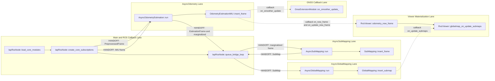

# IAP Topology Graph v0.2 - Swimlane Mainline

Status: v0.2 (L3 anchors completed)
Scope: odometry + sub-mapping + global-mapping + gnss + viewer
Depth policy: each lane expanded to L3 with concrete source anchors

## 1. Lane Entry Functions

| Lane | L0 Entry | Class | Source |
|---|---|---|---|
| T0_Main | load_core_modules / create_core_subscriptions / queue_bridge_loop | glim::IapRosNode | [src/iap/apps/iap_rosnode.cpp](src/iap/apps/iap_rosnode.cpp#L195), [src/iap/apps/iap_rosnode.cpp](src/iap/apps/iap_rosnode.cpp#L254), [src/iap/apps/iap_rosnode.cpp](src/iap/apps/iap_rosnode.cpp#L389) |
| T1_Odom | run | glim::AsyncOdometryEstimation | [src/iap/src/iap/odometry/async_odometry_estimation.cpp](src/iap/src/iap/odometry/async_odometry_estimation.cpp#L55) |
| T2_Bridge | queue_bridge_loop | glim::IapRosNode | [src/iap/apps/iap_rosnode.cpp](src/iap/apps/iap_rosnode.cpp#L389) |
| T3_Sub | run | glim::AsyncSubMapping | [src/iap/src/iap/mapping/async_sub_mapping.cpp](src/iap/src/iap/mapping/async_sub_mapping.cpp#L47) |
| T4_Global | run | glim::AsyncGlobalMapping | [src/iap/src/iap/mapping/async_global_mapping.cpp](src/iap/src/iap/mapping/async_global_mapping.cpp#L77) |
| T5_GNSS | on_smoother_update_ | iap::GnssExtensionModule | [src/iap/src/iap/gnss/gnss_extension.cpp](src/iap/src/iap/gnss/gnss_extension.cpp#L535) |
| T6_Viewer | odometry_new_frame | glim::RvizViewer | [src/iap/src/iap/util/rviz_viewer.cpp](src/iap/src/iap/util/rviz_viewer.cpp#L104) |

## 2. Per-Lane L1-L3 Expansion With Anchors

### T0_Main

| Chain | Level | Function | Class | Anchor |
|---|---|---|---|---|
| Module load | L0 | load_core_modules | glim::IapRosNode | [src/iap/apps/iap_rosnode.cpp](src/iap/apps/iap_rosnode.cpp#L195) |
| Module load | L1 | OdometryEstimationBase::load_module | glim::OdometryEstimationBase | [src/iap/src/iap/odometry/odometry_estimation_base.cpp](src/iap/src/iap/odometry/odometry_estimation_base.cpp#L28) |
| Module load | L1 | SubMappingBase::load_module | glim::SubMappingBase | [src/iap/src/iap/mapping/sub_mapping_base.cpp](src/iap/src/iap/mapping/sub_mapping_base.cpp#L27) |
| Module load | L1 | GlobalMappingBase::load_module | glim::GlobalMappingBase | [src/iap/src/iap/mapping/global_mapping_base.cpp](src/iap/src/iap/mapping/global_mapping_base.cpp#L33) |
| Module load | L2 | load_module_from_so | glim::load_module_from_so | [src/iap/include/iap/util/load_module.hpp](src/iap/include/iap/util/load_module.hpp#L12) |
| Module load | L3 | load_symbol (dlopen + dlsym) | glim::load_symbol | [src/iap/src/iap/util/load_module.cpp](src/iap/src/iap/util/load_module.cpp#L15) |
| Sensor ingress | L0 | create_core_subscriptions | glim::IapRosNode | [src/iap/apps/iap_rosnode.cpp](src/iap/apps/iap_rosnode.cpp#L254) |
| Sensor ingress | L1 | IMU callback lambda | glim::IapRosNode | [src/iap/apps/iap_rosnode.cpp](src/iap/apps/iap_rosnode.cpp#L260) |
| Sensor ingress | L2 | validate_imu_stamp | glim::TimeKeeper | [src/iap/apps/iap_rosnode.cpp](src/iap/apps/iap_rosnode.cpp#L266) |
| Sensor ingress | L3 | AsyncOdometryEstimation::insert_imu | glim::AsyncOdometryEstimation | [src/iap/src/iap/odometry/async_odometry_estimation.cpp](src/iap/src/iap/odometry/async_odometry_estimation.cpp#L24) |
| Sensor ingress | L3 | AsyncSubMapping::insert_imu and AsyncGlobalMapping::insert_imu | glim::AsyncSubMapping / glim::AsyncGlobalMapping | [src/iap/src/iap/mapping/async_sub_mapping.cpp](src/iap/src/iap/mapping/async_sub_mapping.cpp#L20), [src/iap/src/iap/mapping/async_global_mapping.cpp](src/iap/src/iap/mapping/async_global_mapping.cpp#L36) |
| Sensor ingress | L1 | PointCloud callback lambda | glim::IapRosNode | [src/iap/apps/iap_rosnode.cpp](src/iap/apps/iap_rosnode.cpp#L287) |
| Sensor ingress | L2 | preprocessor_->preprocess | glim::CloudPreprocessor | [src/iap/apps/iap_rosnode.cpp](src/iap/apps/iap_rosnode.cpp#L306) |
| Sensor ingress | L3 | AsyncOdometryEstimation::insert_frame | glim::AsyncOdometryEstimation | [src/iap/src/iap/odometry/async_odometry_estimation.cpp](src/iap/src/iap/odometry/async_odometry_estimation.cpp#L30) |

### T1_Odom

| Level | Function | Class | Anchor |
|---|---|---|---|
| L0 | AsyncOdometryEstimation::run | glim::AsyncOdometryEstimation | [src/iap/src/iap/odometry/async_odometry_estimation.cpp](src/iap/src/iap/odometry/async_odometry_estimation.cpp#L55) |
| L1 | input_imu_queue.get_all_and_clear / input_frame_queue.get_all_and_clear | glim::ConcurrentVector | [src/iap/src/iap/odometry/async_odometry_estimation.cpp](src/iap/src/iap/odometry/async_odometry_estimation.cpp#L63) |
| L1 | odometry_estimation->insert_imu | glim::OdometryEstimationBase | [src/iap/src/iap/odometry/async_odometry_estimation.cpp](src/iap/src/iap/odometry/async_odometry_estimation.cpp#L88) |
| L1 | odometry_estimation->insert_frame | glim::OdometryEstimationBase | [src/iap/src/iap/odometry/async_odometry_estimation.cpp](src/iap/src/iap/odometry/async_odometry_estimation.cpp#L126) |
| L1 | IMU gate raw_frame.scan_end_time <= last_imu_time | glim::AsyncOdometryEstimation | [src/iap/src/iap/odometry/async_odometry_estimation.cpp](src/iap/src/iap/odometry/async_odometry_estimation.cpp#L109) |
| L2 | OdometryEstimationIMU::insert_frame | glim::OdometryEstimationIMU | [src/iap/src/iap/odometry/odometry_estimation_imu.cpp](src/iap/src/iap/odometry/odometry_estimation_imu.cpp#L168) |
| L3 | create_factors (CPU path) | glim::OdometryEstimationCPU | [src/iap/src/iap/odometry/odometry_estimation_cpu.cpp](src/iap/src/iap/odometry/odometry_estimation_cpu.cpp#L103) |
| L3 | create_factors (GPU path) | glim::OdometryEstimationGPU | [src/iap/src/iap/odometry/odometry_estimation_gpu.cpp](src/iap/src/iap/odometry/odometry_estimation_gpu.cpp#L267) |
| L3 | on_smoother_update callback slot fanout | glim::OdometryEstimationCallbacks | [src/iap/src/iap/odometry/odometry_estimation_imu.cpp](src/iap/src/iap/odometry/odometry_estimation_imu.cpp#L428) |
| L3 | update_smoother | glim::OdometryEstimationIMU | [src/iap/src/iap/odometry/odometry_estimation_imu.cpp](src/iap/src/iap/odometry/odometry_estimation_imu.cpp#L601) |
| L3 | update_frames | glim::OdometryEstimationIMU | [src/iap/src/iap/odometry/odometry_estimation_imu.cpp](src/iap/src/iap/odometry/odometry_estimation_imu.cpp#L491) |
| L3 | get_remaining_frames (end-of-sequence flush) | glim::OdometryEstimationIMU | [src/iap/src/iap/odometry/odometry_estimation_imu.cpp](src/iap/src/iap/odometry/odometry_estimation_imu.cpp#L474) |

### T2_Bridge

| Level | Function | Class | Anchor |
|---|---|---|---|
| L0 | queue_bridge_loop | glim::IapRosNode | [src/iap/apps/iap_rosnode.cpp](src/iap/apps/iap_rosnode.cpp#L389) |
| L1 | async_odom_->get_results | glim::AsyncOdometryEstimation | [src/iap/apps/iap_rosnode.cpp](src/iap/apps/iap_rosnode.cpp#L394) |
| L2 | output_estimation_results.get_all_and_clear | glim::ConcurrentVector | [src/iap/src/iap/odometry/async_odometry_estimation.cpp](src/iap/src/iap/odometry/async_odometry_estimation.cpp#L51) |
| L2 | output_marginalized_frames.get_all_and_clear | glim::ConcurrentVector | [src/iap/src/iap/odometry/async_odometry_estimation.cpp](src/iap/src/iap/odometry/async_odometry_estimation.cpp#L52) |
| L1 | async_sub_->insert_frame | glim::AsyncSubMapping | [src/iap/apps/iap_rosnode.cpp](src/iap/apps/iap_rosnode.cpp#L398) |
| L1 | async_sub_->get_results | glim::AsyncSubMapping | [src/iap/apps/iap_rosnode.cpp](src/iap/apps/iap_rosnode.cpp#L403) |
| L1 | async_global_->insert_submap | glim::AsyncGlobalMapping | [src/iap/apps/iap_rosnode.cpp](src/iap/apps/iap_rosnode.cpp#L406) |
| L3 | fixed polling cadence 5 ms | glim::IapRosNode | [src/iap/apps/iap_rosnode.cpp](src/iap/apps/iap_rosnode.cpp#L408) |

### T3_Sub

| Level | Function | Class | Anchor |
|---|---|---|---|
| L0 | AsyncSubMapping::run | glim::AsyncSubMapping | [src/iap/src/iap/mapping/async_sub_mapping.cpp](src/iap/src/iap/mapping/async_sub_mapping.cpp#L47) |
| L1 | sub_mapping->get_submaps and output_submap_queue.insert | glim::AsyncSubMapping | [src/iap/src/iap/mapping/async_sub_mapping.cpp](src/iap/src/iap/mapping/async_sub_mapping.cpp#L49) |
| L1 | sub_mapping->insert_imu | glim::SubMappingBase | [src/iap/src/iap/mapping/async_sub_mapping.cpp](src/iap/src/iap/mapping/async_sub_mapping.cpp#L71) |
| L1 | sub_mapping->insert_frame | glim::SubMappingBase | [src/iap/src/iap/mapping/async_sub_mapping.cpp](src/iap/src/iap/mapping/async_sub_mapping.cpp#L81) |
| L2 | SubMapping::insert_frame | glim::SubMapping | [src/iap/src/iap/mapping/sub_mapping.cpp](src/iap/src/iap/mapping/sub_mapping.cpp#L104) |
| L3 | SubMapping::insert_keyframe | glim::SubMapping | [src/iap/src/iap/mapping/sub_mapping.cpp](src/iap/src/iap/mapping/sub_mapping.cpp#L339) |
| L3 | SubMapping::create_submap | glim::SubMapping | [src/iap/src/iap/mapping/sub_mapping.cpp](src/iap/src/iap/mapping/sub_mapping.cpp#L415) |
| L3 | SubMapping::get_submaps | glim::SubMapping | [src/iap/src/iap/mapping/sub_mapping.cpp](src/iap/src/iap/mapping/sub_mapping.cpp#L503) |
| L3 | SubMapping::submit_end_of_sequence | glim::SubMapping | [src/iap/src/iap/mapping/sub_mapping.cpp](src/iap/src/iap/mapping/sub_mapping.cpp#L509) |

### T4_Global

| Level | Function | Class | Anchor |
|---|---|---|---|
| L0 | AsyncGlobalMapping::run | glim::AsyncGlobalMapping | [src/iap/src/iap/mapping/async_global_mapping.cpp](src/iap/src/iap/mapping/async_global_mapping.cpp#L77) |
| L1 | global_mapping->insert_imu | glim::GlobalMappingBase | [src/iap/src/iap/mapping/async_global_mapping.cpp](src/iap/src/iap/mapping/async_global_mapping.cpp#L112) |
| L1 | global_mapping->insert_submap | glim::GlobalMappingBase | [src/iap/src/iap/mapping/async_global_mapping.cpp](src/iap/src/iap/mapping/async_global_mapping.cpp#L123) |
| L1 | global_mapping->optimize / recover_graph / find_overlapping_submaps | glim::GlobalMappingBase | [src/iap/src/iap/mapping/async_global_mapping.cpp](src/iap/src/iap/mapping/async_global_mapping.cpp#L91), [src/iap/src/iap/mapping/async_global_mapping.cpp](src/iap/src/iap/mapping/async_global_mapping.cpp#L98), [src/iap/src/iap/mapping/async_global_mapping.cpp](src/iap/src/iap/mapping/async_global_mapping.cpp#L86) |
| L2 | GlobalMapping::insert_submap | glim::GlobalMapping | [src/iap/src/iap/mapping/global_mapping.cpp](src/iap/src/iap/mapping/global_mapping.cpp#L134) |
| L3 | GlobalMapping::create_between_factors | glim::GlobalMapping | [src/iap/src/iap/mapping/global_mapping.cpp](src/iap/src/iap/mapping/global_mapping.cpp#L391) |
| L3 | GlobalMapping::create_matching_cost_factors | glim::GlobalMapping | [src/iap/src/iap/mapping/global_mapping.cpp](src/iap/src/iap/mapping/global_mapping.cpp#L442) |
| L3 | GlobalMapping::update_isam2 | glim::GlobalMapping | [src/iap/src/iap/mapping/global_mapping.cpp](src/iap/src/iap/mapping/global_mapping.cpp#L509) |
| L3 | GlobalMapping::recover_graph | glim::GlobalMapping | [src/iap/src/iap/mapping/global_mapping.cpp](src/iap/src/iap/mapping/global_mapping.cpp#L929) |

### T5_GNSS

| Chain | Level | Function | Class | Anchor |
|---|---|---|---|---|
| GNSS ingest | L0 | on_range_meas_ | iap::GnssExtensionModule | [src/iap/src/iap/gnss/gnss_extension.cpp](src/iap/src/iap/gnss/gnss_extension.cpp#L339) |
| GNSS ingest | L1 | gnss_comm::msg2meas and epoch conversion | iap::GnssExtensionModule | [src/iap/src/iap/gnss/gnss_extension.cpp](src/iap/src/iap/gnss/gnss_extension.cpp#L349) |
| GNSS ingest | L2 | gnss_handler_->insert_epoch | iap::GnssHandler | [src/iap/src/iap/gnss/gnss_handler.cpp](src/iap/src/iap/gnss/gnss_handler.cpp#L20) |
| GNSS inject | L0 | on_smoother_update_ | iap::GnssExtensionModule | [src/iap/src/iap/gnss/gnss_extension.cpp](src/iap/src/iap/gnss/gnss_extension.cpp#L535) |
| GNSS inject | L1 | gnss_handler_->get_factors | iap::GnssHandler | [src/iap/src/iap/gnss/gnss_handler.cpp](src/iap/src/iap/gnss/gnss_handler.cpp#L46) |
| GNSS inject | L2 | PseudorangeFactor and DopplerFactor creation | iap::GnssHandler | [src/iap/src/iap/gnss/gnss_handler.cpp](src/iap/src/iap/gnss/gnss_handler.cpp#L74), [src/iap/src/iap/gnss/gnss_handler.cpp](src/iap/src/iap/gnss/gnss_handler.cpp#L90) |
| GNSS inject | L2 | E(0)/R(0) one-time insertion and priors | iap::GnssExtensionModule | [src/iap/src/iap/gnss/gnss_extension.cpp](src/iap/src/iap/gnss/gnss_extension.cpp#L568) |
| GNSS inject | L2 | ensure C(frame_id) and stamp keepalive | iap::GnssExtensionModule | [src/iap/src/iap/gnss/gnss_extension.cpp](src/iap/src/iap/gnss/gnss_extension.cpp#L596) |
| GNSS inject | L3 | ClockBetweenFactor chaining C(prev)->C(curr) | iap::GnssExtensionModule | [src/iap/src/iap/gnss/gnss_extension.cpp](src/iap/src/iap/gnss/gnss_extension.cpp#L653) |
| GNSS post-opt | L0 | on_smoother_update_finish_ | iap::GnssExtensionModule | [src/iap/src/iap/gnss/gnss_extension.cpp](src/iap/src/iap/gnss/gnss_extension.cpp#L776) |
| GNSS post-opt | L1 | smoother.calculateEstimate(C(frame_id)) | iap::GnssExtensionModule | [src/iap/src/iap/gnss/gnss_extension.cpp](src/iap/src/iap/gnss/gnss_extension.cpp#L798) |
| GNSS post-opt | L2 | evaluate PR/DOP residuals from last injected factors | iap::GnssExtensionModule | [src/iap/src/iap/gnss/gnss_extension.cpp](src/iap/src/iap/gnss/gnss_extension.cpp#L827) |

### T6_Viewer

| Chain | Level | Function | Class | Anchor |
|---|---|---|---|---|
| Callback registration | L0 | set_callbacks | glim::RvizViewer | [src/iap/src/iap/util/rviz_viewer.cpp](src/iap/src/iap/util/rviz_viewer.cpp#L97) |
| Callback registration | L1 | on_new_frame / on_update_new_frame registration | glim::RvizViewer | [src/iap/src/iap/util/rviz_viewer.cpp](src/iap/src/iap/util/rviz_viewer.cpp#L99) |
| Callback registration | L1 | on_update_submaps registration | glim::RvizViewer | [src/iap/src/iap/util/rviz_viewer.cpp](src/iap/src/iap/util/rviz_viewer.cpp#L101) |
| Frame materialization | L0 | odometry_new_frame | glim::RvizViewer | [src/iap/src/iap/util/rviz_viewer.cpp](src/iap/src/iap/util/rviz_viewer.cpp#L104) |
| Frame materialization | L1 | trajectory->add_odom and odom2world | glim::RvizViewer | [src/iap/src/iap/util/rviz_viewer.cpp](src/iap/src/iap/util/rviz_viewer.cpp#L177) |
| Frame materialization | L2 | TF publish and odom/pose publish branches | glim::RvizViewer | [src/iap/src/iap/util/rviz_viewer.cpp](src/iap/src/iap/util/rviz_viewer.cpp#L191), [src/iap/src/iap/util/rviz_viewer.cpp](src/iap/src/iap/util/rviz_viewer.cpp#L257) |
| Frame materialization | L3 | frame_to_pointcloud2 for points/aligned_points | glim::RvizViewer | [src/iap/src/iap/util/rviz_viewer.cpp](src/iap/src/iap/util/rviz_viewer.cpp#L340), [src/iap/src/iap/util/rviz_viewer.cpp](src/iap/src/iap/util/rviz_viewer.cpp#L360) |
| Global map materialization | L0 | globalmap_on_update_submaps | glim::RvizViewer | [src/iap/src/iap/util/rviz_viewer.cpp](src/iap/src/iap/util/rviz_viewer.cpp#L384) |
| Global map materialization | L1 | invoke | glim::RvizViewer | [src/iap/src/iap/util/rviz_viewer.cpp](src/iap/src/iap/util/rviz_viewer.cpp#L436) |
| Global map materialization | L2 | spin_once queue swap and execute | glim::RvizViewer | [src/iap/src/iap/util/rviz_viewer.cpp](src/iap/src/iap/util/rviz_viewer.cpp#L441) |

## 3. Swimlane Graph (L0-L1)

## 4. Node Index With Class and Source Anchors

| Node | Function | Class | Source |
|---|---|---|---|
| M0 | load_core_modules | glim::IapRosNode | [src/iap/apps/iap_rosnode.cpp](src/iap/apps/iap_rosnode.cpp#L195) |
| M1 | create_core_subscriptions | glim::IapRosNode | [src/iap/apps/iap_rosnode.cpp](src/iap/apps/iap_rosnode.cpp#L254) |
| M2 | queue_bridge_loop | glim::IapRosNode | [src/iap/apps/iap_rosnode.cpp](src/iap/apps/iap_rosnode.cpp#L389) |
| O0 | run | glim::AsyncOdometryEstimation | [src/iap/src/iap/odometry/async_odometry_estimation.cpp](src/iap/src/iap/odometry/async_odometry_estimation.cpp#L55) |
| O1 | insert_frame | glim::OdometryEstimationIMU | [src/iap/src/iap/odometry/odometry_estimation_imu.cpp](src/iap/src/iap/odometry/odometry_estimation_imu.cpp#L168) |
| S0 | run | glim::AsyncSubMapping | [src/iap/src/iap/mapping/async_sub_mapping.cpp](src/iap/src/iap/mapping/async_sub_mapping.cpp#L47) |
| S1 | insert_frame | glim::SubMapping | [src/iap/src/iap/mapping/sub_mapping.cpp](src/iap/src/iap/mapping/sub_mapping.cpp#L104) |
| G0 | run | glim::AsyncGlobalMapping | [src/iap/src/iap/mapping/async_global_mapping.cpp](src/iap/src/iap/mapping/async_global_mapping.cpp#L77) |
| G1 | insert_submap | glim::GlobalMapping | [src/iap/src/iap/mapping/global_mapping.cpp](src/iap/src/iap/mapping/global_mapping.cpp#L134) |
| N0 | on_smoother_update_ | iap::GnssExtensionModule | [src/iap/src/iap/gnss/gnss_extension.cpp](src/iap/src/iap/gnss/gnss_extension.cpp#L535) |
| V0 | odometry_new_frame | glim::RvizViewer | [src/iap/src/iap/util/rviz_viewer.cpp](src/iap/src/iap/util/rviz_viewer.cpp#L104) |
| V1 | globalmap_on_update_submaps | glim::RvizViewer | [src/iap/src/iap/util/rviz_viewer.cpp](src/iap/src/iap/util/rviz_viewer.cpp#L384) |

## 5. Cross-File Consistency Targets

1. Keep per-function read/write and local variable details aligned with [src/iap/docs/topology/20_function_cards.md](src/iap/docs/topology/20_function_cards.md).
2. Keep lifecycle semantics aligned with [src/iap/docs/topology/30_variable_ledger.md](src/iap/docs/topology/30_variable_ledger.md).
3. Keep handoff payload/backpressure/callback order aligned with [src/iap/docs/topology/40_cross_thread_handoffs.md](src/iap/docs/topology/40_cross_thread_handoffs.md).
